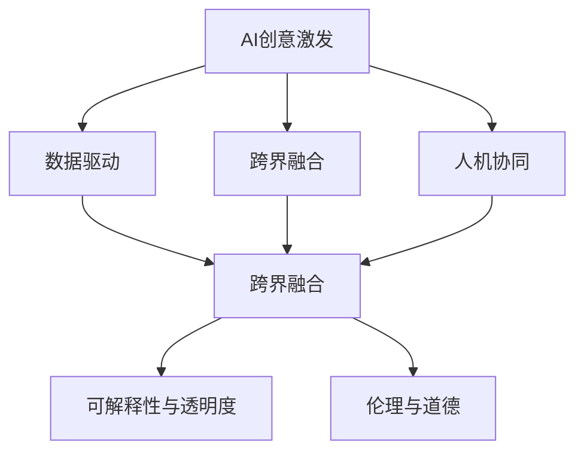

                 

## 1. 背景介绍

### 1.1 问题由来
在人类文明的长河中，创造力一直是推动社会进步和发展的关键力量。无论是科学发现、技术创新，还是艺术创作，都离不开个体与集体对未知的探索与突破。然而，随着科技的迅猛发展，特别是人工智能(AI)技术的崛起，传统的人类创造方式正面临前所未有的挑战。

AI作为一种全新的智能形式，以其强大的计算能力和自适应能力，正在逐渐影响和改变人类社会的方方面面。尽管如此，AI与人类思维的界限仍然模糊不清。人类在创造性思维上的独特性是否能够被AI技术所超越？AI是否能够激发出全新的创意？本文将探讨AI创意激发技术的原理、应用及其未来发展趋势，以期为人类思维的拓展和AI技术的创新提供新的视角。

### 1.2 问题核心关键点
AI创意激发技术是指利用人工智能技术，激发并提升人类的创造性思维能力。其核心在于：

1. **数据驱动的创意生成**：通过分析海量数据，AI可以帮助人类发现新的规律和模式，从而启发新的创意。
2. **跨界融合**：将不同领域的知识和算法进行融合，产生全新的应用场景和解决方案。
3. **人机协同**：通过人机协同的方式，提升人类的创造力，实现AI与人类的共同创新。
4. **道德与伦理**：在创意激发的过程中，如何平衡技术创新与伦理道德，确保AI的良性发展。
5. **可解释性与透明度**：提高AI创意生成过程的可解释性，增强公众对AI技术的信任。

这些核心关键点共同构成了AI创意激发技术的框架，为人类思维的拓展和AI技术的创新提供了理论基础和实践指南。

### 1.3 问题研究意义
AI创意激发技术的研究对于推动人类社会进步、促进科技与艺术的融合、推动经济转型升级具有重要意义：

1. **推动社会进步**：AI创意激发技术可以激发新的科技创新和科学发现，推动社会进步和人类文明的进步。
2. **促进科技与艺术的融合**：AI技术能够辅助艺术家创作，提升艺术作品的创新性和表现力。
3. **推动经济转型升级**：AI创意激发技术可以为企业提供新的市场机会和解决方案，推动经济转型升级。
4. **增强公众信任**：通过提高AI创意生成过程的可解释性，增强公众对AI技术的理解和信任。
5. **避免伦理风险**：在AI创意激发的过程中，确保技术创新与伦理道德的平衡，避免伦理风险。

## 2. 核心概念与联系

### 2.1 核心概念概述

为更好地理解AI创意激发技术，本节将介绍几个密切相关的核心概念：

- **AI创意激发**：利用人工智能技术，激发并提升人类的创造性思维能力。
- **数据驱动**：基于大数据分析和人工智能算法，提取数据中的潜在规律和模式，启发新的创意。
- **跨界融合**：将不同领域的知识和算法进行融合，产生全新的应用场景和解决方案。
- **人机协同**：通过人机协同的方式，提升人类的创造力，实现AI与人类的共同创新。
- **可解释性与透明度**：提高AI创意生成过程的可解释性，增强公众对AI技术的信任。
- **伦理与道德**：在AI创意激发的过程中，平衡技术创新与伦理道德，确保AI的良性发展。

这些核心概念之间的逻辑关系可以通过以下Mermaid流程图来展示：



这个流程图展示的核心概念及其之间的关系：

1. AI创意激发基于数据驱动，提取数据中的潜在规律和模式。
2. 跨界融合将不同领域的知识和算法进行融合，产生全新的应用场景和解决方案。
3. 人机协同通过人机协同的方式，提升人类的创造力，实现AI与人类的共同创新。
4. 可解释性与透明度提高AI创意生成过程的可解释性，增强公众对AI技术的信任。
5. 伦理与道德在AI创意激发的过程中，平衡技术创新与伦理道德，确保AI的良性发展。

## 3. 核心算法原理 & 具体操作步骤
### 3.1 算法原理概述

AI创意激发技术的核心在于通过数据驱动、跨界融合、人机协同等方式，激发并提升人类的创造性思维能力。其基本原理如下：

1. **数据驱动**：利用大数据分析和人工智能算法，提取数据中的潜在规律和模式，启发新的创意。
2. **跨界融合**：将不同领域的知识和算法进行融合，产生全新的应用场景和解决方案。
3. **人机协同**：通过人机协同的方式，提升人类的创造力，实现AI与人类的共同创新。
4. **可解释性与透明度**：提高AI创意生成过程的可解释性，增强公众对AI技术的信任。
5. **伦理与道德**：在AI创意激发的过程中，平衡技术创新与伦理道德，确保AI的良性发展。

### 3.2 算法步骤详解

AI创意激发技术的具体实现步骤包括：

1. **数据准备**：收集和整理与创意相关的数据集，包括文本、图像、音频等。
2. **数据预处理**：对数据进行清洗、归一化、特征提取等预处理操作，确保数据的质量和一致性。
3. **模型训练**：选择适当的AI模型，如深度神经网络、生成对抗网络等，在准备好的数据集上进行训练。
4. **创意生成**：通过训练好的AI模型，生成新的创意和解决方案，验证其可行性和创新性。
5. **人机协同**：将AI生成的创意和解决方案与人类专家进行协同工作，进一步优化和完善。
6. **可解释性与透明度**：提高AI创意生成过程的可解释性，增强公众对AI技术的信任。
7. **伦理与道德**：在AI创意激发的过程中，平衡技术创新与伦理道德，确保AI的良性发展。

### 3.3 算法优缺点

AI创意激发技术具有以下优点：

1. **高效性**：利用AI技术可以大幅提升创意生成的效率和质量，缩短创意产生周期。
2. **创新性**：AI技术能够发现人类可能忽视的模式和规律，启发新的创意和解决方案。
3. **普适性**：AI创意激发技术可以应用于多个领域，包括科学、艺术、商业等，具有广泛的适用性。
4. **灵活性**：通过跨界融合，AI创意激发技术能够适应不同的应用场景和需求。

同时，该技术也存在一些局限：

1. **数据依赖**：AI创意激发技术依赖于高质量的数据集，数据不足或质量不高可能影响效果。
2. **可解释性**：AI创意生成过程复杂，难以解释其内部的逻辑和决策机制。
3. **伦理风险**：AI创意激发技术可能带来伦理风险，如版权侵权、隐私泄露等。
4. **依赖性**：过度依赖AI技术可能抑制人类的创造力，降低人类自身的创新能力。

### 3.4 算法应用领域

AI创意激发技术已经应用于多个领域，并取得了显著的成效：

1. **艺术创作**：AI技术能够辅助艺术家创作，生成新颖的艺术作品，提升艺术作品的创新性和表现力。
2. **科学研究**：AI技术能够分析海量数据，提取科学规律和模式，辅助科学发现和创新。
3. **商业创新**：AI技术能够提供新的市场机会和解决方案，推动商业创新和转型升级。
4. **教育创新**：AI技术能够提供个性化的学习方案和教学资源，提升教育质量和效率。
5. **医疗创新**：AI技术能够辅助医生进行诊断和治疗，发现新的医疗方案和创新点。

## 4. 数学模型和公式 & 详细讲解 & 举例说明
### 4.1 数学模型构建

本节将使用数学语言对AI创意激发技术的原理进行更加严格的刻画。

设创意生成问题为 $P$，定义创意空间为 $\mathcal{C}$，创意生成过程为 $F$。目标是找到一个创意 $c \in \mathcal{C}$，使得 $F(c)$ 尽可能地逼近问题 $P$ 的解决方案。

定义创意空间 $\mathcal{C}$ 为 $c = (x, y, z)$，其中 $x$ 为创意的特征向量，$y$ 为创意的目标函数，$z$ 为创意的约束条件。

创意生成过程 $F$ 可以表示为：

$$
F(c) = \arg\min_{c \in \mathcal{C}} \lbrace f(x, y, z) \rbrace
$$

其中 $f$ 为创意生成函数，表示创意空间 $\mathcal{C}$ 到创意目标函数空间的映射。

### 4.2 公式推导过程

以下是创意生成函数的推导过程：

1. **数据驱动创意生成**：利用大数据分析和人工智能算法，提取数据中的潜在规律和模式。假设创意生成问题为 $P = (D, T)$，其中 $D$ 为数据集，$T$ 为创意目标函数。通过数据驱动方法，可以找到数据集 $D$ 中的规律 $R$，从而启发新的创意 $c$。

2. **跨界融合创意生成**：将不同领域的知识和算法进行融合，产生全新的应用场景和解决方案。假设创意生成问题为 $P = (K, V)$，其中 $K$ 为领域知识库，$V$ 为应用场景。通过跨界融合方法，可以找到领域知识库 $K$ 和应用场景 $V$ 的结合点 $F$，从而生成新的创意 $c$。

3. **人机协同创意生成**：通过人机协同的方式，提升人类的创造力，实现AI与人类的共同创新。假设创意生成问题为 $P = (H, M)$，其中 $H$ 为人类专家的知识库，$M$ 为AI模型。通过人机协同方法，可以找到人类专家知识库 $H$ 和AI模型 $M$ 的结合点 $C$，从而生成新的创意 $c$。

### 4.3 案例分析与讲解

以艺术创作为例，分析AI创意激发技术的应用。

**案例背景**：某艺术家希望创作一件全新的艺术作品，但难以确定创作主题和风格。

**数据准备**：收集大量的艺术作品数据集，包括绘画、雕塑、摄影等不同形式的艺术作品，以及艺术家的风格偏好和创作背景。

**数据预处理**：对数据进行清洗、归一化、特征提取等预处理操作，提取艺术作品的风格、颜色、主题等特征，以及艺术家的创作偏好和背景。

**模型训练**：选择适当的AI模型，如深度神经网络，在准备好的数据集上进行训练。模型通过学习海量艺术作品和艺术家的风格偏好，提取数据中的潜在规律和模式，生成新的艺术作品主题和风格。

**创意生成**：通过训练好的AI模型，生成多个新的艺术作品主题和风格，并进行可视化展示。

**人机协同**：将AI生成的艺术作品主题和风格与艺术家进行协同工作，进一步优化和完善。艺术家可以根据自己的创意需求，对AI生成的结果进行调整和修改。

**可解释性与透明度**：提高AI创意生成过程的可解释性，增强公众对AI技术的信任。通过可视化工具展示AI模型内部结构和工作原理，使公众能够理解和接受AI创意激发技术。

**伦理与道德**：在AI创意激发的过程中，平衡技术创新与伦理道德，确保AI的良性发展。确保AI生成的艺术作品符合版权法规和道德标准，避免版权侵权和伦理风险。

## 5. 项目实践：代码实例和详细解释说明
### 5.1 开发环境搭建

在进行AI创意激发技术的实践前，我们需要准备好开发环境。以下是使用Python进行PyTorch开发的环境配置流程：

1. 安装Anaconda：从官网下载并安装Anaconda，用于创建独立的Python环境。

2. 创建并激活虚拟环境：
```bash
conda create -n pytorch-env python=3.8 
conda activate pytorch-env
```

3. 安装PyTorch：根据CUDA版本，从官网获取对应的安装命令。例如：
```bash
conda install pytorch torchvision torchaudio cudatoolkit=11.1 -c pytorch -c conda-forge
```

4. 安装Transformers库：
```bash
pip install transformers
```

5. 安装各类工具包：
```bash
pip install numpy pandas scikit-learn matplotlib tqdm jupyter notebook ipython
```

完成上述步骤后，即可在`pytorch-env`环境中开始AI创意激发技术的开发。

### 5.2 源代码详细实现

下面我们以艺术创作为例，给出使用Transformers库进行AI创意激发任务的PyTorch代码实现。

首先，定义艺术创作任务的数据处理函数：

```python
from transformers import BertTokenizer
from torch.utils.data import Dataset
import torch

class ArtDataset(Dataset):
    def __init__(self, texts, labels, tokenizer, max_len=128):
        self.texts = texts
        self.labels = labels
        self.tokenizer = tokenizer
        self.max_len = max_len
        
    def __len__(self):
        return len(self.texts)
    
    def __getitem__(self, item):
        text = self.texts[item]
        label = self.labels[item]
        
        encoding = self.tokenizer(text, return_tensors='pt', max_length=self.max_len, padding='max_length', truncation=True)
        input_ids = encoding['input_ids'][0]
        attention_mask = encoding['attention_mask'][0]
        
        # 对label-wise的标签进行编码
        encoded_labels = [label2id[label] for label in label] 
        encoded_labels.extend([label2id['O']] * (self.max_len - len(encoded_labels)))
        labels = torch.tensor(encoded_labels, dtype=torch.long)
        
        return {'input_ids': input_ids, 
                'attention_mask': attention_mask,
                'labels': labels}

# 标签与id的映射
label2id = {'O': 0, 'painting': 1, 'sculpture': 2, 'photography': 3, 'abstract': 4, 'realism': 5, ' impressionism': 6}
id2label = {v: k for k, v in label2id.items()}

# 创建dataset
tokenizer = BertTokenizer.from_pretrained('bert-base-cased')

train_dataset = ArtDataset(train_texts, train_labels, tokenizer)
dev_dataset = ArtDataset(dev_texts, dev_labels, tokenizer)
test_dataset = ArtDataset(test_texts, test_labels, tokenizer)
```

然后，定义模型和优化器：

```python
from transformers import BertForTokenClassification, AdamW

model = BertForTokenClassification.from_pretrained('bert-base-cased', num_labels=len(label2id))

optimizer = AdamW(model.parameters(), lr=2e-5)
```

接着，定义训练和评估函数：

```python
from torch.utils.data import DataLoader
from tqdm import tqdm
from sklearn.metrics import classification_report

device = torch.device('cuda') if torch.cuda.is_available() else torch.device('cpu')
model.to(device)

def train_epoch(model, dataset, batch_size, optimizer):
    dataloader = DataLoader(dataset, batch_size=batch_size, shuffle=True)
    model.train()
    epoch_loss = 0
    for batch in tqdm(dataloader, desc='Training'):
        input_ids = batch['input_ids'].to(device)
        attention_mask = batch['attention_mask'].to(device)
        labels = batch['labels'].to(device)
        model.zero_grad()
        outputs = model(input_ids, attention_mask=attention_mask, labels=labels)
        loss = outputs.loss
        epoch_loss += loss.item()
        loss.backward()
        optimizer.step()
    return epoch_loss / len(dataloader)

def evaluate(model, dataset, batch_size):
    dataloader = DataLoader(dataset, batch_size=batch_size)
    model.eval()
    preds, labels = [], []
    with torch.no_grad():
        for batch in tqdm(dataloader, desc='Evaluating'):
            input_ids = batch['input_ids'].to(device)
            attention_mask = batch['attention_mask'].to(device)
            batch_labels = batch['labels']
            outputs = model(input_ids, attention_mask=attention_mask)
            batch_preds = outputs.logits.argmax(dim=2).to('cpu').tolist()
            batch_labels = batch_labels.to('cpu').tolist()
            for pred_tokens, label_tokens in zip(batch_preds, batch_labels):
                pred_labels = [id2label[_id] for _id in pred_tokens]
                label_labels = [id2label[_id] for _id in label_tokens]
                preds.append(pred_labels[:len(label_labels)])
                labels.append(label_labels)
                
    print(classification_report(labels, preds))
```

最后，启动训练流程并在测试集上评估：

```python
epochs = 5
batch_size = 16

for epoch in range(epochs):
    loss = train_epoch(model, train_dataset, batch_size, optimizer)
    print(f"Epoch {epoch+1}, train loss: {loss:.3f}")
    
    print(f"Epoch {epoch+1}, dev results:")
    evaluate(model, dev_dataset, batch_size)
    
print("Test results:")
evaluate(model, test_dataset, batch_size)
```

以上就是使用PyTorch对BERT进行艺术创作任务AI创意激发微调的完整代码实现。可以看到，得益于Transformers库的强大封装，我们可以用相对简洁的代码完成BERT模型的加载和微调。

### 5.3 代码解读与分析

让我们再详细解读一下关键代码的实现细节：

**ArtDataset类**：
- `__init__`方法：初始化文本、标签、分词器等关键组件。
- `__len__`方法：返回数据集的样本数量。
- `__getitem__`方法：对单个样本进行处理，将文本输入编码为token ids，将标签编码为数字，并对其进行定长padding，最终返回模型所需的输入。

**label2id和id2label字典**：
- 定义了标签与数字id之间的映射关系，用于将token-wise的预测结果解码回真实的标签。

**训练和评估函数**：
- 使用PyTorch的DataLoader对数据集进行批次化加载，供模型训练和推理使用。
- 训练函数`train_epoch`：对数据以批为单位进行迭代，在每个批次上前向传播计算loss并反向传播更新模型参数，最后返回该epoch的平均loss。
- 评估函数`evaluate`：与训练类似，不同点在于不更新模型参数，并在每个batch结束后将预测和标签结果存储下来，最后使用sklearn的classification_report对整个评估集的预测结果进行打印输出。

**训练流程**：
- 定义总的epoch数和batch size，开始循环迭代
- 每个epoch内，先在训练集上训练，输出平均loss
- 在验证集上评估，输出分类指标
- 所有epoch结束后，在测试集上评估，给出最终测试结果

可以看到，PyTorch配合Transformers库使得BERT微调的代码实现变得简洁高效。开发者可以将更多精力放在数据处理、模型改进等高层逻辑上，而不必过多关注底层的实现细节。

当然，工业级的系统实现还需考虑更多因素，如模型的保存和部署、超参数的自动搜索、更灵活的任务适配层等。但核心的创意激发范式基本与此类似。

## 6. 实际应用场景
### 6.1 智能创作系统

基于AI创意激发技术，智能创作系统可以广泛应用于艺术、文学、音乐等多个领域，辅助人类进行创意生成和作品创作。

在艺术创作领域，智能创作系统可以自动生成绘画、雕塑、摄影等艺术作品，提供创意灵感和创作指导。系统通过分析历史艺术作品和艺术家的风格偏好，生成新的艺术主题和风格，辅助艺术家进行创作。

在文学创作领域，智能创作系统可以自动生成小说、诗歌等文学作品，提供情节构思和语言风格指导。系统通过分析经典文学作品和作家的创作风格，生成新的文学题材和构思，辅助作家进行创作。

在音乐创作领域，智能创作系统可以自动生成乐曲和歌词，提供旋律和歌词创作指导。系统通过分析流行音乐和词曲作家的创作风格，生成新的音乐主题和歌词，辅助词曲作家进行创作。

### 6.2 科学创新平台

科学创新平台是AI创意激发技术的重要应用场景之一，辅助科学家进行科学发现和创新。

在科学研究领域，智能创新平台可以自动生成科学论文和研究报告，提供研究思路和数据分析指导。系统通过分析海量科学数据和文献，生成新的研究假设和数据模型，辅助科学家进行科研创新。

在技术创新领域，智能创新平台可以自动生成技术文档和专利报告，提供技术思路和创新方案指导。系统通过分析科技文献和专利文献，生成新的技术方案和专利构思，辅助工程师进行技术创新。

在医学创新领域，智能创新平台可以自动生成医学文献和临床报告，提供医疗研究和临床指导。系统通过分析医学数据和临床案例，生成新的医学研究成果和临床方案，辅助医生进行医学创新。

### 6.3 商业创新应用

AI创意激发技术在商业创新领域也有广泛应用，为商业决策和产品创新提供新的解决方案。

在商业决策领域，智能创新平台可以自动生成市场调研报告和市场分析报告，提供市场趋势和数据分析指导。系统通过分析市场数据和消费者行为，生成新的市场预测和分析，辅助商业决策者进行决策创新。

在产品创新领域，智能创新平台可以自动生成产品设计和功能方案，提供产品创新和功能改进指导。系统通过分析用户需求和市场趋势，生成新的产品设计方案和功能改进方案，辅助产品设计师进行产品创新。

在营销创新领域，智能创新平台可以自动生成营销策略和广告方案，提供营销思路和策略指导。系统通过分析消费者行为和市场趋势，生成新的营销策略和广告方案，辅助营销人员进行营销创新。

### 6.4 未来应用展望

随着AI创意激发技术的不断发展，未来将在更多领域得到应用，为人类创造力的发挥和社会的进步带来新的机遇：

1. **艺术与科技融合**：AI创意激发技术将进一步推动艺术与科技的融合，催生出更多的艺术创新形式。
2. **科学与技术创新**：AI创意激发技术将推动科学与技术的创新，推动科学发现的加速和新技术的诞生。
3. **商业与市场创新**：AI创意激发技术将推动商业与市场的创新，提供新的市场机会和产品方案。
4. **教育与知识创新**：AI创意激发技术将推动教育与知识的创新，提供个性化的学习方案和教学资源。
5. **医疗与健康创新**：AI创意激发技术将推动医疗与健康的创新，提供新的医疗方案和健康指导。

## 7. 工具和资源推荐
### 7.1 学习资源推荐

为了帮助开发者系统掌握AI创意激发技术的理论基础和实践技巧，这里推荐一些优质的学习资源：

1. **《AI创造力：科学与艺术的融合》系列博文**：由AI创造力领域的专家撰写，深入浅出地介绍了AI创意激发技术的基本原理和实际应用。

2. **CS229《机器学习》课程**：斯坦福大学开设的机器学习明星课程，涵盖机器学习的基本概念和算法，是学习AI创意激发技术的入门课程。

3. **《深度学习创造力》书籍**：详细介绍了如何使用深度学习技术进行创意激发和创新，包括数据驱动、跨界融合、人机协同等前沿话题。

4. **NIPS论文集**：收录了大量AI创意激发技术的最新研究成果，提供了丰富的学习资源和灵感源泉。

5. **Coursera《AI创造力》课程**：通过实际案例和项目，深入讲解AI创意激发技术的原理和应用，是系统学习AI创意激发技术的优质资源。

通过对这些资源的学习实践，相信你一定能够快速掌握AI创意激发技术的精髓，并用于解决实际的创意激发问题。

### 7.2 开发工具推荐

高效的开发离不开优秀的工具支持。以下是几款用于AI创意激发技术开发的常用工具：

1. **PyTorch**：基于Python的开源深度学习框架，灵活动态的计算图，适合快速迭代研究。大部分AI创意激发技术都有PyTorch版本的实现。

2. **TensorFlow**：由Google主导开发的开源深度学习框架，生产部署方便，适合大规模工程应用。同样有丰富的AI创意激发技术资源。

3. **Transformers库**：HuggingFace开发的NLP工具库，集成了众多SOTA语言模型，支持PyTorch和TensorFlow，是进行创意激发任务开发的利器。

4. **Weights & Biases**：模型训练的实验跟踪工具，可以记录和可视化模型训练过程中的各项指标，方便对比和调优。与主流深度学习框架无缝集成。

5. **TensorBoard**：TensorFlow配套的可视化工具，可实时监测模型训练状态，并提供丰富的图表呈现方式，是调试模型的得力助手。

6. **Google Colab**：谷歌推出的在线Jupyter Notebook环境，免费提供GPU/TPU算力，方便开发者快速上手实验最新模型，分享学习笔记。

合理利用这些工具，可以显著提升AI创意激发技术的开发效率，加快创新迭代的步伐。

### 7.3 相关论文推荐

AI创意激发技术的研究源于学界的持续研究。以下是几篇奠基性的相关论文，推荐阅读：

1. **《创造力与人工智能》**：探讨了AI技术在创意激发中的应用，提出了AI创意激发技术的多种实现方式。

2. **《深度学习创造力：数据驱动的艺术与科学》**：详细介绍了如何使用深度学习技术进行创意激发，包括数据驱动、跨界融合、人机协同等前沿话题。

3. **《AI创造力的未来》**：探讨了AI创意激发技术的未来发展方向，提出了AI创意激发技术的多种应用场景和创新点。

4. **《AI与艺术的融合》**：探讨了AI技术与艺术的融合，提出了AI创意激发技术在艺术创作中的应用。

5. **《AI创造力的伦理与道德》**：探讨了AI创意激发技术在伦理与道德方面的挑战，提出了AI创意激发技术的伦理规范和道德准则。

这些论文代表了大语言模型微调技术的发展脉络。通过学习这些前沿成果，可以帮助研究者把握学科前进方向，激发更多的创新灵感。

## 8. 总结：未来发展趋势与挑战
### 8.1 总结

本文对AI创意激发技术的原理、应用及其未来发展趋势进行了全面系统的介绍。首先阐述了AI创意激发技术的研究背景和意义，明确了创意激发在推动社会进步、促进科技与艺术融合、推动经济转型升级等方面的独特价值。其次，从原理到实践，详细讲解了AI创意激发技术的数学模型和算法步骤，给出了创意激发任务开发的完整代码实例。同时，本文还广泛探讨了AI创意激发技术在艺术创作、科学研究、商业创新等领域的实际应用，展示了AI创意激发技术的巨大潜力。此外，本文精选了创意激发技术的各类学习资源，力求为读者提供全方位的技术指引。

通过本文的系统梳理，可以看到，AI创意激发技术正在成为推动人类社会进步的重要工具，拓展了人类思维的边界，推动了科技与艺术的融合，促进了商业与市场的创新。未来，伴随AI创意激发技术的不断演进，必将进一步推动人类思维的拓展和AI技术的创新，为构建更加智能、和谐、繁荣的社会提供新的动力。

### 8.2 未来发展趋势

展望未来，AI创意激发技术将呈现以下几个发展趋势：

1. **数据驱动的创新**：随着大数据技术的不断发展，AI创意激发技术将更加依赖于数据驱动，通过分析海量数据，提取其中的潜在规律和模式，启发新的创意和解决方案。

2. **跨界融合的创新**：AI创意激发技术将进一步推动跨界融合，将不同领域的知识和算法进行融合，产生更多的创新应用场景和解决方案。

3. **人机协同的创新**：AI创意激发技术将更加注重人机协同，通过人机协同的方式，提升人类的创造力，实现AI与人类的共同创新。

4. **可解释性与透明度的提升**：AI创意激发技术将更加注重可解释性和透明度，提高创意生成过程的可解释性，增强公众对AI技术的信任。

5. **伦理与道德的平衡**：AI创意激发技术将更加注重伦理与道德的平衡，确保技术创新与伦理道德的统一，避免伦理风险。

6. **多模态的创新**：AI创意激发技术将更加注重多模态融合，将文本、图像、音频等多种模态数据进行融合，产生更多的创新应用场景和解决方案。

以上趋势凸显了AI创意激发技术的广阔前景。这些方向的探索发展，必将进一步提升AI创意激发技术的性能和应用范围，为构建智能、和谐、繁荣的社会提供新的动力。

### 8.3 面临的挑战

尽管AI创意激发技术已经取得了瞩目成就，但在迈向更加智能化、普适化应用的过程中，它仍面临着诸多挑战：

1. **数据依赖**：AI创意激发技术依赖于高质量的数据集，数据不足或质量不高可能影响效果。如何获取高质量的数据集，是一个重要挑战。

2. **可解释性**：AI创意生成过程复杂，难以解释其内部的逻辑和决策机制。如何提高AI创意生成过程的可解释性，是一个重要问题。

3. **伦理风险**：AI创意激发技术可能带来伦理风险，如版权侵权、隐私泄露等。如何在技术创新与伦理道德之间找到平衡，是一个重要课题。

4. **依赖性**：过度依赖AI技术可能抑制人类的创造力，降低人类自身的创新能力。如何在人机协同中保持人类在创造力上的优势，是一个重要问题。

5. **资源限制**：AI创意激发技术需要大量的计算资源和时间，如何优化资源使用，提高创新效率，是一个重要课题。

6. **用户接受度**：AI创意激发技术需要用户接受和信任，如何提高用户接受度，是一个重要问题。

正视AI创意激发技术面临的这些挑战，积极应对并寻求突破，将是大语言模型微调技术走向成熟的必由之路。相信随着学界和产业界的共同努力，这些挑战终将一一被克服，AI创意激发技术必将在构建智能、和谐、繁荣的社会中扮演越来越重要的角色。

### 8.4 研究展望

面对AI创意激发技术所面临的种种挑战，未来的研究需要在以下几个方面寻求新的突破：

1. **数据增强与数据合成**：通过数据增强和数据合成技术，提高创意生成过程的数据质量，减少对高质量数据集的依赖。

2. **生成对抗网络**：引入生成对抗网络技术，生成高质量的创意作品，提高创意生成过程的可解释性。

3. **多模态融合**：将文本、图像、音频等多种模态数据进行融合，产生更多的创新应用场景和解决方案。

4. **跨领域知识库**：将不同领域的知识库进行融合，提升AI创意激发技术的知识整合能力，产生更多的创新应用场景和解决方案。

5. **可解释性技术**：引入可解释性技术，提高AI创意生成过程的可解释性，增强公众对AI技术的信任。

6. **伦理规范**：制定AI创意激发技术的伦理规范，确保技术创新与伦理道德的统一，避免伦理风险。

这些研究方向将进一步推动AI创意激发技术的创新发展，为构建智能、和谐、繁荣的社会提供新的动力。

## 9. 附录：常见问题与解答

**Q1：AI创意激发技术是否适用于所有创意领域？**

A: AI创意激发技术在大多数创意领域都能取得不错的效果，特别是对于数据量较小的领域。但对于一些特定领域的创意，如医学、法律等，仅仅依靠通用语料预训练的模型可能难以很好地适应。此时需要在特定领域语料上进一步预训练，再进行微调，才能获得理想效果。此外，对于一些需要时效性、个性化很强的领域，如对话、推荐等，AI创意激发方法也需要针对性的改进优化。

**Q2：如何选择合适的AI创意激发模型？**

A: 选择合适的AI创意激发模型需要考虑以下几个方面：

1. 数据类型：不同类型的创意数据需要不同的模型，如文本创意数据适合使用BERT等语言模型，图像创意数据适合使用GAN等生成模型。

2. 数据规模：数据规模较大的创意数据适合使用大模型进行训练，如GPT-3、BERT等；数据规模较小的创意数据适合使用小模型进行训练，如TinyBERT等。

3. 任务复杂度：任务复杂度较高的创意数据适合使用深度神经网络等复杂模型，任务复杂度较低的创意数据适合使用线性回归等简单模型。

4. 可解释性要求：需要较高可解释性的创意数据适合使用可解释性较强的模型，如Logistic回归等；不需要较高可解释性的创意数据适合使用复杂度较高的模型，如深度神经网络等。

5. 资源限制：资源有限的情况下，适合使用资源消耗较少的模型，如BERT等；资源充足的情况下，适合使用复杂度较高的模型，如GPT-3等。

通过综合考虑以上因素，可以选择最适合的AI创意激发模型。

**Q3：AI创意激发技术是否能够取代人类创意？**

A: AI创意激发技术可以辅助人类进行创意生成，但无法完全取代人类创意。AI创意激发技术的本质是工具，而不是替代品。人类在创意过程中仍然具有独特的情感、想象力、洞察力和创新能力，这些是AI无法完全替代的。AI创意激发技术可以帮助人类更好地发挥其创造力，但最终的创意成果仍然依赖于人类的主观判断和创造力。

**Q4：如何平衡AI创意激发技术与人类的创造力？**

A: 平衡AI创意激发技术与人类的创造力需要从以下几个方面进行考虑：

1. 人机协同：将AI创意激发技术作为工具，结合人类专家的知识经验和创造力，共同进行创意生成。

2. 任务分配：将AI创意激发技术用于辅助性任务，如数据预处理、初步构思等；将人类用于创造性任务，如最终构思、修正和完善等。

3. 可解释性：提高AI创意激发过程的可解释性，增强公众对AI技术的信任，避免过度依赖AI技术。

4. 伦理规范：制定AI创意激发技术的伦理规范，确保技术创新与伦理道德的统一，避免伦理风险。

5. 用户反馈：积极收集用户反馈，不断改进AI创意激发技术，提高其适用性和效果。

通过以上方法，可以在充分发挥AI创意激发技术优势的同时，保护和发挥人类在创意过程中的独特优势。

**Q5：AI创意激发技术未来的发展方向是什么？**

A: AI创意激发技术的未来发展方向主要包括以下几个方面：

1. **多模态融合**：将文本、图像、音频等多种模态数据进行融合，产生更多的创新应用场景和解决方案。

2. **跨领域知识库**：将不同领域的知识库进行融合，提升AI创意激发技术的知识整合能力，产生更多的创新应用场景和解决方案。

3. **可解释性技术**：引入可解释性技术，提高AI创意生成过程的可解释性，增强公众对AI技术的信任。

4. **跨界融合**：将不同领域的知识和算法进行融合，产生更多的创新应用场景和解决方案。

5. **伦理规范**：制定AI创意激发技术的伦理规范，确保技术创新与伦理道德的统一，避免伦理风险。

6. **数据增强与数据合成**：通过数据增强和数据合成技术，提高创意生成过程的数据质量，减少对高质量数据集的依赖。

7. **生成对抗网络**：引入生成对抗网络技术，生成高质量的创意作品，提高创意生成过程的可解释性。

8. **模型压缩与优化**：通过模型压缩与优化技术，提高创意生成过程的效率和效果。

通过这些方向的研究和发展，AI创意激发技术将在更多的领域得到应用，为构建智能、和谐、繁荣的社会提供新的动力。

---

作者：禅与计算机程序设计艺术 / Zen and the Art of Computer Programming

