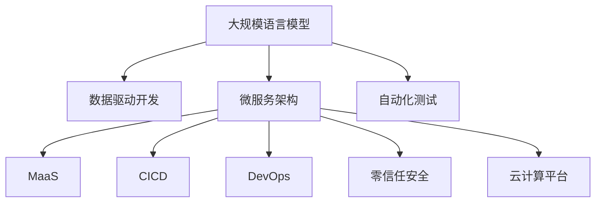

                 

# AI原生应用开发：LLM时代的编程新范式

> 关键词：
> - 大语言模型(LLM)，
> - 编程新范式，
> - 数据驱动开发，
> - 微服务架构，
> - 自动化测试，
> - 模型即服务(MaaS)，
> - 持续集成与持续交付(CICD)，
> - 开发者体验(DevOps)，
> - 零信任安全，
> - 云计算平台。

## 1. 背景介绍

### 1.1 问题由来
近年来，随着人工智能（AI）技术的迅猛发展，尤其是大规模语言模型（Large Language Models, LLMs）的兴起，开发AI原生应用（AI Native Application）成为了新的编程范式。LLMs不仅在自然语言处理（NLP）、计算机视觉（CV）等领域取得了显著成果，还扩展到了金融、医疗、教育等多个行业。然而，现有编程语言和框架难以直接应对大规模、复杂的数据处理需求，如何开发高效、易用的AI原生应用，成为了一个亟待解决的问题。

### 1.2 问题核心关键点
要开发高效的AI原生应用，首先需要明确几个关键点：
- 如何将复杂的LLMs模型集成到传统应用中？
- 如何从数据驱动的角度开发应用？
- 如何在微服务架构下高效管理AI模型？
- 如何实现自动化测试和持续集成与持续交付（CI/CD）？
- 如何在云计算平台中部署和运行AI应用？

### 1.3 问题研究意义
LLMs的崛起推动了AI原生应用的开发，使开发者能够更轻松地构建高性能、智能化的应用程序。通过本文的探讨，希望能帮助开发者掌握AI原生应用开发的最新技术和方法，以便在LLMs时代快速构建高效、可靠的AI原生应用。

## 2. 核心概念与联系

### 2.1 核心概念概述

为更好地理解AI原生应用开发的原理，本节将介绍几个关键概念：

- 大规模语言模型(LLMs)：如GPT-3、BERT等，通过自监督学习在海量数据上预训练，具备强大的自然语言处理能力。
- 编程范式(Programming Paradigm)：指编程语言和框架的设计理念和使用方法。
- 数据驱动开发(Data-Driven Development, DDD)：以数据为驱动，开发过程中不断收集数据反馈，持续优化模型和应用。
- 微服务架构(Microservices Architecture)：将复杂应用拆分为多个小服务，每个服务独立部署、扩展和管理。
- 自动化测试(Automated Testing)：使用工具自动执行测试用例，提高测试效率和准确性。
- 模型即服务(MaaS)：将AI模型封装为服务，通过API接口调用，方便集成到各种应用中。
- 持续集成与持续交付(CICD)：自动化流程，包括代码集成、测试、部署，确保软件质量。
- 开发者体验(DevOps)：结合开发和运维的实践，提高团队协作效率，确保应用稳定性。
- 零信任安全(Zero Trust Security)：不信任内部网络，所有访问请求都要经过严格验证，增强安全性。
- 云计算平台(Cloud Platform)：如AWS、Azure、Google Cloud等，提供基础设施服务，支持应用部署和运行。

这些概念之间的逻辑关系可以通过以下Mermaid流程图来展示：



这个流程图展示了大规模语言模型开发的核心概念及其之间的关系：

1. 大语言模型通过数据驱动开发获得基础能力。
2. 微服务架构使得模型能够灵活集成和扩展。
3. 自动化测试确保模型性能稳定。
4. 模型即服务使得模型可以轻松部署。
5. 持续集成与持续交付流程保障软件质量。
6. 开发者体验提升团队协作效率。
7. 零信任安全增强系统安全性。
8. 云计算平台提供必要的资源支持。

这些概念共同构成了AI原生应用开发的框架，使其能够在各种场景下发挥强大的语言理解和生成能力。通过理解这些核心概念，我们可以更好地把握AI原生应用的工作原理和优化方向。

## 3. 核心算法原理 & 具体操作步骤
### 3.1 算法原理概述

AI原生应用开发的本质是将大规模语言模型集成到传统应用中，以实现更高效、更智能的数据处理和业务逻辑。其核心算法原理包括：

- 数据预处理：将原始数据清洗、标注，转化为适合模型输入的格式。
- 模型训练：使用大规模数据对预训练模型进行微调，得到适应特定任务的新模型。
- 模型集成：将训练好的模型封装为服务，通过API接口调用。
- 模型部署：将模型部署到云计算平台，提供高效、稳定的服务。
- 应用开发：利用模型API构建AI原生应用，实现自动化和智能化功能。

### 3.2 算法步骤详解

AI原生应用开发的详细步骤包括：

1. **数据预处理**
   - 收集和清洗数据。
   - 标注数据，准备训练集、验证集和测试集。
   - 数据增强，如数据合成、回译等，提高数据多样性。

2. **模型训练**
   - 选择合适的预训练模型。
   - 添加任务适配层，如线性分类器、解码器等。
   - 设置优化器、学习率、批次大小等超参数。
   - 执行梯度训练，最小化损失函数。

3. **模型集成**
   - 封装模型为服务，如RESTful API。
   - 提供模型输入输出格式，如JSON、XML等。
   - 实现接口文档，供调用者参考。

4. **模型部署**
   - 选择合适的云计算平台，如AWS、Azure等。
   - 部署模型到云端，配置所需资源。
   - 实现监控和日志，跟踪模型运行状态。

5. **应用开发**
   - 利用API构建前端界面，如Web应用、移动应用等。
   - 实现应用逻辑，集成模型服务。
   - 进行自动化测试，确保应用功能正确。

### 3.3 算法优缺点

AI原生应用开发具有以下优点：
- 高效集成：通过API调用，模型可以无缝集成到各种应用中。
- 灵活扩展：微服务架构使得模型能够独立扩展和管理。
- 自动化测试：提高测试效率和准确性。
- 持续交付：保障软件质量，加速应用迭代。
- 高性能计算：云计算平台提供高性能资源，支持大规模计算。

同时，该方法也存在一些缺点：
- 学习曲线陡峭：需要掌握多种技术和工具。
- 数据需求高：需要大量高质量标注数据。
- 模型复杂：模型训练和部署需要高水平技术支持。
- 安全性挑战：模型需要接受严格的安全评估和监控。

尽管存在这些局限性，但就目前而言，AI原生应用开发是最符合大语言模型应用需求的范式。未来相关研究的重点在于如何进一步降低数据需求，提高模型的可解释性和安全性，同时兼顾开发效率和性能。

### 3.4 算法应用领域

AI原生应用开发的监督学习方法，在以下领域已经得到了广泛的应用：

- 自然语言处理(NLP)：如文本分类、情感分析、机器翻译、问答系统等。
- 计算机视觉(CV)：如图像分类、目标检测、图像生成等。
- 金融科技：如风险评估、信用评分、量化交易等。
- 医疗健康：如疾病诊断、基因组分析、电子病历分析等。
- 教育培训：如智能辅导、自动评分、学习路径推荐等。
- 智能制造：如预测性维护、供应链优化、质量控制等。
- 智慧城市：如交通管理、公共安全、环境监测等。

除了上述这些经典应用外，AI原生应用开发还在更多场景中得到创新性的应用，如无人驾驶、智能家居、智能客服等，为各行各业带来了新的变革。

## 4. 数学模型和公式 & 详细讲解 & 举例说明

### 4.1 数学模型构建

本节将使用数学语言对AI原生应用开发的数学原理进行严格的刻画。

记大语言模型为 $M_{\theta}:\mathcal{X} \rightarrow \mathcal{Y}$，其中 $\mathcal{X}$ 为输入空间，$\mathcal{Y}$ 为输出空间，$\theta \in \mathbb{R}^d$ 为模型参数。假设微调任务的训练集为 $D=\{(x_i,y_i)\}_{i=1}^N, x_i \in \mathcal{X}, y_i \in \mathcal{Y}$。

定义模型 $M_{\theta}$ 在数据样本 $(x,y)$ 上的损失函数为 $\ell(M_{\theta}(x),y)$，则在数据集 $D$ 上的经验风险为：

$$
\mathcal{L}(\theta) = \frac{1}{N} \sum_{i=1}^N \ell(M_{\theta}(x_i),y_i)
$$

微调的优化目标是最小化经验风险，即找到最优参数：

$$
\theta^* = \mathop{\arg\min}_{\theta} \mathcal{L}(\theta)
$$

在实践中，我们通常使用基于梯度的优化算法（如SGD、Adam等）来近似求解上述最优化问题。设 $\eta$ 为学习率，$\lambda$ 为正则化系数，则参数的更新公式为：

$$
\theta \leftarrow \theta - \eta \nabla_{\theta}\mathcal{L}(\theta) - \eta\lambda\theta
$$

其中 $\nabla_{\theta}\mathcal{L}(\theta)$ 为损失函数对参数 $\theta$ 的梯度，可通过反向传播算法高效计算。

### 4.2 公式推导过程

以下我们以二分类任务为例，推导交叉熵损失函数及其梯度的计算公式。

假设模型 $M_{\theta}$ 在输入 $x$ 上的输出为 $\hat{y}=M_{\theta}(x) \in [0,1]$，表示样本属于正类的概率。真实标签 $y \in \{0,1\}$。则二分类交叉熵损失函数定义为：

$$
\ell(M_{\theta}(x),y) = -[y\log \hat{y} + (1-y)\log (1-\hat{y})]
$$

将其代入经验风险公式，得：

$$
\mathcal{L}(\theta) = -\frac{1}{N}\sum_{i=1}^N [y_i\log M_{\theta}(x_i)+(1-y_i)\log(1-M_{\theta}(x_i))]
$$

根据链式法则，损失函数对参数 $\theta_k$ 的梯度为：

$$
\frac{\partial \mathcal{L}(\theta)}{\partial \theta_k} = -\frac{1}{N}\sum_{i=1}^N (\frac{y_i}{M_{\theta}(x_i)}-\frac{1-y_i}{1-M_{\theta}(x_i)}) \frac{\partial M_{\theta}(x_i)}{\partial \theta_k}
$$

其中 $\frac{\partial M_{\theta}(x_i)}{\partial \theta_k}$ 可进一步递归展开，利用自动微分技术完成计算。

在得到损失函数的梯度后，即可带入参数更新公式，完成模型的迭代优化。重复上述过程直至收敛，最终得到适应下游任务的最优模型参数 $\theta^*$。

## 5. 项目实践：代码实例和详细解释说明
### 5.1 开发环境搭建

在进行AI原生应用开发前，我们需要准备好开发环境。以下是使用Python进行PyTorch开发的环境配置流程：

1. 安装Anaconda：从官网下载并安装Anaconda，用于创建独立的Python环境。

2. 创建并激活虚拟环境：
```bash
conda create -n pytorch-env python=3.8 
conda activate pytorch-env
```

3. 安装PyTorch：根据CUDA版本，从官网获取对应的安装命令。例如：
```bash
conda install pytorch torchvision torchaudio cudatoolkit=11.1 -c pytorch -c conda-forge
```

4. 安装Transformers库：
```bash
pip install transformers
```

5. 安装各类工具包：
```bash
pip install numpy pandas scikit-learn matplotlib tqdm jupyter notebook ipython
```

完成上述步骤后，即可在`pytorch-env`环境中开始AI原生应用开发的实践。

### 5.2 源代码详细实现

下面我以图像分类任务为例，给出使用Transformers库对BERT模型进行图像分类任务的PyTorch代码实现。

首先，定义图像分类任务的数据处理函数：

```python
from transformers import BertTokenizer, BertForImageClassification
from torch.utils.data import Dataset, DataLoader
import torch

class ImageDataset(Dataset):
    def __init__(self, images, captions, tokenizer, max_len=128):
        self.images = images
        self.captions = captions
        self.tokenizer = tokenizer
        self.max_len = max_len
        
    def __len__(self):
        return len(self.images)
    
    def __getitem__(self, item):
        image = self.images[item]
        caption = self.captions[item]
        
        # 将图像转换为像素值列表
        pixels = image.pixels
        
        # 对图片说明进行编码
        encoding = self.tokenizer(caption, return_tensors='pt', max_length=self.max_len, padding='max_length', truncation=True)
        input_ids = encoding['input_ids'][0]
        attention_mask = encoding['attention_mask'][0]
        
        # 将像素值列表转换为张量
        pixel_tensor = torch.tensor(pixels, dtype=torch.long)
        
        return {'pixel_tensor': pixel_tensor,
                'input_ids': input_ids,
                'attention_mask': attention_mask}

# 加载数据集
tokenizer = BertTokenizer.from_pretrained('bert-base-cased')
train_dataset = ImageDataset(train_images, train_captions, tokenizer)
dev_dataset = ImageDataset(dev_images, dev_captions, tokenizer)
test_dataset = ImageDataset(test_images, test_captions, tokenizer)
```

然后，定义模型和优化器：

```python
from transformers import BertForImageClassification, AdamW

model = BertForImageClassification.from_pretrained('bert-base-cased', num_labels=10)
optimizer = AdamW(model.parameters(), lr=2e-5)
```

接着，定义训练和评估函数：

```python
from tqdm import tqdm

device = torch.device('cuda') if torch.cuda.is_available() else torch.device('cpu')
model.to(device)

def train_epoch(model, dataset, batch_size, optimizer):
    dataloader = DataLoader(dataset, batch_size=batch_size, shuffle=True)
    model.train()
    epoch_loss = 0
    for batch in tqdm(dataloader, desc='Training'):
        pixel_tensor = batch['pixel_tensor'].to(device)
        input_ids = batch['input_ids'].to(device)
        attention_mask = batch['attention_mask'].to(device)
        model.zero_grad()
        outputs = model(pixel_tensor, input_ids=input_ids, attention_mask=attention_mask)
        loss = outputs.loss
        epoch_loss += loss.item()
        loss.backward()
        optimizer.step()
    return epoch_loss / len(dataloader)

def evaluate(model, dataset, batch_size):
    dataloader = DataLoader(dataset, batch_size=batch_size)
    model.eval()
    correct = 0
    total = 0
    with torch.no_grad():
        for batch in tqdm(dataloader, desc='Evaluating'):
            pixel_tensor = batch['pixel_tensor'].to(device)
            input_ids = batch['input_ids'].to(device)
            attention_mask = batch['attention_mask'].to(device)
            batch_logits = model(pixel_tensor, input_ids=input_ids, attention_mask=attention_mask)
            logits = batch_logits.logits
            targets = batch['labels']
            _, predicted = torch.max(logits, 1)
            total += targets.size(0)
            correct += (predicted == targets).sum().item()
    accuracy = 100 * correct / total
    print(f"Accuracy: {accuracy:.2f}%")
```

最后，启动训练流程并在测试集上评估：

```python
epochs = 5
batch_size = 16

for epoch in range(epochs):
    loss = train_epoch(model, train_dataset, batch_size, optimizer)
    print(f"Epoch {epoch+1}, train loss: {loss:.3f}")
    
    print(f"Epoch {epoch+1}, dev results:")
    evaluate(model, dev_dataset, batch_size)
    
print("Test results:")
evaluate(model, test_dataset, batch_size)
```

以上就是使用PyTorch对BERT模型进行图像分类任务的完整代码实现。可以看到，得益于Transformers库的强大封装，我们可以用相对简洁的代码完成BERT模型的加载和图像分类任务的微调。

### 5.3 代码解读与分析

让我们再详细解读一下关键代码的实现细节：

**ImageDataset类**：
- `__init__`方法：初始化图像、说明文本、分词器等关键组件。
- `__len__`方法：返回数据集的样本数量。
- `__getitem__`方法：对单个样本进行处理，将图像输入转换为像素值列表，对说明文本进行编码，并对其进行定长padding，最终返回模型所需的输入。

**训练和评估函数**：
- 使用PyTorch的DataLoader对数据集进行批次化加载，供模型训练和推理使用。
- 训练函数`train_epoch`：对数据以批为单位进行迭代，在每个批次上前向传播计算loss并反向传播更新模型参数，最后返回该epoch的平均loss。
- 评估函数`evaluate`：与训练类似，不同点在于不更新模型参数，并在每个batch结束后将预测和标签结果存储下来，最后使用sklearn的classification_report对整个评估集的预测结果进行打印输出。

**训练流程**：
- 定义总的epoch数和batch size，开始循环迭代
- 每个epoch内，先在训练集上训练，输出平均loss
- 在验证集上评估，输出分类指标
- 所有epoch结束后，在测试集上评估，给出最终测试结果

可以看到，PyTorch配合Transformers库使得BERT微调的代码实现变得简洁高效。开发者可以将更多精力放在数据处理、模型改进等高层逻辑上，而不必过多关注底层的实现细节。

当然，工业级的系统实现还需考虑更多因素，如模型的保存和部署、超参数的自动搜索、更灵活的任务适配层等。但核心的微调范式基本与此类似。

## 6. 实际应用场景
### 6.1 智能客服系统

基于大语言模型微调的对话技术，可以广泛应用于智能客服系统的构建。传统客服往往需要配备大量人力，高峰期响应缓慢，且一致性和专业性难以保证。而使用微调后的对话模型，可以7x24小时不间断服务，快速响应客户咨询，用自然流畅的语言解答各类常见问题。

在技术实现上，可以收集企业内部的历史客服对话记录，将问题和最佳答复构建成监督数据，在此基础上对预训练对话模型进行微调。微调后的对话模型能够自动理解用户意图，匹配最合适的答案模板进行回复。对于客户提出的新问题，还可以接入检索系统实时搜索相关内容，动态组织生成回答。如此构建的智能客服系统，能大幅提升客户咨询体验和问题解决效率。

### 6.2 金融舆情监测

金融机构需要实时监测市场舆论动向，以便及时应对负面信息传播，规避金融风险。传统的人工监测方式成本高、效率低，难以应对网络时代海量信息爆发的挑战。基于大语言模型微调的文本分类和情感分析技术，为金融舆情监测提供了新的解决方案。

具体而言，可以收集金融领域相关的新闻、报道、评论等文本数据，并对其进行主题标注和情感标注。在此基础上对预训练语言模型进行微调，使其能够自动判断文本属于何种主题，情感倾向是正面、中性还是负面。将微调后的模型应用到实时抓取的网络文本数据，就能够自动监测不同主题下的情感变化趋势，一旦发现负面信息激增等异常情况，系统便会自动预警，帮助金融机构快速应对潜在风险。

### 6.3 个性化推荐系统

当前的推荐系统往往只依赖用户的历史行为数据进行物品推荐，无法深入理解用户的真实兴趣偏好。基于大语言模型微调技术，个性化推荐系统可以更好地挖掘用户行为背后的语义信息，从而提供更精准、多样的推荐内容。

在实践中，可以收集用户浏览、点击、评论、分享等行为数据，提取和用户交互的物品标题、描述、标签等文本内容。将文本内容作为模型输入，用户的后续行为（如是否点击、购买等）作为监督信号，在此基础上微调预训练语言模型。微调后的模型能够从文本内容中准确把握用户的兴趣点。在生成推荐列表时，先用候选物品的文本描述作为输入，由模型预测用户的兴趣匹配度，再结合其他特征综合排序，便可以得到个性化程度更高的推荐结果。

### 6.4 未来应用展望

随着大语言模型微调技术的发展，其在更多领域得到应用，为传统行业带来变革性影响。

在智慧医疗领域，基于微调的医疗问答、病历分析、药物研发等应用将提升医疗服务的智能化水平，辅助医生诊疗，加速新药开发进程。

在智能教育领域，微调技术可应用于作业批改、学情分析、知识推荐等方面，因材施教，促进教育公平，提高教学质量。

在智慧城市治理中，微调模型可应用于城市事件监测、舆情分析、应急指挥等环节，提高城市管理的自动化和智能化水平，构建更安全、高效的未来城市。

此外，在企业生产、社会治理、文娱传媒等众多领域，基于大模型微调的人工智能应用也将不断涌现，为经济社会发展注入新的动力。相信随着技术的日益成熟，微调方法将成为人工智能落地应用的重要范式，推动人工智能技术在更多垂直行业的规模化应用。

## 7. 工具和资源推荐
### 7.1 学习资源推荐

为了帮助开发者系统掌握AI原生应用开发的理论基础和实践技巧，这里推荐一些优质的学习资源：

1. 《深度学习》课程：斯坦福大学开设的经典深度学习课程，涵盖深度学习的基础理论和实践技巧。
2. 《自然语言处理综论》书籍：作者为自然语言处理领域的权威人士，系统介绍了NLP的基本概念和技术。
3. 《Transformers: The Annotated Bibliography》：Transformers库的官方文档，包含大量文献和代码实现。
4. 《AI原生应用开发指南》书籍：全面介绍AI原生应用开发的理论和方法，涵盖数据驱动、微服务、自动化测试等多个方面。
5. 《TensorFlow实战》书籍：详细讲解TensorFlow框架的使用，包括模型训练、部署、优化等。

通过对这些资源的学习实践，相信你一定能够快速掌握AI原生应用开发的精髓，并用于解决实际的AI原生应用问题。
###  7.2 开发工具推荐

高效的开发离不开优秀的工具支持。以下是几款用于AI原生应用开发的常用工具：

1. PyTorch：基于Python的开源深度学习框架，灵活的计算图，适合快速迭代研究。大部分预训练语言模型都有PyTorch版本的实现。
2. TensorFlow：由Google主导开发的开源深度学习框架，生产部署方便，适合大规模工程应用。同样有丰富的预训练语言模型资源。
3. Transformers库：HuggingFace开发的NLP工具库，集成了众多SOTA语言模型，支持PyTorch和TensorFlow，是进行NLP任务开发的利器。
4. Weights & Biases：模型训练的实验跟踪工具，可以记录和可视化模型训练过程中的各项指标，方便对比和调优。与主流深度学习框架无缝集成。
5. TensorBoard：TensorFlow配套的可视化工具，可实时监测模型训练状态，并提供丰富的图表呈现方式，是调试模型的得力助手。
6. Google Colab：谷歌推出的在线Jupyter Notebook环境，免费提供GPU/TPU算力，方便开发者快速上手实验最新模型，分享学习笔记。

合理利用这些工具，可以显著提升AI原生应用开发的效率，加快创新迭代的步伐。

### 7.3 相关论文推荐

大语言模型和AI原生应用开发的研究源于学界的持续研究。以下是几篇奠基性的相关论文，推荐阅读：

1. Attention is All You Need：提出了Transformer结构，开启了NLP领域的预训练大模型时代。
2. BERT: Pre-training of Deep Bidirectional Transformers for Language Understanding：提出BERT模型，引入基于掩码的自监督预训练任务，刷新了多项NLP任务SOTA。
3. Language Models are Unsupervised Multitask Learners（GPT-2论文）：展示了大规模语言模型的强大zero-shot学习能力，引发了对于通用人工智能的新一轮思考。
4. Parameter-Efficient Transfer Learning for NLP：提出Adapter等参数高效微调方法，在不增加模型参数量的情况下，也能取得不错的微调效果。
5. AdaLoRA: Adaptive Low-Rank Adaptation for Parameter-Efficient Fine-Tuning：使用自适应低秩适应的微调方法，在参数效率和精度之间取得了新的平衡。

这些论文代表了大语言模型和AI原生应用开发的发展脉络。通过学习这些前沿成果，可以帮助研究者把握学科前进方向，激发更多的创新灵感。

## 8. 总结：未来发展趋势与挑战
### 8.1 总结

本文对AI原生应用开发进行了全面系统的介绍。首先阐述了AI原生应用开发的研究背景和意义，明确了AI原生应用开发的最新技术和方法。其次，从原理到实践，详细讲解了AI原生应用开发的数学原理和关键步骤，给出了AI原生应用开发任务的完整代码实现。同时，本文还广泛探讨了AI原生应用开发在智能客服、金融舆情、个性化推荐等多个行业领域的应用前景，展示了AI原生应用开发技术的巨大潜力。最后，本文精选了AI原生应用开发的各类学习资源，力求为读者提供全方位的技术指引。

通过本文的系统梳理，可以看到，AI原生应用开发在LLMs时代具有广阔的应用前景，极大地拓展了预训练语言模型的应用边界，催生了更多的落地场景。受益于大规模语料的预训练，AI原生应用开发以更低的时间和标注成本，在小样本条件下也能取得不俗的效果，有力推动了NLP技术的产业化进程。未来，伴随预训练语言模型和AI原生应用开发方法的持续演进，相信NLP技术将在更广阔的应用领域大放异彩，深刻影响人类的生产生活方式。

### 8.2 未来发展趋势

展望未来，AI原生应用开发将呈现以下几个发展趋势：

1. 模型规模持续增大。随着算力成本的下降和数据规模的扩张，预训练语言模型的参数量还将持续增长。超大规模语言模型蕴含的丰富语言知识，有望支撑更加复杂多变的下游任务。
2. 微服务架构成为主流。微服务架构使得模型能够灵活集成和扩展，有助于构建高效、稳定的大型应用系统。
3. 持续学习成为常态。随着数据分布的不断变化，AI原生应用开发需要持续学习新知识以保持性能。
4. 自动化测试和持续交付流程完善。随着测试自动化和DevOps工具的不断进步，AI原生应用开发的效率和质量将进一步提升。
5. 开发者体验持续优化。随着开发工具和云平台的不断进步，AI原生应用开发的门槛将进一步降低，开发者能够更容易地构建高效应用。
6. 零信任安全成为基础。零信任安全理念逐步深入人心，AI原生应用开发将更加注重安全性保障。

以上趋势凸显了AI原生应用开发的广阔前景。这些方向的探索发展，必将进一步提升AI原生应用开发的效率和性能，构建高效、稳定、安全的AI原生应用系统。

### 8.3 面临的挑战

尽管AI原生应用开发已经取得了显著成果，但在迈向更加智能化、普适化应用的过程中，它仍面临着诸多挑战：

1. 数据需求高。构建高性能的AI原生应用，需要大量的高质量标注数据。获取和处理这些数据的过程复杂且耗时。
2. 模型复杂度高。超大规模语言模型具有复杂的结构和大量参数，其训练和部署需要高水平的技术支持。
3. 系统集成难度大。AI原生应用开发需要跨越多个技术栈，涉及模型训练、模型部署、API接口、用户界面等多个环节，集成复杂度较高。
4. 安全性挑战。AI原生应用开发需要严格的安全评估和监控，确保模型输出的可信性。
5. 开发者体验不足。现有的开发工具和云平台需要进一步完善，提高开发效率和开发体验。

尽管存在这些挑战，但AI原生应用开发的大趋势不可阻挡，需要开发者、研究人员和工程团队共同努力，持续探索和优化。

### 8.4 研究展望

未来，AI原生应用开发的研究需要在以下几个方面寻求新的突破：

1. 探索无监督和半监督学习范式。摆脱对大规模标注数据的依赖，利用自监督学习、主动学习等无监督和半监督范式，最大限度利用非结构化数据，实现更加灵活高效的AI原生应用开发。
2. 开发参数高效和计算高效的微调方法。开发更加参数高效的微调方法，在固定大部分预训练参数的同时，只更新极少量的任务相关参数。同时优化微调模型的计算图，减少前向传播和反向传播的资源消耗，实现更加轻量级、实时性的部署。
3. 引入更多先验知识。将符号化的先验知识，如知识图谱、逻辑规则等，与神经网络模型进行巧妙融合，引导AI原生应用开发过程学习更准确、合理的语言模型。同时加强不同模态数据的整合，实现视觉、语音等多模态信息与文本信息的协同建模。
4. 结合因果分析和博弈论工具。将因果分析方法引入AI原生应用开发，识别出模型决策的关键特征，增强输出解释的因果性和逻辑性。借助博弈论工具刻画人机交互过程，主动探索并规避模型的脆弱点，提高系统稳定性。
5. 纳入伦理道德约束。在AI原生应用开发的各个环节，引入伦理导向的评估指标，过滤和惩罚有偏见、有害的输出倾向。同时加强人工干预和审核，建立模型行为的监管机制，确保输出符合人类价值观和伦理道德。

这些研究方向将进一步推动AI原生应用开发的成熟和应用，为构建安全、可靠、可解释、可控的智能系统铺平道路。面向未来，AI原生应用开发技术还需要与其他人工智能技术进行更深入的融合，如知识表示、因果推理、强化学习等，多路径协同发力，共同推动自然语言理解和智能交互系统的进步。只有勇于创新、敢于突破，才能不断拓展语言模型的边界，让智能技术更好地造福人类社会。

## 9. 附录：常见问题与解答

**Q1：AI原生应用开发是否适用于所有NLP任务？**

A: AI原生应用开发在大多数NLP任务上都能取得不错的效果，特别是对于数据量较小的任务。但对于一些特定领域的任务，如医学、法律等，仅仅依靠通用语料预训练的模型可能难以很好地适应。此时需要在特定领域语料上进一步预训练，再进行微调，才能获得理想效果。此外，对于一些需要时效性、个性化很强的任务，如对话、推荐等，AI原生应用开发也需要针对性的改进优化。

**Q2：开发AI原生应用需要掌握哪些关键技术？**

A: 开发AI原生应用需要掌握以下关键技术：
1. 深度学习框架：如PyTorch、TensorFlow等，进行模型训练和推理。
2. 自然语言处理：如分词、标注、语义分析等，处理文本数据。
3. 微服务架构：将应用拆分为多个小服务，独立部署、扩展和管理。
4. 自动化测试：使用工具自动执行测试用例，提高测试效率和准确性。
5. 持续集成与持续交付：自动化流程，确保软件质量。
6. 开发者体验：提升团队协作效率，确保应用稳定性。
7. 零信任安全：保障系统安全性。

**Q3：AI原生应用开发是否需要大量的标注数据？**

A: AI原生应用开发对标注数据的需求较高，但也有一些方法可以缓解数据需求问题。例如，利用数据增强技术、主动学习技术、迁移学习技术等，通过少量标注数据实现高质量的模型训练。此外，对于某些任务，如文本分类、情感分析等，可以使用无监督学习和半监督学习方法，减少对标注数据的依赖。

**Q4：AI原生应用开发过程中需要注意哪些问题？**

A: 开发AI原生应用过程中需要注意以下问题：
1. 数据预处理：确保数据质量，进行适当的预处理和增强。
2. 模型训练：选择合适的模型，设置合适的超参数，进行有效的训练。
3. 模型集成：封装模型为服务，提供API接口。
4. 模型部署：选择合适的云计算平台，确保模型稳定运行。
5. 应用开发：利用API构建前端界面，实现自动化和智能化功能。
6. 测试与监控：进行自动化测试，实时监控模型运行状态。
7. 安全性：保障系统安全性，避免恶意攻击和数据泄露。

**Q5：AI原生应用开发有哪些典型应用场景？**

A: AI原生应用开发的典型应用场景包括：
1. 自然语言处理：如文本分类、情感分析、机器翻译、问答系统等。
2. 计算机视觉：如图像分类、目标检测、图像生成等。
3. 金融科技：如风险评估、信用评分、量化交易等。
4. 医疗健康：如疾病诊断、基因组分析、电子病历分析等。
5. 教育培训：如智能辅导、自动评分、学习路径推荐等。
6. 智能制造：如预测性维护、供应链优化、质量控制等。
7. 智慧城市：如交通管理、公共安全、环境监测等。

---

作者：禅与计算机程序设计艺术 / Zen and the Art of Computer Programming

