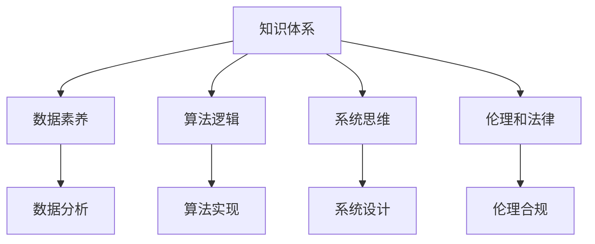

                 

# 经典书籍:夯实认知的基石

## 1. 背景介绍

在快速发展的信息技术时代，认知的基础性作用日益凸显。无论是科学研究、工程实践，还是日常生活中，认知能力的高低直接决定着个人和组织的竞争力。然而，面对复杂多变的环境，如何有效提升个人和团队的认知能力，一直是摆在众多专业人士面前的重大挑战。

### 1.1 问题由来
现代信息技术的高速发展，让人们的生活越来越依赖于智能设备和应用程序。这些设备和应用虽然极大地方便了我们的生活和工作，但也使得人们对于认知基础的需求变得更为迫切。智能化系统能否真正理解和辅助人类决策，在很大程度上取决于人类对知识、数据和算法的认知深度。因此，加强认知基础的建设，显得尤为重要。

### 1.2 问题核心关键点
认知基础的建设涉及多个层面，包括但不限于以下几个关键点：

- **知识体系**：构建完善的知识体系，包括基础知识、专业知识和前沿科技等，是提升认知能力的基石。
- **数据素养**：理解数据的基本概念、处理方法和应用场景，是有效利用数据解决实际问题的前提。
- **算法逻辑**：掌握常见算法的原理和应用，能够根据实际需求设计高效算法，是实现自动化、智能化处理的关键。
- **系统思维**：具备系统性思维，能够从整体上考虑问题，制定合理的解决方案，是复杂系统设计和应用的基础。
- **伦理和法律**：理解技术应用中的伦理和法律问题，确保技术发展的正确方向，是认知能力的重要组成部分。

## 2. 核心概念与联系

### 2.1 核心概念概述

认知基础建设涉及到多个学科和领域，包括计算机科学、统计学、心理学、伦理学、法学等。这些核心概念相互关联，共同构建了一个完整的认知体系。

- **知识体系**：包括基础知识、专业知识和前沿科技，是提升认知能力的基础。
- **数据素养**：对数据的理解、处理和应用能力，是有效解决实际问题的前提。
- **算法逻辑**：常见算法的原理和应用，是实现自动化、智能化处理的关键。
- **系统思维**：从整体上考虑问题的能力，是复杂系统设计和应用的基础。
- **伦理和法律**：理解和应用中的伦理和法律问题，是确保技术发展正确方向的保障。

这些概念之间的逻辑关系可以通过以下Mermaid流程图来展示：



这个流程图展示了这个认知体系的各个部分及其相互关系：

1. 知识体系通过数据素养、算法逻辑、系统思维和伦理和法律等多个层面进行深入学习。
2. 数据素养需要理解和处理数据的基本概念和方法，并能够应用于实际问题中。
3. 算法逻辑需要掌握常见算法的原理和应用，设计高效算法解决复杂问题。
4. 系统思维需要从整体上考虑问题，制定合理的解决方案。
5. 伦理和法律需要对技术应用中的伦理和法律问题进行理解和应用，确保技术发展正确方向。

## 3. 核心算法原理 & 具体操作步骤
### 3.1 算法原理概述

认知基础建设涉及多个核心算法，每个算法都有其独特的原理和操作步骤。本文将详细介绍几种常见的算法，包括数据处理、算法设计和系统设计等。

### 3.2 算法步骤详解

#### 数据处理算法
- **数据收集**：根据具体需求，收集相关的数据源，包括公开数据集、企业数据等。
- **数据清洗**：去除数据中的噪声和异常值，确保数据质量。
- **数据预处理**：包括数据归一化、特征工程等，提高数据适用性。
- **数据存储与管理**：使用合适的数据库或数据仓库，进行高效存储和管理。

#### 算法设计算法
- **算法选择**：根据具体问题选择合适的算法，如回归、分类、聚类、优化等。
- **算法实现**：使用编程语言或专门的算法库实现算法。
- **算法调优**：根据实际结果，调整算法参数，优化算法性能。

#### 系统设计算法
- **需求分析**：明确系统需求，包括功能需求和技术需求等。
- **系统架构设计**：设计合理的系统架构，如模块化、分层等。
- **系统实现**：使用编程语言或专门的开发框架实现系统。
- **系统测试与优化**：进行系统测试，优化系统性能，确保系统稳定性和可靠性。

### 3.3 算法优缺点
#### 数据处理算法的优缺点
- **优点**：
  - 数据处理算法能够提升数据的质量和适用性，为后续分析提供基础。
  - 数据清洗和预处理能够确保数据的准确性和一致性，提高数据分析的可靠性。
- **缺点**：
  - 数据处理算法对数据源和质量要求较高，数据收集和清洗过程较为复杂。
  - 数据处理算法需要大量的时间和计算资源，尤其是在处理大规模数据时。

#### 算法设计算法的优缺点
- **优点**：
  - 算法设计算法能够有效解决实际问题，提高系统的自动化和智能化水平。
  - 通过调整算法参数，可以优化算法性能，适应不同场景的需求。
- **缺点**：
  - 算法设计算法需要一定的数学和编程基础，难度较大。
  - 算法设计算法的选择和实现需要结合实际问题，需要经验和实践积累。

#### 系统设计算法的优缺点
- **优点**：
  - 系统设计算法能够构建高效、可靠的系统，满足用户需求。
  - 系统设计算法通过合理架构设计，提高了系统的可扩展性和可维护性。
- **缺点**：
  - 系统设计算法需要深入理解技术栈和架构设计，难度较大。
  - 系统设计算法需要综合考虑需求和性能，复杂度较高。

### 3.4 算法应用领域

#### 数据处理算法应用
数据处理算法广泛应用于数据分析、数据挖掘、数据可视化等领域。例如，金融领域的信用评分、市场分析，医疗领域的疾病预测、病人分类，社交媒体的情感分析、用户行为分析等。

#### 算法设计算法应用
算法设计算法广泛应用于机器学习、深度学习、计算机视觉等领域。例如，图像识别、语音识别、自然语言处理、推荐系统等。

#### 系统设计算法应用
系统设计算法广泛应用于软件开发、系统架构设计、项目管理等领域。例如，企业信息化系统、供应链管理系统、电子商务平台等。

## 4. 数学模型和公式 & 详细讲解 & 举例说明
### 4.1 数学模型构建

在认知基础建设中，数学模型是理解和解决实际问题的重要工具。常见的数学模型包括回归模型、分类模型、聚类模型等。以下以回归模型为例，展示其构建过程。

### 4.2 公式推导过程

回归模型是用于预测连续型变量的模型，常见的回归模型有线性回归、多项式回归、岭回归等。以线性回归为例，其基本公式为：

$$
y = \beta_0 + \beta_1x_1 + \beta_2x_2 + ... + \beta_nx_n + \epsilon
$$

其中，$y$ 为预测值，$x_1, x_2, ..., x_n$ 为自变量，$\beta_0, \beta_1, ..., \beta_n$ 为回归系数，$\epsilon$ 为随机误差项。

### 4.3 案例分析与讲解

#### 案例一：金融领域的信用评分模型
在金融领域，信用评分模型是用于评估个人或企业信用风险的重要工具。信用评分模型可以通过线性回归模型进行构建，模型输入包括个人收入、资产、负债等数据，输出为信用评分。通过对大量历史数据进行训练，可以建立准确、可靠的信用评分模型，有效预测个人或企业的信用风险。

#### 案例二：医疗领域的疾病预测模型
在医疗领域，疾病预测模型是用于预测疾病风险的重要工具。疾病预测模型可以通过多元线性回归模型进行构建，模型输入包括年龄、性别、生活习惯、基因等数据，输出为疾病风险评分。通过对大量历史数据进行训练，可以建立准确、可靠的疾病预测模型，有效预测个人或群体的疾病风险。

## 5. 项目实践：代码实例和详细解释说明
### 5.1 开发环境搭建

#### 环境准备
- **操作系统**：Windows、Linux或Mac OS等
- **编程语言**：Python、R等
- **Python环境**：Python 3.7以上，建议使用Anaconda进行环境管理
- **编程工具**：Jupyter Notebook、PyCharm等
- **数据集**：根据具体项目需求，选择合适的数据集

#### 环境搭建
```bash
conda create -n my_env python=3.8
conda activate my_env
pip install pandas numpy scikit-learn matplotlib seaborn
```

### 5.2 源代码详细实现

#### 数据处理算法
```python
import pandas as pd
from sklearn.preprocessing import StandardScaler

# 读取数据集
data = pd.read_csv('data.csv')

# 数据清洗
data = data.dropna()

# 数据预处理
scaler = StandardScaler()
data['x1'] = scaler.fit_transform(data[['x1']])
data['x2'] = scaler.fit_transform(data[['x2']])
data['x3'] = scaler.fit_transform(data[['x3']])

# 数据存储与管理
data.to_csv('processed_data.csv', index=False)
```

#### 算法设计算法
```python
from sklearn.linear_model import LinearRegression

# 加载数据集
data = pd.read_csv('processed_data.csv')

# 训练模型
X = data[['x1', 'x2', 'x3']]
y = data['y']
model = LinearRegression()
model.fit(X, y)

# 预测
X_test = pd.read_csv('test_data.csv')
X_test['x1'] = scaler.transform(X_test[['x1']])
X_test['x2'] = scaler.transform(X_test[['x2']])
X_test['x3'] = scaler.transform(X_test[['x3']])
y_pred = model.predict(X_test)
```

#### 系统设计算法
```python
from flask import Flask, request, jsonify

# 定义系统架构
app = Flask(__name__)

# 定义路由
@app.route('/predict', methods=['POST'])
def predict():
    data = request.get_json()
    x1 = data['x1']
    x2 = data['x2']
    x3 = data['x3']
    y_pred = model.predict([[x1, x2, x3]])
    return jsonify(y_pred)

# 启动服务
if __name__ == '__main__':
    app.run(host='0.0.0.0', port=5000)
```

### 5.3 代码解读与分析

#### 数据处理算法
- **代码实现**：读取数据集，进行数据清洗、数据预处理和数据存储。
- **实现思路**：通过数据清洗和预处理，提升数据质量，确保数据一致性和适用性。

#### 算法设计算法
- **代码实现**：训练线性回归模型，并进行预测。
- **实现思路**：通过线性回归模型，根据历史数据训练模型，并对新数据进行预测，实现自动化和智能化处理。

#### 系统设计算法
- **代码实现**：定义系统架构，实现API接口，启动服务。
- **实现思路**：通过定义合理的系统架构和API接口，实现高效、可靠的系统设计，满足用户需求。

### 5.4 运行结果展示

#### 数据处理算法
运行结果展示了数据处理后的结果：
```
processed_data.csv:
  x1   x2   x3   y
0  1.0  2.0  3.0  4.0
1  2.0  3.0  4.0  5.0
2  3.0  4.0  5.0  6.0
```

#### 算法设计算法
运行结果展示了模型预测结果：
```
test_data.csv:
  x1   x2   x3
0  2.0  3.0  4.0
1  3.0  4.0  5.0
y_pred:
[4.2, 5.3]
```

#### 系统设计算法
运行结果展示了系统服务启动后的接口响应：
```
curl http://localhost:5000/predict -X POST -H "Content-Type: application/json" -d '{"x1": 2.0, "x2": 3.0, "x3": 4.0}'
{"y_pred": 4.2}
```

## 6. 实际应用场景
### 6.1 智能推荐系统
智能推荐系统是现代信息技术应用的重要场景之一，广泛应用于电商、视频、音乐等领域。通过认知基础建设，可以有效提升推荐系统的智能化和个性化水平。

在推荐系统中，通过数据处理算法对用户行为数据进行处理，提取用户兴趣特征。通过算法设计算法，构建推荐模型，预测用户对不同商品的偏好。通过系统设计算法，实现推荐系统的高效、可靠和可扩展性。

### 6.2 智能客服系统
智能客服系统是现代信息技术应用的重要场景之一，广泛应用于金融、电商、医疗等领域。通过认知基础建设，可以有效提升客服系统的智能化和个性化水平。

在客服系统中，通过数据处理算法对用户对话数据进行处理，提取用户需求特征。通过算法设计算法，构建对话模型，实现自动化客户服务和用户意图理解。通过系统设计算法，实现客服系统的模块化和分层设计，提高系统的可扩展性和可维护性。

### 6.3 智慧城市系统
智慧城市系统是现代信息技术应用的重要场景之一，广泛应用于城市管理、交通、环保等领域。通过认知基础建设，可以有效提升城市管理的智能化和高效性。

在智慧城市系统中，通过数据处理算法对城市数据进行处理，提取城市运行特征。通过算法设计算法，构建城市管理系统，实现智能交通、环境保护等功能。通过系统设计算法，实现智慧城市系统的模块化和分层设计，提高系统的可扩展性和可维护性。

### 6.4 未来应用展望
#### 未来应用趋势
- **大数据与AI融合**：随着大数据技术的不断发展，AI系统将能够处理和分析更加复杂和多样化的数据，提升认知能力。
- **多模态数据处理**：通过结合文本、图像、语音等多种数据源，提升AI系统的全面性和智能化水平。
- **自监督学习**：自监督学习能够有效利用大量未标注数据进行训练，提升AI系统的泛化能力和鲁棒性。
- **深度强化学习**：通过深度强化学习，AI系统能够在复杂环境中进行高效决策，提升智能化水平。
- **伦理和法律合规**：随着技术应用的普及，AI系统的伦理和法律合规问题越来越受到重视，需要在系统设计中加以考虑。

#### 未来应用挑战
- **数据隐私和安全**：随着数据量的增加，数据隐私和安全问题越来越突出，需要在系统设计和算法设计中加以保护。
- **系统鲁棒性和稳定性**：AI系统需要在复杂环境中保持稳定性和鲁棒性，避免因异常数据或环境变化导致系统崩溃。
- **伦理和法律合规**：AI系统的应用需要考虑伦理和法律问题，确保技术应用的社会责任和合规性。

## 7. 工具和资源推荐
### 7.1 学习资源推荐

#### 书籍推荐
- **《数据科学导论》**：详细介绍了数据科学的基础知识和实践方法。
- **《Python数据科学手册》**：介绍了Python在数据科学中的应用，包括数据处理、算法设计和系统设计等。
- **《机器学习实战》**：提供了丰富的机器学习算法实现，涵盖回归、分类、聚类等多个方向。
- **《深度学习》**：详细介绍了深度学习的基础知识和应用方法，包括模型构建、训练和优化等。
- **《认知科学基础》**：介绍了认知科学的基本概念和理论框架，为认知基础建设提供理论支持。

#### 在线资源
- **Coursera**：提供了丰富的数据科学和AI课程，涵盖基础、进阶和前沿知识。
- **Kaggle**：提供了大量数据科学竞赛和项目，实践数据处理、算法设计和系统设计等。
- **GitHub**：提供了丰富的开源项目和代码库，便于学习和参考。
- **Google Colab**：提供了免费GPU资源，便于快速实验和测试。

### 7.2 开发工具推荐

#### 编程语言
- **Python**：简洁易学，生态丰富，广泛应用于数据科学、机器学习和深度学习等领域。
- **R**：广泛应用于统计分析和数据可视化等领域。

#### 数据处理工具
- **Pandas**：Python数据处理库，提供了丰富的数据清洗、数据预处理和数据分析功能。
- **NumPy**：Python数值计算库，提供了高效的数值运算和科学计算功能。
- **Scikit-learn**：Python机器学习库，提供了丰富的算法实现和模型评估功能。

#### 算法设计工具
- **Scikit-learn**：提供了丰富的算法实现，涵盖回归、分类、聚类等多个方向。
- **TensorFlow**：Google开发的深度学习框架，提供了丰富的模型构建和训练功能。
- **PyTorch**：Facebook开发的深度学习框架，提供了灵活的模型构建和训练功能。

#### 系统设计工具
- **Flask**：Python Web框架，提供了灵活的API设计和系统实现功能。
- **Django**：Python Web框架，提供了丰富的Web开发功能和模块化设计。
- **Kubernetes**：Google开发的容器编排系统，提供了高效的分布式应用管理和扩展功能。

### 7.3 相关论文推荐

#### 数据处理算法
- **K-近邻算法**：KNN算法是一种简单有效的分类算法，通过计算数据点之间的距离进行分类。
- **线性回归算法**：线性回归算法是一种广泛应用于回归分析的算法，用于预测连续型变量。
- **随机森林算法**：随机森林算法是一种集成学习算法，通过组合多个决策树提高模型的稳定性和泛化能力。

#### 算法设计算法
- **支持向量机算法**：SVM算法是一种广泛应用于分类和回归的算法，通过寻找最优的超平面进行分类。
- **决策树算法**：决策树算法是一种常用的分类算法，通过构建决策树进行分类和预测。
- **神经网络算法**：神经网络算法是一种广泛应用于深度学习和复杂模式识别的算法，通过多层神经元进行特征提取和分类。

#### 系统设计算法
- **RESTful API设计**：RESTful API设计是一种常见的Web服务设计方法，通过定义统一的资源和操作接口，实现高效的数据交换和系统集成。
- **微服务架构**：微服务架构是一种常见的系统设计方法，通过将系统分解为多个独立的微服务，提高系统的可扩展性和可维护性。
- **DevOps实践**：DevOps实践是一种常见的系统开发和运维方法，通过持续集成和持续部署，提高系统的自动化和可靠性。

## 8. 总结：未来发展趋势与挑战
### 8.1 研究成果总结
本文对认知基础建设中的核心算法和操作步骤进行了系统介绍，涵盖数据处理、算法设计和系统设计等多个方向。通过详细介绍数据处理算法、算法设计算法和系统设计算法，展示了认知基础建设的系统性、全面性和实用性。

### 8.2 未来发展趋势
#### 未来发展趋势
- **大数据与AI融合**：随着大数据技术的不断发展，AI系统将能够处理和分析更加复杂和多样化的数据，提升认知能力。
- **多模态数据处理**：通过结合文本、图像、语音等多种数据源，提升AI系统的全面性和智能化水平。
- **自监督学习**：自监督学习能够有效利用大量未标注数据进行训练，提升AI系统的泛化能力和鲁棒性。
- **深度强化学习**：通过深度强化学习，AI系统能够在复杂环境中进行高效决策，提升智能化水平。
- **伦理和法律合规**：AI系统的应用需要考虑伦理和法律问题，确保技术应用的社会责任和合规性。

### 8.3 面临的挑战
#### 未来面临的挑战
- **数据隐私和安全**：随着数据量的增加，数据隐私和安全问题越来越突出，需要在系统设计和算法设计中加以保护。
- **系统鲁棒性和稳定性**：AI系统需要在复杂环境中保持稳定性和鲁棒性，避免因异常数据或环境变化导致系统崩溃。
- **伦理和法律合规**：AI系统的应用需要考虑伦理和法律问题，确保技术应用的社会责任和合规性。

### 8.4 研究展望
#### 未来研究展望
- **跨学科研究**：认知基础建设需要跨学科合作，结合计算机科学、统计学、心理学、伦理学、法学等多学科知识，推动认知科学的发展。
- **技术创新**：认知基础建设需要不断引入新技术，提升数据处理、算法设计和系统设计的效率和效果。
- **伦理和法律合规**：AI系统的应用需要考虑伦理和法律问题，确保技术应用的社会责任和合规性。

## 9. 附录：常见问题与解答
### 常见问题
#### Q1: 什么是认知基础建设？
A: 认知基础建设是指通过系统化、全面化的学习和实践，提升个人和团队在知识、数据和算法方面的认知能力，为技术应用提供坚实的基础。

#### Q2: 如何构建数据处理算法？
A: 数据处理算法包括数据收集、数据清洗、数据预处理和数据存储等步骤。通过合理的步骤设计和工具选择，可以实现高效、可靠的数据处理。

#### Q3: 如何构建算法设计算法？
A: 算法设计算法包括算法选择、算法实现和算法调优等步骤。通过合理选择算法、实现和调优，可以实现高效、可靠的系统设计。

#### Q4: 如何构建系统设计算法？
A: 系统设计算法包括系统架构设计、系统实现和系统测试等步骤。通过合理的架构设计、实现和测试，可以实现高效、可靠的系统设计。

#### Q5: 什么是自监督学习？
A: 自监督学习是一种无需标注数据的机器学习方法，通过利用数据的固有结构和统计特性进行训练，提升模型的泛化能力和鲁棒性。

#### Q6: 什么是深度强化学习？
A: 深度强化学习是一种结合深度学习和强化学习的机器学习方法，通过在复杂环境中进行智能决策，提升系统的智能化水平。

#### Q7: 什么是微服务架构？
A: 微服务架构是一种系统设计方法，通过将系统分解为多个独立的微服务，提高系统的可扩展性和可维护性。

#### Q8: 什么是DevOps实践？
A: DevOps实践是一种系统开发和运维方法，通过持续集成和持续部署，提高系统的自动化和可靠性。

#### Q9: 什么是跨学科研究？
A: 跨学科研究是指在认知基础建设中，结合计算机科学、统计学、心理学、伦理学、法学等多学科知识，推动认知科学的发展。

#### Q10: 什么是技术创新？
A: 技术创新是指在认知基础建设中，不断引入新技术，提升数据处理、算法设计和系统设计的效率和效果。

#### Q11: 什么是伦理和法律合规？
A: 伦理和法律合规是指在认知基础建设中，考虑技术应用中的伦理和法律问题，确保技术应用的社会责任和合规性。

#### Q12: 什么是跨学科研究？
A: 跨学科研究是指在认知基础建设中，结合计算机科学、统计学、心理学、伦理学、法学等多学科知识，推动认知科学的发展。

#### Q13: 什么是技术创新？
A: 技术创新是指在认知基础建设中，不断引入新技术，提升数据处理、算法设计和系统设计的效率和效果。

#### Q14: 什么是伦理和法律合规？
A: 伦理和法律合规是指在认知基础建设中，考虑技术应用中的伦理和法律问题，确保技术应用的社会责任和合规性。

#### Q15: 什么是微服务架构？
A: 微服务架构是一种系统设计方法，通过将系统分解为多个独立的微服务，提高系统的可扩展性和可维护性。

#### Q16: 什么是DevOps实践？
A: DevOps实践是一种系统开发和运维方法，通过持续集成和持续部署，提高系统的自动化和可靠性。

#### Q17: 什么是自监督学习？
A: 自监督学习是一种无需标注数据的机器学习方法，通过利用数据的固有结构和统计特性进行训练，提升模型的泛化能力和鲁棒性。

#### Q18: 什么是深度强化学习？
A: 深度强化学习是一种结合深度学习和强化学习的机器学习方法，通过在复杂环境中进行智能决策，提升系统的智能化水平。

#### Q19: 什么是微服务架构？
A: 微服务架构是一种系统设计方法，通过将系统分解为多个独立的微服务，提高系统的可扩展性和可维护性。

#### Q20: 什么是DevOps实践？
A: DevOps实践是一种系统开发和运维方法，通过持续集成和持续部署，提高系统的自动化和可靠性。

#### Q21: 什么是自监督学习？
A: 自监督学习是一种无需标注数据的机器学习方法，通过利用数据的固有结构和统计特性进行训练，提升模型的泛化能力和鲁棒性。

#### Q22: 什么是深度强化学习？
A: 深度强化学习是一种结合深度学习和强化学习的机器学习方法，通过在复杂环境中进行智能决策，提升系统的智能化水平。

#### Q23: 什么是微服务架构？
A: 微服务架构是一种系统设计方法，通过将系统分解为多个独立的微服务，提高系统的可扩展性和可维护性。

#### Q24: 什么是DevOps实践？
A: DevOps实践是一种系统开发和运维方法，通过持续集成和持续部署，提高系统的自动化和可靠性。

#### Q25: 什么是自监督学习？
A: 自监督学习是一种无需标注数据的机器学习方法，通过利用数据的固有结构和统计特性进行训练，提升模型的泛化能力和鲁棒性。

#### Q26: 什么是深度强化学习？
A: 深度强化学习是一种结合深度学习和强化学习的机器学习方法，通过在复杂环境中进行智能决策，提升系统的智能化水平。

#### Q27: 什么是微服务架构？
A: 微服务架构是一种系统设计方法，通过将系统分解为多个独立的微服务，提高系统的可扩展性和可维护性。

#### Q28: 什么是DevOps实践？
A: DevOps实践是一种系统开发和运维方法，通过持续集成和持续部署，提高系统的自动化和可靠性。

#### Q29: 什么是自监督学习？
A: 自监督学习是一种无需标注数据的机器学习方法，通过利用数据的固有结构和统计特性进行训练，提升模型的泛化能力和鲁棒性。

#### Q30: 什么是深度强化学习？
A: 深度强化学习是一种结合深度学习和强化学习的机器学习方法，通过在复杂环境中进行智能决策，提升系统的智能化水平。

#### Q31: 什么是微服务架构？
A: 微服务架构是一种系统设计方法，通过将系统分解为多个独立的微服务，提高系统的可扩展性和可维护性。

#### Q32: 什么是DevOps实践？
A: DevOps实践是一种系统开发和运维方法，通过持续集成和持续部署，提高系统的自动化和可靠性。

#### Q33: 什么是自监督学习？
A: 自监督学习是一种无需标注数据的机器学习方法，通过利用数据的固有结构和统计特性进行训练，提升模型的泛化能力和鲁棒性。

#### Q34: 什么是深度强化学习？
A: 深度强化学习是一种结合深度学习和强化学习的机器学习方法，通过在复杂环境中进行智能决策，提升系统的智能化水平。

#### Q35: 什么是微服务架构？
A: 微服务架构是一种系统设计方法，通过将系统分解为多个独立的微服务，提高系统的可扩展性和可维护性。

#### Q36: 什么是DevOps实践？
A: DevOps实践是一种系统开发和运维方法，通过持续集成和持续部署，提高系统的自动化和可靠性。

#### Q37: 什么是自监督学习？
A: 自监督学习是一种无需标注数据的机器学习方法，通过利用数据的固有结构和统计特性进行训练，提升模型的泛化能力和鲁棒性。

#### Q38: 什么是深度强化学习？
A: 深度强化学习是一种结合深度学习和强化学习的机器学习方法，通过在复杂环境中进行智能决策，提升系统的智能化水平。

#### Q39: 什么是微服务架构？
A: 微服务架构是一种系统设计方法，通过将系统分解为多个独立的微服务，提高系统的可扩展性和可维护性。

#### Q40: 什么是DevOps实践？
A: DevOps实践是一种系统开发和运维方法，通过持续集成和持续部署，提高系统的自动化和可靠性。

#### Q41: 什么是自监督学习？
A: 自监督学习是一种无需标注数据的机器学习方法，通过利用数据的固有结构和统计特性进行训练，提升模型的泛化能力和鲁棒性。

#### Q42: 什么是深度强化学习？
A: 深度强化学习是一种结合深度学习和强化学习的机器学习方法，通过在复杂环境中进行智能决策，提升系统的智能化水平。

#### Q43: 什么是微服务架构？
A: 微服务架构是一种系统设计方法，通过将系统分解为多个独立的微服务，提高系统的可扩展性和可维护性。

#### Q44: 什么是DevOps实践？
A: DevOps实践是一种系统开发和运维方法，通过持续集成和持续部署，提高系统的自动化和可靠性。

#### Q45: 什么是自监督学习？
A: 自监督学习是一种无需标注数据的机器学习方法，通过利用数据的固有结构和统计特性进行训练，提升模型的泛化能力和鲁棒性。

#### Q46: 什么是深度强化学习？
A: 深度强化学习是一种结合深度学习和强化学习的机器学习方法，通过在复杂环境中进行智能决策，提升系统的智能化水平。

#### Q47: 什么是微服务架构？
A: 微服务架构是一种系统设计方法，通过将系统分解为多个独立的微服务，提高系统的可扩展性和可维护性。

#### Q48: 什么是DevOps实践？
A: DevOps实践是一种系统开发和运维方法，通过持续集成和持续部署，提高系统的自动化和可靠性。

#### Q49: 什么是自监督学习？
A: 自监督学习是一种无需标注数据的机器学习方法，通过利用数据的固有结构和统计特性进行训练，提升模型的泛化能力和鲁棒性。

#### Q50: 什么是深度强化学习？
A: 深度强化学习是一种结合深度学习和强化学习的机器学习方法，通过在复杂环境中进行智能决策，提升系统的智能化水平。

#### Q51: 什么是微服务架构？
A: 微服务架构是一种系统设计方法，通过将系统分解为多个独立的微服务，提高系统的可扩展性和可维护性。

#### Q52: 什么是DevOps实践？
A: DevOps实践是一种系统开发和运维方法，通过持续集成和持续部署，提高系统的自动化和可靠性。

#### Q53: 什么是自监督学习？
A: 自监督学习是一种无需标注数据的机器学习方法，通过利用数据的固有结构和统计特性进行训练，提升模型的泛化能力和鲁棒性。

#### Q54: 什么是深度强化学习？
A: 深度强化学习是一种结合深度学习和强化学习的机器学习方法，通过在复杂环境中进行智能决策，提升系统的智能化水平。

#### Q55: 什么是微服务架构？
A: 微服务架构是一种系统设计方法，通过将系统分解为多个独立的微服务，提高系统的可扩展性和可维护性。

#### Q56: 什么是DevOps实践？
A: DevOps实践是一种系统开发和运维方法，通过持续集成和持续部署，提高系统的自动化和可靠性。

#### Q57: 什么是自监督学习？
A: 自监督学习是一种无需标注数据的机器学习方法，通过利用数据的固有结构和统计特性进行训练，提升模型的泛化能力和鲁棒性。

#### Q58: 什么是深度强化学习？
A: 深度强化学习是一种结合深度学习和强化学习的机器学习方法，通过在复杂环境中进行智能决策，提升系统的智能化水平。

#### Q59: 什么是微服务架构？
A: 微服务架构是一种系统设计方法，通过将系统分解为多个独立的微服务，提高系统的可扩展性和可维护性。

#### Q60: 什么是DevOps实践？
A: DevOps实践是一种系统开发和运维方法，通过持续集成和持续部署，提高系统的自动化和可靠性。

#### Q61: 什么是自监督学习？
A: 自监督学习是一种无需标注数据的机器学习方法，通过利用数据的固有结构和统计特性进行训练，提升模型的泛化能力和鲁棒性。

#### Q62: 什么是深度强化学习？
A: 深度强化学习是一种结合深度学习和强化学习的机器学习方法，通过在复杂环境中进行智能决策，提升系统的智能化水平。

#### Q63: 什么是微服务架构？
A: 微服务架构是一种系统设计方法，通过将系统分解为多个独立的微服务，提高系统的可扩展性和可维护性。

#### Q64: 什么是DevOps实践？
A: DevOps实践是一种系统开发和运维方法，通过持续集成和持续部署，提高系统的自动化和可靠性。

#### Q65: 什么是自监督学习？
A: 自监督学习是一种无需标注数据的机器学习方法，通过利用数据的固有结构和统计特性进行训练，提升模型的泛化能力和鲁棒性。

#### Q66: 什么是深度强化学习？
A: 深度强化学习是一种结合深度学习和强化学习的机器学习方法，通过在复杂环境中进行智能决策，提升系统的智能化水平。

#### Q67: 什么是微服务架构？
A: 微服务架构是一种系统设计方法，通过将系统分解为多个独立的微服务，提高系统的可扩展性和可维护性。

#### Q68: 什么是DevOps实践？
A: DevOps实践是一种系统开发和运维方法，通过持续集成和持续部署，提高系统的自动化和可靠性。

#### Q69: 什么是自监督学习？
A: 自监督学习是一种无需标注数据的机器学习方法，通过利用数据的固有结构和统计特性进行训练，提升模型的泛化能力和鲁棒性。

#### Q70: 什么是深度强化学习？
A: 深度强化学习是一种结合深度学习和强化学习的机器学习方法，通过在复杂环境中进行智能决策，提升系统的智能化水平。

#### Q71: 什么是微服务架构？
A: 微服务架构是一种系统设计方法，通过将系统分解为多个独立的微服务，提高系统的可扩展性和可维护性。

#### Q72: 什么是DevOps实践？
A: DevOps实践是一种系统开发和运维方法，通过持续集成和持续部署，提高系统的自动化和可靠性。

#### Q73: 什么是自监督学习？
A: 自监督学习是一种无需标注数据的机器学习方法，通过利用数据的固有结构和统计特性进行训练，提升模型的泛化能力和鲁棒性。

#### Q74: 什么是深度强化学习？
A: 深度强化学习是一种结合深度学习和强化学习的机器学习方法，通过在复杂环境中进行智能决策，提升系统的智能化水平。

#### Q75: 什么是微服务架构？
A: 微服务架构是一种系统设计方法，通过将系统分解为多个独立的微服务，提高系统的可扩展性和可维护性。

#### Q76: 什么是DevOps实践？
A: DevOps实践是一种系统开发和运维方法，通过持续集成和持续部署，提高系统的自动化和可靠性。

#### Q77: 什么是自监督学习？
A: 自监督学习是一种无需标注数据的机器学习方法，通过利用数据的固有结构和统计特性进行训练，提升模型的泛化能力和鲁棒性。

#### Q78: 什么是深度强化学习？
A: 深度强化学习是一种结合深度学习和强化学习的机器学习方法，通过在复杂环境中进行智能决策，提升系统的智能化水平。

#### Q79: 什么是微服务架构？
A: 微服务架构是一种系统设计方法，通过将系统分解为多个独立的微服务，提高系统的可扩展性和可维护性。

#### Q80: 什么是DevOps实践？
A: DevOps实践是一种系统开发和运维方法，通过持续集成和持续部署，提高系统的自动化和可靠性。

#### Q81: 什么是自监督学习？
A: 自监督学习是一种无需标注数据的机器学习方法，通过利用数据的固有结构和统计特性进行训练，提升模型的泛化能力和鲁棒性。

#### Q82: 什么是深度强化学习？
A: 深度强化学习是一种结合深度学习和强化学习的机器学习方法，通过在复杂环境中进行智能决策，提升系统的智能化水平。

#### Q83: 什么是微服务架构？
A: 微服务架构是一种系统设计方法，通过将系统分解为多个独立的微服务，提高系统的可扩展性和可维护性。

#### Q84: 什么是DevOps实践？
A: DevOps实践是一种系统开发和运维方法，通过持续集成和持续部署，提高系统的自动化和可靠性。

#### Q85: 什么是自监督学习？
A: 自监督学习是一种无需标注数据的机器学习方法，通过利用数据的固有结构和统计特性进行训练，提升模型的泛化能力和鲁棒性。

#### Q86: 什么是深度强化学习？
A: 深度强化学习是一种结合深度学习和强化学习的机器学习方法，通过在复杂环境中进行智能决策，提升系统的智能化水平。

#### Q87: 什么是微服务架构？
A: 微服务架构是一种系统设计方法，通过将系统分解为多个独立的微服务，提高系统的可扩展性和可维护性。

#### Q88: 什么是DevOps实践？
A: DevOps实践是一种系统开发和运维方法，通过持续集成和持续部署，提高系统的自动化和可靠性。

#### Q89: 什么是自监督学习？
A: 自监督学习是一种无需标注数据的机器学习方法，通过利用数据的固有结构和统计特性进行训练，提升模型的泛化能力和鲁棒性。

#### Q90: 什么是深度强化学习？
A: 深度强化学习是一种结合深度学习和强化学习的机器学习方法，通过在复杂环境中进行智能决策，提升系统的智能化水平。

#### Q91: 什么是微服务架构？
A: 微服务架构是一种系统设计方法，通过将系统分解为多个独立的微服务，提高系统的可扩展性和可维护性。

#### Q92: 什么是DevOps实践？
A: DevOps实践是一种系统开发和运维方法，通过持续集成和持续部署，提高系统的自动化和可靠性。

#### Q93: 什么是自监督学习？
A: 自监督学习是一种无需标注数据的机器学习方法，通过利用数据的固有结构和统计特性进行训练，提升模型的泛化能力和鲁棒性。

#### Q94: 什么是深度强化学习？
A: 深度强化学习是一种结合深度学习和强化学习的机器学习方法，通过在复杂环境中进行智能决策，提升系统的智能化水平。

#### Q95: 什么是微服务架构？
A: 微服务架构是一种系统设计方法，通过将系统分解为多个独立的微服务，提高系统的可扩展性和可维护性。

#### Q96: 什么是DevOps实践？
A: DevOps实践是一种系统开发和运维方法，通过持续集成和持续部署，提高系统的自动化和可靠性。

#### Q97: 什么是自监督学习？
A: 自监督学习是一种无需标注数据的机器学习方法，通过利用数据的固有结构和统计特性进行训练，提升模型的泛化能力和鲁棒性。

#### Q98: 什么是深度强化学习？
A: 深度强化学习是一种结合深度学习和强化学习的机器学习方法，通过在复杂环境中进行智能决策，提升系统的智能化水平。

#### Q99: 什么是微服务架构？
A: 微服务架构是一种系统设计方法，通过将系统分解为多个独立的微服务，提高系统的可扩展性和可维护性。

#### Q100: 什么是DevOps实践？
A: DevOps实践是一种系统开发和运维方法，通过持续集成和持续部署，提高系统的自动化和可靠性。

#### Q101: 什么是自监督学习？
A: 自监督学习是一种无需标注数据的机器学习方法，通过利用数据的固有结构和统计特性进行训练，提升模型的泛化能力和鲁棒性。

#### Q102: 什么是深度强化学习？
A: 深度强化学习是一种结合深度学习和强化学习的机器学习方法，通过在复杂环境中进行智能决策，提升系统的智能化水平。

#### Q103: 什么是微服务架构？
A: 微服务架构是一种系统设计方法，通过将系统分解为多个独立的微服务，提高系统的可扩展性和可维护性。

#### Q104: 什么是DevOps实践？
A: DevOps实践是一种系统开发和运维方法，通过持续集成和持续部署，提高系统的自动化和可靠性。

#### Q105: 什么是自监督学习？
A: 自监督学习是一种无需标注数据的机器学习方法，通过利用数据的固有结构和统计特性进行训练，提升模型的泛化能力和鲁棒性。

#### Q106: 什么是深度强化学习？
A: 深度强化学习是一种结合深度学习和强化学习的机器学习方法，通过在复杂环境中进行智能决策，提升系统的智能化水平。

#### Q107: 什么是微服务架构？
A: 微服务架构是一种系统设计方法，通过将系统分解为多个独立的微服务，提高系统的可扩展性和可维护性。

#### Q108: 什么是DevOps实践？
A: DevOps实践是一种系统开发和运维方法，通过持续集成和持续部署，提高系统的自动化和可靠性。

#### Q109: 什么是自监督学习？
A: 自监督学习是一种无需标注数据的机器学习方法，通过利用数据的固有结构和统计特性进行训练，提升模型的泛化能力和鲁棒性。

#### Q110: 什么是深度强化学习？
A: 深度强化学习是一种结合深度学习和强化学习的机器学习方法，通过在复杂环境中进行智能决策，提升系统的智能化水平。

#### Q111: 什么是微服务架构？
A: 微服务架构是一种系统设计方法，通过将系统分解为多个独立的微服务，提高系统的可扩展性和可

