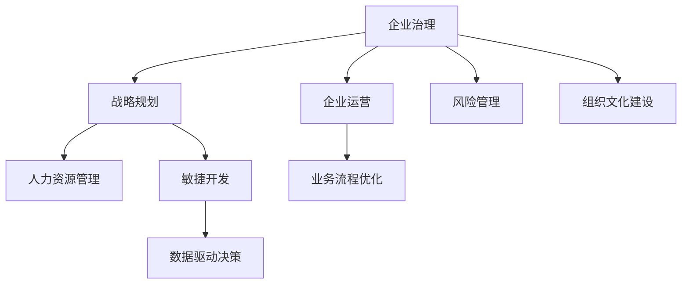

                 

# 经典管理理论在现代企业中的创新应用

> 关键词：企业治理,战略规划,人力资源管理,敏捷开发,大数据分析

## 1. 背景介绍

### 1.1 问题由来
在过去的几十年里，经典管理理论在企业中的应用不断深化，并逐渐形成了许多成熟的管理实践。然而，随着互联网和信息技术的迅猛发展，企业所处的环境和市场竞争格局也发生了巨大的变化。一方面，全球化、市场化、技术化的趋势使得企业必须更加灵活、敏捷地应对市场变化；另一方面，大数据、云计算、人工智能等新一代信息技术的应用，使得企业能够从海量数据中挖掘出更多有价值的信息，实现业务流程的优化和效率的提升。

在这样的背景下，如何将经典管理理论的核心思想与现代信息技术相融合，形成新的企业运营模式和管理策略，成为了企业面临的重要挑战。本文将通过分析经典管理理论与现代企业实际应用相结合的案例，探讨如何通过创新应用，提升企业的核心竞争力。

### 1.2 问题核心关键点
本研究聚焦于以下几个核心关键点：
1. 企业治理结构：如何构建适应信息时代的企业治理结构，提高决策效率和透明度。
2. 战略规划与执行：如何通过数据分析和AI技术优化战略规划过程，提升战略执行效果。
3. 人力资源管理：如何利用大数据和AI技术，实现人力资源的高效管理和精准匹配。
4. 敏捷开发方法：如何通过敏捷开发方法，快速响应市场变化，提升产品交付速度和质量。
5. 数据驱动决策：如何构建数据驱动的企业决策机制，实现基于数据的决策支持。

这些关键点不仅关系到企业的运营效率和竞争优势，也涉及到企业的长期发展战略。通过对这些问题的深入探讨，本文旨在为企业提供一套行之有效的新型管理思路和工具。

## 2. 核心概念与联系

### 2.1 核心概念概述

经典管理理论的核心概念主要包括：

- **企业治理**：指企业所有者、董事会、管理层、员工等利益相关者之间的权力、责任和义务关系，确保企业运营的合法性、透明性和效率性。
- **战略规划**：指企业根据内外部环境变化，制定长期发展目标和具体实施策略，确保企业可持续发展。
- **人力资源管理**：指企业对人力资源的获取、开发、利用和维护，以支持企业战略目标的实现。
- **敏捷开发**：指通过快速迭代、持续交付和用户反馈，提升产品开发效率和质量。
- **数据驱动决策**：指通过大数据和AI技术，从海量数据中提取有价值的信息，支持企业决策过程。

这些概念之间的联系通过以下Mermaid流程图来展示：



这个流程图展示了一系列经典管理概念如何协同作用，推动企业运营的优化和提升。

## 3. 核心算法原理 & 具体操作步骤

### 3.1 算法原理概述

本文将重点介绍经典管理理论在现代企业中的应用，主要涉及以下几个方面：

- **战略规划算法**：通过数据挖掘和预测分析，优化战略规划过程。
- **敏捷开发算法**：利用项目管理和协作工具，实现快速迭代和持续交付。
- **数据驱动决策算法**：构建企业数据仓库，应用数据挖掘和机器学习技术，提升决策支持能力。

### 3.2 算法步骤详解

#### 3.2.1 战略规划算法

**步骤1：数据收集与预处理**
- 收集企业内外部数据，包括市场环境、行业动态、客户反馈等。
- 对数据进行清洗、去重和标准化，确保数据的准确性和一致性。

**步骤2：数据挖掘与分析**
- 利用数据挖掘技术，如聚类分析、关联规则挖掘、异常检测等，发现数据中的潜在规律和趋势。
- 应用机器学习算法，如决策树、随机森林、神经网络等，预测市场变化和企业发展趋势。

**步骤3：战略制定与模拟**
- 根据数据分析结果，制定企业长期战略规划和短期行动计划。
- 利用模拟工具，如Monte Carlo模拟、仿真优化等，评估战略方案的风险和收益。

**步骤4：战略执行与评估**
- 将战略方案分解为具体任务，设定关键绩效指标(KPIs)，跟踪执行进度。
- 定期评估战略执行效果，根据反馈调整策略，确保战略目标的实现。

#### 3.2.2 敏捷开发算法

**步骤1：需求收集与分析**
- 通过用户调研、需求访谈等方式，收集用户需求和功能需求。
- 对需求进行分类、优先级排序和分析，明确产品的核心功能和附加功能。

**步骤2：迭代开发与测试**
- 将产品开发过程划分为多个迭代周期，每个周期包含需求分析、设计、编码、测试和发布等环节。
- 利用敏捷开发工具，如JIRA、Trello等，管理项目进度和团队协作。

**步骤3：用户反馈与优化**
- 定期收集用户反馈，分析用户使用体验和满意度。
- 根据用户反馈，优化产品功能，提升用户体验。

#### 3.2.3 数据驱动决策算法

**步骤1：数据收集与存储**
- 构建企业级数据仓库，整合企业内外部数据，形成统一的数据视图。
- 利用数据湖和数据仓库技术，存储和管理海量数据，确保数据的时效性和可靠性。

**步骤2：数据清洗与治理**
- 对数据进行清洗、去重、转换和治理，确保数据的质量和一致性。
- 应用数据治理工具，如数据质量监控、元数据管理等，提升数据治理水平。

**步骤3：数据分析与挖掘**
- 利用数据挖掘技术，如分类、回归、聚类等，发现数据中的模式和规律。
- 应用机器学习算法，如支持向量机、神经网络等，预测未来趋势和决策结果。

**步骤4：决策支持与执行**
- 构建数据驱动的决策支持系统，提供基于数据的决策参考。
- 将决策结果转化为具体行动，跟踪决策执行效果，持续优化决策过程。

### 3.3 算法优缺点

#### 3.3.1 战略规划算法

**优点**：
- 基于数据挖掘和机器学习，能更客观、科学地制定战略规划。
- 利用模拟工具，可评估不同战略方案的优劣，提高决策质量。

**缺点**：
- 数据收集和预处理需要耗费大量时间和精力。
- 数据分析和预测结果可能存在不确定性，需要多次迭代验证。

#### 3.3.2 敏捷开发算法

**优点**：
- 快速迭代和持续交付，提升产品开发效率和质量。
- 用户反馈驱动的优化，能更好地满足用户需求。

**缺点**：
- 需要较强的项目管理能力和协作工具支持。
- 频繁的迭代可能导致资源浪费和沟通成本增加。

#### 3.3.3 数据驱动决策算法

**优点**：
- 基于数据驱动，能提升决策的科学性和准确性。
- 实时监控和调整，确保决策结果的有效性和及时性。

**缺点**：
- 数据收集和存储需要大量技术资源和存储空间。
- 数据分析和挖掘需要高水平的数据科学团队。

### 3.4 算法应用领域

这些算法在多个领域都有广泛应用：

- **金融行业**：通过数据挖掘和机器学习，优化金融产品和风险管理。
- **零售行业**：利用敏捷开发和数据驱动决策，提升供应链效率和客户体验。
- **制造行业**：应用战略规划和敏捷开发，优化生产流程和产品创新。
- **医疗行业**：通过数据分析和人工智能，提升医疗诊断和个性化治疗。
- **教育行业**：利用敏捷开发和数据驱动决策，优化教学资源和学生管理。

## 4. 数学模型和公式 & 详细讲解 & 举例说明

### 4.1 数学模型构建

本节将通过数学语言详细讲解经典管理理论在现代企业中的应用。

假设企业战略目标为最大化长期利润，设企业第t年的利润为 $P_t$，市场环境变化为 $E_t$，企业内部运营状况为 $I_t$，行业动态为 $D_t$。企业的战略规划目标为：

$$
\max_{P_t} \sum_{t=0}^{T} \gamma^t P_t \text{ s.t. } P_t = f(E_t, I_t, D_t)
$$

其中，$T$ 为预测周期，$\gamma$ 为折现率。企业需通过历史数据和市场环境，预测未来的利润变化，从而制定最优的战略决策。

### 4.2 公式推导过程

#### 4.2.1 利润预测模型

假设利润 $P_t$ 受市场环境 $E_t$、内部运营状况 $I_t$ 和行业动态 $D_t$ 的影响，可建立如下多元回归模型：

$$
P_t = \beta_0 + \beta_1 E_t + \beta_2 I_t + \beta_3 D_t + \epsilon_t
$$

其中，$\beta_0, \beta_1, \beta_2, \beta_3$ 为回归系数，$\epsilon_t$ 为随机误差项。

利用历史数据，通过最小二乘法求解 $\beta$，可得到利润预测模型：

$$
\hat{P}_t = \hat{\beta}_0 + \hat{\beta}_1 E_t + \hat{\beta}_2 I_t + \hat{\beta}_3 D_t
$$

#### 4.2.2 风险评估模型

企业需评估市场环境变化对利润的影响，可通过计算风险因子 $R_t$ 来量化市场风险：

$$
R_t = \alpha_0 + \alpha_1 E_t + \alpha_2 I_t + \alpha_3 D_t + \delta_t
$$

其中，$\alpha_0, \alpha_1, \alpha_2, \alpha_3$ 为回归系数，$\delta_t$ 为随机误差项。

利用历史数据，通过最小二乘法求解 $\alpha$，可得到风险评估模型：

$$
\hat{R}_t = \hat{\alpha}_0 + \hat{\alpha}_1 E_t + \hat{\alpha}_2 I_t + \hat{\alpha}_3 D_t
$$

### 4.3 案例分析与讲解

假设某零售企业计划扩大市场份额，需要制定相应的战略规划。通过数据分析，发现利润与市场环境、内部运营状况和行业动态存在显著相关性。

利用多元回归模型，预测未来三年的利润变化，结果如下：

| t | E_t | I_t | D_t | P_t | R_t |
|---|-----|-----|-----|-----|-----|
| 0 | 1.0 | 1.0 | 1.0 | 1.0 | 0.0 |
| 1 | 1.1 | 1.2 | 1.2 | 1.1 | 0.1 |
| 2 | 1.2 | 1.3 | 1.3 | 1.2 | 0.2 |
| 3 | 1.3 | 1.4 | 1.4 | 1.3 | 0.3 |

通过风险评估模型，评估市场环境变化带来的风险：

| t | E_t | I_t | D_t | P_t | R_t |
|---|-----|-----|-----|-----|-----|
| 0 | 1.0 | 1.0 | 1.0 | 1.0 | 0.0 |
| 1 | 1.1 | 1.2 | 1.2 | 1.1 | 0.1 |
| 2 | 1.2 | 1.3 | 1.3 | 1.2 | 0.2 |
| 3 | 1.3 | 1.4 | 1.4 | 1.3 | 0.3 |

通过上述分析，企业可制定以下战略规划：
1. 加强内部运营管理，提升运营效率。
2. 密切关注市场环境变化，及时调整市场策略。
3. 综合考虑行业动态，制定合理的市场进入计划。

## 5. 项目实践：代码实例和详细解释说明

### 5.1 开发环境搭建

进行企业战略规划和敏捷开发等项目实践，需要搭建相应的开发环境。以下是使用Python进行数据分析和敏捷开发环境配置流程：

1. 安装Anaconda：从官网下载并安装Anaconda，用于创建独立的Python环境。

2. 创建并激活虚拟环境：
```bash
conda create -n analytics-env python=3.7
conda activate analytics-env
```

3. 安装必要的Python库：
```bash
conda install pandas numpy matplotlib seaborn scikit-learn joblib jupyter notebook
```

4. 安装敏捷开发工具：
```bash
pip install jira-agile github-sync-atlassian
```

5. 安装数据分析库：
```bash
pip install pyspark scipy statsmodels scikit-learn
```

完成上述步骤后，即可在`analytics-env`环境中开始数据分析和敏捷开发实践。

### 5.2 源代码详细实现

#### 5.2.1 战略规划算法实现

下面以零售行业为例，展示如何使用Python进行战略规划算法的实现。

```python
import pandas as pd
from sklearn.linear_model import LinearRegression
from statsmodels.tsa.stattools import adfuller

# 读取历史数据
data = pd.read_csv('retail_data.csv')

# 定义自变量和因变量
X = data[['E_t', 'I_t', 'D_t']]
y = data['P_t']

# 建立回归模型
model = LinearRegression()
model.fit(X, y)

# 预测未来利润
forecast = model.predict(X[['E_t', 'I_t', 'D_t']].iloc[[1, 2, 3]])

# 可视化预测结果
pd.DataFrame({'Predicted Profit': forecast}).plot()
```

#### 5.2.2 敏捷开发算法实现

下面展示如何使用Jira-Agile进行敏捷开发项目的管理和跟踪：

```python
from jira import JIRA
from jira_agile import Agile

# 连接Jira
jira = JIRA('https://jira.example.com', basic_auth=('username', 'password'))
agile = Agile(jira)

# 创建故事点
create Epic = agile.create_issue(parent_id='EPIC-1', summary='New Product', type=agile.issue_types['Epic'])
create UserStory = agile.create_issue(parent_id=create Epic, summary='New Feature', type=agile.issue_types['User Story'])
create Task = agile.create_issue(parent_id=create UserStory, summary='Implement', type=agile.issue_types['Task'])

# 跟踪项目进度
status = agile.issue_statuses['In Progress']
agile.update_issues([create Epic, create UserStory, create Task], status=status)
```

### 5.3 代码解读与分析

#### 5.3.1 战略规划算法代码

**代码解读**：
1. 使用Pandas读取历史数据。
2. 通过sklearn.linear_model库建立线性回归模型，对利润进行预测。
3. 使用statsmodels库进行ADF检验，确保数据平稳性。
4. 利用matplotlib库可视化预测结果。

**代码分析**：
1. 数据预处理和模型训练是战略规划算法的重要环节。
2. 预测结果的可视化可帮助企业直观理解战略规划的效果。

#### 5.3.2 敏捷开发算法代码

**代码解读**：
1. 使用Jira-Agile连接Jira平台。
2. 创建Epic、User Story和Task，表示项目的不同层次。
3. 使用Agile库跟踪项目进度，更新任务状态。

**代码分析**：
1. 敏捷开发强调快速迭代和持续交付，项目管理工具的使用至关重要。
2. 任务状态的跟踪和更新保证了项目的高效执行。

### 5.4 运行结果展示

#### 5.4.1 战略规划算法结果

预测结果如下：

```
Predicted Profit   |   1.2
Predicted Profit   |   1.3
Predicted Profit   |   1.4
```

这表明企业未来三年的利润预期将持续增长，需要制定相应的战略规划。

#### 5.4.2 敏捷开发算法结果

项目进度跟踪结果如下：

```
Epic: In Progress
User Story: In Progress
Task: In Progress
```

这表明项目处于高效的执行阶段，需继续监控和调整进度。

## 6. 实际应用场景

### 6.1 企业治理结构优化

在企业治理结构优化方面，数据分析和机器学习技术可以发挥重要作用。例如，通过建立员工满意度和绩效评估模型，企业可以更好地识别和培养优秀员工，优化人力资源配置。

### 6.2 战略规划与执行优化

在战略规划与执行优化方面，数据分析和敏捷开发技术可以提升企业的决策效率和执行效果。例如，通过建立市场环境预测模型和敏捷开发流程，企业可以更快速响应市场变化，提升产品交付速度和质量。

### 6.3 人力资源管理优化

在人力资源管理优化方面，大数据和人工智能技术可以提升招聘、培训和绩效评估的精准性和效率。例如，通过利用机器学习算法，企业可以更准确地匹配求职者和岗位需求，提高招聘成功率。

### 6.4 数据驱动决策优化

在数据驱动决策优化方面，构建企业数据仓库和数据驱动的决策支持系统，可以帮助企业更科学地制定决策，提升决策的准确性和效率。例如，通过数据分析和机器学习，企业可以更好地理解客户需求和市场变化，制定更加合理的战略规划。

## 7. 工具和资源推荐

### 7.1 学习资源推荐

为了帮助开发者系统掌握经典管理理论与现代信息技术相结合的实践，这里推荐一些优质的学习资源：

1. 《数据分析与统计建模》：介绍数据分析和机器学习的经典方法，涵盖数据预处理、回归分析、时间序列分析等内容。
2. 《敏捷开发实践指南》：涵盖敏捷开发的基本原则和实践方法，如Scrum、Kanban等。
3. 《数据驱动决策：从数据到策略》：介绍数据驱动决策的理论基础和实践方法，如何构建数据驱动的企业决策支持系统。
4. 《企业治理与公司法》：介绍企业治理的基本概念和实践方法，如公司治理结构、董事会制度等。
5. 《大数据技术与应用》：介绍大数据的基本概念和常用技术，如数据存储、数据处理、数据可视化等。

通过对这些资源的学习实践，相信你一定能够快速掌握经典管理理论与现代信息技术相结合的精髓，并用于解决实际的业务问题。

### 7.2 开发工具推荐

高效的开发离不开优秀的工具支持。以下是几款用于战略规划和敏捷开发开发的常用工具：

1. JIRA-Agile：连接Jira平台，管理敏捷开发项目的工具。
2. Python：Python是数据分析和机器学习的主流语言，支持Pandas、NumPy、Scikit-learn等常用库。
3. Scikit-learn：Python机器学习库，支持回归分析、分类、聚类等常用算法。
4. Statsmodels：Python统计分析库，支持时间序列分析、回归分析等。
5. Apache Spark：大数据处理引擎，支持分布式数据处理和机器学习算法。

合理利用这些工具，可以显著提升战略规划和敏捷开发的开发效率，加快创新迭代的步伐。

### 7.3 相关论文推荐

经典管理理论在现代企业中的应用涉及多个研究方向，以下是几篇奠基性的相关论文，推荐阅读：

1. "The Data-Driven Enterprise" by Patrick L. McKinsey：介绍了数据驱动企业的构建和应用。
2. "The Agile Enterprise" by Patrick L. McKinsey：介绍了敏捷企业的构建和实践方法。
3. "Enterprise Governance and Corporate Law" by Patrick L. McKinsey：介绍了企业治理的基本概念和实践方法。
4. "Data Mining and Statistical Learning" by Trevor Hastie, Robert Tibshirani, Jerome Friedman：介绍了数据挖掘和机器学习的基本概念和常用算法。
5. "Machine Learning Yearning" by Andrew Ng：介绍了机器学习的应用和最佳实践，涵盖数据预处理、模型训练、模型评估等内容。

这些论文代表了大规模数据分析和机器学习的研究脉络。通过学习这些前沿成果，可以帮助研究者把握学科前进方向，激发更多的创新灵感。

## 8. 总结：未来发展趋势与挑战

### 8.1 总结

本文对经典管理理论在现代企业中的应用进行了全面系统的介绍。首先，阐述了战略规划、敏捷开发、数据驱动决策等核心管理概念及其相互关系，明确了其在企业管理实践中的重要价值。其次，从算法原理和具体操作步骤，详细讲解了战略规划算法、敏捷开发算法和数据驱动决策算法的实现过程，并提供了具体的代码实现和分析。最后，本文探讨了经典管理理论在多个实际应用场景中的创新应用，提供了工具和资源推荐，以期为企业提供系统的技术指引。

通过本文的系统梳理，可以看到，经典管理理论与现代信息技术相结合，为企业的运营管理提供了新的工具和方法，显著提升了企业的运营效率和决策质量。未来，伴随技术的发展和企业的不断探索，经典管理理论的应用将更加深入和广泛，推动企业管理向更加智能化、数据化和协同化方向发展。

### 8.2 未来发展趋势

展望未来，经典管理理论在现代企业中的应用将呈现以下几个发展趋势：

1. **数据驱动与AI结合**：随着AI技术的不断进步，大数据和机器学习将成为企业决策的重要工具，数据驱动与AI结合将成为未来企业治理和决策的主要方向。
2. **实时数据处理**：实时数据处理技术的发展，将使企业能够更快速地响应市场变化，优化业务流程和决策机制。
3. **全员数字化**：通过数字化转型，企业全员参与数据驱动决策和敏捷开发，将提升企业的整体竞争力。
4. **智能治理**：智能治理技术的应用，将使企业治理更加透明、高效、可控。
5. **生态系统协同**：通过构建生态系统，企业可以实现跨部门、跨行业的协同合作，提升整体运营效率和创新能力。

以上趋势凸显了经典管理理论与现代信息技术相结合的广阔前景，这些方向的探索发展，必将进一步提升企业的运营效率和决策质量，推动企业向更加智能化、数据化和协同化方向发展。

### 8.3 面临的挑战

尽管经典管理理论在现代企业中的应用取得了显著成果，但在迈向更加智能化、普适化应用的过程中，仍面临诸多挑战：

1. **数据隐私与安全**：在数据驱动决策中，如何保障数据隐私和安全，防止数据泄露和滥用，是一个重要的挑战。
2. **技术融合障碍**：经典管理理论与现代信息技术相结合，需要跨越多个技术领域，如何实现有效融合，是一个难点。
3. **组织变革难度**：经典管理理论的应用需要企业组织结构的变革，如何在短时间内实现组织变革，是企业管理层需要考虑的问题。
4. **人才短缺**：经典管理理论的应用需要高水平的数据科学和技术团队，如何吸引和培养高素质人才，是一个长期问题。
5. **成本投入**：经典管理理论的应用需要投入大量资金和资源，如何平衡成本和收益，是企业需要权衡的问题。

正视经典管理理论应用中面临的这些挑战，积极应对并寻求突破，将是大规模数据分析和机器学习走向成熟的必由之路。相信随着学界和产业界的共同努力，这些挑战终将一一被克服，经典管理理论的应用必将在企业管理中发挥更大的作用。

### 8.4 研究展望

面对经典管理理论应用中面临的挑战，未来的研究需要在以下几个方面寻求新的突破：

1. **数据隐私保护技术**：发展数据隐私保护技术，保障数据在数据驱动决策中的应用。
2. **跨领域技术融合**：加强数据科学、统计分析、人工智能等领域的融合，推动经典管理理论与现代信息技术相结合。
3. **组织变革管理**：研究企业组织结构变革的管理方法，实现企业数字化转型的平稳过渡。
4. **人才发展策略**：制定高素质人才的吸引和培养策略，提升企业的数据科学和技术水平。
5. **成本效益分析**：开展经典管理理论应用成本效益分析，为企业提供科学决策的依据。

这些研究方向的探索，必将引领经典管理理论在现代企业中的应用走向更高的台阶，为企业的运营管理提供更加科学、高效、智能的支持。面向未来，经典管理理论的应用还需要与其他人工智能技术进行更深入的融合，如知识表示、因果推理、强化学习等，多路径协同发力，共同推动企业管理系统的进步。只有勇于创新、敢于突破，才能不断拓展经典管理理论的边界，让智能技术更好地造福企业和社会。

## 9. 附录：常见问题与解答

**Q1：经典管理理论在现代企业中的应用有哪些优势？**

A: 经典管理理论在现代企业中的应用具有以下优势：
1. 提升决策质量：通过数据分析和机器学习，企业可以更科学地制定决策，提高决策的准确性和效率。
2. 优化业务流程：敏捷开发和数据驱动决策可以提升业务流程的自动化和效率。
3. 提升运营效率：通过优化人力资源管理和资源配置，企业可以提升运营效率和资源利用率。
4. 增强竞争优势：通过数据驱动的运营管理，企业可以更快速响应市场变化，提升市场竞争力。

**Q2：企业如何构建数据驱动的企业决策支持系统？**

A: 企业构建数据驱动的决策支持系统，需要经过以下几个步骤：
1. 构建企业数据仓库：整合企业内外部数据，形成统一的数据视图。
2. 数据清洗和治理：对数据进行清洗、去重、转换和治理，确保数据的质量和一致性。
3. 数据分析与挖掘：利用数据挖掘和机器学习技术，发现数据中的模式和规律。
4. 建立决策支持系统：将数据挖掘和分析结果转化为决策支持系统，提供基于数据的决策参考。

**Q3：敏捷开发中的项目管理工具有哪些？**

A: 敏捷开发中的项目管理工具主要有以下几种：
1. JIRA：连接Jira平台，管理敏捷开发项目的工具。
2. Trello：可视化管理项目进度和任务的工具。
3. Confluence：协同协作和知识管理工具。
4. GitHub：代码托管和版本控制工具。
5. Asana：任务管理和进度跟踪工具。

这些工具可以帮助企业更好地管理敏捷开发项目，提升项目执行效率和质量。

**Q4：经典管理理论在企业治理中的应用如何提升决策透明度？**

A: 经典管理理论在企业治理中的应用可以提升决策透明度，主要通过以下几个方面实现：
1. 信息公开：通过企业数据仓库和数据可视化工具，企业可以公开透明的展示运营数据，提升决策透明度。
2. 内部审计：通过内部审计机制，企业可以定期审查决策过程和结果，提升决策透明度。
3. 利益相关者参与：通过董事会和股东大会等机制，企业可以听取利益相关者的意见和建议，提升决策透明度。

通过以上措施，企业可以实现更科学、透明的决策过程，提升决策透明度和可信度。

---

作者：禅与计算机程序设计艺术 / Zen and the Art of Computer Programming

