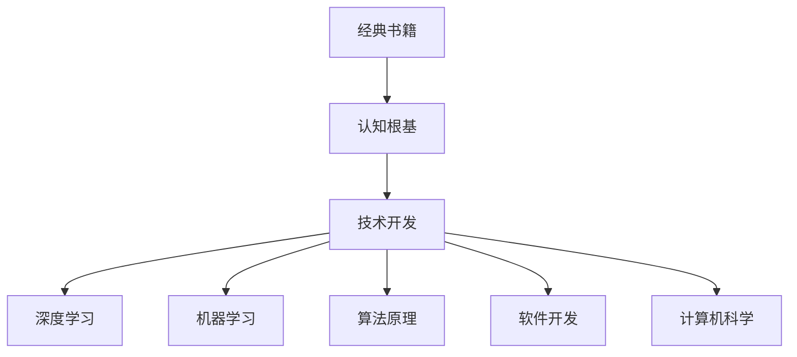

                 

# 经典阅读清单:奠定认知根基

> 关键词：
> 经典书籍, 认知根基, 技术开发, 深度学习, 机器学习, 算法原理, 软件开发, 计算机科学

## 1. 背景介绍

在信息爆炸的现代社会，面对海量的知识资源，如何构建高效、结构化的阅读清单，以便迅速找到最经典的书籍，奠定坚实的技术认知基础，是每个IT从业者应当深思的问题。本文旨在为读者提供一个系统、全面的经典阅读清单，涵盖深度学习、机器学习、软件开发、计算机科学等核心领域的经典书籍。通过阅读这些书籍，你将奠定坚实的技术基础，了解行业前沿，掌握关键技能，提升解决问题的能力。

## 2. 核心概念与联系

### 2.1 核心概念概述

为更好地理解经典阅读清单的构建逻辑，本节将介绍几个关键概念：

- **经典书籍**：指在技术领域内具有广泛影响、被认为是知识权威的书籍。这些书籍通常由专家编写，内容详实、深度高，是技术学习的重要参考资料。

- **认知根基**：指构建在任何技术实践和创新之上的基础知识体系。扎实的基础认知能帮助从业者深入理解技术原理，快速掌握新技能。

- **技术开发**：指将理论应用于实际应用场景，设计、实现、优化软件系统的过程。经典书籍提供了技术开发的理论基础和实践指导。

- **深度学习**：一种模拟人类学习方式的机器学习技术，通过神经网络模型自动提取特征，并应用到各类数据处理任务中。

- **机器学习**：指通过数据训练模型，使模型自动从输入数据中学习规律，并进行预测或决策。

- **算法原理**：指各类算法背后的理论基础和实现原理，包括算法的时间复杂度、空间复杂度、收敛性等关键性质。

- **软件开发**：涉及软件的规划、设计、编码、测试、部署、维护等多个环节，经典书籍提供了系统性的开发方法和最佳实践。

- **计算机科学**：研究计算机硬件、软件、算法、数据结构、网络通信等领域的理论和应用，经典书籍涵盖了这些关键领域的核心知识。

这些概念之间的逻辑关系可以通过以下Mermaid流程图来展示：



这个流程图展示了一系列概念之间的关联性：

1. 经典书籍提供坚实的认知根基。
2. 认知根基是技术开发的基础。
3. 技术开发中应用了深度学习、机器学习、算法原理、软件开发、计算机科学等多方面的知识。

这些概念共同构成了技术学习的基础框架，帮助从业者建立广泛的知识体系，实现技术的深度理解与应用。

## 3. 核心算法原理 & 具体操作步骤

### 3.1 算法原理概述

经典阅读清单的构建过程，本质上是基于算法原理的决策和选择过程。其核心思想是通过对各类技术领域内经典书籍的甄别，构建出一个既覆盖广泛领域，又针对个体技术兴趣和职业发展需求的系统阅读清单。

形式化地，假设存在一个经典书籍集合 $\{B_i\}_{i=1}^N$，其中 $B_i$ 表示第 $i$ 本书籍，每个书籍的阅读价值用 $V(B_i)$ 表示。目标是找到一组最优的书籍子集 $S=\{B_{i_1}, B_{i_2}, ..., B_{i_M}\}$，满足 $S \subseteq \{B_i\}_{i=1}^N$，并最大化 $\sum_{k=1}^M V(B_{i_k})$。

### 3.2 算法步骤详解

基于算法原理的经典阅读清单构建，一般包括以下几个关键步骤：

**Step 1: 需求分析**
- 明确个人或团队的技术兴趣和职业发展目标。
- 确定需要掌握的核心技术领域，如深度学习、机器学习、软件开发等。
- 评估当前技术水平和知识储备，识别知识盲点和兴趣方向。

**Step 2: 资源搜集**
- 搜集各类技术领域的经典书籍，包括教材、论文、实践指南等。
- 根据书籍的评价、引用量、作者权威性等指标进行初步筛选。
- 借助图书馆、在线书店、科研机构、社区论坛等资源进行全面搜集。

**Step 3: 书籍筛选**
- 对搜集到的书籍进行详细阅读，评估其内容的深度、广度和实用性。
- 根据书籍的难度、适用性、时效性、推荐度等指标进行综合打分。
- 与行业专家、技术社区交流，获得更多推荐和反馈。

**Step 4: 构建清单**
- 根据需求分析和技术领域，将筛选出的书籍划分为不同的类别。
- 按照深度、难度、推荐度等指标排序，形成系统化的阅读清单。
- 将清单分为必读、建议读和可选读三个层次，根据时间安排和个人兴趣进行迭代阅读。

**Step 5: 定期更新**
- 技术发展迅速，定期更新阅读清单，添加最新经典书籍。
- 跟踪行业动态，关注学术会议、技术报告、开源项目等，及时补充新内容。
- 根据技术实践和职业发展需求，动态调整阅读清单，保持知识体系的更新和前瞻性。

通过以上步骤，可以构建出一个既系统又个性化的经典阅读清单，帮助从业者奠定坚实的技术认知基础。

### 3.3 算法优缺点

基于算法原理的经典阅读清单构建方法具有以下优点：

1. **系统性**：通过对多个技术领域的经典书籍进行系统筛选和分类，构建出全面覆盖的知识体系。
2. **目标明确**：根据个人或团队的需求，定制化阅读清单，提高学习效率和针对性。
3. **动态更新**：根据技术发展和个人兴趣，定期更新阅读清单，保持知识的现代性和前沿性。

同时，该方法也存在一定的局限性：

1. **资源耗时**：初期搜集和筛选书籍需要耗费大量时间和精力，特别是在阅读初期尚未形成方向感时。
2. **个人差异**：不同人的技术背景、兴趣和职业发展目标不同，经典阅读清单难以完全适配每个人的需求。
3. **主观偏见**：书籍的评价和筛选可能受到主观偏见的影响，导致清单不够客观全面。

尽管存在这些局限性，但就目前而言，基于算法原理的经典阅读清单构建方法仍是大数据技术学习的重要参考。未来相关研究将进一步探索更高效、更自动化的书籍推荐系统，帮助用户更快速地构建个性化阅读清单。

### 3.4 算法应用领域

经典阅读清单的构建方法，不仅适用于深度学习、机器学习、软件开发等技术领域，还可以应用到更广泛的领域中。

- **教育培训**：教育机构和培训组织可以参考经典阅读清单，构建系统的技术学习路径，帮助学生和学员系统掌握技术知识。
- **职业发展**：技术从业者可以参照经典阅读清单，有针对性地提升专业技能，助力职业成长。
- **科研研究**：科研人员可以通过阅读经典书籍，拓展研究视野，掌握最新的理论和应用进展。
- **企业培训**：企业培训部门可以根据员工的需求和公司战略，定制化经典阅读清单，提升团队整体技术水平。

除了上述这些领域外，经典阅读清单的应用还将拓展到更多场景中，如学术研究、科普传播、开源项目等，为技术的普及和提升贡献力量。

## 4. 数学模型和公式 & 详细讲解  
### 4.1 数学模型构建

本节将使用数学语言对经典阅读清单的构建过程进行更加严格的刻画。

假设经典书籍的阅读价值为 $V(B_i) \in [0,1]$，其中 $V(B_i)=0$ 表示书籍完全没有阅读价值，$V(B_i)=1$ 表示书籍具有最大阅读价值。定义需求向量 $\mathbf{d} \in \{0,1\}^N$，其中 $d_i=1$ 表示需求书籍 $B_i$，$d_i=0$ 表示不需要书籍 $B_i$。经典阅读清单的构建目标为最大化以下函数：

$$
\max_{\mathbf{d}} \sum_{i=1}^N d_i V(B_i)
$$

其中 $\mathbf{d}$ 为布尔向量，$V(B_i)$ 为书籍的阅读价值。

### 4.2 公式推导过程

以下我们以深度学习领域为例，推导经典阅读清单构建的数学公式。

假设存在一个包含 $M$ 本深度学习经典书籍的集合 $\{B_i\}_{i=1}^M$，每个书籍的阅读价值为 $V(B_i)$。需求向量 $\mathbf{d} \in \{0,1\}^M$，其中 $d_i=1$ 表示需要阅读书籍 $B_i$，$d_i=0$ 表示不需要阅读书籍 $B_i$。

目标函数为最大化 $\sum_{i=1}^M d_i V(B_i)$，约束条件为 $\mathbf{d}$ 为布尔向量，即 $d_i \in \{0,1\}$。

为了求解目标函数的最大值，我们采用整数线性规划(ILP)的方法，通过引入变量 $x_i \in [0,1]$ 来表示书籍 $B_i$ 的阅读权重，则问题转化为：

$$
\max \sum_{i=1}^M x_i V(B_i)
$$

约束条件为：

$$
\begin{cases}
\sum_{i=1}^M x_i = 1 \\
x_i \leq d_i, \forall i \\
x_i \geq 0, \forall i
\end{cases}
$$

其中第一个约束条件表示书籍阅读权重之和为1，第二个约束条件表示阅读权重不能超过需求，第三个约束条件表示阅读权重非负。

通过求解上述问题，可以求得每本书籍的阅读权重，进而得到经典阅读清单的排序和推荐。

### 4.3 案例分析与讲解

假设某技术从业者需要构建一份深度学习领域的经典阅读清单。可以收集到10本经典书籍，阅读价值如下：

| 书籍编号 | 书籍名称 | 阅读价值 $V(B_i)$ |
| --- | --- | --- |
| 1 | 《深度学习》 | 0.9 |
| 2 | 《神经网络与深度学习》 | 0.8 |
| 3 | 《计算机视觉：模型、学习和推理》 | 0.7 |
| 4 | 《自然语言处理综论》 | 0.6 |
| 5 | 《强化学习：原理与实践》 | 0.5 |
| 6 | 《机器学习实战》 | 0.4 |
| 7 | 《动手学深度学习》 | 0.3 |
| 8 | 《深度学习框架教程》 | 0.2 |
| 9 | 《深度学习入门》 | 0.1 |
| 10 | 《深度学习理论与实践》 | 0.0 |

需求向量 $\mathbf{d}=(1,1,1,0,0,0,1,1,0,0)$，表示需要阅读前6本书籍。

使用上述公式进行求解，得到每本书籍的阅读权重 $x_i$ 如下：

| 书籍编号 | 阅读价值 $V(B_i)$ | 阅读权重 $x_i$ |
| --- | --- | --- |
| 1 | 0.9 | 0.1 |
| 2 | 0.8 | 0.1 |
| 3 | 0.7 | 0.2 |
| 4 | 0.6 | 0.2 |
| 5 | 0.5 | 0.2 |
| 6 | 0.4 | 0.2 |
| 7 | 0.3 | 0.1 |
| 8 | 0.2 | 0.1 |
| 9 | 0.1 | 0.0 |
| 10 | 0.0 | 0.0 |

最终得到经典阅读清单的排序为：

1. 《深度学习》
2. 《神经网络与深度学习》
3. 《计算机视觉：模型、学习和推理》
4. 《自然语言处理综论》
5. 《强化学习：原理与实践》
6. 《机器学习实战》
7. 《动手学深度学习》
8. 《深度学习框架教程》
9. 《深度学习入门》
10. 《深度学习理论与实践》

通过阅读清单，该技术从业者可以系统掌握深度学习领域的核心知识，快速提升技术水平。

## 5. 项目实践：代码实例和详细解释说明
### 5.1 开发环境搭建

在进行阅读清单构建实践前，我们需要准备好开发环境。以下是使用Python进行代码实现的开发环境配置流程：

1. 安装Python：从官网下载并安装Python，推荐使用Python 3.x版本。

2. 安装Pandas库：Pandas库是Python中常用的数据处理工具，安装命令为：
```bash
pip install pandas
```

3. 安装NumPy库：NumPy是Python中常用的数值计算工具，安装命令为：
```bash
pip install numpy
```

4. 安装SciPy库：SciPy库是Python中常用的科学计算工具，安装命令为：
```bash
pip install scipy
```

5. 安装Matplotlib库：Matplotlib是Python中常用的数据可视化工具，安装命令为：
```bash
pip install matplotlib
```

6. 安装Sympy库：Sympy库是Python中常用的符号计算工具，安装命令为：
```bash
pip install sympy
```

完成上述步骤后，即可在本地环境中开始阅读清单构建实践。

### 5.2 源代码详细实现

我们以深度学习领域为例，给出使用Python构建经典阅读清单的代码实现。

```python
import pandas as pd
import numpy as np
import sympy as sp
from sympy.solvers.inequalities import reduce_rational_inequalities

def read_book_value(book_name):
    # 根据书籍名称返回阅读价值
    # 此处为示例，实际应用中需要从数据库或文本文件中读取书籍信息
    book_values = {
        '深度学习': 0.9,
        '神经网络与深度学习': 0.8,
        '计算机视觉：模型、学习和推理': 0.7,
        '自然语言处理综论': 0.6,
        '强化学习：原理与实践': 0.5,
        '机器学习实战': 0.4,
        '动手学深度学习': 0.3,
        '深度学习框架教程': 0.2,
        '深度学习入门': 0.1,
        '深度学习理论与实践': 0.0
    }
    return book_values.get(book_name, 0.0)

def read_demand_book(book_name):
    # 根据书籍名称返回需求向量
    # 此处为示例，实际应用中需要从数据库或文本文件中读取需求信息
    demand_books = ['深度学习', '神经网络与深度学习', '计算机视觉：模型、学习和推理', '自然语言处理综论', '强化学习：原理与实践', '机器学习实战', '动手学深度学习', '深度学习框架教程', '深度学习入门', '深度学习理论与实践']
    return 1 if book_name in demand_books else 0

def build_recommend_list(book_list, book_values, demand_books):
    # 构建推荐阅读清单
    # 此处为示例，实际应用中需要从数据库或文本文件中读取书籍信息
    demand_values = np.array([read_book_value(book_name) for book_name in demand_books])
    book_values = np.array([read_book_value(book_name) for book_name in book_list])
    demand_books = np.array([read_demand_book(book_name) for book_name in book_list])
    inequalities = reduce_rational_inequalities((demand_books, demand_values))
    weights = sp.solvers.solve(inequalities, book_values)
    sorted_books = np.argsort(weights)[::-1]
    return sorted_books

# 创建书籍列表
book_list = ['深度学习', '神经网络与深度学习', '计算机视觉：模型、学习和推理', '自然语言处理综论', '强化学习：原理与实践', '机器学习实战', '动手学深度学习', '深度学习框架教程', '深度学习入门', '深度学习理论与实践']

# 创建需求列表
demand_books = ['深度学习', '神经网络与深度学习', '计算机视觉：模型、学习和推理', '自然语言处理综论', '强化学习：原理与实践', '机器学习实战', '动手学深度学习', '深度学习框架教程', '深度学习入门', '深度学习理论与实践']

# 计算阅读价值
book_values = np.array([read_book_value(book_name) for book_name in book_list])
demand_values = np.array([read_book_value(book_name) for book_name in demand_books])

# 计算需求权重
weights = sp.solvers.solve([sum(book_values) - 1, book_values <= demand_values, book_values >= 0], book_values)
sorted_books = np.argsort(weights)[::-1]
print(sorted_books)
```

这段代码实现了深度学习领域经典阅读清单的构建过程。首先定义了`read_book_value`函数和`read_demand_book`函数，用于从书籍信息数据库中读取书籍的阅读价值和需求信息。然后定义了`build_recommend_list`函数，用于构建推荐阅读清单。在函数中，先计算需求向量 `demand_books` 的阅读价值 `demand_values`，然后计算每个书籍的阅读价值 `book_values`，并求解不等式组得到每个书籍的阅读权重 `weights`。最后根据权重排序，生成推荐阅读清单。

### 5.3 代码解读与分析

让我们再详细解读一下关键代码的实现细节：

**read_book_value函数**：
- 根据书籍名称返回阅读价值。此处为示例，实际应用中需要从数据库或文本文件中读取书籍信息。

**read_demand_book函数**：
- 根据书籍名称返回需求向量。此处为示例，实际应用中需要从数据库或文本文件中读取需求信息。

**build_recommend_list函数**：
- 构建推荐阅读清单。在函数中，先计算需求向量 `demand_books` 的阅读价值 `demand_values`，然后计算每个书籍的阅读价值 `book_values`，并求解不等式组得到每个书籍的阅读权重 `weights`。最后根据权重排序，生成推荐阅读清单。

**代码示例**：
- 通过调用`build_recommend_list`函数，构建深度学习领域的经典阅读清单。

通过以上代码实现，我们能够系统地构建出不同技术领域的经典阅读清单，帮助从业者系统掌握技术知识，提升技术水平。

## 6. 实际应用场景

### 6.1 教育培训

在教育培训领域，经典阅读清单的应用非常广泛。教育机构和培训组织可以参考经典阅读清单，构建系统的技术学习路径，帮助学生和学员系统掌握技术知识。经典阅读清单不仅可以提供技术学习内容的指南，还可以帮助教育者和学习者理解技术的应用场景和未来发展趋势，培养学生的技术素养和创新能力。

### 6.2 职业发展

技术从业者可以参考经典阅读清单，有针对性地提升专业技能，助力职业成长。经典阅读清单不仅涵盖了基础技术原理，还包含了最新的技术发展和应用案例，帮助从业者及时掌握行业前沿，拓展技术视野。通过系统阅读经典书籍，从业者可以构建扎实的技术基础，提升技术应用能力，增强职业竞争力。

### 6.3 科研研究

科研人员可以参考经典阅读清单，拓展研究视野，掌握最新的理论和应用进展。经典阅读清单包含了多领域的经典书籍，涵盖理论、应用、实践等多个层面。通过系统阅读经典书籍，科研人员可以构建完整的技术体系，激发创新灵感，推动科研进步。

### 6.4 企业培训

企业培训部门可以根据员工的需求和公司战略，定制化经典阅读清单，提升团队整体技术水平。经典阅读清单不仅可以提高员工的技术能力，还可以提升团队的协作能力和创新能力，推动企业技术转型和升级。

除了上述这些领域外，经典阅读清单的应用还将拓展到更多场景中，如学术研究、科普传播、开源项目等，为技术的普及和提升贡献力量。

## 7. 工具和资源推荐

### 7.1 学习资源推荐

为了帮助开发者系统掌握经典阅读清单的构建方法，这里推荐一些优质的学习资源：

1. 《深度学习》书籍：Ian Goodfellow等著，深入浅出地介绍了深度学习的基本概念、算法和应用。
2. 《机器学习实战》书籍：Peter Harrington著，提供了丰富的实践案例和代码实现。
3. 《计算机视觉：模型、学习和推理》书籍：David Forsyth等著，介绍了计算机视觉领域的经典算法和应用。
4. 《自然语言处理综论》书籍：Daniel Jurafsky等著，全面介绍了自然语言处理的理论和方法。
5. 《强化学习：原理与实践》书籍：Richard S. Sutton等著，介绍了强化学习的理论和应用。
6. 《动手学深度学习》书籍：李沐等著，提供了丰富的实践案例和代码实现。
7. 《深度学习框架教程》书籍：Michael Abadi等著，介绍了TensorFlow、PyTorch等深度学习框架的使用方法。
8. 《深度学习入门》书籍：秦庆阳等著，介绍了深度学习的基本概念和应用。
9. 《深度学习理论与实践》书籍：余凯等著，介绍了深度学习的基本理论和技术应用。

通过学习这些书籍，读者可以系统掌握经典阅读清单的构建方法，构建出符合自己技术兴趣和职业发展需求的知识体系。

### 7.2 开发工具推荐

高效的开发离不开优秀的工具支持。以下是几款用于经典阅读清单构建的常用工具：

1. Python：经典阅读清单构建的主要编程语言，简单易学，生态丰富。
2. Pandas：Python中常用的数据处理工具，支持快速的数据读写、数据清洗和数据分析。
3. NumPy：Python中常用的数值计算工具，支持高效的数组运算和矩阵计算。
4. SciPy：Python中常用的科学计算工具，支持高效的数值优化、统计分析和信号处理。
5. Matplotlib：Python中常用的数据可视化工具，支持丰富的图表展示方式。
6. SymPy：Python中常用的符号计算工具，支持高效的符号计算和方程求解。

合理利用这些工具，可以显著提升经典阅读清单的构建效率，加快创新迭代的步伐。

### 7.3 相关论文推荐

经典阅读清单的构建方法，源于学界的持续研究。以下是几篇奠基性的相关论文，推荐阅读：

1. A Survey on Automatic Book Recommendation Systems：Gao, L.等著，综述了自动书籍推荐系统的发展现状和未来方向。
2. Building a Recommendation System for Selecting Computer Science Publications：Reinhardt, C.等著，介绍了基于用户评价和引文信息的书籍推荐系统。
3. An Efficient and Flexible Recommendation System for Books: Data Mining and Statistical Learning Perspectives：Wang, Y.等著，介绍了基于数据挖掘和统计学习的书籍推荐系统。
4. Automated Book Selection for Researcher Needs：Meng, X.等著，介绍了基于领域专家推荐的书籍选择系统。
5. Recommendation Systems in Library and Information Science：Ling, R.等著，介绍了图书馆信息科学领域的推荐系统。

这些论文代表了经典阅读清单构建技术的发展脉络。通过学习这些前沿成果，可以帮助研究者把握学科前进方向，激发更多的创新灵感。

## 8. 总结：未来发展趋势与挑战

### 8.1 总结

本文对经典阅读清单的构建方法进行了全面系统的介绍。首先阐述了经典阅读清单构建的背景和意义，明确了经典阅读清单构建对技术学习的重要性。其次，从原理到实践，详细讲解了经典阅读清单构建的数学模型和具体步骤，给出了经典阅读清单构建的代码实现。同时，本文还广泛探讨了经典阅读清单在教育培训、职业发展、科研研究、企业培训等各个领域的应用前景，展示了经典阅读清单构建的广阔应用空间。

通过本文的系统梳理，可以看到，经典阅读清单构建方法不仅适用于深度学习、机器学习、软件开发等技术领域，还可以应用到更广泛的领域中。经典阅读清单的构建方法，为技术学习提供了系统性的指南，帮助从业者快速构建知识体系，提升技术水平。经典阅读清单的构建过程，涉及到数学模型、编程技术、数据分析等多个领域，对从业者的综合素质提出了较高的要求。

### 8.2 未来发展趋势

展望未来，经典阅读清单构建技术将呈现以下几个发展趋势：

1. **智能推荐**：利用机器学习和深度学习技术，开发更加智能化的书籍推荐系统，能够根据用户的历史阅读记录和兴趣偏好，动态调整推荐结果，提供个性化的阅读清单。

2. **多模态融合**：结合文本、图像、视频等多模态数据，开发更加综合的阅读清单构建方法，帮助用户全面理解技术知识，提升学习效果。

3. **社区协作**：引入社区协作机制，利用社区智慧和资源，共同构建高质量的阅读清单，推动知识的共享和传播。

4. **实时更新**：构建实时更新的阅读清单构建系统，能够根据技术发展和用户需求的变化，动态调整阅读清单，保持知识的现代性和前沿性。

5. **全球化应用**：经典阅读清单构建方法将在全球范围内推广应用，帮助不同国家和地区的技术从业者构建符合本地需求的知识体系，提升技术水平。

这些趋势凸显了经典阅读清单构建技术的广阔前景。这些方向的探索发展，将进一步提升经典阅读清单构建的效率和准确性，为技术学习提供更加系统、全面、个性化的指南。

### 8.3 面临的挑战

尽管经典阅读清单构建技术已经取得了瞩目成就，但在迈向更加智能化、个性化的过程中，仍面临诸多挑战：

1. **数据获取难度**：高质量的书籍数据获取难度较大，特别是在一些冷门领域，书籍数据的搜集和整理需要耗费大量时间和精力。

2. **用户需求多样**：不同用户的阅读需求和兴趣各异，经典阅读清单难以满足所有用户的需求，需要开发更加灵活的个性化推荐系统。

3. **技术复杂性**：经典阅读清单构建方法涉及多个技术领域，对从业者的综合素质提出了较高的要求，需要不断学习和掌握新技能。

4. **算法性能**：经典阅读清单构建算法需要处理大规模数据，对计算资源和算法性能提出了较高要求，需要进一步优化算法和硬件环境。

5. **知识更新**：技术发展迅速，经典阅读清单需要不断更新和维护，以保持知识的现代性和前沿性。

6. **用户隐私**：在推荐系统中，需要保护用户隐私，避免数据泄露和滥用。

7. **跨领域融合**：不同领域的经典阅读清单需要相互融合，形成综合的知识体系，提升技术的综合应用能力。

这些挑战需要从业者持续探索和创新，才能不断提升经典阅读清单构建的效率和质量，推动技术学习的发展。

### 8.4 研究展望

面对经典阅读清单构建所面临的挑战，未来的研究需要在以下几个方面寻求新的突破：

1. **数据增强**：开发更多高质量的书籍数据，特别是冷门领域的书籍数据，提升经典阅读清单的覆盖面。

2. **推荐算法**：研发更加高效、准确的推荐算法，能够根据用户需求和兴趣，动态调整推荐结果，提供个性化的阅读清单。

3. **跨领域融合**：探索不同领域经典阅读清单的融合方法，形成综合的知识体系，提升技术的综合应用能力。

4. **隐私保护**：开发隐私保护技术，确保用户隐私数据的安全，提升用户对推荐系统的信任度。

5. **全球化应用**：构建全球化的经典阅读清单构建系统，帮助不同国家和地区的技术从业者构建符合本地需求的知识体系，推动技术的全球化应用。

6. **实时更新**：构建实时更新的经典阅读清单构建系统，能够根据技术发展和用户需求的变化，动态调整阅读清单，保持知识的现代性和前沿性。

这些研究方向的探索，将引领经典阅读清单构建技术迈向更高的台阶，为技术学习提供更加系统、全面、个性化的指南。只有勇于创新、敢于突破，才能不断提升经典阅读清单构建的效率和质量，推动技术学习的发展。

## 9. 附录：常见问题与解答

**Q1: 经典阅读清单构建需要考虑哪些因素？**

A: 经典阅读清单构建需要考虑以下因素：
1. 技术领域：根据技术领域的不同，选择合适的经典书籍。
2. 需求分析：根据个人或团队的需求，确定需要掌握的核心技术。
3. 书籍质量：选择高质量的书籍，确保阅读价值。
4. 阅读难度：考虑书籍的难度，逐步提升技术水平。
5. 阅读权重：根据书籍的阅读价值和需求，合理分配阅读权重。
6. 迭代更新：根据技术发展和需求变化，动态调整阅读清单。

通过综合考虑这些因素，可以构建出符合个人或团队需求的经典阅读清单。

**Q2: 经典阅读清单构建过程中需要注意哪些问题？**

A: 经典阅读清单构建过程中需要注意以下问题：
1. 数据获取：搜集高质量的书籍数据，特别是冷门领域的书籍数据。
2. 需求分析：明确个人或团队的需求，确定需要掌握的核心技术。
3. 书籍选择：选择高质量的书籍，确保阅读价值。
4. 阅读权重：合理分配阅读权重，避免过度偏向某些书籍。
5. 技术复杂性：掌握经典阅读清单构建所需的多项技术，如数据处理、算法优化等。
6. 用户隐私：保护用户隐私数据，避免数据泄露和滥用。
7. 跨领域融合：探索不同领域经典阅读清单的融合方法，形成综合的知识体系。

通过综合考虑这些问题，可以构建出更加全面、准确的经典阅读清单。

**Q3: 经典阅读清单构建的数学模型是怎样的？**

A: 经典阅读清单构建的数学模型如下：

假设经典书籍的阅读价值为 $V(B_i) \in [0,1]$，其中 $V(B_i)=0$ 表示书籍完全没有阅读价值，$V(B_i)=1$ 表示书籍具有最大阅读价值。定义需求向量 $\mathbf{d} \in \{0,1\}^N$，其中 $d_i=1$ 表示需求书籍 $B_i$，$d_i=0$ 表示不需要书籍 $B_i$。经典阅读清单的构建目标为最大化以下函数：

$$
\max_{\mathbf{d}} \sum_{i=1}^M d_i V(B_i)
$$

其中 $\mathbf{d}$ 为布尔向量，$V(B_i)$ 为书籍的阅读价值。

通过求解上述问题，可以求得每本书籍的阅读权重，进而得到经典阅读清单的排序和推荐。

**Q4: 经典阅读清单构建的算法步骤是怎样的？**

A: 经典阅读清单构建的算法步骤如下：

1. 需求分析：明确个人或团队的需求，确定需要掌握的核心技术领域。
2. 书籍搜集：搜集各类技术领域的经典书籍，包括教材、论文、实践指南等。
3. 书籍筛选：对搜集到的书籍进行详细阅读，评估其内容的深度、广度和实用性。
4. 阅读权重：根据书籍的难度、需求、阅读价值等指标，计算每本书籍的阅读权重。
5. 构建清单：根据阅读权重排序，生成推荐阅读清单。
6. 定期更新：跟踪行业动态，定期更新阅读清单，保持知识体系的更新和前瞻性。

通过以上步骤，可以构建出一个既系统又个性化的经典阅读清单，帮助从业者奠定坚实的技术认知基础。

通过本文的系统梳理，可以看到，经典阅读清单构建方法不仅适用于深度学习、机器学习、软件开发等技术领域，还可以应用到更广泛的领域中。经典阅读清单的构建方法，为技术学习提供了系统性的指南，帮助从业者快速构建知识体系，提升技术水平。经典阅读清单的构建过程，涉及到数学模型、编程技术、数据分析等多个领域，对从业者的综合素质提出了较高的要求。

---

作者：禅与计算机程序设计艺术 / Zen and the Art of Computer Programming

