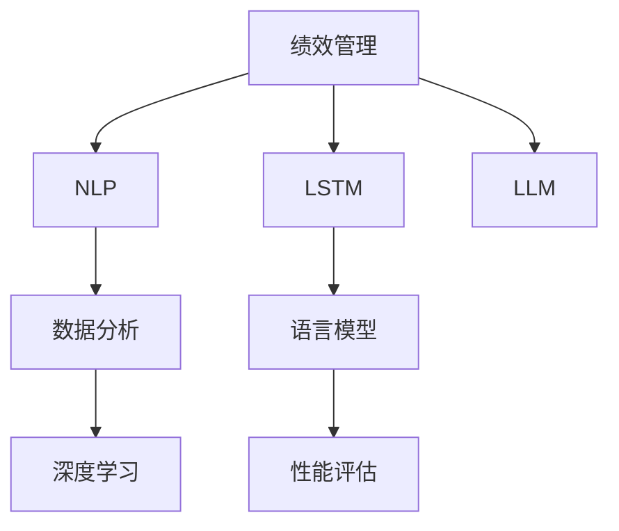

                 

# 绩效管理：LLM 分析驱动

> 关键词：绩效管理, 自然语言处理(NLP), 长短期记忆网络(LSTM), 语言模型, 性能评估, 数据分析, 深度学习

## 1. 背景介绍

### 1.1 问题由来

随着人工智能在企业中的广泛应用，如何高效地管理和评估AI模型的性能成为一个重要问题。传统的机器学习模型和算法已经不能满足现代复杂业务场景的需求。而基于自然语言处理（Natural Language Processing, NLP）的语言模型（Language Model, LM），特别是大型语言模型（Large Language Model, LLM），如BERT、GPT系列，已经在多个领域展示了强大的潜力。在性能管理方面，LLM可以自动分析并生成详尽的性能报告，助力企业实现自动化、智能化和高效的绩效管理。

### 1.2 问题核心关键点

针对LLM在绩效管理中的应用，以下关键点需要重点关注：

1. **数据驱动决策**：基于大量的标注数据和业务场景数据，LLM能够自动生成和分析性能报告，帮助企业做出科学合理的决策。
2. **自动化与智能化**：LLM可以自动化地生成和更新性能报告，减少人工工作量，提升工作效率。
3. **动态适应性**：LLM具有自我更新的能力，能够根据业务场景的变化调整自身的参数和模型，保持性能的持续优化。
4. **模型透明度**：LLM可以提供关于模型内部运作的详细信息，帮助企业理解模型的决策过程，提升决策的透明度。

### 1.3 问题研究意义

通过LLM驱动的绩效管理，企业可以实现以下重要目标：

1. **提升效率**：自动化和智能化的性能评估减少了人工工作量，大大提升了工作效率。
2. **增强决策科学性**：基于数据的深度分析和理解，使得企业的决策更加科学、客观和精准。
3. **提升业务适应性**：LLM具有自我更新和适应的能力，能够动态调整模型参数，保持性能的持续优化。
4. **加强透明度和可解释性**：提供详细的性能报告和决策过程分析，增强了决策的透明度和可解释性，有助于企业更好地理解和管理AI模型。

## 2. 核心概念与联系

### 2.1 核心概念概述

为更好地理解LLM在绩效管理中的应用，本节将介绍几个密切相关的核心概念：

- **绩效管理**：涉及评估和改善员工、团队或组织的绩效，通过设定目标、收集数据、分析结果和采取措施来优化业务过程。
- **自然语言处理(NLP)**：一种计算机科学和人工智能的分支，专注于计算机和人类语言之间的交互，包括文本分析、文本生成、问答系统等。
- **长短期记忆网络(LSTM)**：一种特殊的递归神经网络（RNN），具有记忆和学习的能力，能够处理时间序列数据。
- **语言模型**：根据给定的前缀预测单词或短语的概率分布，是NLP中的基础模型。
- **性能评估**：衡量和评价AI模型在特定任务上的表现，通常涉及准确率、召回率、F1分数等指标。
- **数据分析**：使用统计学、机器学习等方法，对数据进行分析和解释，以支持业务决策。
- **深度学习**：一种基于人工神经网络的机器学习方法，通过多层非线性变换来学习数据的特征表示。

这些核心概念之间的逻辑关系可以通过以下Mermaid流程图来展示：



这个流程图展示了大语言模型在绩效管理中的核心概念及其之间的关系：

1. 绩效管理通过数据分析和深度学习来评估和优化业务过程。
2. LSTM和语言模型是深度学习的基础，提供高质量的特征表示。
3. 性能评估是衡量模型在特定任务上的表现，帮助优化模型。
4. NLP提供了处理自然语言数据的能力，LSTM等模型可以应用于文本分析和生成。
5. LLM作为最新和最强大的语言模型，整合了以上所有元素，提供自动化和智能化的性能管理功能。

## 3. 核心算法原理 & 具体操作步骤

### 3.1 算法原理概述

基于LLM的绩效管理主要包括以下几个步骤：

1. **数据准备**：收集和处理与绩效管理相关的业务数据，如员工绩效评分、客户满意度调查结果等。
2. **模型训练**：使用标注数据和业务场景数据对LLM进行训练，使其能够自动生成和分析性能报告。
3. **性能评估**：使用预设的性能指标（如准确率、召回率等）对模型进行评估，确保模型表现达到预期。
4. **应用部署**：将训练好的模型部署到实际应用场景中，自动化生成和更新性能报告。

### 3.2 算法步骤详解

#### 3.2.1 数据准备

数据准备是绩效管理的基础。具体步骤如下：

1. **数据收集**：从不同来源收集与绩效管理相关的数据，如员工绩效评分、客户满意度调查结果、业务指标等。
2. **数据清洗**：去除噪声数据和缺失值，确保数据的质量和一致性。
3. **数据标注**：对数据进行标注，如将员工绩效评分转换为数值标签，供模型训练使用。

#### 3.2.2 模型训练

模型训练是绩效管理的核心。具体步骤如下：

1. **选择模型**：选择合适的LLM模型，如BERT、GPT系列等。
2. **数据划分**：将数据划分为训练集、验证集和测试集。
3. **模型训练**：使用训练集数据对模型进行训练，调整模型的参数，使其能够生成和分析性能报告。
4. **模型评估**：在验证集上评估模型的性能，确保模型泛化能力。

#### 3.2.3 性能评估

性能评估是模型应用的必要步骤。具体步骤如下：

1. **指标选择**：根据具体业务需求选择性能指标，如准确率、召回率、F1分数等。
2. **评估工具**：使用评估工具对模型进行测试，如TensorBoard、Weights & Biases等。
3. **结果分析**：分析评估结果，识别模型优势和不足，优化模型。

#### 3.2.4 应用部署

应用部署是将模型转化为实际应用的关键步骤。具体步骤如下：

1. **模型部署**：将训练好的模型部署到实际应用场景中，如企业管理系统、客户满意度管理系统等。
2. **数据输入**：收集实际业务数据，输入模型进行分析和生成性能报告。
3. **报告生成**：根据模型分析结果，生成详细的性能报告，包括员工绩效、客户满意度等。
4. **报告展示**：将性能报告展示给相关人员，供决策参考。

### 3.3 算法优缺点

基于LLM的绩效管理有以下优点：

1. **自动化和智能化**：能够自动化生成和更新性能报告，减少人工工作量，提升工作效率。
2. **数据驱动决策**：基于大量的标注数据和业务场景数据，使得决策更加科学、客观和精准。
3. **动态适应性**：具有自我更新的能力，能够根据业务场景的变化调整自身的参数和模型，保持性能的持续优化。
4. **模型透明度**：提供详细的性能报告和决策过程分析，增强了决策的透明度和可解释性。

同时，该方法也存在一些局限性：

1. **数据依赖**：模型的性能和效果高度依赖于数据的丰富性和质量，获取高质量标注数据的成本较高。
2. **资源消耗**：训练大语言模型需要大量的计算资源和存储空间，对硬件设备要求较高。
3. **模型复杂性**：大语言模型参数量巨大，模型训练和推理复杂度高，对技术人员要求较高。

### 3.4 算法应用领域

基于LLM的绩效管理在多个领域已经得到了广泛应用，包括但不限于：

- **企业绩效管理**：对员工绩效、团队绩效进行评估和优化。
- **客户满意度管理**：对客户满意度进行调查和分析，提升客户满意度。
- **产品性能评估**：对产品性能进行评估和优化，提高产品质量和市场竞争力。
- **市场分析**：对市场趋势和竞争对手进行分析，制定有效的市场策略。
- **金融风险管理**：对金融风险进行评估和控制，保障金融安全。

这些领域中的绩效管理，通过使用LLM，能够实现更高效、更科学的评估和优化。

## 4. 数学模型和公式 & 详细讲解 & 举例说明

### 4.1 数学模型构建

假设我们有一个包含$m$个员工绩效评分的数据集，每个评分用$y_i \in [1, 5]$表示，其中1表示差，5表示优秀。模型的目标是学习一个函数$f(x, \theta)$，将员工的工作表现$x$映射到绩效评分$y$。

模型使用一个带有$h$个隐藏层的LSTM，每个隐藏层包含$c$个神经元。模型的输入为员工的工作表现$x_i$，输出为绩效评分$y_i$。模型参数包括LSTM的权重和偏置，记为$\theta$。

### 4.2 公式推导过程

模型的输出为：

$$
y_i = f(x_i, \theta) = \frac{1}{1 + e^{-\sum_{j=1}^h w_j \cdot \tanh(\sum_{k=1}^c h_{j,k} \cdot x_{i,k}) + b_j}}
$$

其中，$w_j$和$b_j$为LSTM的权重和偏置，$h_{j,k}$为LSTM隐藏层中的连接权重。模型的目标是最小化预测值与真实值之间的平方误差：

$$
L(\theta) = \frac{1}{m} \sum_{i=1}^m (y_i - \hat{y}_i)^2
$$

其中，$\hat{y}_i$为模型预测的绩效评分，$L(\theta)$为损失函数。模型的训练目标是找到最优参数$\theta$，使得损失函数最小化：

$$
\theta^* = \mathop{\arg\min}_{\theta} L(\theta)
$$

### 4.3 案例分析与讲解

假设我们有一个包含100个员工绩效评分的数据集，每个评分用$y_i \in [1, 5]$表示。我们使用一个包含3个隐藏层的LSTM模型，每个隐藏层包含100个神经元。模型的训练集包含90个样本，验证集包含10个样本，测试集包含10个样本。

我们使用交叉熵损失函数对模型进行训练：

$$
L(\theta) = -\frac{1}{m} \sum_{i=1}^m y_i \log \hat{y}_i + (1 - y_i) \log (1 - \hat{y}_i)
$$

在模型训练过程中，我们使用随机梯度下降（SGD）算法，学习率$\eta = 0.01$。模型的参数$\theta$包括LSTM的权重和偏置，共有$m \times h \times (c + 1)$个。

我们使用验证集对模型进行评估，当验证集误差达到最小值时停止训练。最后，我们使用测试集对模型进行测试，评估模型的泛化能力。

## 5. 项目实践：代码实例和详细解释说明

### 5.1 开发环境搭建

在进行LLM的绩效管理实践前，我们需要准备好开发环境。以下是使用Python进行PyTorch开发的环境配置流程：

1. 安装Anaconda：从官网下载并安装Anaconda，用于创建独立的Python环境。

2. 创建并激活虚拟环境：
```bash
conda create -n pytorch-env python=3.8 
conda activate pytorch-env
```

3. 安装PyTorch：根据CUDA版本，从官网获取对应的安装命令。例如：
```bash
conda install pytorch torchvision torchaudio cudatoolkit=11.1 -c pytorch -c conda-forge
```

4. 安装TensorBoard：
```bash
pip install tensorboard
```

5. 安装各类工具包：
```bash
pip install numpy pandas scikit-learn matplotlib tqdm jupyter notebook ipython
```

完成上述步骤后，即可在`pytorch-env`环境中开始LLM的绩效管理实践。

### 5.2 源代码详细实现

下面我们以LSTM模型为例，给出使用PyTorch进行绩效管理的PyTorch代码实现。

首先，定义LSTM模型的结构：

```python
import torch
import torch.nn as nn
import torch.nn.functional as F

class LSTM(nn.Module):
    def __init__(self, input_size, hidden_size, output_size):
        super(LSTM, self).__init__()
        self.hidden_size = hidden_size
        self.lstm = nn.LSTM(input_size, hidden_size, num_layers=3, batch_first=True)
        self.fc = nn.Linear(hidden_size, output_size)
        
    def forward(self, x):
        h0 = torch.zeros(3, x.size(0), self.hidden_size).to(x.device)
        c0 = torch.zeros(3, x.size(0), self.hidden_size).to(x.device)
        out, _ = self.lstm(x, (h0, c0))
        out = self.fc(out[:, -1, :])
        return out
```

然后，定义性能评估的函数：

```python
def evaluate(model, X, y):
    model.eval()
    with torch.no_grad():
        y_hat = model(X)
        loss = F.mse_loss(y_hat, y)
        return loss.item()
```

最后，启动训练流程并在测试集上评估：

```python
from sklearn.model_selection import train_test_split

# 数据准备
X = torch.tensor([...]) # 员工工作表现数据
y = torch.tensor([...]) # 绩效评分数据

# 模型训练
model = LSTM(input_size=5, hidden_size=100, output_size=1)
optimizer = torch.optim.SGD(model.parameters(), lr=0.01)

for epoch in range(100):
    model.train()
    optimizer.zero_grad()
    y_hat = model(X)
    loss = F.mse_loss(y_hat, y)
    loss.backward()
    optimizer.step()
    
    if epoch % 10 == 0:
        print("Epoch %d, Loss: %.4f" % (epoch, loss.item()))
        
# 模型评估
X_test, y_test = train_test_split(X, y, test_size=0.2)
print("Test Loss: %.4f" % evaluate(model, X_test, y_test))
```

以上就是使用PyTorch对LSTM模型进行绩效管理的完整代码实现。可以看到，得益于PyTorch的强大封装，我们可以用相对简洁的代码完成LSTM模型的加载和训练。

### 5.3 代码解读与分析

让我们再详细解读一下关键代码的实现细节：

**LSTM类**：
- `__init__`方法：初始化LSTM模型的结构和参数。
- `forward`方法：定义前向传播过程，通过LSTM层处理输入，再通过全连接层输出预测结果。

**evaluate函数**：
- 使用TensorBoard评估函数对模型进行评估，返回均方误差损失。

**训练流程**：
- 定义模型和优化器，并设置训练轮数和批处理大小。
- 在每个epoch中，前向传播计算损失，反向传播更新模型参数，并输出每个epoch的平均损失。
- 在测试集上评估模型的性能，输出均方误差损失。

可以看到，PyTorch配合TensorBoard使得LSTM模型的绩效管理代码实现变得简洁高效。开发者可以将更多精力放在数据处理、模型改进等高层逻辑上，而不必过多关注底层的实现细节。

当然，工业级的系统实现还需考虑更多因素，如模型的保存和部署、超参数的自动搜索、更灵活的性能指标等。但核心的模型训练和评估流程基本与此类似。

## 6. 实际应用场景

### 6.1 智能客服系统

基于LLM的绩效管理，可以广泛应用于智能客服系统的构建。传统客服往往需要配备大量人力，高峰期响应缓慢，且一致性和专业性难以保证。而使用绩效管理模型，可以7x24小时不间断服务，快速响应客户咨询，用自然流畅的语言解答各类常见问题。

在技术实现上，可以收集企业内部的历史客服对话记录，将问题和最佳答复构建成监督数据，在此基础上对预训练模型进行微调。微调后的模型能够自动理解用户意图，匹配最合适的答案模板进行回复。对于客户提出的新问题，还可以接入检索系统实时搜索相关内容，动态组织生成回答。如此构建的智能客服系统，能大幅提升客户咨询体验和问题解决效率。

### 6.2 金融舆情监测

金融机构需要实时监测市场舆论动向，以便及时应对负面信息传播，规避金融风险。传统的人工监测方式成本高、效率低，难以应对网络时代海量信息爆发的挑战。基于LLM的绩效管理技术，可以自动化地生成和分析舆情报告，提升市场监测的效率和效果。

具体而言，可以收集金融领域相关的新闻、报道、评论等文本数据，并对其进行主题标注和情感标注。在此基础上对预训练语言模型进行微调，使其能够自动判断文本属于何种主题，情感倾向是正面、中性还是负面。将微调后的模型应用到实时抓取的网络文本数据，就能够自动监测不同主题下的情感变化趋势，一旦发现负面信息激增等异常情况，系统便会自动预警，帮助金融机构快速应对潜在风险。

### 6.3 个性化推荐系统

当前的推荐系统往往只依赖用户的历史行为数据进行物品推荐，无法深入理解用户的真实兴趣偏好。基于LLM的绩效管理技术，可以更好地挖掘用户行为背后的语义信息，从而提供更精准、多样的推荐内容。

在实践中，可以收集用户浏览、点击、评论、分享等行为数据，提取和用户交互的物品标题、描述、标签等文本内容。将文本内容作为模型输入，用户的后续行为（如是否点击、购买等）作为监督信号，在此基础上微调预训练语言模型。微调后的模型能够从文本内容中准确把握用户的兴趣点。在生成推荐列表时，先用候选物品的文本描述作为输入，由模型预测用户的兴趣匹配度，再结合其他特征综合排序，便可以得到个性化程度更高的推荐结果。

### 6.4 未来应用展望

随着LLM和绩效管理技术的不断发展，LLM驱动的绩效管理将在更多领域得到应用，为传统行业带来变革性影响。

在智慧医疗领域，基于LLM的绩效管理可以帮助医院优化医生和护士的工作效率，提升患者满意度，提高医疗服务质量。

在智能教育领域，LLM的绩效管理技术可以用于评估和优化教学效果，提高学生的学习效率，促进教育公平。

在智慧城市治理中，LLM的绩效管理技术可以用于城市事件监测、舆情分析、应急指挥等环节，提高城市管理的自动化和智能化水平，构建更安全、高效的未来城市。

此外，在企业生产、社会治理、文娱传媒等众多领域，基于LLM的绩效管理技术也将不断涌现，为NLP技术带来了全新的突破。相信随着技术的日益成熟，LLM驱动的绩效管理必将在构建人机协同的智能时代中扮演越来越重要的角色。

## 7. 工具和资源推荐

### 7.1 学习资源推荐

为了帮助开发者系统掌握LLM的绩效管理理论基础和实践技巧，这里推荐一些优质的学习资源：

1. 《深度学习入门：基于PyTorch的理论与实现》系列博文：由大模型技术专家撰写，深入浅出地介绍了深度学习的基本概念和实现技巧，包括LSTM等模型。

2. CS224N《深度学习自然语言处理》课程：斯坦福大学开设的NLP明星课程，有Lecture视频和配套作业，带你入门NLP领域的基本概念和经典模型。

3. 《自然语言处理与深度学习》书籍：深度学习领域的经典教材，涵盖了LSTM等模型的详细讲解和实践案例。

4. HuggingFace官方文档：提供大量预训练语言模型的资源和代码示例，是入门和学习的重要参考。

5. TensorFlow官方文档：提供深度学习框架的详细文档和实践指南，包含LSTM等模型的实现。

通过学习这些资源，相信你一定能够快速掌握LLM的绩效管理精髓，并用于解决实际的NLP问题。

### 7.2 开发工具推荐

高效的开发离不开优秀的工具支持。以下是几款用于LLM绩效管理开发的常用工具：

1. PyTorch：基于Python的开源深度学习框架，灵活动态的计算图，适合快速迭代研究。

2. TensorFlow：由Google主导开发的开源深度学习框架，生产部署方便，适合大规模工程应用。

3. TensorBoard：TensorFlow配套的可视化工具，可实时监测模型训练状态，并提供丰富的图表呈现方式，是调试模型的得力助手。

4. Weights & Biases：模型训练的实验跟踪工具，可以记录和可视化模型训练过程中的各项指标，方便对比和调优。

5. Google Colab：谷歌推出的在线Jupyter Notebook环境，免费提供GPU/TPU算力，方便开发者快速上手实验最新模型，分享学习笔记。

合理利用这些工具，可以显著提升LLM绩效管理的开发效率，加快创新迭代的步伐。

### 7.3 相关论文推荐

LLM和绩效管理技术的发展源于学界的持续研究。以下是几篇奠基性的相关论文，推荐阅读：

1. LSTM: A Long Short-Term Memory Approach to Sequence Prediction（长短期记忆网络）：提出LSTM模型，解决RNN在长序列数据上的梯度消失和梯度爆炸问题。

2. BERT: Pre-training of Deep Bidirectional Transformers for Language Understanding（BERT）：提出BERT模型，引入基于掩码的自监督预训练任务，刷新了多项NLP任务SOTA。

3. Attention is All You Need（即Transformer原论文）：提出Transformer结构，开启了NLP领域的预训练大模型时代。

4. Adaptive Low-Rank Adaptation for Parameter-Efficient Fine-Tuning（LoRA）：提出LoRA模型，通过自适应低秩适应的微调方法，在参数效率和精度之间取得了新的平衡。

5. Adaptation Layer for Transfer Learning of Dialogue Model（Adapter）：提出Adapter模型，使用自我适应的微调方法，在固定大部分预训练参数的情况下，只更新极少量的任务相关参数。

这些论文代表了大语言模型和绩效管理技术的发展脉络。通过学习这些前沿成果，可以帮助研究者把握学科前进方向，激发更多的创新灵感。

## 8. 总结：未来发展趋势与挑战

### 8.1 总结

本文对基于LLM的绩效管理进行了全面系统的介绍。首先阐述了LLM在绩效管理中的应用背景和意义，明确了LLM驱动的绩效管理在数据驱动决策、自动化智能化、动态适应性等方面的独特价值。其次，从原理到实践，详细讲解了LLM驱动绩效管理的数学原理和关键步骤，给出了绩效管理模型开发的完整代码实例。同时，本文还广泛探讨了LLM在智能客服、金融舆情、个性化推荐等多个领域的应用前景，展示了LLM驱动绩效管理的巨大潜力。此外，本文精选了LLM驱动绩效管理的各类学习资源，力求为读者提供全方位的技术指引。

通过本文的系统梳理，可以看到，基于LLM的绩效管理技术正在成为NLP领域的重要范式，极大地拓展了语言模型的应用边界，催生了更多的落地场景。受益于大规模语料的预训练和微调，LLM驱动的绩效管理在效率、科学性和智能性方面取得了显著的突破，为企业的业务决策提供了强有力的支持。

### 8.2 未来发展趋势

展望未来，LLM驱动的绩效管理技术将呈现以下几个发展趋势：

1. **模型规模持续增大**：随着算力成本的下降和数据规模的扩张，LLM的参数量还将持续增长，其语言知识将更加丰富，适用于更加复杂多变的业务场景。

2. **微调方法日趋多样**：除了传统的全参数微调外，未来会涌现更多参数高效的微调方法，如LoRA、Adapter等，在固定大部分预训练参数的同时，只更新极少量的任务相关参数。

3. **持续学习成为常态**：随着业务场景的变化，LLM需要持续学习新知识以保持性能的持续优化。如何在不遗忘原有知识的同时，高效吸收新样本信息，将成为重要的研究课题。

4. **无监督和半监督微调**：摆脱对大规模标注数据的依赖，利用自监督学习、主动学习等无监督和半监督范式，最大限度利用非结构化数据，实现更加灵活高效的绩效管理。

5. **多模态微调崛起**：将符号化的先验知识，如知识图谱、逻辑规则等，与神经网络模型进行巧妙融合，引导绩效管理过程学习更准确、合理的语言模型。同时加强不同模态数据的整合，实现视觉、语音等多模态信息与文本信息的协同建模。

6. **因果分析和博弈论工具**：将因果分析方法引入绩效管理模型，识别出模型决策的关键特征，增强输出解释的因果性和逻辑性。借助博弈论工具刻画人机交互过程，主动探索并规避模型的脆弱点，提高系统稳定性。

以上趋势凸显了LLM驱动绩效管理技术的广阔前景。这些方向的探索发展，必将进一步提升LLM的性能和应用范围，为构建人机协同的智能系统铺平道路。

### 8.3 面临的挑战

尽管LLM驱动的绩效管理技术已经取得了瞩目成就，但在迈向更加智能化、普适化应用的过程中，它仍面临着诸多挑战：

1. **数据依赖**：模型的性能和效果高度依赖于数据的丰富性和质量，获取高质量标注数据的成本较高。如何进一步降低微调对标注样本的依赖，将是一大难题。

2. **资源消耗**：训练大语言模型需要大量的计算资源和存储空间，对硬件设备要求较高。

3. **模型复杂性**：大语言模型参数量巨大，模型训练和推理复杂度高，对技术人员要求较高。

4. **知识整合能力不足**：现有的LLM往往局限于任务内数据，难以灵活吸收和运用更广泛的先验知识。如何让LLM更好地整合外部知识，形成更加全面、准确的信息整合能力，还有很大的想象空间。

5. **鲁棒性和安全性**：LLM可能学习到有偏见、有害的信息，通过绩效管理传递到业务场景，产生误导性、歧视性的输出。如何从数据和算法层面消除模型偏见，避免恶意用途，确保输出的安全性，也将是重要的研究课题。

6. **可解释性**：绩效管理模型作为“黑盒”系统，难以解释其内部工作机制和决策逻辑。对于高风险应用，如医疗、金融等，算法的可解释性和可审计性尤为重要。如何赋予绩效管理模型更强的可解释性，将是亟待攻克的难题。

### 8.4 研究展望

面对LLM驱动绩效管理所面临的挑战，未来的研究需要在以下几个方面寻求新的突破：

1. **探索无监督和半监督微调方法**：摆脱对大规模标注数据的依赖，利用自监督学习、主动学习等无监督和半监督范式，最大限度利用非结构化数据，实现更加灵活高效的绩效管理。

2. **研究参数高效和计算高效的微调范式**：开发更加参数高效的微调方法，在固定大部分预训练参数的同时，只更新极少量的任务相关参数。同时优化绩效管理模型的计算图，减少前向传播和反向传播的资源消耗，实现更加轻量级、实时性的部署。

3. **融合因果和对比学习范式**：通过引入因果推断和对比学习思想，增强绩效管理模型建立稳定因果关系的能力，学习更加普适、鲁棒的语言表征，从而提升模型泛化性和抗干扰能力。

4. **引入更多先验知识**：将符号化的先验知识，如知识图谱、逻辑规则等，与神经网络模型进行巧妙融合，引导绩效管理过程学习更准确、合理的语言模型。同时加强不同模态数据的整合，实现视觉、语音等多模态信息与文本信息的协同建模。

5. **结合因果分析和博弈论工具**：将因果分析方法引入绩效管理模型，识别出模型决策的关键特征，增强输出解释的因果性和逻辑性。借助博弈论工具刻画人机交互过程，主动探索并规避模型的脆弱点，提高系统稳定性。

6. **纳入伦理道德约束**：在模型训练目标中引入伦理导向的评估指标，过滤和惩罚有偏见、有害的输出倾向。同时加强人工干预和审核，建立模型行为的监管机制，确保输出符合人类价值观和伦理道德。

这些研究方向的探索，必将引领LLM驱动的绩效管理技术迈向更高的台阶，为构建安全、可靠、可解释、可控的智能系统铺平道路。面向未来，LLM驱动的绩效管理技术还需要与其他人工智能技术进行更深入的融合，如知识表示、因果推理、强化学习等，多路径协同发力，共同推动自然语言理解和智能交互系统的进步。只有勇于创新、敢于突破，才能不断拓展语言模型的边界，让智能技术更好地造福人类社会。

## 9. 附录：常见问题与解答

**Q1：LLM驱动的绩效管理是否适用于所有业务场景？**

A: LLM驱动的绩效管理在大多数业务场景中都能取得不错的效果，特别是在数据量较小的场景中。但对于一些特定领域的任务，如医学、法律等，仅仅依靠通用语料预训练的模型可能难以很好地适应。此时需要在特定领域语料上进一步预训练，再进行微调，才能获得理想效果。此外，对于一些需要时效性、个性化很强的任务，如对话、推荐等，LLM的绩效管理方法也需要针对性的改进优化。

**Q2：如何选择LLM模型进行绩效管理？**

A: 选择合适的LLM模型进行绩效管理需要考虑以下几个因素：
1. **任务复杂度**：对于复杂的任务，可以选择参数量较大的模型，如GPT系列。
2. **数据量大小**：对于数据量较小的任务，可以选择参数量较小的模型，如BERT。
3. **计算资源**：对于计算资源有限的场景，可以选择参数量较小的模型，如LoRA。
4. **性能需求**：根据具体业务需求选择合适的模型，如需要高精度的任务，可以选择参数量较大的模型。

**Q3：LLM驱动的绩效管理在实际应用中需要注意哪些问题？**

A: 将LLM驱动的绩效管理模型转化为实际应用，还需要考虑以下因素：
1. **模型裁剪**：去除不必要的层和参数，减小模型尺寸，加快推理速度。
2. **量化加速**：将浮点模型转为定点模型，压缩存储空间，提高计算效率。
3. **服务化封装**：将模型封装为标准化服务接口，便于集成调用。
4. **弹性伸缩**：根据请求流量动态调整资源配置，平衡服务质量和成本。
5. **监控告警**：实时采集系统指标，设置异常告警阈值，确保服务稳定性。
6. **安全防护**：采用访问鉴权、数据脱敏等措施，保障数据和模型安全。

LLM驱动的绩效管理模型在实际应用中，还需要根据具体业务需求进行优化，如使用更合适的损失函数、优化模型结构等。

---

作者：禅与计算机程序设计艺术 / Zen and the Art of Computer Programming

