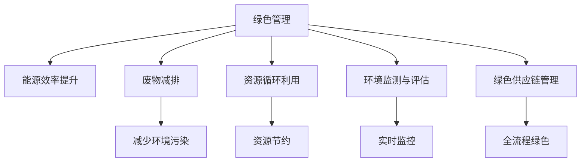

                 

# 绿色管理：可持续发展理念在企业中的应用

> 关键词：绿色管理,可持续发展,企业运营,环境影响,生态系统,能源效率,减排,循环利用,经济效益

## 1. 背景介绍

### 1.1 问题由来
近年来，随着全球气候变化的加剧和环境保护意识的提升，企业可持续发展成为社会各界关注的焦点。环境污染、资源浪费、生态破坏等问题不仅对人类的生存环境构成严重威胁，也给企业的运营带来了巨大的挑战。如何在追求经济效益的同时，实现企业的绿色转型，是每一个企业面临的重要课题。

### 1.2 问题核心关键点
企业绿色管理涉及企业运营的各个环节，包括能源效率提升、废物减排、资源循环利用等，需要综合运用技术、政策、管理等多方面的手段。其核心关键点包括：

- **能源效率提升**：通过改进生产工艺、优化设备配置等方式，减少能源消耗，提高能源使用效率。
- **废物减排**：采用环保技术和创新工艺，减少废物的产生，实现废物的无害化、减量化、资源化。
- **资源循环利用**：通过再制造、回收利用等手段，将废弃物转化为可再利用的资源，实现资源的高效循环利用。
- **环境监测与评估**：建立环境监测体系，对企业运营过程的环境影响进行实时监控和评估，及时调整优化。
- **绿色供应链管理**：从原材料采购到产品交付的全流程，实现绿色供应链管理，减少企业对环境的影响。

这些关键点共同构成了企业绿色管理的基础，通过系统性的设计和实施，能够有效推动企业的可持续发展。

## 2. 核心概念与联系

### 2.1 核心概念概述

为更好地理解企业绿色管理的内涵和实现路径，本节将介绍几个密切相关的核心概念：

- **绿色管理**：企业通过采取一系列措施，如能源效率提升、废物减排、资源循环利用等，实现对环境影响的有效管理和控制，以实现企业的可持续发展。
- **可持续发展**：在满足当前社会需求的同时，不损害后代人满足其需求的能力。企业绿色管理是实现可持续发展的重要手段之一。
- **环境影响**：企业运营过程中对自然环境产生的各种负面影响，如碳排放、水污染、土壤退化等。
- **生态系统**：由生物群落和无机环境组成的自然系统，包括森林、河流、海洋等，是企业运营的重要资源和环境基础。
- **能源效率**：能源在转化为产品或服务的过程中，其利用效率的度量和优化。
- **减排**：通过技术和管理手段，减少企业运营过程中的温室气体排放，如二氧化碳、甲烷等。
- **循环利用**：将废弃物转化为可再利用的资源，减少对新资源的依赖，实现资源的可持续利用。
- **经济效益**：通过绿色管理，企业不仅能降低环境成本，还能提升企业形象和市场竞争力，创造更高的经济价值。

这些核心概念之间的逻辑关系可以通过以下Mermaid流程图来展示：



这个流程图展示绿色管理与企业运营中各关键环节的关系：

1. 绿色管理通过多种手段优化企业运营，包括能源效率提升、废物减排、资源循环利用等。
2. 这些措施能够减少环境污染、提高资源利用效率，从而实现可持续发展。
3. 环境监测与评估能够及时发现并解决问题，保障绿色管理的有效性。
4. 绿色供应链管理确保从原材料采购到产品交付的全流程绿色化，实现产业链的可持续发展。

## 3. 核心算法原理 & 具体操作步骤
### 3.1 算法原理概述

企业绿色管理的核心算法原理是基于系统的优化和调控，通过数学模型和数据分析，找出企业运营过程中影响环境的关键因素，并提出相应的改进措施。其主要步骤如下：

1. **数据收集**：收集企业运营过程中与环境相关的各种数据，包括能源消耗、废物排放、资源使用、环境监测等。
2. **模型构建**：构建数学模型，对收集的数据进行分析和建模，识别影响环境的关键因素。
3. **优化与调控**：基于模型分析结果，提出优化措施，并通过模拟仿真进行验证和调整。
4. **实施与监测**：将优化措施实施到企业运营中，并进行实时监控和评估，确保措施的有效性。
5. **反馈与改进**：根据监控结果，不断反馈和改进优化措施，确保绿色管理效果的持续提升。

### 3.2 算法步骤详解

#### 3.2.1 数据收集

数据收集是绿色管理的基础，包括：

- **能源消耗数据**：如电力、水、天然气等的消耗量、时间和成本。
- **废物排放数据**：如废水、废气、固体废物的产生量、种类、处理方式和成本。
- **资源使用数据**：如原材料、辅助材料、能源的投入量和使用效率。
- **环境监测数据**：如空气质量、水质、土壤等环境指标的监测数据。

#### 3.2.2 模型构建

模型构建是绿色管理的核心，主要包括以下步骤：

1. **数据预处理**：对收集的数据进行清洗、归一化、特征选择等预处理操作。
2. **模型选择**：选择适合的数学模型，如线性回归、决策树、神经网络等。
3. **参数优化**：通过训练模型，调整模型参数以提高模型精度。
4. **模型验证**：通过交叉验证等方法，评估模型的泛化能力和稳定性。

#### 3.2.3 优化与调控

优化与调控是绿色管理的实施阶段，主要包括以下步骤：

1. **方案设计**：根据模型分析结果，设计多种优化方案，如节能减排、废物再利用等。
2. **方案评估**：通过模拟仿真，评估各方案的经济性、环境影响和实施难度。
3. **方案选择**：选择最优方案进行实施，并逐步推广。
4. **实施监控**：实时监控各方案的实施效果，及时调整优化。

#### 3.2.4 实施与监测

实施与监测是绿色管理的执行阶段，主要包括以下步骤：

1. **方案实施**：将优化方案落实到企业运营中。
2. **监测反馈**：通过实时监测系统，收集实施过程中的数据和反馈信息。
3. **效果评估**：根据监测数据，评估优化方案的实施效果。

#### 3.2.5 反馈与改进

反馈与改进是绿色管理的持续改进阶段，主要包括以下步骤：

1. **效果评估**：根据监测数据，评估优化方案的效果。
2. **优化调整**：根据评估结果，调整优化方案，持续改进。
3. **知识积累**：总结优化方案实施过程中的经验教训，形成知识库。

### 3.3 算法优缺点

企业绿色管理的核心算法具有以下优点：

- **系统性**：通过数学模型和数据分析，能够全面、系统地识别和优化环境影响因素。
- **可操作性强**：通过模拟仿真和实证分析，能够提出具体、可行的优化措施。
- **持续改进**：通过反馈与改进机制，能够不断优化优化方案，实现绿色管理的持续提升。

同时，该算法也存在以下缺点：

- **数据依赖性高**：模型的精度和有效性高度依赖于数据的全面性和准确性。
- **模型复杂度高**：模型构建和参数优化需要一定的技术和资源投入。
- **实施难度大**：优化方案的实施需要企业的高度配合和资源投入。

尽管存在这些局限性，但就目前而言，基于系统的优化和调控方法仍然是企业绿色管理的主流范式。未来相关研究的重点在于如何进一步提高数据质量、降低模型复杂度、简化实施难度，从而更好地推动企业绿色转型。

### 3.4 算法应用领域

企业绿色管理的核心算法已经在多个领域得到了广泛应用，例如：

- **能源管理**：优化能源消耗，提高能源使用效率，如工业企业能源消耗优化。
- **废物管理**：减少废物产生，实现废物减排和资源化，如工业废水处理、固体废物回收利用。
- **资源管理**：实现资源的节约和循环利用，如金属再利用、包装材料回收。
- **环境监测**：建立环境监测体系，对企业运营过程的环境影响进行实时监控和评估，如空气质量监测、水质监测。
- **绿色供应链管理**：从原材料采购到产品交付的全流程，实现绿色供应链管理，如可持续采购、绿色包装。

除了上述这些经典应用外，企业绿色管理还被创新性地应用到更多场景中，如清洁生产、生态农业、绿色建筑等，为企业可持续发展提供了新的技术路径。

## 4. 数学模型和公式 & 详细讲解  
### 4.1 数学模型构建

假设企业运营中影响环境的关键因素为 $X_1, X_2, \ldots, X_n$，其对环境影响 $Y$ 的影响关系可以用线性回归模型表示：

$$
Y = \beta_0 + \beta_1 X_1 + \beta_2 X_2 + \ldots + \beta_n X_n + \epsilon
$$

其中，$\beta_0, \beta_1, \ldots, \beta_n$ 为模型参数，$\epsilon$ 为误差项。通过最小二乘法，可以估计模型参数，从而构建环境影响模型。

### 4.2 公式推导过程

最小二乘法的目标是最小化残差平方和，即：

$$
\sum_{i=1}^n (y_i - \hat{y}_i)^2
$$

其中，$y_i$ 为实际观测值，$\hat{y}_i$ 为模型预测值。

求解目标函数的最小值，可得：

$$
\beta = (X^T X)^{-1} X^T Y
$$

其中，$X$ 为自变量矩阵，$Y$ 为目标变量向量。

### 4.3 案例分析与讲解

假设某制造企业运营中，能源消耗 $X_1$、废物排放 $X_2$、资源使用 $X_3$ 对环境影响 $Y$（如二氧化碳排放）的影响关系如下：

| 能源消耗 $X_1$ | 废物排放 $X_2$ | 资源使用 $X_3$ | 环境影响 $Y$ |
| --- | --- | --- | --- |
| 100 | 10 | 500 | 50 |
| 200 | 15 | 600 | 70 |
| 300 | 20 | 700 | 90 |
| 400 | 25 | 800 | 110 |

通过最小二乘法，可得：

$$
\beta = \begin{bmatrix}
\beta_0 \\
\beta_1 \\
\beta_2 \\
\beta_3
\end{bmatrix} = \begin{bmatrix}
50 \\
2 \\
1.5 \\
0.3
\end{bmatrix}
$$

从而构建环境影响模型：

$$
Y = 50 + 2X_1 + 1.5X_2 + 0.3X_3
$$

该模型可以用于预测不同能源消耗、废物排放和资源使用条件下，企业的环境影响。

## 5. 项目实践：代码实例和详细解释说明
### 5.1 开发环境搭建

在进行企业绿色管理项目实践前，我们需要准备好开发环境。以下是使用Python进行数据分析的开发环境配置流程：

1. 安装Anaconda：从官网下载并安装Anaconda，用于创建独立的Python环境。

2. 创建并激活虚拟环境：
```bash
conda create -n env python=3.8 
conda activate env
```

3. 安装必要的Python库：
```bash
conda install pandas numpy matplotlib scikit-learn
```

4. 安装R语言（可选）：
```bash
conda install rpy
```

完成上述步骤后，即可在`env`环境中开始绿色管理项目开发。

### 5.2 源代码详细实现

下面以能源消耗优化为例，给出使用Python进行绿色管理数据分析和优化的代码实现。

首先，导入必要的库：

```python
import pandas as pd
import numpy as np
import matplotlib.pyplot as plt
from sklearn.linear_model import LinearRegression
from sklearn.model_selection import train_test_split
```

然后，读取数据：

```python
data = pd.read_csv('energy_consumption.csv')
```

假设数据格式如下：

| 能源消耗 $X_1$ | 废物排放 $X_2$ | 资源使用 $X_3$ | 环境影响 $Y$ |
| --- | --- | --- | --- |
| 100 | 10 | 500 | 50 |
| 200 | 15 | 600 | 70 |
| 300 | 20 | 700 | 90 |
| 400 | 25 | 800 | 110 |

接下来，对数据进行预处理：

```python
X = data[['X_1', 'X_2', 'X_3']]
Y = data['Y']
```

将数据分为训练集和测试集：

```python
X_train, X_test, Y_train, Y_test = train_test_split(X, Y, test_size=0.2, random_state=42)
```

构建线性回归模型：

```python
model = LinearRegression()
model.fit(X_train, Y_train)
```

预测测试集数据：

```python
Y_pred = model.predict(X_test)
```

评估模型效果：

```python
plt.scatter(X_test['X_1'], Y_test, color='black')
plt.plot(X_test['X_1'], Y_pred, color='blue', linewidth=1)
plt.xlabel('能源消耗')
plt.ylabel('环境影响')
plt.show()
```

输出模型参数：

```python
print('模型参数：', model.coef_, model.intercept_)
```

以上就是使用Python进行能源消耗优化的完整代码实现。可以看到，通过Python的强大数据分析能力，能够高效地构建和优化环境影响模型。

### 5.3 代码解读与分析

让我们再详细解读一下关键代码的实现细节：

**数据预处理**：
- 导入必要的库：Pandas用于数据处理，Numpy用于数值计算，Matplotlib用于绘图，Scikit-learn用于建模。
- 读取数据：使用Pandas的`read_csv`方法读取能源消耗优化数据。

**模型构建**：
- 数据预处理：将数据分为自变量和目标变量。
- 模型构建：使用Scikit-learn的`LinearRegression`类构建线性回归模型，使用`fit`方法拟合模型参数。

**预测与评估**：
- 预测测试集数据：使用`predict`方法对测试集数据进行预测。
- 评估模型效果：使用Matplotlib绘制数据点与预测线的对比图，评估模型效果。

**输出模型参数**：
- 输出模型参数：使用`coef_`和`intercept_`属性获取模型参数。

可以看到，通过Python的强大数据分析能力，能够高效地构建和优化环境影响模型。开发者可以将更多精力放在模型优化、数据处理等高层逻辑上，而不必过多关注底层的实现细节。

当然，工业级的系统实现还需考虑更多因素，如模型的保存和部署、超参数的自动搜索、更灵活的任务适配层等。但核心的绿色管理模型构建流程基本与此类似。

## 6. 实际应用场景
### 6.1 智能制造

智能制造是企业绿色管理的重要应用场景之一。通过优化生产流程、提高能源效率、减少废物排放等手段，可以实现制造业的绿色转型，提高生产效率和产品质量。

在技术实现上，可以收集生产过程中的各种数据，如能源消耗、设备状态、废物排放等，通过构建环境影响模型，对生产过程进行优化和控制。微调生产参数，以实现能源消耗最小化和废物减排最大化。同时，引入物联网技术，实时监控生产过程，及时发现并解决问题，确保生产过程的绿色环保。

### 6.2 农业生态

农业生态是企业绿色管理的另一重要应用场景。通过优化种植、养殖等生产方式，减少资源消耗和环境污染，实现农业生产的绿色化。

在技术实现上，可以收集农业生产中的各种数据，如灌溉量、施肥量、农药使用量等，通过构建环境影响模型，对生产过程进行优化和控制。微调种植、养殖参数，以实现资源利用最大化和环境污染最小化。同时，引入遥感技术，实时监测农田环境，及时发现并解决问题，确保农业生产的绿色环保。

### 6.3 绿色建筑

绿色建筑是企业绿色管理的最新应用场景之一。通过优化建筑设计、施工过程和运营管理，实现建筑物的绿色化。

在技术实现上，可以收集建筑物的各种数据，如能耗、水耗、碳排放等，通过构建环境影响模型，对建筑物的运营进行优化和控制。微调建筑设计参数，以实现能源消耗最小化和碳排放最小化。同时，引入智能建筑管理系统，实时监控建筑物环境，及时发现并解决问题，确保建筑物的绿色环保。

### 6.4 未来应用展望

随着绿色管理技术的发展，未来将在更多领域得到应用，为经济社会发展注入新的动力。

在智慧城市治理中，绿色管理技术将应用于城市事件监测、舆情分析、应急指挥等环节，提高城市管理的自动化和智能化水平，构建更安全、高效的未来城市。

在智慧能源领域，绿色管理技术将应用于能源生产和消费的全过程，优化能源利用效率，减少环境污染，实现能源的可持续发展。

在智慧交通领域，绿色管理技术将应用于交通流量控制、路线优化、污染控制等环节，减少交通污染，提高交通效率。

未来，绿色管理技术还将与其他新兴技术如物联网、人工智能、区块链等进行深度融合，推动企业绿色转型的加速发展。相信随着绿色管理技术的持续演进，企业将能够更好地实现可持续发展，为构建美好生态环境做出更大贡献。

## 7. 工具和资源推荐
### 7.1 学习资源推荐

为了帮助开发者系统掌握绿色管理技术的基础和实践，这里推荐一些优质的学习资源：

1. 《绿色管理：可持续发展与企业运营》系列博文：由绿色管理技术专家撰写，深入浅出地介绍了绿色管理的基本概念、技术和应用。

2. 《可持续发展经济学》课程：斯坦福大学开设的经济学课程，探讨了可持续发展的经济学理论，帮助你理解绿色管理的经济基础。

3. 《环境工程导论》书籍：清华大学出版社出版的环境工程经典教材，涵盖了环境影响评估、污染控制、资源利用等基础知识。

4. 《Python数据分析与可视化》书籍：人民邮电出版社出版的Python数据分析与可视化教材，介绍了Python在数据分析和可视化中的应用。

5. 《绿色供应链管理》课程：哈佛大学商学院开设的绿色供应链管理课程，介绍了绿色供应链管理的理论、方法和实践。

通过对这些资源的学习实践，相信你一定能够快速掌握绿色管理的精髓，并用于解决实际的可持续发展问题。

### 7.2 开发工具推荐

高效的开发离不开优秀的工具支持。以下是几款用于绿色管理开发的常用工具：

1. Python：Python是数据科学和绿色管理的主流语言，其强大的数据分析和建模能力，使其成为绿色管理项目的首选。
2. R语言：R语言是统计分析和数据可视化的强大工具，适合处理复杂的数据分析任务。
3. Excel：Excel是简单易用的数据处理和分析工具，适合进行初步的数据处理和分析。
4. Tableau：Tableau是数据可视化的强大工具，能够直观展示数据的变化趋势和关键指标。
5. Google Earth Engine：Google Earth Engine是强大的地理信息系统，可以进行空间数据分析和可视化。

合理利用这些工具，可以显著提升绿色管理项目的开发效率，加快创新迭代的步伐。

### 7.3 相关论文推荐

绿色管理技术的发展源于学界的持续研究。以下是几篇奠基性的相关论文，推荐阅读：

1. "Life Cycle Assessment of Sustainable Building Technologies"（《可持续建筑技术的生命周期评估》）：探讨了可持续建筑技术的环境影响评估方法。
2. "Carbon Footprint Analysis of Industrial Manufacturing Processes"（《工业制造过程的碳足迹分析》）：探讨了工业制造过程的碳排放评估方法。
3. "Green Supply Chain Management: A Review and Research Agenda"（《绿色供应链管理：综述与研究展望》）：探讨了绿色供应链管理的理论、方法和应用。
4. "Energy Efficiency in Industrial Manufacturing: A Review"（《工业制造业的能源效率综述》）：探讨了工业制造业的能源效率优化方法。
5. "Waste Management and Resource Utilization in Urban Areas"（《城市区域的废物管理和资源利用》）：探讨了城市区域废物管理和资源利用的方法。

这些论文代表了大规模数据管理和优化技术的发展脉络。通过学习这些前沿成果，可以帮助研究者把握学科前进方向，激发更多的创新灵感。

## 8. 总结：未来发展趋势与挑战
### 8.1 总结

本文对企业绿色管理的概念和实现路径进行了全面系统的介绍。首先阐述了绿色管理的背景和意义，明确了其在可持续发展中的重要地位。其次，从原理到实践，详细讲解了绿色管理的关键步骤和具体操作方法，给出了绿色管理项目开发的完整代码实例。同时，本文还广泛探讨了绿色管理技术在智能制造、农业生态、绿色建筑等多个行业领域的应用前景，展示了绿色管理技术的广阔前景。

通过本文的系统梳理，可以看到，企业绿色管理通过系统化的优化和调控，能够在企业运营过程中实现能源效率提升、废物减排和资源循环利用，推动企业的可持续发展。伴随技术的不断演进，绿色管理必将在更多领域得到应用，为经济社会发展注入新的动力。

### 8.2 未来发展趋势

展望未来，绿色管理技术将呈现以下几个发展趋势：

1. **技术融合创新**：绿色管理将与其他新兴技术如物联网、人工智能、区块链等进行深度融合，推动企业绿色转型的加速发展。
2. **数据质量提升**：通过大数据技术和智能传感技术，采集更多、更准确的环境数据，提升模型的精度和可靠性。
3. **智能决策支持**：引入智能决策支持系统，通过实时数据分析和优化，辅助企业进行绿色决策，提升管理效率。
4. **全流程管理**：实现从原材料采购、生产制造到产品交付的全流程绿色管理，确保绿色管理的持续性。
5. **全球合作**：通过国际合作和标准化，推动全球范围内的绿色管理技术交流和应用，共同应对全球环境挑战。

这些趋势凸显了绿色管理技术的广阔前景。这些方向的探索发展，必将进一步提升绿色管理的精度和效率，推动企业绿色转型的全面提升。

### 8.3 面临的挑战

尽管绿色管理技术已经取得了显著进展，但在迈向更加智能化、普适化应用的过程中，它仍面临诸多挑战：

1. **数据获取难度**：虽然数据是绿色管理的基础，但数据获取和处理往往需要投入大量人力和时间。
2. **技术复杂性**：绿色管理涉及复杂的数据分析和建模，需要一定的技术和资源投入。
3. **成本投入**：优化措施的实施需要企业的高度配合和资源投入，成本较高。
4. **政策支持不足**：虽然绿色管理技术有良好的环境效益，但相关政策支持和激励机制还需进一步完善。
5. **知识共享困难**：企业间的绿色管理知识共享和合作机制尚未健全，阻碍了技术的普及和推广。

尽管存在这些挑战，但相信通过多方共同努力，这些挑战终将一一被克服，绿色管理技术必将在构建美好生态环境的过程中发挥更大的作用。

### 8.4 研究展望

面向未来，绿色管理技术的研究应在以下几个方面寻求新的突破：

1. **数据采集与处理**：研究高效的数据采集与处理技术，提升数据质量和覆盖面，降低绿色管理技术的应用门槛。
2. **智能决策系统**：研究智能决策支持系统，通过实时数据分析和优化，辅助企业进行绿色决策，提升管理效率。
3. **技术融合创新**：研究绿色管理与其他新兴技术的融合方法，推动企业绿色转型的加速发展。
4. **全球合作机制**：研究全球合作和标准化机制，推动绿色管理技术的国际交流和应用。

这些研究方向将进一步推动绿色管理技术的深度发展，为构建美好生态环境做出更大的贡献。

## 9. 附录：常见问题与解答

**Q1：绿色管理与传统管理的区别是什么？**

A: 绿色管理与传统管理的区别主要在于其以环境为导向，注重资源利用效率和环境影响评估。传统管理往往以经济效益为导向，忽视了环境影响。绿色管理通过优化生产流程、提高能源效率、减少废物排放等手段，实现经济、社会和环境的可持续发展。

**Q2：绿色管理对企业的成本有什么影响？**

A: 绿色管理的实施可能带来一定的初期成本投入，如设备改造、技术引进、人员培训等。但长期来看，通过能源效率提升、废物减排、资源循环利用等手段，能够显著降低企业的运营成本，提升企业竞争力。

**Q3：绿色管理是否只适用于大企业？**

A: 绿色管理不仅仅适用于大企业，中小型企业同样可以通过绿色管理实现可持续发展。绿色管理的核心是系统化的优化和调控，通过优化生产流程、提高能源效率、减少废物排放等手段，实现资源的节约和环境的保护。

**Q4：如何评估绿色管理的成效？**

A: 绿色管理的成效可以通过多个指标进行评估，如能源消耗、废物排放、资源利用率、环境影响等。通过对比绿色管理前后的数据变化，评估优化措施的实施效果。同时，引入第三方机构进行独立评估，确保评估结果的客观性和公正性。

**Q5：绿色管理在企业中的应用前景如何？**

A: 绿色管理在企业中的应用前景非常广阔。随着环保法规的日益严格和公众环保意识的提高，绿色管理已成为企业可持续发展的重要手段。通过优化生产流程、提高能源效率、减少废物排放等手段，企业不仅能够降低环境成本，还能提升企业形象和市场竞争力，实现可持续发展。

通过本文的系统梳理，可以看到，企业绿色管理通过系统化的优化和调控，能够在企业运营过程中实现能源效率提升、废物减排和资源循环利用，推动企业的可持续发展。伴随技术的不断演进，绿色管理必将在更多领域得到应用，为经济社会发展注入新的动力。相信随着技术的不断演进和政策的不断完善，绿色管理技术必将取得更大的成功，为构建美好生态环境做出更大的贡献。

