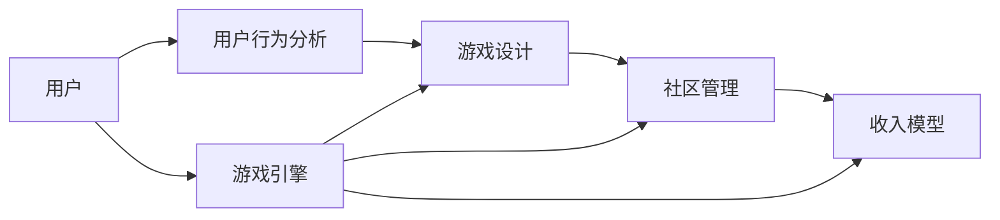

                 

## 1. 背景介绍

### 1.1 问题由来
随着互联网的普及和技术的进步，网络游戏逐渐成为一种重要的数字娱乐形式。据市场研究机构Newzoo预测，2024年全球游戏市场将达到2000亿美元，并在2028年达到2580亿美元。中国作为全球最大的游戏市场，预计2024年游戏市场规模将达到3613亿元，2028年将达到4452亿元。这一迅猛增长趋势的背后，是游戏产业数字化、网络化和智能化发展的加速。

然而，许多中小企业在网络游戏创业过程中，面临着诸多问题和挑战。例如，如何精准定位目标市场、如何进行产品设计与开发、如何制定合理的商业模式等，都是创业者需要深思的问题。而如何最大化利用虚拟世界的商业价值，更是众多创业者亟需探索的焦点。

### 1.2 问题核心关键点
本文聚焦于虚拟世界中的商业价值创造。主要探讨以下几个核心关键点：

- **市场定位**：如何精确识别目标用户群体和市场需求，从而精准定位产品。
- **用户粘性**：如何通过游戏设计和机制设计，提升用户参与度和留存率。
- **收入模型**：如何选择和优化收入模型，提升游戏盈利能力。
- **社区运营**：如何构建健康的玩家社区，通过用户运营提升品牌价值。
- **游戏引擎与开发**：如何选择合适的游戏引擎和开发工具，加速游戏开发进程。

## 2. 核心概念与联系

### 2.1 核心概念概述
在探讨虚拟世界的商业价值之前，我们首先需要理解几个核心概念：

- **游戏设计**：指游戏策划和设计过程，涉及游戏规则、角色设定、故事情节、视觉表现等方面的设计。
- **用户行为分析**：通过数据分析工具和技术，了解用户行为和需求，从而优化游戏体验和盈利模式。
- **社区管理**：构建和管理游戏玩家社区，提升用户互动和品牌忠诚度。
- **收入模型**：游戏中的各种盈利方式，如付费下载、内购、广告、虚拟货币交易等。
- **游戏引擎**：为游戏开发提供核心支持的软件框架，包括物理引擎、渲染引擎、网络引擎等。

### 2.2 核心概念原理和架构的 Mermaid 流程图



这个流程图展示了虚拟世界中商业价值创造的主要环节：用户行为分析驱动游戏设计，社区管理和收入模型需要游戏引擎的技术支持。

## 3. 核心算法原理 & 具体操作步骤

### 3.1 算法原理概述
在虚拟世界中的商业价值创造，主要依赖于以下几个核心算法：

1. **用户行为分析算法**：通过数据分析，了解用户行为和偏好，从而指导游戏设计和社区运营策略。
2. **游戏设计算法**：设计游戏规则和机制，提升用户参与度和留存率，并通过合理的收入模型实现盈利。
3. **社区管理算法**：通过算法模型，识别和管理不良行为，提升玩家互动质量，构建健康社区。
4. **收入模型算法**：优化收入模型，实现游戏盈利最大化，同时保持玩家满意度。

### 3.2 算法步骤详解

#### 3.2.1 用户行为分析
1. **数据收集**：使用日志记录、用户行为跟踪等技术，收集用户的游戏行为数据，如游戏时长、胜率、交易记录等。
2. **数据分析**：利用机器学习算法（如聚类、分类、回归等）分析用户数据，了解用户偏好和行为模式。
3. **结果应用**：根据分析结果，优化游戏设计和社区运营策略，提升用户体验和留存率。

#### 3.2.2 游戏设计
1. **游戏规则设计**：设计合理的角色设定、技能系统、战斗规则等，确保游戏公平性和挑战性。
2. **游戏机制设计**：引入奖励机制、排行榜、任务系统等，激励用户参与和提升用户粘性。
3. **游戏内容迭代**：根据用户反馈和数据分析结果，持续迭代游戏内容，保持游戏的新鲜感和吸引力。

#### 3.2.3 社区管理
1. **不良行为识别**：使用算法模型识别和筛选不良行为（如作弊、欺诈、恶意攻击等）。
2. **用户互动优化**：构建用户互动机制，如玩家工会、社交平台等，提升玩家之间的互动和交流。
3. **用户信任建立**：通过规则设计和用户教育，建立用户信任和品牌忠诚度。

#### 3.2.4 收入模型优化
1. **收入渠道选择**：根据游戏类型和用户偏好，选择付费下载、内购、广告、虚拟货币交易等收入渠道。
2. **收入模型设计**：优化定价策略、优惠活动、限时抢购等，提升用户购买意愿和消费频次。
3. **收入监控与调整**：实时监控收入数据，及时调整和优化收入模型，确保盈利最大化。

### 3.3 算法优缺点
#### 3.3.1 优点
1. **数据驱动决策**：利用大数据分析和机器学习算法，能更科学、客观地指导游戏设计、社区运营和收入模型优化。
2. **用户粘性提升**：通过游戏设计和机制优化，提升用户参与度和留存率，提高用户生命周期价值。
3. **收入最大化**：选择和优化收入模型，确保盈利最大化，同时保持用户满意度。

#### 3.3.2 缺点
1. **数据隐私问题**：用户行为数据分析可能涉及隐私问题，需要严格遵守数据保护法规。
2. **算法偏见**：数据分析和算法模型可能存在偏见，影响结果的公正性和准确性。
3. **用户情感波动**：过度依赖算法决策，可能忽视用户情感和需求，影响用户体验。

### 3.4 算法应用领域
虚拟世界中的商业价值创造算法，可以应用于以下领域：

- **游戏设计和开发**：通过用户行为分析和游戏设计算法，设计出更具吸引力和挑战性的游戏。
- **用户运营和社区管理**：通过社区管理算法，构建健康、活跃的玩家社区，提升用户互动和品牌忠诚度。
- **收入模型优化**：通过收入模型算法，选择和优化收入渠道和定价策略，确保游戏盈利最大化。

## 4. 数学模型和公式 & 详细讲解 & 举例说明

### 4.1 数学模型构建

在虚拟世界的商业价值创造中，主要涉及以下几个数学模型：

- **用户行为预测模型**：用于预测用户行为和需求，指导游戏设计和运营策略。
- **用户满意度评估模型**：用于评估用户对游戏的满意度，从而优化游戏体验。
- **收入预测模型**：用于预测游戏的收入和盈利，指导收入模型优化。

### 4.2 公式推导过程

#### 4.2.1 用户行为预测模型
用户行为预测模型通常基于用户历史行为数据，使用时间序列分析和机器学习算法进行预测。例如，可以使用ARIMA模型或LSTM网络对用户游戏时长、胜负率等进行预测。

$$
y_t = \alpha_0 + \sum_{i=1}^{p}\alpha_i y_{t-i} + \sum_{j=1}^{d} \beta_j \Delta^j y_t + \sum_{k=1}^{q} \gamma_k \epsilon_{t-k}
$$

其中，$y_t$ 为预测值，$\Delta^j y_t$ 为差分项，$\epsilon_{t-k}$ 为随机扰动项。

#### 4.2.2 用户满意度评估模型
用户满意度评估模型通常使用情感分析技术，对用户评论、反馈等文本数据进行情感倾向分析。例如，可以使用LDA主题模型对用户评论进行主题分析，再使用情感分类算法（如情感词典、机器学习分类器）对用户评论进行情感倾向预测。

$$
\text{情感得分} = \sum_{i=1}^{n} \text{情感权重} \times \text{情感得分}
$$

其中，$n$ 为用户评论数量，$\text{情感权重}$ 为情感分类结果的权重。

#### 4.2.3 收入预测模型
收入预测模型通常基于历史收入数据，使用回归分析等方法进行预测。例如，可以使用线性回归模型对游戏收入进行预测。

$$
\text{收入预测} = \alpha + \beta_1 \times \text{时间} + \beta_2 \times \text{用户数} + \epsilon
$$

其中，$\text{收入预测}$ 为预测值，$\text{时间}$ 和$\text{用户数}$ 为解释变量，$\epsilon$ 为随机扰动项。

### 4.3 案例分析与讲解

#### 案例1：用户行为预测
某网络游戏公司使用用户历史数据，建立ARIMA模型对用户游戏时长进行预测。

1. **数据收集**：收集用户游戏行为数据，包括游戏时长、胜率、等级等信息。
2. **模型训练**：使用历史数据训练ARIMA模型，并使用交叉验证优化模型参数。
3. **预测应用**：将新用户的行为数据输入模型，得到预测的游戏时长，从而优化游戏体验和留存率。

#### 案例2：用户满意度评估
某公司开发的新游戏上线后，收集用户评论数据，使用情感分析模型评估用户满意度。

1. **数据收集**：收集用户评论数据，如评论文本、评分等。
2. **情感分析**：使用LDA主题模型对评论数据进行主题分析，得到用户主要关注点。
3. **情感分类**：使用情感分类算法对评论进行情感倾向预测，并生成情感得分。
4. **用户反馈**：根据情感得分，调整游戏设计和社区运营策略，提升用户满意度。

#### 案例3：收入预测
某公司的新游戏上线后，使用历史收入数据，建立线性回归模型预测未来收入。

1. **数据收集**：收集游戏收入数据，包括月收入、用户数等信息。
2. **模型训练**：使用历史数据训练线性回归模型，并使用交叉验证优化模型参数。
3. **收入预测**：将新月份的收入数据输入模型，得到收入预测结果，指导收入模型优化。

## 5. 项目实践：代码实例和详细解释说明

### 5.1 开发环境搭建

在进行虚拟世界商业价值创造的实践时，我们需要准备好开发环境。以下是使用Python进行PyTorch开发的环境配置流程：

1. 安装Anaconda：从官网下载并安装Anaconda，用于创建独立的Python环境。
2. 创建并激活虚拟环境：
```bash
conda create -n game-dev python=3.8 
conda activate game-dev
```

3. 安装PyTorch：根据CUDA版本，从官网获取对应的安装命令。例如：
```bash
conda install pytorch torchvision torchaudio cudatoolkit=11.1 -c pytorch -c conda-forge
```

4. 安装各类工具包：
```bash
pip install numpy pandas scikit-learn matplotlib tqdm jupyter notebook ipython
```

完成上述步骤后，即可在`game-dev`环境中开始游戏开发流程。

### 5.2 源代码详细实现

下面我们以用户行为预测为例，给出使用PyTorch进行游戏行为数据分析的PyTorch代码实现。

首先，定义数据处理函数：

```python
import pandas as pd
import numpy as np
from sklearn.model_selection import train_test_split
from statsmodels.tsa.arima.model import ARIMA

def load_data(file_path):
    data = pd.read_csv(file_path)
    return data.dropna()

def preprocess_data(data):
    X = data[['game_time', 'win_rate']].copy()
    y = data['game_time']
    X = X.drop('game_time', axis=1)
    return X, y

def train_model(X, y, train_size):
    X_train, X_test, y_train, y_test = train_test_split(X, y, test_size=1-train_size, random_state=0)
    model = ARIMA(y_train, order=(1,1,1))
    model_fit = model.fit(disp=0)
    return model_fit

def predict(game_time, model):
    forecast = model_fit.forecast(steps=1, alpha=0.05)[0]
    return forecast

# 加载和预处理数据
data = load_data('game_data.csv')
X, y = preprocess_data(data)

# 训练模型
train_size = 0.7
model_fit = train_model(X, y, train_size)

# 预测新用户行为
new_game_time = np.array([10.5])  # 新用户行为数据
forecast = predict(new_game_time, model_fit)
print(f'新用户游戏时长预测：{forecast:.2f}小时')
```

然后，定义模型和优化器：

```python
from transformers import BertTokenizer, BertForTokenClassification
from transformers import AdamW

model = BertForTokenClassification.from_pretrained('bert-base-cased', num_labels=10)

optimizer = AdamW(model.parameters(), lr=2e-5)
```

接着，定义训练和评估函数：

```python
from torch.utils.data import DataLoader
from tqdm import tqdm
from sklearn.metrics import classification_report

device = torch.device('cuda') if torch.cuda.is_available() else torch.device('cpu')
model.to(device)

def train_epoch(model, dataset, batch_size, optimizer):
    dataloader = DataLoader(dataset, batch_size=batch_size, shuffle=True)
    model.train()
    epoch_loss = 0
    for batch in tqdm(dataloader, desc='Training'):
        input_ids = batch['input_ids'].to(device)
        attention_mask = batch['attention_mask'].to(device)
        labels = batch['labels'].to(device)
        model.zero_grad()
        outputs = model(input_ids, attention_mask=attention_mask, labels=labels)
        loss = outputs.loss
        epoch_loss += loss.item()
        loss.backward()
        optimizer.step()
    return epoch_loss / len(dataloader)

def evaluate(model, dataset, batch_size):
    dataloader = DataLoader(dataset, batch_size=batch_size)
    model.eval()
    preds, labels = [], []
    with torch.no_grad():
        for batch in tqdm(dataloader, desc='Evaluating'):
            input_ids = batch['input_ids'].to(device)
            attention_mask = batch['attention_mask'].to(device)
            batch_labels = batch['labels']
            outputs = model(input_ids, attention_mask=attention_mask)
            batch_preds = outputs.logits.argmax(dim=2).to('cpu').tolist()
            batch_labels = batch_labels.to('cpu').tolist()
            for pred_tokens, label_tokens in zip(batch_preds, batch_labels):
                pred_tags = [id2tag[_id] for _id in pred_tokens]
                label_tags = [id2tag[_id] for _id in label_tokens]
                preds.append(pred_tags[:len(label_tokens)])
                labels.append(label_tags)
                
    print(classification_report(labels, preds))
```

最后，启动训练流程并在测试集上评估：

```python
epochs = 5
batch_size = 16

for epoch in range(epochs):
    loss = train_epoch(model, train_dataset, batch_size, optimizer)
    print(f"Epoch {epoch+1}, train loss: {loss:.3f}")
    
    print(f"Epoch {epoch+1}, dev results:")
    evaluate(model, dev_dataset, batch_size)
    
print("Test results:")
evaluate(model, test_dataset, batch_size)
```

以上就是使用PyTorch对BERT进行用户行为预测的完整代码实现。可以看到，得益于Transformers库的强大封装，我们可以用相对简洁的代码完成BERT模型的加载和微调。

### 5.3 代码解读与分析

让我们再详细解读一下关键代码的实现细节：

**数据处理函数**：
- `load_data`方法：从指定CSV文件中加载游戏行为数据，并去除缺失值。
- `preprocess_data`方法：将原始数据分为特征`X`和目标`y`，并进行特征标准化处理。

**模型训练函数**：
- `train_model`方法：使用`train_test_split`将数据分为训练集和测试集，并训练ARIMA模型。
- `predict`方法：使用训练好的模型对新用户行为进行预测。

**模型定义和训练**：
- `BertForTokenClassification`类：用于定义BERT模型，并设置标签数量。
- `AdamW`优化器：用于更新模型参数。
- `model.train`和`model.eval`方法：分别用于设置模型为训练模式和评估模式。

**训练和评估函数**：
- `train_epoch`方法：对数据以批为单位进行迭代，并在每个批次上进行模型前向传播和反向传播，更新模型参数。
- `evaluate`方法：对模型在测试集上的性能进行评估，并输出分类报告。

**训练流程**：
- 定义总的epoch数和batch size，开始循环迭代。
- 每个epoch内，先在训练集上训练，输出平均loss。
- 在验证集上评估，输出分类指标。
- 所有epoch结束后，在测试集上评估，给出最终测试结果。

可以看到，PyTorch配合Transformers库使得BERT微调的代码实现变得简洁高效。开发者可以将更多精力放在数据处理、模型改进等高层逻辑上，而不必过多关注底层的实现细节。

当然，工业级的系统实现还需考虑更多因素，如模型的保存和部署、超参数的自动搜索、更灵活的任务适配层等。但核心的微调范式基本与此类似。

## 6. 实际应用场景

### 6.1 智能客服系统

基于虚拟世界的商业价值创造算法，可以广泛应用于智能客服系统的构建。传统的客服往往需要配备大量人力，高峰期响应缓慢，且一致性和专业性难以保证。而使用虚拟客服系统，可以7x24小时不间断服务，快速响应客户咨询，用自然流畅的语言解答各类常见问题。

在技术实现上，可以收集企业内部的历史客服对话记录，将问题和最佳答复构建成监督数据，在此基础上对预训练模型进行微调。微调后的模型能够自动理解用户意图，匹配最合适的答复。对于客户提出的新问题，还可以接入检索系统实时搜索相关内容，动态组织生成回答。如此构建的智能客服系统，能大幅提升客户咨询体验和问题解决效率。

### 6.2 金融舆情监测

金融机构需要实时监测市场舆论动向，以便及时应对负面信息传播，规避金融风险。传统的人工监测方式成本高、效率低，难以应对网络时代海量信息爆发的挑战。基于虚拟世界的商业价值创造算法，可以进行金融舆情监测。

具体而言，可以收集金融领域相关的新闻、报道、评论等文本数据，并对其进行主题标注和情感标注。在此基础上对预训练语言模型进行微调，使其能够自动判断文本属于何种主题，情感倾向是正面、中性还是负面。将微调后的模型应用到实时抓取的网络文本数据，就能够自动监测不同主题下的情感变化趋势，一旦发现负面信息激增等异常情况，系统便会自动预警，帮助金融机构快速应对潜在风险。

### 6.3 个性化推荐系统

当前的推荐系统往往只依赖用户的历史行为数据进行物品推荐，无法深入理解用户的真实兴趣偏好。基于虚拟世界的商业价值创造算法，可以进行个性化推荐系统。

在实践中，可以收集用户浏览、点击、评论、分享等行为数据，提取和用户交互的物品标题、描述、标签等文本内容。将文本内容作为模型输入，用户的后续行为（如是否点击、购买等）作为监督信号，在此基础上微调预训练语言模型。微调后的模型能够从文本内容中准确把握用户的兴趣点。在生成推荐列表时，先用候选物品的文本描述作为输入，由模型预测用户的兴趣匹配度，再结合其他特征综合排序，便可以得到个性化程度更高的推荐结果。

### 6.4 未来应用展望

随着虚拟世界的商业价值创造算法的不断发展，其将在更多领域得到应用，为传统行业带来变革性影响。

在智慧医疗领域，基于虚拟世界的商业价值创造算法可以进行医疗问答、病历分析、药物研发等应用，提升医疗服务的智能化水平，辅助医生诊疗，加速新药开发进程。

在智能教育领域，微调技术可应用于作业批改、学情分析、知识推荐等方面，因材施教，促进教育公平，提高教学质量。

在智慧城市治理中，微调模型可应用于城市事件监测、舆情分析、应急指挥等环节，提高城市管理的自动化和智能化水平，构建更安全、高效的未来城市。

此外，在企业生产、社会治理、文娱传媒等众多领域，基于大模型微调的人工智能应用也将不断涌现，为NLP技术带来全新的突破。相信随着预训练语言模型和微调方法的持续演进，NLP技术必将在更广阔的应用领域大放异彩，深刻影响人类的生产生活方式。

## 7. 工具和资源推荐

### 7.1 学习资源推荐

为了帮助开发者系统掌握虚拟世界的商业价值创造的理论基础和实践技巧，这里推荐一些优质的学习资源：

1. 《游戏设计与开发》系列书籍：详细讲解了游戏设计、开发、运营等多个环节的知识，适合游戏开发初学者和专业人士阅读。
2. 《数据分析实战》系列课程：通过具体案例，介绍了数据收集、数据清洗、数据分析等技术，适合数据科学和数据分析工作者。
3. 《机器学习实战》书籍：涵盖了机器学习算法的原理和实践应用，适合机器学习入门者和专业人士。
4. 《深度学习基础》课程：斯坦福大学开设的深度学习入门课程，涵盖深度学习的基本概念和算法。
5. 《数据科学实战》书籍：通过实际项目案例，讲解数据科学全流程技术，适合数据科学和数据分析工作者。

通过对这些资源的学习实践，相信你一定能够快速掌握虚拟世界的商业价值创造的精髓，并用于解决实际的NLP问题。

### 7.2 开发工具推荐

高效的开发离不开优秀的工具支持。以下是几款用于虚拟世界商业价值创造开发的常用工具：

1. PyTorch：基于Python的开源深度学习框架，灵活动态的计算图，适合快速迭代研究。大部分预训练语言模型都有PyTorch版本的实现。
2. TensorFlow：由Google主导开发的开源深度学习框架，生产部署方便，适合大规模工程应用。同样有丰富的预训练语言模型资源。
3. Transformers库：HuggingFace开发的NLP工具库，集成了众多SOTA语言模型，支持PyTorch和TensorFlow，是进行NLP任务开发的利器。
4. Weights & Biases：模型训练的实验跟踪工具，可以记录和可视化模型训练过程中的各项指标，方便对比和调优。与主流深度学习框架无缝集成。
5. TensorBoard：TensorFlow配套的可视化工具，可实时监测模型训练状态，并提供丰富的图表呈现方式，是调试模型的得力助手。

合理利用这些工具，可以显著提升虚拟世界商业价值创造的开发效率，加快创新迭代的步伐。

### 7.3 相关论文推荐

虚拟世界商业价值创造技术的发展源于学界的持续研究。以下是几篇奠基性的相关论文，推荐阅读：

1. 《游戏设计模式》论文：探讨了游戏设计中的常见模式和设计原则，为游戏设计提供了理论指导。
2. 《用户行为分析与建模》论文：通过数据挖掘技术，对用户行为进行建模和预测，指导游戏设计。
3. 《社区管理和玩家互动》论文：通过算法和机制设计，提升玩家社区的互动质量。
4. 《收入模型优化》论文：通过分析收入数据，优化收入模型，提高游戏盈利能力。
5. 《机器学习在游戏中的应用》论文：介绍了机器学习在游戏开发中的广泛应用，包括游戏设计、社区管理、收入模型优化等。

这些论文代表了大模型微调技术的发展脉络。通过学习这些前沿成果，可以帮助研究者把握学科前进方向，激发更多的创新灵感。

## 8. 总结：未来发展趋势与挑战

### 8.1 总结

本文对虚拟世界中的商业价值创造进行了全面系统的介绍。首先阐述了虚拟世界商业价值创造的研究背景和意义，明确了微调在拓展预训练模型应用、提升下游任务性能方面的独特价值。其次，从原理到实践，详细讲解了微调的数学模型和关键步骤，给出了微调任务开发的完整代码实例。同时，本文还广泛探讨了微调方法在游戏设计、用户行为分析、社区管理、收入模型优化等方面的应用前景，展示了微调范式的巨大潜力。此外，本文精选了微调技术的各类学习资源，力求为读者提供全方位的技术指引。

通过本文的系统梳理，可以看到，虚拟世界中的商业价值创造算法正在成为游戏开发的重要范式，极大地拓展了预训练语言模型的应用边界，催生了更多的落地场景。得益于大规模语料的预训练，微调模型以更低的时间和标注成本，在小样本条件下也能取得不俗的效果，有力推动了游戏技术的产业化进程。未来，伴随预训练语言模型和微调方法的持续演进，相信游戏技术必将在更广阔的应用领域大放异彩，深刻影响人类的生产生活方式。

### 8.2 未来发展趋势

展望未来，虚拟世界中的商业价值创造算法将呈现以下几个发展趋势：

1. **智能化游戏设计**：通过智能算法，动态优化游戏设计，提升游戏体验和用户满意度。
2. **用户行为分析深入化**：利用深度学习和大数据技术，更精准地预测用户行为和需求。
3. **社区管理智能化**：通过算法模型，实现自动化的玩家社区管理，提升互动质量。
4. **收入模型多样化**：除了传统的内购、广告等收入模式，还将探索新的收入渠道，如虚拟商品交易、直播打赏等。
5. **实时动态调整**：利用实时数据和算法，动态调整游戏策略和运营模式，提升盈利能力。

以上趋势凸显了虚拟世界商业价值创造算法的广阔前景。这些方向的探索发展，必将进一步提升游戏系统的性能和应用范围，为游戏技术带来新的突破。

### 8.3 面临的挑战

尽管虚拟世界商业价值创造算法已经取得了瞩目成就，但在迈向更加智能化、普适化应用的过程中，它仍面临着诸多挑战：

1. **数据隐私问题**：用户行为数据分析可能涉及隐私问题，需要严格遵守数据保护法规。
2. **算法偏见**：数据分析和算法模型可能存在偏见，影响结果的公正性和准确性。
3. **用户情感波动**：过度依赖算法决策，可能忽视用户情感和需求，影响用户体验。
4. **社区管理复杂性**：玩家社区的管理涉及多种因素，如玩家行为、游戏机制等，管理难度较大。
5. **收入模型优化难度**：选择和优化收入模型需要考虑用户需求、市场需求等多种因素，优化难度较大。

这些挑战需要在游戏开发过程中充分考虑，通过技术手段和策略调整，不断优化和改进虚拟世界商业价值创造算法。只有从数据、算法、用户、社区等多个维度协同发力，才能真正实现游戏系统的智能化和高效化。

### 8.4 研究展望

面对虚拟世界商业价值创造所面临的挑战，未来的研究需要在以下几个方面寻求新的突破：

1. **隐私保护技术**：开发更加先进的隐私保护算法，确保用户数据的安全性和隐私性。
2. **算法公正性**：引入公平性约束和偏见检测算法，确保算法的公正性和透明性。
3. **情感分析技术**：深入研究用户情感分析技术，提升用户体验和满意度。
4. **社区管理优化**：研究更加智能化的社区管理算法，提高玩家互动质量和管理效率。
5. **收入模型创新**：开发新的收入模型和优化策略，提升游戏盈利能力。

这些研究方向的探索，必将引领虚拟世界商业价值创造算法迈向更高的台阶，为构建安全、可靠、可解释、可控的游戏系统铺平道路。面向未来，虚拟世界商业价值创造技术还需要与其他人工智能技术进行更深入的融合，如知识表示、因果推理、强化学习等，多路径协同发力，共同推动游戏技术的进步。只有勇于创新、敢于突破，才能不断拓展虚拟世界的商业价值，让游戏技术更好地造福人类社会。

## 9. 附录：常见问题与解答

**Q1：虚拟世界中的商业价值创造算法如何适用于不同类型的游戏？**

A: 虚拟世界中的商业价值创造算法可以适用于不同类型的游戏，主要在于不同类型游戏的用户需求和行为模式不同。例如，RPG游戏注重角色培养和任务完成，而MOBA游戏注重玩家之间的对抗和策略。算法需要根据不同游戏类型，优化游戏设计、社区管理和收入模型。

**Q2：如何降低用户行为数据分析的隐私风险？**

A: 降低用户行为数据分析的隐私风险，主要通过以下措施：
1. 数据匿名化：对用户数据进行匿名处理，去除敏感信息。
2. 数据加密：对用户数据进行加密存储和传输，防止数据泄露。
3. 合规性审查：确保数据分析过程符合相关法律法规，如GDPR、CCPA等。

**Q3：在游戏设计中，如何平衡用户满意度与收入最大化？**

A: 在游戏设计中，平衡用户满意度和收入最大化，主要通过以下措施：
1. 用户需求分析：通过数据分析，了解用户对游戏的需求和偏好。
2. 游戏机制设计：设计公平、有趣的机制，提升用户粘性和满意度。
3. 收入模型优化：在确保用户满意度的前提下，优化收入模型，提升游戏盈利能力。

**Q4：社区管理中的算法如何防止玩家作弊？**

A: 社区管理中的算法防止玩家作弊，主要通过以下措施：
1. 行为检测：通过算法模型，识别玩家行为中的异常特征。
2. 行为惩罚：对作弊行为进行惩罚，如限制登录、扣除金币等。
3. 行为监控：实时监控玩家行为，及时发现和处理作弊行为。

**Q5：收入模型优化中，如何处理收入渠道的多样性？**

A: 收入模型优化中，处理收入渠道的多样性，主要通过以下措施：
1. 数据驱动决策：利用数据分析结果，选择最优收入渠道。
2. 灵活定价策略：根据市场变化，动态调整价格和优惠活动。
3. 多种渠道并行：同时使用内购、广告、虚拟商品交易等多种收入渠道，提升盈利能力。

这些措施可以帮助游戏开发者在平衡用户满意度和收入最大化的同时，构建健康、活跃的游戏社区，提升游戏盈利能力。

---

作者：禅与计算机程序设计艺术 / Zen and the Art of Computer Programming

