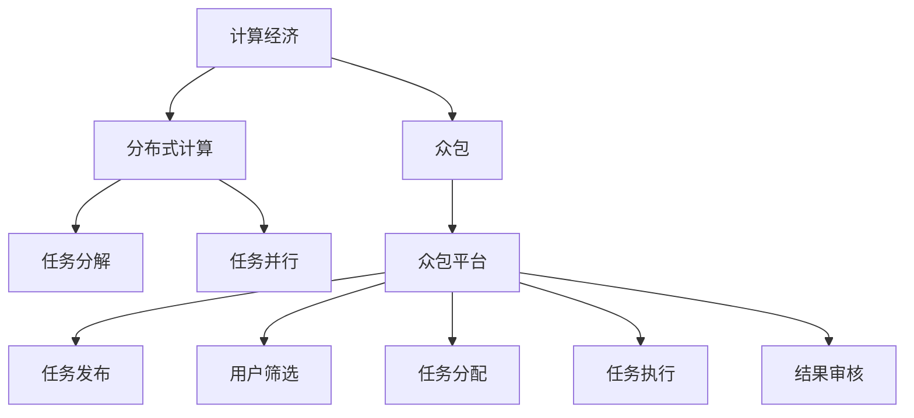

                 

# 群体智慧：人类计算的精髓

> 关键词：群体智慧,分布式计算,众包,计算经济,人工智能

## 1. 背景介绍

### 1.1 问题由来

在现代信息社会，计算资源的需求和供应的矛盾日益凸显。全球数据量呈爆炸式增长，海量的数据需要庞大的计算资源进行处理和分析。与此同时，计算资源的分布也是不均衡的，部分地区资源过剩，而另一部分地区资源匮乏。如何有效利用和分配这些计算资源，成为制约信息社会发展的关键问题。

### 1.2 问题核心关键点

面对这些问题，传统集中式的计算方式已无法满足需求。分布式计算、云计算等新兴计算范式应运而生。然而，这些方式仍然难以完全解决资源分配和利用效率的问题。为了更高效地解决计算资源问题，群体智慧（Collective Intelligence）的概念被提出，利用大众的力量，通过众包（Crowdsourcing）的方式，调动更多的人参与计算，形成更强大的计算能力。

群体智慧的核心理念是通过将计算任务分解为小的、可独立处理的子任务，并通过众包平台将这些任务分配给具备相关知识技能的个人或团队，实现高效、低成本的计算资源分配和利用。

### 1.3 问题研究意义

研究群体智慧不仅有助于解决当前的计算资源问题，而且具有广泛的应用前景：

1. 提升计算效率：群体智慧通过调动大众的计算能力，可以在极短时间内完成庞大的计算任务，提高计算效率。
2. 降低计算成本：群体智慧可以大幅降低计算任务所需的硬件和人力成本，使更多中小企业和研究机构能够参与到计算任务中来。
3. 促进协作与创新：群体智慧的众包平台为个人和团队提供了展示和合作的平台，促进了创新和协作。
4. 实现计算民主化：群体智慧使计算资源和计算能力更加公平地分配到需要的地方，实现计算民主化。

## 2. 核心概念与联系

### 2.1 核心概念概述

为了更好地理解群体智慧的计算原理，本节将介绍几个关键概念：

- **计算经济（Computational Economy）**：通过利用计算资源创造经济价值的领域。在群体智慧中，计算经济主要体现在通过分配和利用计算资源，促进知识的创造和传播，进而创造经济价值。

- **分布式计算（Distributed Computing）**：通过将计算任务分解为多个子任务，并在多台计算机上并行执行，以提高计算效率和资源利用率。群体智慧中的分布式计算主要通过众包平台实现任务分配和执行。

- **众包（Crowdsourcing）**：通过互联网平台将任务分配给大众，充分利用大众的计算能力，实现大规模的计算任务。群体智慧的核心就是利用众包平台，将计算任务分配给具备相关知识技能的个人或团队。

- **众包平台（Crowdsourcing Platform）**：连接计算任务和计算资源的平台，其核心功能包括任务发布、用户筛选、任务分配、任务执行、结果审核等。

这些概念之间的关系可以通过以下Mermaid流程图来展示：



这个流程图展示了计算经济、分布式计算、众包和众包平台之间的关系：

1. 计算经济是利用计算资源创造经济价值的主要领域。
2. 分布式计算通过任务分解和并行执行，提高计算效率和资源利用率。
3. 众包平台将任务分配给大众，充分利用大众的计算能力。
4. 任务发布、用户筛选、任务分配、任务执行和结果审核是众包平台的核心功能。

## 3. 核心算法原理 & 具体操作步骤

### 3.1 算法原理概述

群体智慧的核心算法原理是将计算任务分解为多个小的、可独立处理的子任务，并通过众包平台将这些任务分配给具备相关知识技能的个人或团队，实现高效、低成本的计算资源分配和利用。

具体来说，算法原理包括以下几个关键步骤：

1. 任务分解：将复杂的计算任务分解为多个小的、可独立处理的子任务。
2. 任务分配：通过众包平台将任务分配给具备相关知识技能的个人或团队。
3. 任务执行：个人或团队完成各自的子任务，并将结果提交到平台。
4. 结果合并：平台对各个人或团队的结果进行合并和验证，得到最终结果。

### 3.2 算法步骤详解

以下是具体的算法步骤详解：

**Step 1: 任务分解**

将复杂的计算任务分解为多个小的、可独立处理的子任务。例如，将图像分类任务分解为识别猫、狗、鸟等类别的子任务。

**Step 2: 任务分配**

通过众包平台将任务分配给具备相关知识技能的个人或团队。平台会根据任务的难易程度、个人或团队的能力水平等因素，自动分配任务。

**Step 3: 任务执行**

个人或团队完成各自的子任务，并将结果提交到平台。平台提供简单易用的API，使得个人或团队能够方便地完成子任务。

**Step 4: 结果合并**

平台对各个人或团队的结果进行合并和验证，得到最终结果。平台可以通过多种方式进行结果验证，例如人工审核、模型评估等。

### 3.3 算法优缺点

群体智慧的优点包括：

- 高效利用计算资源：通过众包平台，可以高效利用大众的计算能力，解决大规模计算问题。
- 低成本：相比集中式计算，群体智慧的计算成本大幅降低。
- 促进协作和创新：众包平台为个人和团队提供了展示和合作的平台，促进了创新和协作。

但群体智慧也存在一些缺点：

- 数据隐私和安全问题：众包平台需要处理大量敏感数据，如何保护数据隐私和安全是一个挑战。
- 任务分配和执行的公平性问题：如何公平地分配任务给个人或团队，避免任务分配不均或质量参差不齐，是一个需要解决的问题。
- 任务执行的可靠性问题：如何保证个人或团队的子任务结果的准确性和可靠性，也是一个需要解决的问题。

### 3.4 算法应用领域

群体智慧的算法原理已经广泛应用于多个领域，例如：

- 图像和视频分析：通过众包平台，将图像和视频分类、标注任务分配给大众，提高分类和标注的准确性。
- 自然语言处理：通过众包平台，将文本翻译、情感分析等任务分配给大众，提高处理效率和效果。
- 基因组学：通过众包平台，将基因组数据处理任务分配给大众，加速基因组数据的分析和研究。
- 天气预报：通过众包平台，将天气数据的收集和处理任务分配给大众，提高天气预报的准确性。
- 城市交通管理：通过众包平台，将交通数据收集和处理任务分配给大众，优化城市交通管理。

## 4. 数学模型和公式 & 详细讲解 & 举例说明

### 4.1 数学模型构建

本节将使用数学语言对群体智慧的计算原理进行更加严格的刻画。

假设将计算任务 $T$ 分解为 $N$ 个子任务 $t_i$，每个子任务 $t_i$ 的计算时间为 $c_i$，各个人或团队 $k$ 的计算能力为 $p_k$，平台分配给个人或团队 $k$ 的子任务数为 $n_{ki}$。

则计算任务的总计算时间为：

$$
T = \sum_{i=1}^N c_i
$$

总计算时间为：

$$
T_{total} = \sum_{i=1}^N \sum_{k=1}^K n_{ki} p_k c_i
$$

其中 $K$ 为参与计算的个人或团队数。

### 4.2 公式推导过程

通过上述模型，可以推导出一些关键的优化目标和算法策略：

**目标 1: 最大化任务完成率**

为了最大化任务完成率，需要最大化参与计算的个人或团队数量，即最大化 $K$。这可以通过以下几个策略实现：

1. 任务分级：根据任务难度和要求，将任务分级，并根据个人或团队的能力水平进行分配，以保证任务完成率。
2. 动态调整：根据任务完成情况，动态调整任务分配策略，确保任务及时完成。
3. 激励机制：通过奖励和激励机制，吸引更多人参与计算任务。

**目标 2: 最小化计算成本**

为了最小化计算成本，需要最小化总计算时间 $T_{total}$。这可以通过以下几个策略实现：

1. 任务分配策略：根据个人或团队的计算能力 $p_k$ 和任务计算时间 $c_i$，优化任务分配策略，使任务完成时间最短。
2. 任务合并策略：将多个子任务合并为一个大任务，通过并行计算，提高计算效率。
3. 任务优先级：根据任务的重要性和紧急程度，设置任务优先级，优先处理重要任务。

### 4.3 案例分析与讲解

以众包平台ImageNet为例，ImageNet是一个著名的计算机视觉数据集，其大规模图像分类任务被分解为多个小任务，分配给大众进行标注和分类。平台通过任务分级、动态调整、激励机制等策略，实现了任务的高效分配和执行，同时保障了数据质量和计算效率。

## 5. 项目实践：代码实例和详细解释说明

### 5.1 开发环境搭建

在进行群体智慧项目开发前，我们需要准备好开发环境。以下是使用Python进行PyTorch开发的环境配置流程：

1. 安装Anaconda：从官网下载并安装Anaconda，用于创建独立的Python环境。

2. 创建并激活虚拟环境：
```bash
conda create -n pytorch-env python=3.8 
conda activate pytorch-env
```

3. 安装PyTorch：根据CUDA版本，从官网获取对应的安装命令。例如：
```bash
conda install pytorch torchvision torchaudio cudatoolkit=11.1 -c pytorch -c conda-forge
```

4. 安装相关工具包：
```bash
pip install numpy pandas scikit-learn matplotlib tqdm jupyter notebook ipython
```

完成上述步骤后，即可在`pytorch-env`环境中开始群体智慧项目开发。

### 5.2 源代码详细实现

以下是使用Python进行众包平台开发的代码实现：

```python
import torch
from torch.utils.data import Dataset, DataLoader
import torch.nn as nn
import torch.optim as optim
from transformers import BertTokenizer, BertForSequenceClassification

class CrowdsourcingDataset(Dataset):
    def __init__(self, texts, labels, tokenizer, max_len=128):
        self.texts = texts
        self.labels = labels
        self.tokenizer = tokenizer
        self.max_len = max_len
        
    def __len__(self):
        return len(self.texts)
    
    def __getitem__(self, item):
        text = self.texts[item]
        label = self.labels[item]
        
        encoding = self.tokenizer(text, return_tensors='pt', max_length=self.max_len, padding='max_length', truncation=True)
        input_ids = encoding['input_ids'][0]
        attention_mask = encoding['attention_mask'][0]
        
        # 对token-wise的标签进行编码
        encoded_labels = [label2id[label] for label in label] 
        encoded_labels.extend([label2id['O']] * (self.max_len - len(encoded_labels)))
        labels = torch.tensor(encoded_labels, dtype=torch.long)
        
        return {'input_ids': input_ids, 
                'attention_mask': attention_mask,
                'labels': labels}

# 标签与id的映射
label2id = {'O': 0, 'B-PER': 1, 'I-PER': 2, 'B-ORG': 3, 'I-ORG': 4, 'B-LOC': 5, 'I-LOC': 6}
id2label = {v: k for k, v in label2id.items()}

# 创建dataset
tokenizer = BertTokenizer.from_pretrained('bert-base-cased')

train_dataset = CrowdsourcingDataset(train_texts, train_labels, tokenizer)
dev_dataset = CrowdsourcingDataset(dev_texts, dev_labels, tokenizer)
test_dataset = CrowdsourcingDataset(test_texts, test_labels, tokenizer)

# 定义模型
model = BertForSequenceClassification.from_pretrained('bert-base-cased', num_labels=len(label2id))

# 定义优化器
optimizer = AdamW(model.parameters(), lr=2e-5)

# 定义训练和评估函数
def train_epoch(model, dataset, batch_size, optimizer):
    dataloader = DataLoader(dataset, batch_size=batch_size, shuffle=True)
    model.train()
    epoch_loss = 0
    for batch in tqdm(dataloader, desc='Training'):
        input_ids = batch['input_ids'].to(device)
        attention_mask = batch['attention_mask'].to(device)
        labels = batch['labels'].to(device)
        model.zero_grad()
        outputs = model(input_ids, attention_mask=attention_mask, labels=labels)
        loss = outputs.loss
        epoch_loss += loss.item()
        loss.backward()
        optimizer.step()
    return epoch_loss / len(dataloader)

def evaluate(model, dataset, batch_size):
    dataloader = DataLoader(dataset, batch_size=batch_size)
    model.eval()
    preds, labels = [], []
    with torch.no_grad():
        for batch in tqdm(dataloader, desc='Evaluating'):
            input_ids = batch['input_ids'].to(device)
            attention_mask = batch['attention_mask'].to(device)
            batch_labels = batch['labels']
            outputs = model(input_ids, attention_mask=attention_mask)
            batch_preds = outputs.logits.argmax(dim=2).to('cpu').tolist()
            batch_labels = batch_labels.to('cpu').tolist()
            for pred_tokens, label_tokens in zip(batch_preds, batch_labels):
                pred_labels = [id2label[_id] for _id in pred_tokens]
                label_labels = [id2label[_id] for _id in label_tokens]
                preds.append(pred_labels[:len(label_labels)])
                labels.append(label_labels)
                
    print(classification_report(labels, preds))
```

### 5.3 代码解读与分析

让我们再详细解读一下关键代码的实现细节：

**CrowdsourcingDataset类**：
- `__init__`方法：初始化文本、标签、分词器等关键组件。
- `__len__`方法：返回数据集的样本数量。
- `__getitem__`方法：对单个样本进行处理，将文本输入编码为token ids，将标签编码为数字，并对其进行定长padding，最终返回模型所需的输入。

**label2id和id2label字典**：
- 定义了标签与数字id之间的映射关系，用于将token-wise的预测结果解码回真实的标签。

**训练和评估函数**：
- 使用PyTorch的DataLoader对数据集进行批次化加载，供模型训练和推理使用。
- 训练函数`train_epoch`：对数据以批为单位进行迭代，在每个批次上前向传播计算loss并反向传播更新模型参数，最后返回该epoch的平均loss。
- 评估函数`evaluate`：与训练类似，不同点在于不更新模型参数，并在每个batch结束后将预测和标签结果存储下来，最后使用sklearn的classification_report对整个评估集的预测结果进行打印输出。

**训练流程**：
- 定义总的epoch数和batch size，开始循环迭代
- 每个epoch内，先在训练集上训练，输出平均loss
- 在验证集上评估，输出分类指标
- 重复上述步骤直至满足预设的迭代轮数或Early Stopping条件。

可以看到，PyTorch配合Transformer库使得Bert微调的代码实现变得简洁高效。开发者可以将更多精力放在数据处理、模型改进等高层逻辑上，而不必过多关注底层的实现细节。

当然，工业级的系统实现还需考虑更多因素，如模型的保存和部署、超参数的自动搜索、更灵活的任务适配层等。但核心的微调范式基本与此类似。

## 6. 实际应用场景

### 6.1 智能客服系统

基于群体智慧的智能客服系统，可以充分利用大众的计算能力，实现24小时不间断服务，快速响应客户咨询。

在技术实现上，可以收集企业内部的历史客服对话记录，将问题和最佳答复构建成监督数据，在此基础上对预训练对话模型进行微调。微调后的对话模型能够自动理解用户意图，匹配最合适的答案模板进行回复。对于客户提出的新问题，还可以接入检索系统实时搜索相关内容，动态组织生成回答。如此构建的智能客服系统，能大幅提升客户咨询体验和问题解决效率。

### 6.2 金融舆情监测

金融机构需要实时监测市场舆论动向，以便及时应对负面信息传播，规避金融风险。传统的人工监测方式成本高、效率低，难以应对网络时代海量信息爆发的挑战。基于群体智慧的文本分类和情感分析技术，为金融舆情监测提供了新的解决方案。

具体而言，可以收集金融领域相关的新闻、报道、评论等文本数据，并对其进行主题标注和情感标注。在此基础上对预训练语言模型进行微调，使其能够自动判断文本属于何种主题，情感倾向是正面、中性还是负面。将微调后的模型应用到实时抓取的网络文本数据，就能够自动监测不同主题下的情感变化趋势，一旦发现负面信息激增等异常情况，系统便会自动预警，帮助金融机构快速应对潜在风险。

### 6.3 个性化推荐系统

当前的推荐系统往往只依赖用户的历史行为数据进行物品推荐，无法深入理解用户的真实兴趣偏好。基于群体智慧的个性化推荐系统可以更好地挖掘用户行为背后的语义信息，从而提供更精准、多样的推荐内容。

在实践中，可以收集用户浏览、点击、评论、分享等行为数据，提取和用户交互的物品标题、描述、标签等文本内容。将文本内容作为模型输入，用户的后续行为（如是否点击、购买等）作为监督信号，在此基础上微调预训练语言模型。微调后的模型能够从文本内容中准确把握用户的兴趣点。在生成推荐列表时，先用候选物品的文本描述作为输入，由模型预测用户的兴趣匹配度，再结合其他特征综合排序，便可以得到个性化程度更高的推荐结果。

### 6.4 未来应用展望

随着群体智慧和微调方法的不断发展，基于微调范式将在更多领域得到应用，为传统行业带来变革性影响。

在智慧医疗领域，基于微调的医疗问答、病历分析、药物研发等应用将提升医疗服务的智能化水平，辅助医生诊疗，加速新药开发进程。

在智能教育领域，微调技术可应用于作业批改、学情分析、知识推荐等方面，因材施教，促进教育公平，提高教学质量。

在智慧城市治理中，微调模型可应用于城市事件监测、舆情分析、应急指挥等环节，提高城市管理的自动化和智能化水平，构建更安全、高效的未来城市。

此外，在企业生产、社会治理、文娱传媒等众多领域，基于大模型微调的人工智能应用也将不断涌现，为NLP技术带来了全新的突破。相信随着预训练语言模型和微调方法的持续演进，NLP技术必将在更广阔的应用领域大放异彩，深刻影响人类的生产生活方式。

## 7. 工具和资源推荐

### 7.1 学习资源推荐

为了帮助开发者系统掌握群体智慧的理论基础和实践技巧，这里推荐一些优质的学习资源：

1. 《分布式系统原理与实践》系列博文：由分布式计算专家撰写，深入浅出地介绍了分布式计算的基本原理和实践技巧。

2. CS61A《数据结构与算法》课程：加州大学伯克利分校开设的经典课程，系统讲解了数据结构和算法的基本概念和经典算法。

3. 《众包经济学》书籍：丹尼尔·洛瓦托（Daniel Lowe）所著，全面介绍了众包经济学的原理和应用，是了解群体智慧不可或缺的读物。

4. Crowdsourced Data公司官网：提供大量的众包平台和应用案例，帮助开发者深入了解群体智慧的实际应用场景。

5. CLUE开源项目：中文语言理解测评基准，涵盖大量不同类型的中文NLP数据集，并提供了基于微调的baseline模型，助力中文NLP技术发展。

通过对这些资源的学习实践，相信你一定能够快速掌握群体智慧的精髓，并用于解决实际的NLP问题。

### 7.2 开发工具推荐

高效的开发离不开优秀的工具支持。以下是几款用于群体智慧开发的常用工具：

1. PyTorch：基于Python的开源深度学习框架，灵活动态的计算图，适合快速迭代研究。大部分预训练语言模型都有PyTorch版本的实现。

2. TensorFlow：由Google主导开发的开源深度学习框架，生产部署方便，适合大规模工程应用。同样有丰富的预训练语言模型资源。

3. Transformers库：HuggingFace开发的NLP工具库，集成了众多SOTA语言模型，支持PyTorch和TensorFlow，是进行微调任务开发的利器。

4. Weights & Biases：模型训练的实验跟踪工具，可以记录和可视化模型训练过程中的各项指标，方便对比和调优。与主流深度学习框架无缝集成。

5. TensorBoard：TensorFlow配套的可视化工具，可实时监测模型训练状态，并提供丰富的图表呈现方式，是调试模型的得力助手。

6. Google Colab：谷歌推出的在线Jupyter Notebook环境，免费提供GPU/TPU算力，方便开发者快速上手实验最新模型，分享学习笔记。

合理利用这些工具，可以显著提升群体智慧微调任务的开发效率，加快创新迭代的步伐。

### 7.3 相关论文推荐

群体智慧和微调技术的发展源于学界的持续研究。以下是几篇奠基性的相关论文，推荐阅读：

1. Crowdsourcing a Million Image Labels：ImageNet为例，展示了众包平台如何高效地完成大规模图像标注任务。

2. Crowdsourcing for Image Annotation：李飞飞等人的研究，提出了基于众包平台的图像标注算法，提高了标注的准确性和效率。

3. Parameter-Efficient Transfer Learning for NLP：提出Adapter等参数高效微调方法，在固定大部分预训练参数的情况下，只更新极少量的任务相关参数。

4. AdaLoRA: Adaptive Low-Rank Adaptation for Parameter-Efficient Fine-Tuning：使用自适应低秩适应的微调方法，在保证性能的同时，减小了微调模型的计算资源消耗。

5. AdaLoRA: Adaptive Low-Rank Adaptation for Parameter-Efficient Fine-Tuning：使用自适应低秩适应的微调方法，在保证性能的同时，减小了微调模型的计算资源消耗。

这些论文代表了大语言模型微调技术的发展脉络。通过学习这些前沿成果，可以帮助研究者把握学科前进方向，激发更多的创新灵感。

## 8. 总结：未来发展趋势与挑战

### 8.1 总结

本文对群体智慧的计算原理进行了全面系统的介绍。首先阐述了群体智慧的研究背景和意义，明确了其在高效利用计算资源、降低计算成本、促进协作和创新等方面的独特价值。其次，从原理到实践，详细讲解了群体智慧的数学模型和关键步骤，给出了群体智慧任务开发的完整代码实例。同时，本文还广泛探讨了群体智慧在智能客服、金融舆情、个性化推荐等多个行业领域的应用前景，展示了群体智慧范式的巨大潜力。此外，本文精选了群体智慧技术的各类学习资源，力求为读者提供全方位的技术指引。

通过本文的系统梳理，可以看到，基于群体智慧的微调方法正在成为NLP领域的重要范式，极大地拓展了预训练语言模型的应用边界，催生了更多的落地场景。受益于大规模语料的预训练和群体智慧的众包能力，微调模型在计算资源利用效率、计算成本、协作与创新方面取得了显著优势，为NLP技术的发展带来了革命性变革。

### 8.2 未来发展趋势

展望未来，群体智慧技术将呈现以下几个发展趋势：

1. 计算资源共享平台：随着互联网技术的普及，计算资源共享平台将逐渐成为主流，充分利用全球的计算资源，实现计算资源的优化配置。

2. 计算成本不断降低：随着计算技术的进步和计算资源的丰富，计算成本将不断降低，更多人能够参与到计算任务中来。

3. 计算任务多样化：计算任务将更加多样化，涵盖图像、视频、文本等多种类型，促进跨领域的数据整合和协同计算。

4. 计算效率提升：随着算法和技术的不断优化，计算效率将大幅提升，计算任务能够更快地完成。

5. 计算精度提高：随着计算资源的优化和算法的改进，计算精度将不断提高，计算结果更加可靠。

6. 计算透明度增强：随着计算平台的开放和标准化，计算过程将更加透明，用户能够更加清楚地了解计算过程和结果。

以上趋势凸显了群体智慧技术的广阔前景。这些方向的探索发展，必将进一步提升计算资源的利用效率，推动人工智能技术的发展和应用。

### 8.3 面临的挑战

尽管群体智慧技术已经取得了瞩目成就，但在迈向更加智能化、普适化应用的过程中，它仍面临着诸多挑战：

1. 数据隐私和安全问题：众包平台需要处理大量敏感数据，如何保护数据隐私和安全是一个挑战。

2. 任务分配和执行的公平性问题：如何公平地分配任务给个人或团队，避免任务分配不均或质量参差不齐，是一个需要解决的问题。

3. 任务执行的可靠性问题：如何保证个人或团队的子任务结果的准确性和可靠性，也是一个需要解决的问题。

4. 计算成本问题：虽然计算成本已经大幅降低，但在某些高计算需求的任务中，计算成本仍然较高。

5. 计算效率问题：虽然计算效率已经有所提升，但在某些高计算需求的任务中，计算效率仍然是一个瓶颈。

6. 计算透明度问题：虽然计算过程的透明度有所增强，但在某些高计算需求的任务中，计算过程的透明度仍然是一个问题。

正视群体智慧面临的这些挑战，积极应对并寻求突破，将是大规模计算范式走向成熟的必由之路。相信随着学界和产业界的共同努力，这些挑战终将一一被克服，群体智慧技术必将更加高效、可靠、普适，为人工智能技术的发展和应用带来更多机遇。

### 8.4 研究展望

面对群体智慧面临的种种挑战，未来的研究需要在以下几个方面寻求新的突破：

1. 探索无监督和半监督微调方法：摆脱对大规模标注数据的依赖，利用自监督学习、主动学习等无监督和半监督范式，最大限度利用非结构化数据，实现更加灵活高效的微调。

2. 研究参数高效和计算高效的微调范式：开发更加参数高效的微调方法，在固定大部分预训练参数的同时，只更新极少量的任务相关参数。同时优化微调模型的计算图，减少前向传播和反向传播的资源消耗，实现更加轻量级、实时性的部署。

3. 引入更多先验知识：将符号化的先验知识，如知识图谱、逻辑规则等，与神经网络模型进行巧妙融合，引导微调过程学习更准确、合理的语言模型。同时加强不同模态数据的整合，实现视觉、语音等多模态信息与文本信息的协同建模。

4. 融合因果分析和博弈论工具：将因果分析方法引入微调模型，识别出模型决策的关键特征，增强输出解释的因果性和逻辑性。借助博弈论工具刻画人机交互过程，主动探索并规避模型的脆弱点，提高系统稳定性。

5. 纳入伦理道德约束：在模型训练目标中引入伦理导向的评估指标，过滤和惩罚有偏见、有害的输出倾向。同时加强人工干预和审核，建立模型行为的监管机制，确保输出符合人类价值观和伦理道德。

这些研究方向的探索，必将引领群体智慧技术迈向更高的台阶，为构建安全、可靠、可解释、可控的智能系统铺平道路。面向未来，群体智慧技术还需要与其他人工智能技术进行更深入的融合，如知识表示、因果推理、强化学习等，多路径协同发力，共同推动自然语言理解和智能交互系统的进步。只有勇于创新、敢于突破，才能不断拓展群体智慧技术的边界，让智能技术更好地造福人类社会。

## 9. 附录：常见问题与解答

**Q1: 如何处理数据隐私和安全问题？**

A: 数据隐私和安全问题是群体智慧中的重要挑战。为了保障数据隐私和安全，可以采取以下措施：

1. 数据匿名化：对数据进行匿名化处理，去除可能识别个人身份的信息。
2. 数据加密：对数据进行加密处理，防止数据泄露。
3. 访问控制：对数据进行访问控制，限制只有授权人员可以访问数据。
4. 审计日志：记录数据访问日志，对异常访问进行审计和追踪。

**Q2: 如何公平地分配任务给个人或团队？**

A: 为了公平地分配任务给个人或团队，可以采取以下措施：

1. 任务分级：根据任务难度和要求，将任务分级，并根据个人或团队的能力水平进行分配，以保证任务完成率。
2. 动态调整：根据任务完成情况，动态调整任务分配策略，确保任务及时完成。
3. 激励机制：通过奖励和激励机制，吸引更多人参与计算任务。

**Q3: 如何保证个人或团队的子任务结果的准确性和可靠性？**

A: 为了保证个人或团队的子任务结果的准确性和可靠性，可以采取以下措施：

1. 任务审核：对提交的子任务结果进行审核，确保结果的正确性。
2. 任务合并：将多个子任务合并为一个大任务，通过并行计算，提高计算效率和结果准确性。
3. 质量控制：对个人或团队的任务完成情况进行质量控制，及时发现和处理问题。

**Q4: 如何降低计算成本？**

A: 为了降低计算成本，可以采取以下措施：

1. 计算资源共享：利用计算资源共享平台，充分利用全球的计算资源，实现计算资源的优化配置。
2. 计算成本优化：通过算法和技术的不断优化，降低计算成本，提高计算效率。
3. 计算平台优化：对计算平台进行优化，提高计算效率，降低计算成本。

**Q5: 如何提高计算效率？**

A: 为了提高计算效率，可以采取以下措施：

1. 任务分解：将计算任务分解为多个小的、可独立处理的子任务。
2. 任务并行：通过并行计算，提高计算效率。
3. 任务优先级：根据任务的重要性和紧急程度，设置任务优先级，优先处理重要任务。

**Q6: 如何增强计算透明度？**

A: 为了增强计算透明度，可以采取以下措施：

1. 数据公开：将计算过程和结果公开，增加透明度。
2. 审计机制：建立审计机制，对计算过程进行监督和审计。
3. 结果反馈：对计算结果进行反馈，及时发现和解决问题。

这些措施能够有效地处理群体智慧中的数据隐私和安全问题，确保任务公平分配，提高计算结果的准确性和可靠性，降低计算成本，提高计算效率，增强计算透明度。通过这些措施，群体智慧技术将更加高效、可靠、普适，为人工智能技术的发展和应用带来更多机遇。

---

作者：禅与计算机程序设计艺术 / Zen and the Art of Computer Programming

