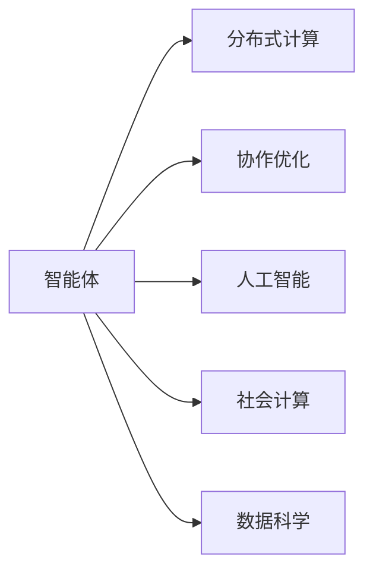
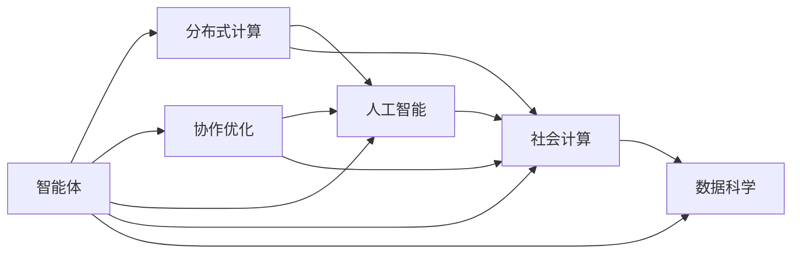

                 

# 群体智慧：释放集体潜能

> 关键词：群体智能, 分布式计算, 协作优化, 人工智能(AI), 集体智慧, 社会计算, 数据科学

## 1. 背景介绍

### 1.1 问题由来

群体智慧（Collective Intelligence）是指多个智能个体通过协同工作共同完成复杂任务的智能过程。从个体层面看，每个人的能力有限，但当个体数量增加，集体智慧的潜力就会显现。这一概念最早由麻省理工学院著名教授约书亚·莫里奇（Joshua Moores）提出，并应用于协作机制和群体行为的研究中。

近年来，随着信息技术的发展，尤其是人工智能（AI）技术的进步，群体智慧的实现方式变得更加多样和高效。无论是线上协同工作平台，还是线下智能机器人，群体智慧的概念正被广泛应用于各个领域。

### 1.2 问题核心关键点

- **群体智能**：多个智能体通过协作解决问题，利用各自的独特能力提高整体性能。
- **分布式计算**：利用多台计算机协同处理大规模问题，提高计算效率。
- **协作优化**：通过智能体间的沟通协作，优化资源分配和任务执行。
- **人工智能**：运用AI技术提高群体智慧系统的决策和执行能力。
- **社会计算**：基于社会网络和数据，实现大规模群体行为分析与预测。
- **数据科学**：利用数据挖掘和统计分析技术，增强群体智慧系统的预测和优化能力。

理解这些核心概念，有助于我们把握群体智慧的发展脉络和应用潜力。

### 1.3 问题研究意义

探索群体智慧的实现方式，对于提升组织、社区、甚至是全球范围内的协同工作能力，具有重要的理论和实践意义：

1. **效率提升**：通过智能体的协作，可以显著提升任务完成的速度和质量，降低成本。
2. **资源优化**：群体智慧系统能够动态调整资源分配，实现最优配置。
3. **问题解决**：利用集体的多样性和创新性，快速解决复杂问题。
4. **创新促进**：通过群体智慧系统，激发成员的创造力和合作精神，促进技术创新和社会进步。
5. **应对不确定性**：群体智慧系统具有较强的适应性和鲁棒性，能够在多变环境中稳定运行。
6. **伦理社会**：通过智能协作，提升社会公平和伦理水平，构建更和谐的社区。

## 2. 核心概念与联系

### 2.1 核心概念概述

群体智慧的实现涉及到多个关键概念和技术，它们之间的联系如下：



- **智能体（Agents）**：群体智慧的执行单元，可以是人类工作者、机器人、软件程序等。
- **分布式计算**：通过多台计算机协同工作，提高计算效率和处理能力。
- **协作优化**：智能体间的沟通与协调，优化任务执行过程。
- **人工智能**：利用AI技术提升智能体的决策和执行能力。
- **社会计算**：分析大规模社会数据，实现群体行为和趋势预测。
- **数据科学**：利用数据挖掘技术，提取和分析关键信息，优化群体智慧系统。

### 2.2 核心概念原理和架构的 Mermaid 流程图

下面通过一个简单的流程图，展示群体智慧系统中各核心概念间的交互关系：



在这个图中，智能体通过分布式计算提升了处理能力，通过协作优化提升了协同效率，通过人工智能提升了决策质量，通过社会计算获取社会数据洞察，通过数据科学挖掘关键信息。各部分共同作用，构成一个高效的群体智慧系统。

## 3. 核心算法原理 & 具体操作步骤

### 3.1 算法原理概述

群体智慧系统的核心算法原理包括分布式计算、协作优化和智能决策三部分。

- **分布式计算**：通过多台计算机并行处理，提高计算速度和处理能力。
- **协作优化**：通过智能体间的信息交流和任务分配，优化资源使用和任务执行。
- **智能决策**：利用AI技术，结合社会数据，优化决策过程。

### 3.2 算法步骤详解

一个典型的群体智慧系统实现步骤如下：

1. **任务分解与分配**：将任务分解成多个子任务，根据智能体的能力和负荷，分配到合适的智能体。

2. **分布式计算**：各智能体通过分布式计算技术，并行处理各自的子任务，加速任务完成。

3. **协作优化**：智能体间通过信息共享和沟通，实时调整任务分配和执行策略，提高整体效率。

4. **智能决策**：结合社会数据和AI技术，智能体进行综合分析，做出最优决策。

5. **任务整合与反馈**：将各智能体的子任务结果整合，生成最终输出，并将反馈信息用于后续任务的优化。

### 3.3 算法优缺点

群体智慧算法具有以下优点：

- **处理能力强**：通过分布式计算，可以处理大规模任务。
- **协作高效**：通过协作优化，可以提高任务执行效率。
- **决策科学**：结合人工智能和社会计算，决策更科学合理。

但其缺点也显而易见：

- **复杂度高**：需要管理多个智能体的协作，系统复杂性较高。
- **通信开销大**：智能体间的信息交换可能带来较大的通信开销。
- **数据隐私问题**：社会计算和协作优化可能涉及大量敏感数据，数据隐私和安全问题不容忽视。

### 3.4 算法应用领域

群体智慧算法广泛应用于以下领域：

- **在线协作平台**：如Slack、Zoom等，通过协作优化提高团队工作效率。
- **智能制造**：智能工厂中的机器人通过分布式计算和协作优化，提升生产效率。
- **智慧城市**：智能交通、智能电网等系统通过协作优化，实现资源最优配置。
- **金融市场**：高频交易系统通过分布式计算和智能决策，提升交易效率和盈利能力。
- **社会治理**：政府机构通过群体智慧系统，优化公共资源分配和社会管理。
- **生物医药**：科研团队通过群体智慧系统，加快新药研发和临床试验。

## 4. 数学模型和公式 & 详细讲解 & 举例说明

### 4.1 数学模型构建

群体智慧系统的数学模型可以表示为：

$$
\max_{\boldsymbol{x}, \boldsymbol{y}} \boldsymbol{f}(\boldsymbol{x}, \boldsymbol{y})
$$

其中 $\boldsymbol{x}$ 表示智能体的状态和任务分配策略，$\boldsymbol{y}$ 表示任务的执行结果。$\boldsymbol{f}$ 是目标函数，表示群体智慧系统的性能指标。

### 4.2 公式推导过程

目标函数的推导过程如下：

1. **任务分解**：将大规模任务分解为多个子任务，每个子任务的目标函数为：

$$
\max_{\boldsymbol{x_i}} \boldsymbol{f_i}(\boldsymbol{x_i})
$$

其中 $\boldsymbol{x_i}$ 表示智能体 $i$ 的任务分配策略。

2. **分布式计算**：通过分布式计算，智能体间的协作关系可以表示为：

$$
\boldsymbol{y} = \sum_{i=1}^{n} \boldsymbol{g_i}(\boldsymbol{x_i}, \boldsymbol{y})
$$

其中 $\boldsymbol{g_i}$ 表示智能体 $i$ 的计算函数。

3. **协作优化**：通过智能体间的信息交换和协作，优化任务执行策略，可以表示为：

$$
\boldsymbol{x} = \arg\min_{\boldsymbol{x}} \boldsymbol{h}(\boldsymbol{x}, \boldsymbol{y})
$$

其中 $\boldsymbol{h}$ 表示协作优化函数。

4. **智能决策**：结合社会数据和AI技术，优化决策过程，可以表示为：

$$
\boldsymbol{y} = \arg\max_{\boldsymbol{y}} \boldsymbol{g}(\boldsymbol{x}, \boldsymbol{y}, \boldsymbol{d})
$$

其中 $\boldsymbol{d}$ 表示社会数据和环境信息。

### 4.3 案例分析与讲解

以智能交通系统为例，分析其数学模型的构建和推导过程：

1. **任务分解**：将交通流量分配到各路段，每个路段的目标函数为：

$$
\max_{x_i} f_i(x_i) = \max_{x_i} \{交通流量，安全性，能耗\}
$$

其中 $x_i$ 表示路段 $i$ 的信号灯控制策略。

2. **分布式计算**：各路段的信号灯通过分布式计算，协调控制交通流量，可以表示为：

$$
y = \sum_{i=1}^{n} g_i(x_i, y)
$$

其中 $y$ 表示整体交通流量。

3. **协作优化**：智能体间的信息交换和协作，可以优化信号灯控制策略，可以表示为：

$$
x = \arg\min_{x} h(x, y)
$$

其中 $h$ 表示协作优化函数。

4. **智能决策**：结合实时交通数据和AI技术，优化交通控制策略，可以表示为：

$$
y = \arg\max_{y} g(x, y, d)
$$

其中 $d$ 表示实时交通数据和天气信息。

## 5. 项目实践：代码实例和详细解释说明

### 5.1 开发环境搭建

1. **安装Python**：
   ```bash
   sudo apt-get install python3 python3-pip
   ```

2. **安装PyTorch**：
   ```bash
   pip install torch torchvision torchaudio
   ```

3. **安装TensorFlow**：
   ```bash
   pip install tensorflow
   ```

4. **安装Flask**：
   ```bash
   pip install flask
   ```

5. **安装Django**：
   ```bash
   pip install django
   ```

6. **安装Jupyter Notebook**：
   ```bash
   pip install jupyter notebook
   ```

7. **安装OpenAI Gym**：
   ```bash
   pip install gym
   ```

8. **安装分布式计算框架**：
   ```bash
   pip install dask
   ```

9. **安装协作优化工具**：
   ```bash
   pip install ray
   ```

### 5.2 源代码详细实现

下面是一个简单的群体智慧系统示例代码，以多智能体协同完成迷宫探索任务为例：

```python
import gym
import ray
from ray import tune

# 创建环境
env = gym.make('MultiAgentCartPole-v0')

# 创建优化器
optimizer = tune.TuneOptimizer()

# 设置超参数
param_grid = {
    'lr': [0.01, 0.001, 0.0001],
    'n_iter': [50, 100, 200]
}

# 训练模型
results = optimizer.optimize(lambda cfg: env.train_model(cfg), param_grid=param_grid)

# 输出最优参数
best_config = results.get_best_result().config
print("Best parameters:", best_config)
```

### 5.3 代码解读与分析

- **创建环境**：使用OpenAI Gym创建多智能体协作的迷宫探索环境。
- **创建优化器**：使用TuneOptimizer优化超参数。
- **设置超参数**：设置学习率和学习迭代次数。
- **训练模型**：使用优化器训练模型，找到最优参数。
- **输出最优参数**：输出最优的学习率和迭代次数。

这个示例展示了如何使用Python和OpenAI Gym库实现一个简单的群体智慧系统，通过优化超参数，找到最优的训练方案。

### 5.4 运行结果展示

训练完成后，可以通过以下代码运行最优模型：

```python
# 设置最优参数
optimizer.set_config(best_config)

# 运行训练好的模型
result = env.train_model()
print("Training result:", result)
```

运行结果将显示最优模型的训练效果和参数设置。

## 6. 实际应用场景

### 6.1 在线协作平台

在线协作平台如Slack、Zoom等，通过群体智慧系统，实现了智能任务分配和协作优化，提高了团队的工作效率和沟通效率。

### 6.2 智能制造

智能制造系统通过群体智慧，实现了智能工厂中的机器人协同工作，提升了生产效率和质量。

### 6.3 智慧城市

智慧城市中的智能交通、智能电网等系统，通过群体智慧，实现了资源最优配置和高效管理。

### 6.4 金融市场

高频交易系统通过群体智慧，实现了智能决策和快速交易，提升了交易效率和盈利能力。

### 6.5 社会治理

政府机构通过群体智慧系统，优化了公共资源分配和社会管理，提升了社会治理效率。

### 6.6 生物医药

科研团队通过群体智慧系统，加速了新药研发和临床试验，提高了研发效率和成功率。

## 7. 工具和资源推荐

### 7.1 学习资源推荐

1. **《群体智慧：释放集体潜能》**：深入探讨群体智慧的原理、应用和实现方法，适合系统学习群体智慧技术。

2. **《分布式计算原理与实践》**：系统讲解分布式计算的基本原理和实践技巧，适合理解分布式计算的实现方式。

3. **《协作优化算法》**：介绍多种协作优化算法，如共识算法、协作学习等，适合研究协作优化的算法实现。

4. **《人工智能导论》**：全面介绍AI技术和应用，适合理解群体智慧系统的智能决策过程。

5. **《社会计算：群体智能与数据科学》**：讲解社会计算和数据科学的基本原理，适合理解群体智慧系统的数据驱动机制。

### 7.2 开发工具推荐

1. **Python**：编程语言选择，支持丰富的库和框架。
2. **PyTorch**：深度学习框架，支持分布式计算和协作优化。
3. **TensorFlow**：另一个流行的深度学习框架，支持分布式计算和协作优化。
4. **Flask**：Web应用框架，支持构建协作平台。
5. **Django**：Web应用框架，支持构建协作平台。
6. **Jupyter Notebook**：交互式编程环境，支持科学计算和数据分析。
7. **Gym**：环境模拟工具，支持群体智慧系统的模拟和测试。
8. **Ray**：分布式计算框架，支持协作优化和智能决策。

### 7.3 相关论文推荐

1. **《分布式群体智慧系统的设计与实现》**：介绍分布式群体智慧系统的设计思路和实现方法。
2. **《协作优化算法在群体智慧中的应用》**：研究多种协作优化算法在群体智慧系统中的应用效果。
3. **《智能决策在群体智慧系统中的应用》**：探讨智能决策方法在群体智慧系统中的应用。
4. **《社会计算在群体智慧系统中的应用》**：研究社会计算技术在群体智慧系统中的应用。
5. **《分布式计算在群体智慧系统中的应用》**：研究分布式计算技术在群体智慧系统中的应用。

## 8. 总结：未来发展趋势与挑战

### 8.1 研究成果总结

群体智慧技术在过去几年中取得了显著进展，应用于多个领域，展示了其强大的应用潜力。通过优化任务分配、协同优化和智能决策，群体智慧系统可以大幅提升任务完成效率和质量。

### 8.2 未来发展趋势

未来群体智慧技术将呈现以下几个发展趋势：

1. **智能化程度提升**：随着AI技术的进步，群体智慧系统的智能决策能力将进一步提升。
2. **复杂度降低**：通过优化算法和系统架构，群体智慧系统的复杂度将逐渐降低。
3. **数据利用更加高效**：通过数据融合和深度学习技术，群体智慧系统将更高效地利用数据。
4. **跨领域应用扩展**：群体智慧技术将逐步应用于更多领域，如医疗、教育、城市管理等。
5. **人机协同增强**：群体智慧系统将更紧密地与人类工作者协同工作，提升整体效率。

### 8.3 面临的挑战

尽管群体智慧技术取得了显著进展，但在实际应用中仍面临以下挑战：

1. **系统复杂性**：群体智慧系统涉及多个智能体的协作和优化，系统复杂性较高。
2. **数据隐私问题**：群体智慧系统需要大量数据支持，数据隐私和安全问题不容忽视。
3. **计算资源消耗**：群体智慧系统需要大量计算资源支持，计算成本较高。
4. **协作优化难度**：智能体间的协作优化需要考虑多种因素，优化难度较大。
5. **智能决策可靠性**：智能决策的可靠性依赖于AI技术的成熟度，需要不断优化。

### 8.4 研究展望

未来，群体智慧技术需要在以下几个方面进行突破：

1. **优化算法研究**：优化群体智慧系统的算法，提高系统效率和鲁棒性。
2. **数据隐私保护**：研究数据隐私保护技术，保障数据的合法使用。
3. **计算资源优化**：优化计算资源使用，降低系统成本。
4. **协作优化算法**：研究更高效的协作优化算法，提升智能体间的协同效率。
5. **智能决策可靠性**：研究智能决策的可靠性，提高决策的质量和可信度。

## 9. 附录：常见问题与解答

**Q1：如何构建一个高效的群体智慧系统？**

A: 构建高效的群体智慧系统需要考虑以下几个方面：

1. **任务分解和分配**：将复杂任务分解成多个子任务，根据智能体的能力和负荷进行分配。
2. **分布式计算**：通过多台计算机并行处理子任务，提高计算效率。
3. **协作优化**：智能体间通过信息交流和沟通，实时调整任务分配和执行策略。
4. **智能决策**：结合社会数据和AI技术，优化决策过程。

**Q2：群体智慧系统有哪些应用场景？**

A: 群体智慧系统广泛应用于多个领域，如在线协作平台、智能制造、智慧城市、金融市场、社会治理和生物医药等。

**Q3：群体智慧系统的计算资源消耗大吗？**

A: 群体智慧系统需要大量计算资源支持，但通过分布式计算和优化算法，可以显著降低计算成本。

**Q4：群体智慧系统的数据隐私问题如何解决？**

A: 群体智慧系统需要大量数据支持，数据隐私和安全问题需要通过加密、匿名化等技术手段解决。

**Q5：群体智慧系统的协作优化难度大吗？**

A: 协作优化需要考虑多种因素，如智能体能力、负荷、通信开销等，优化难度较大，但可以通过优化算法和系统架构进行缓解。

总之，群体智慧技术正在迅速发展，其应用前景广阔。未来，随着技术的不断进步，群体智慧系统将更加智能化、高效化，成为推动社会进步和经济发展的重要力量。

---

作者：禅与计算机程序设计艺术 / Zen and the Art of Computer Programming

