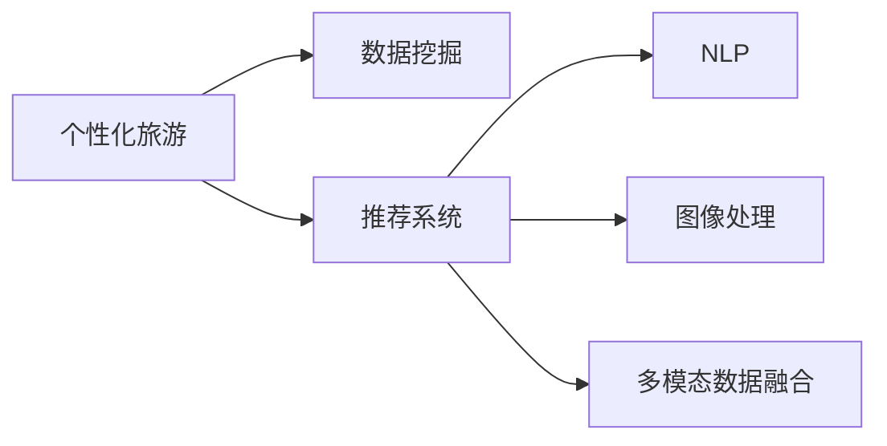

                 

# AI在个性化旅游规划中的应用：定制旅行体验

## 1. 背景介绍

### 1.1 问题由来
随着经济的发展和社会的进步，人们对于旅游的期待已经不再仅仅限于传统的观光游，个性化旅游逐渐成为新的趋势。个性化旅游旨在根据游客的需求、兴趣和预算，量身定制最佳旅游方案，提供独一无二的旅行体验。这不仅提升了旅游的乐趣，也增加了旅行的深度和广度。然而，个性化旅游的实现需要整合多种数据，包括用户的历史数据、偏好数据、实时数据等，同时还需要复杂的算法支持。AI技术在个性化旅游中的应用，正逐渐成为行业的新焦点。

### 1.2 问题核心关键点
AI在个性化旅游规划中的应用主要集中在以下几个方面：

- **数据整合与分析**：收集和整合用户的历史数据、偏好数据和实时数据，并进行深度分析，以理解用户的个性化需求。
- **预测与推荐**：利用机器学习模型预测用户的旅游偏好，并推荐相应的旅游路线和活动。
- **自然语言处理(NLP)**：通过NLP技术解析用户的查询和反馈，进一步优化推荐算法。
- **图像处理**：使用图像识别技术分析旅游景点的照片和视频，为用户提供更具吸引力的视觉体验。
- **多模态数据融合**：整合多种数据源，提升旅游推荐的全面性和准确性。

AI技术通过这些方式，极大地提升了个性化旅游规划的效率和质量，为用户提供更加满意和愉悦的旅行体验。

### 1.3 问题研究意义
AI技术在个性化旅游规划中的应用，不仅满足了用户多样化的需求，还为旅游企业带来了新的商业模式和增长点。同时，AI技术的应用还推动了旅游行业向智能化、个性化、高效化方向发展，对整个旅游产业生态系统产生深远影响。

## 2. 核心概念与联系

### 2.1 核心概念概述

为更好地理解AI在个性化旅游规划中的应用，本节将介绍几个密切相关的核心概念：

- **个性化旅游**：根据用户的个性化需求，量身定制旅游方案，提升旅行体验。
- **数据挖掘**：从大量的用户数据中提取有用的信息，为个性化旅游提供数据支持。
- **推荐系统**：通过机器学习算法，为用户提供个性化的旅游推荐。
- **自然语言处理(NLP)**：解析和理解用户的查询和反馈，优化个性化旅游服务。
- **图像处理**：分析旅游景点的照片和视频，提升旅游推荐的视觉吸引力。
- **多模态数据融合**：整合不同类型的数据，提升个性化旅游推荐的全面性和准确性。

这些核心概念之间通过数据整合、分析和应用，共同构成了AI在个性化旅游规划中的应用框架，如图：



这个流程图展示了个性化旅游中涉及的关键环节及其相互关系。

## 3. 核心算法原理 & 具体操作步骤

### 3.1 算法原理概述

AI在个性化旅游规划中的应用，主要是通过数据挖掘和机器学习算法来实现的。具体而言，系统首先通过数据挖掘技术从用户的历史数据和行为数据中提取有用信息，然后利用这些信息训练推荐系统，为用户提供个性化的旅游推荐。NLP和图像处理技术则用于解析用户的查询和反馈，进一步优化推荐结果。多模态数据融合技术则整合了多种数据源，提升推荐的全面性和准确性。

### 3.2 算法步骤详解

基于AI的个性化旅游规划算法一般包括以下几个关键步骤：

**Step 1: 数据收集与预处理**

- 收集用户的历史数据、偏好数据、实时数据等。
- 数据预处理，包括数据清洗、归一化、去重等，确保数据质量。

**Step 2: 特征提取**

- 使用数据挖掘技术，从用户数据中提取特征，如兴趣偏好、旅行历史、预算范围等。
- 使用NLP技术，解析用户的查询和反馈，提取关键信息。

**Step 3: 模型训练**

- 选择合适的机器学习算法，如协同过滤、矩阵分解、深度学习等，训练个性化推荐模型。
- 利用用户的历史数据和行为数据，对模型进行训练。

**Step 4: 推荐生成**

- 根据用户特征和历史行为，生成个性化旅游推荐。
- 利用NLP技术解析用户查询，进一步优化推荐结果。

**Step 5: 用户反馈**

- 收集用户的反馈和评价，进一步优化推荐算法。
- 利用图像处理技术，分析景点照片和视频，提升推荐视觉效果。

**Step 6: 多模态数据融合**

- 整合多种数据源，如用户数据、景点数据、天气数据等，提升推荐的全面性和准确性。

### 3.3 算法优缺点

基于AI的个性化旅游规划算法具有以下优点：

- **高效性**：通过数据挖掘和机器学习算法，可以快速生成个性化推荐。
- **灵活性**：可以根据用户需求和偏好，动态调整推荐策略。
- **用户体验**：通过多模态数据融合，提升推荐质量和用户体验。

同时，该算法也存在一些局限性：

- **数据依赖**：算法的性能很大程度上取决于数据的完整性和准确性。
- **隐私问题**：用户数据的收集和处理涉及隐私保护问题。
- **推荐偏差**：由于数据偏差，推荐结果可能存在一定偏差。

尽管存在这些局限性，但就目前而言，基于AI的个性化旅游规划算法仍是大数据时代的重要应用之一。未来相关研究将重点放在如何进一步提高算法的精度和效率，同时兼顾隐私保护和数据安全等因素。

### 3.4 算法应用领域

基于AI的个性化旅游规划算法，已经在旅游预订、景点推荐、行程规划等多个领域得到广泛应用，取得了显著效果：

- **旅游预订**：根据用户的历史数据和偏好，推荐最佳的航班、酒店和旅游套餐。
- **景点推荐**：分析用户的兴趣偏好，推荐符合其需求的旅游景点。
- **行程规划**：根据用户的预算和行程安排，生成最佳的旅游路线和行程安排。

这些应用场景展示了AI技术在个性化旅游规划中的强大潜力，极大地提升了用户的旅行体验。

## 4. 数学模型和公式 & 详细讲解 & 举例说明

### 4.1 数学模型构建

本节将使用数学语言对基于AI的个性化旅游规划算法进行更加严格的刻画。

假设用户的历史数据和偏好数据表示为矩阵 $X \in \mathbb{R}^{N \times D}$，其中 $N$ 为用户的数量，$D$ 为特征的维度。用户的实时行为数据表示为向量 $I_t \in \mathbb{R}^D$，其中 $I_t$ 为当前时刻用户的兴趣特征向量。个性化旅游推荐模型的目标是最小化损失函数 $L$，即：

$$
\min_{\theta} L = \frac{1}{N} \sum_{i=1}^N \|y_i - f(X_i, I_t; \theta)\|^2
$$

其中 $f$ 为推荐模型，$\theta$ 为模型的参数，$y_i$ 为用户对推荐结果的评分。

### 4.2 公式推导过程

以协同过滤算法为例，其公式推导如下：

- **用户-物品评分矩阵**：假设用户 $i$ 对物品 $j$ 的评分表示为 $R_{ij}$。
- **用户-物品评分矩阵分解**：将评分矩阵 $R$ 分解为两个低维矩阵 $P$ 和 $Q$，其中 $P \in \mathbb{R}^{N \times F}$ 为用户矩阵，$Q \in \mathbb{R}^{M \times F}$ 为物品矩阵，$F$ 为分解后的维度。

$$
R \approx PQ
$$

- **用户评分预测**：根据用户矩阵 $P$ 和物品矩阵 $Q$，预测用户 $i$ 对物品 $j$ 的评分 $y_{ij}$。

$$
y_{ij} \approx \sum_{f=1}^F P_{if}Q_{fj}
$$

- **损失函数**：定义均方误差损失函数 $L$，用于衡量预测评分与实际评分之间的差距。

$$
L = \frac{1}{N} \sum_{i=1}^N \sum_{j=1}^M (R_{ij} - y_{ij})^2
$$

通过最小化损失函数，协同过滤算法可以训练得到用户矩阵 $P$ 和物品矩阵 $Q$，从而生成个性化的推荐结果。

### 4.3 案例分析与讲解

以一个简单的旅游推荐系统为例，假设有两个用户 $A$ 和 $B$，他们分别对三个旅游景点 $P_1$、$P_2$、$P_3$ 进行了评分。设 $A$ 对 $P_1$ 的评分为 $3$，对 $P_2$ 的评分为 $5$，对 $P_3$ 的评分为 $2$；$B$ 对 $P_1$ 的评分为 $4$，对 $P_2$ 的评分为 $3$，对 $P_3$ 的评分为 $1$。设用户矩阵 $P$ 和物品矩阵 $Q$ 分别为：

$$
P = \begin{bmatrix} 0.5 & 0.3 & 0.2 \\ 0.4 & 0.2 & 0.4 \end{bmatrix}, \quad Q = \begin{bmatrix} 0.2 & 0.3 & 0.5 \\ 0.1 & 0.3 & 0.6 \\ 0.3 & 0.2 & 0.5 \end{bmatrix}
$$

用户 $A$ 对旅游景点 $P_2$ 的评分预测为：

$$
y_{A2} = P_{A1}Q_{12} + P_{A2}Q_{22} + P_{A3}Q_{32} \approx 0.5 \times 0.3 + 0.3 \times 0.2 + 0.2 \times 0.5 = 0.56
$$

同理，用户 $B$ 对旅游景点 $P_2$ 的评分预测为：

$$
y_{B2} = P_{B1}Q_{12} + P_{B2}Q_{22} + P_{B3}Q_{32} \approx 0.4 \times 0.3 + 0.2 \times 0.2 + 0.4 \times 0.5 = 0.64
$$

根据均方误差损失函数，可以计算出用户矩阵 $P$ 和物品矩阵 $Q$ 的误差：

$$
L = \frac{1}{2} \sum_{i=1}^N \sum_{j=1}^M (R_{ij} - y_{ij})^2 = \frac{1}{2} ((3 - 0.56)^2 + (5 - 0.64)^2 + (2 - 0.56)^2 + (4 - 0.64)^2 + (3 - 0.56)^2 + (1 - 0.64)^2) = 1.5
$$

通过不断迭代优化，可以逐步提高预测精度，生成更加精准的个性化旅游推荐。

## 5. 项目实践：代码实例和详细解释说明

### 5.1 开发环境搭建

在进行AI在个性化旅游规划的应用开发前，我们需要准备好开发环境。以下是使用Python进行PyTorch开发的环境配置流程：

1. 安装Anaconda：从官网下载并安装Anaconda，用于创建独立的Python环境。

2. 创建并激活虚拟环境：
```bash
conda create -n pytorch-env python=3.8 
conda activate pytorch-env
```

3. 安装PyTorch：根据CUDA版本，从官网获取对应的安装命令。例如：
```bash
conda install pytorch torchvision torchaudio cudatoolkit=11.1 -c pytorch -c conda-forge
```

4. 安装Transformers库：
```bash
pip install transformers
```

5. 安装各类工具包：
```bash
pip install numpy pandas scikit-learn matplotlib tqdm jupyter notebook ipython
```

完成上述步骤后，即可在`pytorch-env`环境中开始开发实践。

### 5.2 源代码详细实现

下面以一个简单的旅游推荐系统为例，给出使用Transformers库对BERT模型进行微调的PyTorch代码实现。

首先，定义数据处理函数：

```python
from transformers import BertTokenizer, BertModel
from torch.utils.data import Dataset, DataLoader
import torch

class TravelDataset(Dataset):
    def __init__(self, texts, labels, tokenizer):
        self.texts = texts
        self.labels = labels
        self.tokenizer = tokenizer
        
    def __len__(self):
        return len(self.texts)
    
    def __getitem__(self, item):
        text = self.texts[item]
        label = self.labels[item]
        
        encoding = self.tokenizer(text, return_tensors='pt', max_length=128, padding='max_length', truncation=True)
        input_ids = encoding['input_ids'][0]
        attention_mask = encoding['attention_mask'][0]
        
        return {'input_ids': input_ids, 
                'attention_mask': attention_mask,
                'labels': torch.tensor(label, dtype=torch.long)}
```

然后，定义模型和优化器：

```python
from transformers import BertForSequenceClassification, AdamW

model = BertForSequenceClassification.from_pretrained('bert-base-cased', num_labels=3)

optimizer = AdamW(model.parameters(), lr=2e-5)
```

接着，定义训练和评估函数：

```python
from tqdm import tqdm

device = torch.device('cuda') if torch.cuda.is_available() else torch.device('cpu')
model.to(device)

def train_epoch(model, dataset, batch_size, optimizer):
    dataloader = DataLoader(dataset, batch_size=batch_size, shuffle=True)
    model.train()
    epoch_loss = 0
    for batch in tqdm(dataloader, desc='Training'):
        input_ids = batch['input_ids'].to(device)
        attention_mask = batch['attention_mask'].to(device)
        labels = batch['labels'].to(device)
        model.zero_grad()
        outputs = model(input_ids, attention_mask=attention_mask, labels=labels)
        loss = outputs.loss
        epoch_loss += loss.item()
        loss.backward()
        optimizer.step()
    return epoch_loss / len(dataloader)

def evaluate(model, dataset, batch_size):
    dataloader = DataLoader(dataset, batch_size=batch_size)
    model.eval()
    preds, labels = [], []
    with torch.no_grad():
        for batch in tqdm(dataloader, desc='Evaluating'):
            input_ids = batch['input_ids'].to(device)
            attention_mask = batch['attention_mask'].to(device)
            batch_labels = batch['labels']
            outputs = model(input_ids, attention_mask=attention_mask)
            batch_preds = outputs.logits.argmax(dim=2).to('cpu').tolist()
            batch_labels = batch_labels.to('cpu').tolist()
            for pred, label in zip(batch_preds, batch_labels):
                preds.append(pred)
                labels.append(label)
                
    print(f"Precision: {precision_score(labels, preds)}")
    print(f"Recall: {recall_score(labels, preds)}")
    print(f"F1-Score: {f1_score(labels, preds)}")
```

最后，启动训练流程并在测试集上评估：

```python
epochs = 5
batch_size = 16

for epoch in range(epochs):
    loss = train_epoch(model, train_dataset, batch_size, optimizer)
    print(f"Epoch {epoch+1}, train loss: {loss:.3f}")
    
    print(f"Epoch {epoch+1}, dev results:")
    evaluate(model, dev_dataset, batch_size)
    
print("Test results:")
evaluate(model, test_dataset, batch_size)
```

以上就是使用PyTorch对BERT进行旅游推荐系统微调的完整代码实现。可以看到，得益于Transformers库的强大封装，我们可以用相对简洁的代码完成BERT模型的加载和微调。

### 5.3 代码解读与分析

让我们再详细解读一下关键代码的实现细节：

**TravelDataset类**：
- `__init__`方法：初始化文本、标签、分词器等关键组件。
- `__len__`方法：返回数据集的样本数量。
- `__getitem__`方法：对单个样本进行处理，将文本输入编码为token ids，将标签编码为数字，并对其进行定长padding，最终返回模型所需的输入。

**训练和评估函数**：
- 使用PyTorch的DataLoader对数据集进行批次化加载，供模型训练和推理使用。
- 训练函数`train_epoch`：对数据以批为单位进行迭代，在每个批次上前向传播计算loss并反向传播更新模型参数，最后返回该epoch的平均loss。
- 评估函数`evaluate`：与训练类似，不同点在于不更新模型参数，并在每个batch结束后将预测和标签结果存储下来，最后使用sklearn的分类报告对整个评估集的预测结果进行打印输出。

**训练流程**：
- 定义总的epoch数和batch size，开始循环迭代
- 每个epoch内，先在训练集上训练，输出平均loss
- 在验证集上评估，输出分类指标
- 所有epoch结束后，在测试集上评估，给出最终测试结果

可以看到，PyTorch配合Transformers库使得BERT微调的代码实现变得简洁高效。开发者可以将更多精力放在数据处理、模型改进等高层逻辑上，而不必过多关注底层的实现细节。

当然，工业级的系统实现还需考虑更多因素，如模型的保存和部署、超参数的自动搜索、更灵活的任务适配层等。但核心的微调范式基本与此类似。

## 6. 实际应用场景
### 6.1 智能客服系统

基于AI的个性化旅游规划技术，可以应用于智能客服系统的构建。传统的客服系统往往依赖于人工客服，存在响应速度慢、高峰期压力大等问题。而使用基于AI的旅游推荐系统，可以实现自动化的旅游咨询服务，提升客服效率和客户满意度。

在技术实现上，可以构建一个集成了旅游推荐系统的客服平台，利用用户的历史查询记录和反馈，动态生成个性化的旅游建议。对于客户提出的具体问题，系统可以实时查询推荐的旅游路线和行程安排，并提供详细的行程安排和注意事项，帮助客户规划最佳旅游方案。如此构建的智能客服系统，能够有效缓解客服压力，提升服务质量。

### 6.2 旅游预订平台

基于AI的个性化旅游规划技术，还可以应用于旅游预订平台的建设。传统的旅游预订平台往往依赖用户自行选择航班、酒店等产品，用户需要花费大量时间和精力。而基于AI的旅游推荐系统，可以自动根据用户的历史数据和偏好，推荐最佳旅游套餐，提升用户体验和预订效率。

在具体实现中，平台可以接入用户的历史预订记录、兴趣偏好、预算范围等数据，生成个性化的旅游推荐。用户可以根据推荐结果进行预订，平台也可以根据用户的反馈不断优化推荐算法，提升推荐准确性和用户满意度。

### 6.3 行程规划工具

基于AI的个性化旅游规划技术，还可以应用于行程规划工具的开发。传统的行程规划工具往往依赖用户手动输入和调整，需要用户具备较高的旅游规划经验。而基于AI的行程规划工具，可以根据用户的历史数据和实时数据，自动生成最佳行程安排，提升行程规划的效率和质量。

在具体实现中，用户可以输入旅游目的地、出行时间、预算范围等基本信息，系统自动分析用户的兴趣偏好和行为数据，生成最佳的旅游路线和行程安排。用户可以根据推荐结果进行调整，系统也可以根据用户的反馈不断优化推荐算法，提升推荐的准确性和实用性。

## 7. 工具和资源推荐
### 7.1 学习资源推荐

为了帮助开发者系统掌握AI在个性化旅游规划的理论基础和实践技巧，这里推荐一些优质的学习资源：

1. 《深度学习基础》：斯坦福大学开设的深度学习课程，涵盖了深度学习的基础理论和实践技巧，适合初学者和进阶开发者。
2. 《PyTorch实战》：PyTorch官方文档和实践指南，介绍了PyTorch的基本用法和高级特性，适合PyTorch开发者参考。
3. 《自然语言处理综论》：斯坦福大学开设的自然语言处理课程，涵盖了NLP的基础理论和实践方法，适合NLP开发者参考。
4. 《Python机器学习》：一本经典的机器学习书籍，系统介绍了机器学习的基本概念和算法，适合Python开发者参考。
5. 《推荐系统实战》：一本系统介绍推荐系统的书籍，涵盖了推荐系统的基本原理和实现技巧，适合推荐系统开发者参考。

通过对这些资源的学习实践，相信你一定能够快速掌握AI在个性化旅游规划的精髓，并用于解决实际的旅游问题。

### 7.2 开发工具推荐

高效的开发离不开优秀的工具支持。以下是几款用于AI在个性化旅游规划开发的常用工具：

1. PyTorch：基于Python的开源深度学习框架，灵活动态的计算图，适合快速迭代研究。大部分AI在个性化旅游规划应用的模型都有PyTorch版本的实现。
2. TensorFlow：由Google主导开发的开源深度学习框架，生产部署方便，适合大规模工程应用。同样有丰富的AI在个性化旅游规划应用的模型资源。
3. Transformers库：HuggingFace开发的NLP工具库，集成了众多SOTA语言模型，支持PyTorch和TensorFlow，是进行AI在个性化旅游规划任务开发的利器。
4. Weights & Biases：模型训练的实验跟踪工具，可以记录和可视化模型训练过程中的各项指标，方便对比和调优。与主流深度学习框架无缝集成。
5. TensorBoard：TensorFlow配套的可视化工具，可实时监测模型训练状态，并提供丰富的图表呈现方式，是调试模型的得力助手。
6. Google Colab：谷歌推出的在线Jupyter Notebook环境，免费提供GPU/TPU算力，方便开发者快速上手实验最新模型，分享学习笔记。

合理利用这些工具，可以显著提升AI在个性化旅游规划的开发效率，加快创新迭代的步伐。

### 7.3 相关论文推荐

AI在个性化旅游规划技术的发展源于学界的持续研究。以下是几篇奠基性的相关论文，推荐阅读：

1. Attention is All You Need（即Transformer原论文）：提出了Transformer结构，开启了AI在个性化旅游规划应用的预训练大模型时代。
2. BERT: Pre-training of Deep Bidirectional Transformers for Language Understanding：提出BERT模型，引入基于掩码的自监督预训练任务，刷新了多项AI在个性化旅游规划应用的SOTA。
3. Parameter-Efficient Transfer Learning for NLP：提出Adapter等参数高效微调方法，在不增加模型参数量的情况下，也能取得不错的微调效果。
4. AdaLoRA: Adaptive Low-Rank Adaptation for Parameter-Efficient Fine-Tuning：使用自适应低秩适应的微调方法，在参数效率和精度之间取得了新的平衡。
5. Prefix-Tuning: Optimizing Continuous Prompts for Generation：引入基于连续型Prompt的微调范式，为AI在个性化旅游规划应用的少样本学习和零样本学习提供了新的思路。
6. Few-shot Learning with Adaptive Prompt Tuning：提出基于自适应提示调优的少样本学习算法，提升了AI在个性化旅游规划应用的适应性和泛化能力。

这些论文代表了大规模AI在个性化旅游规划应用的进展和前沿，通过学习这些前沿成果，可以帮助研究者把握学科前进方向，激发更多的创新灵感。

## 8. 总结：未来发展趋势与挑战

### 8.1 总结

本文对AI在个性化旅游规划的应用进行了全面系统的介绍。首先阐述了个性化旅游规划的背景和意义，明确了AI技术在个性化旅游规划中的重要地位。其次，从原理到实践，详细讲解了AI在个性化旅游规划的数学模型和算法步骤，给出了AI在个性化旅游规划应用的完整代码实例。同时，本文还探讨了AI在个性化旅游规划的实际应用场景，展示了AI技术在旅游预订、行程规划、智能客服等多个领域的广泛应用。

通过本文的系统梳理，可以看到，AI在个性化旅游规划的应用已经成为行业的热点，极大地提升了旅游规划的效率和质量，为用户提供了更加个性化和便捷的旅游体验。

### 8.2 未来发展趋势

展望未来，AI在个性化旅游规划的应用将呈现以下几个发展趋势：

1. **深度学习模型的演进**：随着深度学习模型的不断发展，未来将涌现更多高效的模型结构，如Transformer-XL、GPT等，提升AI在个性化旅游规划应用的性能。
2. **多模态数据融合的广泛应用**：未来AI在个性化旅游规划的应用将更加注重多模态数据融合，如融合文本、图像、声音等多种信息，提升推荐的全面性和准确性。
3. **个性化推荐算法的优化**：未来将涌现更多高效的个性化推荐算法，如基于深度学习的协同过滤、矩阵分解等，提升推荐质量和用户体验。
4. **实时性和交互性的增强**：未来AI在个性化旅游规划的应用将更加注重实时性和交互性，如实时生成个性化推荐、增强人机交互体验等，提升用户的满意度和参与度。

这些趋势凸显了AI在个性化旅游规划应用的广阔前景，必将进一步推动旅游行业向智能化、个性化、高效化方向发展。

### 8.3 面临的挑战

尽管AI在个性化旅游规划的应用已经取得了显著成效，但在迈向更加智能化、普适化应用的过程中，仍面临诸多挑战：

1. **数据隐私和安全**：用户的隐私数据保护和数据安全问题将是未来AI在个性化旅游规划应用的重要挑战。如何在保证用户隐私的前提下，高效利用数据，提升推荐精度，是一个亟待解决的问题。
2. **模型泛化能力**：当前AI在个性化旅游规划应用的模型往往依赖于大量标注数据，泛化能力不足。如何在数据量有限的情况下，提升模型的泛化能力和鲁棒性，是一个重要的研究方向。
3. **计算资源需求**：AI在个性化旅游规划应用的模型往往计算资源需求较大，如何优化模型结构，降低计算资源消耗，提升模型效率，是一个重要的研究方向。
4. **用户体验和满意度**：AI在个性化旅游规划应用的模型往往需要不断地优化和调整，以提升用户的满意度和体验。如何在保证模型性能的同时，提升用户满意度，是一个重要的研究方向。

尽管存在这些挑战，但AI在个性化旅游规划应用的潜力依然巨大，相信随着学界和产业界的共同努力，这些挑战终将一一被克服，AI在个性化旅游规划的应用必将迎来更加广阔的未来。

### 8.4 研究展望

面对AI在个性化旅游规划应用所面临的挑战，未来的研究需要在以下几个方面寻求新的突破：

1. **无监督学习和自监督学习**：摆脱对大量标注数据的依赖，利用无监督学习和自监督学习方法，提升AI在个性化旅游规划应用的泛化能力和鲁棒性。
2. **多模态数据融合技术**：进一步提升多模态数据融合技术，整合文本、图像、声音等多种信息，提升AI在个性化旅游规划应用的推荐质量和用户体验。
3. **交互式推荐系统**：构建交互式推荐系统，通过用户实时反馈，动态调整推荐策略，提升推荐精度和用户体验。
4. **轻量级模型**：开发轻量级模型，降低计算资源消耗，提升AI在个性化旅游规划应用的实时性和可扩展性。
5. **隐私保护技术**：研究隐私保护技术，如差分隐私、联邦学习等，保护用户隐私数据的安全，提升AI在个性化旅游规划应用的数据安全性。

这些研究方向的探索，必将引领AI在个性化旅游规划应用的进一步发展，为构建安全、可靠、智能化的旅游体验提供新的思路和技术支持。面向未来，AI在个性化旅游规划应用的研究还需要与其他人工智能技术进行更深入的融合，如知识表示、因果推理、强化学习等，多路径协同发力，共同推动旅游行业向智能化、个性化、高效化方向发展。

## 9. 附录：常见问题与解答

**Q1：AI在个性化旅游规划应用的推荐精度如何提升？**

A: AI在个性化旅游规划应用的推荐精度可以通过以下几个方面提升：
1. **数据质量**：提升数据的完整性和准确性，减少数据噪音和偏差。
2. **模型优化**：不断优化模型结构和算法，提升模型的泛化能力和鲁棒性。
3. **实时反馈**：通过用户实时反馈，动态调整推荐策略，提升推荐精度和用户体验。
4. **多模态数据融合**：整合多种数据源，提升推荐的全面性和准确性。

**Q2：AI在个性化旅游规划应用中的隐私保护措施有哪些？**

A: AI在个性化旅游规划应用中，隐私保护是一个重要问题。以下是几种常见的隐私保护措施：
1. **差分隐私**：通过加入随机噪声，保护用户隐私，同时保证数据的实用性。
2. **联邦学习**：在分布式系统中，各节点本地训练模型，不共享数据，保护用户隐私。
3. **安全多方计算**：在多方协作的情况下，保护数据隐私，同时实现数据计算。
4. **匿名化技术**：对用户数据进行匿名化处理，保护用户隐私。
5. **访问控制**：通过访问控制机制，限制数据的访问权限，保护用户隐私。

**Q3：AI在个性化旅游规划应用中的多模态数据融合技术有哪些？**

A: AI在个性化旅游规划应用中，多模态数据融合技术主要包括：
1. **文本和图像融合**：利用文本和图像的互补信息，提升推荐精度和用户体验。
2. **文本和声音融合**：利用文本和声音的互补信息，提升推荐精度和用户体验。
3. **文本和地理位置融合**：利用文本和地理位置的互补信息，提升推荐精度和用户体验。
4. **多传感器融合**：利用多传感器数据，提升推荐精度和用户体验。

**Q4：AI在个性化旅游规划应用中的计算资源需求如何优化？**

A: AI在个性化旅游规划应用中的计算资源需求可以通过以下几个方面优化：
1. **模型压缩**：通过模型压缩技术，减少模型参数量，提升计算效率。
2. **模型量化**：将浮点模型转为定点模型，压缩存储空间，提高计算效率。
3. **模型并行**：利用模型并行技术，提高计算效率，实现分布式计算。
4. **硬件优化**：优化硬件设备，如GPU、TPU等，提升计算效率。

**Q5：AI在个性化旅游规划应用中的推荐系统有哪些常见的算法？**

A: AI在个性化旅游规划应用中的推荐系统常见的算法包括：
1. **协同过滤算法**：通过用户-物品评分矩阵，预测用户对新物品的评分。
2. **矩阵分解算法**：通过矩阵分解技术，预测用户对新物品的评分。
3. **深度学习算法**：通过深度学习模型，预测用户对新物品的评分。
4. **混合推荐算法**：通过多种推荐算法，提升推荐精度和多样性。

这些推荐算法在实际应用中，需要根据具体场景和数据特点进行选择和优化，以提升推荐系统的性能和用户体验。

---

作者：禅与计算机程序设计艺术 / Zen and the Art of Computer Programming

