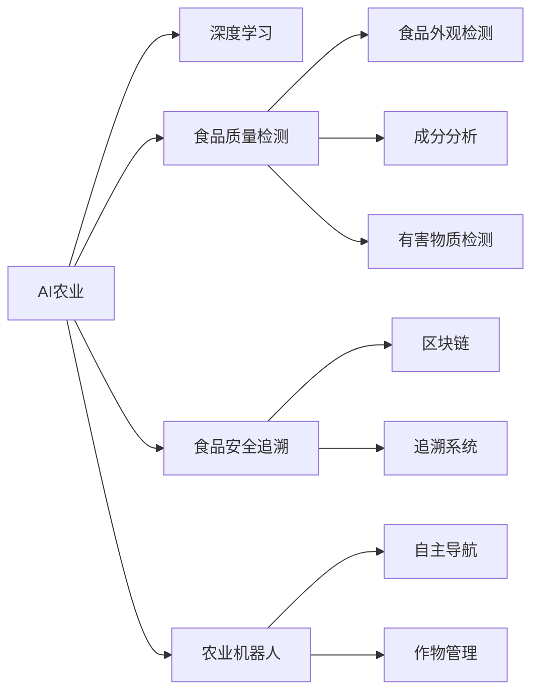

                 

## 1. 背景介绍

### 1.1 问题由来

现代农业和食品安全面临着诸多挑战，包括作物病虫害防治、土壤退化、气候变化、食品安全问题等。这些问题亟需科技创新来应对，而人工智能（AI），尤其是深度学习，已经被证明是解决这些问题的有力工具。AI在农业和食品安全中的应用，不仅能够提高生产效率和农作物产量，还能确保食品安全，保护生态环境，提升消费者信心。

### 1.2 问题核心关键点

AI在农业和食品安全中的应用主要集中在以下几个方面：

- **作物病虫害识别与防治**：利用AI对农作物病虫害进行早期识别，提供精准的防治建议。
- **精准农业**：通过传感器和AI算法实现精准施肥、灌溉和耕作。
- **食品质量检测**：利用AI技术进行食品外观、成分和安全的自动化检测。
- **食品安全追溯**：通过区块链和AI技术实现食品供应链的透明化，确保食品安全可追溯。
- **农业机器人**：开发AI驱动的农业机器人，实现自动化的田间管理。

这些问题都是现代农业和食品行业面临的核心挑战，AI技术为解决这些问题提供了新的思路和方法。

## 2. 核心概念与联系

### 2.1 核心概念概述

为了更好地理解AI在农业和食品安全中的应用，本节将介绍几个关键概念及其之间的联系：

- **AI农业（Agriculture AI）**：利用AI技术提升农业生产效率和质量，包括作物管理、病虫害防治、精准农业等。
- **深度学习（Deep Learning）**：一种利用多层神经网络进行数据表示学习的技术，广泛应用于图像识别、自然语言处理等领域。
- **食品质量检测（Food Quality Inspection）**：利用AI技术对食品质量进行自动化检测，确保食品符合安全标准。
- **食品安全追溯（Food Safety Tracking）**：通过区块链和AI技术，实现食品供应链的透明化，确保食品安全可追溯。
- **农业机器人（Agriculture Robotics）**：基于AI技术驱动的农业机器人，实现自动化的田间管理。

这些核心概念通过深度学习算法和农业、食品领域的实际问题紧密联系起来，形成了一个完整的AI应用生态。

### 2.2 核心概念原理和架构的 Mermaid 流程图



这个流程图展示了AI农业及其在食品领域的具体应用。深度学习算法作为核心技术，支持了各种应用场景的实现。

## 3. 核心算法原理 & 具体操作步骤

### 3.1 算法原理概述

AI在农业和食品安全中的应用，主要基于深度学习算法的原理和技术。深度学习模型通过大量的数据进行训练，能够从原始数据中提取高层次的特征，进行分类、预测和回归等任务。这些模型通常由多层神经网络组成，每层都有不同的权重和偏置，可以自动学习数据的复杂结构。

### 3.2 算法步骤详解

AI在农业和食品安全中的应用，大致可以分为以下几个步骤：

1. **数据采集与预处理**：
   - 收集农作物、土壤、气象、食品等数据。
   - 清洗、处理和标准化数据，使其适合输入深度学习模型。

2. **模型训练**：
   - 选择合适的深度学习模型，如卷积神经网络（CNN）、循环神经网络（RNN）、生成对抗网络（GAN）等。
   - 将处理后的数据输入模型，进行训练，调整权重和偏置，优化损失函数。

3. **模型评估与部署**：
   - 使用测试集对训练好的模型进行评估，计算准确率、召回率等指标。
   - 将模型部署到实际应用中，如农作物病虫害识别、精准农业、食品质量检测等。

4. **持续学习与优化**：
   - 在实际应用中收集新数据，重新训练模型，不断优化模型性能。
   - 使用在线学习算法，实时更新模型，应对动态变化的环境。

### 3.3 算法优缺点

AI在农业和食品安全中的应用，具有以下优点：

- **高效**：深度学习模型可以自动学习数据特征，无需人工干预，提高了工作效率。
- **精准**：通过大量数据训练，模型能够提供高精度的预测和决策，减少了人为错误。
- **可扩展性**：模型可以轻松地扩展到新的领域和任务，具有较高的灵活性。

同时，这些应用也存在一些缺点：

- **数据依赖**：深度学习模型需要大量的标注数据进行训练，对标注数据的质量和数量有较高要求。
- **模型复杂**：深度学习模型结构复杂，训练和推理过程中可能出现过拟合和计算资源消耗大的问题。
- **伦理与安全**：AI在农业和食品安全中的应用可能涉及个人隐私和数据安全问题，需要严格控制和监管。

### 3.4 算法应用领域

AI在农业和食品安全中的应用，已经涵盖了从田间管理到供应链管理等多个领域，具体包括：

- **作物病虫害防治**：利用AI识别作物病虫害，提供防治建议。
- **精准农业**：通过传感器和AI算法实现精准施肥、灌溉和耕作。
- **食品质量检测**：利用AI技术进行食品外观、成分和安全的自动化检测。
- **食品安全追溯**：通过区块链和AI技术实现食品供应链的透明化，确保食品安全可追溯。
- **农业机器人**：开发AI驱动的农业机器人，实现自动化的田间管理。

这些应用领域展示了AI技术在农业和食品安全中广阔的应用前景。

## 4. 数学模型和公式 & 详细讲解 & 举例说明

### 4.1 数学模型构建

在AI农业和食品安全的应用中，常见的数学模型包括卷积神经网络（CNN）和循环神经网络（RNN）。以食品质量检测为例，我们可以使用CNN模型进行食品图像的分类和识别。

### 4.2 公式推导过程

以CNN模型为例，其核心公式如下：

$$
H(x) = \sigma\left(W_1 x + b_1\right)
$$

$$
H(x) = \sigma\left(W_2 H(x) + b_2\right)
$$

其中，$x$为输入的食品图像，$W$和$b$为模型的权重和偏置，$\sigma$为激活函数，如ReLU。通过多层卷积和池化操作，模型能够提取图像的特征，并进行分类。

### 4.3 案例分析与讲解

以食品质量检测为例，我们可以使用预训练的CNN模型，如ResNet，对食品图像进行分类。具体步骤如下：

1. **数据预处理**：将食品图像标准化，转换为张量形式。
2. **模型加载**：使用TensorFlow或PyTorch等框架，加载预训练的ResNet模型。
3. **预测**：将预处理后的图像输入模型，进行分类预测。
4. **后处理**：根据预测结果，确定食品的质量等级。

通过这些步骤，我们可以快速实现食品质量检测的应用，提升检测效率和准确性。

## 5. 项目实践：代码实例和详细解释说明

### 5.1 开发环境搭建

为了进行AI在农业和食品安全中的应用实践，需要搭建相应的开发环境。以下是Python和TensorFlow环境的搭建步骤：

1. **安装Python**：
   - 从官网下载并安装Python 3.x版本。
   - 安装Pip包管理工具。

2. **安装TensorFlow**：
   - 在命令行中运行以下命令：`pip install tensorflow`

3. **安装其他依赖库**：
   - 安装NumPy、Pandas、Matplotlib等库。

### 5.2 源代码详细实现

以下是一个使用TensorFlow进行食品质量检测的代码实现：

```python
import tensorflow as tf
from tensorflow.keras.preprocessing.image import ImageDataGenerator
from tensorflow.keras.applications.resnet50 import ResNet50
from tensorflow.keras.layers import GlobalAveragePooling2D, Dense

# 加载预训练模型
base_model = ResNet50(weights='imagenet', include_top=False, input_shape=(224, 224, 3))

# 添加自定义层
x = base_model.output
x = GlobalAveragePooling2D()(x)
x = Dense(1024, activation='relu')(x)
predictions = Dense(2, activation='softmax')(x)

# 构建模型
model = tf.keras.Model(inputs=base_model.input, outputs=predictions)

# 冻结预训练层
for layer in base_model.layers:
    layer.trainable = False

# 编译模型
model.compile(optimizer=tf.keras.optimizers.Adam(1e-4),
              loss='categorical_crossentropy',
              metrics=['accuracy'])

# 加载数据集
train_datagen = ImageDataGenerator(rescale=1./255, shear_range=0.2, zoom_range=0.2, horizontal_flip=True)
test_datagen = ImageDataGenerator(rescale=1./255)
train_generator = train_datagen.flow_from_directory('train', target_size=(224, 224), batch_size=32, class_mode='categorical')
test_generator = test_datagen.flow_from_directory('test', target_size=(224, 224), batch_size=32, class_mode='categorical')

# 训练模型
model.fit(train_generator, epochs=10, validation_data=test_generator)
```

### 5.3 代码解读与分析

这段代码实现了基于ResNet50模型的食品质量检测任务。以下是代码的详细解读：

1. **加载预训练模型**：使用ResNet50模型，并将其权重初始化为ImageNet数据集上的预训练权重。
2. **添加自定义层**：在模型的最后一层添加全连接层，进行分类预测。
3. **编译模型**：使用Adam优化器，损失函数为交叉熵，评估指标为准确率。
4. **加载数据集**：使用ImageDataGenerator进行数据预处理和增强，使用flow_from_directory加载数据集。
5. **训练模型**：使用fit方法进行模型训练，设置训练轮数为10。

通过这段代码，我们可以实现食品质量检测的快速原型设计和训练，验证模型的效果。

### 5.4 运行结果展示

训练完成后，我们可以使用测试集评估模型的性能：

```python
test_loss, test_acc = model.evaluate(test_generator, verbose=2)
print('Test accuracy:', test_acc)
```

输出结果显示模型的准确率，帮助我们评估模型的性能。

## 6. 实际应用场景

### 6.1 智能温室管理

智能温室管理是AI在农业中的应用之一。通过传感器和AI算法，可以实现对温室环境的自动控制和优化。具体应用包括：

- **温度控制**：利用AI预测温室内的温度变化，自动调节加热和冷却系统。
- **湿度控制**：通过AI算法优化温室内的湿度管理，确保植物的最佳生长条件。
- **光照控制**：利用AI识别植物的生长周期和需求，自动调节光照强度和时间。

这些技术可以显著提高农作物的产量和质量，减少资源浪费，降低生产成本。

### 6.2 食品质量在线检测

食品质量在线检测是AI在食品安全中的应用之一。通过AI技术，可以实现对食品外观、成分和安全的自动化检测。具体应用包括：

- **食品外观检测**：利用AI算法识别食品的外观缺陷，如裂纹、斑点、霉变等。
- **成分分析**：通过光谱分析等技术，检测食品中的营养成分和有害成分。
- **食品安全检测**：利用AI算法识别食品中的细菌、病毒等有害微生物，确保食品安全。

这些技术可以显著提升食品安全检测的效率和准确性，减少人工检测的误差和成本。

### 6.3 食品供应链透明化

食品供应链透明化是AI在食品安全中的重要应用之一。通过区块链和AI技术，可以实现食品供应链的透明化，确保食品安全可追溯。具体应用包括：

- **数据采集**：通过传感器和AI算法，实时采集食品供应链各环节的数据。
- **数据记录**：利用区块链技术记录食品供应链各环节的操作信息，确保数据的不可篡改性。
- **追溯系统**：通过AI算法分析数据，生成食品供应链的追溯报告，确保食品安全可追溯。

这些技术可以显著提高食品供应链的透明度和安全性，减少食品安全事故的发生。

### 6.4 未来应用展望

随着AI技术的不断进步，AI在农业和食品安全中的应用将更加广泛和深入。未来，AI技术有望在以下几个方面得到广泛应用：

- **农业自动化**：通过AI技术实现农业机器人的自动化操作，提高农业生产的效率和精度。
- **智能农机**：利用AI技术开发智能农机，实现自动驾驶、智能导航等功能。
- **智能农业**：通过AI技术实现智能农业管理，包括智能灌溉、智能施肥、智能病虫害防治等。
- **精准农业**：利用AI技术实现精准农业，提高农作物产量和质量，减少资源浪费。

这些应用将进一步推动农业和食品行业的发展，提升生产效率和质量，保护生态环境，确保食品安全。

## 7. 工具和资源推荐

### 7.1 学习资源推荐

为了帮助开发者系统掌握AI在农业和食品安全中的应用，这里推荐一些优质的学习资源：

1. **《深度学习》**：Ian Goodfellow等人著作的深度学习经典教材，介绍了深度学习的基本概念和算法。
2. **《TensorFlow官方文档》**：TensorFlow的官方文档，提供了丰富的API文档和样例代码，是学习TensorFlow的重要资源。
3. **《农业机器人技术与应用》**：介绍了农业机器人技术的原理、方法和应用，适合农业领域的技术人员学习。
4. **《食品质量检测技术》**：介绍了食品质量检测的基本技术和方法，适合食品领域的技术人员学习。
5. **《区块链技术与应用》**：介绍了区块链技术的基本概念和应用，适合区块链领域的技术人员学习。

通过对这些资源的学习实践，相信你一定能够快速掌握AI在农业和食品安全中的应用技术，并用于解决实际的农业和食品问题。

### 7.2 开发工具推荐

高效的开发离不开优秀的工具支持。以下是几款用于AI在农业和食品安全中应用的常用工具：

1. **TensorFlow**：基于Python的开源深度学习框架，提供了丰富的模型和算法库，支持大规模深度学习模型的开发和训练。
2. **PyTorch**：基于Python的开源深度学习框架，提供了动态计算图和灵活的API，适合快速迭代研究和原型设计。
3. **Keras**：基于Python的深度学习库，提供了高层API，适合快速搭建和训练深度学习模型。
4. **Google Colab**：谷歌推出的在线Jupyter Notebook环境，免费提供GPU和TPU算力，方便开发者快速上手实验最新模型，分享学习笔记。
5. **Scikit-learn**：Python中的数据处理和机器学习库，提供了丰富的数据处理和模型评估工具，适合数据处理和模型评估。

合理利用这些工具，可以显著提升AI在农业和食品安全中应用的开发效率，加快创新迭代的步伐。

### 7.3 相关论文推荐

AI在农业和食品安全中的应用是一个前沿的交叉领域，以下是几篇奠基性的相关论文，推荐阅读：

1. **《基于深度学习的农业病虫害识别与防治》**：介绍使用深度学习模型进行农作物病虫害识别的技术，提出了多种基于CNN和RNN的模型。
2. **《精准农业中的智能灌溉系统》**：介绍使用AI技术实现精准农业的智能灌溉系统，提出了多种智能灌溉方法和策略。
3. **《食品质量检测中的深度学习技术》**：介绍使用深度学习模型进行食品质量检测的技术，提出了多种基于CNN和RNN的模型。
4. **《区块链技术在食品供应链中的应用》**：介绍使用区块链技术实现食品供应链透明化的技术，提出了多种区块链系统和应用场景。
5. **《农业机器人中的AI技术》**：介绍使用AI技术实现农业机器人的自动化操作，提出了多种农业机器人系统和算法。

这些论文代表了大规模农业和食品领域的研究进展，通过学习这些前沿成果，可以帮助研究者把握学科前进方向，激发更多的创新灵感。

## 8. 总结：未来发展趋势与挑战

### 8.1 研究成果总结

AI在农业和食品安全中的应用，已经取得了显著的成果，并在多个实际应用中得到验证。未来，随着AI技术的不断进步，这些应用有望进一步扩展和深化，带来更加智能和高效的生产和监管方式。

### 8.2 未来发展趋势

展望未来，AI在农业和食品安全中的应用将呈现以下几个发展趋势：

1. **智能化**：通过深度学习等技术，实现农业和食品生产、管理的智能化，提高生产效率和质量。
2. **自动化**：通过AI技术实现农业机器人和智能农机的自动化操作，减少人力成本，提高生产效率。
3. **个性化**：通过AI技术实现个性化农业和食品管理，根据不同环境和需求，提供定制化的解决方案。
4. **跨领域融合**：将AI技术与物联网、区块链等技术相结合，实现农业和食品供应链的透明化、可追溯化和智能化。
5. **全球化**：将AI技术应用到全球各地的农业和食品行业，提高全球农业生产效率和食品安全水平。

这些趋势展示了AI技术在农业和食品安全中的广阔应用前景，未来必将成为推动农业和食品行业发展的关键力量。

### 8.3 面临的挑战

尽管AI在农业和食品安全中的应用已经取得了显著进展，但在迈向更加智能化、普适化应用的过程中，仍然面临一些挑战：

1. **数据获取与处理**：AI应用需要大量的标注数据和传感器数据，数据获取和处理成本较高。
2. **模型复杂与计算资源**：深度学习模型结构复杂，计算资源消耗大，需要高性能的计算设备和算法优化。
3. **伦理与安全**：AI在农业和食品安全中的应用可能涉及个人隐私和数据安全问题，需要严格控制和监管。
4. **技术可扩展性**：AI技术在农业和食品中的应用需要跨学科的合作，技术可扩展性有待提高。
5. **知识积累与普及**：AI技术在农业和食品安全中的应用需要大量的知识积累和普及，现有知识的缺乏和普及不足是一个挑战。

这些挑战需要学界和产业界共同努力，积极应对并寻求突破，才能实现AI在农业和食品安全中的全面应用。

### 8.4 研究展望

未来的研究需要在以下几个方面寻求新的突破：

1. **数据获取与处理**：开发更加高效的数据获取和处理技术，降低数据成本，提高数据质量。
2. **模型简化与优化**：研究更加轻量级、高效的模型架构和算法，降低计算资源消耗，提高模型效率。
3. **伦理与安全**：建立AI技术应用的伦理和安全机制，确保数据隐私和用户安全。
4. **跨学科合作**：加强与农业、食品、物联网、区块链等领域的合作，推动跨学科技术的发展和应用。
5. **知识普及与教育**：普及AI技术在农业和食品安全中的应用知识，提升公众对AI技术的认知和接受度。

这些研究方向的探索，将引领AI在农业和食品安全中的应用技术迈向更高的台阶，为构建智能、高效、安全的农业和食品系统提供有力支撑。

## 9. 附录：常见问题与解答

**Q1：AI在农业和食品安全中的应用主要有哪些？**

A: AI在农业和食品安全中的应用主要包括以下几个方面：

- 作物病虫害识别与防治：利用AI识别作物病虫害，提供防治建议。
- 精准农业：通过传感器和AI算法实现精准施肥、灌溉和耕作。
- 食品质量检测：利用AI技术进行食品外观、成分和安全的自动化检测。
- 食品安全追溯：通过区块链和AI技术实现食品供应链的透明化，确保食品安全可追溯。
- 农业机器人：开发AI驱动的农业机器人，实现自动化的田间管理。

**Q2：AI在农业和食品安全中应用的数据依赖性如何解决？**

A: AI在农业和食品安全中的应用需要大量的标注数据和传感器数据，数据依赖性是一个主要挑战。以下是一些解决数据依赖性的方法：

- **数据增强**：通过数据增强技术，生成更多训练数据，减少对标注数据的依赖。
- **半监督学习**：使用半监督学习技术，利用未标注数据进行模型训练，减少对标注数据的依赖。
- **迁移学习**：将已有领域的数据和模型迁移到新领域，减少对标注数据的依赖。
- **主动学习**：利用主动学习技术，选择最有用的标注数据进行训练，提高数据利用效率。

这些方法可以显著降低数据依赖性，提高AI在农业和食品安全中的应用效果。

**Q3：AI在农业和食品安全中的应用面临哪些伦理与安全问题？**

A: AI在农业和食品安全中的应用可能涉及个人隐私和数据安全问题，需要严格控制和监管。以下是一些常见的伦理与安全问题：

- **隐私保护**：收集和处理大量的农业和食品数据，可能涉及个人隐私和数据安全问题。
- **数据安全**：存储和传输数据过程中可能遭受黑客攻击和数据泄露。
- **模型偏见**：AI模型可能存在偏见，对某些群体或地区不公平。
- **伦理决策**：AI在农业和食品安全中的应用可能涉及伦理决策问题，如自动化决策的道德风险。

这些问题需要通过技术手段和管理措施来解决，确保AI技术在农业和食品安全中的应用安全、可靠和公正。

**Q4：AI在农业和食品安全中的应用有哪些未来趋势？**

A: AI在农业和食品安全中的应用将呈现以下几个未来趋势：

- **智能化**：通过深度学习等技术，实现农业和食品生产、管理的智能化，提高生产效率和质量。
- **自动化**：通过AI技术实现农业机器人和智能农机的自动化操作，减少人力成本，提高生产效率。
- **个性化**：通过AI技术实现个性化农业和食品管理，根据不同环境和需求，提供定制化的解决方案。
- **跨领域融合**：将AI技术与物联网、区块链等技术相结合，实现农业和食品供应链的透明化、可追溯化和智能化。
- **全球化**：将AI技术应用到全球各地的农业和食品行业，提高全球农业生产效率和食品安全水平。

这些趋势展示了AI技术在农业和食品安全中的广阔应用前景，未来必将成为推动农业和食品行业发展的关键力量。

---

作者：禅与计算机程序设计艺术 / Zen and the Art of Computer Programming

