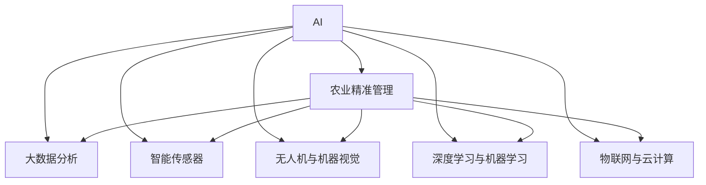

                 

# AI在农业精准管理中的应用

## 1. 背景介绍

农业是人类社会发展的基础，然而传统农业管理方式往往依赖经验与人工，存在效率低、成本高、精确度差等诸多问题。近年来，随着AI技术的迅猛发展，农业智能化管理逐渐成为研究热点，通过数据驱动的智能算法优化农业生产流程，显著提升了农业生产效率与产品质量。

### 1.1 问题由来

传统农业管理方法主要存在以下问题：
- **效率低下**：依赖人工经验，机械化水平不高，影响生产效率。
- **成本高昂**：频繁人工巡田、施肥、喷洒农药，投入巨大。
- **精准度差**：依赖经验，无法精确控制施肥、灌溉等关键变量，导致资源浪费与环境污染。
- **信息不对称**：难以实时获取农田状态，无法及时发现与应对问题，造成农作物损失。

而AI技术的引入，使得农业管理向智能化、精准化方向迈进，显著提高了生产效率、降低成本、减少资源浪费、优化农作物产出。

## 2. 核心概念与联系

### 2.1 核心概念概述

在农业AI应用中，涉及的核心概念包括：

- **AI**：人工智能，一种通过算法和大数据分析优化生产流程的技术，广泛用于农业精准管理。
- **农业精准管理**：通过AI技术对农田环境、作物生长、机械操作等进行精准监测、预测与控制，提升农业生产效率与产品质量。
- **大数据分析**：通过收集、分析和处理大量农业数据，提取关键信息，指导农业生产决策。
- **智能传感器**：各类物联网传感器，实时监控农田环境，收集土壤湿度、温度、光照、二氧化碳浓度等关键数据。
- **无人机与机器视觉**：利用无人机和机器视觉技术，对农田进行高分辨率成像，辅助精准作业。
- **深度学习与机器学习**：通过深度学习与机器学习算法，对农业数据进行建模和预测，提供科学决策依据。
- **物联网与云计算**：通过物联网技术实现设备的远程控制与数据传输，云计算平台提供计算资源与数据存储，支持大规模AI模型训练与应用。

这些核心概念通过如下Mermaid流程图展示相互关系：



## 3. 核心算法原理 & 具体操作步骤

### 3.1 算法原理概述

农业AI的核心算法原理主要包括数据采集与预处理、特征工程、模型训练与优化、实时监测与决策等环节。以下将详细介绍这些步骤。

### 3.2 算法步骤详解

#### 3.2.1 数据采集与预处理
农业AI的数据来源广泛，包括气象数据、土壤数据、作物生长数据、机械作业数据等。数据采集与预处理包括以下几个步骤：

- **数据收集**：通过各类传感器、无人机、土壤探测仪等设备，实时采集农田环境数据。
- **数据清洗**：对采集到的原始数据进行去重、纠错、补全等处理，去除异常值和噪声。
- **数据转换**：将不同类型的数据转换成统一格式，便于后续分析和建模。

#### 3.2.2 特征工程
特征工程是农业AI中非常重要的一环，通过提取关键特征，提高模型的预测准确性。

- **数据选择**：根据任务需求，选择对模型预测有用的特征。
- **特征转换**：对原始数据进行归一化、标准化、离散化等处理，提高数据质量。
- **特征组合**：使用如PCA、LDA等降维技术，简化数据维度，提高模型效率。

#### 3.2.3 模型训练与优化
模型训练与优化是AI应用的灵魂。以下以深度学习模型为例，介绍关键步骤。

- **模型选择**：根据任务需求，选择合适的深度学习模型，如卷积神经网络(CNN)、循环神经网络(RNN)、注意力机制(Attention)等。
- **超参数调优**：通过网格搜索、随机搜索等方法，找到最优的模型超参数。
- **模型训练**：利用大数据集对模型进行训练，逐步优化模型参数。
- **模型验证**：在验证集上测试模型性能，调整模型结构和参数。
- **模型评估**：使用测试集对模型进行评估，确定模型最终表现。

#### 3.2.4 实时监测与决策
实时监测与决策是农业AI的最终目标。通过实时数据监测与分析，提供科学决策依据。

- **实时数据采集**：利用传感器、无人机等设备，实时采集农田数据。
- **数据处理与存储**：对实时数据进行处理与存储，支持后续分析。
- **模型推理**：将实时数据输入模型，进行预测与决策。
- **决策输出**：根据模型推理结果，提供灌溉、施肥、喷洒农药等操作建议。

## 4. 数学模型和公式 & 详细讲解 & 举例说明

### 4.1 数学模型构建

农业AI的数学模型构建涉及多个环节，包括数据采集与预处理、特征工程、模型训练与优化、实时监测与决策等。以下以深度学习模型为例，详细介绍数学模型构建过程。

### 4.2 公式推导过程

以卷积神经网络(CNN)为例，推导模型的训练过程。

- **输入层**：接收农田环境数据，表示为 $x_1, x_2, ..., x_n$。
- **卷积层**：使用 $k$ 个卷积核 $h_1, h_2, ..., h_k$，对输入数据进行特征提取，得到 $y_1, y_2, ..., y_k$。
- **激活函数**：对卷积结果进行激活，如ReLU、Sigmoid等。
- **池化层**：对激活结果进行池化，降低维度，得到 $z_1, z_2, ..., z_k$。
- **全连接层**：将池化结果输入全连接层，得到 $w_1, w_2, ..., w_k$。
- **输出层**：输出预测结果，如灌溉量、施肥量等。

### 4.3 案例分析与讲解

以作物病虫害预测为例，介绍模型构建与训练过程。

- **数据集构建**：收集历史病虫害数据，包括作物种类、生长周期、气象条件、病虫害发生情况等。
- **数据预处理**：对数据进行清洗、归一化、特征工程等处理。
- **模型选择**：选择适当的深度学习模型，如卷积神经网络。
- **模型训练**：使用历史数据对模型进行训练，优化模型参数。
- **模型评估**：在测试集上评估模型性能，确定最终模型。
- **实时监测与决策**：实时采集农田数据，输入模型进行推理，输出防治建议。

## 5. 项目实践：代码实例和详细解释说明

### 5.1 开发环境搭建

项目开发环境搭建包括服务器硬件配置、操作系统安装、编程语言选择、库文件安装等。

- **硬件配置**：选择高性能服务器，配置足够的CPU、内存、存储资源。
- **操作系统**：选择Linux系统，如Ubuntu，安装必要的软件包。
- **编程语言**：选择Python，安装必要的库文件，如TensorFlow、Keras等。
- **环境配置**：使用Docker等容器化技术，确保环境一致性。

### 5.2 源代码详细实现

以下以作物病虫害预测为例，介绍代码实现。

```python
import tensorflow as tf
from tensorflow.keras.layers import Conv2D, MaxPooling2D, Flatten, Dense
from tensorflow.keras.models import Sequential

# 构建卷积神经网络模型
model = Sequential()
model.add(Conv2D(32, (3, 3), activation='relu', input_shape=(64, 64, 3)))
model.add(MaxPooling2D((2, 2)))
model.add(Conv2D(64, (3, 3), activation='relu'))
model.add(MaxPooling2D((2, 2)))
model.add(Conv2D(128, (3, 3), activation='relu'))
model.add(MaxPooling2D((2, 2)))
model.add(Flatten())
model.add(Dense(64, activation='relu'))
model.add(Dense(1, activation='sigmoid'))

# 编译模型
model.compile(optimizer='adam', loss='binary_crossentropy', metrics=['accuracy'])

# 训练模型
model.fit(X_train, y_train, epochs=10, validation_data=(X_test, y_test))

# 评估模型
score = model.evaluate(X_test, y_test, verbose=0)
print('Test loss:', score[0])
print('Test accuracy:', score[1])
```

### 5.3 代码解读与分析

代码实现部分包括以下几个关键步骤：

- **模型构建**：使用Keras库构建卷积神经网络模型，包括卷积层、池化层、全连接层等。
- **模型编译**：设置优化器、损失函数和评估指标。
- **模型训练**：使用训练集对模型进行训练，优化模型参数。
- **模型评估**：在测试集上评估模型性能，输出模型准确度。

## 6. 实际应用场景

### 6.1 智能灌溉系统

智能灌溉系统通过实时监测土壤湿度和气象数据，自动调整灌溉策略，节省水资源，提高灌溉效率。

- **系统架构**：数据采集层、处理层、决策层、执行层。
- **数据采集**：使用土壤湿度传感器、气象站等设备，实时采集数据。
- **数据处理**：对采集到的数据进行清洗、归一化处理，生成特征数据。
- **决策制定**：使用深度学习模型，对特征数据进行推理，输出灌溉策略。
- **系统执行**：根据决策结果，自动控制灌溉设备，实现精准灌溉。

### 6.2 精准施肥系统

精准施肥系统通过实时监测土壤养分和作物生长情况，优化施肥策略，提高肥料利用率，减少环境污染。

- **系统架构**：数据采集层、处理层、决策层、执行层。
- **数据采集**：使用土壤养分传感器、作物生长监测器等设备，实时采集数据。
- **数据处理**：对采集到的数据进行清洗、归一化处理，生成特征数据。
- **决策制定**：使用深度学习模型，对特征数据进行推理，输出施肥策略。
- **系统执行**：根据决策结果，自动控制施肥设备，实现精准施肥。

### 6.3 病虫害预测与防治系统

病虫害预测与防治系统通过实时监测农田环境，预测病虫害发生情况，及时采取防治措施，减少农作物损失。

- **系统架构**：数据采集层、处理层、决策层、执行层。
- **数据采集**：使用无人机、高清相机等设备，采集农田图像数据。
- **数据处理**：对采集到的图像数据进行预处理、特征提取等。
- **决策制定**：使用深度学习模型，对特征数据进行推理，预测病虫害发生情况。
- **系统执行**：根据预测结果，自动喷药防治，实现病虫害防治。

## 7. 工具和资源推荐

### 7.1 学习资源推荐

1. **《深度学习》：Ian Goodfellow**：介绍深度学习的基本原理、算法和应用，适合初学者和进阶者。
2. **Coursera AI课程**：提供多门深度学习课程，包括计算机视觉、自然语言处理等方向，由斯坦福大学等知名学府提供。
3. **Kaggle竞赛平台**：参与农业数据竞赛，积累实践经验，提升技术水平。
4. **农业大数据平台**：如OpenAg、FarmProject，提供海量农业数据集，支持数据分析与建模。
5. **GitHub开源项目**：如TensorFlow农业应用、PyTorch农业项目，可学习先进应用案例，分享代码资源。

### 7.2 开发工具推荐

1. **TensorFlow**：开源深度学习框架，提供丰富的机器学习算法和工具。
2. **Keras**：高层次神经网络API，简化模型构建与训练过程。
3. **PyTorch**：开源机器学习库，支持动态图和静态图两种计算图模式。
4. **Jupyter Notebook**：交互式数据科学平台，支持Python、R等编程语言，方便代码编写与调试。
5. **Docker**：容器化技术，确保环境一致性，支持模型部署与迁移。

### 7.3 相关论文推荐

1. **《Deep Learning for Disease Diagnosis in Crops》**：介绍深度学习在作物病虫害诊断中的应用。
2. **《A Survey on Agricultural Internet of Things》**：综述农业物联网技术的研究进展，涵盖传感器、数据采集与处理等方面。
3. **《Precision Agriculture: A Review》**：综述精准农业的研究进展，包括数据采集、智能决策等方面。
4. **《Crop Monitoring and Smart Farming Using Internet of Things》**：介绍基于物联网的智能农业系统，涵盖数据采集、智能决策等方面。
5. **《AI in Agriculture: A Survey of Recent Advances》**：综述人工智能在农业领域的应用进展，涵盖图像识别、智能灌溉、精准施肥等方面。

## 8. 总结：未来发展趋势与挑战

### 8.1 研究成果总结

农业AI技术经过多年的研究与发展，已取得显著进展，主要成果包括：

- **智能灌溉系统**：通过实时监测土壤湿度和气象数据，自动调整灌溉策略，节省水资源，提高灌溉效率。
- **精准施肥系统**：通过实时监测土壤养分和作物生长情况，优化施肥策略，提高肥料利用率，减少环境污染。
- **病虫害预测与防治系统**：通过实时监测农田环境，预测病虫害发生情况，及时采取防治措施，减少农作物损失。

### 8.2 未来发展趋势

未来，农业AI技术将呈现以下几个发展趋势：

1. **智能化水平提升**：随着AI技术的发展，农业AI系统的智能化水平将不断提升，能够更加精准地监测与决策。
2. **数据融合与集成**：将更多数据源整合到农业AI系统中，如卫星遥感数据、气象数据、社会经济数据等，提供更全面的农业数据支持。
3. **自动化与智能化设备普及**：随着智能传感器、无人机等设备的普及，农业生产将更加自动化和智能化。
4. **多模态数据融合**：将不同模态的数据，如视觉、声音、振动等融合到农业AI系统中，提供更全面、精准的监测与决策支持。
5. **分布式计算与边缘计算**：利用分布式计算与边缘计算技术，提升数据处理效率，降低系统延迟。

### 8.3 面临的挑战

尽管农业AI技术已取得显著进展，但在实际应用中仍面临诸多挑战：

1. **数据获取困难**：农业数据获取成本高，获取难度大，数据质量难以保证。
2. **数据隐私保护**：农业数据涉及大量隐私信息，如何在保护隐私的前提下进行数据共享与应用，是个难题。
3. **算法复杂性高**：农业问题复杂多样，需要高精度的算法支持，开发和优化算法难度大。
4. **设备成本高**：智能传感器、无人机等设备成本高，普及难度大。
5. **技术融合难度大**：将不同技术进行融合应用，需要跨学科知识，难度大。

### 8.4 研究展望

未来，农业AI技术的研究方向将集中在以下几个方面：

1. **数据获取与处理**：开发更高效、低成本的数据采集与处理方法，确保数据质量。
2. **算法优化与融合**：研究高效、鲁棒的算法，将不同技术进行融合应用。
3. **隐私保护与共享**：研究隐私保护技术，确保数据安全共享。
4. **设备成本优化**：降低设备成本，提升设备普及率。
5. **系统集成与应用**：开发集成化农业AI系统，提升应用效果。

## 9. 附录：常见问题与解答

**Q1：如何选择合适的农业AI算法？**

A: 选择农业AI算法应考虑以下因素：
- **数据特点**：根据数据类型、维度、特征等，选择合适的算法。
- **任务需求**：根据任务目标，选择适合解决特定问题的算法。
- **计算资源**：考虑计算资源限制，选择高效算法。

**Q2：如何处理农业数据中的噪声？**

A: 处理农业数据中的噪声主要包括以下几个步骤：
- **数据清洗**：去除缺失值、异常值、重复值等。
- **数据平滑**：使用均值滤波、中值滤波等方法，平滑数据。
- **特征工程**：使用PCA、LDA等降维技术，降低数据维度，减少噪声影响。

**Q3：农业AI在实际应用中面临哪些技术挑战？**

A: 农业AI在实际应用中面临以下技术挑战：
- **数据获取困难**：数据获取成本高，获取难度大。
- **数据隐私保护**：数据涉及大量隐私信息，数据共享难度大。
- **算法复杂性高**：农业问题复杂多样，需要高精度的算法支持。
- **设备成本高**：智能传感器、无人机等设备成本高，普及难度大。
- **技术融合难度大**：不同技术融合应用，需要跨学科知识。

**Q4：如何提升农业AI系统的可扩展性？**

A: 提升农业AI系统的可扩展性，主要包括以下几个步骤：
- **模块化设计**：将系统分解为多个模块，便于维护与扩展。
- **云平台部署**：利用云平台资源，支持系统快速部署与扩展。
- **微服务架构**：采用微服务架构，支持服务模块化，便于扩展与维护。

**Q5：如何评估农业AI系统的性能？**

A: 评估农业AI系统的性能，主要从以下几个方面考虑：
- **准确率与召回率**：评估模型在数据分类、预测等方面的准确率与召回率。
- **模型效率**：评估模型的计算效率、内存占用、响应时间等性能指标。
- **实际应用效果**：评估系统在实际应用中的效果，如产量提升、资源节省等。

---

作者：禅与计算机程序设计艺术 / Zen and the Art of Computer Programming

