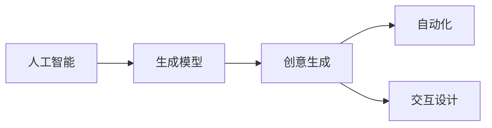

                 

# AI在创意产业中的应用：音乐、艺术与设计

> 关键词：人工智能, 创意产业, 音乐, 艺术, 设计, 生成模型, 创意生成, 自动化, 交互设计

## 1. 背景介绍

随着人工智能技术的快速发展，AI在各个行业的应用已经趋于成熟，尤其在创意产业中，AI的应用更是日益广泛。创意产业，包括音乐、艺术和设计等领域的艺术家、设计师和创作者们，越来越频繁地使用AI来辅助其创作过程，甚至直接参与到创作中来。AI不仅提升了创意产业的效率，还打开了新的创意空间，让创作变得更为自由、丰富。

### 1.1 问题由来
在创意产业中，创意是核心。传统的创意过程往往需要大量的时间、精力和经验积累，但随着AI的介入，许多重复性的创作任务可以被自动化处理，使得创作者能够专注于更有创造性的部分。AI可以生成音乐、艺术作品和设计方案，提供灵感和创意，甚至可以创造出完全新颖的创意作品。

### 1.2 问题核心关键点
AI在创意产业中的应用，主要集中在以下几个方面：
1. **音乐创作**：通过深度学习模型生成旋律、和弦和歌词，甚至完整的音乐作品。
2. **艺术创作**：利用生成对抗网络（GAN）等技术，生成绘画、雕塑等艺术作品。
3. **设计创作**：自动生成建筑设计、服装设计等方案，甚至为消费者提供个性化的设计服务。
4. **交互设计**：通过用户反馈动态调整AI创作的艺术和设计作品，实现更符合用户需求的创作。

AI的引入不仅提高了创意产业的工作效率，还为创作者提供了更多的可能性，打开了新的创作领域。然而，AI在创意产业中的应用也带来了一些挑战，如创意作品的版权归属、人类创意与AI创作之间的平衡等。

## 2. 核心概念与联系

### 2.1 核心概念概述

要深入理解AI在创意产业中的应用，首先需要明确几个核心概念：

- **人工智能**：一种模拟人类智能行为的计算机技术，涵盖机器学习、深度学习、自然语言处理等方向。
- **创意产业**：涉及音乐、艺术、设计等领域，强调原创性和创意性。
- **生成模型**：通过学习大量数据，生成新的数据（如音乐、艺术、设计作品）的技术。
- **创意生成**：利用AI生成新的创意作品或设计方案的过程。
- **自动化**：将重复性、低价值的任务自动化，让创作者专注于更有创造性的部分。
- **交互设计**：通过用户反馈动态调整AI创作，实现更符合用户需求的创作。

这些概念之间的关系可以通过以下Mermaid流程图来展示：



### 2.2 核心概念原理和架构的 Mermaid 流程图

```mermaid
graph TB
    A[音乐创作] --> B[深度学习]
    A --> C[艺术创作] --> D[生成对抗网络 (GAN)]
    A --> E[设计创作] --> F[生成模型]
    A --> G[交互设计] --> H[用户反馈]
    H --> I[动态调整]
```

## 3. 核心算法原理 & 具体操作步骤

### 3.1 算法原理概述

AI在创意产业中的应用，主要依赖于生成模型和自动化技术。生成模型通过对大量数据的训练，学习到数据的潜在结构和特征，从而生成新的、未见过的数据。自动化技术则通过优化算法和规则，将创作过程自动化，提高创作效率。

生成模型的核心在于学习数据的潜在分布，利用该分布生成新的数据。常用的生成模型包括：

- **深度学习生成模型**：如循环神经网络（RNN）、卷积神经网络（CNN）、生成对抗网络（GAN）等，能够生成连续的、离散的、图像的等多种类型的数据。
- **自回归生成模型**：如循环自回归模型（LSTM），能够生成文本、语音等序列数据。
- **变分自编码器（VAE）**：能够生成离散的、分布式的数据，如图像、音频等。

这些生成模型通过学习大量数据，能够生成与训练数据分布相似的新数据，从而实现创意作品的自动化生成。

### 3.2 算法步骤详解

以下是AI在音乐、艺术与设计中应用的主要步骤：

**Step 1: 数据准备**
- 收集大量与目标任务相关的数据，如音乐谱、艺术作品、设计方案等。
- 清洗数据，去除异常值和噪声，确保数据的质量。

**Step 2: 模型选择与训练**
- 选择适当的生成模型，如深度学习生成模型、GAN等。
- 使用收集的数据对模型进行训练，调整模型参数。

**Step 3: 创作与优化**
- 使用训练好的模型生成新的创意作品，如音乐、艺术作品和设计方案。
- 通过自动化技术，优化创作过程，提高创作效率。
- 结合交互设计，根据用户反馈动态调整创作过程。

**Step 4: 发布与反馈**
- 将生成的作品发布到相关平台上，接受用户和市场的检验。
- 收集用户反馈，对作品进行进一步优化。

### 3.3 算法优缺点

AI在创意产业中的应用具有以下优点：
1. **效率提升**：自动化处理重复性任务，解放创作者的时间，使其专注于更有创造性的部分。
2. **创意丰富**：生成模型能够提供多种创意可能性，打破传统思维定式，激发新的创作灵感。
3. **可扩展性强**：通过收集和训练更多的数据，生成模型的能力可以持续提升。

同时，也存在一些缺点：
1. **创意失去人类情感**：AI生成的作品可能缺乏人类情感和深度，难以完全替代人类创作。
2. **版权问题**：创意作品的原创性和版权归属存在争议。
3. **技术门槛**：高水平的创意作品仍需要人类经验和技术积累。
4. **数据依赖性强**：生成模型的性能依赖于数据的质量和数量，数据获取难度较大。

### 3.4 算法应用领域

AI在创意产业中的应用，主要涵盖以下几个领域：

- **音乐创作**：如Amper Music等平台，通过AI生成歌曲的旋律、歌词和编曲。
- **艺术创作**：如DeepArt、Artistic AI等，利用GAN生成绘画、雕塑等艺术作品。
- **设计创作**：如Autodesk、Adobe等软件中的AI设计助手，自动生成建筑设计、服装设计等方案。
- **交互设计**：如Google Design、Microsoft AI等，结合用户反馈动态调整AI创作的艺术和设计作品。

这些应用领域展示了AI在创意产业中的广泛适用性，推动了各行业的创新和发展。

## 4. 数学模型和公式 & 详细讲解 & 举例说明

### 4.1 数学模型构建

AI在创意产业中的应用，主要依赖于生成模型。这里以GAN为例，介绍其数学模型构建过程。

GAN由两个神经网络组成：生成器（Generator）和判别器（Discriminator）。生成器的目标是通过学习大量真实数据的分布，生成尽可能逼真的假数据。判别器的目标是将真实数据与假数据区分开来。

GAN的数学模型如下：
$$
G(z) \sim G \quad \text{with} \quad G \in \mathcal{G}, \quad z \in \mathbb{R}^n
$$
$$
D(x) \sim D \quad \text{with} \quad D \in \mathcal{D}, \quad x \in \mathcal{X}
$$

其中，$G$ 表示生成器，$z$ 表示生成器输入的噪声向量，$D$ 表示判别器，$x$ 表示输入的真实数据。

### 4.2 公式推导过程

GAN的训练过程可以概括为两步：

1. **判别器训练**：
$$
J_D(G,D) = \mathbb{E}_{x \sim p_{\text{data}}}[\log D(x)] + \mathbb{E}_{z \sim p_z}[\log(1 - D(G(z)))
$$
其中，$J_D$ 表示判别器的损失函数，$p_{\text{data}}$ 表示真实数据的分布，$p_z$ 表示噪声向量的分布。

2. **生成器训练**：
$$
J_G(G,D) = \mathbb{E}_{z \sim p_z}[\log D(G(z))]
$$
其中，$J_G$ 表示生成器的损失函数。

通过不断迭代训练，生成器可以生成越来越逼真的假数据，判别器则可以越来越准确地将真实数据与假数据区分开来。

### 4.3 案例分析与讲解

以GAN生成音乐作品为例，分析其训练过程。

**Step 1: 数据准备**
- 收集大量音乐谱数据，包括不同风格、不同演奏者的音乐谱。

**Step 2: 模型选择与训练**
- 选择适当的GAN模型，如Wasserstein GAN（WGAN）。
- 使用音乐谱数据对GAN模型进行训练，调整生成器和判别器的参数。

**Step 3: 创作与优化**
- 使用训练好的生成器生成新的音乐谱，可以通过交互界面输入不同风格、情感等参数进行创作。
- 根据用户的反馈，调整生成器的参数，优化生成的音乐谱。

**Step 4: 发布与反馈**
- 将生成的音乐谱发布到相关平台，如Music AI平台。
- 收集用户反馈，对音乐谱进行进一步优化，提高创作质量。

## 5. 项目实践：代码实例和详细解释说明

### 5.1 开发环境搭建

以下是使用Python进行TensorFlow开发的环境配置流程：

1. 安装Anaconda：从官网下载并安装Anaconda，用于创建独立的Python环境。

2. 创建并激活虚拟环境：
```bash
conda create -n tf-env python=3.8 
conda activate tf-env
```

3. 安装TensorFlow：根据CUDA版本，从官网获取对应的安装命令。例如：
```bash
conda install tensorflow==2.4.0 -c tensorflow
```

4. 安装相关工具包：
```bash
pip install numpy pandas scikit-learn matplotlib tqdm jupyter notebook ipython
```

完成上述步骤后，即可在`tf-env`环境中开始TensorFlow的代码实现。

### 5.2 源代码详细实现

这里我们以GAN生成艺术作品为例，给出TensorFlow代码实现。

首先，定义GAN模型：

```python
import tensorflow as tf
from tensorflow.keras import layers

class Generator(tf.keras.Model):
    def __init__(self):
        super(Generator, self).__init__()
        self.dense1 = layers.Dense(128)
        self.dense2 = layers.Dense(256)
        self.dense3 = layers.Dense(512)
        self.dense4 = layers.Dense(784)
    
    def call(self, inputs):
        x = tf.keras.layers.Dense(128)(tf.keras.layers.Dense(128)(tf.keras.layers.Dense(128)(inputs)))
        x = tf.keras.layers.Dense(256)(x)
        x = tf.keras.layers.Dense(512)(x)
        x = tf.keras.layers.Dense(784)(x)
        return x

class Discriminator(tf.keras.Model):
    def __init__(self):
        super(Discriminator, self).__init__()
        self.dense1 = layers.Dense(128)
        self.dense2 = layers.Dense(64)
        self.dense3 = layers.Dense(1)
    
    def call(self, inputs):
        x = tf.keras.layers.Dense(128)(tf.keras.layers.Dense(128)(inputs))
        x = tf.keras.layers.Dense(64)(x)
        x = tf.keras.layers.Dense(1)(x)
        return x

# 定义GAN模型
def build_generator():
    return Generator()

def build_discriminator():
    return Discriminator()

# 构建模型
generator = build_generator()
discriminator = build_discriminator()

# 定义损失函数和优化器
cross_entropy = tf.keras.losses.BinaryCrossentropy()
generator_optimizer = tf.keras.optimizers.Adam(1e-4)
discriminator_optimizer = tf.keras.optimizers.Adam(1e-4)

# 定义训练过程
@tf.function
def train_step(images):
    with tf.GradientTape() as gen_tape, tf.GradientTape() as disc_tape:
        generated_images = generator(layers.Dense(128)(images))
        real_output = discriminator(images)
        fake_output = discriminator(generated_images)

        gen_loss = cross_entropy(tf.ones_like(fake_output), fake_output)
        disc_loss = cross_entropy(tf.ones_like(real_output), real_output) + cross_entropy(tf.zeros_like(fake_output), fake_output)
    gradients_of_generator = gen_tape.gradient(gen_loss, generator.trainable_variables)
    gradients_of_discriminator = disc_tape.gradient(disc_loss, discriminator.trainable_variables)
    generator_optimizer.apply_gradients(zip(gradients_of_generator, generator.trainable_variables))
    discriminator_optimizer.apply_gradients(zip(gradients_of_discriminator, discriminator.trainable_variables))

# 训练过程
def train(epochs):
    for epoch in range(epochs):
        for image_batch in train_dataset:
            train_step(image_batch)
```

### 5.3 代码解读与分析

让我们再详细解读一下关键代码的实现细节：

**Generator类**：
- `__init__`方法：初始化生成器的各个层。
- `call`方法：定义生成器的前向传播过程，将噪声向量转换为生成器的输出。

**Discriminator类**：
- `__init__`方法：初始化判别器的各个层。
- `call`方法：定义判别器的前向传播过程，将输入数据转换为判别器的输出。

**训练过程**：
- 定义交叉熵损失函数和优化器。
- 定义训练过程函数`train_step`，计算生成器和判别器的损失函数，并使用梯度下降更新模型参数。
- 定义训练过程函数`train`，遍历训练集数据，进行多次迭代训练。

以上代码展示了使用TensorFlow实现GAN模型训练的完整过程。可以看到，TensorFlow提供了便捷的框架支持，使得模型的实现和训练变得简单高效。

## 6. 实际应用场景

### 6.1 智能音乐创作

AI在音乐创作中的应用，已经从简单的旋律生成，发展到能够创作整首歌曲。通过深度学习模型，AI可以学习不同风格、不同演奏者的音乐谱，生成与训练数据分布相似的新音乐作品。智能音乐创作平台如Amper Music、Jukedeck等，已经广泛应用于广告、电影、游戏等场景中。

### 6.2 艺术创作

GAN在艺术创作中的应用，可以生成绘画、雕塑等多样化的艺术作品。DeepArt、Artistic AI等平台，利用GAN生成艺术作品，打破了传统艺术的创作限制，赋予了创作者更多的自由和可能性。GAN生成的艺术作品不仅在艺术界引起了广泛关注，也在大众媒体、广告、设计等领域得到了应用。

### 6.3 设计创作

AI在设计创作中的应用，主要是通过自动生成建筑设计、服装设计等方案，为用户提供个性化设计服务。Autodesk、Adobe等软件中的AI设计助手，已经能够生成与用户需求相匹配的设计方案，提高了设计的效率和质量。这些AI设计助手不仅能够处理复杂的几何图形，还能够生成具有美感的视觉设计方案。

### 6.4 交互设计

AI在交互设计中的应用，主要是通过用户反馈动态调整AI创作的艺术和设计作品，实现更符合用户需求的创作。Google Design、Microsoft AI等平台，利用用户反馈数据，动态调整AI创作的艺术和设计作品，提高了用户体验和满意度。

## 7. 工具和资源推荐

### 7.1 学习资源推荐

为了帮助开发者系统掌握AI在创意产业中的应用，这里推荐一些优质的学习资源：

1. Coursera的《深度学习》课程：由深度学习领域的大师Andrew Ng教授授课，系统介绍了深度学习的基本概念和算法。

2. Udacity的《机器学习基础》课程：涵盖机器学习的基本概念、算法和实践，适合初学者和进阶者。

3. Deep Learning with Python书籍：由深度学习专家Ian Goodfellow、Yoshua Bengio和Aaron Courville合著，全面介绍了深度学习的基本理论和应用。

4. 《GANs for Artistic Style Transfer》论文：介绍了GAN在艺术风格迁移中的应用，是GAN领域的重要研究成果。

5. DeepArt网站：展示了GAN在艺术创作中的应用，提供了丰富的创作案例和教程。

6. Artistic AI平台：利用GAN生成艺术作品，提供了多种创作风格和技巧。

通过这些学习资源，相信你一定能够快速掌握AI在创意产业中的应用，并用于解决实际的创意问题。

### 7.2 开发工具推荐

高效的开发离不开优秀的工具支持。以下是几款用于AI创意产业开发的常用工具：

1. TensorFlow：由Google主导开发的开源深度学习框架，生产部署方便，适合大规模工程应用。

2. PyTorch：由Facebook开发的开源深度学习框架，灵活动态的计算图，适合快速迭代研究。

3. Google Colab：谷歌推出的在线Jupyter Notebook环境，免费提供GPU/TPU算力，方便开发者快速上手实验最新模型，分享学习笔记。

4. Weights & Biases：模型训练的实验跟踪工具，可以记录和可视化模型训练过程中的各项指标，方便对比和调优。

5. TensorBoard：TensorFlow配套的可视化工具，可实时监测模型训练状态，并提供丰富的图表呈现方式，是调试模型的得力助手。

合理利用这些工具，可以显著提升AI创意产业的开发效率，加快创新迭代的步伐。

### 7.3 相关论文推荐

AI在创意产业中的应用，源于学界的持续研究。以下是几篇奠基性的相关论文，推荐阅读：

1. Real-Time Image-to-Image and Video-to-Video Generation with GANs：提出了GAN在图像和视频生成中的应用，展示了其在创意产业中的潜力。

2. StyleGAN: Generative Adversarial Networks for Fashionable Image Synthesis：介绍StyleGAN在生成具有时尚感图像中的应用，展示了其在艺术创作中的应用前景。

3. Generative Design for Fashion: The GAN Workbench：介绍GAN在时尚设计中的应用，展示了其在设计创作中的应用前景。

4. MMDetection：一个开源的物体检测工具库，利用深度学习模型实现物体检测，展示了其在交互设计中的应用前景。

这些论文代表了大规模学习模型在创意产业中的发展脉络。通过学习这些前沿成果，可以帮助研究者把握学科前进方向，激发更多的创新灵感。

## 8. 总结：未来发展趋势与挑战

### 8.1 总结

本文对AI在创意产业中的应用进行了全面系统的介绍。首先阐述了AI在创意产业中的重要性，明确了其在音乐、艺术和设计等领域的广泛应用。其次，从原理到实践，详细讲解了GAN模型的数学原理和关键步骤，给出了模型训练的完整代码实例。同时，本文还广泛探讨了AI在创意产业中的应用场景，展示了其广泛适用性。

通过本文的系统梳理，可以看到，AI在创意产业中的应用已经逐渐成熟，成为了推动行业创新和发展的重要力量。未来，伴随AI技术的不断进步，创意产业将会迎来更多的机遇和挑战。

### 8.2 未来发展趋势

展望未来，AI在创意产业中的应用将呈现以下几个发展趋势：

1. **自动化水平提升**：随着模型的不断优化，创作过程中的自动化水平将进一步提升，更多创意任务将被机器处理。
2. **跨领域融合**：AI将与物联网、区块链等技术相结合，推动创意产业的跨领域融合，带来新的创作形态和商业模式。
3. **个性化定制**：AI将利用大数据和推荐算法，提供个性化的创作服务，满足用户的多样化需求。
4. **可解释性和可信性增强**：未来AI将具备更高的可解释性和可信性，使其创作过程更加透明和可信。
5. **跨界合作加强**：AI将与人类创意共同创作，通过跨界合作，创造出更多富有创意的作品。

这些趋势凸显了AI在创意产业中的广阔前景。这些方向的探索发展，必将进一步提升创意产业的工作效率，推动创意产业的持续创新。

### 8.3 面临的挑战

尽管AI在创意产业中的应用已经取得了显著成果，但在迈向更加智能化、普适化应用的过程中，它仍面临着诸多挑战：

1. **创意失去人类情感**：AI生成的作品可能缺乏人类情感和深度，难以完全替代人类创作。
2. **版权问题**：创意作品的原创性和版权归属存在争议，如何平衡创作者和AI的权益，仍需进一步探讨。
3. **数据依赖性强**：生成模型的性能依赖于数据的质量和数量，数据获取难度较大。
4. **技术门槛高**：高水平的创意作品仍需要人类经验和技术积累。
5. **伦理和安全问题**：AI生成的作品可能带有偏见和有害信息，如何保证其伦理和安全，仍需进一步研究。

### 8.4 研究展望

未来研究需要在以下几个方面寻求新的突破：

1. **创意作品的伦理与安全**：研究如何生成符合伦理道德的创意作品，确保其安全性。
2. **跨界融合创新**：研究AI与其他技术相结合，推动创意产业的跨界融合。
3. **数据隐私保护**：研究如何在保护用户隐私的前提下，利用大数据进行创作。
4. **人机协同创作**：研究AI与人类创意的协同创作过程，提高创作质量和效率。
5. **跨领域应用推广**：研究AI在创意产业以外的其他领域的推广应用，推动AI技术的广泛应用。

这些研究方向的探索，必将引领AI在创意产业中的发展，为人类带来更多的创意与可能性。总之，AI在创意产业中的应用需要不断优化和创新，才能更好地发挥其潜力，推动创意产业的持续发展。

## 9. 附录：常见问题与解答

**Q1：AI在创意产业中的应用是否会取代人类创意？**

A: AI在创意产业中的应用，更多的是作为辅助工具，帮助人类提高创作效率，释放更多的创意空间。AI无法完全取代人类创意，但可以通过自动化处理重复性任务，让人类专注于更有创造性的部分。

**Q2：AI在创意产业中的应用如何平衡版权问题？**

A: AI在创意产业中的应用，需要尊重和保护人类创作的版权。对于AI生成的作品，需要明确其版权归属，并与创作者签订相关的版权协议。同时，AI生成的作品也需要遵守相关法律法规，确保其合法性和合规性。

**Q3：AI在创意产业中的应用如何应对伦理和安全问题？**

A: AI在创意产业中的应用，需要考虑其伦理和安全问题。生成模型需要避免生成有害、偏见的内容，确保其输出符合社会公序良俗。同时，需要加强数据隐私保护，确保用户数据的安全性和隐私性。

**Q4：AI在创意产业中的应用如何处理数据依赖性问题？**

A: AI在创意产业中的应用，需要大量的高质量数据进行训练。可以通过众包平台、开放数据集等方式，获取更多的创意数据，提升生成模型的性能。同时，需要注意数据的版权和隐私问题，确保数据使用的合法性和合规性。

**Q5：AI在创意产业中的应用如何提高可解释性和可信性？**

A: AI在创意产业中的应用，需要提高其可解释性和可信性，使其创作过程更加透明和可信。可以通过引入更多的符号化知识，增强生成模型的解释能力，确保其输出的合理性和可信性。

通过本文的系统梳理，可以看到，AI在创意产业中的应用已经逐渐成熟，成为了推动行业创新和发展的重要力量。未来，伴随AI技术的不断进步，创意产业将会迎来更多的机遇和挑战，为人类带来更多的创意与可能性。

---

作者：禅与计算机程序设计艺术 / Zen and the Art of Computer Programming

