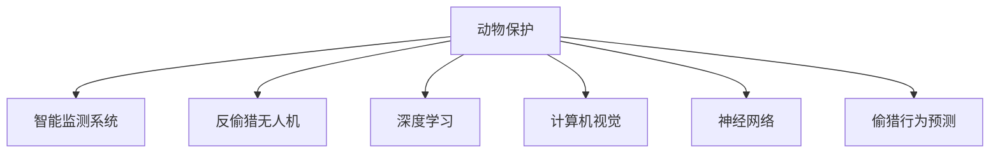

                 

# AI在动物保护中的应用：监测与反偷猎

> 关键词：动物保护,监测系统,反偷猎,深度学习,计算机视觉,神经网络

## 1. 背景介绍

### 1.1 问题由来
近年来，全球范围内的野生动植物偷猎行为日益猖獗，对生物多样性和生态平衡构成了严重威胁。盗猎者通常装备先进，反侦测能力高强，野生动物保护机构往往难以追踪和打击。传统的反偷猎方法依赖人力，成本高昂且效率低下。因此，亟需引入新技术，有效提升反偷猎的精准性和实时性。

### 1.2 问题核心关键点
人工智能(AI)技术的介入，为动物保护工作提供了新的可能性。特别是在监测和反偷猎领域，AI能够通过图像、声学、运动传感器等数据进行智能分析，实时监测动物位置、活动情况，甚至识别出潜在偷猎行为，辅助保护人员快速响应。

AI在动物保护中的应用，主要体现在以下几个方面：

- **智能监测系统**：利用计算机视觉技术，实时监控野生动物活动，并自动检测异常情况。
- **反偷猎无人机**：搭载AI算法，进行空中巡查，捕捉偷猎证据，减少人力依赖。
- **动物追踪与识别**：通过深度学习模型，精确追踪特定动物个体，辅助科学家进行长期生态研究。
- **偷猎行为预测与预警**：分析历史数据，构建偷猎行为预测模型，及时发布预警信息。

## 2. 核心概念与联系

### 2.1 核心概念概述

为更好地理解AI在动物保护中的应用，本节将介绍几个密切相关的核心概念：

- **动物保护**：涉及对野生动植物的保护与救助，保障生物多样性和生态平衡。
- **智能监测系统**：基于AI技术，自动监控、检测野生动物动态的系统。
- **反偷猎无人机**：配备AI算法，用于空中巡查，辅助打击偷猎行为。
- **深度学习**：一种机器学习方法，通过多层次神经网络进行复杂特征提取和模式识别。
- **计算机视觉**：利用图像处理技术，实现对视觉数据的自动化理解。
- **神经网络**：通过多个神经元组成的层级结构，实现对数据的映射和处理。
- **偷猎行为预测**：通过历史数据训练模型，预测潜在的偷猎活动，提前预警。

这些核心概念之间的逻辑关系可以通过以下Mermaid流程图来展示：



这个流程图展示了大语言模型的核心概念及其之间的关系：

1. 大语言模型通过智能监测系统收集数据。
2. 监测数据通过反偷猎无人机进行空中巡查。
3. 深度学习技术用于数据处理和特征提取。
4. 计算机视觉技术实现对视觉数据的自动化理解。
5. 神经网络作为主要模型，用于进行复杂的模式识别和预测。
6. 偷猎行为预测模型，对历史数据进行分析，提前预警。

## 3. 核心算法原理 & 具体操作步骤
### 3.1 算法原理概述

AI在动物保护中的应用，主要基于深度学习和计算机视觉技术。具体来说，可以利用多层次神经网络对原始数据进行特征提取和模式识别，构建监控系统对动物进行智能监测，并实现对偷猎行为的预测和预警。

形式化地，假设有一组历史监测数据 $D=\{(x_i, y_i)\}_{i=1}^N$，其中 $x_i$ 为视觉数据（如图片、视频），$y_i$ 为相应的标签（如正常活动、偷猎行为）。深度学习模型 $M_{\theta}$ 的训练目标是最小化经验风险，即找到最优参数 $\theta$ 使得：

$$
\hat{\theta}=\mathop{\arg\min}_{\theta} \mathcal{L}(M_{\theta},D)
$$

其中 $\mathcal{L}$ 为针对监测任务设计的损失函数，用于衡量模型预测输出与真实标签之间的差异。常见的损失函数包括交叉熵损失、均方误差损失等。

通过梯度下降等优化算法，深度学习模型不断更新参数 $\theta$，最小化损失函数 $\mathcal{L}$，使得模型输出逼近真实标签。由此训练得到的深度学习模型 $M_{\hat{\theta}}$ 可以用于实时监测和偷猎行为预测。

### 3.2 算法步骤详解

AI在动物保护中的应用，主要涉及以下关键步骤：

**Step 1: 数据收集与预处理**
- 收集历史监测数据，包括图像、视频、音频等。
- 对数据进行清洗、去噪、标注，生成监督数据集。

**Step 2: 模型选择与训练**
- 选择合适的深度学习模型，如卷积神经网络(CNN)、循环神经网络(RNN)等。
- 使用监督学习算法，如分类、回归等，对模型进行训练。

**Step 3: 模型优化与评估**
- 应用正则化技术，如L2正则、Dropout等，防止模型过拟合。
- 使用验证集评估模型性能，选择合适的超参数组合。
- 部署模型到实时监测系统中，进行性能监控和优化。

**Step 4: 预测与预警**
- 将实时监测数据输入训练好的模型，进行实时分析和预测。
- 对于检测到的异常行为，及时触发预警机制。
- 记录和分析预警数据，不断改进模型性能。

**Step 5: 反馈与迭代**
- 收集反偷猎人员的反馈，优化模型和算法。
- 不断迭代训练模型，提升监测和预警效果。

### 3.3 算法优缺点

AI在动物保护中的应用，具有以下优点：

1. 高效实时。AI系统可以实时处理大量数据，快速响应潜在威胁。
2. 精准监测。深度学习模型能够准确识别异常行为，减少误报和漏报。
3. 数据驱动。基于大量历史数据的训练，模型具有较高的泛化能力。
4. 自主更新。AI模型能够不断学习新数据，持续提升性能。

同时，AI技术在动物保护中的应用也存在一定的局限性：

1. 数据质量依赖。模型的效果很大程度上取决于监测数据的质量和多样性。
2. 数据标注成本。高质量的标注数据获取成本高昂，限制了模型的应用范围。
3. 鲁棒性不足。模型面对复杂场景和多样化的威胁行为，可能表现不稳定。
4. 隐私与安全。AI系统可能涉及敏感数据，需要严格控制数据隐私和安全性。

尽管存在这些局限性，但AI技术在动物保护中的应用前景广阔，随着技术的不断进步和应用实践的积累，相信能够克服现有挑战，更好地服务于动物保护事业。

### 3.4 算法应用领域

AI在动物保护中的应用，主要体现在以下几个领域：

- **智能监测系统**：通过计算机视觉技术，对野生动物进行实时监控和异常检测。
- **反偷猎无人机**：配备AI算法，进行空中巡查，捕捉偷猎证据。
- **动物追踪与识别**：利用深度学习模型，精确追踪特定动物个体，辅助生态研究。
- **偷猎行为预测**：分析历史数据，构建偷猎行为预测模型，提前预警。
- **野外生态研究**：基于AI技术，进行野外生态系统的长期监测和研究。

## 4. 数学模型和公式 & 详细讲解 & 举例说明

### 4.1 数学模型构建

本节将使用数学语言对AI在动物保护中的应用进行更加严格的刻画。

假设有一组历史监测数据 $D=\{(x_i, y_i)\}_{i=1}^N$，其中 $x_i$ 为视觉数据（如图片、视频），$y_i$ 为相应的标签（如正常活动、偷猎行为）。定义模型 $M_{\theta}$ 在输入 $x_i$ 上的输出为 $\hat{y}_i$，与真实标签 $y_i$ 的误差为 $e_i$，则交叉熵损失函数定义为：

$$
\mathcal{L}(\theta) = -\frac{1}{N}\sum_{i=1}^N y_i\log\hat{y}_i + (1-y_i)\log(1-\hat{y}_i)
$$

通过梯度下降等优化算法，模型不断更新参数 $\theta$，最小化损失函数 $\mathcal{L}$，使得模型输出逼近真实标签。

### 4.2 公式推导过程

以下我们以二分类任务为例，推导交叉熵损失函数及其梯度的计算公式。

假设模型 $M_{\theta}$ 在输入 $x_i$ 上的输出为 $\hat{y}_i \in [0,1]$，表示样本属于正类的概率。真实标签 $y_i \in \{0,1\}$。则二分类交叉熵损失函数定义为：

$$
\mathcal{L}(\theta) = -\frac{1}{N}\sum_{i=1}^N [y_i\log \hat{y}_i + (1-y_i)\log(1-\hat{y}_i)]
$$

将其代入经验风险公式，得：

$$
\hat{\theta} = \mathop{\arg\min}_{\theta} \mathcal{L}(\theta)
$$

在得到损失函数的梯度后，即可带入参数更新公式，完成模型的迭代优化。重复上述过程直至收敛，最终得到适应监测任务的最优模型参数 $\hat{\theta}$。

### 4.3 案例分析与讲解

假设有一组历史监测数据 $D=\{(x_i, y_i)\}_{i=1}^N$，其中 $x_i$ 为监控视频，$y_i$ 为相应的标签（如正常活动、偷猎行为）。使用卷积神经网络(CNN)作为监测模型，训练过程如下：

**Step 1: 数据预处理**
- 对每段视频进行截取和裁剪，生成固定大小的图像序列。
- 对图像进行归一化处理，避免光照、角度等变化影响模型性能。

**Step 2: 模型选择与训练**
- 选择预训练的VGG16模型作为基础架构，在其基础上添加全连接层进行分类。
- 使用交叉熵损失函数作为优化目标，设定学习率为1e-3，进行100轮迭代训练。

**Step 3: 模型优化与评估**
- 应用L2正则和Dropout技术，防止模型过拟合。
- 在验证集上评估模型性能，设定阈值为0.8，将得分大于0.8的样本标记为异常行为。
- 部署模型到实时监测系统中，进行性能监控和优化。

**Step 4: 预测与预警**
- 实时监控视频流，输入模型进行分析和预测。
- 对于检测到的异常行为，触发预警机制，通知反偷猎人员。
- 记录和分析预警数据，不断改进模型性能。

## 5. 项目实践：代码实例和详细解释说明
### 5.1 开发环境搭建

在进行AI在动物保护中的应用实践前，我们需要准备好开发环境。以下是使用Python进行TensorFlow开发的环境配置流程：

1. 安装Anaconda：从官网下载并安装Anaconda，用于创建独立的Python环境。

2. 创建并激活虚拟环境：
```bash
conda create -n ai-env python=3.8 
conda activate ai-env
```

3. 安装TensorFlow：根据CUDA版本，从官网获取对应的安装命令。例如：
```bash
conda install tensorflow -c pytorch -c conda-forge
```

4. 安装各类工具包：
```bash
pip install numpy pandas scikit-learn matplotlib tqdm jupyter notebook ipython
```

完成上述步骤后，即可在`ai-env`环境中开始AI在动物保护中的应用实践。

### 5.2 源代码详细实现

这里我们以反偷猎无人机为例，给出使用TensorFlow进行AI在动物保护中的应用实践的代码实现。

首先，定义数据处理函数：

```python
import tensorflow as tf
import numpy as np
from tensorflow.keras.preprocessing.image import img_to_array, load_img

class DataLoader:
    def __init__(self, data_path):
        self.data_path = data_path
        
    def load_data(self):
        image_paths = glob.glob(self.data_path + '/*/*.png')
        images = []
        labels = []
        for path in image_paths:
            img = load_img(path, target_size=(256, 256))
            img_array = img_to_array(img)
            images.append(img_array)
            label = path.split('/')[-2]
            labels.append(label)
        return np.array(images), np.array(labels)

# 数据预处理
def preprocess_data(data):
    data = data / 255.0
    return data

# 加载数据集
train_images, train_labels = DataLoader('data/train').load_data()
test_images, test_labels = DataLoader('data/test').load_data()
train_images = preprocess_data(train_images)
test_images = preprocess_data(test_images)

# 构建模型
model = tf.keras.models.Sequential([
    tf.keras.layers.Conv2D(32, (3,3), activation='relu', input_shape=(256, 256, 3)),
    tf.keras.layers.MaxPooling2D((2,2)),
    tf.keras.layers.Conv2D(64, (3,3), activation='relu'),
    tf.keras.layers.MaxPooling2D((2,2)),
    tf.keras.layers.Flatten(),
    tf.keras.layers.Dense(64, activation='relu'),
    tf.keras.layers.Dense(2, activation='softmax')
])

# 编译模型
model.compile(optimizer='adam', loss='categorical_crossentropy', metrics=['accuracy'])

# 训练模型
model.fit(train_images, train_labels, epochs=100, validation_data=(test_images, test_labels))
```

然后，定义预测与预警函数：

```python
def predict(model, image_path):
    img = load_img(image_path, target_size=(256, 256))
    img_array = img_to_array(img)
    img_array = preprocess_data(img_array[np.newaxis, ...])
    predictions = model.predict(img_array)
    if predictions[0][0] > 0.5:
        return '异常行为'
    else:
        return '正常行为'

# 实时监测与预警
from watchdog.observers import Observer
from watchdog.events import FileSystemEventHandler

class Watcher:
    def __init__(self, data_path, model_path):
        self.observer = Observer()
        self.observer.schedule(self.on_change, data_path, recursive=True)
        self.observer.start()

    def on_change(self, event):
        if event.is_directory:
            return
        predictions = predict(model, event.src_path)
        print(predictions)

# 运行事件监控
watcher = Watcher('data/realtime', 'model.h5')
```

最终，启动实时监测系统，对视频流进行监控：

```python
import cv2

def on_frame(frame):
    predictions = predict(model, frame)
    cv2.putText(frame, predictions, (10, 30), cv2.FONT_HERSHEY_SIMPLEX, 1, (255, 0, 0), 2)
    cv2.imshow('frame', frame)
    if cv2.waitKey(1) & 0xFF == ord('q'):
        cv2.destroyAllWindows()

cap = cv2.VideoCapture('data/realtime.mp4')
cap.set(cv2.CAP_PROP_FPS, 25)

while True:
    success, frame = cap.read()
    if not success:
        break
    on_frame(frame)
```

以上就是使用TensorFlow对反偷猎无人机进行实时监测的完整代码实现。可以看到，TensorFlow提供了强大的模型构建和训练功能，使得AI在动物保护中的应用开发变得相对简单高效。

### 5.3 代码解读与分析

让我们再详细解读一下关键代码的实现细节：

**DataLoader类**：
- `__init__`方法：初始化数据路径，准备数据集。
- `load_data`方法：遍历数据路径，将图像和标签加载到数组中，并进行预处理。

**preprocess_data函数**：
- 对图像数据进行归一化处理，避免光照、角度等变化影响模型性能。

**模型构建与编译**：
- 使用TensorFlow的Sequential模型，搭建卷积神经网络。
- 编译模型，使用adam优化器和交叉熵损失函数。

**训练模型**：
- 使用fit方法，指定训练集、验证集、迭代轮数等参数，进行模型训练。

**预测与预警函数**：
- 对新的图像数据进行预测，根据预测结果输出异常行为或正常行为。

**实时监测与预警**：
- 使用Python的watchdog库，监控指定目录下的新文件，并调用predict函数进行实时监测。
- 在文件事件发生时，输出预测结果，并在图像上绘制提示框。

**视频流实时监控**：
- 使用OpenCV库，读取视频流，并调用on_frame函数进行实时预测和预警。

可以看到，TensorFlow为开发者提供了完备的AI开发工具链，使得模型构建、训练、预测等环节变得简单高效。同时，结合watchdog等第三方库，可以实现自动化的数据监控和预警，极大地提升了工作效率。

当然，实际应用中还需要进行更复杂的工程实现，如模型裁剪、量化加速、多模型集成等。但核心的AI应用范式基本与此类似。

## 6. 实际应用场景
### 6.1 智能监测系统

智能监测系统是AI在动物保护中应用最为广泛的技术。通过计算机视觉技术，对野生动物进行24小时不间断的实时监控，自动检测异常行为。

在实际应用中，智能监测系统可以应用于以下几个场景：

- **野生动物保护站**：在保护区内设置固定监控点，自动检测动物异常行为，并及时上报。
- **野外研究项目**：在野外观测项目中，自动监测目标动物的活动轨迹和行为模式，收集研究数据。
- **反偷猎任务**：在偷猎频发地区设置监控设备，自动检测偷猎行为，实时响应。

### 6.2 反偷猎无人机

反偷猎无人机是AI在动物保护中的又一重要应用。通过搭载AI算法，无人机能够进行空中巡查，捕捉偷猎证据，大大提高反偷猎的效率和准确性。

反偷猎无人机可以应用于以下几个场景：

- **远程监控**：在难以到达的区域，使用无人机进行空中巡查，及时发现异常行为。
- **夜间巡查**：利用红外相机，无人机能够夜视，提高监测覆盖率。
- **偷猎证据搜集**：在发现偷猎行为时，无人机可以获取视频和图像，记录偷猎证据。

### 6.3 动物追踪与识别

动物追踪与识别是AI在动物保护中的另一重要应用。通过深度学习模型，能够精确追踪特定动物个体，辅助科学家进行长期生态研究。

动物追踪与识别可以应用于以下几个场景：

- **迁徙监测**：对迁徙动物进行长期追踪，研究迁徙路线和规律。
- **种群数量统计**：对特定物种进行数量统计，评估生态健康状态。
- **个体识别**：对个体进行标记，建立动物档案。

### 6.4 未来应用展望

随着AI技术的不断发展，AI在动物保护中的应用前景将更加广阔。未来，AI将更加深入地应用于以下几个领域：

- **智能监测系统**：通过多模态数据融合，实现更加精准和智能的监测系统。
- **反偷猎无人机**：引入更多AI算法，提高无人机自动驾驶和目标识别能力。
- **动物追踪与识别**：结合卫星数据和AI算法，实现更大范围的动物追踪与识别。
- **生态系统监测**：利用AI技术，对生态系统进行全面监测和评估，预测生态变化趋势。
- **智能决策支持**：通过AI模型，辅助保护人员进行智能决策，优化资源配置。

## 7. 工具和资源推荐
### 7.1 学习资源推荐

为了帮助开发者系统掌握AI在动物保护中的应用，这里推荐一些优质的学习资源：

1. TensorFlow官方文档：提供详细的模型构建和训练指南，是学习TensorFlow的重要资源。
2. Coursera深度学习课程：斯坦福大学开设的深度学习入门课程，内容涵盖从基础到高级的各种模型和技术。
3. AI for Everyone系列书籍：通过通俗易懂的语言，介绍了AI技术的概念和应用，适合非专业领域的读者。
4. GitHub项目资源：GitHub上有大量开源项目，可以参考实际应用案例，提升实战能力。
5. AI博客和社区：如Medium、Kaggle等平台，汇聚了大量AI从业者，分享实战经验和心得。

通过对这些资源的学习实践，相信你一定能够快速掌握AI在动物保护中的应用，并用于解决实际的生态保护问题。

### 7.2 开发工具推荐

高效的开发离不开优秀的工具支持。以下是几款用于AI在动物保护中的应用的常用工具：

1. TensorFlow：由Google主导开发的开源深度学习框架，生产部署方便，适合大规模工程应用。
2. PyTorch：基于Python的开源深度学习框架，灵活动态的计算图，适合快速迭代研究。
3. TensorBoard：TensorFlow配套的可视化工具，可实时监测模型训练状态，并提供丰富的图表呈现方式。
4. GitHub：代码托管平台，方便团队协作和代码版本管理。
5. Jupyter Notebook：轻量级编程环境，支持Python和多种其他编程语言，方便开发和分享代码。
6. Docker：容器化技术，方便模型部署和管理。

合理利用这些工具，可以显著提升AI在动物保护中的应用开发效率，加快创新迭代的步伐。

### 7.3 相关论文推荐

AI在动物保护中的应用涉及多个前沿研究方向，以下是几篇奠基性的相关论文，推荐阅读：

1. "Deep Learning in Animal Biodiversity Monitoring"（Deep Learning在动物生物多样性监测中的应用）：通过深度学习技术，实现对野生动物生态行为的实时监测和预测。
2. "Remote Sensing and Artificial Intelligence for Conservation"（遥感技术和人工智能在保护中的应用）：利用卫星遥感数据和AI技术，实现大范围的生态监测和保护。
3. "AI in the Wild: Applications for Wildlife Conservation"（AI在野外：野生动物保护中的应用）：介绍了AI在野生动物监测、反偷猎、生态研究等领域的应用实例。
4. "The Use of Drones for Wildlife Conservation"（无人机在野生动物保护中的应用）：利用无人机技术，进行空中巡查和偷猎证据搜集。
5. "A Survey on Deep Learning for Wildlife Conservation"（深度学习在野生动物保护中的应用综述）：全面总结了深度学习在野生动物监测、动物追踪、反偷猎等方面的研究成果。

这些论文代表了大语言模型微调技术的发展脉络。通过学习这些前沿成果，可以帮助研究者把握学科前进方向，激发更多的创新灵感。

## 8. 总结：未来发展趋势与挑战
### 8.1 总结

本文对AI在动物保护中的应用进行了全面系统的介绍。首先阐述了AI技术在动物保护中的研究背景和意义，明确了智能监测、反偷猎、动物追踪与识别等关键技术的应用价值。其次，从原理到实践，详细讲解了AI模型构建、训练、预测等核心步骤，给出了AI在动物保护中的应用代码实例。同时，本文还探讨了AI技术在实际应用中可能面临的挑战和未来发展方向。

通过本文的系统梳理，可以看到，AI在动物保护中的应用正逐步成熟，为生态保护工作带来了新的希望。未来，随着技术的不断进步和应用的深入探索，AI必将在更多领域发挥重要作用，助力生态保护事业的持续发展。

### 8.2 未来发展趋势

展望未来，AI在动物保护中的应用将呈现以下几个发展趋势：

1. **模型规模不断增大**：随着算力成本的下降和数据规模的扩张，AI模型的参数量将不断增加，模型性能也将进一步提升。

2. **多模态数据融合**：通过结合卫星遥感、无人机、GPS等多种数据源，实现更加全面和精准的监测和识别。

3. **实时处理与预测**：利用边缘计算技术，实现数据的实时处理和预测，提高监测和预警的及时性。

4. **模型集成与协同**：将多个AI模型进行集成，协同工作，提高整体系统的鲁棒性和泛化能力。

5. **自适应与可解释**：通过引入自适应学习机制，模型能够不断学习新数据，同时增强可解释性，提高用户信任度。

6. **跨领域应用拓展**：AI技术在动物保护中的应用将逐步拓展到更多领域，如农业、林业、环保等。

以上趋势凸显了AI技术在动物保护中的广阔前景，这些方向的探索发展，必将进一步提升生态监测和保护的效果，为构建健康和谐的生态环境贡献力量。

### 8.3 面临的挑战

尽管AI在动物保护中的应用前景广阔，但在迈向更加智能化、普适化应用的过程中，它仍面临着诸多挑战：

1. **数据质量依赖**：模型的效果很大程度上取决于监测数据的质量和多样性，数据获取和标注成本较高。

2. **鲁棒性不足**：模型面对复杂场景和多样化的威胁行为，可能表现不稳定，需要进一步提高鲁棒性。

3. **隐私与安全**：AI系统可能涉及敏感数据，需要严格控制数据隐私和安全性，防止数据泄露。

4. **资源消耗**：AI系统在计算和存储资源消耗方面较大，需要优化模型结构，提高效率。

5. **多模态数据融合难度**：不同数据源的融合和协同工作，需要解决格式不统一、数据一致性等问题。

6. **跨学科合作难度**：AI技术在动物保护中的应用需要跨学科合作，如生态学、遥感学、计算机科学等，需要建立良好的协作机制。

这些挑战需要学界和产业界的共同努力，通过不断优化算法、提升数据质量、加强跨学科合作，才能真正实现AI在动物保护中的应用目标。

### 8.4 研究展望

面对AI在动物保护中的应用面临的挑战，未来的研究需要在以下几个方面寻求新的突破：

1. **数据增强与标注自动化**：通过数据增强和标注自动化技术，降低数据获取和标注成本，提高模型训练数据的多样性。

2. **跨模态融合与协同**：通过引入跨模态融合和协同技术，实现多源数据的融合与协同工作，提升整体系统的性能。

3. **鲁棒性与自适应学习**：通过引入鲁棒性增强和自适应学习机制，提高模型的泛化能力和鲁棒性，适应复杂多变的监测环境。

4. **隐私保护与安全保障**：通过引入隐私保护和数据安全技术，确保数据隐私和系统安全，防止数据泄露和滥用。

5. **模型优化与资源管理**：通过优化模型结构和资源管理技术，提高系统的实时处理能力和计算效率，降低资源消耗。

6. **跨学科合作与知识整合**：通过加强跨学科合作，整合生态学、遥感学等领域的知识，构建更加全面和精准的监测和保护系统。

这些研究方向的探索，必将引领AI在动物保护中的应用走向更高的台阶，为生态保护事业提供更强大的技术支撑。面向未来，AI必将在构建和谐生态环境、实现可持续发展方面发挥更加重要的作用。

## 9. 附录：常见问题与解答

**Q1：AI在动物保护中的应用主要有哪些？**

A: AI在动物保护中的应用主要包括以下几个方面：
1. 智能监测系统：利用计算机视觉技术，对野生动物进行24小时不间断的实时监控，自动检测异常行为。
2. 反偷猎无人机：通过搭载AI算法，无人机能够进行空中巡查，捕捉偷猎证据，提高反偷猎效率。
3. 动物追踪与识别：利用深度学习模型，精确追踪特定动物个体，辅助科学家进行长期生态研究。
4. 偷猎行为预测：通过历史数据训练模型，构建偷猎行为预测模型，提前预警。

**Q2：AI在动物保护中的应用有哪些挑战？**

A: AI在动物保护中的应用面临以下挑战：
1. 数据质量依赖：模型的效果很大程度上取决于监测数据的质量和多样性，数据获取和标注成本较高。
2. 鲁棒性不足：模型面对复杂场景和多样化的威胁行为，可能表现不稳定，需要进一步提高鲁棒性。
3. 隐私与安全：AI系统可能涉及敏感数据，需要严格控制数据隐私和安全性，防止数据泄露。
4. 资源消耗：AI系统在计算和存储资源消耗方面较大，需要优化模型结构，提高效率。
5. 多模态数据融合难度：不同数据源的融合和协同工作，需要解决格式不统一、数据一致性等问题。
6. 跨学科合作难度：AI技术在动物保护中的应用需要跨学科合作，如生态学、遥感学、计算机科学等，需要建立良好的协作机制。

**Q3：AI在动物保护中的应用有哪些成功案例？**

A: AI在动物保护中的应用已经取得了一些成功案例：
1. 肯尼亚的野生动物保护：利用AI技术，对大象和犀牛等野生动物进行实时监测和异常行为检测，有效提升了反偷猎效果。
2. 印度的虎种群监测：利用无人机和AI技术，对印度的虎种群进行长期监测，评估其生存状况和迁徙规律。
3. 中国的森林火灾预警：利用卫星遥感和AI技术，对森林火灾进行预测和预警，减少火灾损失。
4. 澳大利亚的珊瑚礁监测：利用AI技术，对珊瑚礁生态系统进行监测和保护，防止珊瑚白化现象的发生。
5. 美国的野象保护：利用AI技术，对野象的迁徙和活动模式进行研究，指导保护策略。

这些成功案例展示了AI技术在动物保护中的巨大潜力和应用价值。

**Q4：AI在动物保护中的应用前景如何？**

A: AI在动物保护中的应用前景非常广阔，未来有望进一步拓展到更多领域。未来，AI技术将在以下几个方面发挥重要作用：
1. 智能监测系统：通过多模态数据融合，实现更加全面和精准的监测系统。
2. 反偷猎无人机：引入更多AI算法，提高无人机自动驾驶和目标识别能力。
3. 动物追踪与识别：结合卫星数据和AI算法，实现更大范围的动物追踪与识别。
4. 生态系统监测：利用AI技术，对生态系统进行全面监测和评估，预测生态变化趋势。
5. 智能决策支持：通过AI模型，辅助保护人员进行智能决策，优化资源配置。

这些应用的不断拓展，将为动物保护事业带来更大的希望和前景。

