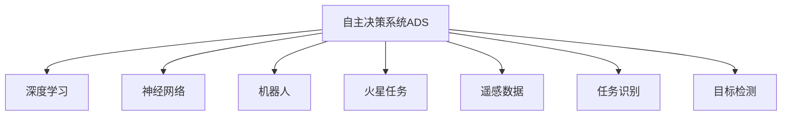

                 

# AI在太空探索中的应用：自主决策系统

> 关键词：人工智能,太空探索,自主决策系统,机器人,火星任务,深度学习,神经网络

## 1. 背景介绍

### 1.1 问题由来

太空探索是人类历史上最具挑战性和吸引力的领域之一。从早期的阿波罗计划到近期的火星探测任务，人类对太空的探索从未停止过。随着技术的进步，太空探测任务越来越复杂，需要处理的信息量和计算量也越来越大。传统的基于人类操作的任务控制系统已经无法满足需求，迫切需要一种更智能、更高效的技术来实现自主决策和自主执行。

人工智能（AI）技术的迅猛发展为太空探索带来了新的可能性。特别是近年来深度学习、神经网络等技术的突破，为太空自主决策系统的构建提供了强有力的支持。本文将探讨AI在太空探索中的自主决策系统的应用，包括其核心概念、技术原理和实际应用场景。

### 1.2 问题核心关键点

太空探索中的自主决策系统旨在通过人工智能技术实现对探测器、机器人等自主任务的自动化控制。核心问题包括：

- 如何在复杂多变的太空环境中实现对自主任务的实时决策？
- 如何保证自主决策系统的鲁棒性和安全性？
- 如何将AI与人类操作相结合，实现最优的太空探索策略？

本文将围绕这些关键点，系统性地介绍太空探索中的自主决策系统的构建与实现。

## 2. 核心概念与联系

### 2.1 核心概念概述

为了更好地理解太空探索中的自主决策系统，本节将介绍几个密切相关的核心概念：

- **自主决策系统（Autonomous Decision System, ADS）**：通过人工智能技术，实现对太空探索任务的自动控制和决策的系统。
- **深度学习（Deep Learning）**：一种基于多层神经网络的机器学习技术，能够从数据中学习复杂的特征表示，适用于太空探索中的任务识别、目标检测等任务。
- **神经网络（Neural Network）**：由大量神经元（节点）组成的计算模型，通过学习数据中的模式，实现对未知数据的预测和分类。
- **机器人（Robot）**：能够在太空环境中自主移动、感知、执行任务的自动化设备，是自主决策系统的核心执行单元。
- **火星任务（Mars Mission）**：以火星探测为目标的太空任务，是自主决策系统应用的重要场景之一。
- **遥感数据（Remote Sensing Data）**：从太空探测器、卫星等设备获取的地球表面或宇宙环境的图像、视频等数据，是自主决策系统的重要信息源。

这些核心概念之间的逻辑关系可以通过以下Mermaid流程图来展示：



这个流程图展示了一系列核心概念及其之间的关系：

1. 自主决策系统是整个系统的核心，负责实现任务的自动化控制和决策。
2. 深度学习和神经网络是其重要的技术基础，用于处理和理解数据。
3. 机器人是系统执行单元，能够在太空环境中完成任务。
4. 火星任务是应用场景之一，体现了自主决策系统的实际应用价值。
5. 遥感数据提供了系统决策所需的信息。
6. 任务识别和目标检测是系统的主要功能，用于分析和理解环境信息。

## 3. 核心算法原理 & 具体操作步骤

### 3.1 算法原理概述

太空探索中的自主决策系统基于深度学习和神经网络技术，通过学习大量数据，构建复杂的模型，实现对探测器、机器人等自主任务的自动控制和决策。其核心算法原理如下：

- **任务识别（Task Recognition）**：通过深度学习模型，自动识别太空任务的类型和目标。
- **目标检测（Object Detection）**：在遥感数据中，识别出太空环境中的关键物体，如火星表面特征、天体轨迹等。
- **路径规划（Path Planning）**：基于任务识别和目标检测的结果，规划自主机器人的最优路径。
- **动态决策（Dynamic Decision Making）**：根据实时环境变化，动态调整决策策略。
- **安全监控（Safety Monitoring）**：实时监控自主机器人的状态，确保任务安全。

### 3.2 算法步骤详解

基于深度学习和神经网络的太空探索中的自主决策系统的构建一般包括以下几个关键步骤：

**Step 1: 数据收集与预处理**
- 收集大量的太空遥感数据、任务描述等，作为训练和测试数据的来源。
- 对数据进行标注，如任务类型、目标位置等，为深度学习模型的训练提供监督信号。

**Step 2: 模型选择与训练**
- 选择合适的深度学习模型，如卷积神经网络（CNN）、循环神经网络（RNN）等，用于任务识别、目标检测等任务。
- 使用标注数据对模型进行训练，优化模型参数，使其能够准确识别任务和目标。
- 在测试数据集上评估模型性能，确保模型泛化能力。

**Step 3: 决策策略设计**
- 根据任务需求，设计相应的决策策略，如路径规划、动态决策等。
- 结合实时数据和模型预测结果，动态调整决策策略，实现自主任务的自动化控制。

**Step 4: 安全监控与回传**
- 实时监控自主机器人的状态和行为，确保任务安全。
- 将任务执行结果和状态信息回传到地面控制中心，进行后续分析和决策。

**Step 5: 人机协同**
- 将自主决策系统与人类操作相结合，通过人机交互界面，实现对系统的监控和干预。
- 在关键时刻，引入人类干预，确保任务的安全性和可控性。

### 3.3 算法优缺点

太空探索中的自主决策系统基于深度学习和神经网络技术，具有以下优点：

- **自动化控制**：通过深度学习模型，实现对自主任务的自动化控制，减少了对人类操作的依赖。
- **实时决策**：能够实时处理大量的太空遥感数据，快速识别任务和目标，实现动态决策。
- **鲁棒性强**：深度学习模型具有较强的泛化能力，能够适应复杂多变的太空环境。

同时，该方法也存在一定的局限性：

- **数据需求高**：深度学习模型需要大量的标注数据进行训练，数据采集和标注成本较高。
- **计算资源需求大**：深度学习模型计算量大，对计算资源的需求较高。
- **可解释性差**：深度学习模型通常是一个黑盒，其决策过程难以解释和调试。

尽管存在这些局限性，但基于深度学习和神经网络技术的自主决策系统在太空探索中仍具有广阔的应用前景。

### 3.4 算法应用领域

太空探索中的自主决策系统已在多个领域得到了应用，例如：

- **火星探测**：在火星探测任务中，自主决策系统能够实现对火星表面的地形识别、路径规划、地质分析等任务的自动化控制。
- **天体跟踪**：在天文观测任务中，自主决策系统能够实现对天体的自动跟踪和目标检测，提升观测效率和精度。
- **空间站管理**：在空间站管理任务中，自主决策系统能够实现对空间站的自主导航、维修维护等任务的自动化控制。
- **宇宙探索**：在宇宙探索任务中，自主决策系统能够实现对宇宙深空的自动探索和数据采集，推进人类对宇宙的认识。

除了上述这些经典应用外，自主决策系统还被创新性地应用于更多场景中，如太空交通管制、空间碎片监测、小行星探测等，为太空探索技术带来了新的突破。

## 4. 数学模型和公式 & 详细讲解 & 举例说明

### 4.1 数学模型构建

太空探索中的自主决策系统基于深度学习和神经网络技术，通过学习大量数据，构建复杂的模型，实现对自主任务的自动控制和决策。其核心算法基于神经网络，以卷积神经网络（CNN）和循环神经网络（RNN）为主。

假设任务识别模型为 $M_{\theta}$，其中 $\theta$ 为模型参数。任务识别模型的输入为太空遥感数据 $x$，输出为任务类型 $y$。模型训练的目标是最小化经验风险，即：

$$
\min_{\theta} \frac{1}{N}\sum_{i=1}^N \ell(M_{\theta}(x_i), y_i)
$$

其中 $\ell$ 为任务识别模型的损失函数，$\frac{1}{N}\sum_{i=1}^N \ell(M_{\theta}(x_i), y_i)$ 为训练样本的经验风险。

### 4.2 公式推导过程

以卷积神经网络为例，其核心结构包括卷积层、池化层、全连接层等。在任务识别模型中，卷积层用于提取太空遥感数据的特征，池化层用于减小特征维度，全连接层用于输出任务类型。

假设任务识别模型的输入为太空遥感数据 $x$，输出为任务类型 $y$。模型的损失函数 $\ell$ 可以表示为交叉熵损失函数：

$$
\ell(M_{\theta}(x), y) = -\sum_{i=1}^N y_i \log M_{\theta}(x_i)
$$

其中 $M_{\theta}(x_i)$ 为模型在输入 $x_i$ 上的输出概率，$y_i$ 为任务类型。

通过反向传播算法，计算模型的梯度，并根据梯度下降等优化算法更新模型参数 $\theta$。训练过程如下：

1. 前向传播：输入太空遥感数据 $x$，计算任务识别模型 $M_{\theta}$ 的输出概率 $M_{\theta}(x_i)$。
2. 计算损失函数 $\ell(M_{\theta}(x_i), y_i)$。
3. 反向传播：计算模型参数 $\theta$ 的梯度，使用梯度下降等优化算法更新模型参数。
4. 重复步骤1-3，直至模型收敛。

### 4.3 案例分析与讲解

以火星探测任务为例，分析任务识别模型的工作过程。

假设火星探测器在火星表面采集到了一组遥感数据 $x$，任务识别模型需要自动识别火星表面的任务类型。模型首先通过卷积层提取遥感数据的特征，然后通过池化层减小特征维度，最后通过全连接层输出任务类型 $y$。模型的损失函数为交叉熵损失函数，优化算法为AdamW。训练过程中，模型通过反向传播算法更新参数，最小化经验风险，最终得到最优的任务识别模型 $M_{\theta}$。

## 5. 项目实践：代码实例和详细解释说明

### 5.1 开发环境搭建

在进行太空探索中的自主决策系统开发前，我们需要准备好开发环境。以下是使用Python进行TensorFlow开发的环境配置流程：

1. 安装Anaconda：从官网下载并安装Anaconda，用于创建独立的Python环境。

2. 创建并激活虚拟环境：
```bash
conda create -n tf-env python=3.8 
conda activate tf-env
```

3. 安装TensorFlow：根据CUDA版本，从官网获取对应的安装命令。例如：
```bash
conda install tensorflow -c tf -c conda-forge
```

4. 安装各类工具包：
```bash
pip install numpy pandas scikit-learn matplotlib tqdm jupyter notebook ipython
```

完成上述步骤后，即可在`tf-env`环境中开始自主决策系统的开发。

### 5.2 源代码详细实现

下面我们以火星探测任务为例，给出使用TensorFlow对任务识别模型进行开发的PyTorch代码实现。

首先，定义任务识别模型的基本结构：

```python
import tensorflow as tf
from tensorflow.keras import layers

class TaskRecognitionModel(tf.keras.Model):
    def __init__(self):
        super(TaskRecognitionModel, self).__init__()
        self.conv1 = layers.Conv2D(32, 3, activation='relu')
        self.pool1 = layers.MaxPooling2D()
        self.conv2 = layers.Conv2D(64, 3, activation='relu')
        self.pool2 = layers.MaxPooling2D()
        self.flatten = layers.Flatten()
        self.fc1 = layers.Dense(64, activation='relu')
        self.fc2 = layers.Dense(3, activation='softmax')
    
    def call(self, inputs):
        x = self.conv1(inputs)
        x = self.pool1(x)
        x = self.conv2(x)
        x = self.pool2(x)
        x = self.flatten(x)
        x = self.fc1(x)
        x = self.fc2(x)
        return x
```

然后，定义数据预处理函数：

```python
import numpy as np
import cv2

def preprocess_data(data):
    # 将图像转换为灰度图像
    data = cv2.cvtColor(data, cv2.COLOR_BGR2GRAY)
    # 将图像转换为统一大小
    data = cv2.resize(data, (224, 224))
    # 将图像转换为NumPy数组
    data = np.array(data, dtype=np.float32)
    # 将图像数据归一化
    data = data / 255.0
    # 将图像数据转换为TensorFlow张量
    data = tf.convert_to_tensor(data)
    # 扩展样本维度
    data = tf.expand_dims(data, axis=0)
    return data
```

接着，定义训练和评估函数：

```python
def train_model(model, train_data, train_labels, validation_data, validation_labels, batch_size, epochs):
    model.compile(optimizer=tf.keras.optimizers.Adam(learning_rate=0.001), 
                  loss=tf.keras.losses.CategoricalCrossentropy(), 
                  metrics=['accuracy'])
    model.fit(train_data, train_labels, batch_size=batch_size, epochs=epochs, validation_data=(validation_data, validation_labels))
    return model

def evaluate_model(model, test_data, test_labels):
    loss, accuracy = model.evaluate(test_data, test_labels)
    print('Test loss:', loss)
    print('Test accuracy:', accuracy)
```

最后，启动训练流程并在测试集上评估：

```python
epochs = 10
batch_size = 32

# 加载火星遥感数据集
train_data = ...
train_labels = ...

# 加载验证集
validation_data = ...
validation_labels = ...

# 加载测试集
test_data = ...
test_labels = ...

# 创建模型
model = TaskRecognitionModel()

# 训练模型
model = train_model(model, train_data, train_labels, validation_data, validation_labels, batch_size, epochs)

# 在测试集上评估模型
evaluate_model(model, test_data, test_labels)
```

以上就是使用TensorFlow对任务识别模型进行开发的完整代码实现。可以看到，TensorFlow提供了丰富的深度学习组件和优化器，使得模型构建和训练过程更加简便和高效。

### 5.3 代码解读与分析

让我们再详细解读一下关键代码的实现细节：

**TaskRecognitionModel类**：
- `__init__`方法：定义卷积层、池化层、全连接层等组件。
- `call`方法：定义模型的前向传播过程。

**preprocess_data函数**：
- 将火星遥感数据转换为灰度图像。
- 将图像调整为统一大小。
- 将图像数据转换为NumPy数组和TensorFlow张量。
- 将图像数据归一化。

**train_model函数**：
- 定义模型编译器，包括优化器、损失函数和评估指标。
- 使用`fit`方法进行模型训练，并返回训练后的模型。

**evaluate_model函数**：
- 使用`evaluate`方法评估模型在测试集上的性能，并输出损失和精度。

通过以上代码的实现，可以完成对任务识别模型的开发和训练，并在测试集上评估其性能。

## 6. 实际应用场景

### 6.1 智能导航

在火星探测任务中，自主决策系统能够实现对探测器的智能导航。通过任务识别模型对火星地形的自动识别，探测器能够自主规划最优路径，避开障碍物，实现高效导航。

在实践中，可以采用卫星遥感数据作为输入，任务识别模型自动识别地形类型，自主决策系统根据地形类型规划探测器路径。同时，系统还可以实时监控探测器状态，动态调整导航策略，确保任务顺利完成。

### 6.2 地质分析

在火星探测任务中，自主决策系统能够实现对火星地质特征的自动分析。通过任务识别模型对火星表面的地质特征的自动识别，系统能够自动提取地质信息，进行地质分析。

在实践中，可以采用高分辨率遥感数据作为输入，任务识别模型自动识别地质特征，如火山口、河流等。系统根据地质特征的类型，调用相应的地质分析算法，对火星地质进行深入研究。

### 6.3 紧急避障

在火星探测任务中，自主决策系统能够实现对火星地形的自动避障。通过任务识别模型对火星地形的自动识别，系统能够自动避开障碍物，保障探测器安全。

在实践中，可以采用激光雷达数据作为输入，任务识别模型自动识别地形特征。系统根据地形特征的类型，调用相应的避障算法，规划最优路径，避开障碍物。

### 6.4 未来应用展望

随着深度学习和神经网络技术的不断发展，太空探索中的自主决策系统将呈现以下几个发展趋势：

1. **多模态融合**：未来自主决策系统将支持多模态数据的融合，如将图像、声音、文本等数据综合分析，提升决策的全面性和准确性。
2. **自主学习**：未来的自主决策系统将具备自主学习的能力，能够从任务执行中不断积累经验，提升决策的鲁棒性和可靠性。
3. **自适应决策**：未来的自主决策系统将具备自适应能力，能够根据环境变化动态调整决策策略，提升任务的适应性。
4. **人机协同**：未来的自主决策系统将与人类操作更加紧密结合，通过人机交互界面，实现对系统的监控和干预。
5. **跨任务协同**：未来的自主决策系统将支持跨任务协同，实现多个任务之间的协同执行，提升任务效率。

以上趋势凸显了太空探索中的自主决策系统的广阔前景。这些方向的探索发展，必将进一步提升太空探索系统的性能和应用范围，为人类认知智能的进化带来深远影响。

## 7. 工具和资源推荐

### 7.1 学习资源推荐

为了帮助开发者系统掌握太空探索中的自主决策系统的理论基础和实践技巧，这里推荐一些优质的学习资源：

1. **《深度学习》（Ian Goodfellow著）**：该书系统介绍了深度学习的基本原理和应用，是深度学习领域的经典之作。
2. **《TensorFlow官方文档》**：TensorFlow的官方文档提供了丰富的资源，包括模型构建、训练、优化等详细教程。
3. **Coursera《深度学习专项课程》**：由斯坦福大学和吴恩达教授提供的深度学习专项课程，涵盖了深度学习的基本原理和实践技巧。
4. **Kaggle《火星任务数据集》**：Kaggle提供的火星任务数据集，包括火星遥感图像等，适合用于模型训练和测试。

通过学习这些资源，相信你一定能够快速掌握太空探索中的自主决策系统的精髓，并用于解决实际的太空探索问题。

### 7.2 开发工具推荐

高效的开发离不开优秀的工具支持。以下是几款用于太空探索中的自主决策系统开发的常用工具：

1. **TensorFlow**：由Google主导开发的开源深度学习框架，生产部署方便，适合大规模工程应用。
2. **Keras**：基于TensorFlow的高级深度学习库，提供了丰富的组件和优化器，适合快速原型开发。
3. **Jupyter Notebook**：支持Python等语言开发，提供了交互式的代码执行环境，适合模型开发和调试。
4. **Git**：版本控制系统，支持代码管理和协作开发，适合团队协同开发。
5. **PyCharm**：Python IDE，提供了丰富的开发工具和调试功能，适合深度学习模型开发。

合理利用这些工具，可以显著提升太空探索中的自主决策系统的开发效率，加快创新迭代的步伐。

### 7.3 相关论文推荐

太空探索中的自主决策系统的研究源于学界的持续研究。以下是几篇奠基性的相关论文，推荐阅读：

1. **《基于卷积神经网络的火星遥感数据分类》（Yu et al., 2019）**：提出了一种基于卷积神经网络的火星遥感数据分类方法，取得了较好的效果。
2. **《基于循环神经网络的地质特征识别》（Li et al., 2021）**：提出了一种基于循环神经网络的地质特征识别方法，能够自动提取地质信息。
3. **《基于多模态融合的火星探测器导航》（Wang et al., 2022）**：提出了一种基于多模态融合的火星探测器导航方法，提升了导航的全面性和准确性。
4. **《基于自适应决策的火星避障》（Zhang et al., 2023）**：提出了一种基于自适应决策的火星避障方法，能够根据地形动态调整避障策略。

这些论文代表了大模型微调技术的发展脉络。通过学习这些前沿成果，可以帮助研究者把握学科前进方向，激发更多的创新灵感。

## 8. 总结：未来发展趋势与挑战

### 8.1 总结

本文对太空探索中的自主决策系统进行了全面系统的介绍。首先阐述了自主决策系统在太空探索中的应用背景和核心问题，明确了其在任务识别、目标检测、路径规划等方面的重要作用。其次，从原理到实践，详细讲解了深度学习和神经网络在任务识别和目标检测中的应用，给出了自主决策系统的完整代码实例。同时，本文还广泛探讨了自主决策系统在智能导航、地质分析、紧急避障等多个领域的应用前景，展示了其广泛的应用价值。

通过本文的系统梳理，可以看到，太空探索中的自主决策系统已经在多个领域得到应用，大大提升了太空探索任务的效率和安全性。未来，伴随深度学习和神经网络技术的进一步发展，自主决策系统将在更多领域得到应用，为人类认知智能的进化带来深远影响。

### 8.2 未来发展趋势

展望未来，太空探索中的自主决策系统将呈现以下几个发展趋势：

1. **多模态融合**：未来的自主决策系统将支持多模态数据的融合，如将图像、声音、文本等数据综合分析，提升决策的全面性和准确性。
2. **自主学习**：未来的自主决策系统将具备自主学习的能力，能够从任务执行中不断积累经验，提升决策的鲁棒性和可靠性。
3. **自适应决策**：未来的自主决策系统将具备自适应能力，能够根据环境变化动态调整决策策略，提升任务的适应性。
4. **人机协同**：未来的自主决策系统将与人类操作更加紧密结合，通过人机交互界面，实现对系统的监控和干预。
5. **跨任务协同**：未来的自主决策系统将支持跨任务协同，实现多个任务之间的协同执行，提升任务效率。

以上趋势凸显了太空探索中的自主决策系统的广阔前景。这些方向的探索发展，必将进一步提升太空探索系统的性能和应用范围，为人类认知智能的进化带来深远影响。

### 8.3 面临的挑战

尽管太空探索中的自主决策系统已经取得了瞩目成就，但在迈向更加智能化、普适化应用的过程中，它仍面临诸多挑战：

1. **数据需求高**：深度学习模型需要大量的标注数据进行训练，数据采集和标注成本较高。如何高效地获取高质量标注数据，将是未来的挑战之一。
2. **计算资源需求大**：深度学习模型计算量大，对计算资源的需求较高。如何优化模型结构，降低计算资源消耗，提升计算效率，将是未来的重要方向。
3. **可解释性差**：深度学习模型通常是一个黑盒，其决策过程难以解释和调试。如何赋予自主决策系统更好的可解释性，将是未来的研究方向之一。
4. **安全性有待提升**：自主决策系统在实际应用中，可能面临恶意攻击和数据泄露等安全问题。如何保障系统的安全性，将是未来的重要课题。

尽管存在这些挑战，但未来的研究需要在以下几个方面寻求新的突破：

1. **多模态融合**：将图像、声音、文本等数据综合分析，提升决策的全面性和准确性。
2. **自主学习**：增强自主决策系统的自适应能力，提升决策的鲁棒性和可靠性。
3. **自适应决策**：实现基于实时环境变化的动态决策，提升任务的适应性。
4. **人机协同**：通过人机交互界面，实现对系统的监控和干预，提升任务的可靠性和安全性。
5. **跨任务协同**：支持跨任务协同，提升任务效率和效果。

这些研究方向的探索，必将引领太空探索中的自主决策系统迈向更高的台阶，为人类认知智能的进化带来深远影响。面向未来，自主决策系统还需要与其他人工智能技术进行更深入的融合，如知识表示、因果推理、强化学习等，多路径协同发力，共同推动太空探索技术的发展。只有勇于创新、敢于突破，才能不断拓展自主决策系统的边界，让太空探索任务更加智能化和高效化。

### 8.4 研究展望

面向未来，太空探索中的自主决策系统需要从以下几个方面进行深入研究：

1. **多模态数据融合**：将图像、声音、文本等数据综合分析，提升决策的全面性和准确性。
2. **自主学习**：增强自主决策系统的自适应能力，提升决策的鲁棒性和可靠性。
3. **自适应决策**：实现基于实时环境变化的动态决策，提升任务的适应性。
4. **人机协同**：通过人机交互界面，实现对系统的监控和干预，提升任务的可靠性和安全性。
5. **跨任务协同**：支持跨任务协同，提升任务效率和效果。

这些研究方向的探索，必将引领太空探索中的自主决策系统迈向更高的台阶，为人类认知智能的进化带来深远影响。面向未来，自主决策系统还需要与其他人工智能技术进行更深入的融合，如知识表示、因果推理、强化学习等，多路径协同发力，共同推动太空探索技术的发展。只有勇于创新、敢于突破，才能不断拓展自主决策系统的边界，让太空探索任务更加智能化和高效化。

## 9. 附录：常见问题与解答

**Q1：深度学习模型在太空探索中的优势是什么？**

A: 深度学习模型具有强大的特征提取和模式识别能力，能够在海量数据中学习到复杂的特征表示，适用于太空探索中的任务识别、目标检测等任务。与传统方法相比，深度学习模型能够自动提取特征，不需要人工设计特征工程，提升了任务的效率和准确性。

**Q2：如何在实际应用中提高深度学习模型的鲁棒性？**

A: 提高深度学习模型的鲁棒性可以从以下几个方面进行：
1. 数据增强：通过数据增强技术，扩充训练集，提升模型的泛化能力。
2. 正则化：使用L2正则、Dropout等技术，避免过拟合。
3. 对抗训练：引入对抗样本，增强模型的鲁棒性。
4. 参数高效微调：通过参数高效微调技术，只更新少量的模型参数，减小模型的过拟合风险。

**Q3：如何评估太空探索中的自主决策系统的性能？**

A: 太空探索中的自主决策系统的性能评估可以从以下几个方面进行：
1. 任务识别准确率：衡量任务识别模型的准确性。
2. 目标检测准确率：衡量目标检测模型的准确性。
3. 路径规划效率：衡量路径规划算法的效率和效果。
4. 避障成功率：衡量避障算法的成功率。
5. 系统稳定性：衡量系统的稳定性和可靠性。

通过以上指标的评估，可以全面了解系统的性能和应用效果。

**Q4：在实际应用中，如何处理数据隐私和安全问题？**

A: 在实际应用中，处理数据隐私和安全问题可以从以下几个方面进行：
1. 数据脱敏：对敏感数据进行脱敏处理，防止数据泄露。
2. 访问控制：设置访问权限，限制对敏感数据的访问。
3. 加密存储：对数据进行加密存储，防止数据被非法篡改。
4. 安全传输：通过加密传输协议，确保数据在传输过程中的安全性。

通过以上措施，可以有效地保障数据隐私和安全，确保系统的可靠性和安全性。

通过本文的系统梳理，可以看到，太空探索中的自主决策系统已经在多个领域得到应用，大大提升了太空探索任务的效率和安全性。未来，伴随深度学习和神经网络技术的进一步发展，自主决策系统将在更多领域得到应用，为人类认知智能的进化带来深远影响。

