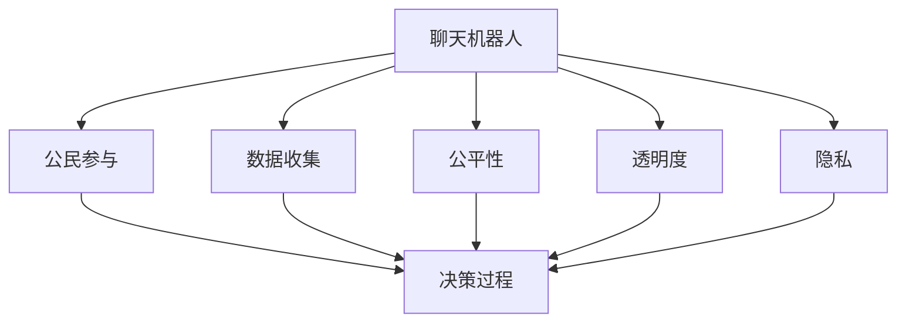

                 

## 1. 背景介绍

### 1.1 问题由来
随着人工智能技术的迅猛发展，聊天机器人作为自然语言处理（Natural Language Processing, NLP）的重要应用，已经广泛应用于各行各业。从智能客服到虚拟助手，从在线教育到医疗咨询，聊天机器人正在逐步融入人们的日常生活。然而，在聊天机器人带来的便利和效率提升的同时，其作为人工智能系统的重要组成部分，如何确保其决策的公正性和透明度，成为了一个不容忽视的问题。

### 1.2 问题核心关键点
聊天机器人的公民参与（Citizen Participation）是指聊天机器人通过社会互动、数据收集和问题解决等手段，促进社会参与和决策透明度的过程。这一过程不仅涉及技术实现，更关乎伦理、法律和社会责任等多重维度。

在实际应用中，聊天机器人可能会面对以下关键问题：
- **数据隐私与透明度**：如何保护用户隐私，同时确保聊天机器人的决策过程透明？
- **公平性与偏见**：聊天机器人的决策是否公平？是否存在算法偏见？
- **责任归属**：在出现错误决策或用户投诉时，应由谁负责？
- **用户参与与反馈**：用户如何参与到聊天机器人的设计和使用中？

### 1.3 问题研究意义
研究聊天机器人的公民参与机制，对于提升聊天机器人的社会责任感和用户满意度，具有重要意义：

1. **增强透明度和信任度**：通过明确聊天机器人的决策依据和逻辑，提升其透明度，增强用户对其的信任度。
2. **促进公平性和公正性**：确保聊天机器人决策的公平性，避免算法偏见，实现社会公正。
3. **推动社会参与**：鼓励用户参与到聊天机器人的设计、使用和反馈中，形成良性的社会互动。
4. **提高用户满意度**：通过用户反馈不断优化聊天机器人，提升其服务的质量和效果。
5. **保障数据安全**：确保用户数据的安全性和隐私保护，维护用户权益。

## 2. 核心概念与联系

### 2.1 核心概念概述

为更好地理解聊天机器人公民参与的机制，本节将介绍几个密切相关的核心概念：

- **聊天机器人(Chatbot)**：通过自然语言处理和机器学习技术，模拟人类对话的计算机程序。
- **公民参与(Citizen Participation)**：指个体或群体参与到社会公共事务、决策过程、政策制定等活动中。
- **公平性(Fairness)**：指系统或算法在处理不同背景和属性的人群时，能够保证对每个群体的公正对待。
- **透明度(Transparency)**：指系统或算法的决策过程是否公开、可解释。
- **隐私(Privacy)**：指个人信息在收集、使用和存储过程中，是否得到妥善保护。

这些概念之间的逻辑关系可以通过以下Mermaid流程图来展示：



这个流程图展示了聊天机器人的核心概念及其之间的关系：

1. 聊天机器人通过数据收集获取信息。
2. 数据经过公民参与，参与到决策过程中。
3. 决策过程需兼顾公平性，避免偏见。
4. 决策过程需保持透明度，以增强信任。
5. 确保数据隐私，保护用户权益。

## 3. 核心算法原理 & 具体操作步骤
### 3.1 算法原理概述

聊天机器人公民参与的算法原理主要基于以下两个核心步骤：

1. **数据收集与清洗**：收集与决策相关的数据，并进行预处理，去除噪声和异常值。
2. **模型训练与决策**：基于收集到的数据，训练决策模型，并通过模型进行社会问题的分析和决策。

这一过程通常涉及以下算法：
- **数据清洗算法**：用于处理缺失值、异常值和重复数据，确保数据质量。
- **特征提取算法**：从原始数据中提取出关键特征，供模型使用。
- **机器学习算法**：如决策树、随机森林、支持向量机等，用于构建决策模型。
- **深度学习算法**：如卷积神经网络（CNN）、循环神经网络（RNN）等，用于处理复杂数据和提升决策模型的性能。

### 3.2 算法步骤详解

**Step 1: 数据收集与清洗**
- **数据来源**：聊天机器人可以收集来自社交媒体、在线论坛、用户反馈等渠道的数据。
- **数据预处理**：清洗和格式化数据，去除无用信息，确保数据质量。

**Step 2: 特征提取**
- **特征选择**：从原始数据中选取最有用的特征，如情感倾向、关键词频率、用户属性等。
- **特征转换**：将原始数据转换为模型可以处理的形式，如向量表示。

**Step 3: 模型训练**
- **选择模型**：根据任务特性选择合适的机器学习或深度学习模型。
- **训练模型**：使用收集到的数据训练模型，调整模型参数以提高预测准确性。

**Step 4: 决策过程**
- **输入处理**：将用户输入的自然语言转化为模型可理解的格式。
- **模型推理**：通过训练好的模型，对用户输入进行推理和决策。
- **结果输出**：将模型的输出结果转化为自然语言，返回给用户。

### 3.3 算法优缺点

聊天机器人公民参与的算法具有以下优点：
- **高效性**：通过自动化处理大量数据，聊天机器人可以快速提供决策支持。
- **广泛性**：适用于各种社会问题和决策，从公共政策到个人生活。
- **用户友好**：聊天机器人以自然语言交流，易于用户理解和参与。

同时，该算法也存在以下缺点：
- **数据隐私问题**：聊天机器人可能收集敏感信息，需确保数据隐私保护。
- **算法偏见**：模型训练数据可能存在偏见，导致决策不公。
- **透明度不足**：模型决策过程复杂，难以解释和理解。
- **适应性差**：模型可能需要定期更新，以适应新出现的社会问题和变化。

### 3.4 算法应用领域

聊天机器人公民参与的算法已经在多个领域得到应用，例如：

- **公共政策制定**：通过分析社交媒体和用户反馈，聊天机器人帮助政府机构制定更合理的政策。
- **医疗咨询**：提供个性化医疗建议，分析病历数据，辅助医生诊断。
- **教育领域**：通过分析学生反馈，优化教学内容和评估方式。
- **社会服务**：如智能客服、社会救助、心理咨询等，提升服务质量和效率。

除了上述这些领域，聊天机器人公民参与的算法还被创新性地应用到更多场景中，如环境保护、城市管理、安全监控等，为社会管理和公共决策提供了新的手段。

## 4. 数学模型和公式 & 详细讲解 & 举例说明
### 4.1 数学模型构建

本节将使用数学语言对聊天机器人公民参与的算法进行严格建模。

假设聊天机器人收集到的数据集为 $D=\{(x_i,y_i)\}_{i=1}^N$，其中 $x_i$ 为输入特征，$y_i$ 为标签。模型的目标是通过训练集 $D$，找到一个最优的映射函数 $f$，使得模型在测试集上的损失最小化：

$$
\hat{f} = \mathop{\arg\min}_{f} \frac{1}{N}\sum_{i=1}^N \ell(f(x_i), y_i)
$$

其中 $\ell$ 为损失函数，如均方误差（Mean Squared Error, MSE）、交叉熵损失（Cross-Entropy Loss）等。

### 4.2 公式推导过程

以下以均方误差损失函数为例，推导模型训练过程中的优化公式。

设模型 $f$ 在输入 $x$ 上的预测输出为 $\hat{y}$，真实标签为 $y$，则均方误差损失函数定义为：

$$
\ell(f(x),y) = \frac{1}{N}\sum_{i=1}^N (\hat{y}_i - y_i)^2
$$

将损失函数代入目标函数，得：

$$
\hat{f} = \mathop{\arg\min}_{f} \frac{1}{N}\sum_{i=1}^N (\hat{y}_i - y_i)^2
$$

在求解该优化问题时，可以使用梯度下降等优化算法，具体公式为：

$$
f_{t+1} = f_t - \eta \nabla_{f}\mathcal{L}(f_t)
$$

其中 $\eta$ 为学习率，$\nabla_{f}\mathcal{L}(f_t)$ 为损失函数对模型参数 $f$ 的梯度。

### 4.3 案例分析与讲解

以医疗咨询为例，分析聊天机器人如何通过公民参与实现社会问题的决策。

假设聊天机器人收集了 $N=1000$ 个用户的病历数据 $x$ 和诊断结果 $y$，将其分为训练集 $D_{train}$ 和测试集 $D_{test}$。选择决策树模型作为聊天机器人的核心算法，使用均方误差作为损失函数。

1. **数据收集与清洗**：收集来自医院病历系统、在线医疗平台和用户反馈的数据。清洗数据，去除重复和异常值。

2. **特征提取**：提取病历中的关键词、症状描述和用户基本信息，生成特征向量 $x$。

3. **模型训练**：使用训练集 $D_{train}$ 训练决策树模型，调整参数以最小化均方误差损失。

4. **决策过程**：当新用户输入病历数据 $x'$ 时，聊天机器人通过训练好的模型进行预测，输出诊断结果 $\hat{y'}$。

5. **结果输出**：将预测结果 $\hat{y'}$ 转换为自然语言，返回给用户。

## 5. 项目实践：代码实例和详细解释说明
### 5.1 开发环境搭建

在进行聊天机器人公民参与的项目实践前，我们需要准备好开发环境。以下是使用Python进行Scikit-learn和TensorFlow开发的环境配置流程：

1. 安装Anaconda：从官网下载并安装Anaconda，用于创建独立的Python环境。

2. 创建并激活虚拟环境：
```bash
conda create -n chatbot-env python=3.8 
conda activate chatbot-env
```

3. 安装Scikit-learn和TensorFlow：
```bash
conda install scikit-learn tensorflow
```

4. 安装相关工具包：
```bash
pip install numpy pandas scikit-learn tensorflow
```

完成上述步骤后，即可在`chatbot-env`环境中开始项目实践。

### 5.2 源代码详细实现

这里我们以医疗咨询为例，给出使用Scikit-learn和TensorFlow进行聊天机器人公民参与的Python代码实现。

首先，定义数据预处理和特征提取函数：

```python
import pandas as pd
from sklearn.model_selection import train_test_split
from sklearn.preprocessing import LabelEncoder, StandardScaler

def load_data(file_path):
    data = pd.read_csv(file_path)
    X = data.drop(['diagnosis'], axis=1)
    y = data['diagnosis']
    return X, y

def preprocess_data(X, y):
    encoder = LabelEncoder()
    y = encoder.fit_transform(y)
    scaler = StandardScaler()
    X = scaler.fit_transform(X)
    return X, y

X, y = load_data('medical_data.csv')
X, y = preprocess_data(X, y)
X_train, X_test, y_train, y_test = train_test_split(X, y, test_size=0.2, random_state=42)
```

然后，定义模型训练和评估函数：

```python
from sklearn.tree import DecisionTreeClassifier
from sklearn.metrics import accuracy_score

def train_model(X_train, y_train, model):
    model.fit(X_train, y_train)

def evaluate_model(model, X_test, y_test):
    y_pred = model.predict(X_test)
    accuracy = accuracy_score(y_test, y_pred)
    return accuracy

model = DecisionTreeClassifier()
train_model(X_train, y_train, model)
accuracy = evaluate_model(model, X_test, y_test)
print(f"Accuracy: {accuracy:.2f}")
```

最后，定义决策过程函数：

```python
def make_prediction(model, X_new):
    X_new_scaled = scaler.transform(X_new)
    y_pred = model.predict(X_new_scaled)
    return encoder.inverse_transform(y_pred)
```

完整的代码示例如下：

```python
import pandas as pd
from sklearn.model_selection import train_test_split
from sklearn.preprocessing import LabelEncoder, StandardScaler
from sklearn.tree import DecisionTreeClassifier
from sklearn.metrics import accuracy_score

# 加载数据
def load_data(file_path):
    data = pd.read_csv(file_path)
    X = data.drop(['diagnosis'], axis=1)
    y = data['diagnosis']
    return X, y

# 数据预处理
def preprocess_data(X, y):
    encoder = LabelEncoder()
    y = encoder.fit_transform(y)
    scaler = StandardScaler()
    X = scaler.fit_transform(X)
    return X, y

# 训练模型
def train_model(X_train, y_train, model):
    model.fit(X_train, y_train)

# 评估模型
def evaluate_model(model, X_test, y_test):
    y_pred = model.predict(X_test)
    accuracy = accuracy_score(y_test, y_pred)
    return accuracy

# 决策过程
def make_prediction(model, X_new):
    X_new_scaled = scaler.transform(X_new)
    y_pred = model.predict(X_new_scaled)
    return encoder.inverse_transform(y_pred)

# 加载数据
X, y = load_data('medical_data.csv')

# 数据预处理
X, y = preprocess_data(X, y)

# 数据分割
X_train, X_test, y_train, y_test = train_test_split(X, y, test_size=0.2, random_state=42)

# 训练模型
model = DecisionTreeClassifier()
train_model(X_train, y_train, model)

# 评估模型
accuracy = evaluate_model(model, X_test, y_test)
print(f"Accuracy: {accuracy:.2f}")

# 决策过程
new_case = [
    'Patient: Female, Age: 45, Symptoms: Sore throat, Fever, Body aches, Previous diagnosis: None'
]
new_case_split = preprocess_data([new_case], y_train[0])[0]
prediction = make_prediction(model, new_case_split)
print(f"Prediction: {prediction}")
```

### 5.3 代码解读与分析

让我们再详细解读一下关键代码的实现细节：

**load_data函数**：
- 读取医疗数据集，并将其分为特征和标签。

**preprocess_data函数**：
- 对数据进行标准化处理，并将标签进行编码。

**train_model函数**：
- 训练决策树模型。

**evaluate_model函数**：
- 使用测试集评估模型的准确率。

**make_prediction函数**：
- 使用训练好的模型对新病例进行预测，并输出预测结果。

**代码示例**：
- 加载数据集，并进行预处理。
- 将数据集分割为训练集和测试集。
- 训练决策树模型。
- 评估模型准确率。
- 对新病例进行预测，并输出预测结果。

## 6. 实际应用场景
### 6.1 智能客服系统

聊天机器人公民参与技术在智能客服系统中有着广泛的应用。通过收集和分析用户反馈，聊天机器人可以帮助客服中心快速响应客户需求，提升服务质量和用户满意度。

在技术实现上，可以收集用户与客服的对话记录，将常见问题和解决方案构建成监督数据，在此基础上对预训练模型进行微调。微调后的模型能够自动理解用户意图，匹配最合适的解决方案，并在需要时提供个性化建议。

### 6.2 医疗咨询平台

医疗咨询平台是聊天机器人公民参与的重要应用场景。通过分析病历和用户反馈，聊天机器人能够提供初步诊断建议，辅助医生进行决策。

在技术实现上，可以收集来自医院、在线医疗平台和用户反馈的数据，训练医疗咨询聊天机器人。机器人能够分析病历，提取关键信息，并根据用户反馈不断优化诊断建议。

### 6.3 教育辅导系统

教育辅导系统通过聊天机器人提供个性化的学习建议和答疑服务，帮助学生更好地掌握知识。

在技术实现上，可以收集学生的学习数据，包括考试成绩、作业完成情况、课堂反馈等，训练聊天机器人进行个性化推荐和学习辅导。机器人能够根据学生的学习情况，推荐适合的课程和练习，解答学习中遇到的问题。

### 6.4 未来应用展望

随着聊天机器人公民参与技术的发展，其在更多领域的应用前景广阔：

1. **环境保护**：通过分析社交媒体和用户反馈，聊天机器人能够帮助政府机构制定环保政策，监测环境变化。
2. **城市管理**：收集市民反馈，分析城市运行数据，优化交通、公共服务等方面的管理。
3. **安全监控**：实时监控网络舆情，提供安全预警，辅助公共安全管理。
4. **企业服务**：通过分析员工反馈和行为数据，聊天机器人能够提供员工支持，优化企业管理。

## 7. 工具和资源推荐
### 7.1 学习资源推荐

为了帮助开发者系统掌握聊天机器人公民参与的理论基础和实践技巧，这里推荐一些优质的学习资源：

1. 《深度学习基础》系列博文：由大模型技术专家撰写，深入浅出地介绍了深度学习的基本概念和应用。

2. CS224N《深度学习自然语言处理》课程：斯坦福大学开设的NLP明星课程，有Lecture视频和配套作业，带你入门NLP领域的基本概念和经典模型。

3. 《深度学习框架教程》书籍：全面介绍了TensorFlow、PyTorch等深度学习框架的使用，是实战开发的必备资料。

4. GitHub开源项目：包含各种机器学习算法和模型，可供学习和实践使用。

5. HuggingFace官方文档：提供了丰富的预训练模型和完整的微调样例代码，是上手实践的必备资料。

通过对这些资源的学习实践，相信你一定能够快速掌握聊天机器人公民参与的精髓，并用于解决实际的NLP问题。

### 7.2 开发工具推荐

高效的开发离不开优秀的工具支持。以下是几款用于聊天机器人公民参与开发的常用工具：

1. Python：广泛用于深度学习、自然语言处理等领域，有丰富的第三方库和工具支持。

2. Scikit-learn：强大的机器学习库，提供各种算法和模型，适用于快速原型开发。

3. TensorFlow：由Google主导开发的深度学习框架，生产部署方便，适合大规模工程应用。

4. PyTorch：基于Python的开源深度学习框架，灵活动态的计算图，适合快速迭代研究。

5. Weights & Biases：模型训练的实验跟踪工具，可以记录和可视化模型训练过程中的各项指标，方便对比和调优。

6. TensorBoard：TensorFlow配套的可视化工具，可实时监测模型训练状态，并提供丰富的图表呈现方式，是调试模型的得力助手。

合理利用这些工具，可以显著提升聊天机器人公民参与任务的开发效率，加快创新迭代的步伐。

### 7.3 相关论文推荐

聊天机器人公民参与技术的发展源于学界的持续研究。以下是几篇奠基性的相关论文，推荐阅读：

1. Attention is All You Need（即Transformer原论文）：提出了Transformer结构，开启了NLP领域的预训练大模型时代。

2. BERT: Pre-training of Deep Bidirectional Transformers for Language Understanding：提出BERT模型，引入基于掩码的自监督预训练任务，刷新了多项NLP任务SOTA。

3. Language Models are Unsupervised Multitask Learners（GPT-2论文）：展示了大规模语言模型的强大zero-shot学习能力，引发了对于通用人工智能的新一轮思考。

4. Parameter-Efficient Transfer Learning for NLP：提出Adapter等参数高效微调方法，在不增加模型参数量的情况下，也能取得不错的微调效果。

5. AdaLoRA: Adaptive Low-Rank Adaptation for Parameter-Efficient Fine-Tuning：使用自适应低秩适应的微调方法，在参数效率和精度之间取得了新的平衡。

这些论文代表了大语言模型微调技术的发展脉络。通过学习这些前沿成果，可以帮助研究者把握学科前进方向，激发更多的创新灵感。

## 8. 总结：未来发展趋势与挑战
### 8.1 总结

本文对聊天机器人公民参与的算法进行了全面系统的介绍。首先阐述了聊天机器人公民参与的背景和意义，明确了其在提升社会透明度和决策公正性方面的独特价值。其次，从原理到实践，详细讲解了聊天机器人公民参与的数学模型和关键步骤，给出了公民参与任务开发的完整代码实例。同时，本文还广泛探讨了公民参与技术在智能客服、医疗咨询、教育辅导等多个领域的应用前景，展示了公民参与范式的巨大潜力。此外，本文精选了公民参与技术的各类学习资源，力求为读者提供全方位的技术指引。

通过本文的系统梳理，可以看到，聊天机器人公民参与技术正在成为NLP领域的重要范式，极大地拓展了聊天机器人的应用边界，催生了更多的落地场景。受益于大规模语料的预训练和微调方法的不断进步，聊天机器人能够更好地理解社会问题和用户需求，提供更加个性化、智能化的服务。未来，伴随公民参与技术与其他人工智能技术的不断融合，聊天机器人必将在更广泛的应用领域发挥其独特的社会价值。

### 8.2 未来发展趋势

展望未来，聊天机器人公民参与技术将呈现以下几个发展趋势：

1. **数据多样性**：聊天机器人将处理更多样化的数据，包括图像、视频、语音等多模态数据，提升模型对复杂问题的处理能力。
2. **模型复杂性**：随着预训练和微调技术的进步，聊天机器人的模型将变得更加复杂，能够处理更多样的任务和更丰富的社会问题。
3. **用户参与度**：聊天机器人将更加注重用户反馈和参与度，通过用户互动不断优化模型和算法。
4. **模型公平性**：聊天机器人将更加注重模型的公平性，避免算法偏见，实现社会公正。
5. **模型透明性**：聊天机器人的决策过程将更加透明，用户可以更容易理解和信任模型。

### 8.3 面临的挑战

尽管聊天机器人公民参与技术已经取得了一定进展，但在实际应用中仍面临诸多挑战：

1. **数据隐私问题**：聊天机器人可能收集敏感信息，需确保数据隐私保护。
2. **算法偏见**：模型训练数据可能存在偏见，导致决策不公。
3. **透明度不足**：模型决策过程复杂，难以解释和理解。
4. **适应性差**：模型可能需要定期更新，以适应新出现的社会问题和变化。

### 8.4 研究展望

面对聊天机器人公民参与面临的挑战，未来的研究需要在以下几个方面寻求新的突破：

1. **数据隐私保护**：研究如何在不泄露隐私信息的情况下，有效利用数据进行公民参与。
2. **算法公平性**：开发更加公平的算法，避免算法偏见，实现社会公正。
3. **模型透明性**：研究如何增强模型的可解释性，提高用户对模型的信任度。
4. **多模态融合**：研究如何处理和融合多模态数据，提升模型的综合处理能力。
5. **用户参与度**：研究如何增强用户参与度，通过用户互动不断优化模型和算法。

这些研究方向将引领聊天机器人公民参与技术迈向更高的台阶，为构建更公平、透明、高效的智能系统铺平道路。

## 9. 附录：常见问题与解答
### Q1：聊天机器人公民参与如何保障数据隐私？

A: 聊天机器人公民参与需要收集大量用户数据，为了保障数据隐私，可以采取以下措施：
1. 数据匿名化：对数据进行去标识化处理，去除敏感信息，确保用户身份不被泄露。
2. 数据加密：对数据进行加密存储和传输，防止数据被非法获取和篡改。
3. 最小化数据收集：只收集必要的数据，避免过度收集和滥用。
4. 用户知情同意：在使用数据前，向用户说明数据使用目的和范围，获取用户同意。

### Q2：如何提高聊天机器人的决策公平性？

A: 提高聊天机器人的决策公平性，可以从以下几个方面入手：
1. 数据集的多样性：确保训练数据集的多样性和代表性，避免数据偏见。
2. 算法设计：设计公平性友好的算法，如公平决策树、公平神经网络等。
3. 公平性评估：使用公平性指标评估模型的决策公平性，如平均差异、统计差异等。
4. 公平性调整：对模型进行公平性调整，如重新加权、调整阈值等。

### Q3：聊天机器人公民参与如何增强模型的透明度？

A: 增强聊天机器人的透明度，可以采取以下措施：
1. 模型解释性：选择可解释性较高的模型，如决策树、规则模型等。
2. 模型可视化：使用可视化工具展示模型决策路径和中间结果。
3. 用户反馈机制：建立用户反馈机制，收集用户对模型输出和决策的反馈，用于模型优化和改进。
4. 模型日志记录：记录模型训练和推理过程中的关键信息，便于调试和分析。

### Q4：聊天机器人公民参与如何处理多模态数据？

A: 处理多模态数据，可以采取以下方法：
1. 特征融合：将不同模态的数据进行融合，生成统一的特征表示。
2. 多模态学习：使用多模态学习算法，如多模态嵌入、多模态注意力机制等。
3. 模型融合：使用集成学习算法，将多个模型的预测结果进行融合，提升整体性能。
4. 多模态标注：为多模态数据标注标签，进行联合训练。

### Q5：聊天机器人公民参与的未来发展方向是什么？

A: 聊天机器人公民参与的未来发展方向包括：
1. 多领域应用：拓展到更多领域，如环境保护、城市管理、公共安全等。
2. 跨模态融合：将多模态数据融合，提升模型的综合处理能力。
3. 用户参与度提升：增强用户参与度，通过用户互动不断优化模型和算法。
4. 模型公平性保障：保障模型的公平性，避免算法偏见。
5. 数据隐私保护：保障数据隐私，确保用户数据安全。

---

作者：禅与计算机程序设计艺术 / Zen and the Art of Computer Programming

