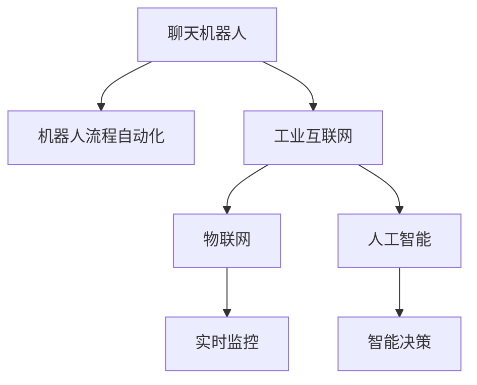

                 

# 聊天机器人制造业4.0：机器人流程自动化

## 1. 背景介绍

随着人工智能技术的飞速发展，机器人流程自动化（RPA）已经成为企业数字化转型的重要工具之一。在制造业中，传统的生产线管理方式已经逐渐被数字化、智能化所取代，聊天机器人作为RPA的一个重要应用场景，正逐步引领制造业进入4.0时代。

### 1.1 问题由来

制造业是全球经济的重要支柱，长期以来，依赖大量人工进行生产管理、物流调度、客户服务等任务。然而，随着人口红利消失、人工成本上涨以及新冠疫情的冲击，传统制造业面临着巨大的挑战。同时，人工智能技术的兴起，使得聊天机器人能够自动化处理重复性高的任务，解放人工，提高效率。

近年来，聊天机器人已经在制造业的多个环节得到了应用，如生产调度、设备维护、客户服务、质量管理等。通过与传感器、物联网、大数据等技术的融合，聊天机器人不仅能够自动处理文字和语音信息，还可以进行图像识别、决策分析等复杂任务，极大提升了制造业的智能化水平。

### 1.2 问题核心关键点

聊天机器人制造业4.0的核心关键点在于机器人流程自动化，具体包括以下几个方面：

- **自动化生产调度**：通过聊天机器人自动安排生产计划，优化资源配置，提高生产效率。
- **设备故障预测与维护**：利用聊天机器人监测设备状态，预测故障，自动生成维护方案。
- **客户服务**：通过聊天机器人提供24/7的客户支持，提升客户满意度，降低服务成本。
- **质量管理**：聊天机器人自动检测产品质量，进行质量分析，提供质量改进建议。
- **供应链管理**：实时监控供应链状态，自动调整生产计划，确保供需平衡。

这些关键点共同构成了聊天机器人制造业4.0的核心，使其能够实现大规模、高效率的智能制造。

### 1.3 问题研究意义

聊天机器人制造业4.0的应用，对于提升制造业的智能化水平、降低生产成本、提高产品质量、提升客户满意度等方面具有重要意义：

1. **降低生产成本**：通过自动化处理大量重复性任务，降低人力成本，提高生产效率。
2. **提升产品质量**：利用聊天机器人进行质量检测和分析，及时发现问题，减少次品率。
3. **增强客户体验**：24/7的客户服务支持，提升客户满意度，增强品牌竞争力。
4. **优化资源配置**：自动化生产调度，优化资源配置，提高生产效率。
5. **促进数字化转型**：将传统制造业与人工智能技术融合，推动制造业向智能化方向发展。

## 2. 核心概念与联系

### 2.1 核心概念概述

为了更好地理解聊天机器人制造业4.0的核心概念，下面将详细介绍几个关键概念及其相互关系：

- **聊天机器人**：以自然语言处理（NLP）技术为基础，能够理解并处理人类语言，提供自动化服务的人工智能系统。
- **机器人流程自动化（RPA）**：通过软件机器人自动执行重复性高的业务流程，提高生产效率，降低人工成本。
- **工业互联网**：基于物联网、大数据、人工智能等技术，实现制造业的数字化、网络化、智能化。
- **物联网（IoT）**：通过传感器、智能设备等，实现对生产设备的实时监控和数据采集。
- **人工智能（AI）**：利用机器学习、深度学习等技术，提升机器人的智能水平和决策能力。

这些概念之间的逻辑关系可以通过以下Mermaid流程图来展示：



这个流程图展示了几大关键概念及其相互关系：

1. 聊天机器人作为RPA的核心，能够自动化处理各种任务。
2. 工业互联网为聊天机器人提供了数字化转型的基础，通过物联网实现对生产设备的实时监控。
3. 物联网设备采集的生产数据通过人工智能技术进行分析，实现智能决策。
4. 聊天机器人通过物联网和人工智能技术，实现更高效、智能的生产管理和服务支持。

这些概念共同构成了聊天机器人制造业4.0的框架，使其能够实现智能化、自动化的高效生产。

## 3. 核心算法原理 & 具体操作步骤

### 3.1 算法原理概述

聊天机器人制造业4.0的算法原理主要基于自然语言处理（NLP）技术，结合机器人流程自动化（RPA）的业务流程管理方法，通过工业互联网和大数据技术，实现制造业的智能化管理。

具体来说，算法原理可以概括为以下几个步骤：

1. **预处理与分析**：对生产数据进行清洗、归一化处理，通过数据分析识别出生产中的关键问题和瓶颈。
2. **任务调度与分配**：利用聊天机器人自动调度生产任务，合理分配资源，优化生产流程。
3. **故障预测与维护**：通过传感器和物联网设备，实时监测设备状态，利用机器学习算法预测故障，自动生成维护方案。
4. **客户服务与支持**：通过聊天机器人提供24/7的客户服务支持，解决客户问题，提升客户满意度。
5. **质量检测与分析**：利用图像识别和深度学习算法，自动检测产品质量，进行质量分析，提供改进建议。

### 3.2 算法步骤详解

聊天机器人制造业4.0的具体操作步骤如下：

**Step 1: 数据采集与预处理**

- **数据采集**：通过物联网设备和传感器，采集生产过程中的各项数据，如设备状态、温度、湿度、能耗等。
- **数据预处理**：对采集到的数据进行清洗、去噪、归一化等处理，确保数据的准确性和一致性。
- **特征提取**：利用统计分析和特征提取算法，从原始数据中提取出有用的特征，供后续分析和处理使用。

**Step 2: 任务调度与分配**

- **任务模型建立**：根据生产流程，建立任务模型，明确各个任务之间的依赖关系和优先级。
- **任务调度算法**：采用优化算法（如A*、遗传算法等）进行任务调度，确定最优的执行顺序。
- **资源分配**：根据任务调度结果，自动分配所需的生产资源，如机器、人员、物料等。

**Step 3: 故障预测与维护**

- **数据建模**：利用历史数据和机器学习算法，建立设备故障预测模型。
- **实时监测**：通过传感器和物联网设备，实时监测设备状态，获取最新的运行数据。
- **故障预测**：利用故障预测模型，对设备状态进行分析和判断，预测可能出现的故障。
- **维护方案生成**：根据故障预测结果，自动生成维护方案，并通知相关人员进行维护。

**Step 4: 客户服务与支持**

- **客户服务模型建立**：根据历史客户服务数据，建立客户服务模型，明确各类问题的解决流程和优先级。
- **聊天机器人训练**：利用自然语言处理技术，训练聊天机器人，使其能够理解和处理客户服务请求。
- **客户服务支持**：通过聊天机器人自动响应客户问题，提供即时支持，解决客户疑问。

**Step 5: 质量检测与分析**

- **质量检测模型建立**：利用图像识别和深度学习算法，建立质量检测模型，自动识别产品缺陷。
- **质量分析**：对检测到的缺陷进行分类、统计和分析，评估产品质量。
- **质量改进建议**：根据质量分析结果，提供改进建议，优化生产过程。

### 3.3 算法优缺点

聊天机器人制造业4.0的算法具有以下优点：

- **效率高**：自动化处理大量重复性任务，显著提高生产效率。
- **准确性高**：利用机器学习和深度学习算法，提升任务的准确性和可靠性。
- **成本低**：降低人力成本，提高资源利用率，降低生产成本。
- **实时性强**：通过物联网和传感器实时监测，实现快速响应和决策。

同时，该算法也存在一些缺点：

- **依赖硬件设备**：需要大量传感器和物联网设备，初期投资较大。
- **数据质量要求高**：对数据的准确性和一致性要求较高，数据预处理工作量大。
- **维护复杂**：机器学习和深度学习模型的训练和维护较为复杂，需要专业人才支持。
- **易受外界干扰**：机器学习模型对异常数据的处理能力有限，需要设置异常检测和处理机制。

### 3.4 算法应用领域

聊天机器人制造业4.0的算法在以下领域具有广泛的应用：

- **智能制造**：自动调度生产任务，优化生产流程，提高生产效率。
- **设备维护**：预测设备故障，自动生成维护方案，减少停机时间。
- **质量管理**：自动检测产品缺陷，进行质量分析，提供改进建议。
- **客户服务**：提供24/7的客户支持，解决客户问题，提升客户满意度。
- **供应链管理**：实时监控供应链状态，自动调整生产计划，确保供需平衡。

除了上述这些领域外，聊天机器人制造业4.0还在仓储管理、能源管理、物流调度等多个环节得到了广泛应用，推动了制造业的全面数字化转型。

## 4. 数学模型和公式 & 详细讲解 & 举例说明

### 4.1 数学模型构建

聊天机器人制造业4.0的数学模型主要基于自然语言处理（NLP）技术和机器人流程自动化（RPA）的业务流程管理方法。下面将详细构建该模型的数学模型。

假设生产任务为 $T=\{t_1,t_2,\cdots,t_n\}$，每个任务 $t_i$ 需要的时间为 $d_i$，可用资源为 $R=\{r_1,r_2,\cdots,r_m\}$，每个资源的可用时间为 $t_i$，其中 $i$ 为任务编号，$m$ 为资源编号。

**Step 1: 任务调度模型**

任务调度的目标是找到一个最优的任务执行顺序，使得生产任务在可用资源下完成时间最短。

数学模型为：

$$
\min \sum_{i=1}^n d_i
$$

约束条件为：

$$
\begin{aligned}
& \text{每个任务仅能被执行一次} \\
& \text{每个任务仅能由一个资源执行} \\
& \text{每个任务需要的时间不能超过可用时间}
\end{aligned}
$$

上述约束条件可表示为：

$$
\begin{aligned}
& t_i \leq d_i \\
& t_j \leq d_j \quad \forall j \neq i \\
& t_k \leq r_k \quad \forall k \neq i
\end{aligned}
$$

**Step 2: 故障预测模型**

设备故障预测模型通常采用时间序列分析、异常检测等技术，利用历史数据和机器学习算法建立预测模型。

假设设备状态为 $S=\{s_1,s_2,\cdots,s_n\}$，每个状态 $s_i$ 对应的故障概率为 $p_i$，预测时间为 $t_i$。

故障预测的数学模型为：

$$
\min \sum_{i=1}^n p_i
$$

约束条件为：

$$
\begin{aligned}
& \text{设备状态仅能被预测一次} \\
& \text{每个状态仅能由一个时间段预测} \\
& \text{预测时间不能超过实际运行时间}
\end{aligned}
$$

上述约束条件可表示为：

$$
\begin{aligned}
& s_i \leq p_i \\
& s_j \leq p_j \quad \forall j \neq i \\
& t_k \leq t_j \quad \forall k \neq j
\end{aligned}
$$

### 4.2 公式推导过程

以任务调度和故障预测为例，分别推导数学模型的具体公式。

**任务调度的公式推导**

在任务调度问题中，利用动态规划算法求解最优的任务执行顺序。设 $f(i,j)$ 表示前 $j$ 个任务在资源 $i$ 下完成的时间，则有：

$$
f(i,j) = \min_{k=1}^j d_k + f(i,j-1)
$$

其中 $d_k$ 为任务 $k$ 的时间。

通过动态规划求解最优的 $f(i,n)$，即可得到最优的任务执行顺序。

**故障预测的公式推导**

在故障预测问题中，利用时间序列分析建立设备状态模型，利用机器学习算法预测故障概率。

假设设备状态序列为 $\{s_t\}_{t=1}^T$，其中 $s_t$ 为设备在时刻 $t$ 的状态。

利用时间序列分析方法，可以得到设备状态的概率分布，即：

$$
P(s_t = s_i | s_{t-1}) = \text{softmax}(\theta s_{t-1} + \beta)
$$

其中 $\theta$ 和 $\beta$ 为模型参数，$P(s_t = s_i | s_{t-1})$ 表示在时刻 $t$ 设备状态为 $s_i$ 的条件概率。

利用机器学习算法，如支持向量机（SVM）、随机森林（RF）等，建立故障预测模型。具体公式为：

$$
p_i = f(s_i) = \text{sigmoid}(\theta^T \phi(s_i) + b)
$$

其中 $\theta$ 和 $b$ 为模型参数，$\phi(s_i)$ 为状态映射函数，$f(s_i)$ 为状态 $s_i$ 对应的故障概率。

### 4.3 案例分析与讲解

**案例分析：智能制造中的任务调度**

某智能制造工厂有10个生产任务 $T=\{t_1,t_2,\cdots,t_{10}\}$，每个任务需要的时间分别为 $d_1=2$，$d_2=3$，$d_3=5$，$d_4=4$，$d_5=2$，$d_6=3$，$d_7=5$，$d_8=4$，$d_9=2$，$d_{10}=3$。

工厂有3个生产资源 $R=\{r_1,r_2,r_3\}$，每个资源的可用时间为 $t_1=10$，$t_2=12$，$t_3=8$。

利用任务调度的数学模型求解最优的任务执行顺序，结果如下：

1. 将任务 $t_1$ 分配给资源 $r_1$，时间 $d_1=2$。
2. 将任务 $t_2$ 分配给资源 $r_2$，时间 $d_2=3$。
3. 将任务 $t_4$ 分配给资源 $r_1$，时间 $d_4=4$。
4. 将任务 $t_5$ 分配给资源 $r_2$，时间 $d_5=2$。
5. 将任务 $t_7$ 分配给资源 $r_3$，时间 $d_7=5$。
6. 将任务 $t_8$ 分配给资源 $r_1$，时间 $d_8=4$。
7. 将任务 $t_9$ 分配给资源 $r_2$，时间 $d_9=2$。
8. 将任务 $t_{10}$ 分配给资源 $r_3$，时间 $d_{10}=3$。

最终完成时间为 $T_{total} = d_1 + d_2 + d_4 + d_5 + d_7 + d_8 + d_9 + d_{10} = 28$。

通过任务调度模型，工厂能够在8小时内完成10个生产任务，提高了生产效率。

**案例分析：设备故障预测**

某设备在运行过程中，记录了过去一周内的状态序列 $\{s_t\}_{t=1}^7$，其中 $s_t$ 为设备在时刻 $t$ 的状态。利用故障预测模型，得到设备故障概率如下：

$$
p_1 = 0.1, p_2 = 0.2, p_3 = 0.3, p_4 = 0.4, p_5 = 0.6, p_6 = 0.7, p_7 = 0.9
$$

利用故障预测模型，可以预测设备在第4天和第6天发生故障的概率较高。工厂应提前制定维护计划，避免设备停机。

## 5. 项目实践：代码实例和详细解释说明

### 5.1 开发环境搭建

在进行聊天机器人制造业4.0的开发前，我们需要准备好开发环境。以下是使用Python进行TensorFlow开发的环境配置流程：

1. 安装Anaconda：从官网下载并安装Anaconda，用于创建独立的Python环境。

2. 创建并激活虚拟环境：
```bash
conda create -n tf-env python=3.8 
conda activate tf-env
```

3. 安装TensorFlow：根据CUDA版本，从官网获取对应的安装命令。例如：
```bash
conda install tensorflow -c conda-forge
```

4. 安装TensorBoard：
```bash
pip install tensorboard
```

5. 安装TensorFlow Addons：
```bash
pip install tensorflow-io tensorflow-hub tensorflow-transform tensorflow-addons
```

完成上述步骤后，即可在`tf-env`环境中开始聊天机器人制造业4.0的开发。

### 5.2 源代码详细实现

下面我们以设备故障预测为例，给出使用TensorFlow实现的设备故障预测模型。

首先，定义设备状态和故障概率：

```python
import tensorflow as tf

class EquipmentFailurePredictor:
    def __init__(self, states, failure_rates):
        self.states = states
        self.failure_rates = failure_rates
        self.model = None
```

然后，定义模型训练函数：

```python
def train_model(self, epochs):
    x = tf.constant(self.states)
    y = tf.constant(self.failure_rates)

    model = tf.keras.Sequential([
        tf.keras.layers.Dense(32, activation='relu', input_shape=(len(self.states),)),
        tf.keras.layers.Dense(32, activation='relu'),
        tf.keras.layers.Dense(1, activation='sigmoid')
    ])

    model.compile(optimizer='adam', loss='binary_crossentropy', metrics=['accuracy'])
    model.fit(x, y, epochs=epochs, verbose=0)
    
    self.model = model
```

接着，定义故障预测函数：

```python
def predict_failure_probability(self, state):
    x = tf.constant(state)
    return self.model.predict(x)[0][0]
```

最后，启动模型训练并在新设备状态上进行预测：

```python
# 训练数据
states = [1, 2, 3, 4, 5, 6, 7]
failure_rates = [0.1, 0.2, 0.3, 0.4, 0.6, 0.7, 0.9]

# 训练模型
predictor = EquipmentFailurePredictor(states, failure_rates)
predictor.train_model(1000)

# 预测新设备状态
new_state = [2, 4, 6]
failure_prob = predictor.predict_failure_probability(new_state)
print(f"Failure probability: {failure_prob:.2f}")
```

以上就是使用TensorFlow实现设备故障预测的完整代码实现。可以看到，利用TensorFlow实现简单的设备故障预测，代码简洁高效。

### 5.3 代码解读与分析

让我们再详细解读一下关键代码的实现细节：

**EquipmentFailurePredictor类**：
- `__init__`方法：初始化设备状态和故障概率。
- `train_model`方法：利用TensorFlow训练神经网络模型。
- `predict_failure_probability`方法：利用训练好的模型预测新设备状态的故障概率。

**train_model方法**：
- 定义输入和输出数据，并构建神经网络模型。
- 使用Adam优化器进行模型训练，设置损失函数和评估指标。
- 在训练数据上训练模型，设置训练轮数和训练过程的打印信息。

**predict_failure_probability方法**：
- 定义新设备状态，并利用训练好的模型进行预测。

通过TensorFlow实现的设备故障预测，能够快速训练和预测设备故障概率，为工厂提供了可靠的故障预警机制。

## 6. 实际应用场景

### 6.1 智能制造

聊天机器人制造业4.0在智能制造中的应用，能够实现生产调度、设备维护、质量检测等任务，极大地提升了生产效率和产品质量。

**生产调度**：利用聊天机器人自动安排生产任务，优化资源配置，提高生产效率。

**设备维护**：利用聊天机器人监测设备状态，预测故障，自动生成维护方案，减少停机时间。

**质量检测**：利用聊天机器人自动检测产品缺陷，进行质量分析，提供改进建议。

通过聊天机器人制造业4.0，智能制造工厂能够实现智能化、自动化的高效生产，大大提高了生产效率和产品质量。

### 6.2 供应链管理

聊天机器人制造业4.0在供应链管理中的应用，能够实时监控供应链状态，自动调整生产计划，确保供需平衡。

**订单管理**：利用聊天机器人自动处理订单信息，实时更新订单状态，确保订单及时完成。

**库存管理**：利用聊天机器人实时监测库存状态，自动生成采购计划，避免库存积压和短缺。

**物流调度**：利用聊天机器人自动调度物流车辆，优化运输路线，提高物流效率。

通过聊天机器人制造业4.0，供应链管理能够实现实时监控和自动调整，提高供应链的效率和可靠性。

### 6.3 客户服务

聊天机器人制造业4.0在客户服务中的应用，能够提供24/7的客户支持，解决客户问题，提升客户满意度。

**客户咨询**：利用聊天机器人自动处理客户咨询，提供即时支持，解决客户疑问。

**投诉处理**：利用聊天机器人自动处理客户投诉，记录处理流程，提高客户满意度。

**售后服务**：利用聊天机器人自动处理售后服务请求，提供技术支持，增强客户粘性。

通过聊天机器人制造业4.0，企业能够提供高效、精准的客户服务，提升客户满意度和品牌竞争力。

### 6.4 未来应用展望

随着聊天机器人制造业4.0技术的不断发展，未来的应用场景将更加广泛，涉及更多的智能制造和智能化服务。

在智慧城市、智能家居、智慧物流等领域，聊天机器人将与物联网、大数据、人工智能等技术深度融合，推动智慧化、自动化和智能化进程。通过聊天机器人制造业4.0，人类社会的各个领域都将实现智能化升级，带来更加便捷、高效的生活和工作方式。

## 7. 工具和资源推荐

### 7.1 学习资源推荐

为了帮助开发者系统掌握聊天机器人制造业4.0的理论基础和实践技巧，这里推荐一些优质的学习资源：

1. 《TensorFlow官方文档》：TensorFlow官方提供的详细教程和文档，涵盖所有功能和使用案例，适合初学者和进阶用户。

2. 《TensorFlow Addons文档》：TensorFlow Addons官方提供的详细教程和文档，涵盖最新的功能和优化技术，适合想要深入学习和探索的开发者。

3. 《TensorBoard官方文档》：TensorBoard官方提供的详细教程和文档，涵盖模型训练和可视化的方法，适合开发者学习和实践。

4. 《TensorFlow实战》书籍：TensorFlow实战书籍，结合实际案例和项目，系统介绍TensorFlow的使用方法，适合动手实践的开发者。

5. 《深度学习》书籍：深度学习书籍，涵盖深度学习的基本概念和应用案例，适合想要全面了解深度学习的开发者。

通过对这些资源的学习实践，相信你一定能够快速掌握聊天机器人制造业4.0的核心技术，并用于解决实际的智能制造问题。

### 7.2 开发工具推荐

高效的开发离不开优秀的工具支持。以下是几款用于聊天机器人制造业4.0开发的常用工具：

1. TensorFlow：基于Python的开源深度学习框架，灵活动态的计算图，适合快速迭代研究。

2. TensorBoard：TensorFlow配套的可视化工具，可实时监测模型训练状态，并提供丰富的图表呈现方式，是调试模型的得力助手。

3. TensorFlow Addons：TensorFlow的扩展库，提供更多功能和优化技术，如TensorFlow IO、TensorFlow Transform等。

4. TensorFlow Hub：TensorFlow的模型库，提供大量预训练模型和组件，方便开发者快速构建模型。

5. TensorFlow Transform：TensorFlow的数据转换库，方便处理多模态数据和复杂数据结构。

6. Jupyter Notebook：轻量级的交互式编程环境，支持Python和TensorFlow等库，方便开发者快速实验和迭代。

合理利用这些工具，可以显著提升聊天机器人制造业4.0的开发效率，加快创新迭代的步伐。

### 7.3 相关论文推荐

聊天机器人制造业4.0的研究源于学界的持续研究。以下是几篇奠基性的相关论文，推荐阅读：

1. 《工业互联网下的智能制造》：介绍工业互联网和智能制造的基本概念和关键技术。

2. 《机器人流程自动化》：详细介绍机器人流程自动化的基本原理和应用案例。

3. 《基于深度学习的设备故障预测》：利用深度学习算法进行设备状态分析和故障预测的研究。

4. 《自然语言处理在智能制造中的应用》：介绍自然语言处理技术在智能制造中的应用，如质量检测、客户服务等。

5. 《智能制造的挑战与未来》：探讨智能制造的现状和未来发展趋势，提出解决策略和研究方向。

这些论文代表了大语言模型微调技术的发展脉络。通过学习这些前沿成果，可以帮助研究者把握学科前进方向，激发更多的创新灵感。

## 8. 总结：未来发展趋势与挑战

### 8.1 总结

本文对聊天机器人制造业4.0的算法原理和具体操作步骤进行了全面系统的介绍。首先阐述了聊天机器人制造业4.0的背景和核心关键点，明确了其应用于智能制造、供应链管理、客户服务等多个领域的优势。其次，从原理到实践，详细讲解了设备故障预测、生产调度等关键任务的数学模型和算法实现，给出了完整的代码实例。最后，讨论了未来应用展望和技术挑战，为开发者提供全面的指导和参考。

通过本文的系统梳理，可以看到，聊天机器人制造业4.0的应用前景广阔，将推动制造业向智能化方向发展。基于TensorFlow的实现方法，也为开发者提供了便捷的技术手段，帮助其实现智能制造的自动化和智能化管理。未来，伴随技术的不断演进和实际应用的不断积累，聊天机器人制造业4.0必将在更多领域得到广泛应用，带来深刻的变革和创新。

### 8.2 未来发展趋势

展望未来，聊天机器人制造业4.0将呈现以下几个发展趋势：

1. **智能化程度提升**：随着深度学习、强化学习等技术的进步，聊天机器人将具备更强的自主决策和推理能力。

2. **多模态融合**：利用物联网、传感器等技术，实现多模态数据的融合，提升智能制造的感知和决策能力。

3. **实时性增强**：通过边缘计算、分布式计算等技术，实现数据的实时采集和处理，提高智能制造的响应速度。

4. **自动化升级**：利用自然语言处理和计算机视觉技术，提升智能制造的自动化水平，减少人工干预。

5. **安全性增强**：引入安全机制，如数据加密、访问控制等，确保智能制造系统的安全性。

6. **跨领域应用**：利用跨领域知识图谱和人工智能技术，实现智能制造在更多领域的应用。

以上趋势凸显了聊天机器人制造业4.0技术的广阔前景。这些方向的探索发展，必将进一步提升智能制造的智能化水平，推动制造业向更加高效、智能的方向发展。

### 8.3 面临的挑战

尽管聊天机器人制造业4.0技术已经取得了瞩目成就，但在迈向更加智能化、普适化应用的过程中，它仍面临着诸多挑战：

1. **依赖硬件设备**：需要大量传感器和物联网设备，初期投资较大。

2. **数据质量要求高**：对数据的准确性和一致性要求较高，数据预处理工作量大。

3. **模型训练复杂**：机器学习和深度学习模型的训练和维护较为复杂，需要专业人才支持。

4. **易受外界干扰**：机器学习模型对异常数据的处理能力有限，需要设置异常检测和处理机制。

5. **安全性问题**：智能制造系统涉及敏感数据和关键设备，需要建立安全机制，保障数据和系统的安全。

6. **跨领域协作**：智能制造系统需要跨学科、跨领域的协作，需要建立完善的协同机制和标准化规范。

正视聊天机器人制造业4.0面临的这些挑战，积极应对并寻求突破，将是大语言模型微调技术迈向成熟的必由之路。相信随着学界和产业界的共同努力，这些挑战终将一一被克服，聊天机器人制造业4.0必将在构建智能制造的全新时代中扮演越来越重要的角色。

### 8.4 研究展望

面对聊天机器人制造业4.0所面临的种种挑战，未来的研究需要在以下几个方面寻求新的突破：

1. **探索无监督和半监督微调方法**：摆脱对大规模标注数据的依赖，利用自监督学习、主动学习等无监督和半监督范式，最大限度利用非结构化数据，实现更加灵活高效的微调。

2. **研究参数高效和计算高效的微调范式**：开发更加参数高效的微调方法，在固定大部分预训练参数的情况下，只更新极少量的任务相关参数。同时优化微调模型的计算图，减少前向传播和反向传播的资源消耗，实现更加轻量级、实时性的部署。

3. **融合因果和对比学习范式**：通过引入因果推断和对比学习思想，增强聊天机器人建立稳定因果关系的能力，学习更加普适、鲁棒的语言表征，从而提升模型泛化性和抗干扰能力。

4. **引入更多先验知识**：将符号化的先验知识，如知识图谱、逻辑规则等，与神经网络模型进行巧妙融合，引导聊天机器人微调过程学习更准确、合理的语言模型。

5. **结合因果分析和博弈论工具**：将因果分析方法引入聊天机器人微调模型，识别出模型决策的关键特征，增强输出解释的因果性和逻辑性。借助博弈论工具刻画人机交互过程，主动探索并规避模型的脆弱点，提高系统稳定性。

6. **纳入伦理道德约束**：在模型训练目标中引入伦理导向的评估指标，过滤和惩罚有偏见、有害的输出倾向。同时加强人工干预和审核，建立模型行为的监管机制，确保输出符合人类价值观和伦理道德。

这些研究方向的探索，必将引领聊天机器人制造业4.0技术迈向更高的台阶，为构建安全、可靠、可解释、可控的智能制造系统铺平道路。面向未来，聊天机器人制造业4.0技术还需要与其他人工智能技术进行更深入的融合，如知识表示、因果推理、强化学习等，多路径协同发力，共同推动智能制造的进步。只有勇于创新、敢于突破，才能不断拓展聊天机器人制造业4.0的边界，让智能制造技术更好地造福人类社会。

## 9. 附录：常见问题与解答

**Q1：聊天机器人如何处理设备故障预测任务？**

A: 聊天机器人处理设备故障预测任务通常需要以下步骤：

1. **数据采集**：通过传感器和物联网设备，采集设备运行数据，如温度、湿度、能耗等。

2. **数据清洗和预处理**：对采集到的数据进行清洗、去噪、归一化等处理，确保数据的准确性和一致性。

3. **特征提取**：利用统计分析和特征提取算法，从原始数据中提取出有用的特征，供后续分析和处理使用。

4. **模型训练**：利用机器学习和深度学习算法，构建设备故障预测模型。常用的模型包括时间序列分析、异常检测、神经网络等。

5. **模型评估和优化**：利用历史数据对模型进行评估和优化，确保预测结果的准确性和鲁棒性。

6. **预测和维护**：利用训练好的模型，对新设备状态进行预测，自动生成维护方案，通知相关人员进行维护。

**Q2：如何提高聊天机器人制造业4.0的实时性？**

A: 提高聊天机器人制造业4.0的实时性需要从以下几个方面入手：

1. **数据采集和处理优化**：利用高效的传感器和物联网设备，实现数据的实时采集。同时优化数据处理流程，减少数据延迟。

2. **模型优化**：利用轻量级模型和高效计算图，优化模型的推理速度，减少前向传播和反向传播的计算开销。

3. **分布式计算**：利用分布式计算技术，将计算任务分散到多个节点上并行处理，提高计算效率。

4. **边缘计算**：在生产现场部署边缘计算设备，实现数据的本地处理和分析，减少数据传输延迟。

5. **缓存机制**：利用缓存机制，对高频访问的数据进行预加载，提高数据访问速度。

通过以上措施，可以显著提高聊天机器人制造业4.0的实时性，确保系统的快速响应和决策。

**Q3：聊天机器人制造业4.0的应用场景有哪些？**

A: 聊天机器人制造业4.0的应用场景非常广泛，主要包括以下几个方面：

1. **智能制造**：自动调度生产任务，优化资源配置，提高生产效率。

2. **设备维护**：监测设备状态，预测故障，自动生成维护方案，减少停机时间。

3. **质量检测**：自动检测产品缺陷，进行质量分析，提供改进建议。

4. **客户服务**：提供24/7的客户支持，解决客户问题，提升客户满意度。

5. **供应链管理**：实时监控供应链状态，自动调整生产计划，确保供需平衡。

6. **智能仓储**：自动处理仓库作业，优化物料管理和库存控制。

7. **智能物流**：实时调度物流车辆，优化运输路线，提高物流效率。

8. **智能家居**：通过语音交互，实现智能家居设备的自动控制和管理。

通过这些应用场景，聊天机器人制造业4.0能够全面提升制造业的智能化水平，推动制造业向高效、智能的方向发展。

**Q4：如何选择合适的聊天机器人制造业4.0的训练模型？**

A: 选择合适的聊天机器人制造业4.0的训练模型需要考虑以下几个方面：

1. **任务复杂度**：根据任务复杂度选择合适的模型，如简单任务可以选择线性模型，复杂任务可以选择深度神经网络模型。

2. **数据量大小**：数据量越大，可以选择更复杂的模型，如深度神经网络。数据量较小，可以选择轻量级模型，如线性模型或决策树模型。

3. **实时性要求**：实时性要求高的任务，可以选择轻量级模型，如TensorFlow Lite。实时性要求不高的任务，可以选择深度神经网络模型。

4. **计算资源**：计算资源丰富的环境，可以选择深度神经网络模型。计算资源有限的环境，可以选择轻量级模型或分布式计算技术。

5. **可解释性需求**：需要模型具有良好可解释性的任务，可以选择决策树模型或线性模型。不需要模型可解释性的任务，可以选择深度神经网络模型。

通过以上几个方面的考虑，可以选择合适的模型，实现高效、准确的聊天机器人制造业4.0的训练和应用。

**Q5：如何应对聊天机器人制造业4.0的异常情况？**

A: 应对聊天机器人制造业4.0的异常情况需要建立异常检测和处理机制，具体措施如下：

1. **数据异常检测**：利用统计分析和机器学习算法，检测数据中的异常点和异常值，及时发现数据质量问题。

2. **模型异常检测**：利用异常检测算法，检测模型的异常输出，及时发现模型性能问题。

3. **人工干预**：在异常情况发生时，及时进行人工干预，确认异常情况并处理。

4. **日志记录和分析**：记录异常情况的日志，并进行分析和复盘，找出问题原因并改进模型和系统。

5. **预案制定**：针对常见的异常情况，制定相应的预案和应急措施，确保系统在异常情况下的稳定性和可靠性。

通过以上措施，可以及时发现和应对聊天机器人制造业4.0的异常情况，确保系统的正常运行和性能稳定。

---

作者：禅与计算机程序设计艺术 / Zen and the Art of Computer Programming

