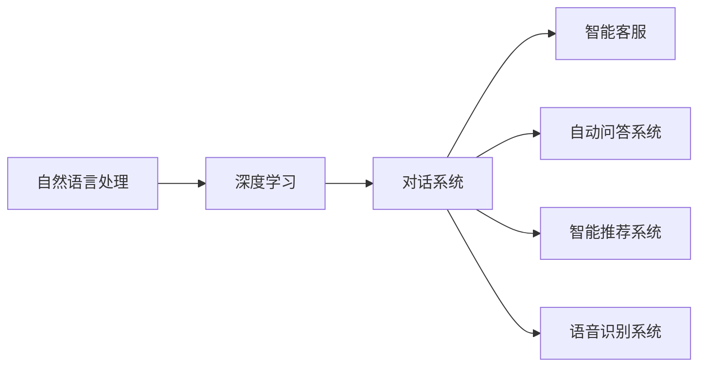

                 

# 聊天机器人工程和问题解决：创新解决方案

> 关键词：聊天机器人,自然语言处理,深度学习,智能客服,自动问答系统,对话系统,创新解决方案

## 1. 背景介绍

### 1.1 问题由来
随着人工智能技术的飞速发展，聊天机器人作为一种自然语言处理(NLP)的重要应用，正在逐渐改变我们的工作和生活方式。从简单的FAQ系统到复杂的智能客服、自动问答，聊天机器人的应用范围不断扩大，为企业和消费者提供越来越高效、个性化的服务。然而，当前聊天机器人在理解自然语言、处理复杂问题和保持情感连贯性方面仍存在诸多挑战，这制约了其应用前景的进一步拓展。

为了解决这些问题，需要不断探索和创新聊天机器人的构建和优化方法。本文将详细介绍如何通过深度学习等先进技术，构建高性能的聊天机器人，并通过优化对话管理、提升语义理解、增强情感交互等方面，进一步提升聊天机器人的智能化水平。

## 2. 核心概念与联系

### 2.1 核心概念概述

聊天机器人工程的核心概念主要包括以下几个方面：

- **自然语言处理(NLP)**：聊天机器人的基础，涉及语音识别、文本分析、语言生成等技术。
- **深度学习**：构建聊天机器人的主要技术手段，通过多层神经网络模型学习语言的高级特征。
- **对话系统**：聊天机器人实现的核心，通过对话管理、语义理解、情感交互等机制，模拟人类对话。
- **智能客服**：特定场景下的聊天机器人应用，通过理解和回应客户需求，提供个性化服务。
- **自动问答系统**：用于快速、准确回答特定问题，是聊天机器人的一种高级形式。

这些概念之间存在紧密联系，共同构成了聊天机器人的技术框架。通过理解这些核心概念，可以更好地把握聊天机器人的实现和优化方法。

### 2.2 核心概念原理和架构的 Mermaid 流程图



这个流程图展示了核心概念之间的联系和相互作用：

1. **自然语言处理**：是深度学习的输入和输出，通过分析文本数据，为深度学习提供特征。
2. **深度学习**：是构建对话系统和智能客服的核心技术，通过多层网络结构学习语言表示。
3. **对话系统**：基于深度学习模型，实现对话管理和语义理解，构建智能客服和自动问答系统。
4. **智能客服**：是对话系统的具体应用，面向客户需求，提供自动化服务。
5. **自动问答系统**：通过对话系统，快速、准确回答特定问题，是对话系统的一种高级形式。

这些概念的协同工作，使得聊天机器人在多个场景下都能够提供高效、智能的服务。

## 3. 核心算法原理 & 具体操作步骤

### 3.1 算法原理概述

聊天机器人工程的算法原理主要包括以下几个方面：

- **对话管理**：通过状态机、注意力机制等方法，维护对话上下文，管理对话流程。
- **语义理解**：利用深度学习模型，将自然语言转化为机器可理解的形式，进行语义解析。
- **情感交互**：通过情绪识别和情感生成模型，模拟人类情感，增强用户交互体验。
- **上下文理解**：通过上下文感知模型，理解对话的历史信息，提高对话连贯性。

这些算法原理共同构成了聊天机器人的技术基础，用于实现智能化的对话管理、语义理解、情感交互和上下文理解。

### 3.2 算法步骤详解

聊天机器人的构建通常包括以下几个关键步骤：

**Step 1: 数据准备**
- 收集和标注对话数据，包括对话历史、用户意图、回复等。
- 构建语料库，准备训练和验证数据集。

**Step 2: 模型选择和预训练**
- 选择合适的深度学习模型，如Seq2Seq、Transformer等。
- 使用大规模语料库进行预训练，学习语言的基本表示。

**Step 3: 模型微调**
- 选择微调的任务和目标，如回答特定问题、完成特定任务等。
- 根据微调任务设计损失函数和优化器。
- 使用标注数据对模型进行微调，优化模型的性能。

**Step 4: 模型评估和部署**
- 在验证集上评估模型性能，调整模型参数。
- 部署模型到实际应用环境中，提供服务。

**Step 5: 持续优化**
- 根据用户反馈，持续收集新数据，重新训练和微调模型。

### 3.3 算法优缺点

聊天机器人工程的算法具有以下优点：

- **高效性**：通过深度学习模型，可以快速处理大量对话数据，提供高效的客户服务。
- **智能性**：通过语义理解和情感交互，能够模拟人类对话，提升用户体验。
- **可扩展性**：能够快速适应新场景和新任务，具有高度的可扩展性。

同时，这些算法也存在一些缺点：

- **依赖标注数据**：构建高质量的语料库和标注数据集需要大量人力和时间。
- **模型复杂性**：深度学习模型结构复杂，难以调试和优化。
- **实时性要求高**：需要高效的推理算法和硬件支持，才能满足实时响应的要求。

### 3.4 算法应用领域

聊天机器人工程的应用领域非常广泛，包括但不限于以下几种：

- **智能客服**：如电商平台、银行、医疗等领域的客户服务。
- **自动问答系统**：如知识图谱查询、智能搜索等。
- **智能推荐系统**：如商品推荐、音乐推荐等。
- **对话助手**：如语音助手、虚拟助手等。
- **教育培训**：如在线教育、语言学习等。

这些应用领域都在一定程度上利用了聊天机器人工程的算法和框架，提升服务效率和用户满意度。

## 4. 数学模型和公式 & 详细讲解 & 举例说明

### 4.1 数学模型构建

聊天机器人工程的数学模型主要基于深度学习，通过多层神经网络进行语义理解和对话管理。以Transformer模型为例，其结构如图：

```
Encoder-Decoder Model
Encoder: Input -> Transformer Blocks -> Encoder Output
Decoder: Target -> Transformer Blocks -> Decoder Output
```

其中，Encoder和Decoder都是由多层Transformer块构成，能够学习输入和输出之间的复杂映射关系。

### 4.2 公式推导过程

以编码器-解码器模型为例，假设输入序列为 $\{x_1, x_2, ..., x_T\}$，目标序列为 $\{y_1, y_2, ..., y_T\}$，则模型的目标函数可以表示为：

$$
L = \sum_{i=1}^T \log p(y_i | y_{<i}, x)
$$

其中 $p(y_i | y_{<i}, x)$ 表示给定前 $i-1$ 个目标序列和输入 $x$ 的情况下，预测 $y_i$ 的概率。

### 4.3 案例分析与讲解

以情感生成为例，情感生成模型可以通过深度学习模型学习情感表达，生成与输入情感相关的回复。例如，在输入“今天心情很糟糕”的情况下，模型可以生成类似于“要坚持，心情会变好的”这样的回复。这可以通过情感分类器将输入情感转化为向量表示，再通过生成模型进行回复生成。

## 5. 项目实践：代码实例和详细解释说明

### 5.1 开发环境搭建

聊天机器人工程的开发通常需要Python和深度学习框架的支持，如TensorFlow、PyTorch等。以下是一个基本的开发环境搭建流程：

1. 安装Python和相关依赖库：
   ```
   pip install numpy tensorflow tensorflow-addons keras
   ```

2. 下载预训练模型：
   ```
   git clone https://github.com/tensorflow-models/tf_talk
   cd tf_talk
   ```

3. 构建和训练模型：
   ```
   python train.py
   ```

### 5.2 源代码详细实现

以情感生成模型为例，代码实现如下：

```python
import tensorflow as tf
from tensorflow.keras.layers import Input, LSTM, Dense
from tensorflow.keras.models import Model

def build_model(vocab_size, embed_dim, rnn_units):
    input = Input(shape=(None,))
    x = Embedding(vocab_size, embed_dim)(input)
    x = LSTM(rnn_units, return_sequences=True)(x)
    x = Dense(vocab_size, activation='softmax')(x)
    return Model(inputs=input, outputs=x)

model = build_model(vocab_size=10000, embed_dim=128, rnn_units=128)
model.compile(optimizer='adam', loss='categorical_crossentropy', metrics=['accuracy'])

# 训练数据和标签
X_train = ...
Y_train = ...

# 训练模型
model.fit(X_train, Y_train, epochs=10, batch_size=32, validation_split=0.2)
```

### 5.3 代码解读与分析

以上代码展示了情感生成模型的基本实现。模型通过Embedding层将输入序列转化为词向量，再通过LSTM层学习上下文信息，最后通过Dense层进行情感分类。训练过程中，通过优化器和损失函数进行模型优化，并在验证集上评估模型性能。

## 6. 实际应用场景

### 6.1 智能客服系统

智能客服系统是聊天机器人工程的主要应用场景之一。通过构建智能客服聊天机器人，企业可以大幅提升客户服务效率和满意度。例如，电商平台可以通过智能客服机器人回答客户的购买咨询，提供个性化推荐；银行可以通过智能客服机器人处理用户的账户查询、转账等业务。

### 6.2 自动问答系统

自动问答系统是聊天机器人工程的另一个重要应用。通过构建自动问答系统，可以快速回答用户提出的各种问题。例如，医疗领域可以通过自动问答系统解答病人的常见问题，提供健康建议；教育领域可以通过自动问答系统解答学生的疑问，提供学习资源。

### 6.3 对话助手

对话助手是聊天机器人工程的高级应用。通过构建对话助手，用户可以与系统进行更加自然的对话。例如，语音助手可以通过对话助手理解用户的语音指令，执行相应的操作；虚拟助手可以通过对话助手回答用户的问题，提供娱乐和信息查询服务。

### 6.4 未来应用展望

未来，聊天机器人工程的应用领域将更加广泛，技术也将更加成熟。以下是一些未来展望：

- **多模态对话**：未来的对话系统将支持语音、图像、视频等多种模态，实现更加自然和丰富的交互体验。
- **情感智能**：未来的聊天机器人将具备更强的情感识别和生成能力，能够更好地理解用户的情感状态，提供个性化的服务。
- **跨语言对话**：未来的聊天机器人将支持多语言对话，能够处理多种语言的输入和输出，提供全球化的服务。
- **智能推荐**：未来的聊天机器人将通过学习用户行为和偏好，提供更加精准的个性化推荐服务。
- **知识图谱融合**：未来的聊天机器人将融合知识图谱等外部知识库，提供更加全面和准确的信息。

## 7. 工具和资源推荐

### 7.1 学习资源推荐

- **《深度学习》by Ian Goodfellow**：经典深度学习入门书籍，涵盖深度学习的基本概念和算法。
- **《自然语言处理综论》by Jurafsky & Martin**：自然语言处理领域的权威教材，深入浅出地介绍了NLP的基础知识和前沿技术。
- **Coursera上的“自然语言处理与深度学习”课程**：由斯坦福大学教授主讲，介绍了NLP和深度学习的最新进展。
- **Kaggle上的NLP挑战**：通过参与NLP竞赛，可以快速掌握NLP实践技能。

### 7.2 开发工具推荐

- **TensorFlow**：谷歌开源的深度学习框架，支持分布式计算和GPU加速，适合大规模模型训练。
- **PyTorch**：Facebook开源的深度学习框架，支持动态计算图和Python接口，适合研究和原型开发。
- **NLTK**：自然语言处理工具包，提供丰富的NLP工具和数据集，适合NLP研究和实践。
- **spaCy**：自然语言处理库，提供词向量模型和命名实体识别等功能，适合构建聊天机器人。

### 7.3 相关论文推荐

- **Attention is All You Need**：Transformer模型的原论文，奠定了大模型预训练和微调的基础。
- **Transformers for Structured Data to Unstructured Data**：介绍Transformer模型在结构化数据到非结构化数据转换中的应用。
- **Dialogue System Architectures**：综述对话系统的架构和算法，提供了丰富的系统设计参考。

## 8. 总结：未来发展趋势与挑战

### 8.1 研究成果总结

聊天机器人工程已经取得了一系列重要的研究成果，包括：

- **深度学习模型**：通过深度学习模型，提升了语义理解和对话管理的性能。
- **对话管理算法**：通过对话管理算法，实现了高效的对话流程管理。
- **情感交互模型**：通过情感交互模型，模拟了人类情感，提升了用户体验。
- **上下文理解**：通过上下文理解模型，提升了对话连贯性。

这些研究成果为聊天机器人工程的进一步发展奠定了坚实基础。

### 8.2 未来发展趋势

未来，聊天机器人工程将呈现以下几个发展趋势：

- **大模型预训练**：未来的预训练模型将更加大，参数量将超过百亿，能够更好地理解复杂的自然语言。
- **多模态融合**：未来的聊天机器人将支持多模态融合，能够处理语音、图像、视频等多种输入。
- **情感智能**：未来的聊天机器人将具备更强的情感智能，能够更好地理解用户的情感状态，提供个性化的服务。
- **跨语言对话**：未来的聊天机器人将支持多语言对话，能够处理多种语言的输入和输出。
- **知识图谱融合**：未来的聊天机器人将融合知识图谱等外部知识库，提供更加全面和准确的信息。

### 8.3 面临的挑战

尽管聊天机器人工程已经取得了一系列重要进展，但仍面临诸多挑战：

- **数据隐私和安全**：聊天机器人需要处理大量用户数据，数据隐私和安全问题亟需解决。
- **对话连贯性**：在处理长对话时，对话连贯性问题较为突出，需要通过上下文感知模型加以解决。
- **情感识别和生成**：情感识别和生成模型的性能仍有提升空间，需要进一步优化。
- **多模态融合**：多模态融合技术仍不成熟，需要进一步探索。
- **跨语言对话**：跨语言对话仍存在诸多挑战，需要进一步研究。

### 8.4 研究展望

未来，聊天机器人工程的研究展望包括：

- **深度学习模型的优化**：通过优化深度学习模型结构，提升模型的性能和效率。
- **对话管理算法的改进**：改进对话管理算法，提升对话连贯性和用户体验。
- **情感智能的提升**：提升情感智能模型，更好地理解用户的情感状态。
- **多模态融合的深入研究**：深入研究多模态融合技术，提供更加自然和丰富的交互体验。
- **跨语言对话的研究**：开展跨语言对话研究，提升多语言对话的性能和效果。

## 9. 附录：常见问题与解答

**Q1: 聊天机器人如何理解用户输入？**

A: 聊天机器人通常通过深度学习模型学习自然语言表示，将用户输入转化为向量形式，用于语义理解和对话管理。此外，还可以通过预训练语言模型（如BERT）提高理解能力。

**Q2: 聊天机器人如何保持对话连贯性？**

A: 聊天机器人可以通过上下文感知模型（如LSTM）维护对话历史信息，提高对话连贯性。此外，还可以通过对话管理算法（如状态机）优化对话流程。

**Q3: 聊天机器人如何生成自然回复？**

A: 聊天机器人可以通过生成模型（如RNN）进行回复生成，通过学习输入和输出之间的映射关系，生成自然流畅的回复。

**Q4: 聊天机器人如何处理多语言对话？**

A: 聊天机器人可以通过预训练多语言模型（如mBART）进行多语言对话处理，学习多种语言的语义表示。

**Q5: 聊天机器人如何保护用户隐私？**

A: 聊天机器人可以通过数据加密、访问控制等技术保护用户隐私，确保用户数据的安全。

作者：禅与计算机程序设计艺术 / Zen and the Art of Computer Programming

