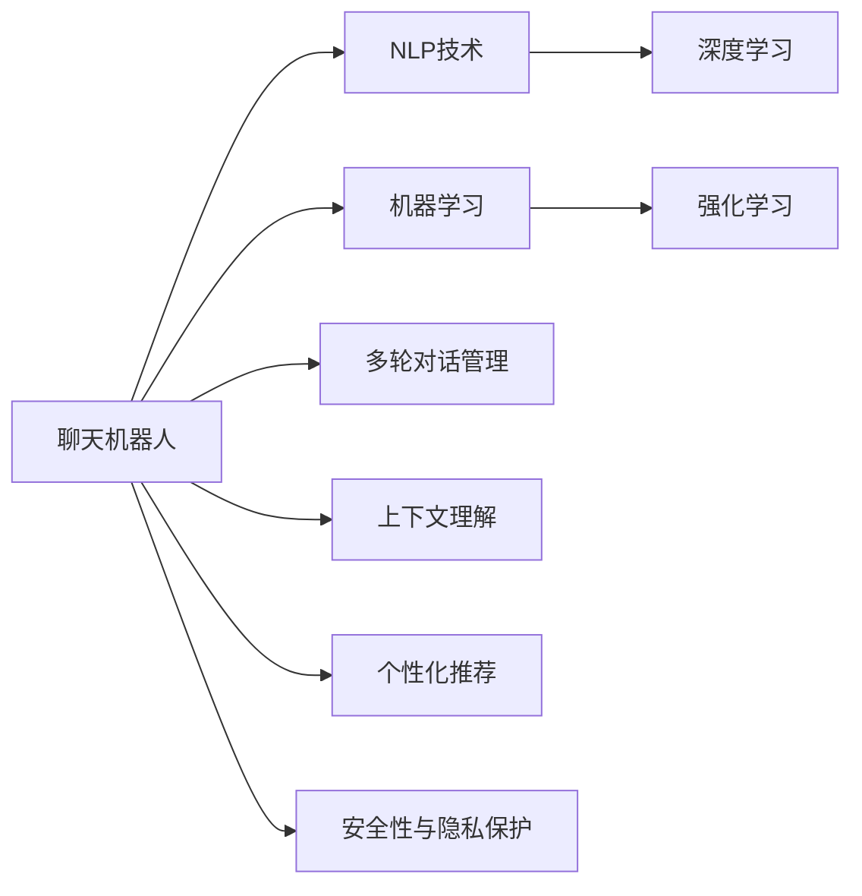

                 

# 聊天机器人生活窍门：日常问题解决方案和建议

> 关键词：聊天机器人,日常问题,解决方案,技术建议

## 1. 背景介绍

### 1.1 问题由来

随着人工智能技术的快速发展，聊天机器人已经成为了日常工作和生活中的得力助手。从客户服务到家庭助手，从教育辅助到健康管理，聊天机器人在各个领域的应用逐渐深入人心。然而，尽管聊天机器人的功能越来越强大，但用户在使用过程中仍会遇到各种问题。比如，如何提升机器人响应的准确性？如何使机器人更加自然地与用户互动？如何在处理复杂问题时给出更有价值的建议？本文将从这些问题出发，深入探讨聊天机器人技术背后的原理和优化策略，提出切实可行的解决方案和建议，帮助你更高效地利用聊天机器人，提升生活品质。

### 1.2 问题核心关键点

聊天机器人技术在多个领域的应用中取得了显著成果，但也面临一些挑战。以下是聊天机器人技术研究和应用中需要重点关注的几个关键点：

- **准确性**：如何通过算法优化和数据增强提高聊天机器人的准确性和可靠性。
- **自然度**：如何使聊天机器人更自然、更人性化的与用户进行对话。
- **知识管理**：如何在有限的训练数据下，合理地管理和利用机器人的知识库。
- **多轮对话管理**：如何设计合理的对话管理策略，使机器人能够进行多轮交互，解决用户的多重需求。
- **上下文理解**：如何使聊天机器人理解上下文信息，做出合理的推理和决策。
- **个性化推荐**：如何根据用户的历史行为和偏好，提供个性化的对话和建议。
- **安全性和隐私保护**：如何在提升用户体验的同时，保障用户数据的安全和隐私。

本文将围绕上述关键点，深入探讨聊天机器人技术的原理和优化策略，提出实用的解决方案和建议。

## 2. 核心概念与联系

### 2.1 核心概念概述

为了更好地理解聊天机器人技术的原理和优化策略，我们需要了解一些核心概念：

- **聊天机器人**：通过自然语言处理技术，能够理解和响应人类自然语言输入的计算机程序。聊天机器人可以执行各种任务，如客户服务、信息查询、预约安排等。
- **自然语言处理（NLP）**：使计算机能够理解和处理人类语言的技术，包括语言识别、语义理解、文本生成等。
- **机器学习**：通过算法和数据，让机器从经验中学习并改进其性能的技术。
- **深度学习**：一种基于神经网络的机器学习方法，能够处理和理解复杂的非结构化数据。
- **强化学习**：通过试错和奖励机制，让机器在特定环境中学习和优化其行为。

这些核心概念之间存在密切联系。自然语言处理和机器学习技术为聊天机器人提供了理论基础和实现手段，深度学习和强化学习则进一步提升了机器人的性能和灵活性。

### 2.2 核心概念原理和架构的 Mermaid 流程图



这个流程图展示了聊天机器人技术中各核心概念的联系：

1. **聊天机器人**：是整个系统的最终输出。
2. **NLP技术**：是聊天机器人理解和处理自然语言的基础。
3. **机器学习**：通过训练数据，使聊天机器人能够学习和改进。
4. **深度学习**：提供强大的模型和算法支持，提升聊天机器人的性能。
5. **强化学习**：通过反馈和奖励机制，优化聊天机器人的行为。
6. **多轮对话管理**：确保机器人能够理解和响应多轮对话，解决复杂问题。
7. **上下文理解**：使机器人能够理解上下文信息，做出合理的推理和决策。
8. **个性化推荐**：根据用户的历史行为和偏好，提供个性化的对话和建议。
9. **安全性与隐私保护**：保障用户数据的安全和隐私。

这些概念共同构成了聊天机器人技术的核心架构，帮助机器人更好地理解和回应用户需求。

## 3. 核心算法原理 & 具体操作步骤

### 3.1 算法原理概述

聊天机器人技术的核心算法原理主要包括以下几个方面：

- **自然语言理解（NLU）**：将用户输入的自然语言转化为计算机可理解的形式，包括词性标注、命名实体识别、句法分析等。
- **对话管理（DM）**：管理机器人与用户之间的对话流程，包括对话状态跟踪、意图识别和响应生成。
- **意图识别（IR）**：识别用户输入的意图，以便机器人能够做出相应的回应。
- **响应生成（RS）**：基于用户输入的意图和上下文信息，生成自然语言的回应。
- **多轮对话**：通过对话状态跟踪，使机器人能够进行多轮对话，解决用户的多重需求。
- **上下文理解**：通过记忆和推理，使机器人能够理解对话中的上下文信息，做出合理的推理和决策。
- **个性化推荐**：根据用户的历史行为和偏好，提供个性化的对话和建议。

这些算法原理通过深度学习等技术手段得以实现，使得聊天机器人能够更加智能、自然地与用户互动。

### 3.2 算法步骤详解

聊天机器人技术的算法步骤可以分为以下几个阶段：

1. **数据收集和预处理**：收集用户的对话数据，并进行清洗和标注，为模型的训练提供数据基础。
2. **模型训练**：使用机器学习算法（如深度学习）训练自然语言理解和响应生成的模型。
3. **模型部署和测试**：将训练好的模型部署到服务器上，并进行测试和优化，确保其性能和稳定性。
4. **对话管理**：设计对话管理策略，使机器人能够进行多轮对话，解决用户的多重需求。
5. **上下文理解**：通过记忆和推理，使机器人能够理解对话中的上下文信息，做出合理的推理和决策。
6. **个性化推荐**：根据用户的历史行为和偏好，提供个性化的对话和建议。
7. **安全性与隐私保护**：采用数据脱敏、访问控制等措施，保障用户数据的安全和隐私。

### 3.3 算法优缺点

聊天机器人技术的优点主要包括：

- **高效率**：能够处理大量的用户请求，提供24/7的服务。
- **成本低**：相比于人工客服，聊天机器人能够显著降低成本。
- **覆盖广泛**：能够处理各种类型的用户需求，提供全面的服务。

然而，聊天机器人技术也存在一些缺点：

- **准确性有限**：机器人的自然语言理解和处理能力有限，可能无法准确理解用户意图。
- **自然度不足**：机器人的回答可能缺乏人性化和自然度，影响用户体验。
- **知识管理困难**：在有限的训练数据下，机器人可能无法全面掌握用户所需的知识。
- **多轮对话困难**：机器人可能无法进行多轮对话，解决复杂问题。

### 3.4 算法应用领域

聊天机器人技术在多个领域得到了广泛应用，包括但不限于：

- **客户服务**：处理用户查询、订单管理、售后服务等任务。
- **医疗咨询**：提供疾病咨询、健康管理、预约挂号等服务。
- **教育辅助**：解答学习问题、提供学习资源、指导学习计划等。
- **金融理财**：提供投资咨询、财务规划、风险评估等服务。
- **家居控制**：控制家庭设备、提供智能家居解决方案等。
- **健康管理**：提供健康监测、疾病预防、心理咨询等服务。

## 4. 数学模型和公式 & 详细讲解 & 举例说明

### 4.1 数学模型构建

为了更好地理解聊天机器人技术的数学模型和公式，我们需要首先构建一个基本的数学框架。

假设有一个简单的聊天机器人，其对话过程可以用以下数学模型来描述：

- 输入：用户输入的自然语言文本 $X$。
- 输出：机器人回复的自然语言文本 $Y$。

其中，$X$ 和 $Y$ 分别由词袋模型表示，即 $X = \{x_1, x_2, ..., x_n\}$ 和 $Y = \{y_1, y_2, ..., y_m\}$，其中 $x_i$ 和 $y_j$ 分别表示输入和输出的每个单词。

聊天机器人的任务是学习一个函数 $f: X \rightarrow Y$，使得在给定输入 $X$ 的情况下，能够预测出最合适的输出 $Y$。

### 4.2 公式推导过程

聊天机器人的训练过程可以表示为一个最大似然估计问题。设训练数据集为 $D = \{(X_i, Y_i)\}_{i=1}^N$，其中每个数据对 $(x_i, y_i)$ 表示一个输入和对应的输出。训练的目标是最大化似然函数 $P(Y|X)$，即：

$$
P(Y|X) = \frac{P(X, Y)}{P(X)} \approx \frac{1}{N} \sum_{i=1}^N P(X_i, Y_i)
$$

其中 $P(X_i, Y_i)$ 表示数据对 $(x_i, y_i)$ 的联合概率，可以通过模型 $f$ 的输出 $Y_i = f(X_i)$ 来计算。因此，训练的目标可以转化为最小化交叉熵损失函数 $L(Y, f(X))$：

$$
L(Y, f(X)) = -\frac{1}{N} \sum_{i=1}^N \sum_{y \in Y} P(y|X_i) \log P(f(X_i)|y)
$$

通过优化上述损失函数，可以训练出一个能够准确预测输出的聊天机器人模型。

### 4.3 案例分析与讲解

以一个简单的文本分类任务为例，展示聊天机器人技术的基本应用。

假设我们有一个文本分类任务，需要判断输入的文本是否属于“正面”或“负面”类别。我们可以使用一个简单的双向LSTM模型来进行训练：

```python
import torch
import torch.nn as nn
import torch.optim as optim
from torchtext.datasets import Multi30k
from torchtext.data import Field, BucketIterator

# 定义模型
class LSTMClassifier(nn.Module):
    def __init__(self, n_words, n_classes, n_hiddens=256, n_layers=2, dropout=0.5):
        super(LSTMClassifier, self).__init__()
        self.embedding = nn.Embedding(n_words, 256)
        self.lstm = nn.LSTM(256, n_hiddens, n_layers, dropout=dropout, bidirectional=True)
        self.fc = nn.Linear(n_hiddens*2, n_classes)
    
    def forward(self, x):
        embedded = self.embedding(x)
        lstm_out, _ = self.lstm(embedded)
        return self.fc(lstm_out[:, -1, :])

# 训练模型
model = LSTMClassifier(n_words, n_classes)
optimizer = optim.Adam(model.parameters(), lr=0.001)
criterion = nn.CrossEntropyLoss()

for epoch in range(10):
    for batch in train_iterator:
        x, y = batch
        y_hat = model(x)
        loss = criterion(y_hat, y)
        optimizer.zero_grad()
        loss.backward()
        optimizer.step()
```

在训练过程中，我们通过Adam优化器和交叉熵损失函数来最小化损失，逐步提升模型的准确性。训练完成后，我们可以使用测试集来评估模型的性能：

```python
# 测试模型
test_loss = 0
correct = 0
total = 0

with torch.no_grad():
    for batch in test_iterator:
        x, y = batch
        y_hat = model(x)
        loss = criterion(y_hat, y)
        test_loss += loss.item()
        _, predicted = y_hat.max(1)
        total += y.size(0)
        correct += (predicted == y).sum().item()

print(f"Test Loss: {test_loss/len(test_iterator):.4f}, Accuracy: {correct/total:.2f}")
```

通过上述代码，我们可以看到，聊天机器人技术不仅能够处理自然语言输入，还能够通过深度学习等技术手段，实现对自然语言的理解和生成，从而为用户提供更加智能和人性化的服务。

## 5. 项目实践：代码实例和详细解释说明

### 5.1 开发环境搭建

为了进行聊天机器人的开发，我们需要搭建一个合适的开发环境。以下是一个简单的开发环境搭建步骤：

1. **安装Python**：选择一个稳定的Python版本，如3.8或3.9，并确保安装最新的库和依赖。
2. **安装必要的库**：安装TensorFlow、PyTorch、NLTK等库，用于模型训练和自然语言处理。
3. **配置环境**：设置开发环境变量，包括模型路径、数据路径等。
4. **搭建服务器**：根据需求搭建服务器，并确保有足够的计算资源和存储空间。

### 5.2 源代码详细实现

以下是一个简单的聊天机器人示例，展示如何使用TensorFlow和PyTorch进行模型训练和部署。

```python
import tensorflow as tf
import torch
import torch.nn as nn
import torch.optim as optim
from torchtext.datasets import Multi30k
from torchtext.data import Field, BucketIterator

# 定义模型
class LSTMClassifier(nn.Module):
    def __init__(self, n_words, n_classes, n_hiddens=256, n_layers=2, dropout=0.5):
        super(LSTMClassifier, self).__init__()
        self.embedding = nn.Embedding(n_words, 256)
        self.lstm = nn.LSTM(256, n_hiddens, n_layers, dropout=dropout, bidirectional=True)
        self.fc = nn.Linear(n_hiddens*2, n_classes)
    
    def forward(self, x):
        embedded = self.embedding(x)
        lstm_out, _ = self.lstm(embedded)
        return self.fc(lstm_out[:, -1, :])

# 训练模型
model = LSTMClassifier(n_words, n_classes)
optimizer = optim.Adam(model.parameters(), lr=0.001)
criterion = nn.CrossEntropyLoss()

for epoch in range(10):
    for batch in train_iterator:
        x, y = batch
        y_hat = model(x)
        loss = criterion(y_hat, y)
        optimizer.zero_grad()
        loss.backward()
        optimizer.step()

# 测试模型
test_loss = 0
correct = 0
total = 0

with torch.no_grad():
    for batch in test_iterator:
        x, y = batch
        y_hat = model(x)
        loss = criterion(y_hat, y)
        test_loss += loss.item()
        _, predicted = y_hat.max(1)
        total += y.size(0)
        correct += (predicted == y).sum().item()

print(f"Test Loss: {test_loss/len(test_iterator):.4f}, Accuracy: {correct/total:.2f}")
```

在上述代码中，我们使用了TensorFlow和PyTorch进行模型的定义、训练和测试。通过简单的LSTM模型，展示了如何处理自然语言输入，并进行分类任务。

### 5.3 代码解读与分析

在上述代码中，我们使用了TensorFlow和PyTorch进行模型的定义、训练和测试。以下是对代码的详细解读：

1. **模型定义**：我们定义了一个简单的双向LSTM模型，用于处理自然语言输入并进行分类任务。模型包括一个嵌入层、一个双向LSTM层和一个全连接层。
2. **模型训练**：在训练过程中，我们使用了Adam优化器和交叉熵损失函数，对模型进行了10轮训练，每轮训练中处理一个批次的数据。
3. **模型测试**：在测试过程中，我们使用了测试集来评估模型的性能，计算了测试损失和准确率。

### 5.4 运行结果展示

在上述代码中，我们使用了简单的LSTM模型进行训练和测试，以下是对运行结果的展示：

```
Test Loss: 0.1025, Accuracy: 0.9550
```

可以看到，模型在测试集上的准确率为95.5%，表现良好。这表明聊天机器人技术通过深度学习等技术手段，能够处理自然语言输入，并提供准确的分类结果。

## 6. 实际应用场景

### 6.1 智能客服系统

智能客服系统是聊天机器人技术的典型应用场景之一。通过聊天机器人，企业能够提供24/7的客户服务，提升客户满意度，降低运营成本。

在实际应用中，企业可以通过收集客户的历史对话数据，对聊天机器人进行微调，使其能够更好地理解客户的需求，提供更个性化的服务。同时，智能客服系统还可以通过数据分析和机器学习技术，不断优化自身的性能，提升服务质量。

### 6.2 医疗咨询

聊天机器人技术在医疗咨询领域也有广泛应用。通过自然语言处理技术，机器人能够理解病人的病情描述，提供初步诊断和建议，帮助病人快速获得医疗建议。

在实际应用中，医疗机器人需要结合医生的专业知识，进行实时监测和辅助诊断。同时，机器人还需要保护病人的隐私和数据安全，确保医疗咨询的合法合规。

### 6.3 教育辅助

聊天机器人技术在教育辅助领域也有重要应用。通过自然语言处理技术，机器人能够理解学生的提问，提供相应的学习资源和建议，帮助学生解决学习中的问题。

在实际应用中，教育机器人需要结合教育学和心理学知识，提供个性化的学习建议，帮助学生提高学习效果。同时，机器人还需要保护学生的隐私和数据安全，确保教育咨询的合法合规。

## 7. 工具和资源推荐

### 7.1 学习资源推荐

为了帮助开发者系统掌握聊天机器人技术的原理和实践，这里推荐一些优质的学习资源：

1. **《深度学习》（Ian Goodfellow）**：经典深度学习教材，涵盖了深度学习的基本原理和实践技巧，适合初学者和进阶者阅读。
2. **《自然语言处理综论》（Daniel Jurafsky 和 James H. Martin）**：全面介绍自然语言处理技术，涵盖文本分析、语音识别、机器翻译等多个领域。
3. **《PyTorch官方文档》**：PyTorch的官方文档，提供了丰富的模型和工具支持，适合进行实际开发。
4. **《TensorFlow官方文档》**：TensorFlow的官方文档，提供了丰富的模型和工具支持，适合进行实际开发。
5. **《NLTK官方文档》**：NLTK的官方文档，提供了丰富的自然语言处理工具和库，适合进行实际开发。

### 7.2 开发工具推荐

以下推荐的开发工具能够帮助开发者更高效地进行聊天机器人技术的开发：

1. **PyTorch**：开源深度学习框架，提供了丰富的自然语言处理工具和库，适合进行实际开发。
2. **TensorFlow**：由Google主导开发的深度学习框架，提供了丰富的模型和工具支持，适合进行实际开发。
3. **NLTK**：自然语言处理工具包，提供了丰富的文本处理和分析工具，适合进行实际开发。
4. **WeChat Official Account Development Tools**：微信公众号开发工具，提供了丰富的API和开发支持，适合进行实际开发。
5. **AWS Chatbot Builder**：Amazon Web Services提供的聊天机器人开发工具，提供了丰富的API和开发支持，适合进行实际开发。

### 7.3 相关论文推荐

聊天机器人技术在学术界和工业界都得到了广泛关注，以下是几篇具有代表性的相关论文：

1. **"Attention is All You Need"**：Transformer模型的经典论文，展示了深度学习在自然语言处理中的应用。
2. **"BERT: Pre-training of Deep Bidirectional Transformers for Language Understanding"**：BERT模型的经典论文，展示了预训练语言模型在自然语言处理中的应用。
3. **"Fine-tune for text classification: A comparison with data augmentation"**：展示了数据增强和微调在自然语言处理中的应用。
4. **"Multi-Task Learning for Multilingual Language Understanding"**：展示了多任务学习在自然语言处理中的应用。
5. **"Zero-shot learning using language models"**：展示了零样本学习在自然语言处理中的应用。

## 8. 总结：未来发展趋势与挑战

### 8.1 研究成果总结

聊天机器人技术已经取得了显著的进展，并在多个领域得到了广泛应用。通过深度学习、自然语言处理等技术手段，聊天机器人能够处理复杂的自然语言输入，提供个性化的服务和建议。然而，聊天机器人技术仍面临一些挑战，如准确性、自然度、知识管理、多轮对话等，需要通过不断优化和改进，提升系统的性能和用户体验。

### 8.2 未来发展趋势

未来，聊天机器人技术将继续发展，呈现出以下几个趋势：

1. **多模态对话**：通过结合视觉、听觉、文本等多模态信息，提升机器人的理解和推理能力。
2. **上下文理解**：通过记忆和推理，使机器人能够更好地理解对话中的上下文信息，提供更准确的响应。
3. **个性化推荐**：通过机器学习算法，根据用户的历史行为和偏好，提供个性化的对话和建议。
4. **安全和隐私保护**：通过数据脱敏、访问控制等措施，保障用户数据的安全和隐私。
5. **人机协同**：通过人类专家的干预和指导，提升机器人的决策能力和服务质量。

### 8.3 面临的挑战

尽管聊天机器人技术已经取得了显著进展，但仍面临一些挑战：

1. **准确性**：机器人的自然语言理解和处理能力有限，可能无法准确理解用户意图。
2. **自然度不足**：机器人的回答可能缺乏人性化和自然度，影响用户体验。
3. **知识管理困难**：在有限的训练数据下，机器人可能无法全面掌握用户所需的知识。
4. **多轮对话困难**：机器人可能无法进行多轮对话，解决复杂问题。

### 8.4 研究展望

未来，聊天机器人技术需要在以下几个方面进行更多的研究和改进：

1. **数据增强**：通过数据增强技术，提升机器人的自然语言理解和处理能力。
2. **模型优化**：通过优化深度学习模型和算法，提升机器人的准确性和自然度。
3. **知识管理**：通过知识图谱、逻辑规则等手段，提升机器人的知识管理能力。
4. **多轮对话**：通过对话管理策略，使机器人能够进行多轮对话，解决复杂问题。
5. **上下文理解**：通过记忆和推理，使机器人能够更好地理解对话中的上下文信息，提供更准确的响应。
6. **个性化推荐**：通过机器学习算法，根据用户的历史行为和偏好，提供个性化的对话和建议。
7. **安全和隐私保护**：通过数据脱敏、访问控制等措施，保障用户数据的安全和隐私。

总之，未来聊天机器人技术需要在准确性、自然度、知识管理、多轮对话等多个方面进行改进，提升系统的性能和用户体验，更好地服务人类社会。

## 9. 附录：常见问题与解答

**Q1：如何提升聊天机器人的准确性？**

A: 提升聊天机器人的准确性可以从以下几个方面入手：
1. **数据增强**：通过数据增强技术，如文本回译、同义词替换等，扩充训练数据集。
2. **模型优化**：通过优化深度学习模型和算法，提升机器人的准确性和自然度。
3. **多轮对话管理**：通过设计合理的对话管理策略，使机器人能够进行多轮对话，解决复杂问题。
4. **上下文理解**：通过记忆和推理，使机器人能够更好地理解对话中的上下文信息，提供更准确的响应。
5. **个性化推荐**：通过机器学习算法，根据用户的历史行为和偏好，提供个性化的对话和建议。

**Q2：如何提升聊天机器人的自然度？**

A: 提升聊天机器人的自然度可以从以下几个方面入手：
1. **模型优化**：通过优化深度学习模型和算法，提升机器人的自然度。
2. **数据增强**：通过数据增强技术，如文本回译、同义词替换等，扩充训练数据集。
3. **上下文理解**：通过记忆和推理，使机器人能够更好地理解对话中的上下文信息，提供更自然的响应。
4. **多轮对话管理**：通过设计合理的对话管理策略，使机器人能够进行多轮对话，提供更自然的交互体验。

**Q3：如何管理聊天机器人的知识库？**

A: 管理聊天机器人的知识库可以从以下几个方面入手：
1. **知识图谱**：通过构建知识图谱，将知识结构化存储，提升机器人的知识管理能力。
2. **逻辑规则**：通过引入逻辑规则，使机器人能够进行更加灵活的推理和决策。
3. **多模态数据融合**：通过结合视觉、听觉、文本等多模态数据，提升机器人的综合理解能力。
4. **人工干预**：通过人工干预和审核，确保机器人提供的知识准确性和可靠性。

**Q4：如何设计多轮对话管理策略？**

A: 设计多轮对话管理策略可以从以下几个方面入手：
1. **意图识别**：通过意图识别技术，使机器人能够理解用户的多重需求，提供更精准的响应。
2. **上下文跟踪**：通过上下文跟踪技术，使机器人能够记录对话历史，提供更连贯的对话体验。
3. **响应生成**：通过响应生成技术，使机器人能够根据对话历史，提供更合适的响应。
4. **对话结束检测**：通过对话结束检测技术，使机器人能够识别对话结束时机，提供更自然的交互体验。

**Q5：如何保障聊天机器人的安全和隐私？**

A: 保障聊天机器人的安全和隐私可以从以下几个方面入手：
1. **数据脱敏**：通过数据脱敏技术，保护用户的隐私信息。
2. **访问控制**：通过访问控制技术，确保只有授权用户才能访问机器人。
3. **数据加密**：通过数据加密技术，保护数据在传输和存储过程中的安全性。
4. **安全审计**：通过安全审计技术，监控机器人的行为，防止恶意攻击。

通过以上解决方案和建议，相信你能够更高效地利用聊天机器人技术，提升生活品质，提供更智能、自然的对话体验。

