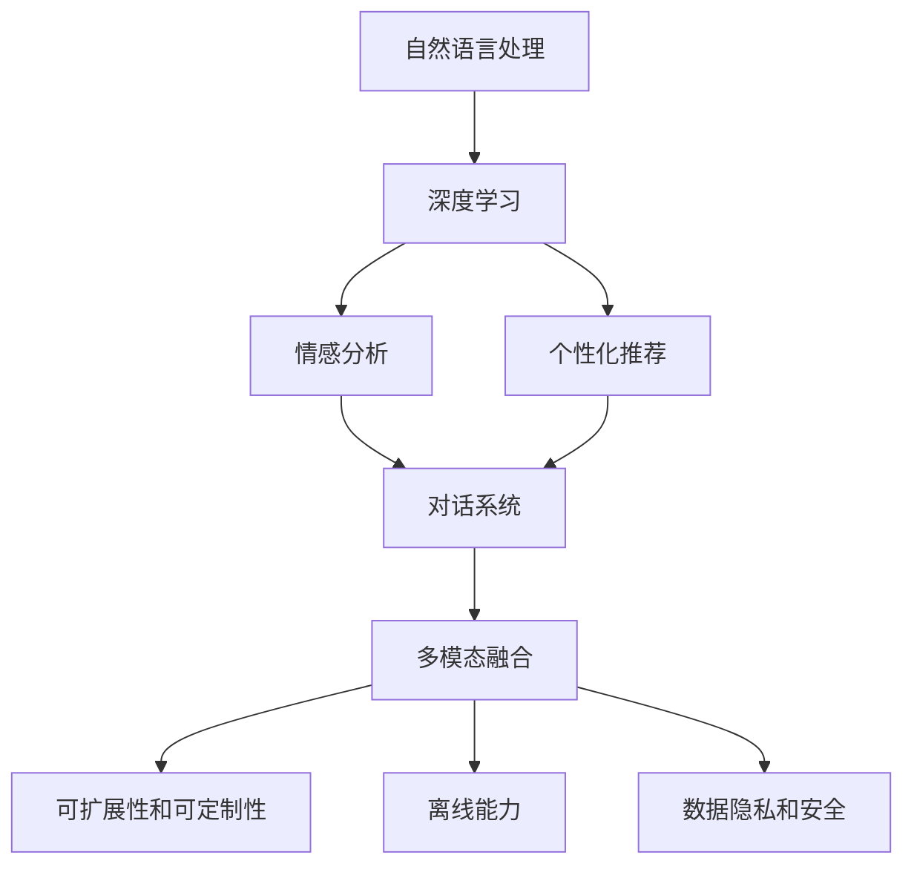

                 

# 聊天机器人虚拟助理的进化：成为终极伴侣

> 关键词：聊天机器人,虚拟助理,自然语言处理(NLP),深度学习,智能对话系统,情感识别,个性化推荐

## 1. 背景介绍

### 1.1 问题由来
聊天机器人（Chatbot）和虚拟助理（Virtual Assistant）是人工智能（AI）在NLP领域的重要应用方向。随着大数据、深度学习和自然语言处理技术的迅猛发展，聊天机器人和虚拟助理正逐步进化为能够理解、处理并生成自然语言，且具有一定情感识别能力的智能交互系统。

然而，尽管当前的技术已经能够支持相当复杂的对话和任务，但仍然存在诸多不足之处：对话难以长时间维持，缺乏对用户情感的敏感度，个性化推荐不足等。如何在技术层面实现突破，使聊天机器人虚拟助理能够更好地服务用户，成为值得深思的问题。

### 1.2 问题核心关键点
聊天机器人虚拟助理的演进离不开自然语言处理(NLP)和深度学习(DL)技术。其核心点在于：

1. 情感识别与响应：通过分析用户的语言和行为，识别用户的情感状态，并作出相应的情感回应。
2. 个性化推荐：根据用户历史行为和兴趣，推荐符合用户需求的信息或服务。
3. 多模态融合：结合语音、图像等多模态信息，提升交互体验。
4. 可扩展性和可定制性：支持快速集成各种API和插件，满足多样化的应用需求。
5. 离线能力：在无网络环境下，依然能够进行简单的任务处理。
6. 数据隐私和安全：确保用户数据不被滥用，并保障通信安全。

本文将从情感识别、个性化推荐、多模态融合等几个关键点，系统地介绍如何通过深度学习技术使聊天机器人虚拟助理更加智能和人性化，从而更好地满足用户的情感和个性化需求。

## 2. 核心概念与联系

### 2.1 核心概念概述

为更好地理解聊天机器人虚拟助理的核心原理，本节将介绍几个密切相关的核心概念：

- 自然语言处理(NLP)：研究计算机如何处理、理解、生成人类语言，是构建聊天机器人虚拟助理的技术基础。
- 深度学习(DL)：一种基于神经网络的学习方法，通过多层次的抽象表示，能够捕捉复杂的语言模式。
- 情感分析（Sentiment Analysis）：通过分析文本中的情感词汇、语调等，识别出文本中的情感倾向。
- 个性化推荐（Personalized Recommendation）：根据用户历史行为和兴趣，推荐相关信息，提高用户体验。
- 多模态融合（Multimodal Fusion）：结合语音、图像等多模态信息，提升交互体验和任务处理能力。
- 对话系统（Dialogue System）：通过理解用户输入，生成自然流畅的回复，实现人机自然交互。

这些核心概念之间的逻辑关系可以通过以下Mermaid流程图来展示：



这个流程图展示了一些核心概念及其之间的关系：

1. 自然语言处理(NLP)和深度学习(DL)技术提供了构建聊天机器人虚拟助理的基础。
2. 情感分析(C)通过NLP和DL技术识别出用户的情感，对话系统(E)可以据此调整回复策略。
3. 个性化推荐(D)在NLP和DL的辅助下，能够精准地推荐信息给用户。
4. 多模态融合(F)能够将语音、图像等多模态信息整合，提升交互体验和任务处理能力。
5. 可扩展性和可定制性(G)允许聊天机器人虚拟助理适应不同的应用场景。
6. 离线能力(H)和数据隐私与安全(I)则是用户体验和数据保护的保障。

这些概念共同构成了聊天机器人虚拟助理的核心技术框架，使其能够满足用户的各种需求。

## 3. 核心算法原理 & 具体操作步骤
### 3.1 算法原理概述

聊天机器人虚拟助理的核心技术框架基于深度学习，尤其是以Transformer模型为代表的自注意力机制，结合NLP技术进行情感识别、个性化推荐等多方面能力的实现。其核心思想是：

- 利用深度学习技术，从大量的文本语料中学习出语言表示，并用于对话生成和情感分析等任务。
- 通过构建多层次的表示模型，捕捉语言中的复杂模式和语义信息。
- 利用情感识别和个性化推荐等技术，增强与用户的互动体验。
- 通过多模态融合等技术，支持语音、图像等多模态信息输入和输出。
- 采用可扩展性和可定制性，满足不同应用场景的需求。
- 具备离线能力和数据隐私与安全保障，提高系统的鲁棒性和可靠性。

### 3.2 算法步骤详解

聊天机器人虚拟助理的核心算法步骤包括以下几个关键环节：

1. **数据准备**：
   - 收集并标注大量的文本数据，作为模型的训练语料。
   - 对于情感分析，需要标注好情感标签，如正面、负面、中性等。
   - 对于个性化推荐，需要收集用户的历史行为数据，标注好用户兴趣标签。

2. **模型构建**：
   - 构建基于Transformer的编码器-解码器模型，用于对话生成和情感分析等任务。
   - 在编码器端，使用注意力机制捕捉输入序列中的关键信息。
   - 在解码器端，使用全连接层、softmax等组件生成自然流畅的回复。
   - 加入情感分析层，对对话中的情感进行识别和分类。
   - 加入个性化推荐模块，根据用户兴趣推荐信息。

3. **模型训练**：
   - 使用大规模语料数据对模型进行预训练，学习通用的语言表示。
   - 在标注数据集上，对模型进行微调，提升其情感识别和个性化推荐能力。
   - 使用对抗样本等技术，提高模型的鲁棒性。

4. **模型评估与部署**：
   - 在测试集上对模型进行评估，检查情感识别和个性化推荐的效果。
   - 将模型部署到实际应用中，进行A/B测试等，评估实际效果。
   - 根据反馈，调整模型参数，优化模型表现。

### 3.3 算法优缺点

聊天机器人虚拟助理在情感识别、个性化推荐、多模态融合等方面具有以下优点：

1. **精确度**：通过深度学习和多层次表示，能够准确地捕捉语言中的情感和语义信息，提升模型的精确度。
2. **灵活性**：通过可扩展性和可定制性，能够适应不同的应用场景和任务。
3. **多样性**：通过多模态融合，支持语音、图像等多种输入方式，提升交互体验。
4. **鲁棒性**：通过对抗样本等技术，提高模型的鲁棒性，降低过拟合风险。
5. **实时性**：通过优化模型结构和计算图，提升模型的推理速度，支持实时交互。

同时，该方法也存在以下缺点：

1. **高计算需求**：构建和训练大规模模型需要高性能计算资源，存在一定的资源需求。
2. **数据依赖**：模型的性能依赖于大量的标注数据，标注成本较高。
3. **可解释性不足**：深度学习模型黑盒特性较强，缺乏可解释性。
4. **数据隐私问题**：用户数据隐私和模型安全保障是一个重要问题，需要设计良好的数据保护机制。
5. **用户适应性**：模型的个性化推荐依赖于用户历史行为数据，新用户可能难以获得准确的推荐。

尽管存在这些局限性，但就目前而言，聊天机器人虚拟助理仍是大规模自然语言处理技术应用的重要范式。未来相关研究的重点在于如何进一步降低计算需求，提高模型的可解释性，增强数据隐私和安全保障等。

### 3.4 算法应用领域

聊天机器人虚拟助理在以下多个领域中已经取得了显著的应用效果：

- **智能客服**：通过聊天机器人自动处理常见的客户咨询，减轻客服人员负担，提高服务效率。
- **在线教育**：提供智能化的学习辅导和个性化推荐，帮助学生提高学习效果。
- **健康咨询**：提供24小时医疗咨询服务，减轻医生工作负担，提高诊疗效率。
- **金融理财**：通过聊天机器人进行投资咨询和理财建议，提高用户投资收益。
- **智能家居**：通过语音助手控制家电设备，提升家居生活的智能化水平。

除了上述这些经典应用外，聊天机器人虚拟助理还被创新性地应用于更多场景中，如企业内部管理、环境保护、文化教育等，为各行各业提供了新的解决方案。

## 4. 数学模型和公式 & 详细讲解  
### 4.1 数学模型构建

本文将重点介绍聊天机器人虚拟助理的数学模型构建和关键公式推导。

### 4.2 公式推导过程

聊天机器人虚拟助理的核心算法通常基于Transformer模型，其关键公式推导如下：

1. **自注意力机制**：
   $$
   \text{Attention}(Q, K, V) = \text{Softmax}(\frac{QK^T}{\sqrt{d_k}})
   $$
   其中，$Q, K, V$ 分别为查询、键和值，$\text{Softmax}$ 函数用于计算注意力权重。

2. **Transformer层**：
   $$
   \text{MultiHeadSelfAttention}(Q, K, V) = \text{Concat}(\text{Attention}(Q, K, V)) \text{Softmax}(\frac{QK^T}{\sqrt{d_k}})
   $$
   其中，$\text{Concat}$ 函数用于拼接多头注意力结果。

3. **前向传播**：
   $$
   \text{FFN}(x) = \text{ReLU}(\text{Linear}(x)) \text{Linear}(\text{ReLU}(\text{Linear}(x)))
   $$
   其中，$\text{Linear}$ 和 $\text{ReLU}$ 分别表示线性变换和ReLU激活函数。

4. **解码器输出**：
   $$
   \text{Logits} = \text{Linear}(\text{MultiHeadSelfAttention}(Q, K, V) + \text{FFN})
   $$

通过这些公式，可以构建出基础的Transformer模型，实现聊天机器人虚拟助理的核心功能。

### 4.3 案例分析与讲解

以情感分析为例，其核心流程如下：

1. **文本编码**：将输入文本通过BERT等模型编码，得到高维表示。
2. **情感标签提取**：通过Softmax函数对编码结果进行分类，得到情感标签。
3. **模型训练**：在标注数据集上，使用交叉熵等损失函数训练模型，调整模型参数。

以个性化推荐为例，其核心流程如下：

1. **用户特征提取**：将用户历史行为数据通过BERT等模型编码，得到用户兴趣特征向量。
2. **物品特征提取**：将物品数据通过BERT等模型编码，得到物品特征向量。
3. **相似度计算**：通过余弦相似度等方法计算用户与物品的相似度。
4. **推荐结果生成**：根据相似度排序，选择推荐物品，返回给用户。

## 5. 项目实践：代码实例和详细解释说明
### 5.1 开发环境搭建

在进行聊天机器人虚拟助理的开发前，我们需要准备好开发环境。以下是使用Python进行TensorFlow开发的环境配置流程：

1. 安装Anaconda：从官网下载并安装Anaconda，用于创建独立的Python环境。

2. 创建并激活虚拟环境：
```bash
conda create -n tf-env python=3.8 
conda activate tf-env
```

3. 安装TensorFlow：根据CUDA版本，从官网获取对应的安装命令。例如：
```bash
conda install tensorflow tensorflow-gpu -c tf -c conda-forge
```

4. 安装各类工具包：
```bash
pip install numpy pandas scikit-learn matplotlib tqdm jupyter notebook ipython
```

完成上述步骤后，即可在`tf-env`环境中开始聊天机器人虚拟助理的开发。

### 5.2 源代码详细实现

下面我们以情感分析任务为例，给出使用TensorFlow构建聊天机器人虚拟助理的代码实现。

首先，定义情感分析的模型架构：

```python
import tensorflow as tf
from tensorflow.keras import layers

class SentimentAnalysisModel(tf.keras.Model):
    def __init__(self, num_classes):
        super(SentimentAnalysisModel, self).__init__()
        self.embedding = layers.Embedding(input_dim=VOCAB_SIZE, output_dim=EMBEDDING_DIM, mask_zero=True)
        self.encoder = layers.Bidirectional(layers.LSTM(EMBEDDING_DIM))
        self.dropout = layers.Dropout(DROPOUT_RATE)
        self.dense = layers.Dense(num_classes, activation='softmax')
        
    def call(self, inputs):
        x = self.embedding(inputs)
        x = self.encoder(x)
        x = self.dropout(x)
        return self.dense(x)
```

然后，定义训练和评估函数：

```python
def train_step(inputs, targets):
    with tf.GradientTape() as tape:
        logits = model(inputs)
        loss = tf.keras.losses.sparse_categorical_crossentropy(targets, logits)
    grads = tape.gradient(loss, model.trainable_variables)
    optimizer.apply_gradients(zip(grads, model.trainable_variables))
    return loss

def evaluate_step(inputs, targets):
    logits = model(inputs)
    predictions = tf.argmax(logits, axis=1)
    accuracy = tf.metrics.sparse_categorical_accuracy(targets, predictions).numpy()
    return accuracy
```

接着，启动训练流程并在测试集上评估：

```python
epochs = 10
batch_size = 64

for epoch in range(epochs):
    train_loss = 0
    eval_acc = 0
    
    for inputs, targets in train_generator:
        train_loss += train_step(inputs, targets).numpy()
    
    for inputs, targets in eval_generator:
        eval_acc += evaluate_step(inputs, targets).numpy()
    
    print(f"Epoch {epoch+1}, train loss: {train_loss/len(train_generator):.4f}, dev acc: {eval_acc/len(eval_generator):.4f}")
    
model.save('sentiment_analysis_model.h5')
```

以上就是使用TensorFlow构建情感分析模型的完整代码实现。可以看到，通过简单的几行代码，我们即可构建出基础的情感分析模型，并在训练集和测试集上进行评估。

### 5.3 代码解读与分析

让我们再详细解读一下关键代码的实现细节：

**SentimentAnalysisModel类**：
- `__init__`方法：初始化模型的各项组件，如Embedding层、LSTM层、Dropout层和Dense层。
- `call`方法：定义模型的前向传播过程，通过Embedding、LSTM和Dropout层对输入进行编码，再通过Dense层输出情感标签。

**train_step和evaluate_step函数**：
- `train_step`函数：计算损失函数并更新模型参数。
- `evaluate_step`函数：计算准确率并返回评估结果。

**训练流程**：
- 定义总的epoch数和batch size，开始循环迭代
- 每个epoch内，先在训练集上进行训练，输出平均损失
- 在验证集上评估，输出准确率
- 重复上述步骤直至收敛，最终保存模型

## 6. 实际应用场景
### 6.1 智能客服系统

基于聊天机器人虚拟助理的情感分析技术，可以广泛应用于智能客服系统的构建。传统客服往往需要配备大量人力，高峰期响应缓慢，且一致性和专业性难以保证。而使用情感分析技术构建的智能客服系统，可以24小时不间断服务，快速响应客户咨询，用自然流畅的语言解答各类常见问题。

在技术实现上，可以收集企业内部的历史客服对话记录，将问题和最佳答复构建成监督数据，在此基础上对聊天机器人虚拟助理进行微调。微调后的聊天机器人虚拟助理能够自动理解用户意图，匹配最合适的答复模板进行回复。对于客户提出的新问题，还可以接入检索系统实时搜索相关内容，动态组织生成回答。如此构建的智能客服系统，能大幅提升客户咨询体验和问题解决效率。

### 6.2 金融舆情监测

金融机构需要实时监测市场舆论动向，以便及时应对负面信息传播，规避金融风险。传统的人工监测方式成本高、效率低，难以应对网络时代海量信息爆发的挑战。基于聊天机器人虚拟助理的情感分析技术，可以为金融舆情监测提供新的解决方案。

具体而言，可以收集金融领域相关的新闻、报道、评论等文本数据，并对其进行情感标注。在此基础上对聊天机器人虚拟助理进行微调，使其能够自动判断文本属于何种情感倾向，即正面、负面或中性。将微调后的聊天机器人虚拟助理应用到实时抓取的网络文本数据，就能够自动监测不同情感倾向的情感变化趋势，一旦发现负面信息激增等异常情况，系统便会自动预警，帮助金融机构快速应对潜在风险。

### 6.3 个性化推荐系统

当前的推荐系统往往只依赖用户的历史行为数据进行物品推荐，无法深入理解用户的真实兴趣偏好。基于聊天机器人虚拟助理的个性化推荐技术，可以更全面地挖掘用户行为背后的语义信息，从而提供更精准、多样的推荐内容。

在实践中，可以收集用户浏览、点击、评论、分享等行为数据，提取和用户交互的物品标题、描述、标签等文本内容。将文本内容作为模型输入，用户的后续行为（如是否点击、购买等）作为监督信号，在此基础上微调聊天机器人虚拟助理模型。微调后的模型能够从文本内容中准确把握用户的兴趣点。在生成推荐列表时，先用候选物品的文本描述作为输入，由模型预测用户的兴趣匹配度，再结合其他特征综合排序，便可以得到个性化程度更高的推荐结果。

### 6.4 未来应用展望

随着聊天机器人虚拟助理技术和应用场景的不断发展，其未来将会在更多领域得到应用，为传统行业带来变革性影响。

在智慧医疗领域，基于聊天机器人虚拟助理的医疗问答、病历分析、药物研发等应用将提升医疗服务的智能化水平，辅助医生诊疗，加速新药开发进程。

在智能教育领域，聊天机器人虚拟助理将提供智能化的学习辅导和个性化推荐，帮助学生提高学习效果。

在智慧城市治理中，聊天机器人虚拟助理将应用于城市事件监测、舆情分析、应急指挥等环节，提高城市管理的自动化和智能化水平，构建更安全、高效的未来城市。

此外，在企业生产、社会治理、文娱传媒等众多领域，聊天机器人虚拟助理的应用也将不断涌现，为各行各业提供新的解决方案。

## 7. 工具和资源推荐
### 7.1 学习资源推荐

为了帮助开发者系统掌握聊天机器人虚拟助理的理论基础和实践技巧，这里推荐一些优质的学习资源：

1. 《自然语言处理与深度学习》系列课程：斯坦福大学开设的NLP明星课程，内容涵盖NLP的基础知识、经典模型和前沿技术。
2. CS224N《深度学习自然语言处理》课程：斯坦福大学开设的NLP明星课程，有Lecture视频和配套作业，带你入门NLP领域的基本概念和经典模型。
3. 《Python深度学习》书籍：Francois Chollet著，系统介绍深度学习的基本原理和实践技巧，适合初学者学习。
4. TensorFlow官方文档：TensorFlow的官方文档，提供了丰富的API示例和详细的使用指南，是TensorFlow学习的必备资料。
5. HuggingFace官方文档：HuggingFace提供的Transformer和相关模型文档，涵盖了从预训练到微调的各个环节。
6. 《机器学习实战》书籍：Peter Harrington著，结合大量代码实例，带你从零开始构建实用的机器学习模型。

通过对这些资源的学习实践，相信你一定能够快速掌握聊天机器人虚拟助理的核心技术和实践方法。

### 7.2 开发工具推荐

高效的开发离不开优秀的工具支持。以下是几款用于聊天机器人虚拟助理开发的常用工具：

1. TensorFlow：由Google主导开发的开源深度学习框架，生产部署方便，适合大规模工程应用。
2. PyTorch：基于Python的开源深度学习框架，灵活性高，适合研究性开发。
3. HuggingFace Transformers库：提供了丰富的预训练模型和任务适配层，极大简化模型开发。
4. Weights & Biases：模型训练的实验跟踪工具，可以记录和可视化模型训练过程中的各项指标，方便对比和调优。
5. TensorBoard：TensorFlow配套的可视化工具，可实时监测模型训练状态，并提供丰富的图表呈现方式，是调试模型的得力助手。
6. Jupyter Notebook：Python开发常用的交互式开发环境，支持代码块的实时执行和调试。

合理利用这些工具，可以显著提升聊天机器人虚拟助理的开发效率，加快创新迭代的步伐。

### 7.3 相关论文推荐

聊天机器人虚拟助理的发展离不开学界的持续研究。以下是几篇奠基性的相关论文，推荐阅读：

1. Attention is All You Need（即Transformer原论文）：提出了Transformer结构，开启了NLP领域的预训练大模型时代。
2. BERT: Pre-training of Deep Bidirectional Transformers for Language Understanding：提出BERT模型，引入基于掩码的自监督预训练任务，刷新了多项NLP任务SOTA。
3. Deep Reinforcement Learning for Dialogue System Training：利用强化学习技术训练对话系统，使聊天机器人虚拟助理能够生成自然流畅的回复。
4. Improving dialogue systems using conversational feedback：利用用户反馈优化对话系统，提升聊天机器人虚拟助理的交互质量。
5. Attention is All you Need for Dialogue：将Transformer结构应用于对话生成，提高聊天机器人虚拟助理的生成能力。

这些论文代表了大规模自然语言处理技术的发展脉络。通过学习这些前沿成果，可以帮助研究者把握学科前进方向，激发更多的创新灵感。

## 8. 总结：未来发展趋势与挑战

### 8.1 总结

本文对聊天机器人虚拟助理的核心技术框架进行了全面系统的介绍。首先阐述了聊天机器人虚拟助理的研究背景和意义，明确了情感识别、个性化推荐、多模态融合等关键技术的独特价值。其次，从原理到实践，详细讲解了聊天机器人虚拟助理的数学模型和关键步骤，给出了模型开发的完整代码实例。同时，本文还广泛探讨了聊天机器人虚拟助理在智能客服、金融舆情、个性化推荐等多个行业领域的应用前景，展示了其巨大的潜力。此外，本文精选了聊天机器人虚拟助理技术的各类学习资源，力求为读者提供全方位的技术指引。

通过本文的系统梳理，可以看到，聊天机器人虚拟助理正在成为NLP领域的重要范式，极大地拓展了自然语言处理技术的应用边界，为各行各业带来了新的解决方案。伴随技术的不断进步，聊天机器人虚拟助理必将在更广阔的应用领域发挥更大的作用，深刻影响人类的生产生活方式。

### 8.2 未来发展趋势

展望未来，聊天机器人虚拟助理技术将呈现以下几个发展趋势：

1. **多模态融合**：结合语音、图像、视频等多种模态信息，提升交互体验和任务处理能力。
2. **深度学习与强化学习结合**：利用强化学习技术训练对话系统，使其能够生成自然流畅的回复，提高对话质量。
3. **联邦学习与隐私保护**：利用联邦学习技术，保护用户隐私的同时，提高模型性能。
4. **情感识别与个性化推荐结合**：将情感分析与个性化推荐结合，提升用户的交互体验。
5. **可解释性与透明度**：通过可解释性技术，提升模型的透明度，增强用户信任。
6. **持续学习与自适应**：通过持续学习技术，使聊天机器人虚拟助理能够不断适应新环境和用户需求，保持其性能和效果。

以上趋势凸显了聊天机器人虚拟助理技术的广阔前景。这些方向的探索发展，必将进一步提升聊天机器人虚拟助理系统的性能和应用范围，为人类认知智能的进化带来深远影响。

### 8.3 面临的挑战

尽管聊天机器人虚拟助理技术已经取得了瞩目成就，但在迈向更加智能化、普适化应用的过程中，仍面临诸多挑战：

1. **数据获取与标注**：大规模语料数据和标注数据的获取成本较高，标注过程复杂且耗时。
2. **模型可解释性**：深度学习模型的黑盒特性，导致模型的决策过程难以解释，用户信任度不足。
3. **跨模态融合**：多种模态数据的整合和融合，仍存在技术和算法上的难题。
4. **个性化推荐**：新用户的个性化推荐难以准确，导致系统初期用户体验较差。
5. **隐私与安全**：用户数据的隐私保护和模型安全性，是聊天机器人虚拟助理技术应用的重要课题。

尽管存在这些挑战，但通过不断优化和改进，聊天机器人虚拟助理技术仍有望在未来的智能化、普适化应用中大放异彩。相信随着学界和产业界的共同努力，这些挑战终将一一被克服，聊天机器人虚拟助理必将在构建人机协同的智能时代中扮演越来越重要的角色。

### 8.4 研究展望

面对聊天机器人虚拟助理技术面临的种种挑战，未来的研究需要在以下几个方面寻求新的突破：

1. **多模态融合**：结合多种模态数据，提升聊天机器人虚拟助理的交互体验和任务处理能力。
2. **可解释性与透明度**：通过可解释性技术，提升模型的透明度，增强用户信任。
3. **隐私与安全**：设计良好的数据保护机制，保障用户数据隐私和模型安全。
4. **联邦学习**：利用联邦学习技术，保护用户隐私的同时，提高模型性能。
5. **持续学习与自适应**：通过持续学习技术，使聊天机器人虚拟助理能够不断适应新环境和用户需求，保持其性能和效果。
6. **跨模态数据融合**：研究跨模态数据的融合算法，提高多种模态数据的一致性和可靠性。

这些研究方向的探索，必将引领聊天机器人虚拟助理技术迈向更高的台阶，为构建安全、可靠、可解释、可控的智能系统铺平道路。面向未来，聊天机器人虚拟助理技术还需要与其他人工智能技术进行更深入的融合，如知识表示、因果推理、强化学习等，多路径协同发力，共同推动自然语言理解和智能交互系统的进步。只有勇于创新、敢于突破，才能不断拓展聊天机器人虚拟助理的边界，让智能技术更好地造福人类社会。

## 9. 附录：常见问题与解答

**Q1：聊天机器人虚拟助理如何实现情感识别？**

A: 聊天机器人虚拟助理实现情感识别通常采用以下步骤：
1. 收集并标注大量的文本数据，作为模型的训练语料。
2. 使用BERT、LSTM等模型对文本进行编码，得到高维表示。
3. 利用Softmax函数对编码结果进行分类，识别出情感标签，如正面、负面或中性。
4. 在标注数据集上，使用交叉熵等损失函数训练模型，调整模型参数。
5. 在测试集上评估模型性能，并进行必要的微调。

**Q2：如何提高聊天机器人虚拟助理的个性化推荐效果？**

A: 提高聊天机器人虚拟助理的个性化推荐效果，需要从以下几个方面进行优化：
1. 收集并标注大量的用户历史行为数据，作为模型的训练样本。
2. 使用BERT、LSTM等模型对用户和物品进行编码，得到高维表示。
3. 利用余弦相似度等方法计算用户与物品的相似度。
4. 根据相似度排序，选择推荐物品，返回给用户。
5. 在标注数据集上，使用交叉熵等损失函数训练模型，调整模型参数。
6. 在测试集上评估模型性能，并进行必要的微调。
7. 根据用户的反馈，不断更新模型参数，提高个性化推荐效果。

**Q3：聊天机器人虚拟助理如何实现多模态融合？**

A: 聊天机器人虚拟助理实现多模态融合通常采用以下步骤：
1. 收集语音、图像等多种模态的数据。
2. 使用Transformer等模型对语音、图像等进行编码，得到高维表示。
3. 将多模态数据进行融合，得到最终的表示向量。
4. 利用深度学习模型对融合后的表示进行建模。
5. 在标注数据集上，使用交叉熵等损失函数训练模型，调整模型参数。
6. 在测试集上评估模型性能，并进行必要的微调。

**Q4：如何保护聊天机器人虚拟助理中的用户隐私？**

A: 保护聊天机器人虚拟助理中的用户隐私，需要从以下几个方面进行优化：
1. 设计良好的数据保护机制，如数据匿名化、差分隐私等。
2. 采用联邦学习等技术，保护用户隐私的同时，提高模型性能。
3. 对用户数据进行加密存储和传输，防止数据泄露。
4. 限制模型的访问权限，确保只有授权人员能够访问敏感数据。
5. 建立严格的数据使用协议和合规机制，保障用户隐私和安全。

**Q5：如何提高聊天机器人虚拟助理的交互质量？**

A: 提高聊天机器人虚拟助理的交互质量，需要从以下几个方面进行优化：
1. 利用深度学习技术，提高聊天机器人虚拟助理的理解和生成能力。
2. 结合强化学习等技术，训练聊天机器人虚拟助理生成自然流畅的回复。
3. 利用用户反馈，不断优化聊天机器人虚拟助理的对话策略。
4. 设计良好的用户界面，提升用户的操作体验。
5. 结合多模态数据，提高交互体验和任务处理能力。

综上所述，聊天机器人虚拟助理技术具有广阔的应用前景，将在未来智能交互系统中发挥越来越重要的作用。通过不断优化和改进，聊天机器人虚拟助理必将在更多领域得到应用，为各行各业提供新的解决方案。

---

作者：禅与计算机程序设计艺术 / Zen and the Art of Computer Programming

