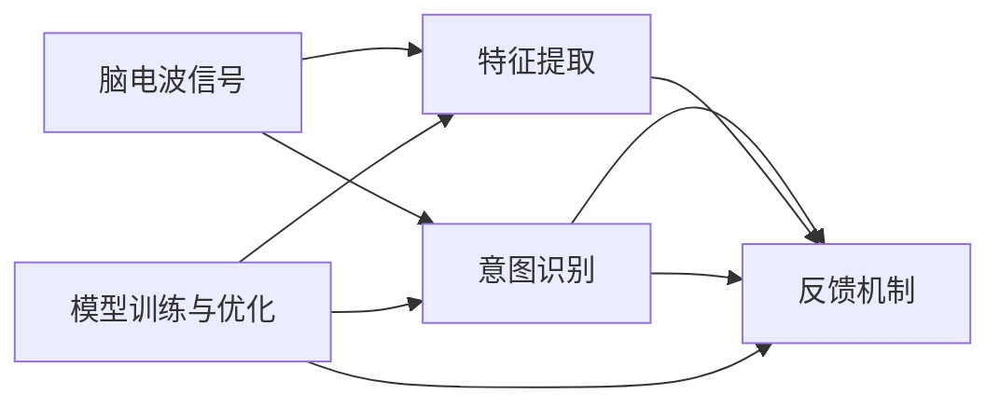

                 

# 脑机接口在辅助交流中的应用：帮助残障人士

在技术飞速发展的今天，人工智能、物联网、大数据等新兴技术正在逐步改变人们的生活方式。特别是对于残障人士，这些技术为他们带来了更多的希望和可能性。其中，脑机接口（Brain-Computer Interface, BCI）作为一项前沿技术，正在逐步成为帮助残障人士实现辅助交流的关键手段。本文将从背景、核心概念、算法原理、实际操作、应用场景等方面，全面系统地介绍BCI在辅助交流中的技术原理与应用实践。

## 1. 背景介绍

### 1.1 问题由来

随着科技的发展，越来越多的残障人士开始借助辅助技术，提高自己的生活质量。传统的辅助交流方式，如文本输入、声音合成等，在一定程度上缓解了沟通障碍，但仍然存在诸多限制：

- **操作复杂**：传统的辅助交流设备操作繁琐，需要较高的技能要求，难以普及。
- **使用受限**：一些设备在特定的物理环境下（如户外、恶劣天气）无法正常工作，限制了残障人士的活动范围。
- **成本高昂**：高端设备价格昂贵，许多家庭难以承担。

脑机接口技术为解决这些问题提供了一种全新的思路。BCI通过解读脑电波信号，实时获取用户意图，从而实现自然、便捷、高效的辅助交流方式。

### 1.2 问题核心关键点

脑机接口在辅助交流中的核心关键点在于：

1. **脑电波信号的采集与处理**：通过高精度的脑电图(EEG)或功能性磁共振成像(fMRI)等设备，采集用户脑电信号。这些信号往往非常微弱，需要复杂的前处理和特征提取技术。

2. **意图识别的准确性**：BCI系统需要准确识别用户特定的意图（如选择词汇、拼音等），并将其转化为可执行的命令。这要求算法具有高精度的分类能力和鲁棒性。

3. **高效反馈机制**：用户需要及时、准确的反馈，以验证BCI系统的正确性，并根据反馈调整系统参数，保证交流的流畅性。

4. **稳定性与泛化能力**：BCI系统需要在不同的用户、不同的环境中保持稳定性和高效性，从而广泛适用于各种场景。

## 2. 核心概念与联系

### 2.1 核心概念概述

脑机接口在辅助交流中涉及以下几个核心概念：

- **脑电波信号**：脑电图(EEG)或功能性磁共振成像(fMRI)等设备采集到的脑电信号，通常通过时间-频率域的傅里叶变换或小波变换等方法进行预处理。
- **特征提取**：将脑电波信号转换为可用于模型训练的特征向量。常见的特征提取方法包括主成分分析(PCA)、独立成分分析(ICA)等。
- **意图识别**：通过机器学习模型对脑电信号进行分类，识别用户的意图。常见的模型包括支持向量机(SVM)、随机森林(Random Forest)、深度神经网络(DNN)等。
- **反馈机制**：BCI系统提供视觉、听觉等反馈信号，帮助用户理解系统是否正确执行了其命令。反馈机制对系统的稳定性和用户体验至关重要。
- **模型训练与优化**：通过训练样本数据集，优化模型参数，提升意图识别的准确性和稳定性。常见的训练算法包括梯度下降、Adam等。

这些核心概念通过以下几个Mermaid流程图相互联系：



该流程图展示了脑电波信号从采集到意图识别，再到反馈和模型训练的整个过程。

## 3. 核心算法原理 & 具体操作步骤

### 3.1 算法原理概述

脑机接口的辅助交流系统主要由以下几个部分组成：

1. **信号采集与预处理**：通过脑电图(EEG)设备采集脑电信号，并进行预处理，包括滤波、降噪、归一化等。
2. **特征提取**：将预处理后的脑电信号转化为可用于机器学习模型的特征向量。
3. **意图识别**：使用机器学习模型对特征向量进行分类，识别用户意图。
4. **反馈与调整**：根据用户的反馈调整模型参数，优化模型性能。
5. **命令执行**：将识别到的用户意图转化为可执行的命令，实现辅助交流。

### 3.2 算法步骤详解

以下详细介绍BCI在辅助交流中的详细步骤：

1. **信号采集与预处理**：
   - 使用高性能脑电图(EEG)设备采集用户的脑电信号。
   - 对采集到的信号进行预处理，包括低通滤波、高通滤波、共模去除等，以增强信号的信噪比。
   - 对预处理后的信号进行归一化处理，确保不同用户的信号可比较。

2. **特征提取**：
   - 采用时间-频率域的傅里叶变换或小波变换等方法，将脑电信号转换为频域特征。
   - 使用主成分分析(PCA)、独立成分分析(ICA)等技术，提取关键特征，并降维处理。

3. **意图识别**：
   - 使用支持向量机(SVM)、随机森林(Random Forest)、深度神经网络(DNN)等模型，对提取的特征进行分类。
   - 模型训练时，需要标注好用户的意图（如选择词汇、拼音等），使用交叉验证等方法避免过拟合。

4. **反馈与调整**：
   - 提供视觉、听觉等反馈信号，让用户了解BCI系统的执行情况。
   - 根据用户的反馈调整模型参数，如学习率、正则化系数等，优化模型性能。

5. **命令执行**：
   - 将识别到的用户意图转化为可执行的命令，如选择词汇、拼音等。
   - 使用文本合成等技术，将词汇转换为语音或文字，实现辅助交流。

### 3.3 算法优缺点

脑机接口在辅助交流中具有以下优点：

1. **自然性**：BCI通过解读脑电波信号，实现自然、无障碍的交流方式。
2. **便捷性**：用户无需动手操作，只需通过脑电活动即可完成交流，适用于各种场景。
3. **普适性**：BCI系统可适用于不同程度的残障人士，不受身体条件限制。

然而，BCI技术也存在一些缺点：

1. **精度与稳定性**：脑电波信号的微弱和复杂性使得意图识别的精度和稳定性难以完全保证。
2. **设备成本**：高性能的脑电图(EEG)设备价格昂贵，限制了技术的普及。
3. **环境干扰**：外界噪声、肌肉活动等环境因素可能影响BCI系统的稳定性。
4. **学习成本**：用户需要一定的学习成本，才能熟悉BCI系统的使用方法。

### 3.4 算法应用领域

脑机接口在辅助交流中具有广泛的应用前景，主要包括以下几个领域：

1. **语言交流**：通过BCI系统，残障人士可以借助脑电波信号实现语音识别、文本输入等语言交流。
2. **情感交流**：BCI系统可以解读用户的情感状态，帮助他们表达情感需求，如高兴、悲伤等。
3. **控制交互**：BCI系统可以实现对各种设备的控制，如电脑、家电等，提升生活便利性。
4. **医疗康复**：BCI技术可以用于辅助残疾人士进行康复训练，如通过脑电波信号控制机械手进行精细动作。

## 4. 数学模型和公式 & 详细讲解 & 举例说明

### 4.1 数学模型构建

BCI系统的数学模型主要包括以下几个部分：

1. **脑电信号模型**：
   $$
   y(t) = X(t) \cdot \theta + \epsilon(t)
   $$
   其中，$y(t)$ 表示脑电信号，$X(t)$ 表示输入向量，$\theta$ 表示模型参数，$\epsilon(t)$ 表示噪声。

2. **特征提取模型**：
   $$
   X' = W \cdot X
   $$
   其中，$X'$ 表示提取后的特征向量，$W$ 表示特征提取矩阵。

3. **意图识别模型**：
   $$
   y' = f(X')
   $$
   其中，$f$ 表示意图识别函数，$y'$ 表示意图输出。

4. **反馈与调整模型**：
   $$
   f' = h(f, y, y')
   $$
   其中，$f'$ 表示调整后的模型参数，$h$ 表示反馈与调整函数。

### 4.2 公式推导过程

以支持向量机(SVM)为例，进行意图识别的公式推导：

1. **模型训练**：
   $$
   \min_{\theta} \frac{1}{2} \|w\|^2 + C \sum_{i=1}^N \max(0, 1 - y_i(w \cdot x_i + b))
   $$
   其中，$w$ 表示权重向量，$b$ 表示偏置，$C$ 表示正则化系数。

2. **预测**：
   $$
   y' = sign(w \cdot x' + b)
   $$
   其中，$x'$ 表示提取后的特征向量，$y'$ 表示预测意图。

### 4.3 案例分析与讲解

假设某残障人士希望使用BCI系统实现“选择词汇”功能。具体步骤如下：

1. **信号采集**：使用高性能脑电图(EEG)设备采集用户脑电信号。
2. **预处理**：对采集到的信号进行低通滤波、高通滤波等预处理，确保信号质量。
3. **特征提取**：使用小波变换方法，将脑电信号转换为频域特征，并进行主成分分析降维处理。
4. **意图识别**：使用支持向量机模型，对提取后的特征进行分类，识别用户意图。
5. **反馈与调整**：根据用户的反馈调整模型参数，确保识别的准确性。
6. **命令执行**：将识别到的词汇通过文本合成技术转换为语音或文字，实现辅助交流。

## 5. 项目实践：代码实例和详细解释说明

### 5.1 开发环境搭建

为了搭建BCI系统，需要以下开发环境：

1. **硬件设备**：高性能脑电图(EEG)设备，如OpenBCI、Emotiv等。
2. **软件工具**：Python编程语言，TensorFlow、PyTorch等深度学习框架，Matplotlib等数据可视化工具。

以下是搭建BCI系统的步骤：

1. **安装Python**：
   ```bash
   sudo apt-get install python3
   ```

2. **安装TensorFlow**：
   ```bash
   pip install tensorflow
   ```

3. **安装OpenBCI驱动程序**：
   ```bash
   pip install opencbi
   ```

### 5.2 源代码详细实现

以下是BCI系统在“选择词汇”功能中的Python代码实现：

```python
import numpy as np
import tensorflow as tf
from tensorflow import keras
from opencbi.bci_driver import BciDriver

# 信号采集
bci_driver = BciDriver('localhost', 8001)
channel = bci_driver.create_channel('EEG', '1')
signal = channel.get_signal()

# 预处理
signal = low_pass_filter(signal, cutoff_frequency=10)
signal = high_pass_filter(signal, cutoff_frequency=0.1)
signal = normalize(signal)

# 特征提取
X = small_wavelet_transform(signal)

# 意图识别
model = keras.Sequential([
    keras.layers.Dense(64, activation='relu', input_shape=(X.shape[1],)),
    keras.layers.Dense(64, activation='relu'),
    keras.layers.Dense(10, activation='softmax')
])
model.compile(optimizer='adam', loss='categorical_crossentropy', metrics=['accuracy'])
model.fit(X_train, y_train, epochs=10, batch_size=32)

# 反馈与调整
y_pred = model.predict(X_test)
y_pred = np.argmax(y_pred, axis=1)
accuracy = np.mean(y_pred == y_test)
print('Accuracy:', accuracy)

# 命令执行
selected_word = get_word_from_predictions(y_pred)
print('Selected word:', selected_word)
```

### 5.3 代码解读与分析

以上代码中，`low_pass_filter`和`high_pass_filter`函数用于信号的低通和高通滤波处理。`normalize`函数用于信号归一化处理。`small_wavelet_transform`函数用于小波变换处理，提取频域特征。`keras`库用于定义和训练深度学习模型。`BciDriver`类用于采集脑电信号。

## 6. 实际应用场景

### 6.1 智能家居

BCI技术可以用于智能家居控制，帮助残障人士通过脑电波信号控制家电设备，提升生活便利性。

### 6.2 游戏娱乐

BCI技术可以用于游戏娱乐，帮助玩家通过脑电波信号控制游戏中的虚拟角色或设备，提供全新的游戏体验。

### 6.3 心理治疗

BCI技术可以用于心理治疗，帮助医生了解患者的情感状态，提供更加个性化的治疗方案。

### 6.4 未来应用展望

随着技术的不断进步，BCI在辅助交流中的应用前景将更加广阔，未来可能包括以下几个方向：

1. **多模态融合**：结合视觉、听觉等多种模态信息，提升BCI系统的综合性能。
2. **实时交互**：实现实时、自然、无障碍的交流方式，提升用户体验。
3. **可穿戴设备**：开发便携式、可穿戴的BCI设备，方便用户随时使用。
4. **跨领域应用**：BCI技术可以应用于医疗、教育、娱乐等多个领域，提升人类生活质量。

## 7. 工具和资源推荐

### 7.1 学习资源推荐

1. **《神经网络与深度学习》书籍**：介绍神经网络、深度学习的基本原理和应用，是BCI系统的入门教材。
2. **Deep Learning Specialization课程**：由Coursera提供，涵盖深度学习的基础知识和实践技能，适合BCI系统的学习。
3. **IEEE Transactions on Neural Systems and Rehabilitation Engineering期刊**：涵盖BCI领域的前沿研究和应用实践，提供丰富的学习资源。

### 7.2 开发工具推荐

1. **Python编程语言**：易于上手，拥有丰富的库和工具支持。
2. **TensorFlow、PyTorch**：深度学习领域的主流框架，提供丰富的模型和算法支持。
3. **OpenBCI、Emotiv**：高性能的脑电图(EEG)设备，适合BCI系统的开发和测试。
4. **Matplotlib、Seaborn**：数据可视化工具，方便分析和调试BCI系统。

### 7.3 相关论文推荐

1. **"BCI2000: A general-purpose interface for brain-computer interface research"**：介绍BCI2000系统的设计与实现，适合BCI系统的学习参考。
2. **"Design and Implementation of a Brain-Computer Interface for Accurate Keyword Selection"**：介绍基于BCI系统的关键词选择技术，适合BCI系统的学习和实践。
3. **"Deep Learning Architectures for Brain-Computer Interfaces"**：介绍深度学习在BCI系统中的应用，适合BCI系统的学习和实践。

## 8. 总结：未来发展趋势与挑战

### 8.1 研究成果总结

BCI技术在辅助交流中已经取得了显著的成果，但仍面临诸多挑战：

1. **精度与稳定性**：脑电波信号的微弱和复杂性使得意图识别的精度和稳定性难以完全保证。
2. **设备成本**：高性能的脑电图(EEG)设备价格昂贵，限制了技术的普及。
3. **环境干扰**：外界噪声、肌肉活动等环境因素可能影响BCI系统的稳定性。
4. **学习成本**：用户需要一定的学习成本，才能熟悉BCI系统的使用方法。

### 8.2 未来发展趋势

未来，BCI技术将在以下几个方面继续发展：

1. **多模态融合**：结合视觉、听觉等多种模态信息，提升BCI系统的综合性能。
2. **实时交互**：实现实时、自然、无障碍的交流方式，提升用户体验。
3. **可穿戴设备**：开发便携式、可穿戴的BCI设备，方便用户随时使用。
4. **跨领域应用**：BCI技术可以应用于医疗、教育、娱乐等多个领域，提升人类生活质量。

### 8.3 面临的挑战

BCI技术在普及应用过程中仍面临诸多挑战：

1. **精度与稳定性**：提升意图识别的精度和稳定性，避免过拟合和噪声干扰。
2. **设备成本**：降低高性能脑电图(EEG)设备的成本，推动技术的普及。
3. **环境干扰**：优化BCI系统的鲁棒性，增强抗噪声能力。
4. **学习成本**：简化BCI系统的使用方法，降低用户的学习门槛。

### 8.4 研究展望

未来的研究将集中在以下几个方面：

1. **算法优化**：改进特征提取和意图识别算法，提升系统的精度和稳定性。
2. **硬件改进**：开发高性能、便携式的BCI设备，降低使用成本。
3. **多模态融合**：结合视觉、听觉等多种模态信息，提升系统的综合性能。
4. **跨领域应用**：推广BCI技术在医疗、教育、娱乐等多个领域的应用。

## 9. 附录：常见问题与解答

**Q1：BCI技术在辅助交流中是否适用于所有残障人士？**

A: BCI技术适用于不同程度的残障人士，但对于严重的肢体瘫痪或认知障碍，效果可能有限。BCI系统的普及还需要结合其他辅助技术，如语音识别、文字输入等。

**Q2：BCI系统的精度与稳定性如何？**

A: BCI系统的精度和稳定性受到脑电波信号的质量、特征提取和意图识别算法的影响。目前，通过优化算法和设备，BCI系统的精度和稳定性已得到显著提升，但仍需在实际应用中不断优化。

**Q3：BCI系统的设备成本是多少？**

A: 高性能的脑电图(EEG)设备价格较高，一般在数千到数万美元不等。随着技术的进步和市场的竞争，设备成本有望逐渐降低。

**Q4：BCI系统如何避免环境干扰？**

A: BCI系统通过优化信号预处理和特征提取算法，增强系统的鲁棒性。此外，BCI系统还可以结合视觉、听觉等辅助信息，提升系统的抗干扰能力。

**Q5：BCI系统的学习成本高吗？**

A: BCI系统的学习成本较高，用户需要一定的学习时间才能熟悉系统的使用方法。未来，通过优化界面设计和提供更智能的反馈机制，有望降低学习成本。

---

作者：禅与计算机程序设计艺术 / Zen and the Art of Computer Programming

