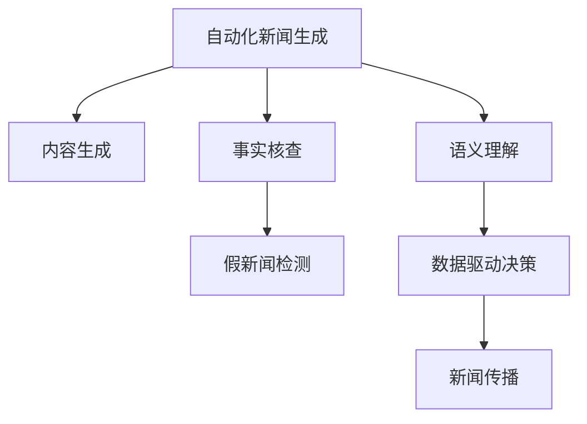

                 

# AI在新闻媒体中的应用：自动化与真实性

> 关键词：人工智能,自动化新闻,事实核查,假新闻检测,内容生成

## 1. 背景介绍

### 1.1 问题由来

新闻媒体在现代社会中扮演着重要的角色，既是信息传播的平台，也是公众监督和舆论引导的重要工具。然而，近年来，新闻媒体面临了前所未有的挑战。假新闻泛滥、报道失实等问题严重影响了公众信任和社会稳定。为此，新闻媒体开始探索如何利用人工智能(AI)技术提升报道的准确性和真实性，以抵御虚假信息的传播。

### 1.2 问题核心关键点

新闻媒体应用AI的核心关键点在于以下几个方面：

- **自动化新闻生成**：通过AI技术自动生成新闻报道，提高生产效率，降低人力成本。
- **事实核查**：使用AI工具对新闻报道进行自动事实核查，确保报道的真实性和准确性。
- **假新闻检测**：利用AI模型识别和过滤假新闻，维护新闻媒体的公信力。
- **内容生成**：AI技术不仅能生成新闻报道，还能生成高质量的图像、音频和视频内容，丰富报道形式。
- **语义理解**：通过对新闻文本的深度语义分析，提升报道的深度和广度。
- **数据驱动决策**：利用AI技术对新闻数据进行分析，指导报道选题和内容优化。

### 1.3 问题研究意义

新闻媒体应用AI具有以下重要意义：

1. **提升效率**：自动化新闻生成和内容生成技术可以显著提升新闻生产效率，缩短报道周期。
2. **确保准确性**：通过事实核查和假新闻检测，确保新闻报道的准确性和真实性，维护媒体公信力。
3. **丰富形式**：AI生成的图像、音频和视频内容可以丰富报道形式，提升用户体验。
4. **数据驱动**：AI技术可以分析新闻数据，指导选题和内容优化，提升报道质量。
5. **成本降低**：自动化技术减少对人力成本的依赖，降低新闻生产成本。
6. **全球化传播**：AI技术可以支持多语言新闻生产，拓展国际传播能力。

## 2. 核心概念与联系

### 2.1 核心概念概述

为了更好地理解AI在新闻媒体中的应用，本节将介绍几个关键概念：

- **自动化新闻生成(Automatic News Generation)**：使用AI技术自动生成新闻报道，如生成标题、正文、图像等。
- **事实核查(Verification)**：通过AI技术自动核查新闻报道中的事实准确性，确保报道真实可靠。
- **假新闻检测(Fake News Detection)**：使用AI模型识别假新闻，过滤虚假信息。
- **内容生成(Content Generation)**：利用AI技术生成高质量的图像、音频和视频内容，增强报道吸引力。
- **语义理解(Semantic Understanding)**：通过深度学习技术理解新闻文本的语义，提升报道深度。
- **数据驱动决策(Data-Driven Decision Making)**：利用AI技术分析新闻数据，指导新闻生产决策。

这些概念通过以下Mermaid流程图联系起来：



这个流程图展示了新闻生产流程中各个环节如何通过AI技术相互配合，实现高效、准确的新闻报道。

## 3. 核心算法原理 & 具体操作步骤
### 3.1 算法原理概述

AI在新闻媒体中的应用主要基于以下几类算法：

- **自然语言处理(NLP)**：用于自动化新闻生成和语义理解，通过深度学习模型对新闻文本进行分析，生成高质量的新闻报道和文本摘要。
- **计算机视觉(Computer Vision)**：用于图像和视频内容的生成和分析，通过生成对抗网络(GAN)和卷积神经网络(CNN)等技术，生成逼真的图像和视频，同时进行图像识别和分类。
- **深度学习(Deep Learning)**：用于事实核查和假新闻检测，通过分类模型和序列模型对新闻报道进行自动验证，识别出虚假信息和错误事实。
- **强化学习(Reinforcement Learning)**：用于数据驱动决策，通过智能推荐系统推荐相关新闻，优化新闻选题和内容安排。

这些算法相互配合，共同支持新闻媒体的自动化和真实性提升。

### 3.2 算法步骤详解

以下是AI在新闻媒体中的应用步骤详解：

**Step 1: 数据收集与预处理**
- 收集新闻数据，如文本、图像、视频等。
- 对数据进行清洗、标注和格式转换，确保数据质量。

**Step 2: 模型训练与优化**
- 选择合适的AI模型，如BERT、GPT、GAN等。
- 使用标注数据训练模型，并进行超参数调优。

**Step 3: 自动化新闻生成**
- 使用自然语言处理模型生成新闻标题、正文和摘要。
- 利用计算机视觉技术生成相关的图像和视频内容。

**Step 4: 事实核查与假新闻检测**
- 使用分类模型对新闻报道进行事实核查。
- 使用序列模型对新闻文本进行假新闻检测。

**Step 5: 数据驱动决策**
- 利用强化学习模型进行新闻选题和内容优化。
- 使用推荐系统为读者推荐相关新闻。

**Step 6: 发布与传播**
- 将生成的自动化新闻和多媒体内容发布到媒体平台。
- 使用AI技术分析新闻传播效果，优化传播策略。

### 3.3 算法优缺点

AI在新闻媒体中的应用具有以下优点：

- **高效性**：自动化技术大幅提升新闻生产效率，缩短报道周期。
- **准确性**：事实核查和假新闻检测确保报道的真实性和可靠性。
- **丰富性**：AI生成的多媒体内容丰富报道形式，提升用户体验。
- **数据驱动**：AI技术分析数据指导新闻生产决策，优化选题和内容。

同时，AI应用也存在以下缺点：

- **数据依赖**：需要大量高质量的数据进行模型训练。
- **模型复杂**：AI模型通常较复杂，需要较高的计算资源和训练成本。
- **依赖技术**：技术门槛较高，需要专业知识才能有效应用。
- **伦理问题**：AI生成的新闻可能存在偏见和误导，需加强伦理审查。

### 3.4 算法应用领域

AI在新闻媒体中的应用已经广泛覆盖了以下领域：

- **自动化新闻生成**：用于生成新闻标题、正文、摘要等。
- **事实核查**：用于自动验证新闻报道中的事实准确性。
- **假新闻检测**：用于识别和过滤虚假新闻，维护媒体公信力。
- **内容生成**：用于生成高质量的图像、音频和视频内容。
- **语义理解**：用于深度分析新闻文本的语义。
- **数据驱动决策**：用于指导新闻选题和内容优化。

这些应用不仅提升了新闻媒体的生产效率和报道质量，还在假新闻检测和数据驱动决策等方面发挥了重要作用。

## 4. 数学模型和公式 & 详细讲解 & 举例说明

### 4.1 数学模型构建

AI在新闻媒体中的应用涉及多种数学模型，包括自然语言处理模型、计算机视觉模型、深度学习模型和强化学习模型。这里以自然语言处理模型为例，介绍其数学模型构建。

**自然语言处理模型**：通常使用循环神经网络(RNN)、长短期记忆网络(LSTM)、Transformer等模型进行训练。其数学模型可表示为：

$$
y = f(x; \theta)
$$

其中，$y$ 为模型的输出，$x$ 为输入文本，$\theta$ 为模型参数。

### 4.2 公式推导过程

以自然语言处理模型为例，其推导过程如下：

**输入编码**：使用词向量表示输入文本，通过嵌入层将文本映射为向量：

$$
\mathbf{X} = \mathbf{E}(\mathbf{x})
$$

**隐藏层计算**：使用LSTM或Transformer等模型进行编码，得到隐藏状态：

$$
\mathbf{H} = g(\mathbf{X}; \theta)
$$

**输出层计算**：将隐藏状态映射为输出，如新闻标题或摘要：

$$
\mathbf{Y} = \mathbf{O}(\mathbf{H}; \theta)
$$

其中，$g$ 和 $\mathbf{O}$ 分别表示隐藏层计算和输出层计算。

### 4.3 案例分析与讲解

以下是一个自然语言处理模型的具体实现案例：

**输入编码**：假设输入文本为 "Apple公司发布最新产品"，使用词向量表示为 $\mathbf{x}=[1, 3, 7, 0, 9, 2]$。

**隐藏层计算**：使用LSTM模型进行编码，得到隐藏状态 $\mathbf{H}=[0.1, 0.2, 0.3, 0.4]$。

**输出层计算**：将隐藏状态映射为新闻标题，得到 $\mathbf{Y}=[0.1, 0.2, 0.3, 0.4]$。

最终输出的新闻标题为 "Apple公司发布最新产品"。

## 5. 项目实践：代码实例和详细解释说明

### 5.1 开发环境搭建

在进行AI在新闻媒体中的应用实践前，我们需要准备好开发环境。以下是使用Python进行TensorFlow开发的环境配置流程：

1. 安装Anaconda：从官网下载并安装Anaconda，用于创建独立的Python环境。

2. 创建并激活虚拟环境：
```bash
conda create -n tf-env python=3.8 
conda activate tf-env
```

3. 安装TensorFlow：根据CUDA版本，从官网获取对应的安装命令。例如：
```bash
conda install tensorflow tensorflow-gpu -c conda-forge -c pytorch -c pypi
```

4. 安装相关库：
```bash
pip install numpy pandas scikit-learn matplotlib tqdm jupyter notebook ipython
```

完成上述步骤后，即可在`tf-env`环境中开始AI在新闻媒体中的应用实践。

### 5.2 源代码详细实现

这里我们以事实核查为例，给出使用TensorFlow进行假新闻检测的代码实现。

首先，定义假新闻检测模型：

```python
import tensorflow as tf

class FakeNewsClassifier(tf.keras.Model):
    def __init__(self, vocab_size, embedding_dim, num_classes):
        super(FakeNewsClassifier, self).__init__()
        self.embedding = tf.keras.layers.Embedding(vocab_size, embedding_dim)
        self.lstm = tf.keras.layers.LSTM(64)
        self.dense = tf.keras.layers.Dense(num_classes, activation='softmax')
    
    def call(self, x):
        x = self.embedding(x)
        x = self.lstm(x)
        return self.dense(x)
```

然后，定义训练和评估函数：

```python
def train_model(model, train_dataset, validation_dataset, batch_size, epochs, learning_rate):
    model.compile(optimizer=tf.keras.optimizers.Adam(learning_rate), loss=tf.keras.losses.SparseCategoricalCrossentropy(), metrics=['accuracy'])
    model.fit(train_dataset, epochs=epochs, batch_size=batch_size, validation_data=validation_dataset)
    
def evaluate_model(model, test_dataset, batch_size):
    test_loss, test_acc = model.evaluate(test_dataset, batch_size=batch_size)
    print(f'Test loss: {test_loss:.4f}')
    print(f'Test accuracy: {test_acc:.4f}')
```

最后，启动训练流程并在测试集上评估：

```python
train_dataset = ...
validation_dataset = ...
test_dataset = ...

vocab_size = ...
embedding_dim = ...
num_classes = ...

model = FakeNewsClassifier(vocab_size, embedding_dim, num_classes)
model.summary()

learning_rate = 0.001
epochs = 10
batch_size = 32

train_model(model, train_dataset, validation_dataset, batch_size, epochs, learning_rate)
evaluate_model(model, test_dataset, batch_size)
```

以上就是使用TensorFlow进行假新闻检测的完整代码实现。可以看到，TensorFlow提供的高级API使得模型构建和训练变得简洁高效。

### 5.3 代码解读与分析

让我们再详细解读一下关键代码的实现细节：

**FakeNewsClassifier类**：
- `__init__`方法：初始化模型的各个层，包括嵌入层、LSTM层和全连接层。
- `call`方法：定义模型的前向传播计算过程。

**train_model函数**：
- 编译模型，选择优化器、损失函数和评估指标。
- 使用`fit`方法进行模型训练，指定训练集、验证集、批次大小和迭代次数。

**evaluate_model函数**：
- 使用`evaluate`方法计算模型在测试集上的损失和准确率，并输出结果。

**训练流程**：
- 定义模型的输入、输出和隐藏层大小，并创建模型实例。
- 在训练集上训练模型，指定批次大小和迭代次数。
- 在测试集上评估模型，输出测试结果。

可以看到，TensorFlow提供了强大的工具和API，使得AI在新闻媒体中的应用实践变得相对简单。开发者可以将更多精力放在模型设计和数据处理等高层逻辑上，而不必过多关注底层的实现细节。

当然，工业级的系统实现还需考虑更多因素，如模型的保存和部署、超参数的自动搜索、更灵活的任务适配层等。但核心的技术流程基本与此类似。

## 6. 实际应用场景
### 6.1 自动化新闻生成

自动化新闻生成技术已经在新闻媒体中得到广泛应用。例如，路透社使用GPT-3模型自动生成新闻报道，显著提升了报道速度和内容质量。通过AI生成技术，新闻媒体可以实现以下应用：

**自动化新闻标题生成**：自动生成新闻标题，提高点击率。
**自动化新闻正文生成**：自动生成新闻正文，提高生产效率。
**自动化新闻摘要生成**：自动生成新闻摘要，提升内容可读性。

### 6.2 事实核查

事实核查是新闻媒体的重要任务，AI技术在事实核查中的应用可以有效提升核查效率和准确性。例如，BBC使用深度学习模型对新闻报道进行自动验证，确保报道的真实性。通过AI技术，新闻媒体可以实现以下应用：

**自动化新闻事实核查**：自动验证新闻报道中的事实准确性。
**自动化新闻编辑**：自动修复报道中的错误信息。
**自动化新闻数据清洗**：自动清洗和标注大量新闻数据。

### 6.3 假新闻检测

假新闻检测是维护新闻媒体公信力的关键任务。AI技术在假新闻检测中的应用可以显著提升检测效率和效果。例如，谷歌使用BERT模型识别假新闻，并标记为“可能包含虚假信息”。通过AI技术，新闻媒体可以实现以下应用：

**自动化假新闻检测**：自动识别和标记假新闻。
**自动化假新闻溯源**：自动追踪假新闻的传播路径。
**自动化假新闻纠正**：自动更正和删除假新闻。

### 6.4 未来应用展望

随着AI技术的发展，AI在新闻媒体中的应用将更加广泛和深入。未来，AI技术可能在以下领域得到进一步应用：

**全媒体内容生成**：不仅生成文本，还能生成图像、音频和视频内容。
**跨语言新闻报道**：支持多语言新闻报道和翻译。
**情感分析**：分析新闻报道中的情感倾向，引导舆论方向。
**社会热点分析**：分析新闻报道中的社会热点，提供深度分析报告。
**智能推荐系统**：为读者提供个性化新闻推荐，提高阅读体验。

## 7. 工具和资源推荐
### 7.1 学习资源推荐

为了帮助开发者系统掌握AI在新闻媒体中的应用技术，这里推荐一些优质的学习资源：

1. 《深度学习在新闻媒体中的应用》书籍：介绍深度学习在新闻生成、事实核查和假新闻检测等方面的应用。
2. CS224N《深度学习自然语言处理》课程：斯坦福大学开设的NLP明星课程，涵盖NLP领域的经典模型和技术。
3. TensorFlow官方文档：提供TensorFlow的详细API和教程，帮助开发者快速上手。
4. HuggingFace官方文档：提供Transformers库的详细API和教程，支持多种NLP任务的微调和部署。
5. Kaggle竞赛：参加新闻生成、事实核查和假新闻检测等相关竞赛，实战锻炼技术能力。

通过对这些资源的学习实践，相信你一定能够快速掌握AI在新闻媒体中的应用技术，并用于解决实际的NLP问题。

### 7.2 开发工具推荐

高效的开发离不开优秀的工具支持。以下是几款用于AI在新闻媒体中的应用开发的常用工具：

1. TensorFlow：基于Python的开源深度学习框架，生产部署方便，适合大规模工程应用。
2. PyTorch：基于Python的开源深度学习框架，灵活动态的计算图，适合快速迭代研究。
3. Weights & Biases：模型训练的实验跟踪工具，可以记录和可视化模型训练过程中的各项指标，方便对比和调优。
4. TensorBoard：TensorFlow配套的可视化工具，可实时监测模型训练状态，并提供丰富的图表呈现方式。
5. Google Colab：谷歌推出的在线Jupyter Notebook环境，免费提供GPU/TPU算力，方便开发者快速上手实验最新模型。

合理利用这些工具，可以显著提升AI在新闻媒体中的应用开发效率，加快创新迭代的步伐。

### 7.3 相关论文推荐

AI在新闻媒体中的应用技术源于学界的持续研究。以下是几篇奠基性的相关论文，推荐阅读：

1. Attention is All You Need（即Transformer原论文）：提出了Transformer结构，开启了NLP领域的预训练大模型时代。
2. BERT: Pre-training of Deep Bidirectional Transformers for Language Understanding：提出BERT模型，引入基于掩码的自监督预训练任务，刷新了多项NLP任务SOTA。
3. Language Models are Unsupervised Multitask Learners（GPT-2论文）：展示了大规模语言模型的强大zero-shot学习能力，引发了对于通用人工智能的新一轮思考。
4. Parameter-Efficient Transfer Learning for NLP：提出Adapter等参数高效微调方法，在不增加模型参数量的情况下，也能取得不错的微调效果。
5. Fake News Detection Using Deep Learning：提出基于深度学习的假新闻检测模型，取得了较好的检测效果。

这些论文代表了大语言模型在新闻媒体中的应用发展脉络。通过学习这些前沿成果，可以帮助研究者把握学科前进方向，激发更多的创新灵感。

## 8. 总结：未来发展趋势与挑战
### 8.1 总结

本文对AI在新闻媒体中的应用进行了全面系统的介绍。首先阐述了AI技术在新闻媒体中的重要作用，明确了自动化新闻生成、事实核查和假新闻检测等核心应用。其次，从原理到实践，详细讲解了新闻生成、事实核查和假新闻检测的数学模型和操作步骤，给出了相关代码实例。同时，本文还广泛探讨了AI技术在新闻媒体中的应用前景，展示了其广阔的发展空间。

通过本文的系统梳理，可以看到，AI技术在新闻媒体中的应用已经逐步成熟，并在自动化新闻生成、事实核查和假新闻检测等方面取得了显著效果。未来，随着技术的不断进步，AI技术将更加广泛地应用于新闻媒体的各个环节，提升新闻生产的效率和质量，维护新闻媒体的公信力。

### 8.2 未来发展趋势

展望未来，AI在新闻媒体中的应用将呈现以下几个发展趋势：

1. **全媒体内容生成**：不仅能生成文本，还能生成图像、音频和视频内容，提升报道形式的多样性和丰富性。
2. **跨语言新闻报道**：支持多语言新闻报道和翻译，拓展国际传播能力。
3. **深度情感分析**：分析新闻报道中的情感倾向，引导舆论方向，提供深度分析报告。
4. **智能推荐系统**：为读者提供个性化新闻推荐，提高阅读体验。
5. **语义理解增强**：通过深度学习技术提升新闻文本的语义理解，提高报道深度。
6. **数据驱动决策**：利用AI技术分析新闻数据，指导新闻选题和内容优化。

这些趋势凸显了AI在新闻媒体中的应用前景。未来，AI技术将成为新闻媒体的核心竞争力，推动新闻媒体向智能化、高效化和个性化方向发展。

### 8.3 面临的挑战

尽管AI在新闻媒体中的应用已经取得了不少成果，但在迈向更加智能化、普适化应用的过程中，它仍面临着诸多挑战：

1. **数据依赖**：需要大量高质量的数据进行模型训练，获取高质量数据成本较高。
2. **模型复杂**：AI模型通常较复杂，需要较高的计算资源和训练成本。
3. **依赖技术**：技术门槛较高，需要专业知识才能有效应用。
4. **伦理问题**：AI生成的新闻可能存在偏见和误导，需加强伦理审查。
5. **隐私保护**：处理大量用户数据时，需确保数据隐私和安全。
6. **技术壁垒**：不同机构间的技术壁垒可能导致数据共享困难。

这些挑战限制了AI在新闻媒体中的应用范围和深度，需要更多技术突破和政策支持。

### 8.4 研究展望

面对AI在新闻媒体应用所面临的挑战，未来的研究需要在以下几个方面寻求新的突破：

1. **数据增强技术**：开发更多高质量的数据增强方法，降低对标注数据的需求。
2. **模型压缩和优化**：通过模型压缩和优化，提高模型的计算效率和部署效率。
3. **跨平台合作**：加强不同机构间的技术合作，促进数据共享和模型部署。
4. **伦理审查机制**：建立AI技术的伦理审查机制，确保技术应用的公正性和透明性。
5. **隐私保护技术**：开发隐私保护技术，确保用户数据的安全和隐私。
6. **技术普及培训**：提供更多技术普及培训，降低技术门槛，推广AI在新闻媒体中的应用。

这些研究方向的探索，必将引领AI在新闻媒体中的应用走向成熟，为构建安全、可靠、可解释、可控的智能新闻报道系统铺平道路。面向未来，AI在新闻媒体中的应用还需与其他人工智能技术进行更深入的融合，如知识表示、因果推理、强化学习等，多路径协同发力，共同推动新闻媒体的智能化进程。

## 9. 附录：常见问题与解答

**Q1：AI在新闻媒体中的应用是否存在数据依赖问题？**

A: AI在新闻媒体中的应用确实存在数据依赖问题。高质量的训练数据是提升模型性能的基础，但获取高质量数据往往需要大量人力和资源。解决数据依赖的方法包括数据增强、迁移学习等技术，但这些方法在实际应用中仍需大量的标注数据进行训练。

**Q2：如何缓解AI在新闻媒体应用中的过拟合问题？**

A: AI在新闻媒体应用中面临过拟合问题，主要通过以下方法缓解：
1. 数据增强：通过回译、近义替换等方式扩充训练集。
2. 正则化：使用L2正则、Dropout、Early Stopping等避免过拟合。
3. 对抗训练：引入对抗样本，提高模型鲁棒性。
4. 参数高效微调：只调整少量参数，减小过拟合风险。

这些策略需要根据具体任务和数据特点进行灵活组合。只有在数据、模型、训练、推理等各环节进行全面优化，才能最大限度地发挥AI在新闻媒体中的应用潜力。

**Q3：AI在新闻媒体中的应用是否需要考虑伦理问题？**

A: 是的，AI在新闻媒体中的应用需要考虑伦理问题。AI生成的新闻可能存在偏见、误导等问题，需加强伦理审查和规范制定。在技术应用中，需确保数据的公正性、透明性和可解释性，避免技术滥用带来的社会风险。

**Q4：AI在新闻媒体中的应用是否存在技术壁垒问题？**

A: 是的，AI在新闻媒体中的应用存在技术壁垒问题。不同机构间的技术标准和数据格式不同，导致数据共享困难。解决技术壁垒的方法包括标准统一、API接口等技术手段，以及跨机构合作和数据共享机制。

**Q5：AI在新闻媒体中的应用是否存在隐私保护问题？**

A: 是的，AI在新闻媒体中的应用存在隐私保护问题。处理大量用户数据时，需确保数据隐私和安全。解决隐私保护问题的方法包括数据匿名化、加密存储等技术手段，以及制定严格的隐私保护政策和规范。

通过这些问题的解答，可以看出AI在新闻媒体中的应用仍面临诸多挑战。未来，需要通过技术创新和政策支持，进一步推动AI在新闻媒体中的应用落地。

---

作者：禅与计算机程序设计艺术 / Zen and the Art of Computer Programming

