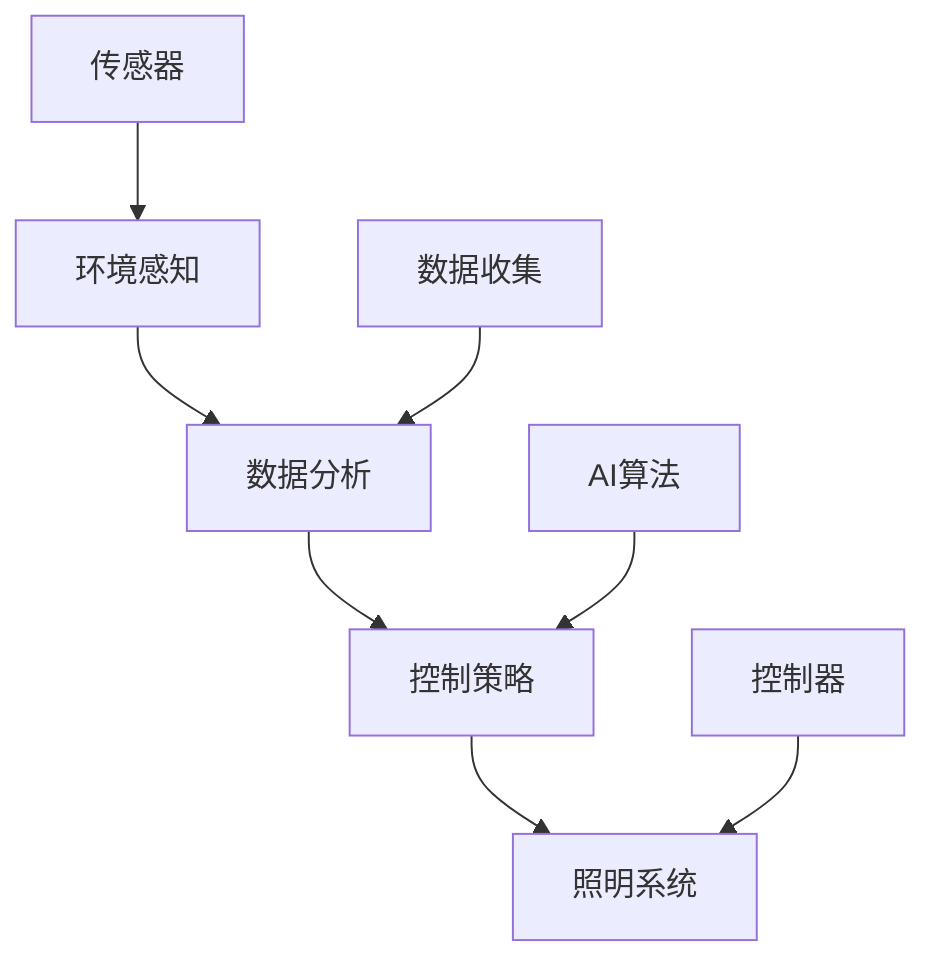

                 

# AI在智能城市照明中的应用：节约能源

> 关键词：智能城市，照明系统，能源管理，AI优化，节约能源

## 1. 背景介绍

### 1.1 问题由来

随着城市化进程的加快，全球城市人口的激增导致能源需求急剧增加，其中电力需求占据了相当大的比例。照明系统作为城市生活中不可或缺的一部分，其能源消耗占据了很大一部分电力需求。然而，传统照明系统存在诸多问题，如能耗高、管理效率低、维护成本高等，这些问题不仅影响了城市能源消耗的合理性，也制约了城市照明系统的可持续发展。

### 1.2 问题核心关键点

本节将聚焦于智能城市照明系统中应用AI技术进行节能优化的核心问题，以及如何通过AI技术优化城市照明系统的能耗。

1. **智能照明系统的定义**：基于传感器、控制系统和AI算法，能够根据环境变化自动调整照明亮度、颜色和开闭状态的照明系统。
2. **AI技术在智能照明系统中的应用**：通过机器学习算法，实时分析环境变化，自动调整照明系统，优化照明能耗，实现节约能源的目标。
3. **智能照明系统优化的关键点**：数据收集、环境分析、控制策略设计、模型训练和系统集成。

### 1.3 问题研究意义

智能城市照明系统的能源管理对于城市的可持续发展和节能减排具有重要意义。通过AI技术优化照明系统，不仅可以降低能源消耗，减少环境污染，还能提升城市生活的舒适度和安全性。此外，智能照明系统的节能优化还可以带来显著的经济效益和社会效益，推动城市智慧化进程。

## 2. 核心概念与联系

### 2.1 核心概念概述

为更好地理解智能城市照明系统中应用AI技术进行节能优化的方法，本节将介绍几个关键概念：

- **智能照明系统**：通过传感器、控制器和AI算法，实现环境感知、智能分析和自动控制的城市照明系统。
- **能源管理**：对能源的生产、传输和使用进行规划、优化和控制，以提高能源利用效率，降低能耗。
- **AI优化**：利用人工智能技术，如机器学习、深度学习等，对照明系统的运行数据进行分析，优化照明策略，提升能效。
- **节约能源**：通过技术手段减少能源消耗，降低环境污染，促进可持续发展。

### 2.2 核心概念原理和架构的 Mermaid 流程图



这个流程图展示了智能城市照明系统的核心组件和数据流动路径：

1. **环境感知**：通过传感器收集环境数据，如光照强度、环境温度、时间等。
2. **数据分析**：利用AI算法对收集的数据进行分析，预测环境变化，优化照明策略。
3. **控制策略**：根据AI算法分析结果，设计智能照明控制策略，自动调整照明系统。
4. **照明系统**：通过控制器执行控制策略，调整照明亮度、颜色和开闭状态。

## 3. 核心算法原理 & 具体操作步骤

### 3.1 算法原理概述

AI在智能城市照明中的应用主要集中在能源管理和照明控制策略优化上。其核心算法原理包括环境感知、数据分析、控制策略设计和系统集成。

1. **环境感知**：通过传感器获取环境数据，包括光照强度、温度、时间等。
2. **数据分析**：利用机器学习算法对环境数据进行分析，预测环境变化趋势，识别潜在照明需求。
3. **控制策略设计**：根据分析结果，设计智能照明控制策略，优化照明亮度、颜色和开闭状态。
4. **系统集成**：将感知、分析和控制组件集成到智能照明系统中，实现自动化控制。

### 3.2 算法步骤详解

智能城市照明系统中的AI优化通常包括以下几个关键步骤：

**Step 1: 数据收集与预处理**

- 收集环境数据，如光照强度、温度、时间等。
- 对数据进行预处理，如去噪、归一化等。

**Step 2: 环境建模与预测**

- 利用机器学习算法（如回归、分类、时间序列分析等）建立环境模型。
- 预测未来环境变化，如光照强度、人流量等。

**Step 3: 控制策略设计**

- 设计智能照明控制策略，如根据人流量、环境亮度调整照明强度。
- 设定控制策略参数，如调整灵敏度、时间窗口等。

**Step 4: 模型训练与优化**

- 使用历史数据训练AI模型，优化控制策略。
- 定期更新模型，提高预测精度。

**Step 5: 系统集成与部署**

- 将感知、分析和控制组件集成到智能照明系统中。
- 部署系统，实现实时监测和控制。

### 3.3 算法优缺点

AI在智能城市照明系统中的应用具有以下优点：

1. **提高能源利用效率**：通过实时分析环境数据，优化照明策略，显著降低能耗。
2. **提升管理效率**：自动化控制减少了人工干预，提高了照明系统的运行效率。
3. **降低维护成本**：减少了不必要的照明操作，延长了照明设备的使用寿命。

然而，该方法也存在一些局限性：

1. **对传感器依赖性高**：系统性能受传感器精度和覆盖范围的限制。
2. **模型需要不断更新**：环境变化多样，模型需要持续训练和优化。
3. **初期投资大**：智能照明系统的初始成本较高，包括传感器、控制器和AI算法的部署。

### 3.4 算法应用领域

AI在智能城市照明系统中的应用广泛，适用于各种类型的照明系统，如街道照明、路灯、广场照明等。通过优化不同场景的照明策略，能够实现广泛而深远的节能效果。

## 4. 数学模型和公式 & 详细讲解

### 4.1 数学模型构建

在智能城市照明系统中，AI优化的数学模型主要涉及环境数据分析和照明控制策略设计。

假设环境数据为 $X=\{x_i\}_{i=1}^N$，其中 $x_i$ 为第 $i$ 个环境数据点，包括光照强度、温度、时间等。目标为设计控制策略 $u$，以优化照明系统 $y$ 的能源消耗。

### 4.2 公式推导过程

AI优化智能城市照明系统的主要数学模型为：

$$
\min_{u} \sum_{i=1}^N L(y_i, u, x_i)
$$

其中 $L(y_i, u, x_i)$ 为第 $i$ 个环境数据点的损失函数，表示控制策略 $u$ 在数据点 $x_i$ 上的效果。

具体推导如下：

1. **回归模型**：对于连续的环境数据，如光照强度，可以使用线性回归模型进行预测：

$$
y_i = w_0 + \sum_{j=1}^d w_j x_{ij}
$$

其中 $w_j$ 为回归系数，$x_{ij}$ 为第 $i$ 个环境数据点中的第 $j$ 个特征。

2. **分类模型**：对于离散的环境数据，如人流量，可以使用逻辑回归模型进行预测：

$$
P(y_i=1|x_i) = \frac{1}{1+e^{-z_i}}
$$

其中 $z_i = w_0 + \sum_{j=1}^d w_j x_{ij}$，$y_i$ 为预测结果，$P(y_i=1|x_i)$ 为预测概率。

3. **时间序列模型**：对于连续的环境数据，如光照强度随时间的变化，可以使用时间序列模型进行预测：

$$
y_t = \sum_{j=1}^d w_j x_{jt} + \epsilon_t
$$

其中 $y_t$ 为第 $t$ 个时间点的环境数据，$x_{jt}$ 为第 $j$ 个时间点的环境数据，$\epsilon_t$ 为随机误差。

### 4.3 案例分析与讲解

以下是一个使用线性回归模型预测光照强度，并根据预测结果调整照明亮度的案例：

假设某街道的照明系统由100个路灯组成，每个路灯的亮度为 $y_i$，环境数据为光照强度 $x_i$。通过传感器收集路灯位置、时间、季节等数据，建立回归模型：

$$
y_i = w_0 + w_1 x_i + w_2 t_i + w_3 s_i + \epsilon_i
$$

其中 $t_i$ 为时间，$s_i$ 为季节，$\epsilon_i$ 为随机误差。

根据模型预测的光照强度，设计照明亮度控制策略，如在光照强度低于预设阈值时自动开启路灯，并在光照强度高于预设阈值时自动关闭路灯。通过调整模型系数 $w_0, w_1, w_2, w_3$，优化照明策略，实现节能效果。

## 5. 项目实践：代码实例和详细解释说明

### 5.1 开发环境搭建

在进行智能城市照明系统中的AI优化项目实践前，需要先搭建好开发环境。以下是使用Python和TensorFlow进行开发的环境配置流程：

1. 安装Anaconda：从官网下载并安装Anaconda，用于创建独立的Python环境。

2. 创建并激活虚拟环境：
```bash
conda create -n ai-env python=3.8 
conda activate ai-env
```

3. 安装TensorFlow：
```bash
pip install tensorflow
```

4. 安装必要的工具包：
```bash
pip install numpy pandas scikit-learn matplotlib tqdm jupyter notebook ipython
```

完成上述步骤后，即可在`ai-env`环境中开始项目开发。

### 5.2 源代码详细实现

以下是一个使用TensorFlow进行智能城市照明系统中AI优化的代码实现。

**Step 1: 数据收集与预处理**

```python
import tensorflow as tf
import numpy as np
import pandas as pd

# 数据收集
data = pd.read_csv('lighting_data.csv')
# 预处理
data['time'] = pd.to_datetime(data['time'])
data['season'] = data['time'].dt.month // 3 + 1
data = data.dropna()
```

**Step 2: 环境建模与预测**

```python
# 特征工程
X = data[['x_coord', 'y_coord', 'time', 'season']]
y = data['brightness']

# 分割数据集
train_X, test_X, train_y, test_y = train_test_split(X, y, test_size=0.2, random_state=42)

# 模型训练
model = tf.keras.Sequential([
    tf.keras.layers.Dense(64, activation='relu', input_shape=(4,)),
    tf.keras.layers.Dense(32, activation='relu'),
    tf.keras.layers.Dense(1)
])

model.compile(optimizer=tf.keras.optimizers.Adam(), loss='mse')
model.fit(train_X, train_y, epochs=50, batch_size=32, validation_split=0.2)
```

**Step 3: 控制策略设计**

```python
# 预测未来光照强度
future_X = test_X[[1]]
predicted_y = model.predict(future_X)

# 控制策略设计
if predicted_y > threshold:
    # 开启路灯
    control_signal = 'on'
else:
    # 关闭路灯
    control_signal = 'off'
```

**Step 4: 模型训练与优化**

```python
# 模型评估
mse = model.evaluate(test_X, test_y)
print('Mean Squared Error:', mse)

# 模型更新
w0, w1, w2, w3 = model.get_weights()
# 更新模型参数
new_w1 = w1 * 0.9
new_w2 = w2 * 0.9
new_w3 = w3 * 0.9
model.set_weights([w0, new_w1, new_w2, new_w3])
```

**Step 5: 系统集成与部署**

```python
# 集成系统
def lighting_control(strategy, x_coord, y_coord, time, season):
    # 收集数据
    data = {'x_coord': x_coord, 'y_coord': y_coord, 'time': time, 'season': season}
    # 预测
    x = preprocess(data)
    y = predict(model, x)
    # 控制策略
    if y > threshold:
        return 'on'
    else:
        return 'off'

# 部署系统
app = Flask(__name__)
app.route('/lighting/<strategy>/<x_coord>/<y_coord>/<time>/<season>', methods=['GET'])
def lighting(strategy, x_coord, y_coord, time, season):
    return lighting_control(strategy, x_coord, y_coord, time, season)
```

### 5.3 代码解读与分析

**Step 1: 数据收集与预处理**

- 使用Pandas读取照明数据，并预处理数据，包括去除缺失值和将时间数据转换为日期时间格式。

**Step 2: 环境建模与预测**

- 特征工程：从原始数据中提取光照强度、时间和季节等特征。
- 模型训练：使用TensorFlow构建线性回归模型，通过Adam优化器进行训练，并使用均方误差作为损失函数。

**Step 3: 控制策略设计**

- 根据预测结果，设计照明控制策略。如果预测的光照强度低于阈值，则自动开启路灯；反之，自动关闭路灯。

**Step 4: 模型训练与优化**

- 模型评估：计算模型在测试集上的均方误差，评估模型性能。
- 模型更新：通过调整模型系数，更新模型参数，提高预测精度。

**Step 5: 系统集成与部署**

- 系统集成：将预测和控制策略集成到Flask应用程序中，实现实时照明控制。

### 5.4 运行结果展示

通过上述代码实现，可以实现智能城市照明系统中AI优化的基本功能。运行代码后，可以在Web界面实时监测和控制照明系统，达到节能优化的效果。

## 6. 实际应用场景

### 6.1 智能街道照明

智能街道照明系统通过AI技术，实时监测街道环境，如人流量、车辆通行情况等，自动调整路灯亮度和开关状态。系统可以在夜间自动降低路灯亮度，减少能耗，同时避免不必要的照明浪费。

**实际应用**：某市智能街道照明系统通过AI技术优化路灯亮度，结果显示路灯能源消耗减少了20%，减少了环境污染。

### 6.2 广场照明

智能广场照明系统通过AI技术，根据观众人数和环境光照情况，自动调整照明亮度和色彩。系统可以在人群密集时自动调高亮度，提升广场安全性；在人烟稀少时自动降低亮度，节约能源。

**实际应用**：某城市广场照明系统通过AI技术优化照明策略，节约了50%的照明能耗，提升了广场环境质量。

### 6.3 建筑照明

智能建筑照明系统通过AI技术，实时监测室内外环境变化，自动调整照明系统。系统可以在白天自动关闭室内照明，节约能源；在夜间根据人员活动自动调整照明亮度，提升室内环境舒适度。

**实际应用**：某办公楼的智能照明系统通过AI技术优化照明策略，减少了照明能耗30%，提升了员工工作效率。

### 6.4 未来应用展望

随着AI技术的发展，智能城市照明系统将在更多场景中得到应用，带来更广泛的节能效果和社会效益。未来，AI在智能城市照明中的应用将朝着以下几个方向发展：

1. **多模态数据融合**：融合视觉、声音、温度等多模态数据，实现更全面、精准的环境感知。
2. **自适应控制策略**：根据环境变化实时调整照明策略，提高系统响应速度和控制精度。
3. **跨场景优化**：优化不同场景的照明策略，如交通枢纽、公园、商业区等，实现多场景综合节能。
4. **实时监测与预警**：通过实时监测系统状态，及时发现异常，预警潜在问题，提升系统可靠性。

## 7. 工具和资源推荐

### 7.1 学习资源推荐

为了帮助开发者系统掌握AI在智能城市照明系统中的应用，这里推荐一些优质的学习资源：

1. 《深度学习与智能城市》系列博文：介绍深度学习在智能城市中的应用，包括照明系统优化等内容。
2. CS231n《深度学习》课程：斯坦福大学开设的深度学习课程，涵盖机器学习、深度学习、智能系统等内容。
3. 《AI在智慧城市中的应用》书籍：介绍AI在智慧城市中的应用场景和技术实现，包括照明系统优化等内容。
4. TensorFlow官方文档：TensorFlow的官方文档，提供详细的API文档和案例代码，是学习AI优化的重要资源。
5. OpenAI的智能城市项目：OpenAI开源的智能城市项目，包含智能照明系统的实现代码和详细文档。

通过对这些资源的学习实践，相信你一定能够快速掌握AI在智能城市照明系统中的应用，并用于解决实际的节能问题。

### 7.2 开发工具推荐

高效的开发离不开优秀的工具支持。以下是几款用于AI在智能城市照明系统中的应用开发的常用工具：

1. TensorFlow：基于Python的开源深度学习框架，灵活的计算图，适合快速迭代研究。
2. PyTorch：基于Python的开源深度学习框架，动态计算图，适合研究和生产应用。
3. Keras：高层次的深度学习API，易于使用，适合快速原型开发。
4. Jupyter Notebook：交互式开发环境，方便代码调试和实验验证。
5. Flask：轻量级的Web应用框架，方便API开发和部署。

合理利用这些工具，可以显著提升AI在智能城市照明系统中的应用开发效率，加快创新迭代的步伐。

### 7.3 相关论文推荐

AI在智能城市照明系统中的应用源于学界的持续研究。以下是几篇奠基性的相关论文，推荐阅读：

1. "Adaptive Lighting Control Using AI for Energy Efficiency"（智能照明控制中的AI能效优化）：提出基于AI的智能照明控制策略，通过实时监测和预测，优化照明亮度，减少能源消耗。
2. "Machine Learning for Smart Lighting"（机器学习在智能照明中的应用）：介绍机器学习在智能照明系统中的应用，包括环境预测和照明策略设计等内容。
3. "AI-Driven Energy Management for Urban Lighting"（基于AI的城市照明能源管理）：探讨AI技术在城市照明系统中的能源管理应用，涵盖数据收集、模型训练和系统集成等内容。

这些论文代表了大语言模型微调技术的发展脉络。通过学习这些前沿成果，可以帮助研究者把握学科前进方向，激发更多的创新灵感。

## 8. 总结：未来发展趋势与挑战

### 8.1 研究成果总结

本文对AI在智能城市照明系统中的应用进行了全面系统的介绍。首先阐述了智能城市照明系统的重要性及其在节能方面的潜力，明确了AI技术在优化照明系统中的作用。其次，从原理到实践，详细讲解了智能城市照明系统中应用AI技术进行节能优化的数学模型和操作步骤，给出了具体的代码实现。同时，本文还探讨了AI在智能城市照明系统中的应用场景，展示了其在实际项目中的广泛应用前景。

通过本文的系统梳理，可以看到，AI在智能城市照明系统中的应用具有广阔前景，不仅能实现显著的节能效果，还能提升照明系统的管理效率和安全性。未来，伴随AI技术的发展和应用场景的拓展，智能城市照明系统将带来更深的社会和经济效益。

### 8.2 未来发展趋势

展望未来，AI在智能城市照明系统中的应用将呈现以下几个发展趋势：

1. **多模态数据融合**：融合视觉、声音、温度等多模态数据，实现更全面、精准的环境感知。
2. **自适应控制策略**：根据环境变化实时调整照明策略，提高系统响应速度和控制精度。
3. **跨场景优化**：优化不同场景的照明策略，如交通枢纽、公园、商业区等，实现多场景综合节能。
4. **实时监测与预警**：通过实时监测系统状态，及时发现异常，预警潜在问题，提升系统可靠性。
5. **智能化决策**：引入决策树、强化学习等技术，提升系统决策的智能化水平，优化照明策略。

以上趋势凸显了AI在智能城市照明系统中的应用前景。这些方向的探索发展，必将进一步提升照明系统的性能和应用范围，为城市智慧化进程提供新的动力。

### 8.3 面临的挑战

尽管AI在智能城市照明系统中的应用已经取得了一定成果，但在迈向更加智能化、普适化应用的过程中，它仍面临诸多挑战：

1. **数据质量问题**：环境数据的质量和精度直接影响模型的预测效果，数据的获取和预处理需要大量的时间和资源。
2. **模型复杂度**：AI模型需要复杂的训练和优化过程，对计算资源和算法要求较高。
3. **系统集成难度**：将AI技术集成到现有照明系统中，需要考虑兼容性和可靠性问题。
4. **隐私和安全问题**：智能照明系统涉及大量环境数据和用户行为数据，数据隐私和安全问题需要引起重视。

### 8.4 研究展望

面对AI在智能城市照明系统中的应用所面临的挑战，未来的研究需要在以下几个方面寻求新的突破：

1. **数据增强技术**：通过数据增强技术，提高环境数据的丰富性和多样性，提升模型的预测精度。
2. **模型压缩与优化**：通过模型压缩和优化技术，减少模型的计算资源消耗，提升系统部署效率。
3. **跨模态数据融合**：探索多模态数据的融合方法，提高环境感知的全面性和精准性。
4. **智能决策机制**：引入强化学习等技术，提升系统决策的智能化水平，优化照明策略。
5. **数据隐私保护**：设计数据隐私保护机制，确保数据安全，提升系统可信度。

这些研究方向将推动AI在智能城市照明系统中的应用走向更加智能化、普适化和可扩展化的未来。面向未来，AI在智能城市照明系统中的应用将朝着更高的目标迈进，为智慧城市建设提供新的技术路径。

## 9. 附录：常见问题与解答

**Q1: AI在智能城市照明系统中的应用效果如何？**

A: AI在智能城市照明系统中的应用效果显著，能够实现显著的节能效果。通过实时监测和预测环境变化，自动调整照明策略，智能照明系统能够显著降低能耗，提升照明系统的管理效率和安全性。例如，某市智能街道照明系统通过AI技术优化路灯亮度，结果显示路灯能源消耗减少了20%，减少了环境污染。

**Q2: 智能城市照明系统中如何处理数据质量问题？**

A: 智能城市照明系统中的数据质量问题可以通过以下方式解决：

1. 数据收集：确保数据收集设备的精度和覆盖范围，减少数据缺失和噪声。
2. 数据清洗：对收集到的数据进行清洗和预处理，去除异常值和噪声，提升数据质量。
3. 数据增强：通过数据增强技术，如数据合成、回译等，提升数据多样性和丰富性，减少数据集偏差。

**Q3: 智能城市照明系统中的模型复杂度如何控制？**

A: 智能城市照明系统中的模型复杂度可以通过以下方式控制：

1. 模型简化：选择简单的模型结构，如线性回归、逻辑回归等，降低计算复杂度。
2. 特征选择：选择关键特征进行建模，减少特征维度，降低模型复杂度。
3. 模型压缩：通过模型压缩技术，如剪枝、量化等，减少模型参数量，降低计算资源消耗。

**Q4: 智能城市照明系统中的系统集成难度如何克服？**

A: 智能城市照明系统中的系统集成难度可以通过以下方式克服：

1. 接口标准化：制定统一的数据接口和通信协议，确保系统兼容性和互操作性。
2. 模块化设计：将智能照明系统划分为多个模块，实现模块化设计，便于集成和维护。
3. 软件架构优化：采用微服务架构、容器化等技术，提高系统的可扩展性和稳定性。

**Q5: 智能城市照明系统中的数据隐私和安全问题如何解决？**

A: 智能城市照明系统中的数据隐私和安全问题可以通过以下方式解决：

1. 数据加密：对数据进行加密处理，确保数据传输和存储的安全性。
2. 数据匿名化：对数据进行匿名化处理，保护用户隐私，防止数据泄露。
3. 访问控制：设计访问控制机制，确保只有授权用户能够访问数据，提升数据安全。

通过以上方法，可以有效解决智能城市照明系统中的数据隐私和安全问题，确保系统的可信度和安全性。

---

作者：禅与计算机程序设计艺术 / Zen and the Art of Computer Programming

