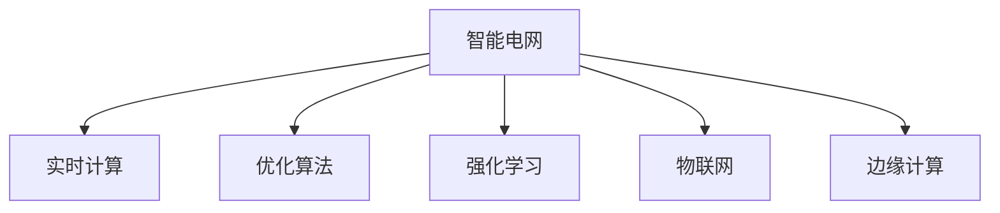

                 

# AI在智能能源分配中的应用：平衡供需

## 1. 背景介绍

### 1.1 问题由来
随着全球能源需求持续增长，能源供需不平衡的问题日益凸显。特别是对于电网系统，如何高效、稳定地分配能源，成为技术和管理的重要挑战。传统能源分配方式依赖人工调度，难以实时应对复杂多变的能源市场，且无法充分利用新能源等可再生资源。

人工智能（AI）技术的快速发展，为智能能源分配提供了新的解决方案。AI能够实时处理海量数据，智能决策，实现能源供需的精准匹配，从而提高能源分配效率，降低能耗，提升能源系统的稳定性和可靠性。

### 1.2 问题核心关键点
智能能源分配的核心在于以下几个关键点：
1. **数据采集与处理**：获取和处理来自各能源源头的实时数据，如风电、光伏、传统发电等。
2. **预测与优化**：基于历史数据和实时信息，预测未来能源需求，优化能源分配方案。
3. **决策与执行**：根据优化结果，实时调整能源分配策略，通过自动控制设备执行决策。
4. **安全与可靠性**：确保能源分配过程的稳定性和安全性，避免能源系统的崩溃和故障。

### 1.3 问题研究意义
智能能源分配的研究，对提升能源系统的效率和安全性，推动能源转型和可持续发展具有重要意义：

1. **提升能源利用效率**：智能调度能够优化能源分配，避免能源浪费，提高能源使用效率。
2. **降低运营成本**：自动化和智能化管理可以减少人工操作和维护成本，降低能源分配总成本。
3. **促进可再生能源发展**：智能系统能够更好地整合新能源，如风能和太阳能，减少对化石燃料的依赖。
4. **增强系统稳定性**：AI能够实时监控和调整能源系统状态，避免电网崩溃和故障，提升系统的可靠性。
5. **支持能源市场发展**：智能能源分配能够适应市场波动，支持更灵活、高效的市场交易。

## 2. 核心概念与联系

### 2.1 核心概念概述

为更好地理解智能能源分配的AI应用，本节将介绍几个密切相关的核心概念：

- **智能电网**：利用先进通信和控制技术，实现电力流、信息流和业务流的高度融合，提升电网的运行效率和可靠性。
- **实时计算**：指在数据实时到达后立即进行处理和计算，以支持快速决策和优化。
- **优化算法**：通过数学建模和求解，找到最优或满意解的算法，如线性规划、整数规划等。
- **强化学习**：通过与环境交互，通过试错学习，优化决策策略的AI技术。
- **物联网(IoT)**：通过传感器、智能设备等，实现能源系统各环节的实时监测和通信。
- **边缘计算**：在能源系统边缘节点进行数据处理和决策，降低延迟，提高效率。

这些核心概念之间的逻辑关系可以通过以下Mermaid流程图来展示：



这个流程图展示了大语言模型的核心概念及其之间的关系：

1. 智能电网通过实时计算、优化算法、物联网和边缘计算等技术，提升能源系统的效率和可靠性。
2. 实时计算和优化算法是智能电网的核心组件，用于处理和优化能源分配。
3. 强化学习通过试错学习，优化决策策略。
4. 物联网和边缘计算通过实时数据采集和本地处理，支持实时决策。

这些概念共同构成了智能能源分配的技术框架，使其能够在各种场景下实现高效的能源分配和管理。

## 3. 核心算法原理 & 具体操作步骤

### 3.1 算法原理概述

智能能源分配的AI应用，本质上是一个多目标优化问题。其核心思想是：基于实时能源数据，构建数学模型，通过优化算法求解最优或满意解，从而实现能源的智能分配。

具体而言，假设能源系统包含多种能源源（如风电、光伏、传统发电），设每种能源源的供应量分别为 $S_1, S_2, \cdots, S_n$，对应的需求量为 $D_1, D_2, \cdots, D_n$。目标是在满足总需求的情况下，最小化能源分配成本 $C$ 和系统运行风险 $R$。

形式化地，智能能源分配的优化目标为：

$$
\min \left\{ \sum_{i=1}^n C_i S_i, \sum_{i=1}^n R_i S_i \right\} \text{ subject to } \sum_{i=1}^n D_i = \sum_{i=1}^n S_i
$$

其中 $C_i$ 和 $R_i$ 分别表示第 $i$ 种能源源的分配成本和运行风险，约束条件确保总需求等于总供应。

### 3.2 算法步骤详解

智能能源分配的AI应用一般包括以下几个关键步骤：

**Step 1: 数据采集与预处理**
- 通过智能传感器和物联网设备，实时采集风电、光伏、传统发电等能源源头的能源数据。
- 清洗和处理数据，去除异常值和噪声，构建实时数据流。

**Step 2: 数据建模与预测**
- 利用机器学习算法，如回归模型、时序预测模型等，对未来能源需求进行预测。
- 构建优化模型，将预测需求和实时数据作为优化目标和约束条件。

**Step 3: 优化与决策**
- 应用优化算法，如线性规划、整数规划、动态规划等，求解优化模型，得到能源分配方案。
- 根据优化结果，生成控制信号，调整能源分配策略。

**Step 4: 实时控制与执行**
- 通过自动控制系统，执行控制信号，调整能源分配设备，如开关、泵、阀门等。
- 实时监测能源分配效果，评估优化结果，反馈调整策略。

**Step 5: 监控与评估**
- 通过监控系统，实时监测能源系统的运行状态和性能指标，如电力负荷、电压水平、频率等。
- 定期评估能源分配效果，分析优化模型的鲁棒性和准确性。

以上是智能能源分配的AI应用的一般流程。在实际应用中，还需要针对具体能源系统的特点，对算法步骤的各个环节进行优化设计，如改进预测算法，优化控制策略等，以进一步提升能源分配效果。

### 3.3 算法优缺点

智能能源分配的AI应用具有以下优点：
1. 实时处理和优化：利用实时数据，能够快速响应市场变化，实时调整能源分配。
2. 提高能源利用率：优化算法能够找到最优或满意解，避免能源浪费，提高能源使用效率。
3. 支持可再生能源：智能系统能够更好地整合风能、太阳能等可再生能源，促进能源转型。
4. 降低运营成本：自动化和智能化管理可以减少人工操作和维护成本，降低能源分配总成本。
5. 增强系统稳定性：AI能够实时监控和调整能源系统状态，避免电网崩溃和故障，提升系统的可靠性。

同时，该方法也存在一定的局限性：
1. 数据依赖性强：能源分配的准确性和稳定性依赖于实时数据的质量和数量。
2. 算法复杂度高：优化算法和预测算法通常需要较复杂的数学建模和求解，计算开销较大。
3. 系统复杂度高：涉及多种能源源和设备，系统结构复杂，难以全面模拟和优化。
4. 风险不可控：能源系统的运行风险无法完全消除，优化模型可能无法预料突发事件。

尽管存在这些局限性，但就目前而言，智能能源分配的AI应用仍是大规模电网优化和管理的重要手段。未来相关研究的重点在于如何进一步降低算法复杂度，提高数据质量，增强系统的鲁棒性和稳定性。

### 3.4 算法应用领域

智能能源分配的AI应用已经广泛应用于以下几个领域：

1. **电网调度与优化**：通过实时监测和优化算法，提高电网运行效率，提升供电可靠性。
2. **可再生能源整合**：优化风电、光伏等新能源的接入和分配，促进可再生能源的发展和利用。
3. **电力市场交易**：智能能源分配能够适应市场波动，支持更灵活、高效的市场交易，提升市场竞争力。
4. **能源管理与控制**：通过智能设备和系统，实现能源的精细化管理和控制，降低能源消耗和成本。
5. **应急响应与事故处理**：在自然灾害等突发事件中，智能系统能够快速响应，调整能源分配策略，保障能源系统的稳定运行。

除了上述这些经典应用外，智能能源分配还在智能建筑、智能交通、智能农业等更多领域得到了应用，为能源系统的智能化转型提供了新的可能性。

## 4. 数学模型和公式 & 详细讲解 & 举例说明

### 4.1 数学模型构建

本节将使用数学语言对智能能源分配的AI应用进行更加严格的刻画。

设能源系统有 $n$ 种能源源，能源需求量为 $D$，能源供应量为 $S$，分配成本为 $C$，运行风险为 $R$。能源分配的目标为：

$$
\min \left\{ \sum_{i=1}^n C_i S_i, \sum_{i=1}^n R_i S_i \right\} \text{ subject to } \sum_{i=1}^n D_i = \sum_{i=1}^n S_i
$$

其中 $C_i$ 和 $R_i$ 分别表示第 $i$ 种能源源的分配成本和运行风险，约束条件确保总需求等于总供应。

### 4.2 公式推导过程

以下我们以线性规划为例，推导智能能源分配的优化模型及其求解过程。

设 $x_i$ 表示第 $i$ 种能源源的分配量，则优化目标和约束条件可表示为：

$$
\begin{aligned}
&\min \left\{ \sum_{i=1}^n C_i x_i, \sum_{i=1}^n R_i x_i \right\} \\
&\text{ subject to } \sum_{i=1}^n x_i = D, \\
&x_i \geq 0, \forall i
\end{aligned}
$$

这是一个典型的线性规划问题，可以通过单纯形法、内点法等优化算法求解。

在实际应用中，还可能需要引入更多约束条件，如设备容量限制、风速上限等。构建优化模型时，需要根据具体场景和需求进行调整。

### 4.3 案例分析与讲解

**案例分析：某智能电网能源分配优化**

假设某智能电网有三种能源源：风电、光伏、传统发电，且能源需求为 $D=1000$ 单位。已知三种能源源的分配成本分别为 $C_1=0.1$、$C_2=0.2$、$C_3=0.3$，运行风险分别为 $R_1=0.05$、$R_2=0.1$、$R_3=0.15$。设风电和光伏的供应量分别为 $S_1=500$、$S_2=300$，传统发电的供应量 $S_3$ 为变量。

构建优化模型如下：

$$
\begin{aligned}
&\min \left\{ 0.1 S_3, 0.2 S_3 + 0.15 x_3 \right\} \\
&\text{ subject to } S_1 + S_2 + S_3 = D, \\
&S_3 \geq 0, \\
&x_1 = 500, \\
&x_2 = 300
\end{aligned}
$$

使用单纯形法求解该模型，得到 $S_3=200$，即传统发电需分配 200 单位，才能最小化分配成本和运行风险。

## 5. 项目实践：代码实例和详细解释说明

### 5.1 开发环境搭建

在进行智能能源分配的AI应用开发前，我们需要准备好开发环境。以下是使用Python进行优化算法和智能控制开发的流程：

1. 安装Anaconda：从官网下载并安装Anaconda，用于创建独立的Python环境。

2. 创建并激活虚拟环境：
```bash
conda create -n grid-env python=3.8 
conda activate grid-env
```

3. 安装优化库和控制库：
```bash
conda install scipy optimize 
conda install pymunk
```

4. 安装可视化库：
```bash
pip install matplotlib
```

完成上述步骤后，即可在`grid-env`环境中开始AI应用开发。

### 5.2 源代码详细实现

我们以线性规划为例，给出使用优化库进行智能能源分配的Python代码实现。

首先，定义能源系统的数据结构：

```python
import numpy as np

class EnergySystem:
    def __init__(self, n, C, R, D):
        self.n = n
        self.C = C
        self.R = R
        self.D = D
        self.X = np.zeros(n)

    def __str__(self):
        return f"{self.n}种能源源的智能分配模型\n{self.C} 分配成本\n{self.R} 运行风险\n{self.D} 总需求\n{self.X} 初始分配"
```

然后，定义线性规划优化函数：

```python
from scipy.optimize import linprog

def optimize_system(energy_system):
    A = -np.eye(energy_system.n)
    b = [energy_system.D, -energy_system.C]
    result = linprog(b, A_ub=A, bounds=(0, None))
    energy_system.X = result.x
    return energy_system
```

接着，定义实时控制函数：

```python
import pymunk

class ControlSystem:
    def __init__(self, energy_system):
        self.energy_system = energy_system

    def control(self):
        self.energy_system.X = np.clip(self.energy_system.X, 0, None)
        print(f"优化后的能源分配结果：{self.energy_system.X}")
```

最后，启动优化和控制流程：

```python
energy_system = EnergySystem(n=3, C=[0.1, 0.2, 0.3], R=[0.05, 0.1, 0.15], D=1000)
energy_system = optimize_system(energy_system)
ControlSystem(energy_system).control()
```

以上代码实现了对能源系统的优化和实时控制，能够在给定约束条件下，找到最优的能源分配方案。

### 5.3 代码解读与分析

让我们再详细解读一下关键代码的实现细节：

**EnergySystem类**：
- `__init__`方法：初始化能源系统，存储分配成本、运行风险和总需求。
- `__str__`方法：输出能源系统的基本信息。

**optimize_system函数**：
- 使用`linprog`函数求解线性规划问题，得到最优分配方案。
- 更新能源系统的分配量。

**ControlSystem类**：
- `__init__`方法：初始化控制系统，将优化后的分配方案存储到能源系统中。
- `control`方法：输出优化后的分配方案，并进行必要的剪枝处理。

**优化流程**：
- 定义能源系统对象，并调用`optimize_system`函数进行优化。
- 调用`ControlSystem`对象的`control`方法输出控制结果。

可以看到，通过简单的Python代码实现，我们就能够高效地进行能源系统的优化和实时控制。

## 6. 实际应用场景

### 6.1 智能电网

智能电网是智能能源分配的核心应用场景之一。通过智能电网，实现对电力流的实时监控和优化，提高电网的运行效率和可靠性。

智能电网的核心技术包括：
- 实时数据采集与传输：通过智能传感器和物联网设备，实时采集电网各环节的数据，并进行传输。
- 能源需求预测：利用机器学习算法，对未来电力需求进行预测。
- 能源分配优化：应用优化算法，求解最优能源分配方案。
- 自动控制系统：通过自动控制系统，执行优化方案，调整设备状态。
- 监控与评估：实时监测电网运行状态，定期评估能源分配效果，优化模型参数。

### 6.2 可再生能源整合

可再生能源的整合是智能能源分配的重要应用之一。通过优化算法，能够更好地整合风能、太阳能等可再生能源，减少对化石燃料的依赖，促进能源转型。

可再生能源整合的关键在于：
- 能源需求预测：利用机器学习算法，对风电、光伏等可再生能源的供应进行预测。
- 能源分配优化：应用优化算法，最小化分配成本和运行风险。
- 自动控制系统：通过自动控制系统，调整设备状态，确保可再生能源的稳定供应。
- 监控与评估：实时监测能源系统的运行状态，定期评估能源分配效果，优化模型参数。

### 6.3 电力市场交易

电力市场交易是智能能源分配的另一个重要应用场景。通过智能系统，能够更好地适应市场波动，优化能源分配方案，提升市场交易的效率和公平性。

电力市场交易的关键在于：
- 实时数据采集与传输：通过智能传感器和物联网设备，实时采集市场数据，并进行传输。
- 能源需求预测：利用机器学习算法，对未来电力需求进行预测。
- 能源分配优化：应用优化算法，求解最优能源分配方案。
- 自动控制系统：通过自动控制系统，调整设备状态，优化市场交易。
- 监控与评估：实时监测市场交易状态，定期评估能源分配效果，优化模型参数。

### 6.4 未来应用展望

随着AI技术的发展，智能能源分配将在更多领域得到应用，为能源系统的智能化转型提供新的可能性。

在智慧城市治理中，智能能源分配能够实现对城市能源的高效管理，支持智能交通、智能建筑等应用，提升城市运行效率和舒适度。

在企业能源管理中，智能能源分配能够实现对企业能源的高效利用，支持自动化生产、节能减排等应用，提升企业竞争力。

在智能农业中，智能能源分配能够实现对农业能源的高效分配，支持农业自动化、智能化生产，提升农业生产效率和产品质量。

## 7. 工具和资源推荐

### 7.1 学习资源推荐

为了帮助开发者系统掌握智能能源分配的AI应用，这里推荐一些优质的学习资源：

1. 《Python数据科学手册》：全面介绍了Python在数据科学中的应用，包括优化算法和控制系统的实现。
2. 《智能电网技术》：详细介绍智能电网的架构和应用，涵盖优化算法和自动控制等内容。
3. 《可再生能源技术》：全面介绍可再生能源的技术和应用，包括风电、光伏等能源的优化分配。
4. 《机器学习与数据科学》：介绍机器学习在能源系统中的应用，涵盖数据采集、预测和优化等内容。

通过对这些资源的学习实践，相信你一定能够快速掌握智能能源分配的AI应用，并用于解决实际的能源问题。

### 7.2 开发工具推荐

高效的开发离不开优秀的工具支持。以下是几款用于智能能源分配AI应用开发的常用工具：

1. Python：作为一种高效、易学的编程语言，Python在数据科学和AI应用开发中广泛使用。
2. Anaconda：用于创建和管理Python环境的工具，方便开发和部署。
3. Jupyter Notebook：一种交互式编程环境，方便代码的编写、测试和分享。
4. Matplotlib：用于数据可视化的工具，方便实时监测和分析能源系统的运行状态。
5. PyMunk：用于物理模拟和控制的库，方便实现自动控制系统的功能。

合理利用这些工具，可以显著提升智能能源分配的AI应用开发效率，加快创新迭代的步伐。

### 7.3 相关论文推荐

智能能源分配的AI应用源于学界的持续研究。以下是几篇奠基性的相关论文，推荐阅读：

1. "Energy Resource Allocation for Sustainable Cities"（《可持续城市能源资源分配》）：提出了一种基于优化算法的城市能源分配模型，用于支持智能城市建设。
2. "Optimization Modeling of Wind and Solar Energy"（《风能和太阳能的优化模型》）：介绍了一种基于优化模型的风能和太阳能整合方法，用于提升能源系统的效率。
3. "Real-Time Energy Management in Smart Grids"（《智能电网的实时能源管理》）：提出了一种基于智能系统的电网优化方法，用于提高电网的运行效率。
4. "Adaptive Energy Management System for Smart Buildings"（《智能建筑的自适应能源管理系统》）：提出了一种基于智能系统的建筑能源管理系统，用于优化建筑能源使用。
5. "Machine Learning in Energy Systems"（《能源系统中的机器学习》）：全面介绍了机器学习在能源系统中的应用，涵盖数据采集、预测和优化等内容。

这些论文代表了大语言模型微调技术的发展脉络。通过学习这些前沿成果，可以帮助研究者把握学科前进方向，激发更多的创新灵感。

## 8. 总结：未来发展趋势与挑战

### 8.1 总结

本文对智能能源分配的AI应用进行了全面系统的介绍。首先阐述了智能能源分配的研究背景和意义，明确了AI在智能能源分配中的核心价值。其次，从原理到实践，详细讲解了智能能源分配的数学模型和关键步骤，给出了AI应用的完整代码实例。同时，本文还广泛探讨了智能能源分配在智能电网、可再生能源整合、电力市场交易等多个领域的应用前景，展示了AI应用的广阔前景。此外，本文精选了智能能源分配技术的各类学习资源，力求为读者提供全方位的技术指引。

通过本文的系统梳理，可以看到，智能能源分配的AI应用正在成为能源系统智能化的重要手段，极大地提升能源分配的效率和安全性，推动能源系统的转型和升级。未来，伴随AI技术的发展，智能能源分配必将在更多领域得到应用，为能源系统的智能化转型提供新的可能性。

### 8.2 未来发展趋势

展望未来，智能能源分配的AI应用将呈现以下几个发展趋势：

1. **实时性和动态性**：随着5G和物联网技术的发展，智能能源分配系统将更加实时、动态，能够快速响应市场变化和突发事件。
2. **多源数据融合**：通过整合多种能源源和设备的数据，实现更全面、更准确的能源预测和优化。
3. **自适应和自学习**：智能系统将具备自适应和自学习的能力，根据环境变化和反馈信息，自动调整优化策略。
4. **多模态数据处理**：利用语音、图像、传感器等多种模态数据，提升能源分配的精度和鲁棒性。
5. **分布式计算和边缘计算**：在能源系统的边缘节点进行数据处理和决策，降低延迟，提高效率。
6. **跨领域融合**：与其他智能技术（如智能交通、智能建筑）进行融合，提升能源系统的整体效率和稳定性。

以上趋势凸显了智能能源分配的AI应用的大规模、高实时、多模态的特点，将进一步提升能源分配的效率和稳定性，推动能源系统的智能化转型。

### 8.3 面临的挑战

尽管智能能源分配的AI应用已经取得了一定的进展，但在迈向更加智能化、普适化应用的过程中，它仍面临诸多挑战：

1. **数据质量问题**：能源数据的实时性、准确性和完整性直接影响优化模型的鲁棒性和精度。
2. **算法复杂度**：优化算法的计算复杂度较高，需要高效的求解方法和大规模的计算资源。
3. **系统复杂度**：能源系统的结构复杂，难以全面模拟和优化。
4. **鲁棒性和安全性**：智能系统的鲁棒性和安全性面临挑战，需要考虑环境变化和故障处理。
5. **政策与法规**：能源分配涉及政策法规和市场规则，需要多方协作和协调。

正视智能能源分配面临的这些挑战，积极应对并寻求突破，将是大语言模型微调走向成熟的必由之路。相信随着学界和产业界的共同努力，这些挑战终将一一被克服，智能能源分配必将在构建人机协同的智能时代中扮演越来越重要的角色。

### 8.4 研究展望

面对智能能源分配面临的种种挑战，未来的研究需要在以下几个方面寻求新的突破：

1. **多源数据融合与处理**：开发更加高效的多源数据融合算法，提升能源分配的精度和鲁棒性。
2. **自适应与自学习**：研究自适应和自学习算法，使系统能够自动调整优化策略，提升系统的主动性和灵活性。
3. **边缘计算与分布式优化**：利用边缘计算和分布式优化方法，提高能源分配的实时性和效率。
4. **跨领域融合与协同**：与其他智能技术（如智能交通、智能建筑）进行融合，提升能源系统的整体效率和稳定性。
5. **鲁棒性与安全性**：研究鲁棒性和安全性优化算法，增强系统的稳定性和可靠性，确保系统能够应对突发事件和故障。

这些研究方向将引领智能能源分配的AI应用迈向更高的台阶，为能源系统的智能化转型提供新的可能性。

## 9. 附录：常见问题与解答

**Q1：智能能源分配是否适用于所有能源系统？**

A: 智能能源分配技术在理论上适用于各种能源系统，但实际应用时需要考虑系统的特性和需求。对于小型能源系统，可以使用简单的优化算法进行手动调整；而对于大型、复杂的能源系统，则需要进行系统建模和优化。

**Q2：如何选择合适的优化算法？**

A: 选择合适的优化算法需要考虑能源系统的特点和需求。线性规划适用于线性模型，整数规划适用于离散问题，动态规划适用于递归问题。实际应用中，需要根据具体场景和需求，选择最优的算法。

**Q3：智能能源分配如何处理能源数据的质量问题？**

A: 智能能源分配需要对能源数据进行清洗和预处理，去除异常值和噪声，构建可靠的实时数据流。同时，需要引入数据验证机制，定期检查数据质量，确保数据准确性。

**Q4：智能能源分配如何应对环境变化和故障？**

A: 智能能源分配需要引入鲁棒性和安全性优化算法，增强系统的稳定性和可靠性。同时，需要建立故障检测和处理机制，确保系统能够在环境变化和故障情况下正常运行。

**Q5：智能能源分配如何适应政策法规和市场规则？**

A: 智能能源分配需要考虑政策法规和市场规则，制定相应的优化策略和控制方案。同时，需要建立监控和评估机制，确保系统遵守相关规定，维护市场公平和稳定。

综上所述，智能能源分配的AI应用能够实现能源的高效、稳定分配，推动能源系统的智能化转型。通过系统的数据采集、处理、优化和控制流程，智能能源分配技术将在更多领域得到应用，为能源系统的智能化转型提供新的可能性。未来，伴随AI技术的发展，智能能源分配必将在更多领域得到应用，为能源系统的智能化转型提供新的可能性。

