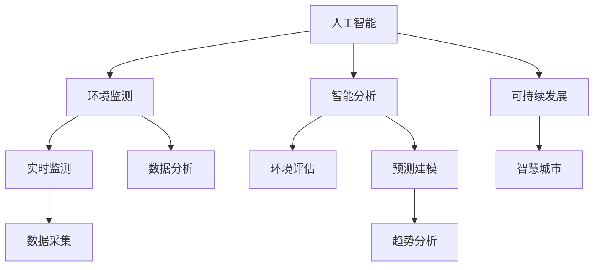

                 

# AI在环境保护中的应用前景

> 关键词：人工智能(AI),环境保护,环境监测,智能分析,可持续发展,智慧城市

## 1. 背景介绍

随着全球工业化进程的加快，环境问题日益严重，气候变化、资源短缺、污染加剧等问题层出不穷。传统的环境保护手段依赖于人工监测、统计和分析，效率低下、成本高昂，难以应对日益复杂多变的现实环境。而人工智能(AI)技术的迅猛发展，为环境保护领域注入了新的动力，带来了前所未有的机遇。本文将探讨AI在环境监测、智能分析和可持续发展等多个方面的应用前景，为环境保护事业提供有力支持。

## 2. 核心概念与联系

### 2.1 核心概念概述

为更好地理解AI在环境保护中的应用，本节将介绍几个密切相关的核心概念：

- 人工智能(AI)：涵盖机器学习、深度学习、自然语言处理等多种技术的总称，通过模拟人类智能行为，实现自动化和智能化处理。
- 环境监测：利用传感器、遥感、移动终端等手段，实时采集和分析环境数据，监测环境变化趋势，辅助环境管理决策。
- 智能分析：通过AI算法对海量环境数据进行建模、预测和分类，提供精准的环境分析和评估。
- 可持续发展：指在不损害后代利益的前提下，满足当代人需求的发展模式，涉及环境、经济、社会多个维度。
- 智慧城市：利用信息通信技术、AI技术，实现城市管理和服务智能化，提升城市运行效率和生活质量。

这些核心概念之间的逻辑关系可以通过以下Mermaid流程图来展示：



这个流程图展示了一系列与AI在环境保护中相关联的概念及其之间的关系：

1. 人工智能为环境监测和智能分析提供技术支持，帮助实时采集和分析环境数据。
2. 智能分析通过建模和预测，提供精准的环境评估，为环境管理决策提供科学依据。
3. 环境评估和智慧城市建设为可持续发展的实现提供技术保障和实践路径。
4. 智慧城市利用AI技术，提升城市运行效率和生活质量，同时促进可持续发展目标的实现。

## 3. 核心算法原理 & 具体操作步骤
### 3.1 算法原理概述

AI在环境保护中的应用，核心在于通过数据分析和建模，实现环境监测、智能分析和可持续发展决策的自动化和智能化。其核心算法原理包括以下几个方面：

- 机器学习：通过历史数据训练模型，预测未来环境趋势，如水质预测、污染浓度预测等。
- 深度学习：利用深度神经网络，对环境图像、时间序列等复杂数据进行分析和分类，如遥感图像分类、环境噪声分析等。
- 自然语言处理：通过文本分析技术，提取环境政策、报告中的关键信息，辅助环境管理和决策。

### 3.2 算法步骤详解

以下是AI在环境监测和智能分析中的典型步骤：

**Step 1: 数据采集与预处理**

- 收集环境数据，包括大气、水质、噪声、交通等各类数据。
- 对数据进行清洗、去噪、归一化等预处理，确保数据质量和一致性。

**Step 2: 模型训练与优化**

- 选择合适的模型架构，如回归模型、分类模型、卷积神经网络(CNN)、循环神经网络(RNN)等，进行参数训练。
- 使用交叉验证、网格搜索等技术，对模型参数进行调优，提高模型泛化性能。

**Step 3: 环境分析和预测**

- 将预处理后的数据输入模型，进行环境状态的分析和预测。
- 结合时序分析和空间分析，提供环境变化的动态预测和空间分布。

**Step 4: 决策支持与反馈**

- 利用环境分析和预测结果，提供决策支持，如污染治理方案、资源配置策略等。
- 根据环境变化和反馈结果，不断调整模型和算法，提升模型的精度和适应性。

### 3.3 算法优缺点

AI在环境保护中的应用具有以下优点：

- 自动化和智能化：大幅提升环境监测和分析的效率和精度。
- 数据驱动决策：通过数据分析和建模，提供科学的环境决策支持。
- 持续优化：利用反馈机制不断调整和优化模型，保持长期效果。

同时，AI也存在一些局限性：

- 数据依赖性高：对数据质量、完整性和多样性有较高要求。
- 算法复杂度高：模型训练和调优需要专业知识和技术支持。
- 隐私和安全问题：环境数据可能涉及敏感信息，需严格保护。

### 3.4 算法应用领域

AI在环境保护中的应用，主要集中在以下几个领域：

- 环境监测：利用传感器、遥感等技术，实时监测大气、水质、噪声等环境指标。
- 智能分析：通过AI算法对环境数据进行建模、预测和分类，提供精准的环境分析和评估。
- 资源管理：利用AI技术优化水资源、能源、废弃物等资源的管理和配置。
- 气候变化：通过数据分析和建模，研究气候变化趋势，制定应对策略。
- 智慧城市：利用AI技术提升城市运行效率，实现环境友好型的智慧城市建设。

## 4. 数学模型和公式 & 详细讲解 & 举例说明

### 4.1 数学模型构建

本节将使用数学语言对AI在环境保护中的应用进行更加严格的刻画。

假设环境数据集为 $D=\{(x_i,y_i)\}_{i=1}^N, x_i \in \mathbb{R}^d, y_i \in \mathbb{R}$，其中 $x_i$ 为环境特征向量，$y_i$ 为环境指标（如污染浓度、温度等）。

定义模型 $M_{\theta}$ 在数据样本 $(x,y)$ 上的损失函数为 $\ell(M_{\theta}(x),y)$，则在数据集 $D$ 上的经验风险为：

$$
\mathcal{L}(\theta) = \frac{1}{N} \sum_{i=1}^N \ell(M_{\theta}(x_i),y_i)
$$

常用的损失函数包括均方误差损失、交叉熵损失等。例如，回归问题中的均方误差损失函数为：

$$
\ell(y,\hat{y}) = \frac{1}{2}(y-\hat{y})^2
$$

在得到损失函数后，即可使用梯度下降等优化算法对模型参数 $\theta$ 进行训练，最小化损失函数 $\mathcal{L}(\theta)$。

### 4.2 公式推导过程

以水质监测为例，假设模型 $M_{\theta}$ 在输入 $x$ 上的输出为 $\hat{y}=M_{\theta}(x) \in \mathbb{R}$，表示水质指标的预测值。真实标签 $y \in \mathbb{R}$。则均方误差损失函数为：

$$
\ell(M_{\theta}(x),y) = \frac{1}{2}(y-\hat{y})^2
$$

将其代入经验风险公式，得：

$$
\mathcal{L}(\theta) = \frac{1}{N}\sum_{i=1}^N (y_i-\hat{y}_i)^2
$$

根据链式法则，损失函数对参数 $\theta_k$ 的梯度为：

$$
\frac{\partial \mathcal{L}(\theta)}{\partial \theta_k} = -\frac{1}{N}\sum_{i=1}^N \frac{\partial \ell}{\partial \theta_k} = -\frac{1}{N}\sum_{i=1}^N (y_i - \hat{y}_i) \frac{\partial \hat{y}_i}{\partial \theta_k}
$$

其中 $\frac{\partial \hat{y}_i}{\partial \theta_k}$ 可通过反向传播算法高效计算。

### 4.3 案例分析与讲解

假设我们有一个水质监测数据集，其中包含多个水样点在不同时间点的污染浓度数据。我们的目标是建立一个水质预测模型，根据历史数据预测未来的污染浓度。

我们可以使用基于深度学习的水质预测模型，如LSTM、GRU等，对数据进行建模。具体步骤如下：

1. 数据预处理：对水样点数据进行标准化、归一化处理，确保数据的一致性。
2. 特征工程：提取影响污染浓度的关键特征，如温度、流量、溶解氧等。
3. 模型训练：选择合适的深度学习模型，使用历史数据进行训练，最小化均方误差损失。
4. 模型评估：在验证集上评估模型性能，调整模型参数和超参数。
5. 模型预测：利用训练好的模型对新水样点数据进行污染浓度预测，辅助环境管理决策。

## 5. 项目实践：代码实例和详细解释说明
### 5.1 开发环境搭建

在进行项目实践前，我们需要准备好开发环境。以下是使用Python进行TensorFlow开发的环境配置流程：

1. 安装Anaconda：从官网下载并安装Anaconda，用于创建独立的Python环境。

2. 创建并激活虚拟环境：
```bash
conda create -n tf-env python=3.7 
conda activate tf-env
```

3. 安装TensorFlow：根据CUDA版本，从官网获取对应的安装命令。例如：
```bash
pip install tensorflow==2.5
```

4. 安装各类工具包：
```bash
pip install numpy pandas scikit-learn matplotlib tqdm jupyter notebook ipython
```

完成上述步骤后，即可在`tf-env`环境中开始项目实践。

### 5.2 源代码详细实现

下面以水质预测为例，给出使用TensorFlow对LSTM模型进行水质预测的代码实现。

首先，定义数据处理函数：

```python
import numpy as np
import pandas as pd
import tensorflow as tf

def load_data(file_path):
    data = pd.read_csv(file_path)
    x = data.iloc[:, :-1].values.astype(np.float32)
    y = data.iloc[:, -1].values.astype(np.float32)
    return x, y

def train_test_split(x, y, test_size=0.2):
    np.random.seed(42)
    perm = np.random.permutation(len(x))
    x_train, x_test = x[perm[:int(len(x) * (1 - test_size))], :], x[perm[int(len(x) * (1 - test_size)):], :]
    y_train, y_test = y[perm[:int(len(x) * (1 - test_size))]], y[perm[int(len(x) * (1 - test_size)):]]
    return x_train, y_train, x_test, y_test

x, y = load_data('waterquality.csv')
x_train, x_test, y_train, y_test = train_test_split(x, y)

x_train = tf.keras.utils.to_categorical(x_train)
x_test = tf.keras.utils.to_categorical(x_test)
```

然后，定义LSTM模型和优化器：

```python
from tensorflow.keras.layers import Input, LSTM, Dense
from tensorflow.keras.models import Model

input_shape = (x_train.shape[1], x_train.shape[2])
output_shape = (y_train.shape[1], y_train.shape[2])

input_layer = Input(shape=input_shape)
lstm_layer = LSTM(64, return_sequences=True)(input_layer)
lstm_layer = LSTM(64)(lstm_layer)
output_layer = Dense(output_shape, activation='sigmoid')(lstm_layer)
model = Model(inputs=input_layer, outputs=output_layer)
model.compile(optimizer='adam', loss='mse')
```

接着，定义训练和评估函数：

```python
def train_epoch(model, x_train, y_train):
    model.fit(x_train, y_train, epochs=50, batch_size=32, validation_data=(x_test, y_test))
    return model.evaluate(x_test, y_test)

train_epoch(model, x_train, y_train)
```

最后，启动训练流程并在测试集上评估：

```python
epochs = 50
batch_size = 32

for epoch in range(epochs):
    train_epoch(model, x_train, y_train)
    print(f"Epoch {epoch+1}, train loss: {model.loss}, test loss: {model.evaluate(x_test, y_test)[0]:.3f}")
```

以上就是使用TensorFlow对LSTM模型进行水质预测的完整代码实现。可以看到，TensorFlow提供的高层API使得模型训练和评估变得简洁高效。

### 5.3 代码解读与分析

让我们再详细解读一下关键代码的实现细节：

**load_data函数**：
- 读取数据文件，并将数据划分为输入特征 $x$ 和输出标签 $y$。

**train_test_split函数**：
- 将数据集分为训练集和测试集，采用随机打乱的方式确保样本分布的随机性。

**LSTM模型定义**：
- 输入层定义输入数据的维度。
- LSTM层定义时间序列数据的建模。
- 输出层定义输出数据的维度和激活函数。
- 将输入、输出层连接成模型，并编译模型，设置优化器和损失函数。

**训练和评估函数**：
- 在训练集上训练模型，设置训练轮数和批次大小。
- 在验证集上评估模型性能，返回损失值。
- 在测试集上再次评估模型性能，输出损失值和准确率。

**训练流程**：
- 循环迭代训练轮数。
- 在每个epoch内，先进行模型训练，再评估模型性能。
- 输出每个epoch的平均损失值。

可以看到，TensorFlow提供了完整的模型训练和评估框架，开发者无需关注底层细节，只需关注模型设计和高层次的参数调优即可。

当然，工业级的系统实现还需考虑更多因素，如模型的保存和部署、超参数的自动搜索、更灵活的任务适配层等。但核心的模型训练和评估流程基本与此类似。

## 6. 实际应用场景
### 6.1 环境监测

AI在环境监测中的应用，主要体现在实时数据的采集和分析上。通过部署传感器、遥感设备等，实时采集环境数据，如大气污染、水质、土壤、噪声等指标，为环境管理和决策提供实时支持。

智能环境监测系统可以自动进行数据采集和预处理，利用深度学习算法进行数据分析和预测，实时反馈环境状态，辅助环境管理者快速响应突发事件，保障环境安全。例如，利用AI算法对水质监测数据进行建模，实时预测水质变化趋势，及时发现水质异常，防止环境污染。

### 6.2 智能分析

AI在智能分析中的应用，主要体现在环境数据的深度挖掘和分析上。通过对环境数据进行建模和分类，提取关键特征和趋势，为环境决策提供科学依据。

智能分析系统可以基于历史数据和实时数据，构建环境变化趋势模型，预测未来的环境状态，辅助环境管理者进行资源配置和风险管理。例如，利用AI算法对大气污染数据进行时间序列分析和空间分布预测，提供空气质量预报，帮助城市管理者制定合理的空气质量改善方案。

### 6.3 资源管理

AI在资源管理中的应用，主要体现在资源优化配置和高效利用上。通过对环境数据进行分析和建模，优化资源配置和管理策略，实现资源的高效利用和可持续开发。

智能资源管理系统可以基于环境数据，优化水资源、能源、废弃物等资源的利用效率，制定科学的资源配置方案，降低资源浪费，提升环境效益。例如，利用AI算法对水资源数据进行建模，预测水资源需求和供应变化，优化水资源分配和利用，实现水资源的可持续利用。

### 6.4 未来应用展望

展望未来，AI在环境保护中的应用将更加广泛和深入，带来更多创新和突破：

1. 物联网(IoT)应用：通过物联网技术，实现环境数据的全面采集和监测，为环境管理提供更丰富、更精准的数据支持。
2. 跨领域融合：结合气象、气候、地质等多个领域的知识，构建综合性环境模型，实现更全面的环境分析和预测。
3. 实时决策支持：利用AI技术，实现实时决策支持系统，提升环境管理的时效性和智能化水平。
4. 环境伦理和社会责任：加强AI在环境管理中的伦理和社会责任，确保技术应用符合可持续发展目标。

以上趋势凸显了AI在环境保护中的广阔前景。这些方向的探索发展，必将进一步提升环境管理的智能化水平，为可持续发展目标的实现提供有力保障。

## 7. 工具和资源推荐
### 7.1 学习资源推荐

为了帮助开发者系统掌握AI在环境保护中的应用，这里推荐一些优质的学习资源：

1. TensorFlow官方文档：提供全面的TensorFlow API文档和示例代码，帮助开发者快速上手。
2. PyTorch官方文档：提供全面的PyTorch API文档和示例代码，支持多种深度学习模型的实现。
3. OpenAI GPT系列论文：深度学习领域的重要论文，介绍GPT系列模型的架构和训练方法。
4. 《深度学习与环境监测》书籍：介绍深度学习在环境监测中的应用，包括数据采集、模型训练和预测等环节。
5. 《智慧城市》课程：介绍智慧城市建设中的AI应用，涵盖智能监测、智能分析、智能服务等环节。

通过对这些资源的学习实践，相信你一定能够快速掌握AI在环境保护中的应用精髓，并用于解决实际的环境问题。
###  7.2 开发工具推荐

高效的开发离不开优秀的工具支持。以下是几款用于AI在环境保护中开发常用的工具：

1. TensorFlow：由Google主导开发的开源深度学习框架，生产部署方便，适合大规模工程应用。
2. PyTorch：基于Python的开源深度学习框架，灵活高效的计算图，支持多种深度学习模型的实现。
3. Scikit-learn：提供强大的数据分析和机器学习工具，支持多种数据预处理和模型训练功能。
4. Jupyter Notebook：交互式的开发环境，支持多种编程语言和数据分析工具，方便实验和共享。
5. TensorBoard：TensorFlow配套的可视化工具，可实时监测模型训练状态，提供丰富的图表呈现方式。

合理利用这些工具，可以显著提升AI在环境保护中的开发效率，加快创新迭代的步伐。

### 7.3 相关论文推荐

AI在环境保护中的应用源于学界的持续研究。以下是几篇奠基性的相关论文，推荐阅读：

1. "Deep Learning for Environmental Data Analysis and Management"：介绍深度学习在环境数据分析和管理中的应用，涵盖数据预处理、模型训练和预测等环节。
2. "AI in Environmental Monitoring and Management"：介绍AI在环境监测和管理中的应用，包括实时数据采集、智能分析和资源优化等。
3. "Sustainability of Deep Learning in Environmental Protection"：讨论深度学习在环境保护中的可持续性问题，包括模型训练、数据隐私和安全等。
4. "AI for Smart City Sustainability"：介绍AI在智慧城市建设中的应用，涵盖智能监测、智能分析和智能服务等方面。
5. "AI for Environmental Ethics and Social Responsibility"：探讨AI在环境伦理和社会责任中的应用，确保技术应用符合可持续发展目标。

这些论文代表了大语言模型微调技术的发展脉络。通过学习这些前沿成果，可以帮助研究者把握学科前进方向，激发更多的创新灵感。

## 8. 总结：未来发展趋势与挑战

### 8.1 总结

本文对AI在环境保护中的应用进行了全面系统的介绍。首先阐述了AI在环境监测、智能分析和可持续发展等多个方面的应用前景，明确了AI技术在环境保护中的独特价值。其次，从原理到实践，详细讲解了AI在环境监测和智能分析中的数学模型和核心算法，给出了模型训练和评估的完整代码实例。同时，本文还广泛探讨了AI在环境监测、智能分析和资源管理等多个领域的应用场景，展示了AI技术的广阔应用前景。最后，本文精选了AI在环境保护中的学习资源和开发工具，力求为读者提供全方位的技术指引。

通过本文的系统梳理，可以看到，AI在环境保护中的潜力巨大，有望为环境管理带来革命性的变革。未来，伴随AI技术的持续演进，环境保护领域必将在智能化、自动化、高效化方面迈上新的台阶。

### 8.2 未来发展趋势

展望未来，AI在环境保护中的应用将呈现以下几个发展趋势：

1. 更加智能化的环境监测：结合物联网、遥感技术，实现环境数据的全面采集和实时监测。
2. 跨领域的智能分析：融合气象、气候、地质等多个领域的知识，构建综合性环境模型，实现更全面的环境分析和预测。
3. 更加高效化的资源管理：基于环境数据和AI算法，优化资源配置和管理策略，实现资源的高效利用和可持续开发。
4. 更加智能化的决策支持：利用AI技术，实现实时决策支持系统，提升环境管理的时效性和智能化水平。
5. 更加人性化的环境伦理和社会责任：加强AI在环境管理中的伦理和社会责任，确保技术应用符合可持续发展目标。

以上趋势凸显了AI在环境保护中的广阔前景。这些方向的探索发展，必将进一步提升环境管理的智能化水平，为可持续发展目标的实现提供有力保障。

### 8.3 面临的挑战

尽管AI在环境保护中的应用前景广阔，但在迈向更加智能化、普适化应用的过程中，它仍面临着诸多挑战：

1. 数据质量问题：环境数据往往存在缺失、噪声和不一致等问题，对模型的训练和预测准确性有较大影响。
2. 算法复杂性：深度学习模型需要大量的数据和计算资源，训练和调优过程较为复杂，需要专业知识和技术支持。
3. 模型解释性：环境管理的复杂性决定了AI模型需要具备较强的解释性，以便环境管理者理解和信任模型结果。
4. 模型可解释性：环境管理的复杂性决定了AI模型需要具备较强的解释性，以便环境管理者理解和信任模型结果。
5. 模型隐私和安全：环境数据涉及敏感信息，需严格保护模型隐私和安全，防止数据泄露和滥用。
6. 伦理和社会责任：AI技术在环境管理中的应用需符合伦理和社会责任，确保技术应用的公平性和透明性。

正视AI在环境保护中面临的这些挑战，积极应对并寻求突破，将是大规模语言模型微调走向成熟的必由之路。相信随着学界和产业界的共同努力，这些挑战终将一一被克服，AI技术必将在环境保护事业中发挥更大的作用。

### 8.4 研究展望

面对AI在环境保护中所面临的挑战，未来的研究需要在以下几个方面寻求新的突破：

1. 数据增强和数据预处理：通过数据增强和预处理技术，提高环境数据的完整性和一致性。
2. 跨领域融合和模型集成：将气象、气候、地质等多个领域的知识，与深度学习模型进行融合，提高模型的泛化性和适应性。
3. 模型解释性和可解释性：开发可解释性更强的AI模型，提高环境管理者的信任和接受度。
4. 模型隐私和安全：加强模型隐私保护和安全防护，确保环境数据的保密性和安全性。
5. 伦理和社会责任：研究AI技术在环境管理中的应用伦理和社会责任，确保技术应用的公平性和透明性。

这些研究方向的探索，必将引领AI在环境保护中迈向更高的台阶，为构建环境友好型的未来社会提供有力支持。总之，AI技术的发展离不开多学科交叉和融合，只有勇于创新、敢于突破，才能不断拓展AI在环境保护中的应用边界，实现可持续发展目标。

## 9. 附录：常见问题与解答

**Q1：AI在环境监测中的应用是否限于传感器和遥感技术？**

A: AI在环境监测中的应用不仅限于传感器和遥感技术。任何可以生成环境数据的设备和技术，都可以被用于环境监测。例如，无人机、卫星图像、社交媒体等数据源，都可以通过AI技术进行处理和分析。

**Q2：AI在环境监测中的应用是否需要大量标注数据？**

A: AI在环境监测中的应用通常需要大量标注数据。标注数据是训练和优化模型的基础，尤其是在复杂的环境监测任务中。然而，通过自动标注技术和半监督学习，也可以利用部分无标注数据进行模型训练和优化，降低对标注数据的依赖。

**Q3：AI在环境监测中的模型调优过程是否复杂？**

A: 是的，AI在环境监测中的模型调优过程通常较为复杂。深度学习模型的训练和优化需要大量的计算资源和专业知识，模型参数的选择和超参数的调优也是一项复杂的工作。然而，随着AI技术的不断发展，自动调优和模型压缩等技术也在不断进步，使得模型调优变得更加高效和便捷。

**Q4：AI在环境监测中的模型解释性是否重要？**

A: 是的，AI在环境监测中的模型解释性非常重要。环境管理的复杂性和不确定性决定了AI模型需要具备较强的解释性，以便环境管理者理解和信任模型结果。模型解释性技术，如可解释性AI(Explainable AI)，正在成为AI技术的重要研究方向。

**Q5：AI在环境监测中的应用是否存在隐私和安全问题？**

A: 是的，AI在环境监测中的应用存在隐私和安全问题。环境数据涉及敏感信息，如个人隐私、商业秘密等，需严格保护模型隐私和安全，防止数据泄露和滥用。数据脱敏、访问控制等技术是保护数据隐私和安全的重要手段。

通过本文的系统梳理，可以看到，AI在环境保护中的应用前景广阔，但同时也面临诸多挑战。只有不断探索和突破，才能让AI技术更好地服务于环境保护事业，为构建环境友好型的未来社会提供有力支持。总之，AI在环境保护中的发展离不开多学科交叉和融合，只有勇于创新、敢于突破，才能不断拓展AI在环境保护中的应用边界，实现可持续发展目标。

---

作者：禅与计算机程序设计艺术 / Zen and the Art of Computer Programming

