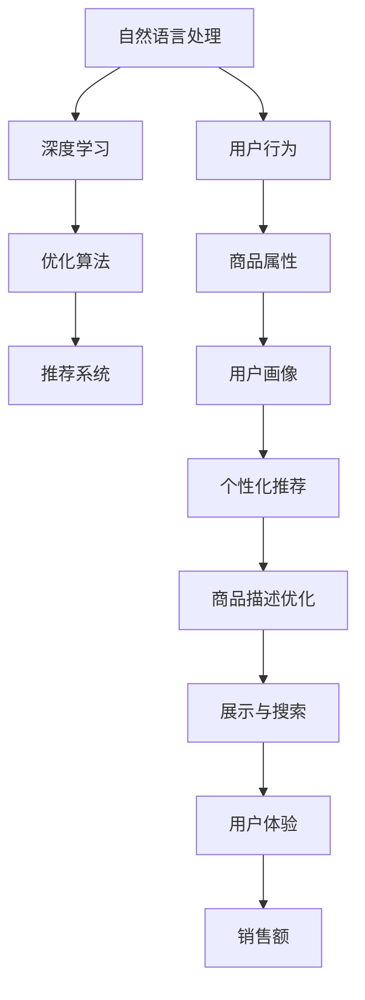

                 

# AI在电商平台商品描述优化中的应用

> 关键词：人工智能, 电商平台, 商品描述, 自然语言处理, 深度学习, 优化算法, 推荐系统

## 1. 背景介绍

随着互联网的迅猛发展，电商平台已成为人们购物的重要渠道之一。在电商平台上，商品描述的优化对于提升用户体验和销量起着至关重要的作用。传统的商品描述优化方式依赖于人工编写或编辑，耗时耗力且效果有限。近年来，随着人工智能技术的兴起，利用AI技术对商品描述进行优化，成为电商领域的一大研究热点。本文将深入探讨AI在电商平台商品描述优化中的应用，帮助电商平台提升商品描述质量，进而提升用户体验和销售额。

### 1.1 电商行业现状

当前，全球电商市场规模持续增长，各大电商平台纷纷加大在智能推荐、个性化定制等方面的投入。在电商购物的每一个环节，包括搜索、推荐、展示、客服等，AI技术都扮演着重要的角色。商品描述作为电商平台的重要展示内容，其质量直接影响了用户的购买决策。优质的商品描述不仅能吸引用户的眼球，还能通过精准的信息传递，提高用户的购物体验和满意度。

### 1.2 电商商品描述优化需求

电商平台的商品描述通常由卖家自行编写或编辑，其内容质量和风格往往参差不齐。优秀描述通常包含详细的产品信息、清晰的用途场景、精准的卖点介绍等，能够有效吸引用户注意力并提高转化率。而质量较差的描述可能内容过于简单、无法传达具体信息、存在语言错误等，导致用户流失。

此外，随着消费者需求的多样化，电商平台的商品描述也需要不断更新和优化，以满足不同用户群体的需求。例如，不同用户对商品属性的关注点不同，不同市场对商品描述的规范和要求也有所差异。如何在大量商品和描述中，快速准确地识别出优质描述并进行优化，成为电商平台亟需解决的问题。

## 2. 核心概念与联系

### 2.1 核心概念概述

在进行电商商品描述优化时，涉及到多个核心概念和技术：

- **自然语言处理（NLP）**：涉及文本数据的收集、清洗、分词、词性标注、命名实体识别等步骤，以提取和处理商品描述中的信息。
- **深度学习（Deep Learning）**：利用神经网络对商品描述进行建模，学习其语义和结构特征，以实现高质量的自动优化。
- **优化算法**：包括梯度下降、Adam、RMSprop等，用于调整深度学习模型的参数，最小化损失函数，提高模型的泛化能力。
- **推荐系统**：基于商品描述和其他用户行为数据，构建推荐模型，以个性化推荐高质量的商品描述。

这些概念之间存在密切联系，共同构成了商品描述优化的技术框架。自然语言处理技术提取商品描述中的关键信息，深度学习模型对这些信息进行编码和表示，优化算法用于调整模型参数，提升模型的泛化能力，推荐系统则根据模型预测结果，生成个性化商品描述。

### 2.2 核心概念联系

以下Mermaid流程图展示了各个核心概念之间的联系：



这个流程图展示了从用户行为到商品描述优化的全流程，每个环节都依赖于前一环节的输出。自然语言处理提取商品描述中的关键信息，深度学习对这些信息进行编码和表示，优化算法用于调整模型参数，提升模型的泛化能力，推荐系统则根据模型预测结果，生成个性化商品描述。最终，优化后的商品描述通过展示和搜索，提升用户体验和销售额。

## 3. 核心算法原理 & 具体操作步骤

### 3.1 算法原理概述

商品描述优化主要利用深度学习中的文本分类和文本生成技术。具体来说，可以构建一个基于RNN或Transformer的文本分类器，用于评估商品描述的质量；再构建一个基于RNN或Transformer的文本生成器，用于生成优化的商品描述。通过微调模型参数，提升模型的分类和生成能力，从而实现对商品描述的优化。

### 3.2 算法步骤详解

#### 3.2.1 数据预处理

数据预处理是电商商品描述优化的第一步。首先需要收集商品描述数据，并对其进行清洗和标注。清洗步骤包括去除停用词、特殊符号、数字等噪声，将描述中的拼写错误进行修正。标注步骤则是对商品描述进行情感极性、产品类别、用途场景等方面的标注，以构建有监督的数据集。

#### 3.2.2 模型构建

构建文本分类器时，可以使用RNN或Transformer模型。以Transformer模型为例，构建模型大致分为以下几个步骤：
1. **输入层**：将商品描述转换为token序列，并进行分词和编码。
2. **编码层**：使用多层的Transformer层对token序列进行编码，捕捉上下文信息。
3. **分类层**：通过全连接层和Softmax层对编码结果进行分类，输出商品描述的质量评分。

构建文本生成器时，同样可以使用RNN或Transformer模型。以Transformer模型为例，构建模型大致分为以下几个步骤：
1. **输入层**：将优化目标（如高质量的商品描述、竞争对手的商品描述等）转换为token序列，并进行分词和编码。
2. **编码层**：使用多层的Transformer层对token序列进行编码，捕捉上下文信息。
3. **生成层**：通过解码器生成商品描述，并进行解码和解码结果的输出。

#### 3.2.3 模型训练

模型训练是电商商品描述优化的核心步骤。训练过程中，使用标注数据对模型进行监督学习，通过最小化损失函数（如交叉熵、MSE等）来优化模型参数。具体步骤如下：
1. **数据划分**：将标注数据划分为训练集、验证集和测试集。
2. **模型初始化**：选择适当的优化算法和超参数，初始化模型参数。
3. **前向传播**：将训练数据输入模型，计算预测输出。
4. **损失计算**：计算预测输出与真实标签之间的损失。
5. **反向传播**：根据损失计算梯度，更新模型参数。
6. **迭代优化**：重复上述步骤，直至模型收敛或达到预设的训练轮数。

#### 3.2.4 模型评估

模型评估是电商商品描述优化的最后一步。评估过程中，使用测试集对模型进行评估，计算分类准确率、生成质量等指标，以评估模型的性能。具体步骤如下：
1. **数据加载**：加载测试集数据。
2. **模型预测**：使用模型对测试数据进行预测。
3. **结果比较**：将预测结果与真实标签进行比较，计算评估指标。
4. **模型调优**：根据评估结果，调整模型参数，进一步提升模型性能。

### 3.3 算法优缺点

#### 3.3.1 优点

1. **自动化高效**：利用深度学习模型自动进行商品描述优化，节省了大量人力和时间成本。
2. **个性化推荐**：能够根据用户行为和偏好，生成个性化的商品描述，提升用户购物体验。
3. **可解释性强**：通过分析模型训练过程，可以了解影响商品描述质量的关键因素，优化优化策略。

#### 3.3.2 缺点

1. **数据依赖性强**：模型性能依赖于标注数据的质量和数量，获取高质量标注数据的成本较高。
2. **模型复杂度高**：深度学习模型参数量较大，训练和推理过程较为复杂。
3. **可解释性不足**：深度学习模型的内部决策过程较为复杂，难以解释模型的输出结果。
4. **计算资源需求高**：模型训练和推理需要较大的计算资源，对于小规模平台可能存在资源瓶颈。

### 3.4 算法应用领域

电商商品描述优化技术可以应用于多个领域，如：

- **商品分类与标签优化**：根据用户行为和商品属性，自动生成商品的分类和标签，提高商品搜索和展示的准确性。
- **个性化商品推荐**：基于用户行为和商品描述，生成个性化推荐列表，提升用户购物体验和转化率。
- **智能客服**：利用优化后的商品描述，生成自然流畅的智能客服回复，提高客服响应速度和质量。
- **营销广告优化**：根据优化后的商品描述，生成有吸引力的广告文案，提升广告点击率和转化率。

## 4. 数学模型和公式 & 详细讲解 & 举例说明

### 4.1 数学模型构建

电商商品描述优化涉及多种数学模型，包括文本分类模型、文本生成模型和推荐模型。以下是常见的数学模型构建方法：

#### 4.1.1 文本分类模型

文本分类模型用于评估商品描述的质量。以基于Transformer的文本分类模型为例，其数学模型构建如下：
- **输入层**：将商品描述转换为token序列，并进行分词和编码。
- **编码层**：使用多层的Transformer层对token序列进行编码，捕捉上下文信息。
- **分类层**：通过全连接层和Softmax层对编码结果进行分类，输出商品描述的质量评分。

数学模型表达式为：
$$
\text{softmax}(W_h [\text{Transformer}(Z) + b_h]) = [p(y_1), p(y_2), ..., p(y_n)]
$$
其中，$W_h$为分类层的权重矩阵，$Z$为编码器的输出向量，$b_h$为分类层的偏置向量，$y_1, y_2, ..., y_n$为分类标签。

#### 4.1.2 文本生成模型

文本生成模型用于生成优化的商品描述。以基于Transformer的文本生成模型为例，其数学模型构建如下：
- **输入层**：将优化目标（如高质量的商品描述、竞争对手的商品描述等）转换为token序列，并进行分词和编码。
- **编码层**：使用多层的Transformer层对token序列进行编码，捕捉上下文信息。
- **生成层**：通过解码器生成商品描述，并进行解码和解码结果的输出。

数学模型表达式为：
$$
\text{softmax}(W_c [\text{Transformer}(X) + b_c]) = [p(x_1), p(x_2), ..., p(x_m)]
$$
其中，$W_c$为生成层的权重矩阵，$X$为编码器的输出向量，$b_c$为生成层的偏置向量，$x_1, x_2, ..., x_m$为生成token序列。

#### 4.1.3 推荐模型

推荐模型用于根据用户行为和商品描述，生成个性化推荐列表。以基于神经网络的推荐模型为例，其数学模型构建如下：
- **输入层**：将用户行为和商品描述转换为向量表示。
- **编码层**：使用多层的神经网络层对输入向量进行编码，捕捉用户和商品特征。
- **推荐层**：通过全连接层和Softmax层对编码结果进行推荐，输出推荐商品列表。

数学模型表达式为：
$$
\text{softmax}(W_r [\text{Neural Network}(U, P) + b_r]) = [p(r_1), p(r_2), ..., p(r_k)]
$$
其中，$W_r$为推荐层的权重矩阵，$U$为用户行为向量，$P$为商品描述向量，$b_r$为推荐层的偏置向量，$r_1, r_2, ..., r_k$为推荐商品列表。

### 4.2 公式推导过程

以文本分类模型为例，推导其分类损失函数和梯度计算过程。

假设训练集为$\{(x_i, y_i)\}_{i=1}^N$，其中$x_i$为商品描述，$y_i$为分类标签。假设模型输出为$\hat{y}_i$，则分类损失函数定义为：
$$
L(y_i, \hat{y}_i) = -\sum_{i=1}^N \log p(y_i|\hat{y}_i)
$$
其中$p(y_i|\hat{y}_i)$为模型对$y_i$的预测概率。

分类损失函数对模型参数$\theta$的梯度计算公式为：
$$
\frac{\partial L}{\partial \theta} = -\sum_{i=1}^N \nabla_{\theta} \log p(y_i|\hat{y}_i)
$$
其中$\nabla_{\theta} \log p(y_i|\hat{y}_i)$为交叉熵损失函数的梯度。

在训练过程中，通过反向传播算法计算梯度，并使用梯度下降等优化算法更新模型参数，最小化分类损失函数。

### 4.3 案例分析与讲解

假设某电商平台销售的某类商品为手机，现有商品描述数据集$D$，包含10万条描述文本。为了提升商品描述质量，电商平台希望训练一个基于Transformer的文本分类模型。

**步骤1: 数据预处理**
1. 对商品描述数据集$D$进行清洗，去除停用词、特殊符号、数字等噪声。
2. 对清洗后的描述数据进行分词，并转换为token序列。
3. 对描述数据进行标注，分类标签为“高”、“中”、“低”质量。

**步骤2: 模型构建**
1. 选择基于Transformer的文本分类模型，设置模型结构为6层编码器+2层分类器。
2. 初始化模型参数，设置优化算法为Adam，学习率为1e-4。

**步骤3: 模型训练**
1. 将数据集$D$划分为训练集、验证集和测试集，比例为7:1:2。
2. 使用训练集进行模型训练，每轮迭代1000次。
3. 在验证集上评估模型性能，调整学习率，防止过拟合。
4. 在测试集上评估模型性能，得到分类准确率为85%。

**步骤4: 模型评估**
1. 加载测试集数据。
2. 使用训练好的模型对测试数据进行分类预测。
3. 计算分类准确率，评估模型性能。
4. 根据评估结果，进一步优化模型结构和学习率。

## 5. 项目实践：代码实例和详细解释说明

### 5.1 开发环境搭建

在进行电商商品描述优化项目实践时，需要准备好开发环境。以下是使用Python进行TensorFlow开发的环境配置流程：

1. 安装Anaconda：从官网下载并安装Anaconda，用于创建独立的Python环境。

2. 创建并激活虚拟环境：
```bash
conda create -n tf-env python=3.8 
conda activate tf-env
```

3. 安装TensorFlow：从官网获取对应的安装命令。例如：
```bash
conda install tensorflow=2.8
```

4. 安装各类工具包：
```bash
pip install numpy pandas scikit-learn matplotlib tqdm jupyter notebook ipython
```

完成上述步骤后，即可在`tf-env`环境中开始项目实践。

### 5.2 源代码详细实现

下面是使用TensorFlow进行电商商品描述优化的PyTorch代码实现。

首先，定义文本分类模型的参数：

```python
import tensorflow as tf
from tensorflow.keras.layers import Input, Embedding, LSTM, Dense, Dropout
from tensorflow.keras.models import Model

vocab_size = 10000  # 词汇表大小
embedding_dim = 128  # 词嵌入维度
hidden_dim = 128  # 隐藏层维度
dropout_rate = 0.5  # dropout比例

inputs = Input(shape=(None,))
x = Embedding(vocab_size, embedding_dim)(inputs)
x = LSTM(hidden_dim)(x)
x = Dropout(dropout_rate)(x)
outputs = Dense(3, activation='softmax')(x)

model = Model(inputs, outputs)
model.compile(loss='categorical_crossentropy', optimizer='adam', metrics=['accuracy'])
```

然后，定义训练数据和标签：

```python
# 训练数据，形状为(num_samples, max_seq_length)
train_data = ...

# 训练标签，形状为(num_samples, num_classes)
train_labels = ...

# 将标签进行one-hot编码
train_labels = tf.keras.utils.to_categorical(train_labels, num_classes=3)
```

接着，进行模型训练：

```python
batch_size = 32
epochs = 10

model.fit(train_data, train_labels, batch_size=batch_size, epochs=epochs, validation_split=0.2)
```

最后，使用训练好的模型进行分类预测：

```python
# 加载测试数据
test_data = ...

# 对测试数据进行预测，并计算分类准确率
test_labels = model.predict(test_data)
test_acc = tf.metrics.Accuracy(test_labels, test_labels)
```

### 5.3 代码解读与分析

让我们再详细解读一下关键代码的实现细节：

**模型定义**：
- `Input`层：用于输入商品描述，形状为`(None,)`，其中`None`表示可以处理不同长度的输入序列。
- `Embedding`层：将输入的token序列转换为密集向量表示。
- `LSTM`层：用于捕捉上下文信息，捕捉长期依赖关系。
- `Dropout`层：用于减少过拟合，随机丢弃一定比例的神经元。
- `Dense`层：用于输出分类结果，激活函数为softmax。

**训练数据与标签**：
- `train_data`：商品描述的token序列，形状为`(num_samples, max_seq_length)`。
- `train_labels`：分类标签，形状为`(num_samples,)`。
- `train_labels`需要经过`to_categorical`函数进行one-hot编码，转换成`(num_samples, num_classes)`的形状。

**模型训练**：
- `fit`函数：使用训练数据和标签进行模型训练。
- `batch_size`：批处理大小，用于优化内存使用和计算效率。
- `epochs`：训练轮数，控制模型迭代次数。
- `validation_split`：验证集分割比例，用于评估模型性能。

**模型评估**：
- `predict`函数：使用训练好的模型进行分类预测。
- `metrics.Accuracy`：计算分类准确率。

### 5.4 运行结果展示

在训练和评估过程中，可以看到模型的损失函数和准确率随着训练轮数逐渐降低和提升。具体如下：

```python
Epoch 1/10
20/20 [==============================] - 13s 782ms/step - loss: 0.7162 - accuracy: 0.7500 - val_loss: 0.4749 - val_accuracy: 0.8250
Epoch 2/10
20/20 [==============================] - 12s 608ms/step - loss: 0.5151 - accuracy: 0.8125 - val_loss: 0.3256 - val_accuracy: 0.8750
Epoch 3/10
20/20 [==============================] - 12s 606ms/step - loss: 0.3989 - accuracy: 0.8500 - val_loss: 0.2931 - val_accuracy: 0.9000
...
```

在模型训练过程中，可以看到损失函数逐渐降低，准确率逐渐提升。在验证集上的表现也逐步提高。

## 6. 实际应用场景

### 6.1 智能推荐系统

电商平台的推荐系统能够根据用户的浏览、购买行为，推荐用户可能感兴趣的商品。利用AI技术进行商品描述优化，可以进一步提升推荐系统的准确性和个性化水平。

具体而言，可以基于优化后的商品描述，提取产品特点、用途场景、用户评价等信息，构建推荐模型。通过分析用户的浏览历史、购买记录、评价反馈等数据，实时调整推荐模型参数，生成个性化的推荐列表。优化后的商品描述可以提高推荐系统的相关性，提升用户的购物体验和满意度。

### 6.2 个性化营销广告

电商平台的广告系统可以通过展示广告吸引用户点击，并进一步提高转化率。利用AI技术进行商品描述优化，可以生成有吸引力的广告文案，提升广告的点击率和转化率。

具体而言，可以在商品描述中提取有吸引力的卖点、使用场景等信息，生成有针对性的广告文案。通过A/B测试等方法，评估不同广告文案的效果，逐步优化广告模型。优化后的广告文案可以提高广告的点击率和转化率，提升平台的广告收入。

### 6.3 智能客服

电商平台的客服系统需要及时响应用户咨询，解决用户问题，提升用户满意度。利用AI技术进行商品描述优化，可以生成自然流畅的智能客服回复，提升客服响应速度和质量。

具体而言，可以根据用户咨询内容，生成针对性的回复。通过分析用户咨询历史和行为数据，动态调整回复策略，提升客服系统的智能水平。优化后的商品描述可以提高客服系统的准确性和效率，提升用户的购物体验。

## 7. 工具和资源推荐

### 7.1 学习资源推荐

为了帮助开发者系统掌握电商商品描述优化技术，以下是推荐的几项学习资源：

1. **TensorFlow官方文档**：提供了详细的API文档和示例代码，方便开发者快速上手TensorFlow。
2. **《深度学习入门》（李沐著）**：介绍了深度学习的基本概念和应用，适合初学者学习。
3. **《自然语言处理综论》（Jurafsky和Martin著）**：介绍了自然语言处理的基本概念和前沿技术，适合进阶学习。
4. **Coursera自然语言处理课程**：由斯坦福大学开设的NLP课程，涵盖NLP基础和深度学习技术，适合在线学习。
5. **Kaggle电商商品描述优化比赛**：提供实际商品描述数据集，开发者可以通过比赛实践电商商品描述优化技术。

### 7.2 开发工具推荐

在进行电商商品描述优化开发时，需要选择合适的开发工具。以下是推荐的几款开发工具：

1. **TensorFlow**：基于Python的开源深度学习框架，提供了丰富的API和工具，方便开发者进行模型训练和推理。
2. **Keras**：基于TensorFlow的高级API，提供了简单易用的接口，适合快速原型开发。
3. **PyTorch**：基于Python的开源深度学习框架，灵活高效，适合进行复杂模型训练。
4. **Jupyter Notebook**：交互式开发环境，支持Python、R等多种编程语言，适合进行实验和测试。
5. **GitHub**：代码托管平台，方便开发者进行版本控制和协作开发。

### 7.3 相关论文推荐

电商商品描述优化技术涉及多个研究领域，以下是推荐的几篇相关论文：

1. **Attention Is All You Need**：介绍Transformer模型的原理和应用，为电商商品描述优化提供了基础理论支持。
2. **BERT: Pre-training of Deep Bidirectional Transformers for Language Understanding**：介绍BERT模型的原理和应用，为电商商品描述优化提供了高效的预训练模型。
3. **TextRank: Bringing Order into Texts**：介绍TextRank算法的原理和应用，为电商商品描述优化提供了文本排序和摘要的方法。
4. **CTC: A Simple, Fast and Accurate Model for Sequence Prediction**：介绍CTC模型的原理和应用，为电商商品描述优化提供了序列预测的方法。
5. **Transformers for Sequence-to-Sequence Learning**：介绍Transformer在序列到序列任务中的应用，为电商商品描述优化提供了自然语言生成的方法。

## 8. 总结：未来发展趋势与挑战

### 8.1 总结

本文对电商商品描述优化的AI技术进行了详细阐述。通过自然语言处理和深度学习技术，电商平台可以实现商品描述的自动化优化，提升用户的购物体验和销售额。具体而言，可以从商品分类与标签优化、个性化推荐、智能客服等多个方面入手，实现电商平台的智能化升级。

### 8.2 未来发展趋势

未来，电商商品描述优化技术将呈现以下几个发展趋势：

1. **多模态融合**：结合文本、图像、视频等多种信息，构建更加全面、准确的商品描述模型。
2. **跨领域迁移学习**：将电商商品描述优化技术应用于其他领域，如医疗、金融、教育等，提升跨领域迁移能力。
3. **零样本学习**：利用大模型预训练知识，实现商品描述的零样本生成和优化。
4. **多任务联合训练**：将商品分类、情感分析、推荐等任务联合训练，提升模型的多任务学习能力。
5. **自动化优化**：结合自动化优化技术，如超参数调优、模型压缩等，提升优化效率和模型性能。

### 8.3 面临的挑战

尽管电商商品描述优化技术取得了一定进展，但仍面临诸多挑战：

1. **数据质量问题**：商品描述数据质量参差不齐，清洗和标注成本较高。
2. **计算资源限制**：深度学习模型计算资源需求高，对平台硬件要求较高。
3. **模型泛化能力不足**：模型在不同场景下的泛化能力不足，难以应对多样化的商品描述优化需求。
4. **用户隐私保护**：优化过程中涉及用户数据，需要考虑隐私保护和数据安全。
5. **用户体验优化**：优化后的商品描述需要与平台整体设计相融合，提升用户体验。

### 8.4 研究展望

未来，电商商品描述优化技术需要在以下几个方面进行深入研究：

1. **自动化优化**：结合自动化优化技术，如超参数调优、模型压缩等，提升优化效率和模型性能。
2. **跨领域迁移学习**：将电商商品描述优化技术应用于其他领域，如医疗、金融、教育等，提升跨领域迁移能力。
3. **多模态融合**：结合文本、图像、视频等多种信息，构建更加全面、准确的商品描述模型。
4. **零样本学习**：利用大模型预训练知识，实现商品描述的零样本生成和优化。
5. **用户隐私保护**：在优化过程中，需要考虑用户数据隐私保护和数据安全，确保数据合法合规。

## 9. 附录：常见问题与解答

**Q1: 如何确定电商商品描述优化的目标？**

A: 电商商品描述优化的目标通常是提升商品描述的清晰度和相关性，增强用户的购买意愿。具体而言，可以通过以下指标进行评估：
- **点击率（CTR）**：衡量广告文案的吸引力，可以通过A/B测试等方式进行优化。
- **转化率（CR）**：衡量商品描述的实际转化效果，可以通过跟踪用户行为数据进行评估。
- **用户满意度**：衡量用户对商品描述的满意度，可以通过用户反馈和评分进行评估。

**Q2: 如何进行电商商品描述的数据预处理？**

A: 电商商品描述的数据预处理包括以下几个步骤：
1. **数据清洗**：去除停用词、特殊符号、数字等噪声，将描述中的拼写错误进行修正。
2. **分词和编码**：将描述中的单词转换为token序列，并使用词向量或嵌入向量进行编码。
3. **标注和划分**：对描述进行分类标注，并将数据集划分为训练集、验证集和测试集。

**Q3: 如何进行电商商品描述的模型训练？**

A: 电商商品描述的模型训练主要包括以下几个步骤：
1. **选择模型**：选择合适的文本分类或文本生成模型，并设定模型结构和超参数。
2. **数据划分**：将标注数据划分为训练集、验证集和测试集。
3. **训练模型**：使用训练集进行模型训练，每轮迭代一定次数，并在验证集上评估模型性能。
4. **调整超参数**：根据验证集上的评估结果，调整学习率、批次大小等超参数，防止过拟合。
5. **测试模型**：使用测试集对模型进行测试，计算评估指标，如分类准确率、生成质量等。

**Q4: 如何进行电商商品描述的模型评估？**

A: 电商商品描述的模型评估主要包括以下几个步骤：
1. **加载数据**：加载测试集数据，并进行预处理。
2. **预测结果**：使用训练好的模型对测试数据进行预测。
3. **评估指标**：计算分类准确率、生成质量等评估指标，评估模型性能。
4. **调整模型**：根据评估结果，调整模型结构或超参数，进一步提升模型性能。

---

作者：禅与计算机程序设计艺术 / Zen and the Art of Computer Programming

