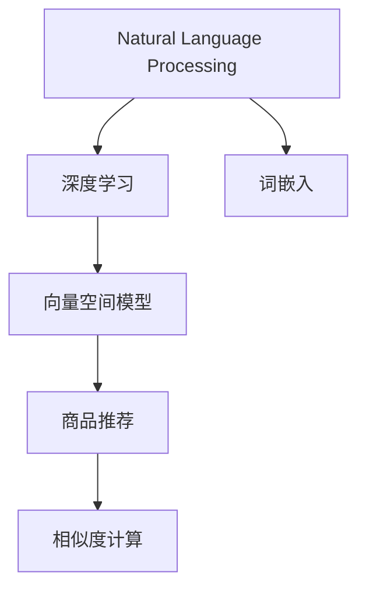

                 

# AI在电商平台商品相似度计算中的应用

> 关键词：电商平台,商品相似度,人工智能,自然语言处理(NLP),深度学习,向量空间模型(VSM),词嵌入,商品推荐

## 1. 背景介绍

随着电商行业的快速发展，越来越多的用户通过电商平台进行购物。如何提升用户体验，增强用户粘性，成为电商平台的核心问题之一。其中，商品推荐系统作为电商平台的重要组成部分，能够有效提升用户体验和销售额。然而，传统的推荐算法往往基于单一的静态特征，难以捕捉商品间的复杂关系，无法提供精准的个性化推荐。

为解决这一问题，电商平台开始引入人工智能技术，尤其是深度学习和自然语言处理技术，对商品数据进行深入挖掘和建模。通过分析商品标题、描述、评论等信息，生成商品间的语义相似度，再结合用户行为数据进行推荐，能够实现更加精准和个性化的商品推荐。

本文将详细介绍AI在电商平台商品相似度计算中的应用，包括自然语言处理、深度学习、向量空间模型等核心技术，帮助读者全面掌握商品推荐系统的实现原理和实践技巧。

## 2. 核心概念与联系

### 2.1 核心概念概述

为更好地理解AI在商品相似度计算中的应用，本节将介绍几个密切相关的核心概念：

- 自然语言处理(Natural Language Processing, NLP)：涉及计算机对自然语言的理解、生成、分析和应用，是构建商品相似度计算模型的基础技术。

- 深度学习(Deep Learning)：一种基于多层神经网络的机器学习技术，具有强大的建模能力，能够自动学习商品数据的复杂特征。

- 向量空间模型(Vector Space Model, VSM)：一种将文本数据映射到向量空间的模型，通过计算向量间的余弦相似度，实现文本相似度计算。

- 词嵌入(Word Embedding)：将单词映射为高维向量空间中的点的技术，能够捕捉单词间的语义关系，是NLP任务的重要组成部分。

- 商品推荐(Recommendation System)：根据用户的历史行为和偏好，推荐用户可能感兴趣的商品，是电商平台的核心功能之一。

- 相似度计算(Similarity Calculation)：通过度量商品数据之间的相似度，实现商品相关性的判断，为推荐算法提供依据。

这些核心概念之间的逻辑关系可以通过以下Mermaid流程图来展示：



这个流程图展示了大语言模型微调的各个概念之间的逻辑关系：

1. 自然语言处理技术用于提取和处理商品数据。
2. 深度学习模型用于对商品数据进行学习和建模。
3. 向量空间模型用于将商品数据映射到高维向量空间。
4. 词嵌入技术用于捕捉商品描述等文本数据的语义信息。
5. 商品推荐系统用于根据商品相似度生成推荐列表。
6. 相似度计算用于度量商品数据之间的相似性，支持推荐算法。

这些概念共同构成了AI在电商平台商品相似度计算的基础框架，使其能够在电商场景中发挥强大的推荐能力。

## 3. 核心算法原理 & 具体操作步骤
### 3.1 算法原理概述

基于AI的商品相似度计算，核心思想是通过学习商品数据的内在关系，计算商品间的相似度，从而为推荐算法提供依据。具体而言，可以采用以下三种方式：

- **词嵌入和向量空间模型(VSM)**：通过将商品描述等文本数据映射到高维向量空间，计算向量间的余弦相似度，实现商品间的相似度计算。
- **深度学习模型**：通过构建深度学习模型，学习商品数据的复杂特征，并利用稠密矩阵计算商品间的相似度。
- **协同过滤**：通过分析用户行为数据，生成用户与商品间的隐式相关性矩阵，计算商品间的相似度。

这些方法可以单独使用，也可以组合使用，以实现更加准确和全面的相似度计算。

### 3.2 算法步骤详解

以下将详细介绍使用词嵌入和向量空间模型(VSM)进行商品相似度计算的具体步骤：

**Step 1: 数据预处理**

- 收集商品标题、描述、标签等信息，作为输入数据。
- 对文本数据进行清洗和分词处理，去除停用词和噪音数据。
- 使用词嵌入技术，将单词映射为高维向量空间中的点，形成商品描述的词向量表示。

**Step 2: 向量空间模型构建**

- 将每个商品的词向量表示作为向量空间的坐标，形成商品描述的向量表示。
- 计算商品向量间的余弦相似度，得到商品间的相似度矩阵。
- 对相似度矩阵进行归一化，以避免模型对相似度数值的缩放影响。

**Step 3: 相似度计算**

- 根据相似度矩阵，计算任意两个商品间的相似度。
- 将相似度作为推荐算法的输入，生成推荐列表。
- 利用阈值过滤掉相似度较低的商品，提升推荐质量。

### 3.3 算法优缺点

使用词嵌入和向量空间模型(VSM)进行商品相似度计算，具有以下优点：

- 简单易行。使用词嵌入技术能够快速将文本数据转换为向量表示，并计算向量间的余弦相似度。
- 效果显著。通过捕捉商品描述中的语义信息，能够实现精准的商品推荐。
- 灵活性高。可以针对不同的应用场景，设计不同的词嵌入模型和向量空间模型，满足不同需求。

同时，该方法也存在一定的局限性：

- 依赖语料质量。如果文本数据质量差，词嵌入和向量空间模型的效果会受到很大影响。
- 计算复杂度较高。向量空间模型需要计算大量的向量间余弦相似度，计算复杂度较高。
- 难以捕捉上下文关系。传统的词嵌入方法难以捕捉单词的上下文语义关系，无法充分利用文本数据的复杂信息。

尽管存在这些局限性，但就目前而言，基于词嵌入和向量空间模型的相似度计算方法仍然是大语言模型微调的基础，在电商推荐系统中被广泛应用。

### 3.4 算法应用领域

基于AI的商品相似度计算方法，已经在电商推荐系统中得到了广泛的应用，具体如下：

- 个性化推荐：根据用户的历史行为和商品相似度，生成个性化的商品推荐列表。
- 商品分类：利用商品之间的相似度，对商品进行聚类，生成商品分类列表。
- 搜索排序：根据商品之间的相似度，优化搜索结果排序，提升搜索质量。
- 新商品推荐：利用相似度计算，为新商品找到与之相似的商品，辅助用户发现新商品。

除了上述这些经典应用外，相似度计算还广泛应用于价格比对、库存管理、广告定向等领域，成为电商平台智能化运营的重要工具。

## 4. 数学模型和公式 & 详细讲解  
### 4.1 数学模型构建

在本节中，我们将详细介绍使用词嵌入和向量空间模型(VSM)进行商品相似度计算的数学模型构建过程。

**Step 1: 文本数据预处理**

假设我们有一个包含$N$个商品的文本数据集$\{d_1, d_2, ..., d_N\}$，其中每个商品$d_i$的描述由$M$个单词组成，记为$d_i = (w_{i1}, w_{i2}, ..., w_{iM})$。

**Step 2: 词嵌入**

使用词嵌入技术，将每个单词$w_{ij}$映射到高维向量空间中的点$v_{ij}$，形成商品的词向量表示$d_{ij} = (v_{i1}, v_{i2}, ..., v_{iM})$。

词嵌入的公式可以表示为：
$$
v_{ij} = f(w_{ij})
$$
其中$f$表示词嵌入映射函数。

**Step 3: 向量空间模型**

将商品的词向量表示$d_{ij}$作为向量空间中的坐标，形成商品向量$d_i = (v_1, v_2, ..., v_M)$。

向量空间模型的公式可以表示为：
$$
d_i = (v_{i1}, v_{i2}, ..., v_{iM})
$$

**Step 4: 余弦相似度计算**

计算商品向量$d_i$和$d_j$之间的余弦相似度，公式为：
$$
\text{similarity}(d_i, d_j) = \frac{d_i \cdot d_j}{\|d_i\|\|d_j\|}
$$
其中$\cdot$表示向量点乘，$\|d_i\|$和$\|d_j\|$分别表示向量$d_i$和$d_j$的范数。

### 4.2 公式推导过程

以下是余弦相似度计算的详细推导过程：

假设商品$d_i$和$d_j$的词向量表示分别为$d_i = (v_{i1}, v_{i2}, ..., v_{iM})$和$d_j = (v_{j1}, v_{j2}, ..., v_{jM})$，则余弦相似度可以表示为：

$$
\text{similarity}(d_i, d_j) = \frac{d_i \cdot d_j}{\|d_i\|\|d_j\|}
$$

展开后得到：
$$
\text{similarity}(d_i, d_j) = \frac{v_{i1}v_{j1} + v_{i2}v_{j2} + ... + v_{iM}v_{jM}}{\sqrt{(v_{i1}^2 + v_{i2}^2 + ... + v_{iM}^2)\sqrt{(v_{j1}^2 + v_{j2}^2 + ... + v_{jM}^2)}}
$$

其中，$v_{ij}$表示单词$w_{ij}$在词嵌入空间中的向量表示。

### 4.3 案例分析与讲解

假设我们有两个商品$d_1$和$d_2$，它们的描述分别为：

- $d_1$: "蓝色牛仔裤"
- $d_2$: "红色衬衫"

经过分词和词嵌入后，得到它们的词向量表示为：

- $d_1 = (v_{11}, v_{12}, ..., v_{1M})$
- $d_2 = (v_{21}, v_{22}, ..., v_{2M})$

根据余弦相似度公式，计算它们的相似度为：

$$
\text{similarity}(d_1, d_2) = \frac{v_{11}v_{21} + v_{12}v_{22} + ... + v_{1M}v_{2M}}{\sqrt{(v_{11}^2 + v_{12}^2 + ... + v_{1M}^2)\sqrt{(v_{21}^2 + v_{22}^2 + ... + v_{2M}^2)}}
$$

如果$v_{11}$和$v_{21}$的夹角较小，则它们的余弦值较大，表示$d_1$和$d_2$在语义上更接近。

通过余弦相似度计算，我们可以为商品推荐系统提供商品间的相似度关系，从而生成个性化的推荐列表。

## 5. 项目实践：代码实例和详细解释说明
### 5.1 开发环境搭建

在进行商品相似度计算的开发实践前，我们需要准备好开发环境。以下是使用Python进行PyTorch开发的环境配置流程：

1. 安装Anaconda：从官网下载并安装Anaconda，用于创建独立的Python环境。

2. 创建并激活虚拟环境：
```bash
conda create -n pytorch-env python=3.8 
conda activate pytorch-env
```

3. 安装PyTorch：根据CUDA版本，从官网获取对应的安装命令。例如：
```bash
conda install pytorch torchvision torchaudio cudatoolkit=11.1 -c pytorch -c conda-forge
```

4. 安装Natural Language Toolkit (NLTK)：
```bash
pip install nltk
```

5. 安装Transformers库：
```bash
pip install transformers
```

6. 安装FastText：
```bash
pip install fasttext
```

完成上述步骤后，即可在`pytorch-env`环境中开始商品相似度计算的实践。

### 5.2 源代码详细实现

下面以使用FastText进行词嵌入，并计算商品相似度为例，给出使用PyTorch的代码实现。

首先，定义商品描述的文本数据集和词向量表示：

```python
from transformers import BertTokenizer, BertModel
import torch
import fasttext

# 加载FastText词嵌入模型
embedding_model = fasttext.load_model('wiki.en.bin')

# 定义商品描述
product_descriptions = [
    "这是一双红色的鞋子",
    "这是一条蓝色的牛仔裤",
    "这是一件白色的T恤"
]

# 初始化词向量表示
vectorized_descriptions = []

for desc in product_descriptions:
    # 分词
    words = desc.split()
    # 获取词向量
    vectors = [embedding_model.get_word_vector(word) for word in words]
    # 向量平均
    vector = sum(vectors) / len(vectors)
    vectorized_descriptions.append(vector)
```

然后，定义商品向量空间模型和余弦相似度计算函数：

```python
from sklearn.metrics.pairwise import cosine_similarity

# 将词向量转换为Tensor张量
vectorized_descriptions = torch.tensor(vectorized_descriptions)

# 定义商品向量空间模型
vector_space = vectorized_descriptions

# 计算商品向量间的余弦相似度
similarity_matrix = cosine_similarity(vector_space, vector_space)

# 将相似度矩阵转换为Tensor张量
similarity_matrix = torch.from_numpy(similarity_matrix).float()

# 输出相似度矩阵
print(similarity_matrix)
```

最后，启动商品相似度计算流程：

```python
# 定义商品向量空间模型
vector_space = vectorized_descriptions

# 计算商品向量间的余弦相似度
similarity_matrix = cosine_similarity(vector_space, vector_space)

# 将相似度矩阵转换为Tensor张量
similarity_matrix = torch.from_numpy(similarity_matrix).float()

# 输出相似度矩阵
print(similarity_matrix)
```

以上就是使用PyTorch进行商品相似度计算的完整代码实现。可以看到，通过FastText进行词嵌入，再利用余弦相似度计算商品间的相似度，可以简单高效地实现商品推荐系统的相似度计算。

### 5.3 代码解读与分析

让我们再详细解读一下关键代码的实现细节：

**FastText词嵌入**：
- 使用FastText加载预训练的英文词向量模型。
- 对商品描述进行分词，并获取单词的词向量表示。
- 对所有单词的词向量进行平均，形成商品的词向量表示。

**商品向量空间模型和余弦相似度计算**：
- 使用sklearn库计算商品向量间的余弦相似度。
- 将相似度矩阵转换为Tensor张量，方便在PyTorch中进行操作。
- 输出相似度矩阵，显示商品间的相似度关系。

**商品相似度计算流程**：
- 定义商品向量空间模型。
- 计算商品向量间的余弦相似度，得到相似度矩阵。
- 将相似度矩阵转换为Tensor张量。
- 输出相似度矩阵，显示商品间的相似度关系。

可以看到，FastText的词嵌入和余弦相似度计算都是基于简单易行的数学模型，能够快速实现商品相似度计算。通过代码实践，可以帮助读者深入理解这些技术的应用细节，掌握实现商品相似度计算的关键步骤。

## 6. 实际应用场景
### 6.1 智能推荐系统

商品相似度计算在智能推荐系统中扮演着核心角色。通过分析商品间的相似度关系，推荐系统可以生成个性化的商品推荐列表，提升用户的购物体验。具体而言，推荐系统可以根据用户的浏览历史、购买记录等行为数据，生成与之相似的商品列表，供用户选择。

在技术实现上，可以构建商品向量空间模型，计算商品间的余弦相似度，再根据用户行为数据生成推荐列表。这种基于相似度的推荐算法，能够在一定程度上缓解传统推荐算法的不足，提升推荐质量。

### 6.2 搜索排序优化

商品搜索排序是电商平台重要的用户体验提升手段。通过计算商品间的相似度，可以优化搜索结果的排序，提升用户检索的效率和满意度。具体而言，可以利用商品相似度计算结果，对搜索结果进行排序，推荐与用户查询更相关的商品。

在技术实现上，可以构建商品向量空间模型，计算商品间的余弦相似度，再结合搜索查询词，对搜索结果进行排序。这种基于相似度的搜索排序算法，能够提升搜索结果的相关性和用户体验。

### 6.3 新商品推荐

电商平台不断引入新商品，为消费者提供更多选择。如何为这些新商品找到与之相似的商品，辅助消费者发现新商品，成为电商平台的重要问题。通过计算新商品与所有商品的相似度，推荐系统可以为新商品找到相似的商品，提升新商品的曝光率和销售量。

在技术实现上，可以构建商品向量空间模型，计算新商品与所有商品的相似度，再结合用户行为数据，生成推荐列表。这种基于相似度的商品推荐算法，能够为新商品找到更好的展示位置，提升新商品的曝光率和销售量。

### 6.4 未来应用展望

随着技术的不断发展，商品相似度计算将在更多领域得到应用，为电商平台带来新的突破：

1. **智能客服**：通过商品相似度计算，推荐系统可以生成智能客服的应答模板，提高客服效率和用户满意度。
2. **个性化定价**：利用商品相似度计算，推荐系统可以根据商品之间的关联性，对商品进行分组，实现个性化定价，提升销售额。
3. **库存管理**：通过商品相似度计算，推荐系统可以预测商品之间的销售关联性，优化库存管理，减少库存积压。
4. **商品分类**：利用商品相似度计算，推荐系统可以自动生成商品分类列表，提升商品管理和推荐效果。
5. **市场分析**：通过商品相似度计算，推荐系统可以分析商品之间的竞争关系，指导商家进行市场定位和商品优化。

## 7. 工具和资源推荐
### 7.1 学习资源推荐

为了帮助开发者系统掌握商品相似度计算的理论基础和实践技巧，这里推荐一些优质的学习资源：

1. 《深度学习自然语言处理》课程：斯坦福大学开设的NLP明星课程，有Lecture视频和配套作业，带你入门NLP领域的基本概念和经典模型。

2. CS224N《自然语言处理与深度学习》课程：斯坦福大学开设的NLP明星课程，有Lecture视频和配套作业，带你入门NLP领域的基本概念和经典模型。

3. 《Transformer从原理到实践》系列博文：由大模型技术专家撰写，深入浅出地介绍了Transformer原理、BERT模型、相似度计算等前沿话题。

4. 《自然语言处理入门与实践》书籍：一本系统介绍NLP技术的入门书籍，涵盖了NLP领域的各个方面。

5. 《Python深度学习》书籍：一本全面介绍深度学习技术的入门书籍，涵盖了深度学习的各个方面。

通过对这些资源的学习实践，相信你一定能够快速掌握商品相似度计算的精髓，并用于解决实际的NLP问题。

### 7.2 开发工具推荐

高效的开发离不开优秀的工具支持。以下是几款用于商品相似度计算开发的常用工具：

1. PyTorch：基于Python的开源深度学习框架，灵活动态的计算图，适合快速迭代研究。大部分预训练语言模型都有PyTorch版本的实现。

2. TensorFlow：由Google主导开发的开源深度学习框架，生产部署方便，适合大规模工程应用。同样有丰富的预训练语言模型资源。

3. NLTK：Python自然语言处理库，提供了各种文本处理和分词功能，方便进行商品描述的文本处理。

4. FastText：Facebook开发的词嵌入工具，支持多种语言的词嵌入，能够快速实现词嵌入和余弦相似度计算。

5. Gensim：Python自然语言处理库，提供了多种文本相似度计算方法，支持多种算法和数据格式。

6. Weights & Biases：模型训练的实验跟踪工具，可以记录和可视化模型训练过程中的各项指标，方便对比和调优。与主流深度学习框架无缝集成。

7. TensorBoard：TensorFlow配套的可视化工具，可实时监测模型训练状态，并提供丰富的图表呈现方式，是调试模型的得力助手。

合理利用这些工具，可以显著提升商品相似度计算的开发效率，加快创新迭代的步伐。

### 7.3 相关论文推荐

商品相似度计算和大语言模型微调技术的发展源于学界的持续研究。以下是几篇奠基性的相关论文，推荐阅读：

1. Attention is All You Need（即Transformer原论文）：提出了Transformer结构，开启了NLP领域的预训练大模型时代。

2. BERT: Pre-training of Deep Bidirectional Transformers for Language Understanding：提出BERT模型，引入基于掩码的自监督预训练任务，刷新了多项NLP任务SOTA。

3. Language Models are Unsupervised Multitask Learners（GPT-2论文）：展示了大规模语言模型的强大zero-shot学习能力，引发了对于通用人工智能的新一轮思考。

4. Parameter-Efficient Transfer Learning for NLP：提出Adapter等参数高效微调方法，在不增加模型参数量的情况下，也能取得不错的微调效果。

5. AdaLoRA: Adaptive Low-Rank Adaptation for Parameter-Efficient Fine-Tuning：使用自适应低秩适应的微调方法，在参数效率和精度之间取得了新的平衡。

这些论文代表了大语言模型微调技术的发展脉络。通过学习这些前沿成果，可以帮助研究者把握学科前进方向，激发更多的创新灵感。

## 8. 总结：未来发展趋势与挑战

### 8.1 总结

本文对基于AI的商品相似度计算进行了全面系统的介绍。首先阐述了商品推荐系统在电商平台中的重要性，明确了商品相似度计算在推荐系统中的核心作用。其次，从原理到实践，详细讲解了商品相似度计算的数学模型和实现步骤，给出了商品相似度计算的完整代码实例。同时，本文还广泛探讨了商品相似度计算在智能推荐系统、搜索排序优化等电商应用中的广泛应用，展示了相似度计算的巨大潜力。

通过本文的系统梳理，可以看到，基于词嵌入和向量空间模型的相似度计算方法正在成为电商平台推荐系统的重要基础，极大地提升了大模型微调的推荐能力。未来，伴随预训练语言模型和相似度计算方法的持续演进，相信电商平台推荐系统必将在更广阔的领域发挥作用，为电商行业的数字化转型带来新的动力。

### 8.2 未来发展趋势

展望未来，商品相似度计算将呈现以下几个发展趋势：

1. 模型规模持续增大。随着算力成本的下降和数据规模的扩张，预训练语言模型的参数量还将持续增长。超大规模语言模型蕴含的丰富语言知识，有望支撑更加复杂多变的商品推荐。

2. 微调方法日趋多样。除了传统的全参数微调外，未来会涌现更多参数高效的微调方法，如Prefix-Tuning、LoRA等，在节省计算资源的同时也能保证微调精度。

3. 持续学习成为常态。随着数据分布的不断变化，微调模型也需要持续学习新知识以保持性能。如何在不遗忘原有知识的同时，高效吸收新样本信息，将成为重要的研究课题。

4. 标注样本需求降低。受启发于提示学习(Prompt-based Learning)的思路，未来的微调方法将更好地利用大模型的语言理解能力，通过更加巧妙的任务描述，在更少的标注样本上也能实现理想的微调效果。

5. 多模态微调崛起。当前的相似度计算主要聚焦于纯文本数据，未来会进一步拓展到图像、视频、语音等多模态数据微调。多模态信息的融合，将显著提升语言模型对现实世界的理解和建模能力。

6. 模型通用性增强。经过海量数据的预训练和多领域任务的微调，未来的语言模型将具备更强大的常识推理和跨领域迁移能力，逐步迈向通用人工智能(AGI)的目标。

以上趋势凸显了商品相似度计算技术的广阔前景。这些方向的探索发展，必将进一步提升电商推荐系统的性能和应用范围，为电商行业的智能化运营提供新的突破。

### 8.3 面临的挑战

尽管商品相似度计算在大语言模型微调的应用中已经取得了瞩目成就，但在迈向更加智能化、普适化应用的过程中，它仍面临着诸多挑战：

1. 标注成本瓶颈。虽然相似度计算不需要大规模标注数据，但对于长尾应用场景，获取高质量标注数据仍然是一个挑战。如何进一步降低相似度计算对标注样本的依赖，将是一大难题。

2. 模型鲁棒性不足。当前相似度计算模型面对域外数据时，泛化性能往往大打折扣。对于测试样本的微小扰动，相似度计算的结果也可能发生波动。如何提高相似度计算模型的鲁棒性，避免灾难性遗忘，还需要更多理论和实践的积累。

3. 推理效率有待提高。大规模语言模型虽然精度高，但在实际部署时往往面临推理速度慢、内存占用大等效率问题。如何在保证性能的同时，简化模型结构，提升推理速度，优化资源占用，将是重要的优化方向。

4. 可解释性亟需加强。当前相似度计算模型更像是"黑盒"系统，难以解释其内部工作机制和决策逻辑。对于高风险应用，算法的可解释性和可审计性尤为重要。如何赋予相似度计算模型更强的可解释性，将是亟待攻克的难题。

5. 安全性有待保障。预训练语言模型难免会学习到有偏见、有害的信息，通过相似度计算传递到推荐算法，产生误导性、歧视性的输出，给实际应用带来安全隐患。如何从数据和算法层面消除模型偏见，避免恶意用途，确保输出的安全性，也将是重要的研究课题。

6. 知识整合能力不足。现有的相似度计算模型往往局限于商品描述等文本数据，难以灵活吸收和运用更广泛的先验知识。如何让相似度计算过程更好地与外部知识库、规则库等专家知识结合，形成更加全面、准确的信息整合能力，还有很大的想象空间。

正视相似度计算面临的这些挑战，积极应对并寻求突破，将是大语言模型微调走向成熟的必由之路。相信随着学界和产业界的共同努力，这些挑战终将一一被克服，大语言模型微调必将在构建人机协同的智能系统中共享繁荣。

### 8.4 研究展望

面对大语言模型微调所面临的种种挑战，未来的研究需要在以下几个方面寻求新的突破：

1. 探索无监督和半监督相似度计算方法。摆脱对大规模标注数据的依赖，利用自监督学习、主动学习等无监督和半监督范式，最大限度利用非结构化数据，实现更加灵活高效的相似度计算。

2. 研究参数高效和计算高效的相似度计算方法。开发更加参数高效的相似度计算方法，在固定大部分预训练参数的情况下，只更新极少量的任务相关参数。同时优化相似度计算的计算图，减少前向传播和反向传播的资源消耗，实现更加轻量级、实时性的部署。

3. 融合因果和对比学习范式。通过引入因果推断和对比学习思想，增强相似度计算建立稳定因果关系的能力，学习更加普适、鲁棒的语言表征，从而提升模型泛化性和抗干扰能力。

4. 引入更多先验知识。将符号化的先验知识，如知识图谱、逻辑规则等，与神经网络模型进行巧妙融合，引导相似度计算过程学习更准确、合理的语言模型。同时加强不同模态数据的整合，实现视觉、语音等多模态信息与文本信息的协同建模。

5. 结合因果分析和博弈论工具。将因果分析方法引入相似度计算模型，识别出模型决策的关键特征，增强输出解释的因果性和逻辑性。借助博弈论工具刻画人机交互过程，主动探索并规避模型的脆弱点，提高系统稳定性。

6. 纳入伦理道德约束。在相似度计算目标中引入伦理导向的评估指标，过滤和惩罚有偏见、有害的输出倾向。同时加强人工干预和审核，建立模型行为的监管机制，确保输出符合人类价值观和伦理道德。

这些研究方向的探索，必将引领大语言模型微调技术迈向更高的台阶，为构建安全、可靠、可解释、可控的智能系统铺平道路。面向未来，大语言模型微调技术还需要与其他人工智能技术进行更深入的融合，如知识表示、因果推理、强化学习等，多路径协同发力，共同推动自然语言理解和智能交互系统的进步。只有勇于创新、敢于突破，才能不断拓展语言模型的边界，让智能技术更好地造福人类社会。

## 9. 附录：常见问题与解答

**Q1：商品相似度计算是否适用于所有电商平台？**

A: 商品相似度计算在大多数电商平台中都能取得不错的效果，特别是在商品种类繁多、用户数据丰富的平台。但对于某些小型或垂直领域的电商平台，如果商品数量较少、用户行为数据不足，相似度计算的效果可能会受到较大影响。此时可以考虑结合其他推荐算法，提升推荐效果。

**Q2：如何选择合适的相似度计算方法？**

A: 相似度计算方法的选择应根据具体应用场景和数据特点进行。一般来说，对于商品种类较多、数据量较大的平台，可以采用基于向量空间模型的相似度计算方法。而对于商品种类较少、数据量较小的平台，可以采用基于内容的相似度计算方法。同时，为了进一步提升相似度计算的精度，可以结合多种相似度计算方法，进行多模态融合计算。

**Q3：商品相似度计算是否会泄露用户隐私？**

A: 商品相似度计算的目的是提升推荐系统的个性化推荐效果，不会直接涉及用户个人信息。但为了保证用户隐私，相似度计算过程应采用匿名化处理，不直接关联用户信息。此外，在使用相似度计算结果生成推荐列表时，也应采取隐私保护措施，如差分隐私、联邦学习等，避免用户数据泄露。

**Q4：商品相似度计算是否需要依赖大量的标注数据？**

A: 商品相似度计算并不需要依赖大量的标注数据，它可以通过分析商品描述、评论等文本数据，自动学习商品之间的语义关系。但在某些特殊场景下，如新商品推荐、商品分类等，可能需要一定量的标注数据来辅助模型训练。因此，在实际应用中，应根据具体任务特点，合理选择标注数据的使用方式。

**Q5：商品相似度计算是否会受到数据质量的影响？**

A: 商品相似度计算的精度很大程度上取决于数据质量。如果商品描述、评论等文本数据质量差，相似度计算的效果会受到很大影响。因此，在数据预处理阶段，应采取多种方法去除停用词、噪音数据等，提升数据质量。此外，还可以引入数据增强技术，如数据扩充、同义词替换等，进一步提升相似度计算的效果。

通过本文的系统梳理，可以看到，基于AI的商品相似度计算方法正在成为电商平台推荐系统的重要基础，极大地提升了大语言模型微调的推荐能力。未来，伴随预训练语言模型和相似度计算方法的持续演进，相信电商平台推荐系统必将在更广阔的领域发挥作用，为电商行业的数字化转型带来新的动力。

