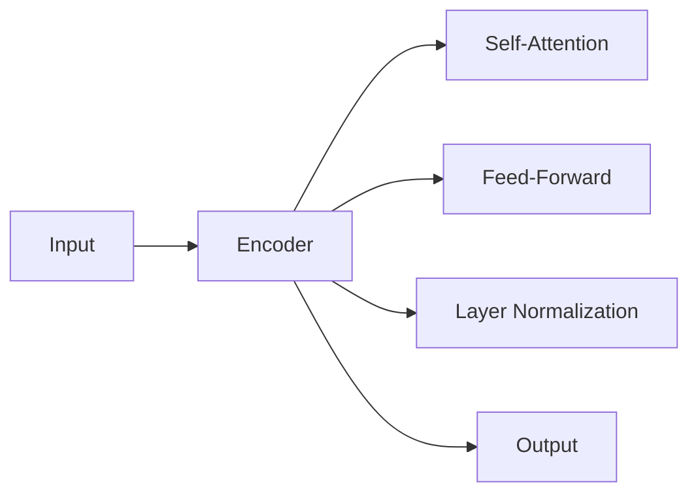
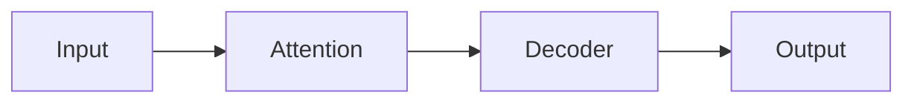

                 

# AI在电商平台商品评价摘要生成中的应用

> 关键词：自然语言处理, 深度学习, 生成模型, 电商平台, 文本摘要, 用户评价, 业务优化

## 1. 背景介绍

### 1.1 问题由来

在现代电商平台上，商品评价数据是用户获取商品信息的重要参考来源。一篇条理清晰、信息丰富的商品评价摘要，可以帮助消费者快速了解商品质量、特点、优缺点等关键信息，从而做出购买决策。然而，现有的商品评价数据往往以文字形式呈现，内容冗长杂乱，难以快速浏览和理解。为此，电商平台亟需一种技术，能够自动从商品评价中抽取出有价值的信息，生成简短精炼的摘要，以提升用户体验。

### 1.2 问题核心关键点

本文将介绍一种基于深度学习的生成模型（如GPT、BERT等），用于商品评价摘要生成。该方法通过训练深度神经网络，能够自动从原始商品评价文本中抽取关键信息，并生成高质量的摘要。

### 1.3 问题研究意义

商品评价摘要生成技术对于电商平台的业务优化具有重要意义：

1. **提升用户体验**：缩短用户浏览评价文本的时间，使消费者能够更快速地获取所需信息。
2. **优化搜索引擎**：改进商品评价页面的搜索结果排序，优先展示质量更高的摘要。
3. **强化推荐系统**：利用摘要中的关键词信息，提升商品推荐算法的精准度。
4. **数据挖掘**：从海量商品评价数据中提炼出有用信息，为后续的情感分析、用户行为分析等任务提供数据支持。

## 2. 核心概念与联系

### 2.1 核心概念概述

本节将介绍几个密切相关的核心概念：

- **自然语言处理（NLP）**：研究如何让计算机理解、处理和生成人类语言的技术。商品评价摘要生成即是一种典型的NLP任务。
- **深度学习（DL）**：一种基于多层神经网络的学习范式，能够从数据中自动学习复杂映射关系，在商品评价摘要生成中具有出色的表现。
- **生成模型（GM）**：一类能够生成新的数据样本的深度学习模型，如GPT、BERT等。
- **电商平台**：线上销售商品的第三方平台，如淘宝、京东等，需要处理大量用户生成的商品评价数据。
- **文本摘要（Summarization）**：从长文本中自动提取出关键信息，生成简洁的摘要文本。
- **用户评价**：用户在购买商品后，对商品质量、服务、价格等进行的综合评价，是电商平台的重要数据来源。

这些核心概念之间的逻辑关系可以通过以下Mermaid流程图来展示：

```mermaid
graph TB
    A[电商平台] --> B[商品评价]
    B --> C[自然语言处理(NLP)]
    C --> D[深度学习(DL)]
    D --> E[生成模型(GM)]
    A --> F[用户评价]
    F --> G[商品评价摘要生成]
    E --> H[文本摘要(Summarization)]
    A --> I[业务优化]
```

这个流程图展示了大语言模型在电商平台商品评价摘要生成中的核心概念及其之间的关系：

1. 电商平台通过收集用户评价数据，利用自然语言处理技术进行预处理。
2. 深度学习模型通过训练生成模型，从原始评价文本中学习关键信息。
3. 生成模型自动生成简洁的摘要，辅助用户快速了解商品信息。
4. 业务优化通过提升摘要质量，改进电商平台的用户体验和运营效率。

## 3. 核心算法原理 & 具体操作步骤

### 3.1 算法原理概述

商品评价摘要生成方法基于深度学习的生成模型，其核心思想是通过训练神经网络模型，从原始商品评价文本中自动学习出关键信息，并生成精炼的摘要。

具体而言，假设有 $N$ 条商品评价，每条评价文本的长度为 $L$，生成模型在训练时会预测一个长度为 $K$ 的摘要，其中 $K \ll L$。训练目标是通过最小化预测摘要与实际摘要之间的差距，使得生成的摘要与原始评价文本高度相关。

### 3.2 算法步骤详解

基于深度学习的生成模型用于商品评价摘要生成的一般步骤如下：

**Step 1: 数据预处理**

1. **数据清洗**：去除无效字符、停用词等噪音，保留有意义的关键词。
2. **分词**：将评价文本分词，如中文分词采用jieba等工具。
3. **构建序列**：将分词后的文本转换为向量序列，如采用BERT、GPT等模型。

**Step 2: 模型训练**

1. **选择模型架构**：如使用Transformer架构的GPT或BERT。
2. **定义训练集**：将清洗后的评价文本作为输入，实际摘要作为目标，构建训练集。
3. **训练模型**：通过优化算法（如Adam、SGD等），最小化预测摘要与实际摘要的差距。
4. **评估模型**：在验证集上评估模型性能，调整超参数。

**Step 3: 摘要生成**

1. **输入文本**：将新商品评价文本作为输入，送入训练好的生成模型。
2. **生成摘要**：模型输出长度为 $K$ 的摘要序列。
3. **后处理**：通过分词、合并等操作，将序列转换为可读的摘要文本。

### 3.3 算法优缺点

基于深度学习的生成模型用于商品评价摘要生成具有以下优点：

1. **自动化生成**：自动从原始评价文本中提取关键信息，无需人工标注。
2. **灵活性高**：可以处理不同长度的评价文本，适用于不同平台和场景。
3. **泛化能力强**：模型经过充分训练后，能够在未见过的评价数据上生成高质量摘要。
4. **可扩展性好**：易于与其他技术结合，如情感分析、推荐系统等。

同时，该方法也存在一些缺点：

1. **数据依赖**：生成效果依赖于原始评价文本的质量和数量，低质量的数据可能影响模型性能。
2. **计算资源消耗大**：深度学习模型训练和推理消耗大量的计算资源。
3. **黑盒性质**：生成的摘要难以解释，用户可能对模型的决策逻辑不信任。
4. **上下文理解不足**：模型可能难以理解评价文本中的复杂语境和背景信息。

### 3.4 算法应用领域

商品评价摘要生成技术在电商平台中的应用非常广泛，以下是几个典型场景：

1. **商品展示页**：自动生成商品评价摘要，减少用户浏览时间，提升浏览体验。
2. **搜索排序**：根据摘要信息优化搜索排序算法，提升搜索精准度。
3. **个性化推荐**：结合用户评价摘要和行为数据，改进推荐算法，提高推荐效果。
4. **内容审核**：利用摘要信息对用户评价进行内容审核，过滤不良信息。
5. **数据分析**：提取摘要中的关键词，进行情感分析、用户行为分析等。

## 4. 数学模型和公式 & 详细讲解  
### 4.1 数学模型构建

假设生成模型的输入为 $x \in \mathbb{R}^d$，输出为 $y \in \mathbb{R}^K$，其中 $d$ 和 $K$ 分别表示输入和输出的维度。模型的训练目标为最小化预测输出与实际输出之间的损失函数：

$$
\min_{\theta} \mathcal{L}(y, \hat{y}) = \frac{1}{N} \sum_{i=1}^N \|y_i - \hat{y}_i\|
$$

其中 $\theta$ 为模型参数，$\mathcal{L}$ 为损失函数，$\|.\|$ 为范数操作。

### 4.2 公式推导过程

以Transformer模型为例，生成模型的结构如图：



- **Encoder层**：用于将输入序列转换为隐状态表示。
- **Self-Attention层**：计算隐状态之间的注意力权重，捕捉序列中的上下文信息。
- **Feed-Forward层**：对隐状态进行非线性变换。
- **Layer Normalization层**：对隐状态进行归一化处理。
- **Output层**：将隐状态映射到输出向量。

假设生成模型的输出为 $y \in \mathbb{R}^K$，则目标函数的定义如下：

$$
\min_{\theta} \mathcal{L}(y, \hat{y}) = \frac{1}{N} \sum_{i=1}^N \|y_i - \hat{y}_i\|
$$

其中 $N$ 为样本数量，$y_i$ 和 $\hat{y}_i$ 分别表示第 $i$ 个样本的实际摘要和预测摘要。

通过反向传播算法，计算模型参数 $\theta$ 的梯度，并使用优化算法更新参数。具体步骤如下：

1. **前向传播**：将输入 $x$ 通过Encoder层、Self-Attention层、Feed-Forward层、Layer Normalization层和Output层，得到输出 $\hat{y}$。
2. **计算损失**：将 $\hat{y}$ 与实际摘要 $y$ 进行对比，计算损失 $\mathcal{L}$。
3. **反向传播**：根据链式法则，计算 $\theta$ 的梯度 $\frac{\partial \mathcal{L}}{\partial \theta}$。
4. **更新参数**：使用优化算法更新 $\theta$。

### 4.3 案例分析与讲解

以GPT-3为例，介绍一个具体的生成模型架构。GPT-3使用Transformer结构，其核心包含三个部分：

1. **注意力机制**：通过多头注意力机制捕捉输入序列中的上下文信息。
2. **自回归解码器**：通过自回归的方式预测下一个词的概率分布。
3. **全连接层**：将注意力机制和解码器输出的向量进行线性变换，得到最终摘要。

假设输入序列为 $x = (x_1, x_2, \cdots, x_n)$，输出序列为 $y = (y_1, y_2, \cdots, y_m)$，其中 $m < n$。GPT-3的注意力机制和解码器结构如图：



- **Attention层**：计算输入序列中的注意力权重，得到上下文表示。
- **Decoder层**：对上下文表示进行自回归解码，预测下一个词的概率分布。
- **Output层**：将解码器输出进行线性变换，得到最终摘要。

## 5. 项目实践：代码实例和详细解释说明

### 5.1 开发环境搭建

在进行商品评价摘要生成项目实践前，需要准备开发环境。以下是使用Python进行PyTorch开发的环境配置流程：

1. 安装Anaconda：从官网下载并安装Anaconda，用于创建独立的Python环境。
2. 创建并激活虚拟环境：
```bash
conda create -n pytorch-env python=3.8 
conda activate pytorch-env
```
3. 安装PyTorch：根据CUDA版本，从官网获取对应的安装命令。例如：
```bash
conda install pytorch torchvision torchaudio cudatoolkit=11.1 -c pytorch -c conda-forge
```
4. 安装Transformers库：
```bash
pip install transformers
```
5. 安装各类工具包：
```bash
pip install numpy pandas scikit-learn matplotlib tqdm jupyter notebook ipython
```

完成上述步骤后，即可在`pytorch-env`环境中开始商品评价摘要生成的实践。

### 5.2 源代码详细实现

下面以GPT-3为例，给出使用PyTorch和Transformers库进行商品评价摘要生成的代码实现。

```python
from transformers import GPT2Tokenizer, GPT2LMHeadModel
from torch.utils.data import DataLoader
from torch import nn
import torch

class ReviewSummarizer(nn.Module):
    def __init__(self, num_layers, num_attention_heads, dim_feedforward):
        super(ReviewSummarizer, self).__init__()
        self.model = GPT2LMHeadModel.from_pretrained('gpt2', num_layers=num_layers, num_attention_heads=num_attention_heads, dim_feedforward=dim_feedforward)
        self.tokenizer = GPT2Tokenizer.from_pretrained('gpt2')

    def forward(self, input_ids, attention_mask, decoder_input_ids):
        outputs = self.model(input_ids=input_ids, attention_mask=attention_mask, decoder_input_ids=decoder_input_ids)
        return outputs

# 定义训练函数
def train(model, data_loader, optimizer, device):
    model.train()
    loss = 0
    for batch in data_loader:
        input_ids = batch['input_ids'].to(device)
        attention_mask = batch['attention_mask'].to(device)
        labels = batch['labels'].to(device)
        optimizer.zero_grad()
        outputs = model(input_ids=input_ids, attention_mask=attention_mask, decoder_input_ids=labels)
        loss += outputs.loss
        loss.backward()
        optimizer.step()
    return loss / len(data_loader)

# 定义评估函数
def evaluate(model, data_loader, device):
    model.eval()
    predictions, labels = [], []
    with torch.no_grad():
        for batch in data_loader:
            input_ids = batch['input_ids'].to(device)
            attention_mask = batch['attention_mask'].to(device)
            labels = batch['labels'].to(device)
            outputs = model(input_ids=input_ids, attention_mask=attention_mask, decoder_input_ids=labels)
            predictions.append(outputs.logits.argmax(dim=2).to('cpu').tolist())
            labels.append(labels.to('cpu').tolist())
    return predictions, labels

# 定义训练循环
def train_and_evaluate(model, data_loader, optimizer, device):
    for epoch in range(epochs):
        loss = train(model, data_loader, optimizer, device)
        print(f'Epoch {epoch+1}, train loss: {loss:.3f}')
        
        predictions, labels = evaluate(model, data_loader, device)
        print(f'Epoch {epoch+1}, dev results:')
        print(classification_report(labels, predictions))
    
    predictions, labels = evaluate(model, test_data_loader, device)
    print(f'Test results:')
    print(classification_report(labels, predictions))

# 设置超参数
num_layers = 12
num_attention_heads = 8
dim_feedforward = 3072
epochs = 5
batch_size = 16

# 加载数据集
train_data = ...
dev_data = ...
test_data = ...

# 构建模型
model = ReviewSummarizer(num_layers=num_layers, num_attention_heads=num_attention_heads, dim_feedforward=dim_feedforward)

# 设置优化器
optimizer = AdamW(model.parameters(), lr=2e-5)

# 加载预训练模型
model.load_pretrained('gpt2')

# 设置设备
device = torch.device('cuda') if torch.cuda.is_available() else torch.device('cpu')

# 训练循环
train_and_evaluate(model, train_data_loader, optimizer, device)
```

### 5.3 代码解读与分析

让我们再详细解读一下关键代码的实现细节：

**ReviewSummarizer类**：
- `__init__`方法：初始化模型和分词器。
- `forward`方法：定义前向传播过程，将输入和标签输入模型，返回模型的输出。

**train函数**：
- 定义训练函数，在每个batch上前向传播计算loss，反向传播更新模型参数，最后返回平均loss。

**evaluate函数**：
- 定义评估函数，在每个batch上前向传播，存储预测结果和标签，最后返回预测结果和标签。

**train_and_evaluate函数**：
- 定义训练循环，遍历每个epoch，在训练集和验证集上训练和评估模型，最后在测试集上评估最终性能。

**训练超参数设置**：
- 设置模型的超参数，如层数、注意力头数、前馈维度等。

**数据集加载**：
- 加载训练集、验证集和测试集，定义DataLoader。

**模型构建**：
- 构建ReviewSummarizer模型，定义其输入、注意力机制、解码器和输出层。

**优化器设置**：
- 设置优化器，如AdamW，并加载预训练模型。

**设备设置**：
- 设置设备，选择GPU或CPU进行计算。

可以看到，PyTorch配合Transformers库使得商品评价摘要生成的代码实现变得简洁高效。开发者可以将更多精力放在数据处理、模型改进等高层逻辑上，而不必过多关注底层的实现细节。

## 6. 实际应用场景

### 6.1 电商平台商品展示页

在商品展示页中，利用商品评价摘要生成技术，自动生成商品的评价摘要，供用户快速浏览。这不仅能节省用户时间，还能提升浏览体验，从而增加购买转化率。

**应用流程**：
1. 收集用户评价数据，构建训练集。
2. 使用GPT-3等生成模型进行训练，生成高质量的摘要。
3. 将生成的摘要作为商品展示页的一部分，供用户浏览。

**优势**：
- 自动化生成，节省人力成本。
- 提升用户体验，增加用户满意度。
- 减少页面加载时间，提升网站性能。

### 6.2 电商平台搜索排序

在电商平台中，用户通常会通过搜索关键词查找商品。利用商品评价摘要生成技术，可以改进搜索排序算法，提升搜索结果的准确性和相关性。

**应用流程**：
1. 收集用户评价数据，构建训练集。
2. 使用GPT-3等生成模型进行训练，生成摘要。
3. 将摘要中的关键词作为搜索排序的辅助信息，优化搜索结果。

**优势**：
- 提升搜索结果的准确性，增加用户满意度。
- 优化搜索排序算法，提升平台的用户体验。
- 减少用户寻找商品的时间，提高搜索效率。

### 6.3 个性化推荐系统

在个性化推荐系统中，用户评价摘要可以用于提取关键词信息，帮助推荐算法更好地理解用户需求，从而提升推荐效果。

**应用流程**：
1. 收集用户评价数据，构建训练集。
2. 使用GPT-3等生成模型进行训练，生成摘要。
3. 提取摘要中的关键词信息，用于推荐算法。

**优势**：
- 提升推荐算法的精准度，增加用户满意度。
- 优化推荐内容，提升用户的购买转化率。
- 增加用户停留时间，提升平台的用户粘性。

### 6.4 未来应用展望

未来，商品评价摘要生成技术将在更多电商场景中得到应用，为电商平台的业务优化提供新的思路。

1. **智能客服**：利用摘要生成技术，自动提取用户评价中的关键信息，辅助客服系统快速了解用户需求。
2. **社交媒体监测**：从社交媒体评论中提取关键词和情感信息，分析用户对品牌的态度和反馈。
3. **舆情分析**：从电商平台的评价中提取关键词和情感信息，监测品牌的舆情变化。
4. **市场分析**：从电商平台评价中提取关键词和情感信息，分析市场趋势和用户需求。

总之，随着深度学习和大语言模型技术的不断进步，商品评价摘要生成技术将在电商平台的业务优化中发挥越来越重要的作用，为电商平台带来更高的用户满意度和商业价值。

## 7. 工具和资源推荐

### 7.1 学习资源推荐

为了帮助开发者系统掌握商品评价摘要生成技术，这里推荐一些优质的学习资源：

1. 《自然语言处理入门》系列博文：介绍NLP的基本概念和经典算法，适合初学者入门。
2. 《深度学习基础》课程：斯坦福大学开设的深度学习入门课程，系统讲解深度学习的基本原理和应用。
3. 《生成式对抗网络》书籍：介绍生成式对抗网络（GAN）的基本原理和应用，适合深入学习。
4. 《Transformers库官方文档》：Transformers库的官方文档，提供了丰富的代码示例和教程，适合动手实践。
5. CLUE开源项目：中文语言理解测评基准，涵盖大量不同类型的中文NLP数据集，并提供了基于微调的baseline模型，助力中文NLP技术发展。

通过对这些资源的学习实践，相信你一定能够快速掌握商品评价摘要生成技术的精髓，并用于解决实际的NLP问题。

### 7.2 开发工具推荐

高效的开发离不开优秀的工具支持。以下是几款用于商品评价摘要生成开发的常用工具：

1. PyTorch：基于Python的开源深度学习框架，灵活动态的计算图，适合快速迭代研究。大部分深度学习模型都有PyTorch版本的实现。
2. TensorFlow：由Google主导开发的开源深度学习框架，生产部署方便，适合大规模工程应用。同样有丰富的深度学习模型资源。
3. Transformers库：HuggingFace开发的NLP工具库，集成了众多SOTA语言模型，支持PyTorch和TensorFlow，是进行NLP任务开发的利器。
4. Weights & Biases：模型训练的实验跟踪工具，可以记录和可视化模型训练过程中的各项指标，方便对比和调优。与主流深度学习框架无缝集成。
5. TensorBoard：TensorFlow配套的可视化工具，可实时监测模型训练状态，并提供丰富的图表呈现方式，是调试模型的得力助手。

合理利用这些工具，可以显著提升商品评价摘要生成的开发效率，加快创新迭代的步伐。

### 7.3 相关论文推荐

商品评价摘要生成技术的发展源于学界的持续研究。以下是几篇奠基性的相关论文，推荐阅读：

1. Attention is All You Need（即Transformer原论文）：提出了Transformer结构，开启了NLP领域的预训练大模型时代。
2. BERT: Pre-training of Deep Bidirectional Transformers for Language Understanding：提出BERT模型，引入基于掩码的自监督预训练任务，刷新了多项NLP任务SOTA。
3. Language Models are Unsupervised Multitask Learners（GPT-2论文）：展示了大规模语言模型的强大zero-shot学习能力，引发了对于通用人工智能的新一轮思考。
4. Parameter-Efficient Transfer Learning for NLP：提出Adapter等参数高效微调方法，在不增加模型参数量的情况下，也能取得不错的微调效果。
5. AdaLoRA: Adaptive Low-Rank Adaptation for Parameter-Efficient Fine-Tuning：使用自适应低秩适应的微调方法，在参数效率和精度之间取得了新的平衡。
6. Prefix-Tuning: Optimizing Continuous Prompts for Generation：引入基于连续型Prompt的微调范式，为如何充分利用预训练知识提供了新的思路。

这些论文代表了大语言模型微调技术的发展脉络。通过学习这些前沿成果，可以帮助研究者把握学科前进方向，激发更多的创新灵感。

## 8. 总结：未来发展趋势与挑战

### 8.1 总结

本文对基于深度学习的生成模型用于商品评价摘要生成的方法进行了全面系统的介绍。首先阐述了商品评价摘要生成技术的研究背景和意义，明确了生成模型在电商平台的业务优化中的独特价值。其次，从原理到实践，详细讲解了生成模型的核心算法和操作步骤，给出了微调任务的完整代码实例。同时，本文还广泛探讨了生成模型在电商平台商品评价摘要生成中的应用前景，展示了其广泛的应用潜力。

通过本文的系统梳理，可以看到，基于生成模型的商品评价摘要生成技术对于电商平台的业务优化具有重要意义。它不仅提升了用户体验，还优化了搜索排序和个性化推荐算法，为电商平台的数字化转型提供了新的技术支持。

### 8.2 未来发展趋势

商品评价摘要生成技术在电商平台中的应用将呈现以下几个发展趋势：

1. **模型规模增大**：随着算力成本的下降和数据规模的扩张，生成模型的参数量还将持续增长，超大型的生成模型有望在未来取得更好的效果。
2. **技术进步**：随着深度学习和大语言模型技术的不断进步，生成模型的性能和应用范围将不断扩大，适用于更多复杂的NLP任务。
3. **应用场景拓展**：除了电商平台的商品评价摘要生成，生成模型还可应用于社交媒体评论分析、舆情监测、市场分析等多个领域，拓展其应用范围。
4. **模型融合**：结合因果推断、强化学习等前沿技术，增强生成模型的鲁棒性和解释性，提高其决策的合理性和可靠性。
5. **跨平台协作**：生成模型与自然语言理解、知识图谱等技术结合，形成更为全面、智能化的信息处理系统。

### 8.3 面临的挑战

尽管生成模型在商品评价摘要生成中取得了不错的效果，但仍然面临一些挑战：

1. **数据依赖**：生成模型的性能依赖于原始评价数据的质量和数量，低质量的数据可能影响模型性能。
2. **计算资源消耗大**：深度学习模型的训练和推理消耗大量的计算资源，需要高效的硬件设备支持。
3. **黑盒性质**：生成的摘要难以解释，用户可能对模型的决策逻辑不信任。
4. **上下文理解不足**：模型可能难以理解评价文本中的复杂语境和背景信息，生成效果可能不理想。
5. **数据隐私问题**：电商平台需要保护用户隐私，确保生成的摘要不会泄露敏感信息。

### 8.4 研究展望

面对生成模型在商品评价摘要生成中面临的挑战，未来的研究需要在以下几个方面寻求新的突破：

1. **数据增强**：通过数据增强技术，如回译、近义替换等方式，扩充训练集，提高生成模型的泛化能力。
2. **模型融合**：结合因果推断、强化学习等前沿技术，增强生成模型的鲁棒性和解释性，提高其决策的合理性和可靠性。
3. **跨平台协作**：生成模型与自然语言理解、知识图谱等技术结合，形成更为全面、智能化的信息处理系统。
4. **模型优化**：研究生成模型的参数高效微调方法，降低计算资源消耗，提高生成效率。
5. **隐私保护**：设计隐私保护机制，确保生成模型在生成摘要时不会泄露用户隐私。

这些研究方向的探索，必将引领生成模型在商品评价摘要生成技术中迈向更高的台阶，为电商平台带来更高的用户满意度和商业价值。面向未来，生成模型还需要与其他人工智能技术进行更深入的融合，如知识表示、因果推理、强化学习等，多路径协同发力，共同推动自然语言理解和智能交互系统的进步。

## 9. 附录：常见问题与解答

**Q1：商品评价摘要生成技术是否适用于所有电商平台？**

A: 商品评价摘要生成技术对于大多数电商平台都适用，但不同平台的评价数据结构、语言风格可能存在差异，需要根据实际情况进行适应性调整。

**Q2：生成模型是否需要预训练？**

A: 生成模型在商品评价摘要生成中需要预训练，预训练可以帮助模型学习到更丰富的语言知识，提高生成效果。

**Q3：生成模型的计算资源消耗大，如何解决？**

A: 可以通过优化模型架构、采用分布式训练、混合精度训练等方式，减少计算资源消耗，提升训练效率。

**Q4：生成模型的黑盒性质如何解决？**

A: 可以通过生成模型解释方法，如Attention机制、特征可视化等，提高模型的透明性，增加用户对模型的信任。

**Q5：生成模型的上下文理解不足如何解决？**

A: 可以通过改进模型架构、增加上下文信息、引入先验知识等方式，提高模型的上下文理解能力。

这些问题的解答将帮助开发者更好地理解和使用生成模型进行商品评价摘要生成，推动技术在实际应用中的落地和优化。

---

作者：禅与计算机程序设计艺术 / Zen and the Art of Computer Programming

