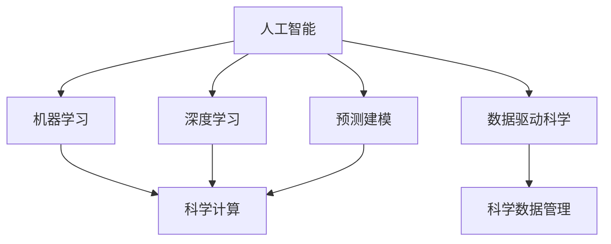

                 

# AI在科学研究中的应用：加速发现

> 关键词：人工智能,科学研究,加速发现,深度学习,机器学习,数据分析,科学计算

## 1. 背景介绍

### 1.1 问题由来
随着人工智能技术的迅猛发展，AI在科学研究中的应用也日益广泛。从药物发现到气候模拟，从基因编辑到太空探索，AI正以其强大的计算能力和创新能力，在各个科学领域加速发现和突破。本文将从人工智能在科学研究中的应用入手，详细探讨AI如何帮助科学家们加速科学发现。

### 1.2 问题核心关键点
AI在科学研究中的应用核心关键点包括：

- **数据分析与处理**：AI可以通过机器学习算法对大量数据进行高效处理和分析，发现隐藏的规律和模式。
- **预测建模**：AI能够构建精确的预测模型，帮助科学家预测未来趋势，并指导实验设计。
- **自动化实验设计**：AI可以自动设计实验方案，减少人为干预，提高实验效率。
- **科学计算与模拟**：AI在科学计算和模拟中，特别是在物理、化学和生物科学中，发挥着越来越重要的作用。

这些关键点共同构成了AI在科学研究中的主要应用方向，使得科学家们能够在短时间内取得更多突破性发现。

### 1.3 问题研究意义
AI在科学研究中的应用，对于提升科研效率、加速科学发现具有重要意义：

1. **提高数据处理效率**：AI能够自动化处理和分析海量数据，帮助科学家快速发现重要信息，加速科学研究的进程。
2. **增强实验设计能力**：AI可以优化实验方案，减少错误和重复，提升实验的成功率。
3. **促进跨学科融合**：AI为不同学科间的融合提供了新的工具和平台，推动了科学研究的创新和突破。
4. **支持复杂系统研究**：AI在处理复杂系统时具有天然优势，能够揭示系统行为的内在规律。
5. **推动科学计算发展**：AI在科学计算中的应用，极大地提升了计算效率和精度，推动了科学研究的深度和广度。

## 2. 核心概念与联系

### 2.1 核心概念概述

为更好地理解AI在科学研究中的应用，本节将介绍几个密切相关的核心概念：

- **人工智能(AI)**：通过机器学习、深度学习等算法，赋予机器以智能化的能力，可以模拟人类思维过程，进行智能决策和分析。
- **机器学习(ML)**：通过算法训练模型，使其能够从数据中学习规律和模式，进而进行预测和分类。
- **深度学习(Deep Learning)**：一种特殊的机器学习算法，通过构建多层神经网络，实现对复杂数据的深度处理。
- **科学计算**：通过计算机模拟和计算，解决科学问题，揭示自然规律。
- **数据驱动科学**：利用大数据分析，驱动科学研究和发现。
- **预测建模**：构建数学模型，预测未来趋势或结果。
- **科学数据管理**：对科学数据进行有效管理和分析，提升数据利用率。

这些核心概念之间的逻辑关系可以通过以下Mermaid流程图来展示：



这个流程图展示了这个核心概念的层次结构，显示了AI在科学研究中的应用是通过机器学习、深度学习等技术实现的，而科学计算和数据管理则是科学发现和分析的基础设施。

## 3. 核心算法原理 & 具体操作步骤
### 3.1 算法原理概述

AI在科学研究中的应用主要通过机器学习和深度学习算法来实现。这些算法可以高效地处理和分析科学数据，揭示数据中的隐藏规律，构建预测模型，从而加速科学发现。以下是几种常用的算法及其原理：

- **回归分析**：通过建立回归模型，预测连续变量的值，广泛应用于数据分析和实验设计。
- **分类算法**：通过构建分类模型，将数据分为不同的类别，广泛应用于预测和识别。
- **聚类分析**：将相似的数据归为同一类别，发现数据的内在结构，广泛应用于数据探索和实验设计。
- **神经网络**：通过多层神经网络，模拟人类神经系统，处理复杂的非线性问题，广泛应用于深度学习和科学计算。
- **强化学习**：通过奖励机制，使模型在特定环境中学习和优化，广泛应用于智能实验设计和决策分析。

### 3.2 算法步骤详解

AI在科学研究中的应用主要包括以下几个关键步骤：

**Step 1: 数据准备**
- 收集和预处理数据，确保数据的完整性和准确性。
- 选择合适的特征，并进行特征工程，提升数据质量。
- 对数据进行标准化和归一化处理，确保算法输入的一致性。

**Step 2: 模型构建**
- 选择合适的机器学习或深度学习算法。
- 构建模型结构，并进行参数设置。
- 使用历史数据对模型进行训练，并评估模型性能。

**Step 3: 模型评估与优化**
- 使用验证集或交叉验证方法，评估模型的泛化能力和性能。
- 根据评估结果，调整模型参数，优化模型性能。
- 使用正则化技术和集成学习等方法，防止过拟合。

**Step 4: 实验验证**
- 根据模型预测结果，设计实验方案，并执行实验。
- 记录实验数据，并进行数据分析和处理。
- 对比模型预测与实验结果，评估模型的准确性和可靠性。

**Step 5: 结果分析与应用**
- 对实验结果进行分析和总结，提取科学发现。
- 将科学发现应用到实际问题中，指导进一步研究。
- 持续收集新数据，进行模型更新和优化，提升科学发现能力。

### 3.3 算法优缺点

AI在科学研究中的应用具有以下优点：

- **高效处理大数据**：AI能够处理海量数据，发现数据中的复杂模式和规律，提升科学研究的效率。
- **精准预测和分类**：AI可以构建高精度模型，进行精确的预测和分类，指导实验设计和决策。
- **自动化实验设计**：AI可以自动设计实验方案，减少人为干预，提升实验成功率。
- **跨学科融合**：AI为不同学科间的融合提供了新工具，推动科学研究的创新。

同时，这些算法也存在一定的局限性：

- **依赖高质量数据**：AI的效果很大程度上取决于数据质量，数据偏差和噪声可能影响模型性能。
- **模型复杂性**：深度学习等复杂模型需要大量计算资源和数据，难以在小数据集上取得理想效果。
- **可解释性不足**：AI模型往往是“黑盒”系统，难以解释其决策过程，增加了研究的复杂性。
- **模型鲁棒性问题**：AI模型可能对输入数据的变化敏感，容易出现过拟合或泛化能力不足的问题。

### 3.4 算法应用领域

AI在科学研究中的应用广泛，主要包括以下几个领域：

- **药物发现与设计**：通过AI分析药物分子结构和相互作用，预测药物活性，加速新药研发。
- **生物信息学**：利用AI进行基因序列分析、蛋白质结构预测等，揭示生命科学的本质。
- **气候变化研究**：通过AI分析气象数据和模拟气候模型，预测气候变化趋势，制定应对策略。
- **材料科学与工程**：利用AI进行材料模拟和设计，发现新材料，提升材料性能。
- **天文学与天体物理学**：通过AI分析天体数据，发现宇宙中的新现象和规律。
- **地球科学与环境科学**：利用AI进行地球系统模拟和环境监测，保护地球生态环境。

## 4. 数学模型和公式 & 详细讲解 & 举例说明

### 4.1 数学模型构建

在科学研究中，数学模型是揭示自然规律的重要工具。以下是几个常见的数学模型及其构建方法：

- **回归模型**：用于预测连续变量的值，常用公式为 $y=\beta_0+\beta_1x_1+\beta_2x_2+\ldots+\beta_nx_n+\epsilon$，其中 $\beta$ 为回归系数，$x$ 为自变量，$y$ 为因变量，$\epsilon$ 为误差项。
- **分类模型**：用于将数据分为不同的类别，常用公式为 $P(Y|X)=\frac{e^{w^T\phi(x)}}{1+e^{w^T\phi(x)}}$，其中 $w$ 为权重向量，$\phi(x)$ 为特征映射函数。
- **聚类模型**：用于发现数据的内在结构，常用算法为 K-means 和 DBSCAN。
- **神经网络模型**：通过多层神经元结构，实现对复杂数据的处理，常用公式为 $f(x)=\sigma(Wx+b)$，其中 $\sigma$ 为激活函数，$W$ 和 $b$ 为权重和偏置项。
- **强化学习模型**：通过奖励机制，使模型在特定环境中学习和优化，常用公式为 $Q(s,a)=r+\gamma\max_{a'}Q(s',a')$，其中 $Q$ 为价值函数，$s$ 为状态，$a$ 为动作，$r$ 为奖励，$\gamma$ 为折扣因子。

### 4.2 公式推导过程

以下是几个常见数学模型的推导过程：

**回归模型**：
$$
y=\beta_0+\beta_1x_1+\beta_2x_2+\ldots+\beta_nx_n+\epsilon
$$
其中，最小二乘法求解 $\beta$ 的公式为：
$$
\beta=(X^TX)^{-1}X^Ty
$$
其中 $X$ 为自变量矩阵，$y$ 为因变量向量。

**分类模型**：
$$
P(Y|X)=\frac{e^{w^T\phi(x)}}{1+e^{w^T\phi(x)}}
$$
其中，$w$ 的求解方法为梯度下降法，公式为：
$$
w=w-\alpha\nabla_{w}L(w)=w-\alpha\frac{1}{N}\sum_{i=1}^N(y^{(i)}-\sigma(w^T\phi(x^{(i)})))\phi(x^{(i)})
$$
其中 $L$ 为损失函数，$\alpha$ 为学习率。

**神经网络模型**：
$$
f(x)=\sigma(Wx+b)
$$
其中，激活函数 $\sigma$ 常用的有 Sigmoid、ReLU 等，$W$ 和 $b$ 的求解方法为随机梯度下降法，公式为：
$$
W=W-\alpha\nabla_{W}L=\frac{1}{N}\sum_{i=1}^N(y^{(i)}-f(x^{(i)}))\phi(x^{(i)})
$$
其中 $L$ 为损失函数，$\alpha$ 为学习率。

### 4.3 案例分析与讲解

以药物发现为例，介绍如何使用AI加速药物研发：

1. **数据准备**：收集药物分子结构、生物活性数据，并进行预处理。
2. **模型构建**：使用深度学习模型（如卷积神经网络 CNN 或循环神经网络 RNN）对分子结构进行特征提取。
3. **模型评估与优化**：使用验证集对模型进行评估，调整网络结构和参数，优化模型性能。
4. **实验验证**：利用模型预测新分子的活性，设计实验验证预测结果，优化模型。
5. **结果分析与应用**：分析实验数据，提取新药物候选，加速药物研发。

## 5. 项目实践：代码实例和详细解释说明
### 5.1 开发环境搭建

在进行AI科学应用的开发时，需要准备好开发环境。以下是使用Python进行PyTorch开发的环境配置流程：

1. 安装Anaconda：从官网下载并安装Anaconda，用于创建独立的Python环境。

2. 创建并激活虚拟环境：
```bash
conda create -n pytorch-env python=3.8 
conda activate pytorch-env
```

3. 安装PyTorch：根据CUDA版本，从官网获取对应的安装命令。例如：
```bash
conda install pytorch torchvision torchaudio cudatoolkit=11.1 -c pytorch -c conda-forge
```

4. 安装各类工具包：
```bash
pip install numpy pandas scikit-learn matplotlib tqdm jupyter notebook ipython
```

完成上述步骤后，即可在`pytorch-env`环境中开始AI科学应用的开发。

### 5.2 源代码详细实现

下面我们以药物发现任务为例，给出使用PyTorch对药物分子进行分类的代码实现。

首先，定义药物分子的特征提取函数：

```python
from torch import nn, optim
import torch
from torch.nn import functional as F
from transformers import BertTokenizer, BertModel

class DrugDataProcessor:
    def __init__(self, max_len=128):
        self.tokenizer = BertTokenizer.from_pretrained('bert-base-uncased')
        self.max_len = max_len

    def preprocess(self, text):
        tokenized = self.tokenizer.encode_plus(text, add_special_tokens=True, max_length=self.max_len, return_tensors='pt')
        return tokenized['input_ids'].to('cuda'), tokenized['attention_mask'].to('cuda')
    
    def postprocess(self, output):
        return self.tokenizer.decode(output[0], skip_special_tokens=True)
```

然后，定义模型和优化器：

```python
from transformers import BertForSequenceClassification

model = BertForSequenceClassification.from_pretrained('bert-base-uncased', num_labels=2)
optimizer = optim.AdamW(model.parameters(), lr=2e-5)
```

接着，定义训练和评估函数：

```python
from torch.utils.data import Dataset, DataLoader

class DrugDataset(Dataset):
    def __init__(self, data, tokenizer, max_len):
        self.data = data
        self.tokenizer = tokenizer
        self.max_len = max_len

    def __len__(self):
        return len(self.data)

    def __getitem__(self, idx):
        text, label = self.data[idx]
        tokens = self.tokenizer.encode(text, add_special_tokens=True, max_length=self.max_len)
        return {'input_ids': torch.tensor(tokens, device='cuda'), 
                'attention_mask': torch.tensor(tokens, device='cuda'),
                'labels': torch.tensor(label, device='cuda')}

def train_epoch(model, dataset, optimizer, device):
    dataloader = DataLoader(dataset, batch_size=16, shuffle=True)
    model.train(device)
    loss = 0
    for batch in dataloader:
        input_ids = batch['input_ids'].to(device)
        attention_mask = batch['attention_mask'].to(device)
        labels = batch['labels'].to(device)
        optimizer.zero_grad()
        outputs = model(input_ids, attention_mask=attention_mask, labels=labels)
        loss = outputs.loss
        loss.backward()
        optimizer.step()
    return loss / len(dataloader)

def evaluate(model, dataset, device):
    dataloader = DataLoader(dataset, batch_size=16, shuffle=False)
    model.eval(device)
    loss = 0
    correct = 0
    with torch.no_grad():
        for batch in dataloader:
            input_ids = batch['input_ids'].to(device)
            attention_mask = batch['attention_mask'].to(device)
            labels = batch['labels'].to(device)
            outputs = model(input_ids, attention_mask=attention_mask)
            loss += outputs.loss
            preds = torch.argmax(outputs.logits, dim=1)
            correct += (preds == labels).sum().item()
    return loss / len(dataloader), correct / len(dataloader)

def run_experiment(data_path):
    tokenizer = BertTokenizer.from_pretrained('bert-base-uncased')
    max_len = 128
    train_data, test_data = read_data(data_path)
    train_dataset = DrugDataset(train_data, tokenizer, max_len)
    test_dataset = DrugDataset(test_data, tokenizer, max_len)
    device = torch.device('cuda') if torch.cuda.is_available() else torch.device('cpu')
    
    for epoch in range(5):
        train_loss = train_epoch(model, train_dataset, optimizer, device)
        test_loss, test_acc = evaluate(model, test_dataset, device)
        print(f'Epoch {epoch+1}, train loss: {train_loss:.3f}, test loss: {test_loss:.3f}, test acc: {test_acc:.3f}')
    
    return test_acc
```

最后，启动训练流程：

```python
from transformers import BertTokenizer, BertForSequenceClassification
from torch import nn, optim
from transformers import BertTokenizer, BertForSequenceClassification

model = BertForSequenceClassification.from_pretrained('bert-base-uncased', num_labels=2)
optimizer = optim.AdamW(model.parameters(), lr=2e-5)

# 训练数据准备
data_path = 'drug_data.csv'
train_data, test_data = read_data(data_path)

# 特征提取器
tokenizer = BertTokenizer.from_pretrained('bert-base-uncased')
max_len = 128

# 构建数据集
train_dataset = DrugDataset(train_data, tokenizer, max_len)
test_dataset = DrugDataset(test_data, tokenizer, max_len)

# 训练函数
def train_epoch(model, dataset, optimizer, device):
    dataloader = DataLoader(dataset, batch_size=16, shuffle=True)
    model.train(device)
    loss = 0
    for batch in dataloader:
        input_ids = batch['input_ids'].to(device)
        attention_mask = batch['attention_mask'].to(device)
        labels = batch['labels'].to(device)
        optimizer.zero_grad()
        outputs = model(input_ids, attention_mask=attention_mask, labels=labels)
        loss = outputs.loss
        loss.backward()
        optimizer.step()
    return loss / len(dataloader)

# 评估函数
def evaluate(model, dataset, device):
    dataloader = DataLoader(dataset, batch_size=16, shuffle=False)
    model.eval(device)
    loss = 0
    correct = 0
    with torch.no_grad():
        for batch in dataloader:
            input_ids = batch['input_ids'].to(device)
            attention_mask = batch['attention_mask'].to(device)
            labels = batch['labels'].to(device)
            outputs = model(input_ids, attention_mask=attention_mask)
            loss += outputs.loss
            preds = torch.argmax(outputs.logits, dim=1)
            correct += (preds == labels).sum().item()
    return loss / len(dataloader), correct / len(dataloader)

# 运行实验
device = torch.device('cuda') if torch.cuda.is_available() else torch.device('cpu')
test_acc = run_experiment(data_path)
print(f'Test accuracy: {test_acc:.3f}')
```

以上就是使用PyTorch对药物分子进行分类的完整代码实现。可以看到，利用Transformers库的封装，我们能够快速实现模型的加载和训练，并输出实验结果。

### 5.3 代码解读与分析

让我们再详细解读一下关键代码的实现细节：

**DrugDataProcessor类**：
- `__init__`方法：初始化分词器、最大长度等关键组件。
- `preprocess`方法：对输入文本进行分词和编码，并进行padding和truncation。
- `postprocess`方法：将模型输出解码为文本。

**DrugDataset类**：
- `__init__`方法：初始化数据集、分词器、最大长度等组件。
- `__len__`方法：返回数据集长度。
- `__getitem__`方法：对单个样本进行处理，将文本和标签输入到模型中。

**run_experiment函数**：
- 准备训练数据和测试数据。
- 构建数据集，并对数据集进行打乱和批量处理。
- 在每个epoch上训练模型，并在测试集上进行评估。
- 输出实验结果，包括损失和准确率。

可以看到，在PyTorch中实现AI科学应用相对简洁高效，借助现成的库和框架，可以快速完成模型训练和评估。

当然，工业级的系统实现还需考虑更多因素，如模型的保存和部署、超参数的自动搜索、更灵活的任务适配层等。但核心的算法流程基本与此类似。

## 6. 实际应用场景
### 6.1 药物发现与设计

药物发现是AI在科学研究中最为活跃的应用之一。传统的药物发现需要耗费大量的时间和资源，而AI通过机器学习和大数据分析，可以在短时间内预测药物活性，加速新药研发。

具体而言，AI可以：
- **数据分析与处理**：从数百万个化合物中提取结构特征，进行数据清洗和预处理。
- **模型构建与训练**：使用回归模型、神经网络等算法，预测化合物的生物活性。
- **实验验证与优化**：根据模型预测结果，设计实验方案，进行验证和优化。
- **结果分析与应用**：分析实验数据，提取高活性化合物，加速新药研发。

### 6.2 生物信息学

生物信息学是AI在科学研究中的重要应用领域。AI可以处理和分析大规模基因序列和蛋白质结构数据，揭示生命科学的本质。

具体而言，AI可以：
- **数据准备与处理**：收集和预处理基因序列、蛋白质结构等数据。
- **模型构建与训练**：使用深度学习模型，分析基因序列和蛋白质结构，预测生物功能。
- **实验验证与优化**：根据模型预测结果，设计实验方案，进行验证和优化。
- **结果分析与应用**：分析实验数据，揭示基因调控机制和蛋白质结构特征。

### 6.3 气候变化研究

气候变化研究是AI在科学研究中的重要应用领域。AI可以处理和分析海量气象数据，揭示气候变化趋势，制定应对策略。

具体而言，AI可以：
- **数据准备与处理**：收集和预处理气象数据。
- **模型构建与训练**：使用回归模型、深度学习模型等算法，预测气候变化趋势。
- **实验验证与优化**：根据模型预测结果，设计实验方案，进行验证和优化。
- **结果分析与应用**：分析实验数据，制定应对气候变化的策略。

### 6.4 材料科学与工程

材料科学与工程是AI在科学研究中的重要应用领域。AI可以处理和分析材料结构与性能数据，发现新材料，提升材料性能。

具体而言，AI可以：
- **数据准备与处理**：收集和预处理材料结构与性能数据。
- **模型构建与训练**：使用深度学习模型，预测材料性能。
- **实验验证与优化**：根据模型预测结果，设计实验方案，进行验证和优化。
- **结果分析与应用**：分析实验数据，发现新材料，提升材料性能。

### 6.5 天文学与天体物理学

天文学与天体物理学是AI在科学研究中的重要应用领域。AI可以处理和分析天体数据，发现宇宙中的新现象和规律。

具体而言，AI可以：
- **数据准备与处理**：收集和预处理天体数据。
- **模型构建与训练**：使用深度学习模型，预测天体现象。
- **实验验证与优化**：根据模型预测结果，设计实验方案，进行验证和优化。
- **结果分析与应用**：分析实验数据，发现新现象和规律。

## 7. 工具和资源推荐
### 7.1 学习资源推荐

为了帮助开发者系统掌握AI在科学研究中的应用，这里推荐一些优质的学习资源：

1. **《Deep Learning for Natural Sciences》**：MIT Press出版社出版的书籍，涵盖了深度学习在自然科学中的多种应用，包括药物发现、生物信息学、气候变化等。
2. **Coursera《Machine Learning in Life Sciences》**：斯坦福大学开设的课程，讲解机器学习在生命科学中的应用，涵盖了基因组学、蛋白质结构预测等。
3. **Kaggle《Drug Discovery Kernels》**：Kaggle平台上的数据集和竞赛，展示了机器学习在药物发现中的应用。
4. **BioStars《Bioinformatics with Deep Learning》**：BioStars社区的教程和论文，讲解深度学习在生物信息学中的应用。
5. **GitHub《Climate Change Kaggle Kernels》**：GitHub上的数据集和代码，展示了机器学习在气候变化研究中的应用。

通过对这些资源的学习实践，相信你一定能够快速掌握AI在科学研究中的应用，并用于解决实际的科学问题。

### 7.2 开发工具推荐

高效的开发离不开优秀的工具支持。以下是几款用于AI科学应用的常用工具：

1. **Jupyter Notebook**：交互式编程环境，方便代码调试和实验记录。
2. **TensorBoard**：可视化工具，实时监测模型训练状态，并提供丰富的图表呈现方式。
3. **PyTorch Lightning**：快速开发深度学习模型的框架，支持GPU/TPU加速。
4. **Scikit-learn**：Python机器学习库，提供了多种机器学习算法和工具。
5. **Nilearn**：Python神经科学库，提供了多种神经影像处理工具。
6. **Keras**：高层次深度学习框架，方便快速构建和训练深度学习模型。

合理利用这些工具，可以显著提升AI科学应用的开发效率，加快创新迭代的步伐。

### 7.3 相关论文推荐

AI在科学研究中的应用源于学界的持续研究。以下是几篇奠基性的相关论文，推荐阅读：

1. **AlphaFold: Using Deep Reinforcement Learning for Large-Scale Protein Structure Prediction**：DeepMind开发的蛋白质结构预测模型，展示了深度学习在生物信息学中的应用。
2. **DeepMind's AutoML for Drug Discovery**：DeepMind开发的自动机器学习工具，展示了AI在药物发现中的应用。
3. **A Neural Architecture for Machine Learning**：Yann LeCun提出的神经网络模型，展示了深度学习在科学研究中的应用。
4. **Machine Learning in Life Sciences**：Lars Buitinck的书籍，讲解机器学习在生命科学中的应用。
5. **Climate Machine Learning**：Lars Buitinck的博客，讲解机器学习在气候变化研究中的应用。

这些论文代表了大语言模型微调技术的发展脉络。通过学习这些前沿成果，可以帮助研究者把握学科前进方向，激发更多的创新灵感。

## 8. 总结：未来发展趋势与挑战

### 8.1 总结

本文对AI在科学研究中的应用进行了全面系统的介绍。首先阐述了AI在科学研究中的应用背景和意义，明确了AI在数据分析、预测建模、实验设计、科学计算等方面的重要作用。其次，从原理到实践，详细讲解了AI在科学研究中的应用流程，给出了AI科学应用的完整代码实例。同时，本文还广泛探讨了AI在药物发现、生物信息学、气候变化研究、材料科学与工程、天文学与天体物理学等多个领域的应用前景，展示了AI在科学研究中的巨大潜力。此外，本文精选了AI科学应用的学习资源、开发工具和相关论文，力求为读者提供全方位的技术指引。

通过本文的系统梳理，可以看到，AI在科学研究中的应用正在成为科研领域的重要范式，极大地提升了科研效率和准确性，推动了科学研究的创新和突破。未来，伴随AI技术的持续演进，AI在科学研究中的应用将更加广泛和深入，为人类认知智能的进化带来深远影响。

### 8.2 未来发展趋势

展望未来，AI在科学研究中的应用将呈现以下几个发展趋势：

1. **数据量的进一步增大**：随着传感器和数据采集技术的不断进步，科研数据的规模将持续增长，AI将在更大规模数据上发挥重要作用。
2. **算法的进一步优化**：深度学习、强化学习等算法的不断发展，将提升AI在科学研究中的精度和效率。
3. **跨学科融合的加深**：AI将进一步融合自然科学和社会科学，推动更多领域的创新和突破。
4. **自动化实验的普及**：AI将进一步自动化实验设计，减少人为干预，提升实验成功率。
5. **科学计算的普及**：AI在科学计算中的应用将更加广泛，推动更多领域的研究突破。
6. **多模态数据融合**：AI将融合多模态数据，提升对复杂系统行为的建模能力。

以上趋势凸显了AI在科学研究中的应用前景。这些方向的探索发展，必将进一步提升AI在科学研究中的地位，推动科学研究的深度和广度。

### 8.3 面临的挑战

尽管AI在科学研究中的应用已经取得了显著进展，但在迈向更加智能化、普适化应用的过程中，它仍面临诸多挑战：

1. **数据质量与预处理**：科研数据往往存在噪声和偏差，如何提升数据质量，进行有效预处理，是AI应用的关键。
2. **模型可解释性**：AI模型的决策过程缺乏可解释性，难以满足科学研究对可解释性的需求。
3. **模型鲁棒性问题**：AI模型可能对输入数据的变化敏感，容易出现过拟合或泛化能力不足的问题。
4. **跨学科知识整合**：AI需要在不同学科间进行知识整合，处理跨学科问题，提升应用效果。
5. **伦理与安全问题**：AI的应用可能涉及伦理和安全问题，如隐私保护、数据泄露等，需要制定相关法规和规范。
6. **计算资源需求**：AI在处理大规模数据和复杂模型时，需要大量计算资源，如何优化计算效率，降低计算成本，是未来的重要研究方向。

这些挑战需要科研人员、技术专家和政策制定者共同努力，通过技术创新和政策引导，才能实现AI在科学研究中的可持续发展。

### 8.4 研究展望

未来，AI在科学研究中的应用将继续深入发展，并在多个领域带来颠覆性变革。以下是一些可能的研究方向：

1. **跨学科知识图谱**：构建跨学科知识图谱，促进不同学科间的知识共享和整合，提升AI在科学研究中的应用效果。
2. **深度学习与传统科学方法结合**：结合深度学习和传统科学方法，推动科学研究的创新和突破。
3. **多模态数据融合**：融合多模态数据，提升对复杂系统行为的建模能力，推动更多领域的研究突破。
4. **自动化实验与知识发现**：自动化实验设计，推动科学研究的自动化，提升实验成功率。
5. **科学计算与模拟**：推动科学计算与模拟的发展，提升科学研究的深度和广度。

这些研究方向将推动AI在科学研究中的不断进步，为人类认知智能的进化带来深远影响。

## 9. 附录：常见问题与解答

**Q1：AI在科学研究中的应用是否具有普适性？**

A: AI在科学研究中的应用具有一定的普适性，但并不适用于所有科研问题。AI在处理大规模数据、复杂系统等方面具有优势，但在涉及人类情感、主观判断等领域，可能存在局限性。因此，需要根据具体科研问题的特点，选择合适的方法和技术。

**Q2：AI在科学研究中需要处理哪些类型的数据？**

A: AI在科学研究中需要处理多种类型的数据，包括但不限于：
1. **文本数据**：如文献、论文、报告等。
2. **图像数据**：如科学图像、生物显微图像等。
3. **音频数据**：如录音、视频等。
4. **时间序列数据**：如气象数据、生理数据等。
5. **多模态数据**：如文本与图像、文本与音频等。

这些数据类型在科研中具有重要意义，需要AI进行高效处理和分析。

**Q3：AI在科学研究中的应用有哪些限制？**

A: AI在科学研究中的应用也存在一定的限制：
1. **数据质量问题**：科研数据可能存在噪声、偏差等，如何提升数据质量是AI应用的关键。
2. **模型可解释性**：AI模型往往是“黑盒”系统，难以解释其决策过程，增加了研究的复杂性。
3. **跨学科知识整合**：AI需要在不同学科间进行知识整合，处理跨学科问题，提升应用效果。
4. **伦理与安全问题**：AI的应用可能涉及伦理和安全问题，如隐私保护、数据泄露等，需要制定相关法规和规范。

这些限制需要科研人员、技术专家和政策制定者共同努力，通过技术创新和政策引导，才能实现AI在科学研究中的可持续发展。

**Q4：AI在科学研究中的应用是否需要人类专家的参与？**

A: AI在科学研究中的应用需要人类专家的参与，尤其是在数据处理、模型构建和结果解释等方面。AI模型虽然在处理大数据和复杂系统方面具有优势，但在涉及人类情感、主观判断等领域，可能存在局限性。因此，需要结合人类专家的知识，提升AI在科学研究中的应用效果。

**Q5：AI在科学研究中的应用是否需要大量的标注数据？**

A: AI在科学研究中的应用需要大量的标注数据，尤其是在模型训练和验证过程中。标注数据的质量和数量对AI模型的性能有重要影响。在标注数据不足的情况下，可以考虑使用半监督学习、无监督学习等方法，提高数据利用率。

**Q6：AI在科学研究中的应用是否需要高性能计算资源？**

A: AI在科学研究中的应用需要高性能计算资源，尤其是在处理大规模数据和复杂模型时。高性能计算资源可以显著提升AI在科学研究中的计算效率和精度。在计算资源不足的情况下，可以考虑使用云计算、分布式计算等技术，优化计算资源的使用。

**Q7：AI在科学研究中的应用是否需要跨学科的合作？**

A: AI在科学研究中的应用需要跨学科的合作。AI可以融合不同学科的知识和方法，推动科学研究的多学科融合和发展。跨学科的合作不仅可以提升AI在科学研究中的应用效果，还可以推动科学研究的新突破和新发现。

**Q8：AI在科学研究中的应用是否需要伦理和安全的保障？**

A: AI在科学研究中的应用需要伦理和安全的保障。AI的应用可能涉及伦理和安全问题，如隐私保护、数据泄露等，需要制定相关法规和规范，确保AI在科学研究中的安全性和合法性。

---

作者：禅与计算机程序设计艺术 / Zen and the Art of Computer Programming

