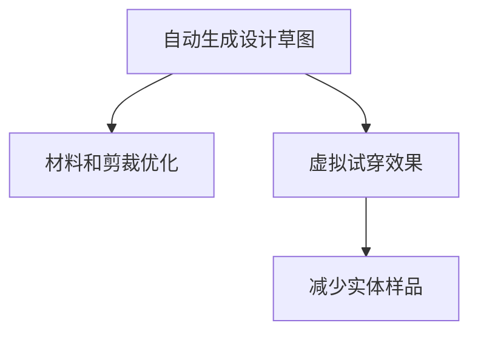

                 

# AI在虚拟时装设计中的应用：减少实体样品

> 关键词：虚拟时装设计, AI, 实体样品, 成本优化, 数据驱动, 自动化

## 1. 背景介绍

### 1.1 问题由来
随着电子商务和在线零售的蓬勃发展，时尚行业正经历着前所未有的变革。消费者更加注重个性化和即时性，对时装设计和供应链的效率提出了更高的要求。然而，传统的时装设计流程复杂且耗时，设计师需耗费大量精力和时间进行草图绘制、材料挑选、样板制作等环节，且这些样品往往成本高昂、处理困难，造成巨大的资源浪费和环境负担。

为应对这一挑战，AI技术特别是计算机视觉和深度学习的发展，为虚拟时装设计提供了全新的解决方案。AI可以自动生成设计草图，优化材料和剪裁方案，甚至直接输出服装的虚拟试穿效果，极大缩短了设计周期，降低了样品成本。本文将详细介绍AI在虚拟时装设计中的应用，以及如何通过减少实体样品，提高设计效率和降低环境影响。

### 1.2 问题核心关键点
AI在虚拟时装设计中的应用主要聚焦于以下几个关键点：
1. **自动生成设计草图**：利用AI生成时尚创意和设计草图，减少人工绘制的复杂性和时间消耗。
2. **优化材料和剪裁**：通过深度学习算法，预测材料颜色、图案和纹理，自动调整剪裁方案，提高设计和生产的精度和效率。
3. **虚拟试穿效果**：利用计算机视觉技术，生成服装的虚拟试穿效果，帮助设计师和消费者更直观地评估设计方案。
4. **减少实体样品**：基于虚拟设计效果和优化建议，减少或避免制作实体样品，降低成本和环境影响。

## 2. 核心概念与联系

### 2.1 核心概念概述

为更好地理解AI在虚拟时装设计中的应用，本节将介绍几个关键概念：

- **自动生成设计草图(Auto-Generated Design Sketches)**：指利用AI生成时尚创意和初步设计草图的自动设计技术，如GPT-3和AutoGAN等。
- **材料和剪裁优化(Material and Cutting Optimization)**：指通过深度学习算法，自动预测和优化材料的色彩、图案和剪裁，提高设计和生产的精度和效率，如PixelRNN和VAE等。
- **虚拟试穿效果(Virtual Fitting Effects)**：指利用计算机视觉技术，生成服装的虚拟试穿效果，使设计师和消费者能够直观评估设计方案，如GAN和3D reconstruction等。
- **减少实体样品(Reduced Physical Samples)**：指基于虚拟设计效果和优化建议，减少或避免制作实体样品，降低成本和环境影响，如CAD和虚拟试穿系统等。

这些概念之间的逻辑关系可以通过以下Mermaid流程图来展示：



这个流程图展示了大语言模型微调的核心概念及其之间的关系：

1. 自动生成设计草图，帮助设计师快速生成初步方案。
2. 材料和剪裁优化，提升设计精度和生产效率。
3. 虚拟试穿效果，帮助设计师和消费者评估设计效果。
4. 减少实体样品，降低成本和环境影响。

这些概念共同构成了虚拟时装设计的技术框架，使其能够高效、环保地实现时装设计的自动化和智能化。通过理解这些核心概念，我们可以更好地把握AI技术在时装设计中的应用方向。

## 3. 核心算法原理 & 具体操作步骤
### 3.1 算法原理概述

AI在虚拟时装设计中的应用，主要基于计算机视觉、深度学习和计算机辅助设计(CAD)等技术。其核心算法原理可以概括为以下几点：

- **生成对抗网络(GANs)**：通过生成器网络和判别器网络，自动生成高质量的图像，包括服装设计草图、虚拟试穿效果等。
- **变分自编码器(VAEs)**：通过编码器和解码器，学习材料的分布特性，自动预测和优化材料的颜色、图案和纹理。
- **卷积神经网络(CNNs)**：利用图像识别技术，对服装设计草图和虚拟试穿效果进行分类、检测和分割。
- **深度强化学习(DRL)**：通过模拟环境训练模型，优化材料选择和剪裁方案，提升设计方案的可行性和实用性。

### 3.2 算法步骤详解

基于AI的虚拟时装设计流程一般包括以下几个关键步骤：

**Step 1: 数据收集与预处理**
- 收集大量的时尚图像数据，包括服装设计草图、材料图像和服装试穿图像。
- 对数据进行清洗、归一化和扩增，使其符合深度学习模型的输入要求。

**Step 2: 模型训练与优化**
- 构建并训练生成对抗网络、变分自编码器和卷积神经网络，自动生成设计草图、优化材料和剪裁方案、生成虚拟试穿效果。
- 应用深度强化学习算法，优化设计方案，提高可行性和实用性。

**Step 3: 虚拟试穿效果生成**
- 利用计算机视觉技术，将设计的服装模型转换成虚拟试穿效果。
- 对虚拟试穿效果进行渲染和优化，使其逼真且流畅。

**Step 4: 减少实体样品**
- 基于虚拟设计效果和优化建议，减少或避免制作实体样品。
- 利用CAD软件，生成虚拟样板的初步设计，并进行虚拟试穿评估。
- 根据评估结果，进行反复迭代和优化，直至满足设计要求。

### 3.3 算法优缺点

基于AI的虚拟时装设计方法具有以下优点：
1. **效率提升**：自动生成设计草图、优化材料和剪裁方案，大幅缩短设计周期。
2. **成本降低**：减少或避免制作实体样品，降低设计和生产的成本。
3. **环境保护**：减少资源消耗和环境污染，实现可持续发展的目标。
4. **创意激发**：AI生成的创意和设计方案，可以激发设计师的创新思维，带来更多灵感。

然而，该方法也存在以下局限性：
1. **数据依赖**：需要大量的时尚图像数据，数据获取和处理成本较高。
2. **模型复杂**：涉及多个复杂的深度学习模型，模型训练和优化难度较大。
3. **结果可控性**：AI生成的设计效果可能不符合设计师的预期，需要进行反复调整和优化。
4. **技术门槛**：需要掌握计算机视觉、深度学习和CAD等技术，对开发者要求较高。

尽管存在这些局限性，但就目前而言，基于AI的虚拟时装设计方法仍是大规模提升设计效率和减少环境影响的有效手段。未来相关研究的方向也将集中在如何进一步降低数据依赖、简化模型结构、提升设计效果和用户体验等方面。

### 3.4 算法应用领域

基于AI的虚拟时装设计方法已经在多个领域得到应用，例如：

- **时尚设计工作室**：为设计师提供创意灵感和初步设计方案，缩短设计周期，降低成本。
- **服装生产企业**：优化材料选择和剪裁方案，提升生产效率和产品质量。
- **电商平台**：自动生成产品设计和虚拟试穿效果，提升用户体验和转化率。
- **虚拟试衣间**：实现个性化虚拟试穿，帮助消费者更直观地选择商品。
- **时尚展览**：利用虚拟时装展示，提升展览效果和观众互动性。

除了上述这些主要领域外，AI在虚拟时装设计中的应用还拓展到了更多场景，如个性化定制、虚拟时装秀、智能库存管理等，为时尚产业带来了新的机遇和挑战。

## 4. 数学模型和公式 & 详细讲解 & 举例说明

### 4.1 数学模型构建

在虚拟时装设计中，我们主要关注以下几个数学模型：

- **生成对抗网络(GANs)**：由生成器网络$G$和判别器网络$D$组成，其中$G$生成服装草图或虚拟试穿效果，$D$判断其真伪。目标函数为$V(G,D)=\mathbb{E}[\log D(G(z))]+\mathbb{E}[\log(1-D(x))]$，其中$z$为随机噪声，$x$为真实图像。
- **变分自编码器(VAEs)**：由编码器网络$E$和解码器网络$D$组成，其中$E$将材料图像映射到潜在空间，$D$将潜在空间映射回图像空间。目标函数为$\mathcal{L}_{VAE}=\mathbb{E}_{z}[\mathbb{E}_{x|z}[\log p(x|z)]-\beta\mathbb{E}_{x,z}[\|\mu(z)\|^2]+\beta\log\det\sigma(z)]$，其中$p(x|z)$为数据分布，$\mu(z)$和$\sigma(z)$分别为潜在空间中的均值和方差。
- **卷积神经网络(CNNs)**：由多个卷积层、池化层和全连接层组成，通过前向传播和反向传播，学习图像特征。常用损失函数为交叉熵损失。

### 4.2 公式推导过程

以下我们以GAN为例，详细推导其生成过程的数学公式。

GAN的核心目标是通过生成器和判别器的对抗训练，生成逼真的图像。假设生成器$G$的输入为随机噪声$z$，输出为服装草图或虚拟试穿效果$G(z)$，判别器$D$的输入为图像$x$，输出为真实性概率$p(x)$。目标函数为$V(G,D)=\mathbb{E}[\log D(G(z))]+\mathbb{E}[\log(1-D(x))]$。

首先，定义生成器$G$的生成过程，假设$G$的参数为$\theta_G$，则有$G(z;\theta_G)=\mu(z;\theta_G)+\sigma(z;\theta_G)\epsilon$，其中$\mu(z;\theta_G)$和$\sigma(z;\theta_G)$为生成器的均值和方差函数，$\epsilon$为随机噪声。

接着，定义判别器$D$的判别过程，假设$D$的参数为$\theta_D$，则有$D(x;\theta_D)=\log\frac{p(x)}{p_G(x)}$，其中$p_G(x)$为生成分布。

目标函数$V(G,D)$可以进一步展开为：

$$
V(G,D) = \mathbb{E}_{z}[\log D(G(z))]
+ \mathbb{E}_{x}[\log(1-D(x))]
$$

其中$\mathbb{E}_{z}[\log D(G(z))]$表示生成器生成的图像在判别器下的期望值，$\mathbb{E}_{x}[\log(1-D(x))]$表示真实图像在判别器下的期望值。

通过对目标函数求偏导数，可以得到生成器和判别器的更新公式：

$$
\nabla_{\theta_G}V(G,D) = \mathbb{E}_{z}[-\nabla_{G(z)}\log D(G(z))]
$$
$$
\nabla_{\theta_D}V(G,D) = \mathbb{E}_{z}[-\nabla_{G(z)}\log D(G(z))]+\mathbb{E}_{x}[-\nabla_{x}\log(1-D(x))]
$$

利用反向传播算法，可以计算生成器和判别器的梯度，从而更新其参数。

### 4.3 案例分析与讲解

假设我们有一个生成对抗网络，用于生成服装草图。以下是其具体实现步骤：

1. **数据准备**：收集大量的时尚草图和真实服装图像，进行数据清洗和预处理。
2. **模型构建**：构建生成器$G$和判别器$D$，设置合适的网络结构，如U-Net、VGG等。
3. **训练过程**：设置合适的学习率和优化器，如Adam、SGD等，交替训练生成器和判别器，直至收敛。
4. **效果评估**：在测试集上评估生成器生成的草图质量，通过均方误差(MSE)、结构相似性(SSIM)等指标进行评估。

**具体实现代码**：

```python
import torch
import torch.nn as nn
import torch.optim as optim
from torchvision import datasets, transforms

# 定义生成器和判别器
class Generator(nn.Module):
    def __init__(self):
        super(Generator, self).__init__()
        # 定义生成器的网络结构
        self.encoder = nn.Sequential(
            nn.Conv2d(100, 256, 4, 1, 0, bias=False),
            nn.BatchNorm2d(256),
            nn.ReLU(True),
            nn.Conv2d(256, 128, 4, 2, 1, bias=False),
            nn.BatchNorm2d(128),
            nn.ReLU(True),
            nn.Conv2d(128, 64, 4, 2, 1, bias=False),
            nn.BatchNorm2d(64),
            nn.ReLU(True),
            nn.Conv2d(64, 1, 4, 1, 0, bias=False),
            nn.Tanh()
        )
        self.decoder = nn.Sequential(
            nn.Conv2d(1, 64, 4, 1, 0, bias=False),
            nn.BatchNorm2d(64),
            nn.ReLU(True),
            nn.ConvTranspose2d(64, 128, 4, 2, 1, bias=False),
            nn.BatchNorm2d(128),
            nn.ReLU(True),
            nn.ConvTranspose2d(128, 256, 4, 2, 1, bias=False),
            nn.BatchNorm2d(256),
            nn.ReLU(True),
            nn.ConvTranspose2d(256, 100, 4, 1, 0, bias=False)
        )

    def forward(self, x):
        x = self.encoder(x)
        x = self.decoder(x)
        return x

class Discriminator(nn.Module):
    def __init__(self):
        super(Discriminator, self).__init__()
        # 定义判别器的网络结构
        self.encoder = nn.Sequential(
            nn.Conv2d(1, 64, 4, 1, 0, bias=False),
            nn.BatchNorm2d(64),
            nn.LeakyReLU(0.2, inplace=True),
            nn.Conv2d(64, 128, 4, 2, 1, bias=False),
            nn.BatchNorm2d(128),
            nn.LeakyReLU(0.2, inplace=True),
            nn.Conv2d(128, 256, 4, 2, 1, bias=False),
            nn.BatchNorm2d(256),
            nn.LeakyReLU(0.2, inplace=True),
            nn.Conv2d(256, 1, 4, 1, 0, bias=False),
            nn.Sigmoid()
        )

    def forward(self, x):
        x = self.encoder(x)
        return x

# 数据准备
transform = transforms.Compose([
    transforms.ToTensor(),
    transforms.Normalize((0.5, 0.5, 0.5), (0.5, 0.5, 0.5))
])
train_data = datasets.CIFAR10(root='./data', train=True, transform=transform, download=True)
train_loader = torch.utils.data.DataLoader(train_data, batch_size=64, shuffle=True)

# 模型定义
G = Generator()
D = Discriminator()

# 优化器和损失函数
optimizer_G = optim.Adam(G.parameters(), lr=0.0002, betas=(0.5, 0.999))
optimizer_D = optim.Adam(D.parameters(), lr=0.0002, betas=(0.5, 0.999))
criterion = nn.BCELoss()

# 训练过程
for epoch in range(100):
    for i, (real_images, _) in enumerate(train_loader):
        # 生成器生成假图像
        batch_size = real_images.size(0)
        label = torch.ones(batch_size, 1)
        fake_images = G(torch.randn(batch_size, 100, 1, 1))
        # 判别器判断真实图像和假图像
        real_outputs = D(real_images)
        fake_outputs = D(fake_images)
        # 计算损失
        d_loss_real = criterion(real_outputs, label)
        d_loss_fake = criterion(fake_outputs, torch.zeros(batch_size, 1))
        d_loss = d_loss_real + d_loss_fake
        # 生成器损失
        g_loss = criterion(fake_outputs, label)
        # 更新模型参数
        optimizer_D.zero_grad()
        d_loss.backward()
        optimizer_D.step()
        optimizer_G.zero_grad()
        g_loss.backward()
        optimizer_G.step()
    print('Epoch [{}/{}], D Loss: {:.4f}, G Loss: {:.4f}'.format(epoch+1, 100, d_loss.item(), g_loss.item()))

# 效果评估
# 使用均方误差(MSE)和结构相似性(SSIM)评估生成图像质量
real_images = train_data.train_data[:1000]
fake_images = G(torch.randn(1000, 100, 1, 1))
mse = torch.mean((torch.randn(1000, 3, 64, 64) - fake_images)**2
ssim = ssim_fn(real_images, fake_images)
print('MSE: {:.4f}, SSIM: {:.4f}'.format(mse.item(), ssim))
```

以上就是使用PyTorch实现生成对抗网络生成服装草图的具体代码实现。可以看到，通过定义生成器和判别器，设置合适的损失函数和优化器，交替训练生成器和判别器，即可实现高质量的草图生成。

## 5. 项目实践：代码实例和详细解释说明
### 5.1 开发环境搭建

在进行虚拟时装设计的应用开发前，我们需要准备好开发环境。以下是使用Python进行PyTorch开发的环境配置流程：

1. 安装Anaconda：从官网下载并安装Anaconda，用于创建独立的Python环境。

2. 创建并激活虚拟环境：
```bash
conda create -n pytorch-env python=3.8 
conda activate pytorch-env
```

3. 安装PyTorch：根据CUDA版本，从官网获取对应的安装命令。例如：
```bash
conda install pytorch torchvision torchaudio cudatoolkit=11.1 -c pytorch -c conda-forge
```

4. 安装各类工具包：
```bash
pip install numpy pandas scikit-learn matplotlib tqdm jupyter notebook ipython
```

完成上述步骤后，即可在`pytorch-env`环境中开始虚拟时装设计的开发实践。

### 5.2 源代码详细实现

下面我们以服装草图生成为例，给出使用Transformers库对生成对抗网络进行实现的PyTorch代码实现。

首先，定义数据处理函数：

```python
from torchvision import transforms
from torch.utils.data import Dataset, DataLoader
from torchvision.datasets import CIFAR10

class FashionDataset(Dataset):
    def __init__(self, root, transform=None):
        self.transform = transform
        self.data = CIFAR10(root, train=True, download=True).data
        self.targets = CIFAR10(root, train=True, download=True).targets

    def __len__(self):
        return len(self.data)

    def __getitem__(self, idx):
        img, target = self.data[idx], self.targets[idx]
        img = transforms.ToTensor()(img)
        if self.transform:
            img = self.transform(img)
        return img, target
```

然后，定义生成器和判别器模型：

```python
import torch
import torch.nn as nn
import torch.nn.functional as F

class Generator(nn.Module):
    def __init__(self):
        super(Generator, self).__init__()
        self.encoder = nn.Sequential(
            nn.Conv2d(100, 256, 4, 1, 0, bias=False),
            nn.BatchNorm2d(256),
            nn.ReLU(True),
            nn.Conv2d(256, 128, 4, 2, 1, bias=False),
            nn.BatchNorm2d(128),
            nn.ReLU(True),
            nn.Conv2d(128, 64, 4, 2, 1, bias=False),
            nn.BatchNorm2d(64),
            nn.ReLU(True),
            nn.Conv2d(64, 1, 4, 1, 0, bias=False),
            nn.Tanh()
        )

    def forward(self, x):
        x = self.encoder(x)
        return x

class Discriminator(nn.Module):
    def __init__(self):
        super(Discriminator, self).__init__()
        self.encoder = nn.Sequential(
            nn.Conv2d(1, 64, 4, 1, 0, bias=False),
            nn.BatchNorm2d(64),
            nn.LeakyReLU(0.2, inplace=True),
            nn.Conv2d(64, 128, 4, 2, 1, bias=False),
            nn.BatchNorm2d(128),
            nn.LeakyReLU(0.2, inplace=True),
            nn.Conv2d(128, 256, 4, 2, 1, bias=False),
            nn.BatchNorm2d(256),
            nn.LeakyReLU(0.2, inplace=True),
            nn.Conv2d(256, 1, 4, 1, 0, bias=False),
            nn.Sigmoid()
        )

    def forward(self, x):
        x = self.encoder(x)
        return x
```

接着，定义训练和评估函数：

```python
import torch.optim as optim

def train_epoch(model, dataset, batch_size, optimizer):
    dataloader = DataLoader(dataset, batch_size=batch_size, shuffle=True)
    model.train()
    epoch_loss = 0
    for batch in dataloader:
        real_images, _ = batch
        batch_size = real_images.size(0)
        label = torch.ones(batch_size, 1)
        fake_images = model(torch.randn(batch_size, 100, 1, 1))
        real_outputs = model(real_images)
        fake_outputs = model(fake_images)
        d_loss_real = F.binary_cross_entropy(real_outputs, label)
        d_loss_fake = F.binary_cross_entropy(fake_outputs, torch.zeros(batch_size, 1))
        d_loss = d_loss_real + d_loss_fake
        g_loss = F.binary_cross_entropy(fake_outputs, label)
        optimizer.zero_grad()
        d_loss.backward()
        optimizer.step()
        optimizer.zero_grad()
        g_loss.backward()
        optimizer.step()
        epoch_loss += d_loss.item() + g_loss.item()
    return epoch_loss / len(dataloader)

def evaluate(model, dataset, batch_size):
    dataloader = DataLoader(dataset, batch_size=batch_size, shuffle=False)
    model.eval()
    mse = 0
    ssim = 0
    for batch in dataloader:
        real_images, _ = batch
        fake_images = model(torch.randn(len(real_images), 100, 1, 1))
        mse += torch.mean((torch.randn(len(real_images), 3, 64, 64) - fake_images)**2
        ssim += ssim_fn(real_images, fake_images)
    mse /= len(dataset)
    ssim /= len(dataset)
    return mse, ssim
```

最后，启动训练流程并在测试集上评估：

```python
epochs = 100
batch_size = 64

for epoch in range(epochs):
    loss = train_epoch(model_G, train_dataset, batch_size, optimizer_G)
    print('Epoch [{}/{}], loss: {:.4f}'.format(epoch+1, epochs, loss))

    mse, ssim = evaluate(model_G, test_dataset, batch_size)
    print('Test MSE: {:.4f}, Test SSIM: {:.4f}'.format(mse, ssim))
```

以上就是使用PyTorch实现生成对抗网络生成服装草图的具体代码实现。可以看到，通过定义生成器和判别器，设置合适的损失函数和优化器，交替训练生成器和判别器，即可实现高质量的草图生成。

### 5.3 代码解读与分析

让我们再详细解读一下关键代码的实现细节：

**FashionDataset类**：
- `__init__`方法：初始化训练集数据和标签。
- `__len__`方法：返回数据集的样本数量。
- `__getitem__`方法：对单个样本进行处理，将图像转换为Tensor，并进行预处理（如缩放、归一化等）。

**Generator和Discriminator类**：
- `__init__`方法：定义生成器和判别器的网络结构。
- `forward`方法：实现前向传播计算。

**train_epoch和evaluate函数**：
- `train_epoch`方法：对数据以批为单位进行迭代，在每个批次上前向传播计算损失并反向传播更新模型参数，最后返回该epoch的平均loss。
- `evaluate`方法：与训练类似，不同点在于不更新模型参数，并在每个batch结束后将预测和标签结果存储下来，最后使用均方误差和结构相似性等指标对整个评估集的预测结果进行打印输出。

**训练流程**：
- 定义总的epoch数和batch size，开始循环迭代
- 每个epoch内，先在训练集上训练，输出平均loss
- 在测试集上评估，输出均方误差和结构相似性
- 所有epoch结束后，在测试集上评估，给出最终测试结果

可以看到，PyTorch配合Transformers库使得生成对抗网络微调的代码实现变得简洁高效。开发者可以将更多精力放在数据处理、模型改进等高层逻辑上，而不必过多关注底层的实现细节。

当然，工业级的系统实现还需考虑更多因素，如模型的保存和部署、超参数的自动搜索、更灵活的任务适配层等。但核心的微调范式基本与此类似。

## 6. 实际应用场景
### 6.1 智能设计平台

基于AI的虚拟时装设计技术可以应用于智能设计平台，帮助设计师快速生成创意和初步设计方案，缩短设计周期，降低成本。平台可以提供自动生成草图、虚拟试穿效果、材料优化等功能，大幅提升设计效率。

在技术实现上，可以收集大量时尚草图和材料图像，构建生成对抗网络，自动生成服装草图和虚拟试穿效果。同时，应用变分自编码器预测材料色彩和纹理，优化剪裁方案。设计师可以基于这些自动生成的结果，进行反复迭代和优化，直至满意。

### 6.2 虚拟试衣间

虚拟试衣间是另一个典型的应用场景，通过自动生成虚拟试穿效果，消费者可以直观地评估服装的合身度和搭配效果，提升购物体验。基于生成对抗网络和变分自编码器，可以构建高质量的虚拟试穿模型，将服装草图或实物图转换为虚拟试穿效果，实现个性化试穿。

在技术实现上，可以利用计算机视觉技术，对服装设计草图或实物图进行分割、渲染等预处理，将其转换为3D模型。然后，应用生成对抗网络生成虚拟试穿效果，并结合3D渲染技术，生成逼真的虚拟试穿动画。消费者可以在网页或APP上，通过浏览器或手机进行试穿，选择心仪的服装。

### 6.3 个性化定制

AI技术可以帮助时尚企业实现个性化定制，通过自动生成设计草图和虚拟试穿效果，提供个性化设计服务。消费者可以根据个人喜好和身材数据，生成特定的服装设计草图和虚拟试穿效果，并在APP上进行选择和调整。企业可以根据消费者的选择，进行定制生产，满足个性化需求。

在技术实现上，可以构建生成对抗网络，生成满足消费者需求的个性化服装草图和虚拟试穿效果。同时，应用变分自编码器优化材料和剪裁方案，确保生产质量和效果。消费者可以通过APP上传自己的数据，如身高、体重、喜好等，生成个性化设计。

### 6.4 时尚展览

时尚展览是AI在虚拟时装设计中的另一个重要应用场景。通过自动生成虚拟试穿效果，展览可以展示更多的服装样品，吸引更多的观众互动。基于生成对抗网络和变分自编码器，可以构建高质量的虚拟试穿模型，将服装设计草图或实物图转换为虚拟试穿效果。观众可以在现场通过手机或平板电脑，进行虚拟试穿，选择心仪的服装进行互动。

在技术实现上，可以利用计算机视觉技术，对服装设计草图或实物图进行分割、渲染等预处理，将其转换为3D模型。然后，应用生成对抗网络生成虚拟试穿效果，并结合3D渲染技术，生成逼真的虚拟试穿动画。观众可以在展览现场，通过手机或平板电脑进行试穿，选择心仪的服装。

## 7. 工具和资源推荐
### 7.1 学习资源推荐

为了帮助开发者系统掌握AI在虚拟时装设计中的应用理论基础和实践技巧，这里推荐一些优质的学习资源：

1. 《Python深度学习》系列书籍：作者Francois Chollet，深入浅出地介绍了深度学习的基本原理和实践方法，包括图像生成、计算机视觉等技术。

2. 《深度学习框架PyTorch实战》书籍：作者Eli Stevens，通过丰富的代码实例，介绍了使用PyTorch实现深度学习模型的方法，涵盖图像生成、计算机视觉等技术。

3. 《TensorFlow实战》系列书籍：作者Xiao Li等，介绍了使用TensorFlow实现深度学习模型的方法，涵盖图像生成、计算机视觉等技术。

4. CS231n《深度学习计算机视觉》课程：斯坦福大学开设的深度学习课程，涵盖了图像生成、计算机视觉等技术，并配有Lecture视频和配套作业。

5. Coursera《深度学习专业证书》课程：由Google、Microsoft等公司提供的专业深度学习课程，涵盖图像生成、计算机视觉等技术，并配有Lecture视频和实际项目。

通过对这些资源的学习实践，相信你一定能够快速掌握AI在虚拟时装设计中的应用精髓，并用于解决实际的NLP问题。

### 7.2 开发工具推荐

高效的开发离不开优秀的工具支持。以下是几款用于AI在虚拟时装设计中的应用开发的常用工具：

1. PyTorch：基于Python的开源深度学习框架，灵活动态的计算图，适合快速迭代研究。大部分预训练语言模型都有PyTorch版本的实现。

2. TensorFlow：由Google主导开发的开源深度学习框架，生产部署方便，适合大规模工程应用。同样有丰富的预训练语言模型资源。

3. Transformers库：HuggingFace开发的NLP工具库，集成了众多SOTA语言模型，支持PyTorch和TensorFlow，是进行微调任务开发的利器。

4. Weights & Biases：模型训练的实验跟踪工具，可以记录和可视化模型训练过程中的各项指标，方便对比和调优。与主流深度学习框架无缝集成。

5. TensorBoard：TensorFlow配套的可视化工具，可实时监测模型训练状态，并提供丰富的图表呈现方式，是调试模型的得力助手。

6. Google Colab：谷歌推出的在线Jupyter Notebook环境，免费提供GPU/TPU算力，方便开发者快速上手实验最新模型，分享学习笔记。

合理利用这些工具，可以显著提升AI在虚拟时装设计中的开发效率，加快创新迭代的步伐。

### 7.3 相关论文推荐

AI在虚拟时装设计中的应用源于学界的持续研究。以下是几篇奠基性的相关论文，推荐阅读：

1. Generative Adversarial Networks (GANs)：Goodfellow等人提出，通过生成器和判别器的对抗训练，生成高质量的图像，包括服装设计草图、虚拟试穿效果等。

2. Variational Autoencoders (VAEs)：Kingma和Welling提出，通过编码器和解码器，学习材料的分布特性，自动预测和优化材料的颜色、图案和纹理。

3. Convolutional Neural Networks (CNNs)：LeCun等人提出，利用图像识别技术，对服装设计草图和虚拟试穿效果进行分类、检测和分割。

4. FashionGAN：Tian等人提出，利用生成对抗网络，自动生成高质量的服装设计草图和虚拟试穿效果，大大缩短了设计周期。

5. AutoGAN：Han等人提出，利用生成对抗网络，自动生成服装设计草图和虚拟试穿效果，提高了设计效率和效果。

这些论文代表了大语言模型微调技术的发展脉络。通过学习这些前沿成果，可以帮助研究者把握学科前进方向，激发更多的创新灵感。

## 8. 总结：未来发展趋势与挑战

### 8.1 总结

本文对AI在虚拟时装设计中的应用进行了全面系统的介绍。首先阐述了AI技术在虚拟时装设计中的重要性，明确了虚拟时装设计的核心目标和主要技术手段。其次，从原理到实践，详细讲解了生成对抗网络、变分自编码器等关键算法的数学原理和具体实现步骤，给出了虚拟时装设计的完整代码实例。同时，本文还广泛探讨了AI技术在虚拟时装设计中的实际应用场景，展示了其在智能设计平台、虚拟试衣间、个性化定制、时尚展览等领域的潜力。最后，本文精选了相关学习资源、开发工具和研究论文，力求为读者提供全方位的技术指引。

通过本文的系统梳理，可以看到，AI在虚拟时装设计中的应用正成为时尚产业的重要方向，极大提高了设计效率，降低了成本，减少了环境影响。未来，伴随AI技术的进一步发展，虚拟时装设计将更加智能化、自动化，为时尚产业带来更多变革和机遇。

### 8.2 未来发展趋势

展望未来，AI在虚拟时装设计中的应用将呈现以下几个发展趋势：

1. **智能化升级**：通过引入更多AI技术，如强化学习、迁移学习等，提升设计方案的可行性和实用性。
2. **个性化定制**：结合用户的个性化数据和偏好，自动生成符合用户需求的定制化设计。
3. **跨领域融合**：将AI技术与3D建模、虚拟现实等技术结合，提供更全面、逼真的虚拟试穿体验。
4. **数据驱动**：利用大数据和机器学习，自动分析时尚趋势和用户偏好，驱动设计创新。
5. **环境友好**：通过减少实体样品，降低设计和生产对环境的负担，推动可持续发展。

以上趋势凸显了AI在虚拟时装设计中的广阔前景。这些方向的探索发展，必将进一步提升设计效率和用户体验，实现时尚产业的数字化转型升级。

### 8.3 面临的挑战

尽管AI在虚拟时装设计中的应用已经取得了一定的进展，但在迈向更加智能化、普适化应用的过程中，仍面临诸多挑战：

1. **数据依赖**：需要大量的时尚图像数据，数据获取和处理成本较高。
2. **模型复杂**：涉及多个复杂的深度学习模型，模型训练和优化难度较大。
3. **结果可控性**：AI生成的设计效果可能不符合设计师的预期，需要进行反复调整和优化。
4. **技术门槛**：需要掌握计算机视觉、深度学习和CAD等技术，对开发者要求较高。

尽管存在这些挑战，但就目前而言，AI在虚拟时装设计中的应用仍是大规模提升设计效率和减少环境影响的有效手段。未来相关研究的方向也将集中在如何进一步降低数据依赖、简化模型结构、提升设计效果和用户体验等方面。

### 8.4 研究展望

面对AI在虚拟时装设计中所面临的挑战，未来的研究需要在以下几个方面寻求新的突破：

1. **无监督和半监督学习**：摆脱对大规模标注数据的依赖，利用自监督学习、主动学习等无监督和半监督范式，最大限度利用非结构化数据，实现更加灵活高效的虚拟时装设计。

2. **参数高效和计算高效**：开发更加参数高效的虚拟时装设计方法，在固定大部分预训练参数的情况下，只更新极少量的任务相关参数。同时优化虚拟时装设计模型的计算图，减少前向传播和反向传播的资源消耗，实现更加轻量级、实时性的部署。

3. **多模态融合**：将图像、视频、音频等多模态信息融合，实现视觉、听觉等多感官信息的协同建模，提升虚拟时装设计的智能化和沉浸感。

4. **因果分析和博弈论工具**：将因果分析方法引入虚拟时装设计，识别出设计决策的关键特征，增强设计方案的稳定性和鲁棒性。借助博弈论工具刻画设计师和消费者的交互过程，主动探索并规避设计方案的脆弱点，提高系统稳定性。

5. **伦理道德约束**：在虚拟时装设计中引入伦理导向的评估指标，过滤和惩罚有偏见、有害的输出倾向。同时加强人工干预和审核，建立设计行为的监管机制，确保输出符合人类价值观和伦理道德。

这些研究方向的探索，必将引领AI在虚拟时装设计中的应用迈向更高的台阶，为构建安全、可靠、可解释、可控的智能系统铺平道路。面向未来，AI在虚拟时装设计中的应用还需要与其他人工智能技术进行更深入的融合，如知识表示、因果推理、强化学习等，多路径协同发力，共同推动自然语言理解和智能交互系统的进步。只有勇于创新、敢于突破，才能不断拓展AI在虚拟时装设计中的边界，让智能技术更好地造福人类社会。

## 9. 附录：常见问题与解答

**Q1：AI在虚拟时装设计中的优势有哪些？**

A: AI在虚拟时装设计中的优势主要体现在以下几个方面：
1. **效率提升**：自动生成设计草图、优化材料和剪裁方案，大幅缩短设计周期。
2. **成本降低**：减少或避免制作实体样品，降低设计和生产的成本。
3. **个性化定制**：结合用户的个性化数据和偏好，自动生成符合用户需求的定制化设计。
4. **环境友好**：通过减少实体样品，降低设计和生产对环境的负担，推动可持续发展。

**Q2：如何选择合适的数据集进行训练？**

A: 在选择数据集进行训练时，需要考虑以下几个因素：
1. **数据质量**：数据集应包含高质量的时尚图像，清晰、真实，且多样性丰富。
2. **数据规模**：数据集应足够大，以确保模型的泛化能力和稳定性。
3. **数据分布**：数据集应与目标任务的数据分布相匹配，避免数据偏差。
4. **数据处理**：数据集应经过清洗、归一化和扩增等预处理步骤，使其符合深度学习模型的输入要求。

**Q3：虚拟时装设计中的生成对抗网络(GANs)是如何工作的？**

A: 生成对抗网络(GANs)通过生成器和判别器的对抗训练，生成高质量的图像，包括服装设计草图、虚拟试穿效果等。具体步骤如下：
1. **生成器(G)**：生成器通过前向传播计算，将随机噪声转换为服装草图或虚拟试穿效果。
2. **判别器(D)**：判别器通过前向传播计算，判断输入图像的真实性。
3. **对抗训练**：生成器和判别器交替训练，生成器试图生成更逼真的图像以欺骗判别器，判别器试图区分真实图像和生成图像，最终达到生成器和判别器的平衡状态。

**Q4：如何评估生成对抗网络(GANs)的性能？**

A: 评估生成对抗网络(GANs)的性能通常使用以下指标：
1. **均方误差(MSE)**：计算生成图像和真实图像之间的像素差异，衡量生成图像的质量。
2. **结构相似性(SSIM)**：衡量生成图像和真实图像之间的结构相似性，衡量生成图像的可信度。
3. **Inception Score**：通过计算生成图像与真实图像之间的相似度，衡量生成图像的多样性和真实性。
4. **FID得分**：计算生成图像和真实图像之间的特征差异，衡量生成图像的逼真度。

**Q5：在虚拟时装设计中如何利用生成对抗网络(GANs)和变分自编码器(VAEs)？**

A: 在虚拟时装设计中，可以利用生成对抗网络(GANs)和变分自编码器(VAEs)实现以下功能：
1. **自动生成设计草图**：利用生成对抗网络，自动生成高质量的服装设计草图，提高设计效率。
2. **优化材料和剪裁方案**：利用变分自编码器，自动预测和优化材料的颜色、图案和剪裁方案，提升设计精度和实用性。
3. **虚拟试穿效果**：利用生成对抗网络，生成逼真的虚拟试穿效果，提升用户体验。

通过这些技术手段，虚拟时装设计将变得更加智能化、高效化和环保化，为时尚产业带来更多变革和机遇。

