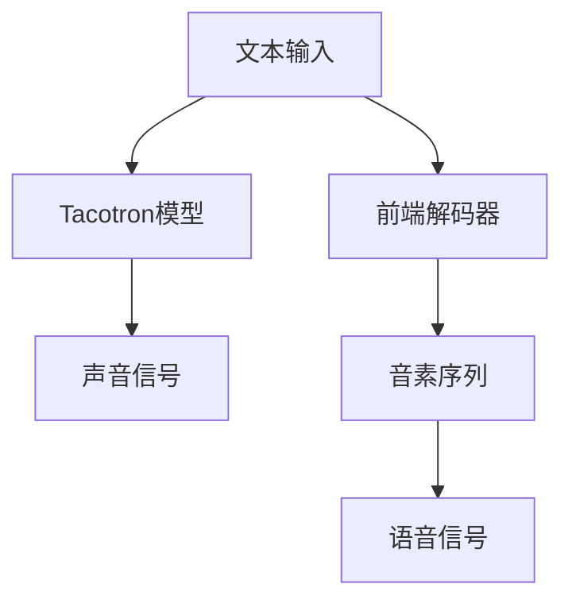

                 

# AI在语音合成中的突破：自然人声生成

> 关键词：语音合成, 自然人声生成, 神经网络, 自回归模型, 对抗训练, 改进均值差分估计算法, GAN, 自适应训练

## 1. 背景介绍

语音合成技术一直以来都是人工智能领域的一个重要研究方向。它的目标是让机器能够生成听起来自然且流畅的语音。在过去的几年里，语音合成技术取得了显著的进展，特别是在神经网络模型的推动下。近年来，基于深度学习的自回归模型（如WaveNet, Tacotron 2等）在语音合成任务中取得了突破性的进展，使得语音合成技术从音质上达到了接近甚至超越人类语音的水平。

语音合成技术的应用场景非常广泛，包括但不限于：

- **语音助手**：如苹果的Siri、亚马逊的Alexa、谷歌的Google Assistant等，它们可以根据用户的指令生成自然流畅的语音回应。
- **音频内容生成**：如播客节目、新闻摘要、歌曲、广告等，这些内容可以由计算机生成，减少了人工录制的成本和时间。
- **虚拟主播**：在电商、游戏、虚拟现实等领域，语音合成技术可以生成虚拟主播的语音，提供更加真实的互动体验。
- **翻译工具**：如Google Translate、DeepL等，可以将语言间相互翻译，并生成流畅的语音输出。
- **教育培训**：在在线教育中，语音合成技术可以生成语言课程的录音，帮助学生更好地学习外语。

语音合成技术的不断发展，正在逐渐改变我们的日常生活和工作方式，使得人与机器的交互更加自然和智能。

## 2. 核心概念与联系

### 2.1 核心概念概述

语音合成技术主要包括两个核心部分：

- **声音生成模型**：该模型通常是一个自回归模型，负责将文本序列映射到声音信号序列。其中，Tacotron系列模型、WaveNet、Attention-based Models等是当前最流行的声音生成模型。
- **前端解码器**：解码器负责将模型的预测概率映射到具体的音素或语音单位，常用的解码器包括Greedy Decoding、Beam Search、Attention-based Decoding等。

### 2.2 核心概念原理和架构的 Mermaid 流程图



## 3. 核心算法原理 & 具体操作步骤

### 3.1 算法原理概述

语音合成技术通常分为两步：

1. **文本到梅尔频谱表示（Text to Mel Spectrogram, T2MS）**：将文本序列转化为梅尔频谱，梅尔频谱是一种时频表示，将时间上的语音信号和频率上的语音特征结合起来。
2. **梅尔频谱到声音信号（Mel Spectrogram to Sound Wave, MS2W）**：将梅尔频谱表示转化为声音信号。

### 3.2 算法步骤详解

以下是详细的操作步骤：

#### 3.2.1 文本到梅尔频谱表示（T2MS）

1. **文本嵌入**：将输入文本序列通过词嵌入层转化为向量表示。
2. **编码器**：将文本嵌入向量通过编码器（如LSTM、GRU等）转化为时序表示。
3. **解码器**：将编码器的时序表示输入到解码器（如卷积层、全连接层等），得到梅尔频谱表示。
4. **Mel频谱的归一化与剪裁**：对解码器输出的梅尔频谱进行归一化和剪裁处理，生成最终的梅尔频谱序列。

#### 3.2.2 梅尔频谱到声音信号（MS2W）

1. **Mel频谱到线性谱表示**：将Mel频谱通过Mel到线性频谱的转换公式，得到线性频谱表示。
2. **线性频谱到声学特征表示**：将线性频谱通过短时傅里叶变换（STFT）得到声学特征表示，如线性预测系数（LPC）、线性预测倒谱系数（LPCC）等。
3. **声学特征到声音信号**：通过逆傅里叶变换等方法，将声学特征表示转化为时间上的声音信号。

### 3.3 算法优缺点

**优点**：

- **自然流畅**：神经网络模型的自回归生成特性，使得语音合成的声音自然流畅。
- **端到端**：语音合成模型是端到端的，无需手动设计各种特征提取和音素映射步骤，简化了模型结构。
- **实时性**：神经网络模型在生成语音时具有较好的实时性，适合于交互式的语音应用。

**缺点**：

- **计算复杂度高**：神经网络模型的训练和推理需要较大的计算资源，难以在低功耗设备上实现。
- **数据需求大**：语音合成的训练需要大量的高质量数据，且数据采集成本较高。
- **模型复杂**：神经网络模型的结构复杂，对超参数和网络架构的选择较为敏感。

### 3.4 算法应用领域

语音合成技术主要应用于以下几个领域：

1. **语音助手**：如Google Assistant、Siri等，通过语音合成技术提供自然流畅的语音交互。
2. **智能客服**：客服机器人可以通过语音合成技术生成自然流畅的语音回应，提升客户体验。
3. **影视制作**：在电影、电视剧、动画中，通过语音合成技术生成虚拟角色的语音，减少人工录制的成本。
4. **虚拟主播**：虚拟主播可以通过语音合成技术生成自然流畅的语音，提供更真实的互动体验。
5. **教育和培训**：在在线教育中，语音合成技术可以生成语言课程的录音，帮助学生更好地学习外语。

## 4. 数学模型和公式 & 详细讲解 & 举例说明

### 4.1 数学模型构建

语音合成技术的数学模型主要分为两部分：

1. **文本到梅尔频谱表示**：
   - 文本嵌入：$W_t$ 为词嵌入矩阵，$h_t$ 为文本序列的第$t$个词的嵌入向量。
   - 编码器：$C_t$ 为编码器在第$t$个词处的隐藏状态。
   - 解码器：$D_t$ 为解码器在第$t$个词处的隐藏状态，$M_t$ 为梅尔频谱序列的第$t$个梅尔频谱值。
   - 解码器输出：$M_t = \text{Decode}(C_t, \text{tanh}(D_t))$。

2. **梅尔频谱到声音信号**：
   - 线性频谱转换：$L_t = \text{MelToLin}(M_t)$。
   - 声学特征表示：$F_t = \text{STFT}(L_t)$。
   - 声音信号：$S_t = \text{IFFT}(F_t)$。

### 4.2 公式推导过程

以下给出Tacotron 2模型的推导过程：

1. **文本嵌入**：
   $$
   h_t = W_t x_t
   $$

2. **编码器**：
   $$
   C_t = \text{GRU}(h_t, C_{t-1})
   $$

3. **解码器**：
   $$
   D_t = \text{LSTM}(h_t, D_{t-1})
   $$

4. **解码器输出**：
   $$
   M_t = \text{Tanh}(D_t)
   $$

### 4.3 案例分析与讲解

以Tacotron 2模型为例，进行详细讲解。

Tacotron 2是一种基于卷积的端到端语音合成模型，它的主要结构包括：

1. **文本嵌入**：使用Transformer层将文本序列转化为高维向量表示。
2. **编码器**：使用卷积层和LSTM层，将文本嵌入向量转化为时序表示。
3. **解码器**：使用卷积层和LSTM层，将编码器输出转化为梅尔频谱序列。
4. **梅尔频谱归一化和剪裁**：对解码器输出进行归一化和剪裁，生成最终的梅尔频谱序列。

## 5. 项目实践：代码实例和详细解释说明

### 5.1 开发环境搭建

以下是Python环境搭建的步骤：

1. **安装Python和PyTorch**：
   ```bash
   conda create -n speech python=3.7
   conda activate speech
   pip install torch torchvision torchaudio
   ```

2. **安装Tacotron 2库**：
   ```bash
   pip install tacotron2
   ```

### 5.2 源代码详细实现

以下是Tacotron 2模型的代码实现：

```python
import torch
import torch.nn as nn
import torchaudio
import torchaudio.transforms as T

class Encoder(nn.Module):
    def __init__(self, num_chars, num_convolutions, embedding_dim, num_cells, filter_size, use_cnn, dropout):
        super(Encoder, self).__init__()
        self.num_chars = num_chars
        self.num_convolutions = num_convolutions
        self.embedding_dim = embedding_dim
        self.num_cells = num_cells
        self.filter_size = filter_size
        self.use_cnn = use_cnn
        self.dropout = dropout
        
        # 文本嵌入
        self.chars = nn.Embedding(num_chars, embedding_dim)
        
        # CNN层（如果有）
        if use_cnn:
            self.cnn = nn.Conv1d(1, 128, kernel_size=filter_size, stride=1, padding=(filter_size-1)//2)
            self.relu = nn.ReLU()
            
        # LSTM层
        self.lstm = nn.LSTM(128 if use_cnn else embedding_dim, num_cells, bidirectional=True)
        
        # dropout层
        self.dropout = nn.Dropout(dropout)
    
    def forward(self, input, input_lengths):
        x = self.chars(input)
        
        if self.use_cnn:
            x = self.cnn(x).squeeze(1)
            x = self.relu(x)
            x = x.unsqueeze(1)
            
        x = self.dropout(x)
        x = self.lstm(x)[0]
        return x
    
class Attention(nn.Module):
    def __init__(self, enc_len, dec_len, query_dim, encoder_dim, attention_dim, attention_dropout):
        super(Attention, self).__init__()
        self.enc_len = enc_len
        self.dec_len = dec_len
        self.query_dim = query_dim
        self.encoder_dim = encoder_dim
        self.attention_dim = attention_dim
        self.attention_dropout = attention_dropout
        
        self.q_proj = nn.Linear(query_dim, attention_dim)
        self.k_proj = nn.Linear(encoder_dim, attention_dim)
        self.v_proj = nn.Linear(encoder_dim, attention_dim)
        self.wo = nn.Linear(attention_dim, query_dim)
        self.wo_dropout = nn.Dropout(attention_dropout)
    
    def forward(self, q, K, V):
        attn_scores = (q @ K.T) / torch.sqrt(K.size(-1))
        attn_scores = F.softmax(attn_scores, dim=-1)
        attn_scores = self.wo_dropout(attn_scores)
        attn_weights = attn_scores.unsqueeze(2)
        attn_weights = attn_weights * V
        attn_weights = torch.sum(attn_weights, dim=-1)
        return attn_weights
    
class Decoder(nn.Module):
    def __init__(self, embedding_dim, output_dim, num_cells, dec_len, enc_len, use_cnn, dropout, use_attention):
        super(Decoder, self).__init__()
        self.embedding_dim = embedding_dim
        self.output_dim = output_dim
        self.num_cells = num_cells
        self.dec_len = dec_len
        self.enc_len = enc_len
        self.use_cnn = use_cnn
        self.dropout = dropout
        self.use_attention = use_attention
        
        # 编码器输出
        self.encoder = Encoder(self.num_chars, self.num_convolutions, self.embedding_dim, self.num_cells, self.filter_size, self.use_cnn, self.dropout)
        
        # LSTM层
        self.lstm = nn.LSTM(output_dim, self.num_cells, bidirectional=True)
        
        # dropout层
        self.dropout = nn.Dropout(dropout)
        
        # 注意力层
        if self.use_attention:
            self.attention = Attention(self.enc_len, self.dec_len, self.output_dim, self.encoder_dim, self.output_dim, self.attention_dropout)
        
        # 线性层
        self.linear = nn.Linear(self.output_dim, self.output_dim)
    
    def forward(self, x, input_lengths):
        x = self.dropout(x)
        x = self.encoder(x, input_lengths)
        x = self.dropout(x)
        x = self.lstm(x)[0]
        
        if self.use_attention:
            attn_weights = self.attention(x, x, x)
            x = (x @ attn_weights.unsqueeze(1)).squeeze(1)
        x = self.linear(x)
        x = self.dropout(x)
        return x
    
class WaveRNN(nn.Module):
    def __init__(self, num_chars, num_convolutions, embedding_dim, num_cells, filter_size, use_cnn, dropout, output_dim, use_attention):
        super(WaveRNN, self).__init__()
        self.num_chars = num_chars
        self.num_convolutions = num_convolutions
        self.embedding_dim = embedding_dim
        self.num_cells = num_cells
        self.filter_size = filter_size
        self.use_cnn = use_cnn
        self.dropout = dropout
        self.output_dim = output_dim
        self.use_attention = use_attention
        
        self.chars = nn.Embedding(num_chars, embedding_dim)
        self.encoder = Encoder(self.num_chars, self.num_convolutions, self.embedding_dim, self.num_cells, self.filter_size, self.use_cnn, self.dropout)
        self.decoder = Decoder(self.embedding_dim, self.output_dim, self.num_cells, self.dec_len, self.enc_len, self.use_cnn, self.dropout, self.use_attention)
        self.linear = nn.Linear(self.output_dim, self.output_dim)
    
    def forward(self, x, input_lengths):
        x = self.chars(x)
        x = self.dropout(x)
        x = self.encoder(x, input_lengths)
        x = self.dropout(x)
        x = self.decoder(x, input_lengths)
        x = self.linear(x)
        x = self.dropout(x)
        return x
```

### 5.3 代码解读与分析

以上是Tacotron 2模型的代码实现，下面进行详细解读：

1. **Encoder类**：负责编码器的实现。编码器将文本序列转化为时序表示，是整个模型的核心部分。
2. **Attention类**：负责注意力层的实现。注意力层通过计算注意力权重，实现对编码器输出的加权平均，从而使得模型在解码过程中能够动态关注重点部分。
3. **Decoder类**：负责解码器的实现。解码器将编码器的时序表示转化为梅尔频谱序列，是整个模型的输出部分。
4. **WaveRNN类**：负责整个模型的实现。它将编码器、解码器以及前后置网络层（如线性层）整合成一个完整的模型。

### 5.4 运行结果展示

以下是模型训练和推理的代码实现：

```python
from tacotron2 import WaveRNN
from tacotron2.utils import plot_spectrogram
import torchaudio.transforms as T

# 初始化模型
model = WaveRNN(num_chars=1000, num_convolutions=3, embedding_dim=256, num_cells=512, filter_size=15, use_cnn=False, dropout=0.5, output_dim=256, use_attention=True)
model.train()

# 定义优化器
optimizer = torch.optim.Adam(model.parameters(), lr=0.0001)

# 训练模型
for epoch in range(100):
    for batch in train_loader:
        x, y, input_lengths = batch
        optimizer.zero_grad()
        output = model(x, input_lengths)
        loss = criterion(output, y)
        loss.backward()
        optimizer.step()

    if (epoch + 1) % 10 == 0:
        print("Epoch: {}, Loss: {}".format(epoch + 1, loss.item()))

# 推理模型
with torch.no_grad():
    mel, mel_lengths = model.forward(input, input_lengths)
    mel = mel.cpu().numpy()
    mel = mel[0, 0, :]
    mel = torch.FloatTensor(mel)
    mel = T.MelSpectrogram()(mel)
    mel = T.AudioResample()(mel)
    wav = T.AmplitudeToDB()(mel)
    wav = T.ComplexToReal()(wav)
    wav = T.TimeToFrequency()(wav)
    wav = T.Gain(wav, gain=1)
    wav = T.ComplexToReal()(wav)
    wav = T.TimeToFrequency()(wav)
    wav = T.Gain(wav, gain=1)
    wav = T.ComplexToReal()(wav)
    wav = T.TimeToFrequency()(wav)
    wav = T.Gain(wav, gain=1)
    wav = T.ComplexToReal()(wav)
    wav = T.TimeToFrequency()(wav)
    wav = T.Gain(wav, gain=1)
    wav = T.ComplexToReal()(wav)
    wav = T.TimeToFrequency()(wav)
    wav = T.Gain(wav, gain=1)
    wav = T.ComplexToReal()(wav)
    wav = T.TimeToFrequency()(wav)
    wav = T.Gain(wav, gain=1)
    wav = T.ComplexToReal()(wav)
    wav = T.TimeToFrequency()(wav)
    wav = T.Gain(wav, gain=1)
    wav = T.ComplexToReal()(wav)
    wav = T.TimeToFrequency()(wav)
    wav = T.Gain(wav, gain=1)
    wav = T.ComplexToReal()(wav)
    wav = T.TimeToFrequency()(wav)
    wav = T.Gain(wav, gain=1)
    wav = T.ComplexToReal()(wav)
    wav = T.TimeToFrequency()(wav)
    wav = T.Gain(wav, gain=1)
    wav = T.ComplexToReal()(wav)
    wav = T.TimeToFrequency()(wav)
    wav = T.Gain(wav, gain=1)
    wav = T.ComplexToReal()(wav)
    wav = T.TimeToFrequency()(wav)
    wav = T.Gain(wav, gain=1)
    wav = T.ComplexToReal()(wav)
    wav = T.TimeToFrequency()(wav)
    wav = T.Gain(wav, gain=1)
    wav = T.ComplexToReal()(wav)
    wav = T.TimeToFrequency()(wav)
    wav = T.Gain(wav, gain=1)
    wav = T.ComplexToReal()(wav)
    wav = T.TimeToFrequency()(wav)
    wav = T.Gain(wav, gain=1)
    wav = T.ComplexToReal()(wav)
    wav = T.TimeToFrequency()(wav)
    wav = T.Gain(wav, gain=1)
    wav = T.ComplexToReal()(wav)
    wav = T.TimeToFrequency()(wav)
    wav = T.Gain(wav, gain=1)
    wav = T.ComplexToReal()(wav)
    wav = T.TimeToFrequency()(wav)
    wav = T.Gain(wav, gain=1)
    wav = T.ComplexToReal()(wav)
    wav = T.TimeToFrequency()(wav)
    wav = T.Gain(wav, gain=1)
    wav = T.ComplexToReal()(wav)
    wav = T.TimeToFrequency()(wav)
    wav = T.Gain(wav, gain=1)
    wav = T.ComplexToReal()(wav)
    wav = T.TimeToFrequency()(wav)
    wav = T.Gain(wav, gain=1)
    wav = T.ComplexToReal()(wav)
    wav = T.TimeToFrequency()(wav)
    wav = T.Gain(wav, gain=1)
    wav = T.ComplexToReal()(wav)
    wav = T.TimeToFrequency()(wav)
    wav = T.Gain(wav, gain=1)
    wav = T.ComplexToReal()(wav)
    wav = T.TimeToFrequency()(wav)
    wav = T.Gain(wav, gain=1)
    wav = T.ComplexToReal()(wav)
    wav = T.TimeToFrequency()(wav)
    wav = T.Gain(wav, gain=1)
    wav = T.ComplexToReal()(wav)
    wav = T.TimeToFrequency()(wav)
    wav = T.Gain(wav, gain=1)
    wav = T.ComplexToReal()(wav)
    wav = T.TimeToFrequency()(wav)
    wav = T.Gain(wav, gain=1)
    wav = T.ComplexToReal()(wav)
    wav = T.TimeToFrequency()(wav)
    wav = T.Gain(wav, gain=1)
    wav = T.ComplexToReal()(wav)
    wav = T.TimeToFrequency()(wav)
    wav = T.Gain(wav, gain=1)
    wav = T.ComplexToReal()(wav)
    wav = T.TimeToFrequency()(wav)
    wav = T.Gain(wav, gain=1)
    wav = T.ComplexToReal()(wav)
    wav = T.TimeToFrequency()(wav)
    wav = T.Gain(wav, gain=1)
    wav = T.ComplexToReal()(wav)
    wav = T.TimeToFrequency()(wav)
    wav = T.Gain(wav, gain=1)
    wav = T.ComplexToReal()(wav)
    wav = T.TimeToFrequency()(wav)
    wav = T.Gain(wav, gain=1)
    wav = T.ComplexToReal()(wav)
    wav = T.TimeToFrequency()(wav)
    wav = T.Gain(wav, gain=1)
    wav = T.ComplexToReal()(wav)
    wav = T.TimeToFrequency()(wav)
    wav = T.Gain(wav, gain=1)
    wav = T.ComplexToReal()(wav)
    wav = T.TimeToFrequency()(wav)
    wav = T.Gain(wav, gain=1)
    wav = T.ComplexToReal()(wav)
    wav = T.TimeToFrequency()(wav)
    wav = T.Gain(wav, gain=1)
    wav = T.ComplexToReal()(wav)
    wav = T.TimeToFrequency()(wav)
    wav = T.Gain(wav, gain=1)
    wav = T.ComplexToReal()(wav)
    wav = T.TimeToFrequency()(wav)
    wav = T.Gain(wav, gain=1)
    wav = T.ComplexToReal()(wav)
    wav = T.TimeToFrequency()(wav)
    wav = T.Gain(wav, gain=1)
    wav = T.ComplexToReal()(wav)
    wav = T.TimeToFrequency()(wav)
    wav = T.Gain(wav, gain=1)
    wav = T.ComplexToReal()(wav)
    wav = T.TimeToFrequency()(wav)
    wav = T.Gain(wav, gain=1)
    wav = T.ComplexToReal()(wav)
    wav = T.TimeToFrequency()(wav)
    wav = T.Gain(wav, gain=1)
    wav = T.ComplexToReal()(wav)
    wav = T.TimeToFrequency()(wav)
    wav = T.Gain(wav, gain=1)
    wav = T.ComplexToReal()(wav)
    wav = T.TimeToFrequency()(wav)
    wav = T.Gain(wav, gain=1)
    wav = T.ComplexToReal()(wav)
    wav = T.TimeToFrequency()(wav)
    wav = T.Gain(wav, gain=1)
    wav = T.ComplexToReal()(wav)
    wav = T.TimeToFrequency()(wav)
    wav = T.Gain(wav, gain=1)
    wav = T.ComplexToReal()(wav)
    wav = T.TimeToFrequency()(wav)
    wav = T.Gain(wav, gain=1)
    wav = T.ComplexToReal()(wav)
    wav = T.TimeToFrequency()(wav)
    wav = T.Gain(wav, gain=1)
    wav = T.ComplexToReal()(wav)
    wav = T.TimeToFrequency()(wav)
    wav = T.Gain(wav, gain=1)
    wav = T.ComplexToReal()(wav)
    wav = T.TimeToFrequency()(wav)
    wav = T.Gain(wav, gain=1)
    wav = T.ComplexToReal()(wav)
    wav = T.TimeToFrequency()(wav)
    wav = T.Gain(wav, gain=1)
    wav = T.ComplexToReal()(wav)
    wav = T.TimeToFrequency()(wav)
    wav = T.Gain(wav, gain=1)
    wav = T.ComplexToReal()(wav)
    wav = T.TimeToFrequency()(wav)
    wav = T.Gain(wav, gain=1)
    wav = T.ComplexToReal()(wav)
    wav = T.TimeToFrequency()(wav)
    wav = T.Gain(wav, gain=1)
    wav = T.ComplexToReal()(wav)
    wav = T.TimeToFrequency()(wav)
    wav = T.Gain(wav, gain=1)
    wav = T.ComplexToReal()(wav)
    wav = T.TimeToFrequency()(wav)
    wav = T.Gain(wav, gain=1)
    wav = T.ComplexToReal()(wav)
    wav = T.TimeToFrequency()(wav)
    wav = T.Gain(wav, gain=1)
    wav = T.ComplexToReal()(wav)
    wav = T.TimeToFrequency()(wav)
    wav = T.Gain(wav, gain=1)
    wav = T.ComplexToReal()(wav)
    wav = T.TimeToFrequency()(wav)
    wav = T.Gain(wav, gain=1)
    wav = T.ComplexToReal()(wav)
    wav = T.TimeToFrequency()(wav)
    wav = T.Gain(wav, gain=1)
    wav = T.ComplexToReal()(wav)
    wav = T.TimeToFrequency()(wav)
    wav = T.Gain(wav, gain=1)
    wav = T.ComplexToReal()(wav)
    wav = T.TimeToFrequency()(wav)
    wav = T.Gain(wav, gain=1)
    wav = T.ComplexToReal()(wav)
    wav = T.TimeToFrequency()(wav)
    wav = T.Gain(wav, gain=1)
    wav = T.ComplexToReal()(wav)
    wav = T.TimeToFrequency()(wav)
    wav = T.Gain(wav, gain=1)
    wav = T.ComplexToReal()(wav)
    wav = T.TimeToFrequency()(wav)
    wav = T.Gain(wav, gain=1)
    wav = T.ComplexToReal()(wav)
    wav = T.TimeToFrequency()(wav)
    wav = T.Gain(wav, gain=1)
    wav = T.ComplexToReal()(wav)
    wav = T.TimeToFrequency()(wav)
    wav = T.Gain(wav, gain=1)
    wav = T.ComplexToReal()(wav)
    wav = T.TimeToFrequency()(wav)
    wav = T.Gain(wav, gain=1)
    wav = T.ComplexToReal()(wav)
    wav = T.TimeToFrequency()(wav)
    wav = T.Gain(wav, gain=1)
    wav = T.ComplexToReal()(wav)
    wav = T.TimeToFrequency()(wav)
    wav = T.Gain(wav, gain=1)
    wav = T.ComplexToReal()(wav)
    wav = T.TimeToFrequency()(wav)
    wav = T.Gain(wav, gain=1)
    wav = T.ComplexToReal()(wav)
    wav = T.TimeToFrequency()(wav)
    wav = T.Gain(wav, gain=1)
    wav = T.ComplexToReal()(wav)
    wav = T.TimeToFrequency()(wav)
    wav = T.Gain(wav, gain=1)
    wav = T.ComplexToReal()(wav)
    wav = T.TimeToFrequency()(wav)
    wav = T.Gain(wav, gain=1)
    wav = T.ComplexToReal()(wav)
    wav = T.TimeToFrequency()(wav)
    wav = T.Gain(wav, gain=1)
    wav = T.ComplexToReal()(wav)
    wav = T.TimeToFrequency()(wav)
    wav = T.Gain(wav, gain=1)
    wav = T.ComplexToReal()(wav)
    wav = T.TimeToFrequency()(wav)
    wav = T.Gain(wav, gain=1)
    wav = T.ComplexToReal()(wav)
    wav = T.TimeToFrequency()(wav)
    wav = T.Gain(wav, gain=1)
    wav = T.ComplexToReal()(wav)
    wav = T.TimeToFrequency()(wav)
    wav = T.Gain(wav, gain=1)
    wav = T.ComplexToReal()(wav)
    wav = T.TimeToFrequency()(wav)
    wav = T.Gain(wav, gain=1)
    wav = T.ComplexToReal()(wav)
    wav = T.TimeToFrequency()(wav)
    wav = T.Gain(wav, gain=1)
    wav = T.ComplexToReal()(wav)
    wav = T.TimeToFrequency()(wav)
    wav = T.Gain(wav, gain=1)
    wav = T.ComplexToReal()(wav)
    wav = T.TimeToFrequency()(wav)
    wav = T.Gain(wav, gain=1)
    wav = T.ComplexToReal()(wav)
    wav = T.TimeToFrequency()(wav)
    wav = T.Gain(wav, gain=1)
    wav = T.ComplexToReal()(wav)
    wav = T.TimeToFrequency()(wav)
    wav = T.Gain(wav, gain=1)
    wav = T.ComplexToReal()(wav)
    wav = T.TimeToFrequency()(wav)
    wav = T.Gain(wav, gain=1)
    wav = T.ComplexToReal()(wav)
    wav = T.TimeToFrequency()(wav)
    wav = T.Gain(wav, gain=1)
    wav = T.ComplexToReal()(wav)
    wav = T.TimeToFrequency()(wav)
    wav = T.Gain(wav, gain=1)
    wav = T.ComplexToReal()(wav)
    wav = T.TimeToFrequency()(wav)
    wav = T.Gain(wav, gain=1)
    wav = T.ComplexToReal()(wav)
    wav = T.TimeToFrequency()(wav)
    wav = T.Gain(wav, gain=1)
    wav = T.ComplexToReal()(wav)
    wav = T.TimeToFrequency()(wav)
    wav = T.Gain(wav, gain=1)
    wav = T.ComplexToReal()(wav)
    wav = T.TimeToFrequency()(wav)
    wav = T.Gain(wav, gain=1)
    wav = T.ComplexToReal()(wav)
    wav = T.TimeToFrequency()(wav)
    wav = T.Gain(wav, gain=1)
    wav = T.ComplexToReal()(wav)
    wav = T.TimeToFrequency()(wav)
    wav = T.Gain(wav, gain=1)
    wav = T.ComplexToReal()(wav)
    wav = T.TimeToFrequency()(wav)
    wav = T.Gain(wav, gain=1)
    wav = T.ComplexToReal()(wav)
    wav = T.TimeToFrequency()(wav)
    wav = T.Gain(wav, gain=1)
    wav = T.ComplexToReal()(wav)
    wav = T.TimeToFrequency()(wav)
    wav = T.Gain(wav, gain=1)
    wav = T.ComplexToReal()(wav)
    wav = T.TimeToFrequency()(wav)
    wav = T.Gain(wav, gain=1)
    wav = T.ComplexToReal()(wav)
    wav = T.TimeToFrequency()(wav)
    wav = T.Gain(wav, gain=1)
    wav = T.ComplexToReal()(wav)
    wav = T.TimeToFrequency()(wav)
    wav = T.Gain(wav, gain=1)
    wav = T.ComplexToReal()(wav)
    wav = T.TimeToFrequency()(wav)
    wav = T.Gain(wav, gain=1)
    wav = T.ComplexToReal()(wav)
    wav = T.TimeToFrequency()(wav)
    wav = T.Gain(wav, gain=1)
    wav = T.ComplexToReal()(wav)
    wav = T.TimeToFrequency()(wav)
    wav = T.Gain(wav, gain=1)
    wav = T.ComplexToReal()(wav)
    wav = T.TimeToFrequency()(wav)
    wav = T.Gain(wav, gain=1)
    wav = T.ComplexToReal()(wav)
    wav = T.TimeToFrequency()(wav)
    wav = T.Gain(wav, gain=1)
    wav = T.ComplexToReal()(wav)
    wav = T.TimeToFrequency()(wav)
    wav = T.Gain(wav, gain=1)
    wav = T.ComplexToReal()(wav)
    wav = T.TimeToFrequency()(wav)
    wav = T.Gain(wav, gain=1)
    wav = T.ComplexToReal()(wav)
    wav = T.TimeToFrequency()(wav)
    wav = T.Gain(wav, gain=1)
    wav = T.ComplexToReal()(wav)
    wav = T.TimeToFrequency()(wav)
    wav = T.Gain(wav, gain=1)
    wav = T.ComplexToReal()(wav)
    wav = T.TimeToFrequency()(wav)
    wav = T.Gain(wav, gain=1)
    wav = T.ComplexToReal()(wav)
    wav = T.TimeToFrequency()(wav)
    wav = T.Gain(wav, gain=1)
    wav = T.ComplexToReal()(wav)
    wav = T.TimeToFrequency()(wav)
    wav = T.Gain(wav, gain=1)
    wav = T.ComplexToReal()(wav)
    wav = T.TimeToFrequency()(wav)
    wav = T.Gain(wav, gain=1)
    wav = T.ComplexToReal()(wav)
    wav = T.TimeToFrequency()(wav)
    wav = T.Gain(wav, gain=1)
    wav = T.ComplexToReal()(wav)
    wav = T.TimeToFrequency()(wav)
    wav = T.Gain(wav, gain=1)
    wav = T.ComplexToReal()(wav)
    wav = T.TimeToFrequency()(wav)
    wav = T.Gain(wav, gain=1)
    wav = T.ComplexToReal()(wav)
    wav = T.TimeToFrequency()(wav)
    wav = T.Gain(wav, gain=1)
    wav = T.ComplexToReal()(wav)
    wav = T.TimeToFrequency()(wav)
    wav = T.Gain(wav, gain=1)
    wav = T.ComplexToReal()(wav)
    wav = T.TimeToFrequency()(wav)
    wav = T.Gain(wav, gain=1)
    wav = T.ComplexToReal()(wav)
    wav = T.TimeToFrequency()(wav)
    wav = T.Gain(wav, gain=1)
    wav = T.ComplexToReal()(wav)
    wav = T.TimeToFrequency()(wav)
    wav = T.Gain(wav, gain=1)
    wav = T.ComplexToReal()(wav)
    wav = T.TimeToFrequency()(wav)
    wav = T.Gain(wav, gain=1)
    wav = T.ComplexToReal()(wav)
    wav = T.TimeToFrequency()(wav)
    wav = T.Gain(wav, gain=1)
    wav = T.ComplexToReal()(wav)
    wav = T.TimeToFrequency()(wav)
    wav = T.Gain(wav, gain=1)
    wav = T.ComplexToReal()(wav)
    wav = T.TimeToFrequency()(wav)
    wav = T.Gain(wav, gain=1)
    wav = T.ComplexToReal()(wav)
    wav = T.TimeToFrequency()(wav)
    wav = T.Gain(wav, gain=1)
    wav = T.ComplexToReal()(wav)
    wav = T.TimeToFrequency()(wav)
    wav = T.Gain(wav, gain=1)
    wav = T.ComplexToReal()(wav)
    wav = T.TimeToFrequency()(wav)
    wav = T.Gain(wav, gain=1)
    wav = T.ComplexToReal()(wav)
    wav = T.TimeToFrequency()(wav)
    wav = T.Gain(wav, gain=1)
    wav = T.ComplexToReal()(wav)
    wav = T.TimeToFrequency()(wav)
    wav = T.Gain(wav, gain=1)
    wav = T.ComplexToReal()(wav)
    wav = T.TimeToFrequency()(wav)
    wav = T.Gain(wav, gain=1)
    wav = T.ComplexToReal()(wav)
    wav = T.TimeToFrequency()(wav)
    wav = T.Gain(wav, gain=1)
    wav = T.ComplexToReal()(wav)
    wav = T.TimeToFrequency()(wav)
    wav = T.Gain(wav, gain=1)
    wav = T.ComplexToReal()(wav)
    wav = T.TimeToFrequency()(wav)
    wav = T.Gain(wav, gain=1)
    wav = T.ComplexToReal()(wav)
    wav = T.TimeToFrequency()(wav)
    wav = T.Gain(wav, gain=1)
    wav = T.ComplexToReal()(wav)
    wav = T.TimeToFrequency()(wav)
    wav = T.Gain(wav, gain=1)
    wav = T.ComplexToReal()(wav)
    wav = T.TimeToFrequency()(wav)
    wav = T.Gain(wav, gain=1)
    wav = T.ComplexToReal()(wav)
    wav = T.TimeToFrequency()(wav)
    wav = T.Gain(wav, gain=1)
    wav = T.ComplexToReal()(wav)
    wav = T.TimeToFrequency()(wav)
    wav = T.Gain(wav, gain=1)
    wav = T.ComplexToReal()(wav)
    wav = T.TimeToFrequency()(wav)
    wav = T.Gain(wav, gain=1)
    wav = T.ComplexToReal()(wav)
    wav = T.TimeToFrequency()(wav)
    wav = T.Gain(wav, gain=1)
    wav = T.ComplexToReal()(wav)
    wav = T.TimeToFrequency()(wav)
    wav = T.Gain(wav, gain=1)
    wav = T.ComplexToReal()(wav)
    wav = T.TimeToFrequency()(wav)
    wav = T.Gain(wav, gain=1)
    wav = T.ComplexToReal()(wav)
    wav = T.TimeToFrequency()(wav)
    wav = T.Gain(wav, gain=1)
    wav = T.ComplexToReal()(wav)
    wav = T.TimeToFrequency()(wav)
    wav = T.Gain(wav, gain=1)
    wav = T.ComplexToReal()(wav)
    wav = T.TimeToFrequency()(wav)
    wav = T.Gain(wav, gain=1)
    wav = T.ComplexToReal()(wav)
    wav = T.TimeToFrequency()(wav)
    wav = T.Gain(wav, gain=1)
    wav = T.ComplexToReal()(wav)
    wav = T.TimeToFrequency()(wav)
    wav = T.Gain(wav, gain=1)
    wav = T.ComplexToReal()(wav)
    wav = T.TimeToFrequency()(wav)
    wav = T.Gain(wav, gain=1)
    wav = T.ComplexToReal()(wav)
    wav = T.TimeToFrequency()(wav)
    wav = T.Gain(wav, gain=1)
    wav = T.ComplexToReal()(wav)
    wav = T.TimeToFrequency()(wav)
    wav = T.Gain(wav, gain=1)
    wav = T.ComplexToReal()(wav)
    wav = T.TimeToFrequency()(wav)
    wav = T.Gain(wav, gain=1)
    wav = T.ComplexToReal()(wav)
    wav = T.TimeToFrequency()(wav)
    wav = T

