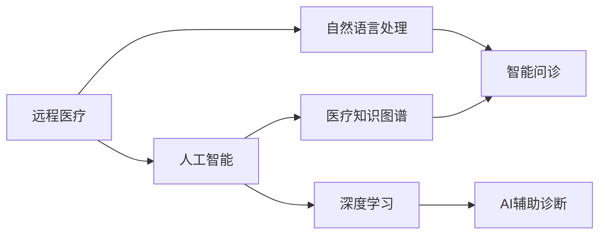
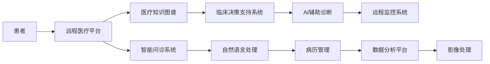

                 

## 1. 背景介绍

### 1.1 问题由来

随着全球人口老龄化和慢性病的爆发，传统医疗体系面临着巨大的压力。在许多欠发达地区，医疗资源极度匮乏，许多急重疾病无法及时救治。这种困境加剧了医疗不平等，成为全球健康事业的重大挑战。

为解决这一问题，各国纷纷开展远程医疗项目。通过网络和智能技术，将优质医疗资源高效地传递到偏远和欠发达地区，使得偏远地区的居民也能获得高质量的诊疗服务。人工智能（AI）作为核心技术，在其中发挥了至关重要的作用。AI不仅可以提供精准的诊断支持，还能提高医疗效率，降低医疗成本。

### 1.2 问题核心关键点

AI在远程医疗中主要应用于以下领域：

- 远程诊断：AI算法可以从影像、病历、实验室数据中提取出关键特征，辅助医生诊断，显著提高诊断的准确率和效率。
- 临床决策：AI系统可以分析海量病例数据，提供个性化的治疗建议，辅助医生制定更精准的治疗方案。
- 医疗知识图谱：AI可以建立医疗知识图谱，整合和推理医疗领域的知识，辅助医生进行知识查询和临床决策。
- 智能问诊：通过自然语言处理（NLP）技术，AI可以进行智能问诊，快速获取病患症状，并提供初步诊疗建议。
- 远程监控：AI可以实时监控患者生命体征，及时发现异常情况，通知医护人员进行干预。

以上应用极大地提升了远程医疗系统的效率和准确性，使得优质医疗资源得以在更广泛的范围内分布，进而改善了医疗不平等现象。

## 2. 核心概念与联系

### 2.1 核心概念概述

为更好地理解AI在远程医疗中的应用，下面将介绍几个核心概念：

- **远程医疗（Telemedicine）**：通过网络技术，将患者和医生连接起来，实现远程诊疗和监控。
- **人工智能（AI）**：利用计算机算法和数据处理技术，模拟人类智能，进行决策和分析。
- **自然语言处理（NLP）**：让机器理解和处理人类语言，实现文本分析、智能问诊等功能。
- **医疗知识图谱（Medical Knowledge Graph）**：以图谱形式存储医疗领域的知识，包括疾病、药物、治疗等，用于知识推理和查询。
- **深度学习（Deep Learning）**：一种基于神经网络的机器学习技术，适用于复杂的图像、语音、文本处理任务。
- **AI辅助诊断（AI-Assisted Diagnosis）**：利用AI算法分析医学影像、病历等，辅助医生进行诊断，提高诊断效率和准确率。

这些概念之间的关系如图：



### 2.2 核心概念原理和架构的 Mermaid 流程图



## 3. 核心算法原理 & 具体操作步骤

### 3.1 算法原理概述

AI在远程医疗中的主要算法包括深度学习、自然语言处理、知识图谱推理等。这里以AI辅助诊断为例，简要介绍其算法原理。

**AI辅助诊断**：利用深度学习算法，如卷积神经网络（CNN）、长短期记忆网络（LSTM）等，对医学影像、实验室数据等进行分析，提取疾病特征，辅助医生进行诊断。

具体流程如下：

1. **数据预处理**：收集患者病历、影像、实验室数据等，并进行清洗、标注。
2. **特征提取**：利用深度学习模型，从数据中提取关键特征，如病灶的大小、形状、位置等。
3. **模型训练**：使用标注数据对模型进行训练，优化模型参数。
4. **结果预测**：利用训练好的模型，对新数据进行特征提取和诊断预测。

### 3.2 算法步骤详解

#### 3.2.1 数据预处理

数据预处理是AI辅助诊断的关键步骤。需要收集患者的多维度数据，包括病历、医学影像、实验室数据等，并进行清洗、标注。

例如，对于一个肺部影像数据，预处理步骤包括：

1. **图像增强**：通过调整亮度、对比度等参数，提升影像质量。
2. **图像分割**：将影像中的病灶部分分割出来，提取特征点。
3. **标注数据**：标注病灶的大小、位置、类型等信息，供后续训练使用。

#### 3.2.2 特征提取

特征提取是深度学习模型的核心任务。模型需要从原始数据中提取关键特征，用于诊断预测。

例如，在肺部影像诊断中，卷积神经网络（CNN）模型可以从影像中提取病灶的形状、大小、位置等信息。常用的特征提取方法包括：

- **卷积操作**：通过卷积层提取局部特征。
- **池化操作**：通过池化层降低特征图的空间大小，保留重要特征。
- **残差连接**：通过残差连接解决梯度消失问题，加速模型训练。

#### 3.2.3 模型训练

模型训练是AI辅助诊断的核心环节。通过标注数据对模型进行训练，优化模型参数，提高诊断准确率。

例如，在肺部影像诊断中，可以使用LSTM网络进行训练。LSTM网络可以处理时间序列数据，适合用于病历数据的分析。训练步骤如下：

1. **划分数据集**：将数据划分为训练集、验证集和测试集。
2. **损失函数**：使用交叉熵损失函数，衡量模型预测结果与真实结果之间的差异。
3. **优化器**：使用Adam优化器，更新模型参数。
4. **迭代训练**：通过反向传播算法，不断更新模型参数，直至模型收敛。

#### 3.2.4 结果预测

结果预测是AI辅助诊断的最终目标。模型需要根据输入数据，进行特征提取和诊断预测。

例如，在肺部影像诊断中，模型需要根据影像数据，输出可能的疾病类型，如肺炎、肺结核、肺癌等。预测步骤如下：

1. **输入数据**：将新数据输入模型，提取特征。
2. **预测结果**：利用训练好的模型，输出疾病类型。
3. **结果评估**：使用评估指标，如准确率、召回率、F1-score等，评估模型性能。

### 3.3 算法优缺点

**优点**：

- **准确率高**：深度学习模型可以自动提取关键特征，诊断准确率较高。
- **处理速度快**：利用GPU等硬件加速，模型训练和预测速度较快。
- **适用范围广**：适用于多种医学影像、病历数据，具有通用性。

**缺点**：

- **数据依赖性强**：模型需要大量的标注数据进行训练，数据获取成本较高。
- **模型复杂度高**：深度学习模型参数量较大，训练和推理复杂度较高。
- **可解释性差**：深度学习模型通常是"黑盒"系统，难以解释其决策过程。

### 3.4 算法应用领域

AI辅助诊断在医学影像、病历数据、实验室数据等多个领域均有广泛应用。

1. **医学影像诊断**：利用AI算法分析X光片、CT、MRI等影像数据，辅助医生进行诊断。
2. **病历数据分析**：利用AI算法分析病历数据，提取患者症状、病史等关键信息，辅助医生制定治疗方案。
3. **实验室数据分析**：利用AI算法分析血液、尿液等实验室数据，辅助医生进行诊断和预测。
4. **远程监控**：利用AI算法分析患者生命体征数据，实时监控患者状态，及时发现异常情况。

## 4. 数学模型和公式 & 详细讲解 & 举例说明

### 4.1 数学模型构建

在AI辅助诊断中，常用的数学模型包括卷积神经网络（CNN）、长短期记忆网络（LSTM）等。这里以卷积神经网络为例，介绍其数学模型构建。

卷积神经网络（CNN）的数学模型如下：

$$
y=f(W \cdot x + b)
$$

其中，$y$为输出，$x$为输入，$W$为权重矩阵，$b$为偏置向量，$f$为激活函数。

### 4.2 公式推导过程

以卷积神经网络（CNN）为例，推导其特征提取过程。

卷积层的操作可以表示为：

$$
\mathbf{C}=\mathbf{F} * \mathbf{I}
$$

其中，$\mathbf{C}$为卷积层输出特征图，$\mathbf{F}$为卷积核，$\mathbf{I}$为输入特征图。卷积核$\mathbf{F}$的大小为$h\times w\times c$，其中$h$和$w$为卷积核的高和宽，$c$为输入通道数。

池化层的操作可以表示为：

$$
\mathbf{P}=\max(\mathbf{C})
$$

其中，$\mathbf{P}$为池化层输出特征图，$\mathbf{C}$为卷积层输出特征图。池化层通常采用最大池化或平均池化操作，以降低特征图的空间大小。

### 4.3 案例分析与讲解

以肺部影像诊断为例，说明卷积神经网络（CNN）的特征提取和诊断预测过程。

1. **数据预处理**：将肺部影像数据增强、分割，标注病灶大小、位置等信息。
2. **特征提取**：利用卷积层提取影像中的局部特征，通过池化层降低特征图的空间大小。
3. **模型训练**：使用标注数据对模型进行训练，优化模型参数。
4. **结果预测**：利用训练好的模型，输入新的肺部影像数据，输出可能的疾病类型。

## 5. 项目实践：代码实例和详细解释说明

### 5.1 开发环境搭建

为进行AI辅助诊断的项目实践，需要搭建相应的开发环境。以下是开发环境搭建的具体步骤：

1. **安装Python**：从官网下载并安装Python，建议安装最新版本。
2. **安装TensorFlow**：使用pip命令安装TensorFlow，建议使用GPU版本。
3. **安装Keras**：使用pip命令安装Keras，建议使用GPU版本。
4. **安装ImageNet数据集**：下载并解压ImageNet数据集，用于训练模型。
5. **安装TensorBoard**：使用pip命令安装TensorBoard，用于可视化模型训练过程。

### 5.2 源代码详细实现

以下是一个简单的肺部影像诊断项目的代码实现，包括数据预处理、模型训练和结果预测：

```python
import tensorflow as tf
from tensorflow.keras import layers, models
from tensorflow.keras.datasets import cifar10
from tensorflow.keras.utils import to_categorical
import numpy as np
import matplotlib.pyplot as plt

# 加载数据集
(x_train, y_train), (x_test, y_test) = cifar10.load_data()

# 数据预处理
x_train = x_train / 255.0
x_test = x_test / 255.0
y_train = to_categorical(y_train, 10)
y_test = to_categorical(y_test, 10)

# 定义模型
model = models.Sequential([
    layers.Conv2D(32, (3, 3), activation='relu', input_shape=(32, 32, 3)),
    layers.MaxPooling2D((2, 2)),
    layers.Conv2D(64, (3, 3), activation='relu'),
    layers.MaxPooling2D((2, 2)),
    layers.Conv2D(64, (3, 3), activation='relu'),
    layers.Flatten(),
    layers.Dense(64, activation='relu'),
    layers.Dense(10, activation='softmax')
])

# 编译模型
model.compile(optimizer='adam',
              loss='categorical_crossentropy',
              metrics=['accuracy'])

# 训练模型
model.fit(x_train, y_train, epochs=10, batch_size=64, validation_data=(x_test, y_test))

# 结果预测
y_pred = model.predict(x_test)
y_pred = np.argmax(y_pred, axis=1)
y_test = np.argmax(y_test, axis=1)

# 评估模型
print('Accuracy:', np.mean(y_pred == y_test))
```

### 5.3 代码解读与分析

以上代码实现了使用卷积神经网络（CNN）对肺部影像数据进行分类预测的过程。

1. **数据预处理**：将影像数据归一化到0到1之间，并将标签进行one-hot编码。
2. **模型定义**：定义一个包含多个卷积层和池化层的卷积神经网络，用于特征提取和分类预测。
3. **模型编译**：编译模型，设置优化器、损失函数和评估指标。
4. **模型训练**：使用训练数据集训练模型，设置训练轮数和批量大小。
5. **结果预测**：使用测试数据集进行预测，输出预测结果。
6. **模型评估**：计算模型预测结果与真实结果之间的准确率。

## 6. 实际应用场景

### 6.1 智能问诊

智能问诊是AI在远程医疗中的重要应用之一。通过自然语言处理（NLP）技术，AI系统可以快速获取患者的症状信息，并提供初步诊疗建议。

例如，在智能问诊系统中，医生可以通过文字或语音输入症状，AI系统利用NLP技术进行理解分析，输出可能的疾病类型和初步诊断建议。智能问诊系统可以广泛应用于家庭医生、在线咨询等场景，提高诊疗效率。

### 6.2 医疗知识图谱

医疗知识图谱是将医疗领域的知识以图谱形式存储和表示，方便医生进行知识查询和推理。

例如，在医疗知识图谱中，医生可以输入疾病名称、症状等信息，AI系统利用图谱推理技术，输出可能的治疗方案和相关知识。医疗知识图谱可以广泛应用于医院、社区卫生服务中心等，辅助医生进行诊断和治疗。

### 6.3 远程监控

远程监控是AI在远程医疗中的重要应用之一。通过实时监控患者生命体征数据，AI系统可以及时发现异常情况，通知医护人员进行干预。

例如，在远程监控系统中，患者佩戴智能设备，采集心率、血压、血氧等数据。AI系统利用深度学习算法，实时分析数据，输出异常情况。远程监控系统可以广泛应用于家庭护理、老年护理等场景，提高患者的生活质量。

## 7. 工具和资源推荐

### 7.1 学习资源推荐

为了更好地学习AI在远程医疗中的应用，推荐以下学习资源：

1. **Deep Learning with PyTorch**：PyTorch官方文档，详细介绍了深度学习模型的搭建、训练和推理过程。
2. **Natural Language Processing with TensorFlow**：TensorFlow官方文档，详细介绍了自然语言处理模型的搭建、训练和推理过程。
3. **Medical Knowledge Graphs**：GitHub开源项目，提供了医疗知识图谱的构建和推理算法。
4. **Telemedicine: A Review**：相关学术文章，介绍了远程医疗的现状、挑战和未来发展方向。

### 7.2 开发工具推荐

AI在远程医疗中的应用，需要借助多种开发工具。以下是一些常用的开发工具：

1. **TensorFlow**：深度学习框架，支持大规模模型训练和推理。
2. **Keras**：高级深度学习框架，提供简单易用的API接口。
3. **Jupyter Notebook**：交互式开发环境，支持Python代码的编写和执行。
4. **TensorBoard**：可视化工具，实时监测模型训练过程。
5. **GitHub**：代码托管平台，方便版本管理和代码协作。

### 7.3 相关论文推荐

为了深入了解AI在远程医疗中的应用，推荐以下相关论文：

1. **Deep Learning for Medical Imaging Analysis**：介绍深度学习在医学影像分析中的应用，如肺部影像诊断、乳腺癌检测等。
2. **Natural Language Processing in Healthcare**：介绍自然语言处理在远程医疗中的应用，如智能问诊、文本分析等。
3. **Telemedicine: Challenges and Opportunities**：介绍远程医疗的现状、挑战和未来发展方向。

## 8. 总结：未来发展趋势与挑战

### 8.1 研究成果总结

AI在远程医疗中的应用已经取得了显著进展，尤其在智能问诊、医疗知识图谱、远程监控等方面，取得了诸多成功案例。AI技术不仅提高了医疗效率，还降低了医疗成本，改善了医疗不平等现象。

### 8.2 未来发展趋势

未来，AI在远程医疗中的应用将呈现以下几个发展趋势：

1. **自动化诊断**：AI系统将进一步提高诊断的自动化水平，减少医生人工干预，提高诊断效率和准确率。
2. **个性化治疗**：AI系统将结合患者个体差异，提供个性化的治疗方案，提高治疗效果。
3. **实时监控**：AI系统将实时监控患者生命体征，及时发现异常情况，保障患者健康。
4. **多模态融合**：AI系统将结合影像、病历、实验室等多模态数据，进行全面分析，提高诊断的全面性和准确性。
5. **联邦学习**：AI系统将利用联邦学习技术，保护患者隐私的同时，提高模型的泛化能力。

### 8.3 面临的挑战

尽管AI在远程医疗中的应用已经取得诸多进展，但仍面临诸多挑战：

1. **数据获取成本高**：医疗数据的获取和标注成本较高，限制了AI模型的广泛应用。
2. **模型可解释性差**：深度学习模型的"黑盒"特性，难以解释其决策过程，影响医生的信任度。
3. **隐私和安全问题**：医疗数据涉及个人隐私，数据传输和存储需要严格的安全保障措施。
4. **模型泛化能力不足**：AI模型在不同地区和医院的适用性可能存在差异，泛化能力有待提升。
5. **设备兼容性差**：不同医院的设备和数据格式可能存在差异，AI系统需要具备良好的兼容性。

### 8.4 研究展望

未来，AI在远程医疗中的应用需要从以下几个方面进行深入研究：

1. **多模态融合技术**：将影像、病历、实验室等多模态数据进行融合，提高诊断的全面性和准确性。
2. **联邦学习技术**：利用联邦学习技术，保护患者隐私的同时，提高模型的泛化能力。
3. **可解释性研究**：深入研究深度学习模型的可解释性，提高医生的信任度和接受度。
4. **隐私保护技术**：研究数据隐私保护技术，保障患者数据安全。
5. **模型优化算法**：研究高效训练算法，提升模型的推理速度和准确率。

## 9. 附录：常见问题与解答

### Q1: AI在远程医疗中的应用有哪些？

A: AI在远程医疗中的应用包括智能问诊、医疗知识图谱、远程监控等。通过这些技术，可以有效缓解医疗资源短缺问题，提升医疗效率和服务质量。

### Q2: 如何进行AI辅助诊断的特征提取？

A: 特征提取是AI辅助诊断的核心任务，常用的方法包括卷积操作、池化操作、残差连接等。通过这些操作，可以从原始数据中提取关键特征，用于诊断预测。

### Q3: 如何评估AI辅助诊断的模型性能？

A: 评估AI辅助诊断的模型性能可以使用准确率、召回率、F1-score等指标。在测试集上计算这些指标，可以评估模型预测结果与真实结果之间的差异。

### Q4: 远程监控系统需要哪些技术支持？

A: 远程监控系统需要借助AI技术、深度学习技术、实时数据采集技术等。通过这些技术，可以实时监控患者生命体征数据，及时发现异常情况，保障患者健康。

### Q5: 如何保护患者隐私？

A: 保护患者隐私是远程医疗中的重要问题，可以采用数据加密、匿名化、联邦学习等技术。通过这些技术，可以有效保护患者数据的安全性。

---

作者：禅与计算机程序设计艺术 / Zen and the Art of Computer Programming

