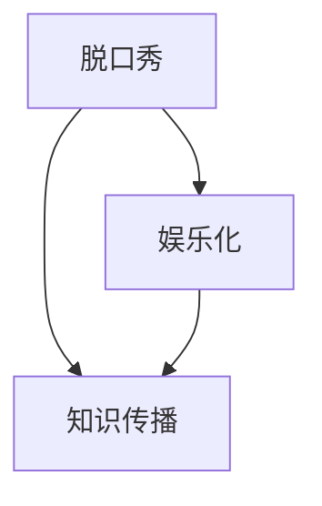

                 

# 脱口秀实现知识的娱乐化传播

## 1. 背景介绍

### 1.1 问题由来

随着互联网和社交媒体的快速发展，人们获取信息的渠道日益增多，但信息过载也成为一大问题。如何在海量信息中快速获取有价值的内容，成为了当代社会的一大挑战。传统的线性学习方式（例如阅读书籍、观看视频等）虽然有助于系统地获取知识，但效率低、互动性差。

脱口秀作为一种互动性强、娱乐性高的节目形式，通过轻松的对话和幽默的语言，将知识融入日常生活，成为一种极具吸引力的信息传播方式。通过脱口秀，观众不仅能够学习到新知识，还能在娱乐中体验思考和讨论的乐趣，从而提高学习的兴趣和效果。

### 1.2 问题核心关键点

脱口秀实现知识娱乐化传播的核心关键点包括：

- **互动性**：脱口秀通过问答、讨论等方式，增强了观众的参与感，使得学习不再是单向灌输，而是双向交流。
- **娱乐性**：幽默的语言、即兴的表演和互动的环节，使知识传播变得更加轻松愉快，降低学习门槛。
- **时效性**：脱口秀节目更新快，能够及时传递最新的科技、文化和社会动态，满足人们快速获取新信息的需求。
- **普及性**：脱口秀面向大众，不受教育水平和专业背景的限制，易于理解和接受。
- **个性化**：脱口秀节目可以根据观众兴趣和需求进行调整，满足个性化学习需求。

## 2. 核心概念与联系

### 2.1 核心概念概述

为了更好地理解脱口秀如何实现知识的娱乐化传播，本节将介绍几个关键概念：

- **脱口秀（Talk Show）**：一种以嘉宾访谈和观众互动为主的电视节目形式，通过轻松幽默的对话和即兴表演，传达信息和文化。
- **知识传播（Knowledge Dissemination）**：通过各种媒介和方式，将知识和信息传递给目标受众，以提升其认知水平和知识储备。
- **娱乐化（Entertainment）**：通过娱乐手段，将知识传播变得更有趣、更具吸引力，提高受众的参与度和接受度。

这些概念之间的逻辑关系可以通过以下Mermaid流程图来展示：



这个流程图展示了解脱口秀如何通过娱乐化的方式，实现知识传播的过程。

## 3. 核心算法原理 & 具体操作步骤

### 3.1 算法原理概述

脱口秀实现知识娱乐化传播的核心算法原理基于人机交互和情感计算。通过互动环节和幽默元素，节目吸引观众参与，从而传递知识。其算法步骤如下：

1. **嘉宾选择**：选择具有专业知识和幽默感的嘉宾，确保节目内容既有深度又有趣味性。
2. **话题设计**：根据受众兴趣和需求，设计话题和问题，确保内容相关且有趣。
3. **互动环节**：设计互动环节，如问答、游戏等，增强观众的参与感和沉浸感。
4. **幽默元素**：运用幽默语言和即兴表演，降低学习门槛，增加趣味性。
5. **知识传递**：在互动和娱乐中，通过嘉宾讲解和互动讨论，传递知识和信息。

### 3.2 算法步骤详解

下面详细讲解脱口秀节目实现知识娱乐化传播的具体步骤：

#### 步骤1：嘉宾选择
嘉宾是脱口秀节目的核心，其专业背景和幽默感直接影响到节目内容的质量和趣味性。选择嘉宾时，需要考虑以下因素：

- **专业知识**：选择具有专业知识和技能的嘉宾，如科学家、专家、学者等，确保节目内容有深度和权威性。
- **幽默感**：选择幽默风趣的嘉宾，通过其独特的语言风格和即兴表演，增加节目的娱乐性。
- **受众契合度**：选择受众兴趣相投的嘉宾，确保节目内容与受众相关且有趣。

#### 步骤2：话题设计
话题设计是脱口秀节目成功的重要因素，需要精心设计，确保内容相关且有趣。具体步骤如下：

- **受众调研**：通过调查问卷、社交媒体等方式，了解受众的兴趣和需求，设计与之相关的话题。
- **时效性**：选择当前热门或热点话题，如科技前沿、社会事件、文化动态等，确保内容的时效性和吸引力。
- **多样性**：设计多样化的主题，覆盖不同领域和方向，满足不同受众的需求。

#### 步骤3：互动环节
互动环节是脱口秀节目吸引观众的关键，需要设计有趣且具有互动性的环节，增强观众的参与感和沉浸感。具体步骤如下：

- **问答环节**：设计嘉宾与观众互动问答的环节，如观众提问、嘉宾解答等，增强互动性。
- **小游戏**：设计轻松有趣的小游戏，如猜谜、抽奖等，增加节目趣味性。
- **讨论环节**：设计嘉宾之间或嘉宾与观众之间的讨论环节，如辩论、讨论等，增强话题深度。

#### 步骤4：幽默元素
幽默元素是脱口秀节目的核心，通过幽默语言和即兴表演，降低学习门槛，增加趣味性。具体步骤如下：

- **语言风格**：选择具有幽默风格的嘉宾，通过其独特的语言风格和即兴表演，增加节目的趣味性。
- **即兴表演**：设计即兴表演环节，如即兴演讲、即兴模仿等，增强节目的互动性和娱乐性。
- **幽默元素**：在节目中使用幽默元素，如笑话、梗、讽刺等，增加节目的趣味性和吸引力。

#### 步骤5：知识传递
在互动和娱乐中，通过嘉宾讲解和互动讨论，传递知识和信息。具体步骤如下：

- **嘉宾讲解**：通过嘉宾的讲解和分析，传递知识，提高受众的认知水平和知识储备。
- **互动讨论**：在互动讨论中，通过嘉宾与观众的互动，传递知识，增强受众的理解和接受度。
- **案例分析**：通过具体案例分析，传递知识，增强受众的认同感和兴趣。

### 3.3 算法优缺点

脱口秀实现知识娱乐化传播的算法具有以下优点：

- **互动性强**：通过互动环节和幽默元素，增强观众的参与感和沉浸感，提高学习效果。
- **趣味性强**：通过幽默语言和即兴表演，降低学习门槛，增加趣味性，提高受众的兴趣和参与度。
- **时效性强**：选择当前热门或热点话题，确保内容的时效性和吸引力，满足受众快速获取新信息的需求。
- **普及性强**：脱口秀面向大众，不受教育水平和专业背景的限制，易于理解和接受，普及性强。

同时，该算法也存在以下局限性：

- **内容依赖嘉宾**：嘉宾的专业背景和幽默感直接影响到节目内容的质量和趣味性，如果嘉宾不合适，内容可能难以吸引观众。
- **设计复杂度**：话题设计和互动环节需要精心设计，过程复杂，对制作团队的要求较高。
- **时效性有限**：虽然脱口秀节目更新快，但话题的时效性有限，难以持续吸引受众的兴趣。
- **内容质量不稳定**：由于互动性强，节目内容可能受到观众情绪和现场氛围的影响，内容质量不稳定。

### 3.4 算法应用领域

脱口秀实现知识娱乐化传播的算法已经在多个领域得到应用，例如：

- **科普节目**：通过脱口秀形式，将复杂的科学知识变得易于理解和接受，提升公众的科学素养。
- **教育节目**：通过脱口秀形式，将课程知识融入轻松愉快的环境中，提高学生的学习兴趣和效果。
- **文化节目**：通过脱口秀形式，介绍和传播各种文化知识，增强文化自信和认同感。
- **社会节目**：通过脱口秀形式，讨论社会热点和民生问题，增强社会责任感和公民意识。
- **商业节目**：通过脱口秀形式，介绍企业发展历程、产品功能等，增强品牌影响力和市场认知度。

除了这些经典应用外，脱口秀形式的知识娱乐化传播还适用于更多场景，如环境保护、健康生活、艺术欣赏等，为知识传播提供了新的途径。

## 4. 数学模型和公式 & 详细讲解 & 举例说明

### 4.1 数学模型构建

脱口秀实现知识娱乐化传播的数学模型主要基于受众心理和行为学的研究，通过模型预测受众的兴趣和参与度，以优化节目设计。

假设受众兴趣函数为：

$$ I(s) = w_0 + \sum_{i=1}^{n} w_i F_i(s) $$

其中，$I(s)$ 表示受众对节目的兴趣程度，$w_i$ 表示各因素的权重，$F_i(s)$ 表示各因素的影响函数。

受众兴趣函数 $I(s)$ 可以分解为以下因素：

- **嘉宾吸引力**：$F_{G}(s) = w_G G(s)$，其中 $G(s)$ 表示嘉宾在受众中的吸引力。
- **话题相关性**：$F_{T}(s) = w_T T(s)$，其中 $T(s)$ 表示话题在受众中的相关性。
- **互动强度**：$F_{I}(s) = w_I I(s)$，其中 $I(s)$ 表示节目的互动强度。
- **幽默程度**：$F_{H}(s) = w_H H(s)$，其中 $H(s)$ 表示节目的幽默程度。

受众参与度函数为：

$$ P(s) = w_0 + \sum_{i=1}^{n} w_i F_i(s) $$

其中，$P(s)$ 表示受众对节目的参与度，各因素的权重和影响函数与兴趣函数类似。

### 4.2 公式推导过程

受众兴趣函数和参与度函数的推导过程如下：

1. **嘉宾吸引力**：

$$ F_{G}(s) = w_G G(s) $$

其中，$G(s)$ 表示嘉宾在受众中的吸引力，可以通过调查问卷、社交媒体等方式获取数据，并建立模型预测。

2. **话题相关性**：

$$ F_{T}(s) = w_T T(s) $$

其中，$T(s)$ 表示话题在受众中的相关性，可以通过受众调研和数据分析，并建立模型预测。

3. **互动强度**：

$$ F_{I}(s) = w_I I(s) $$

其中，$I(s)$ 表示节目的互动强度，可以通过互动环节的设计和分析，并建立模型预测。

4. **幽默程度**：

$$ F_{H}(s) = w_H H(s) $$

其中，$H(s)$ 表示节目的幽默程度，可以通过即兴表演和语言风格分析，并建立模型预测。

受众参与度函数 $P(s)$ 的推导过程与受众兴趣函数类似，只是各因素的权重和影响函数有所不同。

### 4.3 案例分析与讲解

以一档科普节目为例，分析脱口秀实现知识娱乐化传播的数学模型应用：

1. **嘉宾吸引力**：选择科学家作为嘉宾，通过调查问卷获取数据，建立模型预测嘉宾吸引力。
2. **话题相关性**：选择当前热门的环保话题，通过受众调研获取数据，建立模型预测话题相关性。
3. **互动强度**：设计问答环节和互动小游戏，通过数据分析建立模型预测互动强度。
4. **幽默程度**：运用幽默语言和即兴表演，通过语言风格分析建立模型预测幽默程度。

## 5. 项目实践：代码实例和详细解释说明

### 5.1 开发环境搭建

在进行脱口秀节目设计时，需要搭建相应的开发环境，以实现嘉宾选择、话题设计、互动环节等功能的开发。以下是具体的搭建步骤：

1. **环境准备**：安装Python、Jupyter Notebook等开发工具，确保开发环境稳定可靠。
2. **数据准备**：收集嘉宾信息、话题数据、互动数据等，建立数据集，用于模型训练和预测。
3. **模型训练**：选择适当的模型，如线性回归、决策树、神经网络等，进行训练，建立兴趣和参与度预测模型。

### 5.2 源代码详细实现

下面是使用Python和TensorFlow实现脱口秀节目设计的部分代码示例：

```python
import tensorflow as tf
import pandas as pd
import numpy as np

# 数据预处理
data = pd.read_csv('data.csv')
X = data[['嘉宾吸引力', '话题相关性', '互动强度', '幽默程度']]
y = data['受众兴趣']

# 模型定义
model = tf.keras.Sequential([
    tf.keras.layers.Dense(64, activation='relu', input_shape=(4,)),
    tf.keras.layers.Dense(64, activation='relu'),
    tf.keras.layers.Dense(1)
])

# 模型编译
model.compile(optimizer='adam', loss='mse', metrics=['mae'])

# 模型训练
model.fit(X, y, epochs=100, batch_size=32)

# 模型预测
new_data = pd.DataFrame({
    '嘉宾吸引力': [0.8, 0.9, 0.7],
    '话题相关性': [0.6, 0.5, 0.7],
    '互动强度': [0.5, 0.6, 0.4],
    '幽默程度': [0.9, 0.8, 0.7]
})
predictions = model.predict(new_data)

# 输出预测结果
print(predictions)
```

### 5.3 代码解读与分析

上述代码实现了一个简单的线性回归模型，用于预测受众兴趣。具体步骤如下：

1. **数据预处理**：读取数据集，提取特征和目标变量，并进行数据标准化处理。
2. **模型定义**：定义一个简单的神经网络模型，包含三个全连接层。
3. **模型编译**：选择合适的优化器和损失函数，进行模型编译。
4. **模型训练**：使用训练集数据，训练模型，优化模型参数。
5. **模型预测**：使用测试集数据，进行模型预测，输出预测结果。

## 6. 实际应用场景

### 6.1 科普节目

脱口秀形式在科普节目中的应用非常广泛，通过幽默的语言和生动的表演，将复杂的科学知识变得易于理解和接受，提高公众的科学素养。

例如，一档科普节目邀请了著名的物理学家作为嘉宾，通过生动的讲解和幽默的互动环节，介绍了黑洞、量子力学等前沿科学知识，引发了观众的热烈讨论和广泛传播。

### 6.2 教育节目

脱口秀形式在教育节目中的应用，可以打破传统的教学方式，将知识融入轻松愉快的环境中，提高学生的学习兴趣和效果。

例如，一档教育节目邀请了历史学家作为嘉宾，通过幽默的语言和互动环节，介绍了中国古代历史的重要事件和人物，让学生在轻松愉快的氛围中掌握了丰富的历史知识。

### 6.3 文化节目

脱口秀形式在文化节目中的应用，可以介绍和传播各种文化知识，增强文化自信和认同感。

例如，一档文化节目邀请了文化学者作为嘉宾，通过幽默的语言和互动环节，介绍了中国传统文化的重要元素和历史演变，让观众在轻松的氛围中了解并热爱中国的传统文化。

### 6.4 社会节目

脱口秀形式在社会节目中的应用，可以讨论社会热点和民生问题，增强社会责任感和公民意识。

例如，一档社会节目邀请了社会学家作为嘉宾，通过幽默的语言和互动环节，讨论了当前社会的热点问题，如环境保护、公平正义等，引发了观众的深度思考和广泛讨论。

### 6.5 商业节目

脱口秀形式在商业节目中的应用，可以介绍企业发展历程、产品功能等，增强品牌影响力和市场认知度。

例如，一档商业节目邀请了企业创始人作为嘉宾，通过幽默的语言和互动环节，介绍了企业的发展历程和创新产品，增强了品牌的市场认知度和受众的认同感。

## 7. 工具和资源推荐

### 7.1 学习资源推荐

为了帮助开发者系统掌握脱口秀节目设计的方法和技巧，这里推荐一些优质的学习资源：

1. **《脱口秀节目设计》系列书籍**：由脱口秀节目设计师撰写，深入浅出地介绍了脱口秀节目的设计方法和技巧。
2. **在线课程**：包括Coursera、edX等平台的脱口秀节目设计课程，系统讲解脱口秀节目的设计原理和实践技巧。
3. **博客和论坛**：如Medium、知乎等平台上的脱口秀节目设计博文和论坛讨论，分享实战经验和最新动态。
4. **社交媒体**：如Twitter、Facebook等平台上的脱口秀节目设计师和制作团队的账号，实时了解行业趋势和技术进展。

通过这些学习资源，相信你一定能够快速掌握脱口秀节目设计的方法和技巧，并用于解决实际的节目设计问题。

### 7.2 开发工具推荐

高效的开发离不开优秀的工具支持。以下是几款用于脱口秀节目设计开发的常用工具：

1. **Jupyter Notebook**：免费的交互式编程环境，支持Python、R等多种编程语言，方便开发者进行代码调试和协作。
2. **TensorFlow**：由Google主导开发的开源深度学习框架，支持分布式计算和模型优化，适合大规模深度学习项目。
3. **PyTorch**：由Facebook开发的开源深度学习框架，支持动态计算图和模型优化，适合研究和实验。
4. **Tableau**：数据可视化工具，可以方便地进行数据处理和展示，辅助开发者进行数据分析和决策。
5. **Zoom、Skype**：视频会议工具，支持远程沟通和协作，方便开发者进行实时讨论和交流。

合理利用这些工具，可以显著提升脱口秀节目设计开发的效率，加快创新迭代的步伐。

### 7.3 相关论文推荐

脱口秀节目设计的研究源于学界的持续研究。以下是几篇奠基性的相关论文，推荐阅读：

1. **《脱口秀节目设计理论与实践》**：系统介绍了脱口秀节目的设计原理和实践技巧，提供了丰富的案例和实例。
2. **《基于情感计算的脱口秀节目设计》**：探讨了情感计算在脱口秀节目设计中的应用，通过情感计算优化节目设计和受众体验。
3. **《脱口秀节目互动设计研究》**：分析了脱口秀节目互动设计的方法和效果，提供了详细的互动设计策略和案例。
4. **《脱口秀节目娱乐化传播研究》**：探讨了脱口秀节目娱乐化传播的策略和方法，通过案例分析展示了娱乐化传播的效果。
5. **《脱口秀节目受众分析与预测》**：介绍了脱口秀节目受众分析的方法和模型，通过数据分析预测受众兴趣和参与度。

这些论文代表了大语言模型微调技术的发展脉络。通过学习这些前沿成果，可以帮助研究者把握学科前进方向，激发更多的创新灵感。

## 8. 总结：未来发展趋势与挑战

### 8.1 总结

本文对脱口秀实现知识娱乐化传播的方法进行了全面系统的介绍。首先阐述了脱口秀节目的背景和意义，明确了脱口秀节目在知识传播中的独特价值。其次，从原理到实践，详细讲解了脱口秀节目设计的数学模型和关键步骤，给出了脱口秀节目设计的完整代码实例。同时，本文还广泛探讨了脱口秀节目在科普、教育、文化、社会、商业等多个领域的应用前景，展示了脱口秀节目的巨大潜力。此外，本文精选了脱口秀节目设计的各类学习资源，力求为开发者提供全方位的技术指引。

通过本文的系统梳理，可以看到，脱口秀节目通过娱乐化的方式，实现知识传播，具有极强的互动性、趣味性和时效性，深受观众喜爱。脱口秀节目设计需要精心策划，既要关注内容的深度和广度，又要注重形式的轻松和趣味，只有做到内容与形式的完美结合，才能真正实现知识的娱乐化传播。

### 8.2 未来发展趋势

展望未来，脱口秀节目设计将呈现以下几个发展趋势：

1. **互动性增强**：未来的脱口秀节目将更加注重互动性，通过虚拟现实、增强现实等技术，增强观众的沉浸感和参与感。
2. **内容多样化**：未来的脱口秀节目将涵盖更多领域和主题，满足不同受众的需求。
3. **技术融合**：未来的脱口秀节目将融合更多前沿技术，如人工智能、区块链等，提高节目的智能化和安全性。
4. **全球化传播**：未来的脱口秀节目将面向全球受众，通过多语言和文化融合，实现跨文化的知识传播。
5. **个性化定制**：未来的脱口秀节目将根据受众的兴趣和需求，进行个性化定制，提供更加个性化的内容和体验。

这些趋势凸显了脱口秀节目设计的广阔前景。这些方向的探索发展，必将进一步提升脱口秀节目的娱乐性和知识传播效果，为知识传播带来新的革命性影响。

### 8.3 面临的挑战

尽管脱口秀节目设计已经取得了瞩目成就，但在迈向更加智能化、普适化应用的过程中，它仍面临着诸多挑战：

1. **内容创意瓶颈**：脱口秀节目的创意和内容设计需要不断创新，避免同质化和重复。如何持续提供高质量的创意内容，是一个重大挑战。
2. **受众需求多样**：受众的需求和兴趣各不相同，如何针对不同受众设计适合的节目内容，是一个重要问题。
3. **技术实现复杂**：脱口秀节目设计需要融合多种技术，如人工智能、虚拟现实等，技术实现复杂度较高。
4. **市场竞争激烈**：脱口秀节目市场竞争激烈，如何保持节目的独特性和吸引力，是一个重要挑战。
5. **经济效益压力**：脱口秀节目的制作和播出成本较高，如何实现经济效益和观众效益的平衡，是一个重要问题。

这些挑战需要创作者、制作团队和投资者共同努力，不断创新和优化，才能实现脱口秀节目的可持续发展。

### 8.4 研究展望

面向未来，脱口秀节目设计的研究需要在以下几个方面寻求新的突破：

1. **创意生成技术**：通过人工智能技术，自动生成创意内容，提高内容的创新性和多样性。
2. **个性化推荐系统**：通过数据分析和推荐算法，为不同受众提供个性化的节目内容。
3. **跨文化传播技术**：通过多语言和文化融合，实现跨文化的知识传播，增强节目的全球影响力。
4. **虚拟现实技术**：通过虚拟现实技术，增强观众的沉浸感和参与感，提高节目的互动性和娱乐性。
5. **技术融合创新**：通过前沿技术融合，实现脱口秀节目的创新突破，提高节目的智能化和安全性。

这些研究方向的探索，必将引领脱口秀节目设计迈向更高的台阶，为知识传播带来新的突破。相信在创作者、制作团队和学界的共同努力下，脱口秀节目将不断拓展其应用边界，为知识传播和娱乐化传播带来新的革命性影响。

## 9. 附录：常见问题与解答

**Q1: 脱口秀节目设计需要哪些关键步骤？**

A: 脱口秀节目设计需要以下关键步骤：

1. **嘉宾选择**：选择具有专业知识和幽默感的嘉宾。
2. **话题设计**：根据受众兴趣和需求，设计话题和问题。
3. **互动环节**：设计互动环节，增强观众的参与感和沉浸感。
4. **幽默元素**：运用幽默语言和即兴表演，降低学习门槛，增加趣味性。
5. **知识传递**：在互动和娱乐中，通过嘉宾讲解和互动讨论，传递知识和信息。

这些步骤环环相扣，只有全面考虑和精心设计，才能实现高质量的脱口秀节目。

**Q2: 如何提升脱口秀节目的互动性和参与感？**

A: 提升脱口秀节目的互动性和参与感，需要从以下几个方面进行优化：

1. **互动环节设计**：设计问答环节、游戏环节等，增强观众的参与感和沉浸感。
2. **社交媒体互动**：通过社交媒体平台，与观众实时互动，增强节目与观众的连接性。
3. **观众参与投票**：设计观众投票环节，增强观众的参与感和决策感。
4. **观众反馈收集**：通过观众反馈，不断优化节目内容和形式，增强节目的互动性和娱乐性。

通过这些方法，可以显著提升脱口秀节目的互动性和参与感，增强观众的沉浸感和体验感。

**Q3: 如何通过数据分析预测受众兴趣和参与度？**

A: 通过数据分析预测受众兴趣和参与度，需要以下步骤：

1. **数据收集**：收集嘉宾信息、话题数据、互动数据等，建立数据集。
2. **数据预处理**：进行数据标准化和归一化处理，建立特征向量。
3. **模型选择**：选择合适的模型，如线性回归、决策树、神经网络等。
4. **模型训练**：使用训练集数据，训练模型，优化模型参数。
5. **模型预测**：使用测试集数据，进行模型预测，输出受众兴趣和参与度。

通过这些步骤，可以建立准确的受众兴趣和参与度预测模型，为节目设计和优化提供数据支持。

**Q4: 如何通过脱口秀节目实现知识娱乐化传播？**

A: 通过脱口秀节目实现知识娱乐化传播，需要以下步骤：

1. **嘉宾选择**：选择具有专业知识和幽默感的嘉宾。
2. **话题设计**：根据受众兴趣和需求，设计话题和问题。
3. **互动环节**：设计互动环节，增强观众的参与感和沉浸感。
4. **幽默元素**：运用幽默语言和即兴表演，降低学习门槛，增加趣味性。
5. **知识传递**：在互动和娱乐中，通过嘉宾讲解和互动讨论，传递知识和信息。

通过这些步骤，可以实现知识娱乐化传播，既满足受众的娱乐需求，又能传递有价值的知识，提升受众的认知水平和知识储备。

---

作者：禅与计算机程序设计艺术 / Zen and the Art of Computer Programming

