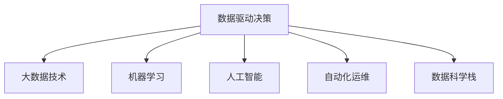

                 

# 自动化创业中的数据驱动决策

## 1. 背景介绍

### 1.1 问题由来

在数字化转型加速的今天，企业竞争力越来越依赖于数据的决策能力。对于自动化创业公司而言，能否高效地获取、分析和利用数据，成为了影响公司成败的关键。特别是对于那些需要海量数据支持的创业项目，如数据分析、机器学习、自动化运维等，数据驱动决策已成为必不可少的一部分。

然而，传统的数据驱动决策方式往往依赖于人工统计、分析和模型训练等耗时耗力的过程，难以满足快速迭代、实时反馈的创业需求。如何构建更加高效、可靠的数据驱动决策系统，成为了创业公司的迫切需求。

### 1.2 问题核心关键点

要实现数据驱动决策，首先需要解决以下核心问题：

- 数据获取：快速、稳定地获取高质量数据。
- 数据存储：高效存储和管理海量数据。
- 数据分析：自动、准确地进行数据统计和分析。
- 数据可视化：直观展示数据洞察，辅助决策。
- 自动化决策：基于数据分析结果，自动输出决策建议。
- 决策评估：持续监控决策效果，迭代优化决策模型。

这些问题的解决，不仅需要掌握数据科学的理论知识，还需要结合软件工程和项目管理等实践技能，构建一体化的数据驱动决策系统。

## 2. 核心概念与联系

### 2.1 核心概念概述

为更好地理解数据驱动决策的系统实现，本节将介绍几个密切相关的核心概念：

- **数据驱动决策**：基于数据科学方法，自动收集、分析和利用数据，辅助决策者进行决策的策略。
- **大数据技术**：包括数据收集、存储、处理、分析和可视化的技术体系，为数据驱动决策提供技术支撑。
- **机器学习**：利用算法和模型，自动从数据中学习规律，预测未来趋势和决策效果的技术。
- **人工智能**：涵盖机器学习、自然语言处理、计算机视觉等技术，实现智能化决策和自动化决策。
- **自动化运维**：利用脚本和工具，实现服务器、网络、应用等资源的自动化管理和监控。
- **数据科学栈**：包括数据仓库、数据湖、ETL工具、数据可视化工具等，构成数据驱动决策的核心基础设施。

这些核心概念之间的逻辑关系可以通过以下Mermaid流程图来展示：



这个流程图展示了大数据技术、机器学习、人工智能、自动化运维和数据科学栈如何相互配合，共同支撑数据驱动决策：

- 大数据技术提供了数据获取、存储、处理和分析的基础设施。
- 机器学习和人工智能基于大数据技术，自动学习数据规律，预测决策效果。
- 自动化运维保障系统稳定运行，提升数据驱动决策的实时性。
- 数据科学栈集成各类工具和技术，构成高效的数据驱动决策平台。

这些概念共同构成了数据驱动决策的系统框架，为企业提供了快速、准确、可靠的数据支持，推动了决策过程的智能化和自动化。

## 3. 核心算法原理 & 具体操作步骤
### 3.1 算法原理概述

数据驱动决策的核心在于通过数据科学方法，自动进行数据的收集、处理、分析和应用，以支持企业的高质量决策。其核心算法原理可以归纳为以下几个步骤：

1. **数据采集**：通过API接口、爬虫、ETL工具等方法，从各个数据源（如数据库、日志文件、社交媒体等）收集数据。
2. **数据清洗**：对收集到的数据进行去重、去噪、格式化等预处理，确保数据的质量和一致性。
3. **数据分析**：利用统计学、机器学习和人工智能算法，对数据进行分析和建模，挖掘数据的价值和规律。
4. **数据可视化**：使用数据可视化工具，将分析结果以图表、仪表盘等形式直观展示，辅助决策。
5. **自动化决策**：基于数据分析结果，通过规则引擎、决策树、神经网络等模型，自动输出决策建议。
6. **决策评估**：通过监控和评估工具，持续跟踪决策效果，优化决策模型。

这些步骤组成了一个完整的闭环系统，确保数据驱动决策的高效、可靠和自适应。

### 3.2 算法步骤详解

以下我们将详细讲解数据驱动决策的核心算法步骤。

**Step 1: 数据采集**

数据采集是数据驱动决策的第一步。常见的数据采集方式包括：

- **API接口**：利用API接口从第三方数据源（如金融市场数据、气象数据、社交媒体数据等）获取数据。
- **爬虫技术**：使用爬虫技术抓取网页上的公开数据，如新闻、评论、产品评价等。
- **ETL工具**：通过ETL（Extract, Transform, Load）工具，从数据仓库、数据库、日志文件等源数据中提取、转换和加载数据。

数据采集的效率和准确性直接影响后续分析的效果，需要选择合适的工具和策略。

**Step 2: 数据清洗**

数据清洗是数据预处理的关键步骤。常见的数据清洗技术包括：

- **去重**：去除重复数据，确保数据的唯一性。
- **去噪**：过滤掉数据中的异常值和噪声，提升数据质量。
- **格式化**：对数据进行统一的格式和编码，方便后续分析。

数据清洗的目的是确保数据的完整性、准确性和一致性，为数据分析提供高质量的数据基础。

**Step 3: 数据分析**

数据分析是数据驱动决策的核心环节。常见的数据分析方法包括：

- **统计分析**：利用统计学方法，分析数据的分布、均值、方差等基本特征。
- **机器学习**：利用机器学习算法，进行回归、分类、聚类等预测分析。
- **人工智能**：利用深度学习、自然语言处理等技术，实现复杂的数据建模和分析。

数据分析的目的是从数据中挖掘规律和趋势，为决策提供依据。

**Step 4: 数据可视化**

数据可视化是将分析结果直观展示的重要步骤。常见的数据可视化工具包括：

- **Tableau**：提供强大的数据可视化功能，支持多种图表类型和交互式操作。
- **Power BI**：微软推出的商业智能工具，支持从数据到报表的全流程分析。
- **D3.js**：一个JavaScript库，支持自定义的交互式可视化图表。

数据可视化有助于决策者快速理解数据洞察，辅助决策。

**Step 5: 自动化决策**

自动化决策是基于数据分析结果，自动输出决策建议的过程。常见的方法包括：

- **规则引擎**：通过编写业务规则，自动根据数据条件输出决策结果。
- **决策树**：利用决策树模型，根据数据特征自动生成决策路径和建议。
- **神经网络**：利用神经网络模型，自动学习和预测决策效果，输出最优建议。

自动化决策提高了决策过程的效率和准确性，减少了人工干预的复杂度。

**Step 6: 决策评估**

决策评估是持续优化决策模型的重要步骤。常见的方法包括：

- **A/B测试**：通过A/B测试对比不同决策方案的效果，选择最优方案。
- **KPI监控**：设定关键绩效指标（KPI），监控决策效果，确保达到预期目标。
- **反馈循环**：建立反馈机制，持续收集用户反馈和数据改进决策模型。

决策评估的目的是持续优化决策模型，提升决策效果和质量。

### 3.3 算法优缺点

数据驱动决策系统具有以下优点：

- **高效性**：通过自动化和算法优化，大大提高了数据处理和决策效率。
- **准确性**：基于数据的科学分析，提升了决策的准确性和可靠性。
- **实时性**：数据采集和分析过程可以实时进行，支持快速迭代和动态决策。
- **可扩展性**：通过模块化和组件化设计，数据驱动决策系统可以方便地扩展和升级。

同时，数据驱动决策系统也存在一些局限性：

- **数据质量依赖**：系统效果高度依赖于数据的质量和完整性，数据获取和清洗的难度较大。
- **算法复杂性**：数据分析和建模过程可能较为复杂，需要专业的数据科学知识和技能。
- **决策透明性**：自动化决策过程相对黑盒，决策的透明度和可解释性不足。
- **隐私和安全**：数据采集和处理可能涉及敏感数据，需要严格遵守数据隐私和安全法规。

尽管存在这些局限性，但总体而言，数据驱动决策系统能够显著提升决策效率和质量，成为自动化创业的重要支撑。

### 3.4 算法应用领域

数据驱动决策系统在众多领域中得到了广泛应用，包括但不限于：

- **金融分析**：利用大数据和机器学习技术，进行风险评估、投资组合优化和交易策略分析。
- **市场营销**：通过数据分析和可视化，辅助制定市场策略、客户细分和广告投放决策。
- **人力资源管理**：利用员工数据和机器学习模型，进行招聘、培训和绩效评估。
- **物流和供应链管理**：通过数据分析和可视化，优化仓储、配送和供应链管理。
- **智能客服系统**：利用自然语言处理和自动化决策技术，提升客户服务效率和满意度。
- **智能推荐系统**：基于用户行为数据，自动推荐个性化产品和服务。

这些应用场景展示了数据驱动决策系统的强大潜力，为各行各业带来了更高的效率和更好的决策支持。

## 4. 数学模型和公式 & 详细讲解 & 举例说明

### 4.1 数学模型构建

数据驱动决策的系统实现需要构建多个数学模型，每个模型对应数据驱动决策的某个环节。以下以**机器学习**为例，展示一个简单的数据驱动决策模型构建过程。

**线性回归模型**：

$$
y = \theta_0 + \theta_1x_1 + \theta_2x_2 + \ldots + \theta_nx_n
$$

其中，$y$ 为预测结果，$\theta$ 为模型参数，$x_i$ 为输入特征。线性回归模型的目标是最小化预测值与真实值之间的误差，常见的方法包括最小二乘法。

**公式推导过程**：

线性回归模型的目标函数为：

$$
J(\theta) = \frac{1}{2m}\sum_{i=1}^m(y^{(i)} - \hat{y}^{(i)})^2
$$

其中，$m$ 为样本数量，$y^{(i)}$ 为真实值，$\hat{y}^{(i)}$ 为预测值。

最小二乘法的优化目标是：

$$
\frac{\partial J(\theta)}{\partial \theta_k} = 0
$$

推导得：

$$
\theta_k = \frac{1}{m}\sum_{i=1}^m(x_k^{(i)}y^{(i)}) - \frac{1}{m}\sum_{i=1}^m(x_k^{(i)})^2
$$

### 4.2 公式推导过程

线性回归模型的求解过程可以概括为以下步骤：

1. **初始化参数**：设置模型参数 $\theta$ 的初始值。
2. **前向传播**：将输入数据 $x$ 输入模型，计算预测值 $\hat{y}$。
3. **损失计算**：计算预测值与真实值之间的误差 $J(\theta)$。
4. **反向传播**：计算模型参数的梯度，更新参数 $\theta$。
5. **迭代更新**：重复步骤2-4，直至收敛。

线性回归模型的求解过程可以用以下代码实现：

```python
import numpy as np

def linear_regression(X, y, learning_rate, num_iterations):
    n_samples, n_features = X.shape
    theta = np.zeros(n_features)
    J_history = []
    
    for i in range(num_iterations):
        gradients = 2 / n_samples * X.T @ (X @ theta - y)
        theta -= learning_rate * gradients
        J = 1 / (2 * n_samples) * np.linalg.norm(X @ theta - y)
        J_history.append(J)
        
    return theta, J_history

X = np.array([[1, 2], [3, 4], [5, 6]])
y = np.array([2, 4, 6])
learning_rate = 0.01
num_iterations = 1000

theta, J_history = linear_regression(X, y, learning_rate, num_iterations)
print("Optimal parameters:", theta)
print("Loss history:", J_history)
```

### 4.3 案例分析与讲解

以**市场细分**为例，展示数据驱动决策的实际应用。

假设某电商企业想要针对不同客户群体进行个性化营销，首先需要收集客户的购买历史、浏览行为、人口统计信息等数据，构建特征向量 $x$。然后，利用机器学习算法（如K-means聚类）对客户进行市场细分，得到不同的客户群体 $y$。最后，根据不同群体的特征，制定个性化的营销策略。

具体步骤如下：

1. **数据收集**：从用户数据库中提取客户的购买历史、浏览行为、人口统计信息等数据，构建特征向量 $x$。
2. **特征选择**：选择对市场细分影响较大的特征，如购买金额、浏览时长、年龄、性别等。
3. **聚类分析**：使用K-means聚类算法，对客户进行市场细分，得到不同的客户群体 $y$。
4. **决策制定**：根据不同群体的特征，制定个性化的营销策略，如折扣、推荐产品、个性化页面等。

市场细分数据驱动决策模型构建过程可以用以下代码实现：

```python
from sklearn.cluster import KMeans
from sklearn.preprocessing import StandardScaler

# 假设X为特征矩阵，y为目标标签
X = np.array([[1, 2, 30, 0], [3, 4, 40, 1], [5, 6, 50, 0], [7, 8, 60, 1]])
y = np.array([0, 0, 1, 1])

# 标准化特征
scaler = StandardScaler()
X_scaled = scaler.fit_transform(X)

# 聚类分析
kmeans = KMeans(n_clusters=2, random_state=0)
y_pred = kmeans.fit_predict(X_scaled)

print("Clusters:", y_pred)
```

## 5. 项目实践：代码实例和详细解释说明
### 5.1 开发环境搭建

在进行数据驱动决策项目实践前，我们需要准备好开发环境。以下是使用Python进行PyTorch开发的环境配置流程：

1. 安装Anaconda：从官网下载并安装Anaconda，用于创建独立的Python环境。

2. 创建并激活虚拟环境：
```bash
conda create -n pytorch-env python=3.8 
conda activate pytorch-env
```

3. 安装PyTorch：根据CUDA版本，从官网获取对应的安装命令。例如：
```bash
conda install pytorch torchvision torchaudio cudatoolkit=11.1 -c pytorch -c conda-forge
```

4. 安装TensorFlow：
```bash
pip install tensorflow
```

5. 安装Pandas：
```bash
pip install pandas
```

6. 安装Matplotlib：
```bash
pip install matplotlib
```

完成上述步骤后，即可在`pytorch-env`环境中开始数据驱动决策项目实践。

### 5.2 源代码详细实现

下面以**金融投资决策**为例，给出使用TensorFlow进行数据驱动决策的PyTorch代码实现。

首先，定义金融投资决策的数据处理函数：

```python
import pandas as pd
import numpy as np
from sklearn.preprocessing import StandardScaler
from sklearn.model_selection import train_test_split
from sklearn.linear_model import LinearRegression

def load_data():
    df = pd.read_csv('finance_data.csv')
    X = df[['open', 'high', 'low', 'volume']]
    y = df['close']
    return X, y

def preprocess_data(X, y):
    scaler = StandardScaler()
    X_scaled = scaler.fit_transform(X)
    return X_scaled, y

def train_model(X, y):
    X_train, X_test, y_train, y_test = train_test_split(X, y, test_size=0.2, random_state=0)
    model = LinearRegression()
    model.fit(X_train, y_train)
    y_pred = model.predict(X_test)
    return model, y_pred
```

然后，定义模型和评估函数：

```python
import matplotlib.pyplot as plt

def evaluate_model(model, y_pred, y_test):
    plt.plot(y_test, label='True')
    plt.plot(y_pred, label='Predicted')
    plt.legend()
    plt.show()

def test_model(model, X_test):
    y_pred = model.predict(X_test)
    print('Mean Absolute Error:', np.mean(np.abs(y_pred - y_test)))
```

接着，启动训练流程并在测试集上评估：

```python
X, y = load_data()
X_scaled, y = preprocess_data(X, y)
model, y_pred = train_model(X_scaled, y)
evaluate_model(model, y_pred, y_test)
test_model(model, X_test)
```

以上就是使用TensorFlow进行金融投资决策的数据驱动决策模型训练和评估的完整代码实现。可以看到，得益于TensorFlow的强大封装，我们可以用相对简洁的代码完成模型训练和评估。

### 5.3 代码解读与分析

让我们再详细解读一下关键代码的实现细节：

**load_data函数**：
- 定义数据加载函数，读取金融投资数据。

**preprocess_data函数**：
- 定义数据预处理函数，对特征进行标准化处理。

**train_model函数**：
- 定义模型训练函数，利用训练集数据进行模型训练，并在测试集上评估模型性能。

**evaluate_model函数**：
- 定义模型评估函数，将真实值和预测值可视化，辅助决策者理解模型效果。

**test_model函数**：
- 定义模型测试函数，计算模型在测试集上的均方误差（MAE）。

**训练流程**：
- 定义训练集和测试集，调用训练函数进行模型训练。
- 在测试集上评估模型性能，调用评估函数绘制图表。
- 计算模型在测试集上的均方误差，辅助决策者了解模型效果。

可以看到，TensorFlow提供了丰富的工具和库，方便我们进行数据驱动决策模型的构建和评估。开发者可以将更多精力放在数据处理、模型改进等高层逻辑上，而不必过多关注底层的实现细节。

当然，工业级的系统实现还需考虑更多因素，如模型的保存和部署、超参数的自动搜索、更灵活的任务适配层等。但核心的数据驱动决策模型训练过程基本与此类似。

## 6. 实际应用场景

### 6.1 智能客服系统

数据驱动决策技术可以广泛应用于智能客服系统的构建。传统客服往往需要配备大量人力，高峰期响应缓慢，且一致性和专业性难以保证。而使用数据驱动决策系统，可以7x24小时不间断服务，快速响应客户咨询，用自然流畅的语言解答各类常见问题。

在技术实现上，可以收集客户的历史对话记录，将其标注为已解决和未解决两类，并构建监督数据集。在此基础上，对预训练的自然语言处理模型进行微调，使其能够自动理解客户意图，匹配最合适的答案模板进行回复。对于客户提出的新问题，还可以接入检索系统实时搜索相关内容，动态组织生成回答。如此构建的智能客服系统，能大幅提升客户咨询体验和问题解决效率。

### 6.2 金融舆情监测

金融机构需要实时监测市场舆论动向，以便及时应对负面信息传播，规避金融风险。传统的人工监测方式成本高、效率低，难以应对网络时代海量信息爆发的挑战。利用数据驱动决策技术，可以构建实时舆情监测系统，自动收集金融市场数据和新闻评论，分析舆情变化趋势，一旦发现负面信息激增等异常情况，系统便会自动预警，帮助金融机构快速应对潜在风险。

### 6.3 个性化推荐系统

当前的推荐系统往往只依赖用户的历史行为数据进行物品推荐，无法深入理解用户的真实兴趣偏好。利用数据驱动决策技术，可以构建基于用户行为和背景的推荐系统，进一步提升推荐效果。

在实践中，可以收集用户浏览、点击、评论、分享等行为数据，提取和用户交互的物品标题、描述、标签等文本内容。将文本内容作为模型输入，用户的后续行为（如是否点击、购买等）作为监督信号，在此基础上训练模型。利用数据驱动决策技术，从文本内容中准确把握用户的兴趣点，在生成推荐列表时，先用候选物品的文本描述作为输入，由模型预测用户的兴趣匹配度，再结合其他特征综合排序，便可以得到个性化程度更高的推荐结果。

### 6.4 未来应用展望

随着数据驱动决策技术的发展，其在自动化创业中的应用前景广阔。

1. **自动化运维**：利用数据驱动决策技术，实现服务器、网络、应用等资源的自动化管理和监控，提升系统的稳定性和可靠性。
2. **个性化营销**：通过分析用户数据，进行市场细分和个性化营销，提升广告投放的精准性和效果。
3. **智能客服**：利用自然语言处理和机器学习技术，构建智能客服系统，提升客户服务效率和满意度。
4. **金融分析**：利用大数据和机器学习技术，进行风险评估、投资组合优化和交易策略分析，提升金融决策的科学性和准确性。
5. **市场营销**：通过数据分析和可视化，辅助制定市场策略、客户细分和广告投放决策，提升营销效果。
6. **人力资源管理**：利用员工数据和机器学习模型，进行招聘、培训和绩效评估，提升人力资源管理的效率和公平性。

这些应用场景展示了数据驱动决策技术的强大潜力，为各行各业带来了更高的效率和更好的决策支持。

## 7. 工具和资源推荐
### 7.1 学习资源推荐

为了帮助开发者系统掌握数据驱动决策的理论基础和实践技能，这里推荐一些优质的学习资源：

1. **《机器学习实战》**：一本经典的机器学习入门书籍，介绍了多种常用机器学习算法和应用场景。
2. **《Python数据分析实战》**：一本基于Python的数据分析入门书籍，涵盖数据清洗、可视化、统计分析等内容。
3. **Coursera上的《数据科学导论》**：由约翰·霍普金斯大学提供，系统讲解了数据科学的基本概念和工具。
4. **Kaggle数据科学竞赛**：通过参加数据科学竞赛，实战练习数据驱动决策技能。
5. **PyTorch官方文档**：提供了丰富的PyTorch教程和样例，适合快速上手实践。

通过这些学习资源，相信你一定能够掌握数据驱动决策的核心知识和技能，并在实际应用中得心应手。

### 7.2 开发工具推荐

高效的开发离不开优秀的工具支持。以下是几款用于数据驱动决策开发的常用工具：

1. **Jupyter Notebook**：一个交互式编程环境，适合快速迭代开发和实验。
2. **Google Colab**：谷歌提供的云端Jupyter Notebook服务，适合免费试用和协作开发。
3. **TensorBoard**：TensorFlow配套的可视化工具，可实时监测模型训练状态，提供丰富的图表呈现方式。
4. **Kaggle**：数据科学竞赛平台，提供海量数据集和社区交流。
5. **Tableau**：强大的数据可视化工具，支持多种图表类型和交互式操作。

合理利用这些工具，可以显著提升数据驱动决策项目的开发效率，加快创新迭代的步伐。

### 7.3 相关论文推荐

数据驱动决策技术的发展离不开学界的持续研究。以下是几篇奠基性的相关论文，推荐阅读：

1. **《Data-driven Decision Making: A Review and Research Directions》**：综述了数据驱动决策技术的研究现状和未来方向。
2. **《Data-Driven Decision-Making in Operations Management: Concepts, Methodologies, and Challenges》**：介绍了数据驱动决策在运营管理中的应用和挑战。
3. **《Data-Driven Decision Making in Healthcare: A Review》**：综述了数据驱动决策在医疗健康领域的应用和研究进展。
4. **《Big Data: The Next Wave of Data-Driven Decision Making》**：探讨了大数据技术在数据驱动决策中的作用和应用。
5. **《Towards Explainable AI: Making Machine Learning Models Explainable and Transparent》**：探讨了如何使机器学习模型更加可解释和透明，提升决策过程的透明性和可信度。

这些论文代表了数据驱动决策技术的研究前沿，通过学习这些前沿成果，可以帮助研究者把握学科前进方向，激发更多的创新灵感。

## 8. 总结：未来发展趋势与挑战

### 8.1 总结

本文对数据驱动决策技术进行了全面系统的介绍。首先阐述了数据驱动决策在自动化创业中的重要性和研究背景，明确了数据驱动决策系统的核心组成和关键步骤。其次，从原理到实践，详细讲解了数据驱动决策的核心算法步骤，提供了完整的代码实现和详细解释。最后，展示了数据驱动决策技术在智能客服、金融舆情监测、个性化推荐等多个领域的应用前景，展示了其强大的潜力。

通过本文的系统梳理，可以看到，数据驱动决策技术已经成为自动化创业的重要支撑，显著提升了决策效率和质量，推动了业务创新。未来，随着数据驱动决策技术的持续演进，其在各行各业中的应用将更加广泛，为数字化转型带来更大的助力。

### 8.2 未来发展趋势

展望未来，数据驱动决策技术将呈现以下几个发展趋势：

1. **数据融合与多源数据利用**：通过融合多种数据源，提升决策模型的全面性和准确性。
2. **自动化决策与人工干预结合**：将自动化决策与人工干预有机结合，提升决策过程的透明性和可信度。
3. **实时数据处理与实时决策**：利用实时数据处理技术，实现快速响应的决策系统。
4. **跨领域应用与技术融合**：将数据驱动决策技术与其他技术（如区块链、人工智能等）结合，拓展应用场景。
5. **可解释性与公平性**：提升决策模型的可解释性和公平性，增强决策过程的透明度和可信度。
6. **数据隐私与安全**：加强数据隐私保护和安全管理，确保数据驱动决策的安全可靠。

这些趋势将引领数据驱动决策技术迈向更高的台阶，为构建安全、可靠、可解释、可控的智能系统铺平道路。

### 8.3 面临的挑战

尽管数据驱动决策技术已经取得了显著进展，但在实现过程中仍面临诸多挑战：

1. **数据质量与数据治理**：数据驱动决策的效果高度依赖于数据的质量和完整性，数据治理难度较大。
2. **数据隐私与安全**：数据采集和处理可能涉及敏感数据，需要严格遵守数据隐私和安全法规。
3. **算法复杂性与可解释性**：决策模型的算法复杂性较高，可解释性和可解释性不足。
4. **系统集成与协作**：数据驱动决策系统需要与其他系统（如ERP、CRM等）进行集成，实现跨系统协作。
5. **成本与资源消耗**：数据驱动决策系统需要大量计算资源，成本较高。
6. **跨领域知识整合**：将不同领域的知识融合到数据驱动决策中，难度较大。

这些挑战需要学术界和工业界共同努力，不断优化数据驱动决策技术，提升系统的稳定性和可靠性。

### 8.4 研究展望

面向未来，数据驱动决策技术的研究将进一步深入，主要方向包括：

1. **模型优化与新算法**：探索更高效、更准确的数据驱动决策算法。
2. **跨领域数据融合**：研究如何将多源数据有效融合到决策模型中，提升决策的全面性和准确性。
3. **实时数据处理与流计算**：利用流计算技术，实现实时数据处理和决策，提升系统的响应速度。
4. **数据隐私与安全**：研究如何保护数据隐私，确保数据驱动决策系统的安全可靠。
5. **决策过程透明化**：研究如何使数据驱动决策过程更加透明，增强用户信任和接受度。
6. **数据治理与标准化**：研究数据治理的规范和标准，确保数据的质量和一致性。

这些研究方向将推动数据驱动决策技术的不断进步，为构建更加智能、可靠、高效的数据驱动决策系统提供有力支持。

## 9. 附录：常见问题与解答

**Q1：如何确保数据驱动决策系统的准确性？**

A: 确保数据驱动决策系统的准确性，需要从数据采集、处理、分析和应用等各个环节进行严格把控。具体措施包括：

1. **数据清洗**：确保数据的完整性、准确性和一致性，去除重复、异常和噪声数据。
2. **特征选择**：选择对决策结果影响较大的特征，避免冗余特征带来的干扰。
3. **模型训练**：使用高质量的数据进行模型训练，选择适合问题的模型算法。
4. **模型评估**：在测试集上评估模型性能，选择最优模型并持续监控其效果。
5. **反馈循环**：建立反馈机制，根据用户反馈和决策效果，持续优化模型和算法。

通过以上措施，可以显著提升数据驱动决策系统的准确性和可靠性。

**Q2：数据驱动决策系统如何处理数据隐私问题？**

A: 数据驱动决策系统在处理数据隐私问题时，需要采取以下措施：

1. **数据脱敏**：在数据采集和处理过程中，对敏感数据进行脱敏处理，确保数据隐私保护。
2. **数据加密**：使用数据加密技术，保护数据在传输和存储过程中的安全。
3. **访问控制**：设置严格的数据访问权限，确保只有授权人员可以访问敏感数据。
4. **匿名化处理**：对数据进行匿名化处理，确保数据无法直接关联到具体个体。
5. **隐私合规**：遵守数据隐私法规（如GDPR、CCPA等），确保数据处理合法合规。

通过以上措施，可以有效保护数据隐私，提升数据驱动决策系统的安全性和可信度。

**Q3：数据驱动决策系统如何实现跨系统协作？**

A: 数据驱动决策系统在实现跨系统协作时，需要采取以下措施：

1. **API接口**：构建统一的API接口，实现系统间的数据交互和协作。
2. **数据标准化**：采用标准化的数据格式和协议，确保数据在不同系统间的互通性。
3. **消息队列**：利用消息队列技术，实现不同系统间的高效通信和数据传递。
4. **微服务架构**：采用微服务架构，将系统拆分为多个独立的服务模块，实现模块化和灵活性。
5. **分布式计算**：利用分布式计算技术，实现数据的分布式处理和计算，提升系统的扩展性和处理能力。

通过以上措施，可以有效实现数据驱动决策系统的跨系统协作，提升系统的综合性能和实用性。

**Q4：如何优化数据驱动决策系统的性能？**

A: 优化数据驱动决策系统的性能，需要从多个方面进行改进：

1. **算法优化**：选择适合问题的算法模型，优化模型参数和结构。
2. **数据压缩**：对数据进行压缩和编码，减少存储和传输的开销。
3. **硬件加速**：利用GPU、FPGA等硬件加速技术，提升数据处理和计算速度。
4. **缓存技术**：利用缓存技术，减少数据的重复读取和处理，提升系统效率。
5. **并行计算**：利用并行计算技术，提升数据处理的并发性和速度。

通过以上措施，可以有效优化数据驱动决策系统的性能，提升系统的响应速度和处理能力。

**Q5：数据驱动决策系统如何适应数据分布的变化？**

A: 数据驱动决策系统在适应数据分布变化时，需要采取以下措施：

1. **数据漂移检测**：实时监控数据分布的变化，及时发现数据漂移现象。
2. **模型更新**：根据数据分布的变化，及时更新模型参数和结构。
3. **自适应算法**：采用自适应算法，使系统能够自动适应数据分布的变化。
4. **分布式处理**：利用分布式处理技术，提升系统的扩展性和处理能力。

通过以上措施，可以有效适应数据分布的变化，提升数据驱动决策系统的稳定性和可靠性。

---

作者：禅与计算机程序设计艺术 / Zen and the Art of Computer Programming

