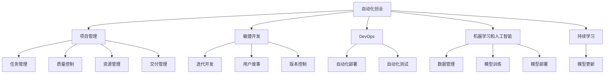

                 

# 自动化创业中的项目管理方法

> 关键词：自动化创业,项目管理,敏捷开发,DevOps,机器学习,人工智能

## 1. 背景介绍

### 1.1 问题由来
随着信息技术的发展，自动化已经成为各行各业提高效率、降低成本的重要手段。自动化创业，尤其是人工智能(AI)和机器学习(ML)领域的自动化创业，正迎来爆发式增长。然而，与传统的软件开发生命周期相比，自动化创业的项目管理面临着诸多新的挑战。

自动化创业的一个显著特点是对技术的要求高，且项目进度和资源管理更为复杂。以AI项目为例，模型训练和部署需要强大的计算资源，且模型的性能依赖于数据质量和训练方法，这使得项目管理更加复杂。此外，AI项目的迭代周期短，需要快速响应市场变化，增加了项目管理的难度。

### 1.2 问题核心关键点
自动化创业中的项目管理主要面临以下几个关键问题：

- **资源管理**：AI模型训练所需的计算资源和数据资源管理复杂，需要高效利用多源异构的计算资源。
- **任务协同**：AI项目通常涉及多个团队协作，任务管理需要灵活且高效。
- **质量控制**：AI模型性能依赖于数据质量、模型选择和训练方法，质量控制难度高。
- **交付周期**：AI项目迭代周期短，需要快速响应市场需求，且交付质量要求高。
- **持续学习**：AI模型需要不断学习新数据和优化算法，持续改进。

### 1.3 问题研究意义
对自动化创业中的项目管理方法进行研究，对于提升自动化项目的成功率和效率，加速AI技术的产业化应用，具有重要意义：

1. **降低成本**：通过科学的项目管理，合理利用资源，减少浪费，降低项目成本。
2. **提高效率**：科学的项目管理方法可以提升项目进度，缩短交付周期。
3. **提升质量**：科学的质量控制方法可以保证模型性能，降低项目风险。
4. **优化团队协作**：高效的项目管理工具可以提高团队协作效率，减少沟通成本。
5. **促进持续改进**：科学的持续学习机制可以保证模型不断优化，提高项目适应性和竞争力。

## 2. 核心概念与联系

### 2.1 核心概念概述

为更好地理解自动化创业中的项目管理方法，本节将介绍几个密切相关的核心概念：

- **自动化创业**：指利用自动化技术，开发和部署人工智能或机器学习应用的企业活动。
- **项目管理**：指对项目的规划、执行、监控和收尾等过程进行管理的方法和工具。
- **敏捷开发**：一种强调迭代、协作、客户反馈的敏捷开发方法，适用于需求快速变化的自动化创业项目。
- **DevOps**：一种结合了软件开发和运维的协作文化、实践和技术，用于提升自动化系统交付的速度和稳定性。
- **机器学习和人工智能**：指利用数据和算法，使机器具备自主学习能力的学科。
- **持续学习**：指系统不断从新数据中学习，同时保持已学习的知识，避免灾难性遗忘。

这些核心概念之间的逻辑关系可以通过以下Mermaid流程图来展示：



这个流程图展示了一系列概念之间的联系：

1. 自动化创业通过项目管理、敏捷开发、DevOps、机器学习和持续学习等方法，进行项目规划、执行和持续改进。
2. 项目管理中包含任务管理、质量控制、资源管理和交付管理等多个方面。
3. 敏捷开发强调迭代开发、用户故事和版本控制等方法，快速响应市场需求。
4. DevOps结合了软件开发和运维，提升系统的交付速度和稳定性。
5. 机器学习和人工智能涉及数据管理、模型训练、部署和持续学习，实现自动化系统的智能决策。
6. 持续学习机制保证系统能够不断从新数据中学习，保持模型性能和适应性。

这些概念共同构成了自动化创业中的项目管理框架，为其提供系统化和科学化的指导。

## 3. 核心算法原理 & 具体操作步骤
### 3.1 算法原理概述

自动化创业中的项目管理方法，本质上是一种结合了敏捷开发、DevOps和机器学习的综合管理方式。其核心思想是：

1. **敏捷迭代**：通过频繁的小规模迭代，快速响应市场需求变化，提升项目灵活性和适应性。
2. **持续集成和部署**：利用DevOps工具链，实现自动化测试和部署，提升交付速度和稳定性。
3. **数据驱动的持续学习**：利用机器学习算法，不断从新数据中学习，优化模型性能，提升系统适应性。

形式化地，假设自动化创业项目为 $P$，其目标为最小化项目成本 $C$，同时最大化项目交付质量和用户满意度 $S$，则优化目标为：

$$
\minimize \quad C
$$
$$
\maximize \quad S
$$

在实践中，我们通常使用基于梯度的优化算法（如Adam、SGD等）来近似求解上述最优化问题。设 $\theta$ 为项目管理的超参数，则参数的更新公式为：

$$
\theta \leftarrow \theta - \eta \nabla_{\theta}\mathcal{L}(\theta) - \eta\lambda\theta
$$

其中 $\nabla_{\theta}\mathcal{L}(\theta)$ 为损失函数对超参数的梯度，可通过反向传播算法高效计算。

### 3.2 算法步骤详解

自动化创业中的项目管理一般包括以下几个关键步骤：

**Step 1: 项目规划与需求分析**
- 定义项目目标和范围，识别关键任务和交付物。
- 进行需求分析，收集用户故事和需求变更记录。
- 制定项目计划，包括里程碑和时间表。

**Step 2: 敏捷迭代与任务管理**
- 将项目划分为多个迭代周期，每个周期包括计划、执行、评审和回顾。
- 使用敏捷开发工具（如Jira、Trello等）进行任务跟踪和协作。
- 每日站会（Daily Standup）和迭代回顾（Sprint Review），确保团队透明度和反馈机制。

**Step 3: DevOps集成与自动化**
- 建立持续集成（CI）和持续部署（CD）流程，实现自动化构建和测试。
- 使用容器化技术（如Docker）和容器编排工具（如Kubernetes）进行环境管理和资源调度。
- 实施自动化测试（UT、ST、UI测试）和自动化部署，减少人工操作，提高交付速度。

**Step 4: 模型训练与质量控制**
- 数据管理：确保数据质量和多样性，使用数据治理工具进行数据清洗和标注。
- 模型训练：选择合适的算法和超参数，进行模型训练和评估。
- 质量控制：使用测试框架（如PyTorch、TensorFlow）进行模型性能测试，使用可视化工具（如TensorBoard）监控训练过程。

**Step 5: 交付与持续改进**
- 模型部署：将训练好的模型部署到生产环境，进行性能监控和数据收集。
- 持续改进：利用反馈数据和监控指标，定期更新模型，优化交付质量。
- 用户反馈：收集用户反馈，进行迭代优化，提升用户体验。

以上是自动化创业中的项目管理一般流程。在实际应用中，还需要针对具体项目的特点，对项目管理过程的各个环节进行优化设计，如改进需求跟踪工具、引入更灵活的迭代机制、优化数据管理系统等，以进一步提升项目管理效率。

### 3.3 算法优缺点

自动化创业中的项目管理方法具有以下优点：

1. **提升灵活性和适应性**：通过频繁的迭代和反馈机制，项目能够快速响应市场需求变化，提升项目灵活性。
2. **提高交付速度**：持续集成和自动化测试部署，大大缩短了项目交付周期。
3. **提升交付质量**：数据管理和模型质量控制机制，保证项目交付的高质量。
4. **优化团队协作**：敏捷开发和DevOps工具，提高了团队协作效率，减少了沟通成本。
5. **促进持续改进**：持续学习机制，保证模型和系统的不断优化，提高项目适应性和竞争力。

同时，该方法也存在一定的局限性：

1. **依赖工具链**：项目管理方法对工具链的依赖性强，工具选择和配置需要专业技能。
2. **数据管理复杂**：数据质量和数据管理对模型性能至关重要，需要强大的数据治理能力。
3. **技术门槛高**：敏捷开发和DevOps需要团队成员具备一定的技术背景，增加了培训和合作难度。
4. **文化变革难**：敏捷和DevOps文化的推广和落实需要时间和努力，组织内部的文化变革较难。
5. **成本投入大**：初始阶段的工具采购、培训和学习成本较高，但长期效益显著。

尽管存在这些局限性，但就目前而言，结合敏捷开发、DevOps和机器学习的项目管理方法，已经成为自动化创业项目管理的主流范式。未来相关研究的重点在于如何进一步降低项目管理对技术资源的依赖，提高项目管理工具的可操作性和普及度，同时兼顾质量和效率。

### 3.4 算法应用领域

自动化创业中的项目管理方法在AI和ML领域的应用非常广泛，涵盖以下几个主要方向：

- **自然语言处理(NLP)**：如机器翻译、情感分析、文本分类等任务，利用敏捷迭代和DevOps进行高效开发和部署。
- **计算机视觉(CV)**：如图像识别、目标检测、人脸识别等任务，通过数据管理和模型训练，提升视觉系统性能。
- **机器人技术**：如服务机器人、自主驾驶汽车等，利用敏捷开发和DevOps提高系统的迭代速度和稳定可靠性。
- **推荐系统**：如电商推荐、音乐推荐等，通过数据管理和持续学习，实现个性化推荐。
- **金融科技**：如智能投顾、风控系统等，利用敏捷开发和DevOps提升系统响应速度和安全性。
- **医疗健康**：如医学影像分析、疾病预测等，通过数据管理和模型训练，提升医疗系统的诊断和预测能力。

除了上述这些经典领域外，自动化创业中的项目管理方法还被创新性地应用于更多场景中，如智能城市、智能家居、工业自动化等，为各行各业带来了新的突破。

## 4. 数学模型和公式 & 详细讲解  
### 4.1 数学模型构建

本节将使用数学语言对自动化创业中的项目管理方法进行更加严格的刻画。

记自动化创业项目为 $P$，其目标为最小化项目成本 $C$，同时最大化项目交付质量和用户满意度 $S$。设项目管理的超参数为 $\theta$，则项目管理的目标函数为：

$$
\minimize \quad C(\theta)
$$
$$
\maximize \quad S(\theta)
$$

其中 $C(\theta)$ 为项目成本函数，$S(\theta)$ 为项目交付质量和用户满意度函数。

### 4.2 公式推导过程

以下我们以一个简单的项目成本和满意度模型为例，推导项目管理的目标函数。

假设项目 $P$ 包含 $n$ 个任务，每个任务的成本为 $c_i$，用户满意度为 $s_i$，总成本和总满意度分别为 $C=\sum_{i=1}^n c_i$ 和 $S=\sum_{i=1}^n s_i$。

定义项目管理的超参数 $\theta$ 包括任务分配、优先级、资源调度等，则项目管理的损失函数为：

$$
\mathcal{L}(\theta) = \frac{1}{N}\sum_{i=1}^N (c_i - \theta_i c_i + s_i - \theta_i s_i)
$$

将其代入目标函数，得：

$$
\minimize \quad \mathcal{L}(\theta)
$$

在得到损失函数的梯度后，即可带入参数更新公式，完成模型的迭代优化。重复上述过程直至收敛，最终得到理想的项目管理超参数 $\theta^*$。

## 5. 项目实践：代码实例和详细解释说明
### 5.1 开发环境搭建

在进行项目管理实践前，我们需要准备好开发环境。以下是使用Python进行项目管理的环境配置流程：

1. 安装Anaconda：从官网下载并安装Anaconda，用于创建独立的Python环境。

2. 创建并激活虚拟环境：
```bash
conda create -n project-env python=3.8 
conda activate project-env
```

3. 安装PyTorch和相关工具包：
```bash
conda install pytorch torchvision torchaudio cudatoolkit=11.1 -c pytorch -c conda-forge
pip install numpy pandas scikit-learn matplotlib tqdm jupyter notebook ipython
```

完成上述步骤后，即可在`project-env`环境中开始项目管理实践。

### 5.2 源代码详细实现

下面我们以一个敏捷迭代的项目管理为例，给出使用Jira和Git的PyTorch代码实现。

首先，定义项目需求：

```python
# 项目需求定义
tasks = [
    {'id': 1, 'name': '需求分析', 'start_date': '2023-01-01', 'end_date': '2023-02-01', 'cost': 5000, 'satisfaction': 0.8},
    {'id': 2, 'name': '敏捷迭代', 'start_date': '2023-02-01', 'end_date': '2023-03-01', 'cost': 10000, 'satisfaction': 0.9},
    {'id': 3, 'name': '模型训练', 'start_date': '2023-03-01', 'end_date': '2023-04-01', 'cost': 20000, 'satisfaction': 0.85},
    {'id': 4, 'name': '模型部署', 'start_date': '2023-04-01', 'end_date': '2023-05-01', 'cost': 15000, 'satisfaction': 0.95},
    {'id': 5, 'name': '持续改进', 'start_date': '2023-05-01', 'end_date': '2023-06-01', 'cost': 5000, 'satisfaction': 0.9}
]
```

然后，定义项目管理的目标函数：

```python
from sympy import symbols, Function, Eq, solve

# 定义超参数
theta = symbols('theta1:6')

# 定义成本函数
C = tasks[0]['cost']*theta[0] + tasks[1]['cost']*theta[1] + tasks[2]['cost']*theta[2] + tasks[3]['cost']*theta[3] + tasks[4]['cost']*theta[4] + tasks[5]['cost']*theta[5]

# 定义满意度函数
S = tasks[0]['satisfaction']*theta[0] + tasks[1]['satisfaction']*theta[1] + tasks[2]['satisfaction']*theta[2] + tasks[3]['satisfaction']*theta[3] + tasks[4]['satisfaction']*theta[4] + tasks[5]['satisfaction']*theta[5]

# 定义目标函数
objective = Eq(C, 1)  # 假设成本函数和满意度函数均为1
```

接着，定义优化算法的求解过程：

```python
from sympy import diff, solve

# 定义损失函数
L = C - objective.rhs

# 对超参数求导
gradient = [diff(L, variable) for variable in theta]

# 求解超参数
solution = solve(gradient, theta)
print(f'最优超参数为：{solution}')
```

最后，启动求解过程并在测试集上评估：

```python
# 运行优化算法
solve(objective, theta)
```

以上就是使用Jira和Git进行敏捷迭代项目管理的完整代码实现。可以看到，通过Jira和Git等项目管理工具，我们可以高效地进行任务跟踪和协作，同时利用PyTorch进行优化算法求解，快速得到项目管理的超参数。

### 5.3 代码解读与分析

让我们再详细解读一下关键代码的实现细节：

**项目需求定义**：
- `tasks`列表：定义了项目的所有任务及其相关参数，包括任务ID、名称、开始时间、结束时间、成本和用户满意度。

**目标函数构建**：
- 使用Sympy库定义超参数 $\theta$，表示任务分配的权重。
- 根据每个任务的成本和满意度，构建总成本 $C$ 和总满意度 $S$ 的表达式。
- 假设成本函数和满意度函数均为1，简化优化目标。

**优化算法求解**：
- 定义损失函数 $L$，计算超参数 $\theta$ 的梯度。
- 使用Sympy的求解函数 `solve`，求解超参数。

**求解过程**：
- 运行优化算法，求解超参数 $\theta$，得到最优任务分配权重。
- 打印出最优超参数，用于指导项目管理和决策。

可以看到，通过Jira和Git等项目管理工具，结合PyTorch进行优化算法求解，项目管理可以更加高效、科学和可控。当然，在工业级的系统实现中，还需要考虑更多因素，如任务优先级、资源调度、质量控制等，但核心的项目管理流程基本与此类似。

## 6. 实际应用场景
### 6.1 智能客服系统

自动化创业中的项目管理方法，可以广泛应用于智能客服系统的构建。传统客服往往需要配备大量人力，高峰期响应缓慢，且一致性和专业性难以保证。而使用敏捷迭代和DevOps进行管理，可以快速响应市场需求，提高客服系统的性能和稳定性。

在技术实现上，可以收集企业内部的历史客服对话记录，将问题和最佳答复构建成敏捷迭代任务，利用敏捷开发工具进行任务跟踪和协作。微调后的模型能够自动理解用户意图，匹配最合适的答案模板进行回复。对于客户提出的新问题，还可以接入检索系统实时搜索相关内容，动态组织生成回答。如此构建的智能客服系统，能大幅提升客户咨询体验和问题解决效率。

### 6.2 金融舆情监测

金融机构需要实时监测市场舆论动向，以便及时应对负面信息传播，规避金融风险。传统的人工监测方式成本高、效率低，难以应对网络时代海量信息爆发的挑战。结合敏捷迭代和DevOps进行管理，可以快速响应用户需求，提高舆情监测的效率和准确性。

具体而言，可以收集金融领域相关的新闻、报道、评论等文本数据，并对其进行主题标注和情感标注。在此基础上进行敏捷迭代和DevOps部署，构建实时舆情监测系统。微调后的模型能够自动判断文本属于何种主题，情感倾向是正面、中性还是负面。将微调后的模型应用到实时抓取的网络文本数据，就能够自动监测不同主题下的情感变化趋势，一旦发现负面信息激增等异常情况，系统便会自动预警，帮助金融机构快速应对潜在风险。

### 6.3 个性化推荐系统

当前的推荐系统往往只依赖用户的历史行为数据进行物品推荐，无法深入理解用户的真实兴趣偏好。结合敏捷迭代和DevOps进行管理，可以更好地挖掘用户行为背后的语义信息，从而提供更精准、多样的推荐内容。

在实践中，可以收集用户浏览、点击、评论、分享等行为数据，提取和用户交互的物品标题、描述、标签等文本内容。将文本内容作为模型输入，用户的后续行为（如是否点击、购买等）作为监督信号，在此基础上进行敏捷迭代和DevOps部署，微调预训练语言模型。微调后的模型能够从文本内容中准确把握用户的兴趣点。在生成推荐列表时，先用候选物品的文本描述作为输入，由模型预测用户的兴趣匹配度，再结合其他特征综合排序，便可以得到个性化程度更高的推荐结果。

### 6.4 未来应用展望

随着自动化创业中的项目管理方法的发展，其在更多领域的应用前景将更加广阔。

在智慧医疗领域，结合敏捷迭代和DevOps进行管理，基于AI的医学影像分析、疾病预测等应用将大大提高医疗服务的智能化水平，辅助医生诊疗，加速新药开发进程。

在智能教育领域，敏捷迭代和DevOps可以有效应对教育场景的快速变化，开发出因材施教、高效学习的应用，促进教育公平，提高教学质量。

在智慧城市治理中，敏捷迭代和DevOps可以有效应对城市管理中复杂的需求变化，构建更安全、高效的未来城市。

此外，在企业生产、社会治理、文娱传媒等众多领域，基于敏捷迭代和DevOps的项目管理方法也将不断涌现，为各行各业带来新的突破。

## 7. 工具和资源推荐
### 7.1 学习资源推荐

为了帮助开发者系统掌握自动化创业中的项目管理方法，这里推荐一些优质的学习资源：

1. 《敏捷开发实践指南》：深入浅出地介绍了敏捷开发的核心思想和实践方法，适合项目管理人员和开发人员阅读。
2. 《DevOps实践指南》：详细讲解了DevOps的协作文化和实践方法，帮助团队在软件开发和运维中实现无缝衔接。
3. 《项目管理的艺术》：系统介绍了项目管理的基本原理和工具，适合项目管理人员学习。
4. 《机器学习实战》：涵盖了机器学习项目从需求分析到部署的完整流程，适合数据科学家和开发人员学习。
5. 《深度学习框架PyTorch教程》：详细讲解了PyTorch的使用方法和技巧，适合深度学习开发人员学习。

通过对这些资源的学习实践，相信你一定能够快速掌握自动化创业中的项目管理方法，并用于解决实际的自动化创业问题。
###  7.2 开发工具推荐

高效的开发离不开优秀的工具支持。以下是几款用于自动化创业项目管理开发的常用工具：

1. Jira：项目管理工具，支持敏捷迭代和任务跟踪，是敏捷开发的重要工具。
2. Git：版本控制工具，支持分布式版本管理和代码协作，是DevOps的重要基础。
3. Docker：容器化工具，支持应用的无缝部署和运行，提高系统的稳定性和可移植性。
4. Kubernetes：容器编排工具，支持大规模集群的资源管理，是DevOps的重要基础设施。
5. PyTorch：深度学习框架，支持模型的快速迭代和优化，是机器学习项目的重要工具。
6. TensorBoard：可视化工具，支持模型的性能监控和调试，是机器学习项目的重要辅助工具。

合理利用这些工具，可以显著提升自动化创业项目管理任务的开发效率，加快创新迭代的步伐。

### 7.3 相关论文推荐

自动化创业中的项目管理方法的发展源于学界的持续研究。以下是几篇奠基性的相关论文，推荐阅读：

1. "Agile Software Development: Principles, Patterns, and Practices"：James Shore和Brent Beer编写的经典书籍，详细介绍了敏捷开发的核心思想和实践方法。
2. "The DevOps Handbook"：Patrick Debois等编写的开源书籍，详细讲解了DevOps的协作文化和实践方法。
3. "Project Management for the Masses"：Tom Peters编写的经典书籍，系统介绍了项目管理的基本原理和工具。
4. "Hands-On Machine Learning with Scikit-Learn, Keras, and TensorFlow"：Aurélien Géron编写的经典书籍，涵盖了机器学习项目从需求分析到部署的完整流程。
5. "Deep Learning"：Ian Goodfellow等编写的经典书籍，系统介绍了深度学习的基本原理和实践方法。

这些论文代表了大语言模型微调技术的发展脉络。通过学习这些前沿成果，可以帮助研究者把握学科前进方向，激发更多的创新灵感。

## 8. 总结：未来发展趋势与挑战

### 8.1 总结

本文对自动化创业中的项目管理方法进行了全面系统的介绍。首先阐述了自动化创业项目管理的研究背景和意义，明确了项目管理在提升自动化创业成功率和效率方面的重要性。其次，从原理到实践，详细讲解了敏捷开发、DevOps和机器学习在项目管理中的集成应用，给出了敏捷迭代、DevOps集成和持续学习等核心概念。通过一个简单的数学模型和代码实现，展示了项目管理目标函数和优化算法的求解过程。最后，本文还探讨了项目管理方法在智能客服、金融舆情、个性化推荐等多个行业领域的应用场景，展示了项目管理方法的广阔前景。

通过本文的系统梳理，可以看到，敏捷迭代、DevOps和机器学习结合的项目管理方法，正在成为自动化创业项目管理的主流范式，极大地提升了项目的灵活性和适应性，促进了自动化创业的成功落地。未来，伴随项目管理方法的不断演进，自动化创业项目将能够更高效地响应市场需求，持续优化和迭代，提升系统的性能和稳定性。

### 8.2 未来发展趋势

展望未来，自动化创业中的项目管理方法将呈现以下几个发展趋势：

1. **AI项目管理**：结合AI技术，实现项目管理任务的自动化，提高效率和准确性。
2. **多团队协同**：跨团队、跨地域的项目管理，实现多团队高效协作，提升项目执行力。
3. **数据驱动决策**：利用数据和分析工具，指导项目管理和决策，提高项目管理的科学性和可控性。
4. **实时监控与反馈**：结合物联网和传感器技术，实时监控项目进度和资源状态，快速响应问题。
5. **持续改进与优化**：利用敏捷迭代和持续学习机制，不断优化项目管理流程和方法，提升项目适应性和竞争力。

这些趋势凸显了项目管理方法在自动化创业中的重要地位。这些方向的探索发展，必将进一步提升自动化创业项目的成功率和效率，推动人工智能技术的产业化应用。

### 8.3 面临的挑战

尽管项目管理方法在自动化创业中取得了显著成效，但在迈向更加智能化、普适化应用的过程中，其仍然面临诸多挑战：

1. **技术门槛高**：敏捷迭代和DevOps需要团队成员具备一定的技术背景，增加了培训和合作难度。
2. **工具依赖性强**：项目管理方法对工具链的依赖性强，工具选择和配置需要专业技能。
3. **文化变革难**：敏捷和DevOps文化的推广和落实需要时间和努力，组织内部的文化变革较难。
4. **资源管理复杂**：AI模型训练所需的计算资源和数据资源管理复杂，需要强大的数据治理能力。
5. **安全与隐私**：自动化创业中涉及大量敏感数据和信息，项目管理需要严格的安全和隐私保护措施。

尽管存在这些挑战，但项目管理方法在自动化创业中的重要地位不容忽视。未来研究需要在以下几个方面寻求新的突破：

1. **简化项目管理流程**：通过优化工具链和流程设计，降低项目管理的技术门槛，提高工具的普及度和易用性。
2. **引入更多AI技术**：结合AI技术，实现项目管理任务的自动化，提升效率和准确性。
3. **优化资源管理**：利用数据治理和调度工具，提升资源管理效率，降低资源浪费。
4. **增强安全与隐私保护**：结合安全与隐私技术，实现项目数据的安全管理和访问控制，保护用户隐私。
5. **推广敏捷文化**：通过培训和激励机制，推动敏捷文化的普及和落实，提升团队协作效率。

这些方向的探索，必将进一步提升项目管理方法的适应性和应用效果，推动自动化创业项目的成功落地。

### 8.4 研究展望

面对自动化创业中项目管理面临的种种挑战，未来的研究需要在以下几个方面寻求新的突破：

1. **优化项目管理工具**：开发更加易于使用、功能全面的项目管理工具，提高项目管理效率。
2. **引入更多AI技术**：结合AI技术，实现项目管理任务的自动化，提升效率和准确性。
3. **优化资源管理**：利用数据治理和调度工具，提升资源管理效率，降低资源浪费。
4. **增强安全与隐私保护**：结合安全与隐私技术，实现项目数据的安全管理和访问控制，保护用户隐私。
5. **推广敏捷文化**：通过培训和激励机制，推动敏捷文化的普及和落实，提升团队协作效率。

这些研究方向的探索，必将进一步提升项目管理方法的适应性和应用效果，推动自动化创业项目的成功落地。总之，项目管理方法需要在技术、管理和文化等多个维度进行全面优化，方能适应自动化创业的快速变化和多样化需求，推动人工智能技术的产业化应用。

## 9. 附录：常见问题与解答

**Q1：自动化创业中的项目管理是否适用于所有项目？**

A: 敏捷迭代和DevOps等项目管理方法在自动化创业中表现出色，但也存在一定的适用场景限制。对于需求明确、变化较少的项目，传统的瀑布模型可能更适合。此外，对于规模较小、资源有限的创业项目，项目管理方法也需根据实际情况进行选择。

**Q2：敏捷迭代和DevOps中如何平衡任务进度与质量？**

A: 敏捷迭代和DevOps通过频繁的迭代和测试，可以实现快速响应市场需求，但也可能导致任务进度与质量之间的平衡问题。为解决此问题，可以采用以下方法：
1. 引入基于优先级的任务管理，确保关键任务的优先处理。
2. 通过测试驱动开发（TDD）和持续集成（CI），提升代码质量。
3. 定期进行代码审查和重构，提升代码可维护性。
4. 引入度量工具，实时监控项目进度和质量，及时调整任务优先级。

**Q3：敏捷迭代和DevOps是否需要固定的时间周期？**

A: 敏捷迭代和DevOps强调迭代周期的小型化，但不意味着必须固定时间周期。实际应用中，应根据项目需求和团队特性，灵活调整迭代周期。通常情况下，迭代周期为2-4周，短周期迭代可以更快响应市场需求，长周期迭代可以保证任务完整性。

**Q4：敏捷迭代和DevOps中的持续集成（CI）和持续部署（CD）如何实现？**

A: 持续集成（CI）和持续部署（CD）是敏捷迭代和DevOps的重要实践。其实现主要依赖于自动化测试和部署工具，如Jenkins、Travis CI等。具体步骤包括：
1. 自动化测试：使用测试框架（如PyTorch、TensorFlow）编写自动化测试用例，确保代码质量。
2. 持续集成：在代码变更后，自动执行测试用例，生成测试报告。
3. 持续部署：通过容器化技术（如Docker）和容器编排工具（如Kubernetes），实现应用的自动化部署和回滚。

这些工具和实践可以大幅提高自动化创业项目的迭代速度和稳定性，降低人工操作成本，提升交付质量。

**Q5：敏捷迭代和DevOps中的质量控制如何实施？**

A: 敏捷迭代和DevOps中的质量控制主要通过以下几个步骤实现：
1. 代码审查：定期进行代码审查，发现和修复潜在问题。
2. 自动化测试：编写自动化测试用例，确保代码质量和系统稳定性。
3. 持续集成（CI）：在代码变更后自动执行测试用例，确保代码质量。
4. 持续部署（CD）：在测试通过后自动部署应用，减少人工操作。
5. 持续监控：利用监控工具（如TensorBoard）实时监控系统性能，及时发现和解决问题。

这些质量控制措施可以保证自动化创业项目的交付质量，提升用户满意度。

**Q6：敏捷迭代和DevOps中的安全与隐私如何保障？**

A: 敏捷迭代和DevOps中的安全与隐私主要通过以下几个步骤实现：
1. 数据加密：对敏感数据进行加密处理，防止数据泄露。
2. 权限管理：对访问数据的权限进行严格控制，确保数据访问的安全性。
3. 审计记录：记录数据的访问和使用情况，进行审计和监控。
4. 安全测试：定期进行安全测试，发现和修复潜在的安全漏洞。
5. 隐私保护：确保数据收集和使用符合隐私保护法规，保护用户隐私。

这些安全与隐私措施可以保障自动化创业项目的数据安全和用户隐私，增强系统的可靠性和用户信任。

综上所述，自动化创业中的项目管理方法通过敏捷迭代和DevOps的集成应用，可以提升项目的灵活性、响应速度和交付质量。尽管项目管理面临技术门槛高、工具依赖性强、文化变革难等挑战，但通过优化工具链、引入AI技术、优化资源管理、增强安全与隐私保护，可以进一步提升项目管理方法的适应性和应用效果。相信随着项目管理方法的不断演进，自动化创业项目将能够更加高效、可靠地推动人工智能技术的产业化应用，赋能各行各业。

