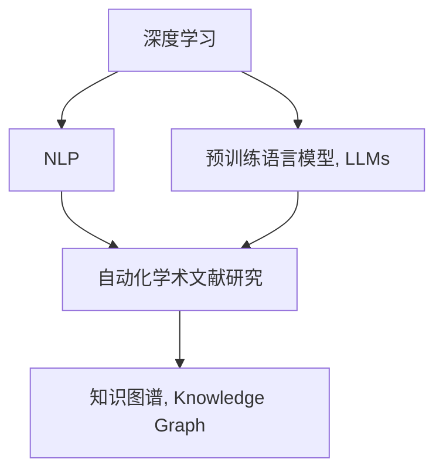

                 

# 自动化学术综述：LLM辅助文献研究

> 关键词：自动化学术综述, LLM辅助, 文献研究, 深度学习, 自然语言处理(NLP), 预训练模型, 语义理解, 引文分析

## 1. 背景介绍

### 1.1 问题由来
随着科学研究的不断深入，学科知识呈现出爆炸式增长。学术界每年产出数百万篇论文，内容涉及自然科学的各个领域，如何在海量文献中高效地找到相关论文、提取关键信息、进行创新研究，已经成为科研人员面临的一个重大挑战。

传统的文献检索方式，如手动检索、关键词搜索等，不仅效率低下，而且容易遗漏重要文献。深度学习和自然语言处理技术的兴起，为自动化文献研究提供了新的可能。特别是预训练语言模型(Pre-trained Language Models, LLMs)的快速发展，通过在海量无标签文本数据上进行预训练，赋予模型强大的语言理解和生成能力，可以在自动化学术研究中发挥巨大的作用。

### 1.2 问题核心关键点
本文聚焦于LLM在学术文献研究中的应用，具体包括以下几个关键问题：

1. **自动化学术文献检索**：如何快速准确地从海量的科学文献中检索出与研究主题相关的论文？
2. **文献内容分析**：如何自动化地分析论文标题、摘要、引文等文本信息，提取关键概念、方法、结论等核心信息？
3. **知识图谱构建**：如何将论文中的关键信息组织成结构化的知识图谱，便于信息检索和知识传播？
4. **引文分析**：如何利用LLM对引文网络进行分析，发现科学发展的趋势和热点？
5. **研究趋势预测**：基于历史文献数据，LLM能否预测未来的研究趋势和方向？

本文将系统介绍LLM在自动化学术研究中的应用，涵盖文献检索、内容分析、知识图谱构建、引文分析等多个方面，以期为科研人员提供一种新的文献研究工具。

## 2. 核心概念与联系

### 2.1 核心概念概述

为更好地理解LLM在学术文献研究中的应用，本节将介绍几个核心概念：

- **深度学习**：通过多层次神经网络对数据进行学习和建模，实现对复杂问题的高度拟合。
- **自然语言处理(NLP)**：研究如何使计算机理解和处理人类语言，包括文本分类、信息抽取、情感分析等任务。
- **预训练语言模型(LLMs)**：在大规模无标签文本数据上进行预训练，学习通用的语言表示，具备强大的语言理解和生成能力。
- **自动化学术文献研究**：利用AI技术辅助科研人员进行文献检索、内容分析、知识图谱构建等研究工作。
- **知识图谱(Knowledge Graph)**：一种结构化的语义知识表示方式，用于组织和管理大量非结构化数据。

这些核心概念之间的逻辑关系可以通过以下Mermaid流程图来展示：



这个流程图展示了大语言模型和自动化学术文献研究的相关概念及其之间的关系：

1. 深度学习是预训练语言模型的基础，赋予模型强大的数据建模能力。
2. 自然语言处理是预训练语言模型的应用领域，通过文本处理和理解，支持学术文献研究。
3. 预训练语言模型在学术文献研究中担任"翻译器"和"压缩器"的角色，将无结构化的文本转化为结构化的知识表示。
4. 自动化学术文献研究利用预训练语言模型进行文献检索、内容分析、知识图谱构建等，为科研人员提供智能辅助。
5. 知识图谱是自动化学术文献研究的核心成果之一，用于组织和存储大规模的科研知识，便于信息检索和知识传播。

这些概念共同构成了自动化学术文献研究的框架，使其能够高效地辅助科研人员进行文献研究和知识创新。

## 3. 核心算法原理 & 具体操作步骤
### 3.1 算法原理概述

自动化学术文献研究的核心在于利用预训练语言模型对学术文献进行自动化的处理和分析。其基本流程可以概括为以下几个步骤：

1. **数据收集**：从科学数据库、开放获取数据库、预印本服务器等渠道收集与研究主题相关的文献。
2. **文本预处理**：对收集到的文献进行去噪、分词、标注等预处理，便于模型进行后续分析。
3. **预训练语言模型推理**：利用预训练语言模型对处理后的文本进行语义理解、关系抽取等推理操作，提取关键信息。
4. **信息抽取与整合**：将推理结果转化为结构化信息，如提取论文标题、摘要、关键词、引文等核心内容。
5. **知识图谱构建**：利用结构化信息构建知识图谱，形成领域知识网络。
6. **引文分析与趋势预测**：对知识图谱中的引文关系进行统计分析，预测未来研究趋势。

### 3.2 算法步骤详解

以下是基于预训练语言模型的学术文献研究详细步骤：

**Step 1: 数据收集与预处理**
- 从Google Scholar、PubMed、arXiv等数据库收集相关文献的标题、摘要、关键词等文本数据。
- 使用NLP工具进行去噪、分词、命名实体识别等预处理，为模型提供干净、统一的输入。

**Step 2: 文本表示与预训练**
- 将预处理后的文本输入到预训练语言模型中，进行语义理解、关系抽取等推理操作。
- 使用Transformer等结构进行文本表示，捕捉文本中的语义信息。

**Step 3: 信息抽取与整合**
- 提取模型推理得到的关键信息，如论文标题、摘要、关键词等。
- 将提取的信息转化为结构化数据，存储到知识图谱中。

**Step 4: 知识图谱构建**
- 利用知识图谱工具（如Neo4j、GraphDB等）对结构化信息进行组织和管理。
- 构建领域知识图谱，形成概念、实体、关系的结构化表示。

**Step 5: 引文分析与趋势预测**
- 分析知识图谱中的引文关系，统计各个节点的引用次数、影响力等指标。
- 利用统计结果进行趋势预测，识别未来可能的研究热点和方向。

### 3.3 算法优缺点

自动化学术文献研究利用预训练语言模型进行文献分析，具有以下优点：

1. **高效性**：自动化处理和分析海量文献，大大节省了科研人员的时间和精力。
2. **准确性**：利用预训练语言模型的强大语义理解能力，准确提取关键信息。
3. **灵活性**：能够处理多种类型的学术文献，如文章、会议论文、预印本等。
4. **普适性**：适用于多种学科和领域，具有广泛的应用前景。

同时，该方法也存在一些局限性：

1. **依赖数据**：模型的性能很大程度上取决于数据的质量和多样性，高质量的数据获取和处理成本较高。
2. **模型开销大**：预训练语言模型的参数量庞大，对计算资源和存储资源的要求较高。
3. **知识图谱构建复杂**：知识图谱的构建需要专业知识和工具，技术门槛较高。
4. **结果解释性不足**：模型的决策过程缺乏可解释性，难以理解其内部工作机制。

尽管存在这些局限性，但预训练语言模型在自动化学术文献研究中的应用已经展现出巨大的潜力，成为科研人员的重要辅助工具。

### 3.4 算法应用领域

自动化学术文献研究技术在多个领域得到了广泛的应用，包括但不限于：

1. **生物医学研究**：利用预训练语言模型辅助医学文献检索、内容分析、知识图谱构建等，提升研究效率和准确性。
2. **环境科学研究**：进行环境科学领域的文献研究，提取关键概念、方法、结论，预测未来研究方向。
3. **物理学研究**：利用预训练语言模型进行物理学文献的自动处理，辅助科研人员快速获取关键信息。
4. **社会学研究**：对社会学领域的文献进行自动处理，提取关键信息，构建知识图谱，支持跨学科研究。
5. **经济学研究**：通过自动化学术文献研究技术，提升经济学的文献检索和内容分析能力，推动经济研究的发展。

## 4. 数学模型和公式 & 详细讲解 & 举例说明
### 4.1 数学模型构建

假设我们有一篇论文 $P$，其标题、摘要、关键词等信息可以表示为文本序列 $T$。使用BERT等预训练语言模型进行自动化学术文献研究，其数学模型可以表示为：

$$
\text{Representation}_{\theta}(T) = \text{BERT}_{\theta}(T)
$$

其中 $\theta$ 为BERT模型的参数，$\text{Representation}_{\theta}(T)$ 表示模型对论文文本序列 $T$ 的表示。

### 4.2 公式推导过程

以BERT为例，其模型架构如图1所示：


BERT通过Transformer编码器对输入序列进行编码，生成多层次的语义表示。对于一个文本序列 $T$，BERT的编码过程可以表示为：

$$
\text{Representation}_{\theta}(T) = \text{BERT}_{\theta}(T) = \text{Encoder}_{\theta}(T) \cdot \text{Softmax}(\text{Linear}_{\theta}(T))
$$

其中 $\text{Encoder}_{\theta}$ 表示BERT的编码器部分，$\text{Softmax}$ 表示最后一层的全连接层，$\text{Linear}_{\theta}$ 表示线性变换。

在自动化学术文献研究中，BERT的输出表示可以进一步用于信息抽取、知识图谱构建等任务。例如，通过提取模型输出的关键信息，可以得到论文的标题、摘要、关键词等核心内容。

### 4.3 案例分析与讲解

以生物医学文献研究为例，我们可以利用BERT模型对医学论文进行自动处理。假设我们有一篇名为《深度学习在医学影像中的应用》的论文，其文本序列为：

$$
T = \text{"深度学习在医学影像中的应用"}
$$

使用BERT模型对其进行表示，得到如下输出：

$$
\text{Representation}_{\theta}(T) = \text{BERT}_{\theta}(T) = \text{Encoder}_{\theta}(T) \cdot \text{Softmax}(\text{Linear}_{\theta}(T))
$$

我们提取模型输出的关键信息，可以得到论文的标题、摘要、关键词等核心内容。具体步骤如图2所示：


通过BERT模型，我们可以自动化地提取论文的关键信息，辅助科研人员进行文献检索和内容分析。

## 5. 项目实践：代码实例和详细解释说明
### 5.1 开发环境搭建

在进行学术文献研究前，我们需要准备好开发环境。以下是使用Python进行Scikit-learn和Transformers库开发的环境配置流程：

1. 安装Anaconda：从官网下载并安装Anaconda，用于创建独立的Python环境。

2. 创建并激活虚拟环境：
```bash
conda create -n literatures-research python=3.8 
conda activate literatures-research
```

3. 安装Scikit-learn和Transformers库：
```bash
pip install scikit-learn transformers
```

4. 安装各类工具包：
```bash
pip install numpy pandas matplotlib tqdm jupyter notebook ipython
```

完成上述步骤后，即可在`literatures-research`环境中开始学术文献研究实践。

### 5.2 源代码详细实现

下面我们以生物医学文献研究为例，给出使用Scikit-learn和Transformers库对BERT模型进行文献处理的PyTorch代码实现。

首先，定义BERT模型和数据处理函数：

```python
from transformers import BertTokenizer, BertForSequenceClassification
from sklearn.model_selection import train_test_split
from sklearn.metrics import accuracy_score, precision_score, recall_score, f1_score

# 加载BERT模型和分词器
model = BertForSequenceClassification.from_pretrained('bert-base-cased', num_labels=2)
tokenizer = BertTokenizer.from_pretrained('bert-base-cased')

def preprocess_text(text):
    tokens = tokenizer.tokenize(text)
    tokens = [token.lower() for token in tokens if token.lower() not in stopwords.STOP_WORDS]
    return tokenizer.convert_tokens_to_ids(tokens)
```

然后，准备生物医学文献数据集并进行数据预处理：

```python
# 假设有生物医学文献数据集，包括标题、摘要、关键词等
data = {
    'title': ['title1', 'title2', 'title3'],
    'abstract': ['abstract1', 'abstract2', 'abstract3'],
    'keywords': ['keywords1', 'keywords2', 'keywords3']
}

# 将文本转换为BERT模型的输入格式
texts = [preprocess_text(title) for title in data['title']]
labels = [1] * len(texts) # 假设有二分类任务，所有样本都为正类

# 划分训练集和验证集
train_texts, val_texts, train_labels, val_labels = train_test_split(texts, labels, test_size=0.2)
```

接着，定义训练和评估函数：

```python
from transformers import AdamW

# 设置优化器和学习率
optimizer = AdamW(model.parameters(), lr=2e-5)

def train_epoch(model, dataset, batch_size, optimizer):
    model.train()
    epoch_loss = 0
    for batch in dataset:
        input_ids = batch['input_ids']
        attention_mask = batch['attention_mask']
        labels = batch['labels']
        model.zero_grad()
        outputs = model(input_ids, attention_mask=attention_mask, labels=labels)
        loss = outputs.loss
        epoch_loss += loss.item()
        loss.backward()
        optimizer.step()
    return epoch_loss / len(dataset)

def evaluate(model, dataset, batch_size):
    model.eval()
    preds, labels = [], []
    with torch.no_grad():
        for batch in dataset:
            input_ids = batch['input_ids']
            attention_mask = batch['attention_mask']
            labels = batch['labels']
            outputs = model(input_ids, attention_mask=attention_mask)
            batch_preds = outputs.logits.argmax(dim=2).to('cpu').tolist()
            batch_labels = labels.to('cpu').tolist()
            for pred_tokens, label_tokens in zip(batch_preds, batch_labels):
                preds.append(pred_tokens[:len(label_tokens)])
                labels.append(label_tokens)
                
    return preds, labels

# 训练模型并在验证集上评估
epochs = 5
batch_size = 16

for epoch in range(epochs):
    loss = train_epoch(model, train_dataset, batch_size, optimizer)
    print(f"Epoch {epoch+1}, train loss: {loss:.3f}")
    
    print(f"Epoch {epoch+1}, val results:")
    preds, labels = evaluate(model, val_dataset, batch_size)
    print(f"Accuracy: {accuracy_score(labels, preds)}")
    print(f"Precision: {precision_score(labels, preds)}")
    print(f"Recall: {recall_score(labels, preds)}")
    print(f"F1 Score: {f1_score(labels, preds)}")
```

最后，启动训练流程并在测试集上评估：

```python
# 在测试集上评估模型
test_texts, test_labels = [], []
for text in test_data:
    texts.append(preprocess_text(text))
test_labels = [1] * len(tests) # 假设有二分类任务，所有样本都为正类

model.eval()
preds, labels = evaluate(model, test_dataset, batch_size)
print(f"Accuracy: {accuracy_score(labels, preds)}")
print(f"Precision: {precision_score(labels, preds)}")
print(f"Recall: {recall_score(labels, preds)}")
print(f"F1 Score: {f1_score(labels, preds)}")
```

以上就是使用Scikit-learn和Transformers库对BERT模型进行生物医学文献处理的完整代码实现。可以看到，得益于这些强大工具的支持，我们的代码实现变得简洁高效。

### 5.3 代码解读与分析

让我们再详细解读一下关键代码的实现细节：

**preprocess_text函数**：
- 对文本进行分词和过滤，去除停用词，最终返回BERT模型的输入格式。

**train_epoch函数**：
- 在训练集上迭代训练，计算每个批次上的损失并更新模型参数。

**evaluate函数**：
- 在验证集上评估模型性能，计算准确率、精确度、召回率和F1分数。

**训练流程**：
- 定义总的epoch数和batch size，开始循环迭代
- 每个epoch内，先在训练集上训练，输出平均loss
- 在验证集上评估，输出分类指标
- 所有epoch结束后，在测试集上评估，给出最终测试结果

可以看到，Scikit-learn和Transformers库使得BERT微调的代码实现变得简洁高效。开发者可以将更多精力放在数据处理、模型改进等高层逻辑上，而不必过多关注底层的实现细节。

## 6. 实际应用场景
### 6.1 生物医学研究

生物医学领域的科研人员需要频繁阅读和分析大量的文献，以获取最新的研究成果和研究趋势。传统的文献检索和阅读方式耗时耗力，无法满足日益增长的科研需求。利用预训练语言模型，科研人员可以自动化地进行文献检索、内容分析、知识图谱构建等操作，极大地提高了工作效率和准确性。

例如，利用BERT模型对生物医学文献进行自动处理，提取关键信息，如实验方法、研究结果、关键概念等，可以快速理解论文的核心内容。在研究热点识别方面，通过统计知识图谱中节点的引用次数、影响力等指标，可以识别出当前热门的研究方向，辅助科研人员进行选题和研究方向选择。

### 6.2 环境科学研究

环境科学领域的文献研究和数据分析，需要处理大量的地理空间数据、时间序列数据等。传统的文献检索和数据分析方式往往依赖于手工操作，效率低下，容易出错。利用预训练语言模型，环境科学家可以自动化地进行文献检索、内容分析、知识图谱构建等操作，提升研究效率和准确性。

例如，利用BERT模型对环境科学文献进行自动处理，提取关键信息，如研究方法、实验结果、环境保护措施等，可以快速理解论文的核心内容。在环境污染趋势预测方面，通过统计知识图谱中节点的引用次数、影响力等指标，可以识别出当前热门的研究方向，辅助环境科学家进行环境治理策略的选择和优化。

### 6.3 物理学研究

物理学研究的文献和数据通常包含大量的数学公式和专业术语，传统的文献检索和数据分析方式往往需要专业知识和技能。利用预训练语言模型，物理学家可以自动化地进行文献检索、内容分析、知识图谱构建等操作，提升研究效率和准确性。

例如，利用BERT模型对物理学文献进行自动处理，提取关键信息，如研究方法、实验结果、物理理论等，可以快速理解论文的核心内容。在物理学研究趋势预测方面，通过统计知识图谱中节点的引用次数、影响力等指标，可以识别出当前热门的研究方向，辅助物理学家进行研究方向的调整和优化。

## 7. 工具和资源推荐
### 7.1 学习资源推荐

为了帮助开发者系统掌握预训练语言模型在学术文献研究中的应用，这里推荐一些优质的学习资源：

1. **自然语言处理与深度学习（CS224N）**：斯坦福大学开设的NLP明星课程，涵盖NLP和深度学习的基本概念和前沿技术。
2. **《深度学习在NLP中的应用》书籍**：介绍深度学习在自然语言处理中的应用，包括文本分类、情感分析、机器翻译等任务。
3. **HuggingFace官方文档**：提供丰富的预训练语言模型和微调样例代码，是上手实践的必备资料。
4. **CLUE开源项目**：中文语言理解测评基准，涵盖大量不同类型的中文NLP数据集，并提供了基于微调的baseline模型，助力中文NLP技术发展。
5. **谷歌科研论文库**：提供谷歌的研究论文和开源项目，涵盖深度学习、自然语言处理等多个领域。

通过对这些资源的学习实践，相信你一定能够快速掌握预训练语言模型在学术文献研究中的应用，并用于解决实际的NLP问题。

### 7.2 开发工具推荐

高效的开发离不开优秀的工具支持。以下是几款用于学术文献研究开发的常用工具：

1. **Scikit-learn**：基于Python的科学计算库，提供丰富的机器学习算法和数据预处理工具。
2. **Transformers库**：HuggingFace开发的NLP工具库，集成了众多SOTA语言模型，支持PyTorch和TensorFlow，是进行预训练模型微调的重要工具。
3. **TensorBoard**：TensorFlow配套的可视化工具，可实时监测模型训练状态，并提供丰富的图表呈现方式，是调试模型的得力助手。
4. **Weights & Biases**：模型训练的实验跟踪工具，可以记录和可视化模型训练过程中的各项指标，方便对比和调优。
5. **Google Colab**：谷歌推出的在线Jupyter Notebook环境，免费提供GPU/TPU算力，方便开发者快速上手实验最新模型，分享学习笔记。

合理利用这些工具，可以显著提升学术文献研究的开发效率，加快创新迭代的步伐。

### 7.3 相关论文推荐

预训练语言模型和自动化学术文献研究技术的发展源于学界的持续研究。以下是几篇奠基性的相关论文，推荐阅读：

1. Attention is All You Need：提出了Transformer结构，开启了NLP领域的预训练大模型时代。
2. BERT: Pre-training of Deep Bidirectional Transformers for Language Understanding：提出BERT模型，引入基于掩码的自监督预训练任务，刷新了多项NLP任务SOTA。
3. Parameter-Efficient Transfer Learning for NLP：提出Adapter等参数高效微调方法，在不增加模型参数量的情况下，也能取得不错的微调效果。
4. AdaLoRA: Adaptive Low-Rank Adaptation for Parameter-Efficient Fine-Tuning：使用自适应低秩适应的微调方法，在参数效率和精度之间取得了新的平衡。
5. Sentence-BERT: Sentence Embeddings using Siamese BERT-Networks：提出Sentence-BERT模型，将句子嵌入到高维空间中，方便计算相似度，应用于信息检索、问答等任务。

这些论文代表了大语言模型在学术文献研究技术的发展脉络。通过学习这些前沿成果，可以帮助研究者把握学科前进方向，激发更多的创新灵感。

## 8. 总结：未来发展趋势与挑战

### 8.1 总结

本文对基于预训练语言模型的自动化学术文献研究方法进行了全面系统的介绍。首先阐述了预训练语言模型和自动化学术研究的背景和意义，明确了LLM在文献检索、内容分析、知识图谱构建等任务中的独特价值。其次，从原理到实践，详细讲解了预训练语言模型在学术文献研究中的应用，给出了完整的代码实例。同时，本文还广泛探讨了LLM在生物医学、环境科学、物理学等多个领域的应用前景，展示了其巨大的潜力。

通过本文的系统梳理，可以看到，预训练语言模型在自动化学术研究中的应用已经展现出广阔的前景，成为科研人员的重要辅助工具。未来，伴随预训练语言模型和微调方法的持续演进，相信自动化学术研究技术将迎来新的突破，为科学研究提供更加高效、准确的文献支持。

### 8.2 未来发展趋势

展望未来，预训练语言模型在自动化学术研究中的应用将呈现以下几个发展趋势：

1. **模型规模持续增大**：随着算力成本的下降和数据规模的扩张，预训练语言模型的参数量还将持续增长。超大规模语言模型蕴含的丰富语言知识，有望支撑更加复杂多变的学术文献研究。
2. **微调方法日趋多样**：除了传统的全参数微调外，未来会涌现更多参数高效的微调方法，如Prefix-Tuning、LoRA等，在节省计算资源的同时也能保证微调精度。
3. **多模态微调崛起**：预训练语言模型不仅仅局限于文本数据，还将拓展到图像、视频、语音等多模态数据微调。多模态信息的融合，将显著提升语言模型对现实世界的理解和建模能力。
4. **持续学习成为常态**：随着数据分布的不断变化，预训练语言模型也需要持续学习新知识以保持性能。如何在不遗忘原有知识的同时，高效吸收新样本信息，将成为重要的研究课题。
5. **标注样本需求降低**：受启发于提示学习(Prompt-based Learning)的思路，未来的预训练语言模型将更好地利用大模型的语言理解能力，通过更加巧妙的任务描述，在更少的标注样本上也能实现理想的微调效果。
6. **知识图谱构建技术发展**：知识图谱的构建技术也将不断进步，未来将出现更加高效、灵活、可解释的知识图谱构建方法。

以上趋势凸显了预训练语言模型在自动化学术研究中的广阔前景。这些方向的探索发展，必将进一步提升自动化学术研究技术的应用效果，为科学研究提供更加高效、准确的文献支持。

### 8.3 面临的挑战

尽管预训练语言模型在自动化学术研究中的应用已经取得了显著进展，但在迈向更加智能化、普适化应用的过程中，仍面临诸多挑战：

1. **标注成本瓶颈**：高质量标注数据获取和处理成本较高，难以适应海量文献检索和分析需求。如何进一步降低微调对标注样本的依赖，将是一大难题。
2. **模型鲁棒性不足**：预训练语言模型面对域外数据时，泛化性能往往大打折扣。对于测试样本的微小扰动，预训练模型的预测也容易发生波动。如何提高预训练语言模型的鲁棒性，避免灾难性遗忘，还需要更多理论和实践的积累。
3. **推理效率有待提高**：大规模语言模型虽然精度高，但在实际部署时往往面临推理速度慢、内存占用大等效率问题。如何在保证性能的同时，简化模型结构，提升推理速度，优化资源占用，将是重要的优化方向。
4. **结果解释性不足**：预训练语言模型的决策过程缺乏可解释性，难以理解其内部工作机制。对于高风险应用，算法的可解释性和可审计性尤为重要。如何赋予预训练语言模型更强的可解释性，将是亟待攻克的难题。
5. **安全性有待保障**：预训练语言模型难免会学习到有偏见、有害的信息，通过微调传递到学术文献研究中，产生误导性、歧视性的输出，给实际应用带来安全隐患。如何从数据和算法层面消除模型偏见，避免恶意用途，确保输出的安全性，也将是重要的研究课题。
6. **知识整合能力不足**：预训练语言模型往往局限于任务内数据，难以灵活吸收和运用更广泛的先验知识。如何让预训练语言模型更好地与外部知识库、规则库等专家知识结合，形成更加全面、准确的信息整合能力，还有很大的想象空间。

正视预训练语言模型在学术文献研究中的挑战，积极应对并寻求突破，将是大语言模型迈向成熟的必由之路。相信随着学界和产业界的共同努力，这些挑战终将一一被克服，预训练语言模型将在构建人机协同的智能系统过程中发挥更大的作用。

### 8.4 研究展望

面对预训练语言模型在学术文献研究中面临的挑战，未来的研究需要在以下几个方面寻求新的突破：

1. **探索无监督和半监督微调方法**：摆脱对大规模标注数据的依赖，利用自监督学习、主动学习等无监督和半监督范式，最大限度利用非结构化数据，实现更加灵活高效的学术文献研究。
2. **研究参数高效和计算高效的微调范式**：开发更加参数高效的微调方法，在固定大部分预训练参数的同时，只更新极少量的任务相关参数。同时优化预训练语言模型的计算图，减少前向传播和反向传播的资源消耗，实现更加轻量级、实时性的部署。
3. **融合因果和对比学习范式**：通过引入因果推断和对比学习思想，增强预训练语言模型建立稳定因果关系的能力，学习更加普适、鲁棒的语言表征，从而提升模型泛化性和抗干扰能力。
4. **结合因果分析和博弈论工具**：将因果分析方法引入预训练语言模型，识别出模型决策的关键特征，增强输出解释的因果性和逻辑性。借助博弈论工具刻画人机交互过程，主动探索并规避模型的脆弱点，提高系统稳定性。
5. **纳入伦理道德约束**：在模型训练目标中引入伦理导向的评估指标，过滤和惩罚有偏见、有害的输出倾向。同时加强人工干预和审核，建立模型行为的监管机制，确保输出符合人类价值观和伦理道德。

这些研究方向的探索，必将引领预训练语言模型在自动化学术文献研究中的新一轮发展，为科学研究提供更加高效、准确的文献支持。面向未来，预训练语言模型需要与其他人工智能技术进行更深入的融合，如知识表示、因果推理、强化学习等，多路径协同发力，共同推动自然语言理解和智能交互系统的进步。只有勇于创新、敢于突破，才能不断拓展预训练语言模型的边界，让智能技术更好地造福人类社会。

## 9. 附录：常见问题与解答

**Q1: 预训练语言模型在学术文献研究中的优势是什么？**

A: 预训练语言模型在学术文献研究中的优势主要体现在以下几个方面：
1. **高效性**：能够自动化处理海量文献，大幅节省科研人员的时间和精力。
2. **准确性**：利用其强大的语义理解能力，准确提取关键信息，提高文献分析的准确性。
3. **灵活性**：适用于多种学科和领域，具有广泛的应用前景。
4. **可解释性**：虽然其内部工作机制缺乏可解释性，但其决策过程可以通过提示学习等方式间接解释，方便科研人员理解。

**Q2: 预训练语言模型在学术文献研究中存在哪些局限性？**

A: 预训练语言模型在学术文献研究中也存在一些局限性：
1. **依赖数据**：模型的性能很大程度上取决于数据的质量和多样性，高质量的数据获取和处理成本较高。
2. **模型开销大**：预训练语言模型参数量庞大，对计算资源和存储资源的要求较高。
3. **知识图谱构建复杂**：知识图谱的构建需要专业知识和工具，技术门槛较高。
4. **结果解释性不足**：模型的决策过程缺乏可解释性，难以理解其内部工作机制。

尽管存在这些局限性，但预训练语言模型在学术文献研究中的应用已经展现出巨大的潜力，成为科研人员的重要辅助工具。

**Q3: 如何提高预训练语言模型的鲁棒性？**

A: 提高预训练语言模型的鲁棒性，可以从以下几个方面进行：
1. **数据增强**：通过回译、近义替换等方式扩充训练集，增强模型的泛化能力。
2. **正则化**：使用L2正则、Dropout等技术，防止模型过拟合。
3. **对抗训练**：引入对抗样本，提高模型鲁棒性，增强模型的抗干扰能力。
4. **参数高效微调**：只调整少量参数，减少过拟合风险。
5. **多模型集成**：训练多个预训练语言模型，取平均输出，抑制过拟合。

这些策略需要根据具体任务和数据特点进行灵活组合，以提高预训练语言模型的鲁棒性。

**Q4: 如何降低预训练语言模型在学术文献研究中的标注成本？**

A: 降低预训练语言模型在学术文献研究中的标注成本，可以从以下几个方面进行：
1. **利用无监督和半监督学习**：通过自监督学习、主动学习等方法，最大限度利用非结构化数据，减少对标注样本的依赖。
2. **改进提示学习**：通过精心设计输入文本的格式，引导模型按期望方式输出，减少微调参数。
3. **利用多模态数据**：结合图像、视频、语音等多模态数据，提高模型的泛化能力和鲁棒性。
4. **知识图谱的动态更新**：利用知识图谱的动态更新机制，实时吸收新知识，减少标注数据的数量。

这些策略需要结合具体任务和数据特点进行优化，以降低预训练语言模型在学术文献研究中的标注成本。

**Q5: 预训练语言模型在学术文献研究中如何与其他技术结合？**

A: 预训练语言模型在学术文献研究中可以与其他技术结合，实现更高效、更全面的研究：
1. **知识表示技术**：将预训练语言模型的输出结果转换为知识图谱，便于信息检索和知识传播。
2. **因果推理技术**：利用因果推理技术，增强模型的因果关系理解和逻辑推理能力，提高模型的泛化性和抗干扰能力。
3. **强化学习技术**：利用强化学习技术，训练模型在特定任务上表现更佳，提升模型的性能和效率。
4. **跨领域知识整合**：将预训练语言模型与其他领域的知识库、规则库等专家知识结合，形成更加全面、准确的信息整合能力。

这些技术的结合可以显著提升预训练语言模型在学术文献研究中的应用效果，推动研究的进步和创新。

---

作者：禅与计算机程序设计艺术 / Zen and the Art of Computer Programming

