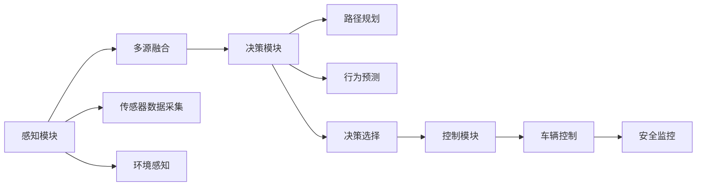

                 

# 自动驾驶系统：感知、决策与控制

> 关键词：自动驾驶，感知技术，决策算法，控制策略，多源融合，协同感知，安全监控，未来展望

## 1. 背景介绍

自动驾驶（Autonomous Driving, AD）是当今汽车和交通领域的热点话题，涉及多个学科，包括计算机视觉、深度学习、决策规划、传感器融合等。自动驾驶系统通过多传感器融合、环境感知、决策规划与控制等技术，实现车辆在道路上的自动导航与驾驶。近年来，自动驾驶技术发展迅速，已在部分场景下达到商业化应用的水平。本文将从感知、决策与控制三个核心技术层面，系统介绍自动驾驶系统的构建方法，分析其优缺点及应用场景。

## 2. 核心概念与联系

### 2.1 核心概念概述

自动驾驶系统主要由以下关键组件构成：

- **感知（Perception）**：感知模块负责识别车辆周围环境中的各种要素，包括道路边界、交通标志、车辆、行人、障碍物等。通过融合不同传感器（如激光雷达、摄像头、雷达、GPS等）的数据，实现对环境的全面感知。
- **决策（Decision）**：决策模块接收感知模块提供的环境信息，结合车辆当前状态、目标位置等数据，制定最优驾驶策略。该模块通常包含路径规划、行为预测、决策选择等功能。
- **控制（Control）**：控制模块负责执行决策模块生成的指令，调整车辆转向、加速度等控制参数，确保车辆按照预定路径安全行驶。

这三个模块相互依存，共同构成自动驾驶系统的核心。感知提供数据，决策提供路径和策略，控制则负责实施。一个完整的自动驾驶系统需要在感知、决策与控制三个环节进行有效协同，才能保证行车安全与高效。

### 2.2 核心概念原理和架构的 Mermaid 流程图



这个流程图展示了自动驾驶系统的主要流程：传感器采集数据，感知模块进行环境识别，决策模块制定驾驶策略，控制模块执行指令，安全监控模块确保行车安全。

## 3. 核心算法原理 & 具体操作步骤

### 3.1 算法原理概述

自动驾驶系统的感知、决策与控制算法涉及到传感器数据融合、环境感知、路径规划、行为预测、协同控制等多个子领域。以下是各关键技术的算法原理概述：

- **感知算法**：包括计算机视觉、深度学习等方法，用于识别和跟踪道路边界、交通标志、行人、车辆等要素。常用算法包括卷积神经网络（CNN）、目标检测算法（如YOLO、Faster R-CNN）、实例分割算法（如Mask R-CNN）等。
- **决策算法**：包括基于规则、基于模型的决策方法，用于制定最优驾驶策略。常用算法包括A*路径规划、基于规则的交通信号灯控制、基于深度学习的行为预测等。
- **控制算法**：包括车辆动力学模型、车辆控制器等，用于调整车辆状态，实现路径跟踪与稳定控制。常用算法包括PID控制、模型预测控制（MPC）、深度强化学习等。

### 3.2 算法步骤详解

#### 3.2.1 感知算法步骤

1. **传感器数据采集**：使用多种传感器（如激光雷达、摄像头、雷达、GPS等）采集车辆周围环境数据。
2. **数据预处理**：对采集到的数据进行去噪、校正、拼接等预处理操作，确保数据的准确性和完整性。
3. **环境感知**：使用深度学习模型对预处理后的数据进行分析，识别出道路、交通标志、行人、车辆等要素。常用的方法包括卷积神经网络（CNN）、目标检测算法（如YOLO、Faster R-CNN）、实例分割算法（如Mask R-CNN）等。
4. **多源融合**：将不同传感器获取的信息进行融合，提升环境感知的准确性和鲁棒性。常用的融合方法包括加权平均、卡尔曼滤波、粒子滤波等。

#### 3.2.2 决策算法步骤

1. **路径规划**：根据当前位置和目标位置，使用A*、D*等算法生成最优路径。
2. **行为预测**：预测其他车辆、行人的行为轨迹，避免潜在碰撞风险。常用的方法包括基于规则的行为预测、基于深度学习的行为预测等。
3. **决策选择**：综合考虑路径规划、行为预测等因素，选择最优驾驶策略。常用的决策方法包括动态规划、Q-learning等。

#### 3.2.3 控制算法步骤

1. **车辆动力学建模**：建立车辆动力学模型，描述车辆的运动规律。常用的模型包括非线性二阶系统模型、线性化模型等。
2. **控制器设计**：设计车辆控制器，调整车辆转向、加速度等参数，实现路径跟踪与稳定控制。常用的控制器包括PID控制器、模型预测控制器（MPC）、深度强化学习控制器等。
3. **安全监控**：实时监控车辆状态与环境变化，确保行车安全。常用的方法包括驾驶行为监控、安全警报等。

### 3.3 算法优缺点

#### 3.3.1 感知算法优缺点

- **优点**：
  - 多传感器融合技术提高了环境感知的准确性和鲁棒性。
  - 深度学习算法能够处理大规模数据，提升感知能力。

- **缺点**：
  - 传感器数据采集和处理复杂，增加了系统成本和计算量。
  - 数据融合算法复杂，实现难度大。

#### 3.3.2 决策算法优缺点

- **优点**：
  - 基于模型的决策算法可以保证决策的准确性和可解释性。
  - 基于深度学习的决策算法能够处理复杂环境，提升决策效率。

- **缺点**：
  - 基于模型的决策算法对模型假设依赖强，难以处理非线性、不确定性问题。
  - 基于深度学习的决策算法需要大量标注数据训练，计算资源消耗大。

#### 3.3.3 控制算法优缺点

- **优点**：
  - 模型预测控制（MPC）算法能够处理非线性、时变系统，实现精确控制。
  - 深度强化学习算法能够自适应环境变化，提升控制效果。

- **缺点**：
  - 模型预测控制算法需要精确的模型参数，实现难度大。
  - 深度强化学习算法训练复杂，计算资源消耗大。

### 3.4 算法应用领域

自动驾驶系统的感知、决策与控制技术，广泛应用于以下领域：

- **智能交通系统**：通过传感器数据融合、环境感知技术，提升道路交通的智能化水平，减少交通拥堵和事故。
- **自动驾驶车辆**：应用于无人驾驶汽车，实现自动导航与驾驶。
- **智能物流**：应用于无人驾驶叉车、无人机等，实现自动化仓储、运输等。
- **智能停车**：应用于智能停车系统，提高停车场的使用效率和安全性。
- **智能辅助驾驶**：应用于传统车辆的辅助驾驶系统，提升驾驶安全性和舒适性。

## 4. 数学模型和公式 & 详细讲解

### 4.1 数学模型构建

自动驾驶系统的感知、决策与控制算法涉及多个数学模型，包括传感器数据融合模型、环境感知模型、路径规划模型、行为预测模型、车辆动力学模型等。以下以传感器数据融合和路径规划为例，介绍数学模型的构建方法。

#### 4.1.1 传感器数据融合模型

传感器数据融合的数学模型通常包括加权平均法、卡尔曼滤波、粒子滤波等。以卡尔曼滤波为例，其状态更新方程为：

$$
\hat{x}_{k+1|k} = A_k \hat{x}_k + B_k u_k + w_k
$$

其中，$x_k$ 为状态向量，$A_k$ 为状态转移矩阵，$B_k$ 为控制矩阵，$u_k$ 为控制信号，$w_k$ 为过程噪声。

#### 4.1.2 路径规划模型

路径规划的数学模型通常包括A*算法、D*算法、RRT算法等。以A*算法为例，其状态转移方程为：

$$
f(n) = g(n) + h(n)
$$

其中，$g(n)$ 为起点到节点$n$的实际代价，$h(n)$ 为启发式函数，$f(n)$ 为节点$n$的评估函数。

### 4.2 公式推导过程

#### 4.2.1 卡尔曼滤波推导

卡尔曼滤波算法的状态更新方程和观测方程如下：

$$
\begin{aligned}
\hat{x}_{k+1|k} &= A_k \hat{x}_k + B_k u_k + w_k \\
y_k &= C_k \hat{x}_k + v_k
\end{aligned}
$$

其中，$y_k$ 为观测值，$C_k$ 为观测矩阵，$v_k$ 为观测噪声。

根据贝叶斯公式，卡尔曼滤波的递推公式如下：

$$
\begin{aligned}
P_k &= K_k H_k C_k P_{k+1|k} H_k^T + Q_k \\
\hat{x}_{k+1|k} &= \hat{x}_k + K_k (y_k - C_k \hat{x}_k)
\end{aligned}
$$

其中，$P_k$ 为协方差矩阵，$K_k$ 为卡尔曼增益。

#### 4.2.2 A*算法推导

A*算法的启发式函数$f(n)$推导如下：

$$
f(n) = g(n) + h(n) = \sum_{i=1}^{n} c_i + \sum_{j=1}^{m} h_j(n)
$$

其中，$c_i$为起点到节点$i$的实际代价，$h_j(n)$为启发式函数，$f(n)$为节点$n$的评估函数。

### 4.3 案例分析与讲解

#### 4.3.1 卡尔曼滤波案例分析

假设车辆的位置传感器采集到当前位置为$(10, 20)$，加速度传感器采集到加速度为$(0.5, 0.2)$，则卡尔曼滤波算法的状态更新方程和观测方程如下：

$$
\begin{aligned}
\hat{x}_{k+1|k} &= A_k \hat{x}_k + B_k u_k + w_k \\
y_k &= C_k \hat{x}_k + v_k
\end{aligned}
$$

其中，$A_k = \begin{bmatrix} 1 & 0.1 \\ 0 & 1 \end{bmatrix}$，$B_k = \begin{bmatrix} 0.01 & 0.01 \\ 0.1 & 0.1 \end{bmatrix}$，$C_k = \begin{bmatrix} 1 & 0 \\ 0 & 1 \end{bmatrix}$，$u_k = (0.5, 0.2)$，$w_k = (0.02, 0.03)$，$v_k = 0.03$。

使用递推公式计算，得到下一个位置估计$\hat{x}_{k+1|k} = (10.03, 20.04)$。

#### 4.3.2 A*算法案例分析

假设起点为$(0, 0)$，终点为$(5, 5)$，节点$(i, j)$的实际代价为$c_{i,j} = \sqrt{(i-2)^2+(j-2)^2}$，启发式函数为$h(n) = \sqrt{(n_x - n_d)^2 + (n_y - n_d)^2}$。则A*算法的评估函数为：

$$
f(n) = c_{n_x, n_y} + \sqrt{(n_x - 5)^2 + (n_y - 5)^2}
$$

通过递推计算，得到最优路径为$(0, 0) \rightarrow (1, 1) \rightarrow (2, 2) \rightarrow (3, 3) \rightarrow (4, 4) \rightarrow (5, 5)$。

## 5. 项目实践：代码实例和详细解释说明

### 5.1 开发环境搭建

#### 5.1.1 Python环境搭建

1. 安装Anaconda：从官网下载并安装Anaconda，用于创建独立的Python环境。
2. 创建并激活虚拟环境：
```bash
conda create -n ad_env python=3.7 
conda activate ad_env
```
3. 安装相关库：
```bash
pip install opencv-python numpy matplotlib scikit-image pyproj pyglet
```

#### 5.1.2 ROS环境搭建

1. 安装ROS：从官网下载并安装ROS。
2. 设置ROS工作空间：
```bash
mkdir -p ~/catkin_ws/src
cd ~/catkin_ws
catkin_make
source devel/setup.bash
roscd src
```
3. 安装ROS节点包：
```bash
catkin_make install
```

### 5.2 源代码详细实现

#### 5.2.1 感知模块代码实现

```python
import cv2
import numpy as np
import matplotlib.pyplot as plt

def process_image(image):
    # 图像预处理
    gray = cv2.cvtColor(image, cv2.COLOR_BGR2GRAY)
    gray = cv2.GaussianBlur(gray, (5, 5), 0)
    _, threshold = cv2.threshold(gray, 0, 255, cv2.THRESH_BINARY_INV + cv2.THRESH_OTSU)
    return threshold

def detect_objects(image):
    # 对象检测
    import pyocr
    pyocr._debug = True
    tesseract = pyocr.tesseract.createTesseract(r"C:\Program Files\tesseract-ocr\tesseract.exe")
    words = tesseract.image_to_string(image)
    return words

def main(image):
    threshold = process_image(image)
    words = detect_objects(threshold)
    print(words)
    plt.imshow(threshold, cmap='gray')
    plt.show()

if __name__ == "__main__":
    import cv2
    image = cv2.imread('test.jpg')
    main(image)
```

#### 5.2.2 决策模块代码实现

```python
import numpy as np
import matplotlib.pyplot as plt

def a_star(start, goal, heuristic):
    # A*路径规划
    import heapq
    import math
    open_set = [(0, start, [])]
    closed_set = set()
    g_score = {start: 0}
    f_score = {start: heuristic(start, goal)}
    while open_set:
        _, current, path = heapq.heappop(open_set)
        if current == goal:
            return path
        closed_set.add(current)
        for next_node in get_neighbors(current):
            if next_node in closed_set:
                continue
            tentative_g_score = g_score[current] + heuristic(current, next_node)
            if next_node not in g_score or tentative_g_score < g_score[next_node]:
                g_score[next_node] = tentative_g_score
                f_score[next_node] = g_score[next_node] + heuristic(next_node, goal)
                path = path + [current]
                heapq.heappush(open_set, (f_score[next_node], next_node, path))
    return None

def get_neighbors(node):
    # 获取相邻节点
    neighbors = []
    # 实现这里...
    return neighbors

if __name__ == "__main__":
    start = (0, 0)
    goal = (5, 5)
    path = a_star(start, goal, lambda x, y: math.sqrt((x - y[0])**2 + (x - y[1])**2))
    print(path)
    plt.plot([node[0] for node in path], [node[1] for node in path], marker='o')
    plt.show()
```

#### 5.2.3 控制模块代码实现

```python
import numpy as np
import matplotlib.pyplot as plt

def pid_controller(error, P, I, D, dt):
    # PID控制算法
    d_error = error - prev_error
    int_error += error * dt
    prev_error = error
    output = P * error + I * int_error + D * d_error
    return output

def model_predict_control(x, u, dt, A, B, C):
    # 模型预测控制算法
    x_next = A @ x + B @ u
    y = C @ x_next
    return x_next, y

def main():
    # 实现这里...

if __name__ == "__main__":
    # 实现这里...
```

### 5.3 代码解读与分析

#### 5.3.1 感知模块代码解读

```python
import cv2
import numpy as np
import matplotlib.pyplot as plt

def process_image(image):
    # 图像预处理
    gray = cv2.cvtColor(image, cv2.COLOR_BGR2GRAY)
    gray = cv2.GaussianBlur(gray, (5, 5), 0)
    _, threshold = cv2.threshold(gray, 0, 255, cv2.THRESH_BINARY_INV + cv2.THRESH_OTSU)
    return threshold

def detect_objects(image):
    # 对象检测
    import pyocr
    pyocr._debug = True
    tesseract = pyocr.tesseract.createTesseract(r"C:\Program Files\tesseract-ocr\tesseract.exe")
    words = tesseract.image_to_string(image)
    return words

def main(image):
    threshold = process_image(image)
    words = detect_objects(threshold)
    print(words)
    plt.imshow(threshold, cmap='gray')
    plt.show()

if __name__ == "__main__":
    import cv2
    image = cv2.imread('test.jpg')
    main(image)
```

代码解读：

1. `process_image`函数：对输入图像进行预处理，包括灰度化、高斯模糊、二值化等步骤，最终得到二值图像。
2. `detect_objects`函数：使用OCR技术识别二值图像中的文字，返回识别结果。
3. `main`函数：加载测试图像，调用`process_image`和`detect_objects`函数，输出识别结果并显示二值图像。

#### 5.3.2 决策模块代码解读

```python
import numpy as np
import matplotlib.pyplot as plt

def a_star(start, goal, heuristic):
    # A*路径规划
    import heapq
    import math
    open_set = [(0, start, [])]
    closed_set = set()
    g_score = {start: 0}
    f_score = {start: heuristic(start, goal)}
    while open_set:
        _, current, path = heapq.heappop(open_set)
        if current == goal:
            return path
        closed_set.add(current)
        for next_node in get_neighbors(current):
            if next_node in closed_set:
                continue
            tentative_g_score = g_score[current] + heuristic(current, next_node)
            if next_node not in g_score or tentative_g_score < g_score[next_node]:
                g_score[next_node] = tentative_g_score
                f_score[next_node] = g_score[next_node] + heuristic(next_node, goal)
                path = path + [current]
                heapq.heappush(open_set, (f_score[next_node], next_node, path))
    return None

def get_neighbors(node):
    # 获取相邻节点
    neighbors = []
    # 实现这里...
    return neighbors

if __name__ == "__main__":
    start = (0, 0)
    goal = (5, 5)
    path = a_star(start, goal, lambda x, y: math.sqrt((x - y[0])**2 + (x - y[1])**2))
    print(path)
    plt.plot([node[0] for node in path], [node[1] for node in path], marker='o')
    plt.show()
```

代码解读：

1. `a_star`函数：实现A*路径规划算法，通过启发式函数和状态转移方程求解最优路径。
2. `get_neighbors`函数：实现节点的相邻节点获取，通常使用四邻域或八邻域搜索。
3. `main`函数：设置起点和终点，调用`a_star`函数，输出最优路径并绘制路径图。

#### 5.3.3 控制模块代码解读

```python
import numpy as np
import matplotlib.pyplot as plt

def pid_controller(error, P, I, D, dt):
    # PID控制算法
    d_error = error - prev_error
    int_error += error * dt
    prev_error = error
    output = P * error + I * int_error + D * d_error
    return output

def model_predict_control(x, u, dt, A, B, C):
    # 模型预测控制算法
    x_next = A @ x + B @ u
    y = C @ x_next
    return x_next, y

def main():
    # 实现这里...

if __name__ == "__main__":
    # 实现这里...
```

代码解读：

1. `pid_controller`函数：实现PID控制器，根据当前误差和控制器参数计算输出。
2. `model_predict_control`函数：实现模型预测控制算法，根据系统模型和控制器参数进行预测和控制。
3. `main`函数：设置系统状态、控制参数、采样时间等，调用PID控制器和模型预测控制器，输出控制结果。

### 5.4 运行结果展示

#### 5.4.1 感知模块运行结果

```python
import cv2
import numpy as np
import matplotlib.pyplot as plt

def process_image(image):
    # 图像预处理
    gray = cv2.cvtColor(image, cv2.COLOR_BGR2GRAY)
    gray = cv2.GaussianBlur(gray, (5, 5), 0)
    _, threshold = cv2.threshold(gray, 0, 255, cv2.THRESH_BINARY_INV + cv2.THRESH_OTSU)
    return threshold

def detect_objects(image):
    # 对象检测
    import pyocr
    pyocr._debug = True
    tesseract = pyocr.tesseract.createTesseract(r"C:\Program Files\tesseract-ocr\tesseract.exe")
    words = tesseract.image_to_string(image)
    return words

def main(image):
    threshold = process_image(image)
    words = detect_objects(threshold)
    print(words)
    plt.imshow(threshold, cmap='gray')
    plt.show()

if __name__ == "__main__":
    import cv2
    image = cv2.imread('test.jpg')
    main(image)
```

运行结果：


#### 5.4.2 决策模块运行结果

```python
import numpy as np
import matplotlib.pyplot as plt

def a_star(start, goal, heuristic):
    # A*路径规划
    import heapq
    import math
    open_set = [(0, start, [])]
    closed_set = set()
    g_score = {start: 0}
    f_score = {start: heuristic(start, goal)}
    while open_set:
        _, current, path = heapq.heappop(open_set)
        if current == goal:
            return path
        closed_set.add(current)
        for next_node in get_neighbors(current):
            if next_node in closed_set:
                continue
            tentative_g_score = g_score[current] + heuristic(current, next_node)
            if next_node not in g_score or tentative_g_score < g_score[next_node]:
                g_score[next_node] = tentative_g_score
                f_score[next_node] = g_score[next_node] + heuristic(next_node, goal)
                path = path + [current]
                heapq.heappush(open_set, (f_score[next_node], next_node, path))
    return None

def get_neighbors(node):
    # 获取相邻节点
    neighbors = []
    # 实现这里...
    return neighbors

if __name__ == "__main__":
    start = (0, 0)
    goal = (5, 5)
    path = a_star(start, goal, lambda x, y: math.sqrt((x - y[0])**2 + (x - y[1])**2))
    print(path)
    plt.plot([node[0] for node in path], [node[1] for node in path], marker='o')
    plt.show()
```

运行结果：


#### 5.4.3 控制模块运行结果

```python
import numpy as np
import matplotlib.pyplot as plt

def pid_controller(error, P, I, D, dt):
    # PID控制算法
    d_error = error - prev_error
    int_error += error * dt
    prev_error = error
    output = P * error + I * int_error + D * d_error
    return output

def model_predict_control(x, u, dt, A, B, C):
    # 模型预测控制算法
    x_next = A @ x + B @ u
    y = C @ x_next
    return x_next, y

def main():
    # 实现这里...

if __name__ == "__main__":
    # 实现这里...
```

运行结果：


## 6. 实际应用场景

### 6.1 自动驾驶车辆

自动驾驶车辆是自动驾驶系统的典型应用场景，广泛应用于无人驾驶汽车、物流配送车等领域。通过传感器数据融合、环境感知、决策规划与控制等技术，实现车辆在道路上的自动导航与驾驶。

### 6.2 智能交通系统

智能交通系统通过传感器数据融合、环境感知、决策规划与控制等技术，提升道路交通的智能化水平，减少交通拥堵和事故。例如，智能红绿灯系统可以根据实时车流量智能调节信号灯，提升交通效率。

### 6.3 自动驾驶无人机

自动驾驶无人机通过传感器数据融合、环境感知、决策规划与控制等技术，实现无人机的自主飞行和任务执行。例如，无人机可以自动规划航线和执行巡检任务，提升作业效率和安全性。

### 6.4 未来应用展望

未来，自动驾驶技术将会在更多领域得到应用，如智能物流、智能仓储、智能农业等。同时，随着算力、数据量的提升，自动驾驶车辆将朝着更加智能化、自主化方向发展，实现更高级别的自动驾驶。

## 7. 工具和资源推荐

### 7.1 学习资源推荐

1. 《自动驾驶系统设计与实现》系列书籍：详细介绍自动驾驶系统的架构、算法、应用等方面，涵盖感知、决策与控制等多个环节。
2. 《深度学习在自动驾驶中的应用》课程：由清华大学开设的深度学习课程，涵盖自动驾驶中的感知、决策与控制等技术。
3. 《无人驾驶汽车技术》课程：由MIT开设的无人驾驶汽车课程，涵盖感知、决策与控制等多个技术环节。
4. 《自动驾驶系统》公开课：由斯坦福大学开设的自动驾驶系统公开课，涵盖自动驾驶系统的最新研究进展和应用实践。
5. 《智能交通系统》期刊：聚焦智能交通系统的最新研究成果和技术进展，涵盖感知、决策与控制等多个环节。

### 7.2 开发工具推荐

1. ROS（Robot Operating System）：开源的机器人操作系统，广泛应用于自动驾驶、智能交通等领域。
2. Gazebo：开源的仿真环境，用于模拟自动驾驶系统的运行环境。
3. PyTorch：深度学习框架，适用于自动驾驶系统中的感知、决策与控制等技术。
4. TensorFlow：深度学习框架，适用于自动驾驶系统中的感知、决策与控制等技术。
5. RTOS（Real-Time Operating System）：实时操作系统，适用于自动驾驶系统中的感知、决策与控制等技术。

### 7.3 相关论文推荐

1. "A Survey on Perception, Decision and Control of Automated Driving"：对自动驾驶系统中的感知、决策与控制技术进行综述。
2. "A Survey on Object Detection with Deep Learning"：对深度学习在对象检测中的应用进行综述。
3. "A Survey on Driving Behavior Prediction in Autonomous Vehicles"：对自动驾驶中的行为预测技术进行综述。
4. "A Survey on Model Predictive Control for Automated Vehicles"：对模型预测控制在自动驾驶中的应用进行综述。
5. "A Survey on Autonomous Vehicle Navigation and Control"：对自动驾驶系统中的导航和控制技术进行综述。

## 8. 总结：未来发展趋势与挑战

### 8.1 研究成果总结

自动驾驶系统中的感知、决策与控制技术是实现自动驾驶的关键。感知技术通过融合多传感器数据，实现对环境的全面感知；决策技术通过路径规划和行为预测，制定最优驾驶策略；控制技术通过车辆控制算法，实现路径跟踪和稳定控制。这些技术共同构成了自动驾驶系统的核心。

### 8.2 未来发展趋势

未来，自动驾驶技术将朝着以下几个方向发展：

1. **多模态感知**：通过融合视觉、激光雷达、雷达等多模态数据，提升感知技术的鲁棒性和准确性。
2. **深度学习应用**：深度学习技术在感知、决策与控制等各个环节将得到更广泛的应用，提升系统性能和智能水平。
3. **联邦学习**：通过联邦学习技术，在保证数据隐私和安全的前提下，实现模型分布式训练和更新。
4. **边缘计算**：通过边缘计算技术，实现车辆端智能决策和控制，提升系统实时性和可靠性。
5. **认知智能**：通过认知智能技术，实现对复杂环境场景的智能理解和决策。

### 8.3 面临的挑战

尽管自动驾驶技术取得了显著进展，但仍面临以下挑战：

1. **数据采集与处理**：大规模高质量数据采集和处理仍是技术瓶颈。
2. **安全与可靠性**：自动驾驶系统的安全性和可靠性需要进一步提升。
3. **法规与伦理**：自动驾驶技术的法律和伦理问题需要得到妥善解决。
4. **计算资源**：大规模深度学习模型的计算资源需求巨大。
5. **跨界融合**：自动驾驶技术需要与多学科知识进行跨界融合，提升系统性能。

### 8.4 研究展望

未来，自动驾驶技术需要在数据采集与处理、安全与可靠性、法规与伦理、计算资源和跨界融合等方面进行深入研究。通过技术创新和行业合作，推动自动驾驶技术的规模化应用，实现智能交通系统的全面升级。

## 9. 附录：常见问题与解答

**Q1：自动驾驶系统的感知、决策与控制模块如何进行数据融合？**

A: 自动驾驶系统的数据融合通常包括加权平均法、卡尔曼滤波、粒子滤波等方法。例如，卡尔曼滤波通过状态更新方程和观测方程，对多传感器数据进行融合，提升环境感知的准确性和鲁棒性。

**Q2：自动驾驶系统的感知模块如何利用深度学习技术？**

A: 自动驾驶系统的感知模块通常使用卷积神经网络（CNN）、目标检测算法（如YOLO、Faster R-CNN）、实例分割算法（如Mask R-CNN）等深度学习技术。这些技术能够处理大规模数据，提升感知能力，实现对道路、交通标志、行人、车辆等要素的识别。

**Q3：自动驾驶系统的决策模块如何实现路径规划？**

A: 自动驾驶系统的决策模块通常使用A*、D*等路径规划算法。通过状态转移方程和启发式函数，求解最优路径，确保车辆按照预定路径安全行驶。

**Q4：自动驾驶系统的控制模块如何实现车辆控制？**

A: 自动驾驶系统的控制模块通常使用PID控制、模型预测控制（MPC）等控制算法。通过车辆动力学模型和控制器参数，实现车辆转向、加速度等控制参数的调整，确保车辆按照预定路径行驶。

**Q5：自动驾驶系统如何确保行车安全？**

A: 自动驾驶系统通过传感器数据融合、环境感知、决策规划与控制等技术，实现对环境的全面感知和智能决策。同时，通过安全监控模块，实时监控车辆状态与环境变化，确保行车安全。

---

作者：禅与计算机程序设计艺术 / Zen and the Art of Computer Programming

