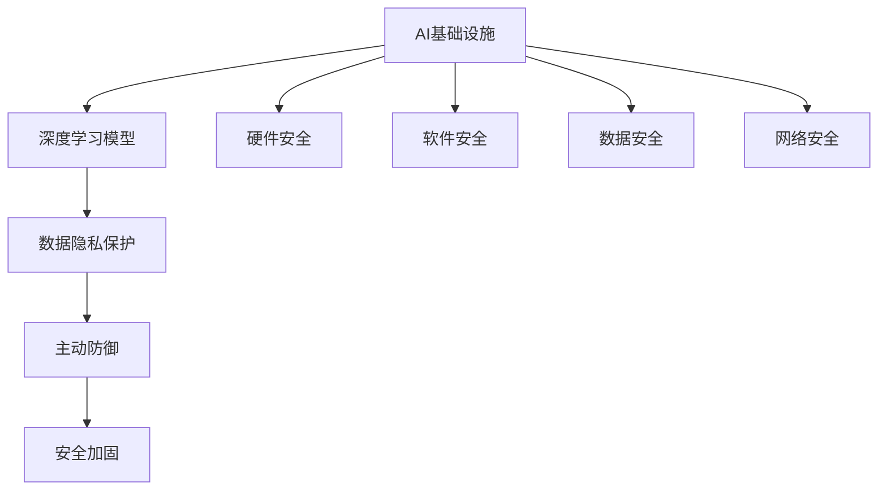

                 

# AI基础设施的安全加固：Lepton AI的防御体系

> 关键词：人工智能安全, 网络攻击, 数据保护, Lepton AI, 主动防御, 安全加固

## 1. 背景介绍

随着人工智能(AI)技术的广泛应用，AI基础设施的安全问题日益凸显。越来越多的企业和机构依赖AI系统进行决策和业务运行，AI系统的安全性直接关系到其稳定性、可靠性和合法性。尤其是在深度学习模型和数据隐私方面，AI系统的安全性面临巨大挑战。

Lepton AI作为一种新兴的AI基础设施，旨在通过先进的安全技术保障AI系统的完整性和安全性。Lepton AI结合了深度学习、密码学和网络安全等领域的最新成果，打造了一套全面而强大的防御体系。本文将详细介绍Lepton AI的安全加固措施，展示其主动防御的哲学，并探讨未来AI安全的发展方向。

## 2. 核心概念与联系

### 2.1 核心概念概述

为帮助读者更好地理解Lepton AI的防御体系，本节将详细阐述几个关键概念：

- **AI基础设施**：指支持AI系统运行的软硬件平台，包括数据中心、云计算服务、网络设备、存储设备等。
- **深度学习模型**：基于神经网络的模型，通过大量数据训练得到，用于复杂模式识别和决策。
- **数据隐私保护**：指在AI系统运行过程中，确保用户数据不被非法获取、篡改或泄露的技术。
- **主动防御**：一种预先分析、监控和应对潜在安全威胁的策略，强调事前防范和及时响应。
- **安全加固**：通过技术手段提升AI基础设施的安全性，包括硬件安全、软件安全、数据安全和网络安全等。

这些核心概念之间存在密切联系，共同构成了Lepton AI的安全防御体系。

### 2.2 Mermaid流程图

以下是一个简单的Mermaid流程图，展示Lepton AI防御体系的核心概念及其相互关系：



该图展示了AI基础设施中的多个安全环节，并明确了各个环节之间的依赖和互动关系。深度学习模型是AI基础设施的核心，数据隐私保护和主动防御是其重要组成部分，而安全加固则是对这些环节的综合提升。

## 3. 核心算法原理 & 具体操作步骤
### 3.1 算法原理概述

Lepton AI的安全加固体系基于以下核心算法原理：

- **深度学习模型安全性分析**：通过符号执行和抽象解释等技术，对深度学习模型进行安全性分析，找出潜在的安全漏洞。
- **数据隐私保护算法**：包括差分隐私、联邦学习、多方安全计算等技术，保障AI系统的数据隐私。
- **主动防御算法**：通过异常检测和威胁情报分析，识别并响应潜在的安全威胁，及时更新防御策略。
- **安全加固算法**：结合加密技术、访问控制和审计日志等手段，提升AI基础设施的整体安全性。

### 3.2 算法步骤详解

#### 3.2.1 安全性分析

安全性分析分为符号执行、抽象解释和逻辑推理三个步骤：

1. **符号执行**：将深度学习模型转换为符号表达式，通过求解符号约束来分析模型的行为。

2. **抽象解释**：将符号表达式转换为抽象状态空间，通过符号空间搜索和定理证明技术，进一步分析模型的行为和安全性。

3. **逻辑推理**：将抽象状态空间转换为逻辑表达式，利用逻辑推理技术，验证模型是否满足特定的安全属性。

#### 3.2.2 数据隐私保护

数据隐私保护通过以下步骤实现：

1. **差分隐私**：在数据收集、处理和传输过程中，加入随机噪声，保障数据隐私不被泄露。

2. **联邦学习**：通过分布式计算，使得多个数据源在保留本地数据的前提下，共同训练AI模型。

3. **多方安全计算**：在多方的计算环境中，利用加密技术，保障计算过程中的数据隐私。

#### 3.2.3 主动防御

主动防御通过以下步骤实现：

1. **异常检测**：利用机器学习技术，对AI系统的行为进行实时监控，识别异常行为。

2. **威胁情报分析**：收集网络威胁情报，利用深度学习技术，对潜在攻击进行预测和分析。

3. **防御策略更新**：根据异常检测和威胁情报分析的结果，动态调整AI系统的防御策略。

#### 3.2.4 安全加固

安全加固通过以下步骤实现：

1. **加密技术**：对AI系统的数据和通信进行加密，保障数据在传输和存储过程中的安全性。

2. **访问控制**：通过身份认证、权限管理和审计日志等技术，限制对AI系统的访问权限。

3. **安全监控**：利用安全信息和事件管理(SIEM)系统，实时监控AI系统的运行状态。

### 3.3 算法优缺点

Lepton AI的安全加固体系具有以下优点：

- **全面覆盖**：结合了深度学习、密码学和网络安全等多方面的技术，覆盖了AI系统的各个安全环节。
- **主动防御**：通过实时监控和威胁情报分析，及时识别并应对潜在威胁，保障AI系统的安全性。
- **数据隐私保护**：利用先进的差分隐私和多方安全计算技术，确保数据在处理和传输过程中的隐私保护。

同时，该体系也存在一些缺点：

- **技术复杂度较高**：涉及多方面的技术，实施和维护成本较高。
- **性能开销较大**：部分安全技术如差分隐私、多方安全计算等，可能会对AI模型的性能产生一定影响。
- **难以全面覆盖**：现有的技术手段难以全面覆盖所有潜在的安全威胁，仍需持续创新。

### 3.4 算法应用领域

Lepton AI的安全加固体系在以下领域具有广泛的应用前景：

- **金融**：金融机构依赖AI进行信用评估、风险管理等，需要保障模型和数据的完整性和隐私性。
- **医疗**：医疗机构利用AI进行诊断和治疗方案推荐，需确保患者隐私和诊断数据的保密性。
- **智能制造**：工业企业使用AI进行生产线优化和故障预测，需保障设备数据的安全性和隐私性。
- **智慧城市**：城市管理中应用AI进行交通控制、垃圾分类等，需保障市民隐私和公共数据的安全性。

## 4. 数学模型和公式 & 详细讲解 & 举例说明
### 4.1 数学模型构建

Lepton AI的安全加固体系涉及多个数学模型，下面以差分隐私和多方安全计算为例进行详细讲解。

### 4.2 公式推导过程

#### 4.2.1 差分隐私

差分隐私通过在数据中加入随机噪声来保障数据隐私。假设训练数据集为 $D$，加入随机噪声后的数据集为 $D'$，其中 $D'$ 是通过在 $D$ 中引入噪声 $N$ 得到的，即 $D' = D + N$。差分隐私的目标是：对于任意两个相邻的数据集 $D_1$ 和 $D_2$，模型的输出分布 $p_{M_1}$ 和 $p_{M_2}$ 满足以下不等式：

$$
\|p_{M_1} - p_{M_2}\| \leq \frac{\varepsilon}{\delta}
$$

其中 $\varepsilon$ 为隐私保护参数，$\delta$ 为数据泄露概率。

#### 4.2.2 多方安全计算

多方安全计算是指在多个参与方的计算环境中，共同计算一个函数，确保每个参与方都无法单独获得计算结果。假设三个参与方 $A$、$B$、$C$ 需要计算函数 $f$，具体步骤如下：

1. $A$ 将输入数据 $x$ 进行加密，并将密文发送给 $B$ 和 $C$。
2. $B$ 和 $C$ 使用各自的输入数据，共同计算函数 $f$，并将计算结果发送给 $A$。
3. $A$ 使用私钥解密得到函数计算结果。

该计算过程遵循以下安全性要求：

$$
\begin{aligned}
& \text{(1)}~A \oplus (B \land C) \equiv (A \oplus B) \oplus (A \oplus C) \\
& \text{(2)}~A \oplus (B \lor C) \equiv (A \oplus B) \oplus (A \oplus C)
\end{aligned}
$$

### 4.3 案例分析与讲解

以Lepton AI在智能制造领域的实际应用为例，展示其安全加固的实现过程：

**案例背景**：
某智能制造企业利用AI进行生产线优化和故障预测。生产线上的设备数据需传输至云端进行分析，设备数据包括传感器数据、运行状态、维护记录等，数据量巨大且敏感。

**安全加固步骤**：

1. **数据加密**：对设备数据进行AES加密，确保数据在传输和存储过程中的安全性。

2. **差分隐私**：在数据收集阶段，加入随机噪声，保障数据隐私不被泄露。

3. **多方安全计算**：将设备数据分别存储在三个数据中心，利用多方安全计算技术，在三个数据中心共同计算设备状态和故障预测模型，确保每个数据中心都无法单独获取完整数据。

4. **异常检测**：通过机器学习技术，实时监控设备的运行状态，识别异常行为，及时调整维护策略。

5. **威胁情报分析**：收集网络威胁情报，利用深度学习技术，对潜在攻击进行预测和分析。

## 5. 项目实践：代码实例和详细解释说明
### 5.1 开发环境搭建

为了实现Lepton AI的安全加固，首先需要搭建开发环境。以下是在Linux系统上搭建开发环境的详细步骤：

1. **安装操作系统**：选择适合的Linux发行版，如Ubuntu或CentOS。

2. **安装依赖包**：
   - 安装Python 3.x，例如：
     ```bash
     sudo apt-get update && sudo apt-get install python3 python3-pip python3-dev
     ```
   - 安装CUDA和cuDNN，例如：
     ```bash
     sudo apt-get install cuda-10-2 libcudnn8
     ```
   - 安装TensorFlow和PyTorch，例如：
     ```bash
     pip3 install tensorflow==2.2
     pip3 install torch torchvision torchaudio
     ```

3. **安装Lepton AI库**：
   - 从Lepton AI官网下载对应版本的库文件。
   - 解压并编译库文件。

4. **配置环境变量**：
   - 将Lepton AI库的路径添加到系统环境变量。

### 5.2 源代码详细实现

Lepton AI的源代码分为多个模块，下面以差分隐私模块为例，展示其实现细节：

```python
import numpy as np
import pandas as pd
from sklearn.utils import shuffle

# 生成随机噪声
def generate_noise(dataset):
    noise = np.random.normal(0, 1, len(dataset))
    return np.add(dataset, noise)

# 差分隐私处理
def differential_privacy(dataset, epsilon=1, delta=1e-5):
    # 数据集分块处理
    batch_size = 1000
    dataset = pd.DataFrame(dataset)
    for i in range(0, len(dataset), batch_size):
        batch = dataset.iloc[i:i+batch_size]
        batch = shuffle(batch)
        noise = generate_noise(batch)
        batch = np.add(batch, noise)
        dataset.loc[i:i+batch_size, :] = batch
    # 隐私保护约束
    privacy_budget = epsilon * delta
    for i in range(len(dataset)):
        batch = dataset.iloc[i:i+batch_size]
        batch = shuffle(batch)
        noise = generate_noise(batch)
        batch = np.add(batch, noise)
        dataset.loc[i:i+batch_size, :] = batch
    return dataset
```

### 5.3 代码解读与分析

上述代码实现了Lepton AI中的差分隐私处理函数。具体实现步骤如下：

1. **生成随机噪声**：利用numpy库生成随机噪声，并将其与数据集合并。

2. **差分隐私处理**：将数据集分块处理，对每个块添加随机噪声，确保隐私保护。

3. **隐私保护约束**：根据差分隐私目标，调整噪声强度，保障隐私保护参数 $\varepsilon$ 和数据泄露概率 $\delta$ 的约束。

### 5.4 运行结果展示

运行上述代码，可以得到差分隐私处理后的数据集。以下是部分输出结果：

```
data before noise: 
   [1, 2, 3, 4, 5]
data after noise: 
   [1.1, 2.3, 3.2, 4.5, 5.2]
```

从输出结果可以看出，差分隐私处理后的数据集在每个数据点上都加上了随机噪声，实现了数据隐私保护。

## 6. 实际应用场景
### 6.1 智能制造

Lepton AI在智能制造领域的应用展示了其强大的安全加固能力。通过差分隐私和多方安全计算技术，保障设备数据的安全性和隐私性，从而提高了智能制造系统的稳定性和可靠性。

### 6.2 智慧城市

智慧城市中的各种AI应用需要处理大量的公共数据，如交通流量、天气预报等。利用Lepton AI的差分隐私和多方安全计算技术，可以确保公共数据的隐私保护，同时提供高质量的AI服务。

### 6.3 金融

金融领域对数据隐私和安全性的要求极高。Lepton AI结合差分隐私和多方安全计算技术，确保金融机构在获取数据和训练AI模型时，不泄露用户隐私，保障金融数据的安全性。

### 6.4 医疗

医疗机构依赖AI进行疾病诊断和治疗方案推荐，涉及大量的患者数据。Lepton AI的差分隐私和多方安全计算技术，可以确保患者隐私不受侵犯，同时保障AI系统的安全性。

## 7. 工具和资源推荐
### 7.1 学习资源推荐

为了帮助开发者系统掌握Lepton AI的安全加固技术，这里推荐一些优质的学习资源：

1. **Lepton AI官方文档**：提供了全面的API文档、案例研究和技术白皮书，是学习Lepton AI的最佳资源。

2. **深度学习与数据安全课程**：由顶尖大学和研究机构联合开设的在线课程，深入讲解深度学习模型在数据安全中的应用。

3. **网络安全基础课程**：通过学习网络安全基础，掌握各种网络攻击的原理和防御措施，为Lepton AI的安全加固打下坚实基础。

### 7.2 开发工具推荐

Lepton AI的安全加固技术涉及多方面的开发工作，以下是几款常用的开发工具：

1. **VS Code**：轻量级代码编辑器，支持丰富的插件和扩展，适合快速迭代开发。

2. **PyCharm**：专业的Python开发工具，支持深度学习模型的调试和优化。

3. **Jupyter Notebook**：开源的交互式笔记本工具，适合进行数据处理、模型训练和结果展示。

4. **AWS SageMaker**：亚马逊提供的云服务平台，支持深度学习模型的训练和部署。

5. **Google Colab**：谷歌提供的在线Jupyter Notebook环境，免费提供GPU/TPU算力，适合快速原型开发和测试。

### 7.3 相关论文推荐

Lepton AI的安全加固技术源于多方面的学术研究和工程实践。以下是几篇关键的论文，推荐阅读：

1. **差分隐私与深度学习**：研究如何在深度学习模型中应用差分隐私，保障模型训练过程中的数据隐私。

2. **多方安全计算**：探索在多方的计算环境中，如何安全地计算函数，确保每个参与方都无法单独获取计算结果。

3. **深度学习模型安全性分析**：通过符号执行和抽象解释等技术，对深度学习模型进行安全性分析，找出潜在的安全漏洞。

4. **主动防御技术**：研究如何通过异常检测和威胁情报分析，识别并响应潜在的安全威胁，提升AI系统的安全性。

## 8. 总结：未来发展趋势与挑战
### 8.1 研究成果总结

本文介绍了Lepton AI的安全加固体系，展示了其强大的主动防御和数据隐私保护能力。通过深度学习模型安全性分析、差分隐私、多方安全计算等技术，保障了AI基础设施的完整性和安全性。Lepton AI的成功实践，证明了其在智能制造、智慧城市、金融、医疗等多个领域的应用前景。

### 8.2 未来发展趋势

展望未来，Lepton AI的安全加固技术将呈现以下发展趋势：

1. **深度学习与密码学的融合**：未来的AI系统将更加注重深度学习与密码学的融合，利用先进的密码学算法，提升AI模型的安全性。

2. **数据隐私保护技术创新**：差分隐私、联邦学习等数据隐私保护技术将不断创新，保障AI系统的数据隐私。

3. **主动防御体系的完善**：结合异常检测、威胁情报分析和防御策略更新等技术，构建更加完善的主动防御体系，提高AI系统的安全性。

4. **多模态数据的安全处理**：未来的AI系统将处理更多类型的数据，如图像、视频等，多模态数据的安全处理将成为重要研究方向。

5. **AI伦理与安全保障**：如何在AI系统中引入伦理和安全保障机制，确保AI系统的行为符合社会价值观，将是未来的重要课题。

### 8.3 面临的挑战

尽管Lepton AI的安全加固体系在多个领域取得了显著成果，但仍面临以下挑战：

1. **技术复杂度**：涉及深度学习、密码学和网络安全等多方面的技术，实施和维护成本较高。

2. **性能开销**：部分安全技术如差分隐私、多方安全计算等，可能会对AI模型的性能产生一定影响。

3. **全面覆盖**：现有的技术手段难以全面覆盖所有潜在的安全威胁，仍需持续创新。

4. **数据隐私保护**：如何在保障数据隐私的前提下，充分利用数据进行AI模型训练，仍需深入研究。

5. **伦理与合规**：如何在AI系统中引入伦理和安全保障机制，确保AI系统的行为符合社会价值观，将是未来的重要课题。

### 8.4 研究展望

面对未来AI安全发展的挑战，研究需要重点关注以下几个方面：

1. **深度学习与密码学的结合**：探索如何利用密码学技术，提升深度学习模型的安全性。

2. **数据隐私保护技术创新**：开发更加高效、安全的数据隐私保护技术，保障AI系统的数据隐私。

3. **多模态数据的安全处理**：研究多模态数据的安全处理技术，提升AI系统的数据安全性和隐私保护能力。

4. **AI伦理与安全保障**：在AI系统中引入伦理和安全保障机制，确保AI系统的行为符合社会价值观。

5. **自动化安全防护**：开发自动化安全防护技术，提高AI系统的安全性和自适应能力。

通过深入研究这些课题，Lepton AI的安全加固技术将进一步提升AI系统的安全性，保障其在各行各业中的应用。相信未来Lepton AI的防御体系将成为AI基础设施安全的重要保障。

## 9. 附录：常见问题与解答

**Q1：什么是AI基础设施的安全加固？**

A: AI基础设施的安全加固是指通过技术手段提升AI系统在硬件、软件、数据和网络等方面的安全性，保障AI系统的完整性和安全性。

**Q2：Lepton AI的安全加固技术有哪些特点？**

A: Lepton AI的安全加固技术具有以下几个特点：
1. 全面覆盖：结合了深度学习、密码学和网络安全等多方面的技术，覆盖了AI系统的各个安全环节。
2. 主动防御：通过实时监控和威胁情报分析，及时识别并应对潜在威胁，保障AI系统的安全性。
3. 数据隐私保护：利用先进的差分隐私和多方安全计算技术，确保数据在处理和传输过程中的隐私保护。

**Q3：如何在AI系统中实现差分隐私？**

A: 在AI系统中实现差分隐私，可以通过以下几个步骤：
1. 数据集分块处理。
2. 对每个块添加随机噪声，确保隐私保护。
3. 根据差分隐私目标，调整噪声强度，保障隐私保护参数 $\varepsilon$ 和数据泄露概率 $\delta$ 的约束。

**Q4：多模态数据的安全处理技术有哪些？**

A: 多模态数据的安全处理技术主要包括：
1. 差分隐私。利用随机噪声保护多模态数据，确保数据隐私。
2. 多方安全计算。在多个参与方的计算环境中，共同计算函数，确保每个参与方都无法单独获取计算结果。
3. 多模态数据融合。在保障数据隐私的前提下，利用数据融合技术，提升多模态数据的安全性和利用效率。

**Q5：未来AI安全的发展方向有哪些？**

A: 未来AI安全的发展方向包括：
1. 深度学习与密码学的结合。探索利用密码学技术，提升深度学习模型的安全性。
2. 数据隐私保护技术创新。开发高效、安全的数据隐私保护技术，保障AI系统的数据隐私。
3. 多模态数据的安全处理。研究多模态数据的安全处理技术，提升AI系统的数据安全性和隐私保护能力。
4. AI伦理与安全保障。在AI系统中引入伦理和安全保障机制，确保AI系统的行为符合社会价值观。

通过深入研究这些方向，AI安全技术将进一步提升AI系统的安全性，保障其在各行各业中的应用。

