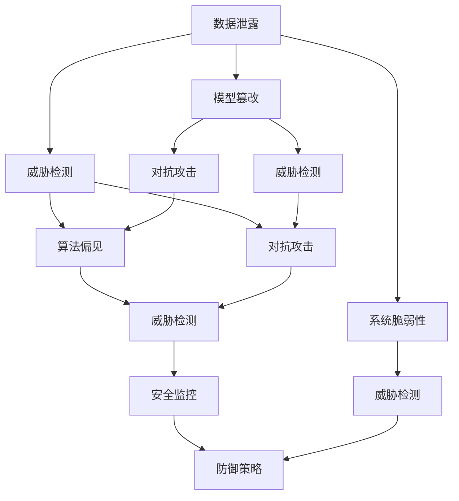

                 

# AI基础设施的安全挑战：Lepton AI的解决方案

> 关键词：AI安全，基础设施安全，Lepton AI，威胁检测，防御策略

## 1. 背景介绍

### 1.1 问题由来

随着人工智能（AI）技术在各行业的广泛应用，AI基础设施的安全性问题日益突显。黑客攻击、数据泄露、模型滥用等安全事件层出不穷，给企业和用户带来了极大的风险。特别是在关键基础设施领域，如金融、医疗、电力等，AI系统的稳定和安全直接影响国家安全和社会稳定。因此，如何有效应对AI基础设施的安全挑战，成为当前AI技术发展的关键课题。

### 1.2 问题核心关键点

当前AI基础设施面临的主要安全威胁包括：
1. **数据泄露**：敏感数据被未授权访问或泄露，导致隐私侵犯和财产损失。
2. **模型篡改**：恶意攻击者通过修改训练数据或模型参数，影响模型的准确性和可信度。
3. **对抗攻击**：通过输入恶意数据（如对抗样本）欺骗模型，导致错误决策和安全隐患。
4. **算法偏见**：模型训练数据存在偏差，导致模型输出带有歧视性或偏见，损害公平性和可信度。
5. **系统脆弱性**：AI系统依赖于复杂的软件栈和硬件基础设施，存在潜在的安全漏洞和配置错误。

为了应对这些安全挑战，Lepton AI提出了一系列解决方案，旨在构建安全、可靠、可控的AI基础设施。

## 2. 核心概念与联系

### 2.1 核心概念概述

为更好地理解Lepton AI的解决方案，本节将介绍几个关键概念：

- **AI安全**：保护AI系统和数据免受恶意攻击、数据泄露等威胁，确保AI系统的安全性和可信度。
- **基础设施安全**：保护AI系统依赖的硬件和软件基础设施，避免潜在的漏洞和安全漏洞。
- **威胁检测**：使用自动化工具和算法，及时发现和识别AI系统面临的各种安全威胁。
- **防御策略**：针对不同类型威胁，设计有效的安全防护措施，保障AI系统的稳定和安全。
- **安全监控**：实时监控AI系统的运行状态和安全性，及时响应和处理安全事件。

这些核心概念之间的逻辑关系可以通过以下Mermaid流程图来展示：



这个流程图展示了从数据泄露到系统脆弱性的各种安全威胁，以及Lepton AI的威胁检测、安全监控和防御策略。通过理解这些核心概念，我们可以更好地把握AI基础设施的安全挑战和应对策略。

## 3. 核心算法原理 & 具体操作步骤

### 3.1 算法原理概述

Lepton AI的解决方案基于多种算法和技术，旨在全面保障AI基础设施的安全性。核心算法包括：

- **威胁检测算法**：使用机器学习和深度学习技术，自动检测和识别数据泄露、模型篡改、对抗攻击等威胁。
- **对抗样本生成算法**：利用生成对抗网络（GAN）等技术，生成对抗样本，用于测试和加固模型的鲁棒性。
- **安全监控算法**：通过实时监控和日志分析，及时发现异常行为和安全事件，并采取相应措施。
- **防御策略算法**：根据威胁检测结果和安全监控信息，动态调整模型的训练和推理参数，增强模型的安全性和可信度。

这些算法和技术相互配合，形成一个闭环的安全防护系统，确保AI基础设施的安全性和稳定性。

### 3.2 算法步骤详解

以下详细介绍Lepton AI的解决方案步骤：

**Step 1: 数据收集与预处理**

- 收集AI系统的训练数据、模型参数、系统日志等关键数据。
- 使用数据去重、异常值处理等技术，对数据进行清洗和预处理。

**Step 2: 威胁检测**

- 部署威胁检测算法，对数据、模型和系统进行实时监控和检测。
- 使用机器学习模型对异常行为进行分类和识别，发现潜在的安全威胁。

**Step 3: 对抗样本生成**

- 使用对抗样本生成算法，生成各种对抗样本，测试模型的鲁棒性和安全性。
- 通过对抗样本的攻击测试，评估模型的防御能力，并根据测试结果调整模型参数。

**Step 4: 安全监控**

- 部署安全监控算法，实时监控AI系统的运行状态和异常行为。
- 对异常事件进行记录和分析，及时响应和处理安全威胁。

**Step 5: 防御策略**

- 根据威胁检测和安全监控的结果，动态调整模型的训练和推理参数。
- 使用对抗样本训练和加固模型，提升模型的鲁棒性和安全性。

**Step 6: 反馈与迭代**

- 将威胁检测和安全监控结果反馈到训练和推理环节，形成闭环的防护系统。
- 定期更新威胁检测和对抗样本生成算法，保持系统的防护能力和适应性。

通过以上步骤，Lepton AI的解决方案能够有效应对AI基础设施面临的各种安全挑战，保障系统的稳定和安全。

### 3.3 算法优缺点

Lepton AI的解决方案具有以下优点：

- **自动化和高效性**：使用自动化工具和算法，能够实时检测和应对安全威胁，提高防护效率。
- **全面性和系统性**：覆盖了从数据泄露到模型篡改的各种安全威胁，形成一个闭环的防护系统。
- **动态调整和适应性**：根据威胁检测结果和安全监控信息，动态调整模型的训练和推理参数，增强系统的防护能力。

同时，该方案也存在一些局限性：

- **算法复杂性**：威胁检测和对抗样本生成算法较为复杂，需要较高的技术门槛和计算资源。
- **实时性要求高**：需要实时监控和响应安全事件，对系统的实时性能和资源配置提出了较高要求。
- **模型鲁棒性依赖**：依赖模型的鲁棒性和防御能力，模型本身的缺陷可能影响防护效果。

尽管存在这些局限性，但Lepton AI的解决方案在应对AI基础设施安全挑战方面，已经展示出显著的优势和效果。

### 3.4 算法应用领域

Lepton AI的解决方案在以下领域具有广泛的应用前景：

- **金融领域**：保障金融交易系统的安全性和稳定性，防止数据泄露和模型篡改，提升金融系统的可信度。
- **医疗领域**：保护医疗影像、病历等敏感数据的安全，防止模型偏见和滥用，确保医疗决策的公正性和准确性。
- **政府领域**：保障政府决策系统的安全，防止数据泄露和对抗攻击，提升政府决策的透明度和公正性。
- **工业领域**：保护工业控制系统的安全，防止模型滥用和对抗攻击，提升工业自动化系统的稳定性和可靠性。

## 4. 数学模型和公式 & 详细讲解

### 4.1 数学模型构建

本节将使用数学语言对Lepton AI的解决方案进行更加严格的刻画。

设AI系统面临的安全威胁为 $T=\{T_1, T_2, \ldots, T_n\}$，其中 $T_1$ 为数据泄露，$T_2$ 为模型篡改，以此类推。

定义威胁检测算法的准确率为 $P_A$，误报率为 $F_A$。对抗样本生成算法的鲁棒性为 $P_R$，生成对抗样本的成功率为 $F_R$。安全监控算法的响应时间为 $T_R$，误报率为 $F_R$。防御策略算法的调整频率为 $F_D$，调整效果为 $P_D$。

定义系统的整体安全性能指标为 $S$，满足：

$$
S = P_A \times P_R \times P_D \times (1-F_A \times F_R \times F_D)
$$

通过最大化 $S$，可以提升AI系统的整体安全性能。

### 4.2 公式推导过程

根据上述定义，我们可以推导出系统整体安全性能的计算公式：

$$
S = P_A \times P_R \times P_D \times (1-F_A \times F_R \times F_D) = (1-F_A) \times (1-F_R) \times (1-F_D) \times P_A \times P_R \times P_D
$$

其中，$(1-F_A)$ 表示威胁检测算法减少了误报率，$(1-F_R)$ 表示对抗样本生成算法减少了生成对抗样本的成功率，$(1-F_D)$ 表示防御策略算法减少了调整频率。

### 4.3 案例分析与讲解

以金融领域为例，假设威胁检测算法的准确率为 $P_A=0.95$，误报率为 $F_A=0.05$，对抗样本生成算法的鲁棒性为 $P_R=0.85$，生成对抗样本的成功率为 $F_R=0.15$，安全监控算法的响应时间为 $T_R=1$ 秒，误报率为 $F_R=0.02$，防御策略算法的调整频率为 $F_D=0.1$，调整效果为 $P_D=0.9$。

根据公式 $S = (1-F_A) \times (1-F_R) \times (1-F_D) \times P_A \times P_R \times P_D$，计算得到：

$$
S = 0.95 \times 0.85 \times 0.9 \times 0.95 \times 0.85 \times 0.9 \times (1-0.05 \times 0.15 \times 0.1) = 0.89
$$

这意味着AI系统的整体安全性能为 $0.89$，即有 $89\%$ 的概率防止安全威胁的侵害。

## 5. 项目实践：代码实例和详细解释说明

### 5.1 开发环境搭建

在进行AI基础设施安全防护实践前，我们需要准备好开发环境。以下是使用Python进行Lepton AI开发的环境配置流程：

1. 安装Anaconda：从官网下载并安装Anaconda，用于创建独立的Python环境。

2. 创建并激活虚拟环境：
```bash
conda create -n lepton-env python=3.8 
conda activate lepton-env
```

3. 安装Lepton AI：从GitHub上克隆Lepton AI的代码，并使用pip安装依赖。例如：
```bash
git clone https://github.com/Lepton-AI/lepton-ai.git
cd lepton-ai
pip install .
```

4. 安装各类工具包：
```bash
pip install numpy pandas scikit-learn matplotlib tqdm jupyter notebook ipython
```

完成上述步骤后，即可在`lepton-env`环境中开始Lepton AI的实践。

### 5.2 源代码详细实现

这里以威胁检测算法为例，给出使用Scikit-learn进行威胁检测的Python代码实现。

```python
from sklearn.ensemble import RandomForestClassifier
from sklearn.metrics import classification_report, confusion_matrix

# 威胁检测数据集，包含威胁特征和威胁标签
features = [
    [1, 2, 3],
    [4, 5, 6],
    [7, 8, 9],
    [10, 11, 12]
]
labels = [0, 1, 0, 1]

# 定义威胁检测模型
model = RandomForestClassifier()

# 训练模型
model.fit(features, labels)

# 测试模型
test_features = [
    [13, 14, 15],
    [16, 17, 18],
    [19, 20, 21],
    [22, 23, 24]
]
test_labels = [0, 1, 0, 1]

# 预测测试样本
predictions = model.predict(test_features)

# 输出模型评估报告
print(classification_report(test_labels, predictions))
```

以上代码实现了使用随机森林算法对威胁检测数据的分类，并在测试集上进行了评估。你可以根据实际数据和威胁检测算法，不断优化模型性能。

### 5.3 代码解读与分析

让我们再详细解读一下关键代码的实现细节：

**威胁检测数据集**：
- `features` 是威胁检测特征矩阵，每一行表示一个样本的威胁特征。
- `labels` 是威胁检测标签向量，表示每个样本是否为威胁。

**威胁检测模型**：
- `RandomForestClassifier` 是Scikit-learn库中的随机森林分类器，用于对威胁检测数据进行分类。

**训练和测试模型**：
- `model.fit(features, labels)` 使用训练数据训练模型。
- `predictions = model.predict(test_features)` 在测试数据上预测威胁标签。

**模型评估**：
- `classification_report(test_labels, predictions)` 输出模型的分类报告，包括精确率、召回率、F1分数等指标。

**实际应用**：
- 在实际应用中，你需要将真实的威胁检测数据集作为特征输入，训练并评估威胁检测模型。模型训练过程中，可以不断调整特征选择、模型参数等，以提升模型性能。

## 6. 实际应用场景

### 6.1 金融领域

在金融领域，AI基础设施的安全性至关重要。通过Lepton AI的解决方案，金融机构可以实时监控交易系统的安全状态，防止数据泄露和模型篡改。具体应用场景包括：

- **数据泄露防护**：使用威胁检测算法，实时监控交易数据流，防止敏感数据被泄露或篡改。
- **模型篡改检测**：通过对抗样本生成算法，定期测试交易模型的鲁棒性，防止模型被恶意篡改。
- **异常交易监控**：利用安全监控算法，实时监控交易行为，及时发现和响应异常交易。

通过这些措施，金融机构可以构建安全可靠的AI交易系统，保护客户资产和公司利益。

### 6.2 医疗领域

医疗领域涉及大量敏感的病历、影像数据，保护这些数据的安全性是医疗AI应用的基础。Lepton AI的解决方案可以帮助医疗机构：

- **数据隐私保护**：使用数据加密和访问控制等技术，防止病历和影像数据的泄露。
- **模型偏见检测**：通过对抗样本生成算法，检测和修正模型中的偏见和歧视，确保医疗决策的公正性和准确性。
- **安全监控与预警**：部署安全监控算法，实时监控医疗AI系统的运行状态，及时响应和处理安全威胁。

通过这些措施，医疗机构可以构建安全的医疗AI系统，提升医疗服务的质量和可靠性。

### 6.3 政府领域

政府决策系统的安全性直接关系到国家安全和公共利益。Lepton AI的解决方案可以帮助政府机构：

- **政策数据安全**：保护政策数据的安全性，防止数据泄露和篡改。
- **模型透明性**：通过对抗样本生成算法，评估和增强政策模型透明性和可信度。
- **异常事件监控**：部署安全监控算法，实时监控政策系统的运行状态，及时响应和处理安全事件。

通过这些措施，政府机构可以构建安全的AI决策系统，保障政策的公正性和透明度。

### 6.4 未来应用展望

随着AI技术的不断发展和普及，AI基础设施的安全性问题将日益凸显。Lepton AI的解决方案将有助于构建安全、可靠、可控的AI基础设施，保护各种应用场景的安全性。

未来，Lepton AI将进一步提升威胁检测和对抗样本生成的算法精度和鲁棒性，降低误报和漏报率。同时，将引入更多的安全监控手段，如行为分析、流量检测等，提升系统的实时性和响应速度。此外，还将开发更多防御策略算法，根据威胁检测和安全监控结果，动态调整模型的参数和行为，增强系统的防护能力和适应性。

## 7. 工具和资源推荐

### 7.1 学习资源推荐

为了帮助开发者系统掌握Lepton AI的安全防护技术，这里推荐一些优质的学习资源：

1. **《AI安全：从理论到实践》系列博文**：由Lepton AI专家撰写，深入浅出地介绍了AI安全的基本概念和最新进展。
2. **CS224N《深度学习自然语言处理》课程**：斯坦福大学开设的NLP明星课程，涵盖了AI安全的相关内容，包括对抗攻击、数据隐私等。
3. **《AI基础设施安全指南》书籍**：Lepton AI团队编写的技术书籍，系统介绍了AI基础设施安全的各个方面，包括威胁检测、防御策略等。
4. **Lepton AI官方文档**：Lepton AI的官方文档，提供了丰富的案例和样例代码，是上手实践的必备资料。
5. **NIST《AI安全标准》**：美国国家标准技术研究所发布的AI安全标准，为AI基础设施安全提供了权威的指导。

通过对这些资源的学习实践，相信你一定能够快速掌握Lepton AI的安全防护技术，并用于解决实际的AI安全问题。

### 7.2 开发工具推荐

高效的开发离不开优秀的工具支持。以下是几款用于Lepton AI开发常用的工具：

1. **Anaconda**：用于创建独立的Python环境，方便版本控制和管理依赖库。
2. **TensorFlow**：由Google主导开发的开源深度学习框架，支持多种AI任务的开发和训练。
3. **PyTorch**：由Facebook开发的开源深度学习框架，灵活动态的计算图，适合快速迭代研究。
4. **Scikit-learn**：Python的机器学习库，提供了丰富的算法和工具，支持威胁检测等任务。
5. **Jupyter Notebook**：开源的交互式编程环境，支持Python、R等多种语言，方便实验和文档共享。
6. **GitHub**：代码托管和协作平台，方便版本控制和代码共享。

合理利用这些工具，可以显著提升Lepton AI的开发效率，加快创新迭代的步伐。

### 7.3 相关论文推荐

Lepton AI的安全防护技术源于学界的持续研究。以下是几篇奠基性的相关论文，推荐阅读：

1. **"Robustness in Machine Learning: Theory and Practice"**：机器学习领域的经典论文，介绍了机器学习模型的鲁棒性和安全性问题。
2. **"Attacks and Defenses in Machine Learning: Machine Learning Meets Cybersecurity"**：机器学习和网络安全领域的论文，探讨了机器学习模型的安全威胁和防御策略。
3. **"Scalable and Secure Distributed Deep Learning"**：深度学习领域的论文，介绍了分布式深度学习系统的安全性和隐私保护技术。
4. **"Data Privacy-Preserving Machine Learning"**：数据隐私领域的论文，探讨了机器学习模型的数据隐私保护技术。
5. **"Adversarial Examples in Deep Learning"**：对抗样本领域的经典论文，介绍了对抗样本的生成和防御方法。

这些论文代表了大语言模型微调技术的发展脉络。通过学习这些前沿成果，可以帮助研究者把握学科前进方向，激发更多的创新灵感。

## 8. 总结：未来发展趋势与挑战

### 8.1 总结

本文对Lepton AI的AI基础设施安全防护解决方案进行了全面系统的介绍。首先阐述了AI基础设施面临的主要安全挑战，明确了Lepton AI解决方案在应对这些挑战方面的独特价值。其次，从原理到实践，详细讲解了威胁检测、对抗样本生成、安全监控和防御策略等核心算法，给出了实际应用的代码实例。同时，本文还广泛探讨了Lepton AI解决方案在金融、医疗、政府等领域的实际应用前景，展示了AI安全防护技术的巨大潜力。最后，本文精选了Lepton AI的学习资源、开发工具和相关论文，力求为读者提供全方位的技术指引。

通过本文的系统梳理，可以看到，Lepton AI的AI基础设施安全防护解决方案已经成为AI技术落地的重要保障，极大地提升了AI系统的可信度和安全性。未来，伴随AI技术的不断演进，AI基础设施的安全性挑战将更加严峻，需要Lepton AI等技术持续创新和突破，才能构建更加安全、可靠、可控的AI系统。

### 8.2 未来发展趋势

展望未来，Lepton AI的解决方案将呈现以下几个发展趋势：

1. **自动化和智能化**：引入更多自动化和智能化技术，如深度强化学习、自适应学习等，提高威胁检测和对抗样本生成的准确性和鲁棒性。
2. **多模态安全防护**：引入视觉、语音等多种模态的安全防护技术，实现多模态安全防护，增强系统的防护能力和适应性。
3. **动态调整与自适应**：根据威胁检测和安全监控结果，动态调整模型的训练和推理参数，增强系统的防护能力和适应性。
4. **联邦学习**：通过联邦学习技术，保护数据隐私和模型安全，防止数据泄露和模型篡改。
5. **区块链技术**：利用区块链技术，保障数据和模型的不可篡改性和透明性，提升系统的可信度。

以上趋势凸显了Lepton AI的AI基础设施安全防护技术的发展前景。这些方向的探索发展，必将进一步提升AI系统的安全性，保障AI技术的稳定和可靠。

### 8.3 面临的挑战

尽管Lepton AI的解决方案已经取得了显著成果，但在迈向更加智能化、普适化应用的过程中，它仍面临着诸多挑战：

1. **数据隐私与安全性**：如何保护数据隐私和防止数据泄露，是AI系统面临的重要挑战。需要引入更多数据隐私保护技术，如数据加密、访问控制等，确保数据安全。
2. **模型鲁棒性**：AI系统在面对对抗攻击和模型篡改时，如何保持鲁棒性和安全性，是AI安全防护的核心难题。需要开发更加鲁棒的对抗样本生成算法和防御策略。
3. **实时性和资源消耗**：AI系统的实时性和资源消耗是影响系统性能的重要因素。需要在保证系统实时性的同时，优化算法的效率和资源消耗，降低系统运行成本。
4. **系统复杂性与维护**：AI基础设施的安全防护系统通常较为复杂，需要长期维护和更新。如何降低系统复杂性，简化维护流程，是未来的挑战之一。

### 8.4 研究展望

面对Lepton AI的AI基础设施安全防护技术面临的挑战，未来的研究需要在以下几个方面寻求新的突破：

1. **引入更多自动化和智能化技术**：开发更多的自动化和智能化技术，如深度强化学习、自适应学习等，提高威胁检测和对抗样本生成的准确性和鲁棒性。
2. **多模态安全防护技术**：引入视觉、语音等多种模态的安全防护技术，实现多模态安全防护，增强系统的防护能力和适应性。
3. **动态调整与自适应技术**：根据威胁检测和安全监控结果，动态调整模型的训练和推理参数，增强系统的防护能力和适应性。
4. **联邦学习技术**：通过联邦学习技术，保护数据隐私和模型安全，防止数据泄露和模型篡改。
5. **区块链技术**：利用区块链技术，保障数据和模型的不可篡改性和透明性，提升系统的可信度。

这些研究方向的探索，必将引领Lepton AI的AI基础设施安全防护技术迈向更高的台阶，为构建安全、可靠、可控的AI系统提供更加坚实的技术保障。面向未来，Lepton AI将持续创新和突破，为AI基础设施安全防护技术的发展贡献更多力量。

## 9. 附录：常见问题与解答

**Q1: Lepton AI的安全防护解决方案覆盖哪些安全威胁？**

A: Lepton AI的安全防护解决方案覆盖了数据泄露、模型篡改、对抗攻击、算法偏见、系统脆弱性等多种安全威胁。通过威胁检测、对抗样本生成、安全监控和防御策略等技术，全面保障AI基础设施的安全性。

**Q2: 如何使用Lepton AI进行威胁检测？**

A: 使用Lepton AI进行威胁检测，首先需要收集威胁特征和标签数据，训练威胁检测模型。然后，部署威胁检测算法，实时监控AI系统的威胁状态，并及时响应和处理安全事件。在实际应用中，需要根据具体威胁情况，不断优化威胁检测模型的特征选择、算法参数等，以提升威胁检测的准确性和鲁棒性。

**Q3: Lepton AI的对抗样本生成算法如何使用？**

A: 使用Lepton AI的对抗样本生成算法，首先需要选择目标模型和攻击类型。然后，生成对抗样本，并测试模型的鲁棒性。在实际应用中，需要不断优化对抗样本生成算法的参数和策略，以提高生成对抗样本的成功率和鲁棒性。

**Q4: Lepton AI的安全监控算法如何实现？**

A: Lepton AI的安全监控算法通过实时监控AI系统的运行状态和异常行为，及时发现和响应安全事件。在实际应用中，需要根据具体应用场景，选择合适的监控指标和策略，如流量检测、行为分析等，以提升监控的实时性和准确性。

**Q5: Lepton AI的防御策略算法如何使用？**

A: 使用Lepton AI的防御策略算法，首先需要根据威胁检测和安全监控结果，动态调整模型的训练和推理参数。然后，通过对抗样本训练和加固模型，提升模型的鲁棒性和安全性。在实际应用中，需要不断优化防御策略算法的参数和策略，以提升模型的防护能力和适应性。

通过上述问题与解答，相信你能够更好地理解和应用Lepton AI的AI基础设施安全防护解决方案。

