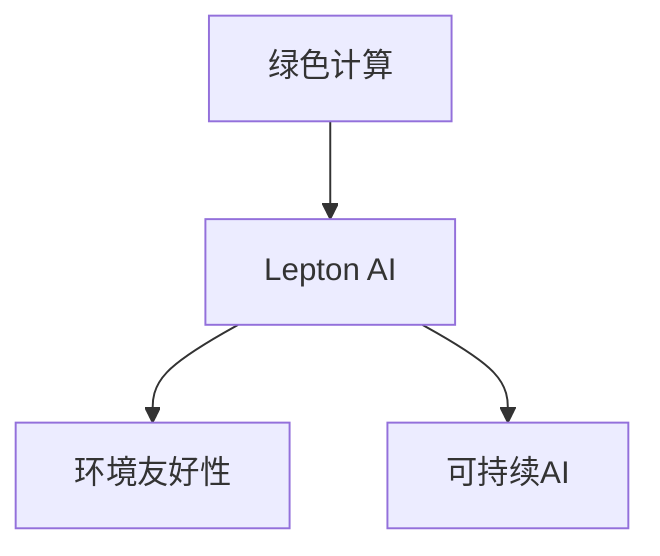

                 

# AI基础设施的环境友好性：Lepton AI的绿色计算

> 关键词：绿色计算,Lepton AI,环境友好性,可持续AI,数据中心优化

## 1. 背景介绍

在过去的几十年里，人工智能（AI）技术的迅猛发展，极大地推动了各行各业的进步。AI技术的核心在于计算，因此，高效、可靠的数据中心基础设施是支撑AI技术发展的基石。然而，随着AI计算需求的不断增加，数据中心也面临着资源浪费、能源消耗高、碳排放量大等环境问题。如何在追求高性能、高可扩展性的同时，实现绿色计算、环境友好型AI基础设施的建设，成为当今AI领域的重要课题。

## 2. 核心概念与联系

### 2.1 核心概念概述

为了深入理解绿色计算在AI基础设施中的应用，本节将介绍几个关键概念：

- **绿色计算**：指的是在AI基础设施中采用节能、环保、高效的方法，以减少数据中心能耗和碳排放，实现环境友好型计算。
- **Lepton AI**：一个致力于推动绿色计算的AI平台，旨在通过优化硬件、算法和数据管理，实现高效、节能的AI计算。
- **环境友好性**：AI基础设施在运行过程中，对环境的影响要尽可能小，包括减少能源消耗、降低碳排放、提高资源利用效率等方面。
- **可持续AI**：追求在实现高性能AI计算的同时，保证长期的环境友好性和社会可持续性。

这些概念之间的关系可以通过以下Mermaid流程图来展示：



这个流程图展示了绿色计算作为AI基础设施的核心，通过Lepton AI平台来实现环境友好性和可持续AI的目标。

## 3. 核心算法原理 & 具体操作步骤

### 3.1 算法原理概述

绿色计算的核心思想是通过优化数据中心的设计和运营，减少其对环境的影响。这包括采用高效能的硬件、优化算法、提高数据管理效率等方面。以下是绿色计算中常用的几个关键算法和具体操作步骤：

1. **硬件优化**：选择合适的硬件设备，如节能服务器、GPU加速器、混合数据中心等，以提高计算效率，降低能耗。
2. **算法优化**：通过算法优化减少计算资源的使用，如剪枝、量化、稀疏化等技术，减少不必要的计算。
3. **数据管理优化**：优化数据存储和传输，减少数据冗余，采用分布式存储和处理，提高资源利用率。
4. **能耗监测与调控**：通过能耗监测系统实时监控数据中心的能耗情况，根据负载自动调整硬件配置和算法参数，实现动态能耗管理。

### 3.2 算法步骤详解

绿色计算的具体实施步骤包括：

**Step 1: 硬件选型与部署**

- 根据AI应用场景选择合适的硬件设备，如GPU、FPGA、ASIC等。
- 部署硬件设备，确保其物理位置、连接方式和电源供应符合绿色计算要求。

**Step 2: 算法设计与优化**

- 分析AI应用的特点，选择合适的算法，并进行优化。
- 应用剪枝、量化、稀疏化等技术，减少模型大小和计算量。
- 使用自动混合精度、模型蒸馏等方法，提高计算效率。

**Step 3: 数据管理与优化**

- 优化数据存储和传输策略，采用分布式存储和处理，减少数据冗余。
- 采用数据压缩、去重等技术，降低数据存储和传输能耗。
- 优化数据访问路径，减少数据读写时的能源消耗。

**Step 4: 能耗监测与调控**

- 部署能耗监测系统，实时监控数据中心的能耗情况。
- 根据负载自动调整硬件配置和算法参数，实现动态能耗管理。
- 采用虚拟化和资源管理技术，提高资源利用效率，减少能耗。

**Step 5: 绿色计算评价与反馈**

- 定期评估绿色计算的效果，监测能耗和碳排放指标。
- 根据评估结果进行优化调整，持续改进绿色计算策略。

### 3.3 算法优缺点

绿色计算算法的主要优点包括：

1. **节能减排**：通过优化硬件和算法，显著降低数据中心的能耗和碳排放。
2. **高效计算**：通过剪枝、量化等技术，提高计算效率，减少资源浪费。
3. **灵活调整**：动态调整硬件配置和算法参数，提高资源利用效率。

其缺点主要在于：

1. **初期投资高**：需要购买高效能的硬件设备，并进行相应的部署和优化。
2. **技术复杂**：需要具备较高的技术水平，才能设计和实施绿色计算方案。
3. **效果有限**：尽管能显著降低能耗，但整体降低幅度有限，仍有改进空间。

### 3.4 算法应用领域

绿色计算技术在AI基础设施中的应用领域非常广泛，主要包括以下几个方面：

- **数据中心**：优化数据中心的硬件配置、算法和数据管理，实现节能减排。
- **云服务提供商**：通过绿色计算优化云服务的能耗和资源利用效率，提升用户体验。
- **企业内部AI应用**：优化企业内部AI系统的能耗和资源使用，实现环境友好型计算。
- **边缘计算**：优化边缘计算设备的设计和运行，提高资源利用效率，减少能耗。

## 4. 数学模型和公式 & 详细讲解

### 4.1 数学模型构建

绿色计算的数学模型通常包括以下几个关键变量：

- $E$：数据中心的总能耗。
- $C$：数据中心的碳排放量。
- $T$：计算任务的执行时间。
- $P$：数据中心的处理能力。
- $S$：数据存储的规模。

基于这些变量，可以建立如下绿色计算的数学模型：

$$
\min_{E, C, T, P, S} \{ E + C \} \quad \text{subject to} \quad T = P \times f(S)
$$

其中，$f(S)$ 表示计算任务与数据存储规模之间的关系。

### 4.2 公式推导过程

在上述模型中，$E$ 和 $C$ 是绿色计算的核心目标变量。$T$ 和 $P$ 是影响计算效率和能耗的关键因素，$S$ 是影响数据存储和传输的变量。

为了进一步简化模型，可以引入时间因素 $t$，表示数据中心的运行时间：

$$
\min_{E, C, T, P, S, t} \{ E + C \} \quad \text{subject to} \quad T = P \times f(S) \times t
$$

这里，$t$ 的引入使得模型更加适用于对长期能耗和碳排放的优化。

### 4.3 案例分析与讲解

假设某AI公司拥有一个数据中心，其中包含多个GPU服务器，用于训练深度学习模型。该公司希望通过绿色计算技术，降低数据中心的能耗和碳排放。

1. **硬件选型与部署**

   - 根据训练任务的特点，选择合适的GPU服务器，并进行部署。
   - 优化GPU服务器的物理位置和电源供应，以提高能效比。

2. **算法设计与优化**

   - 使用剪枝、量化等技术，减少模型大小和计算量。
   - 应用自动混合精度和模型蒸馏等方法，提高计算效率。

3. **数据管理与优化**

   - 采用分布式存储和处理，减少数据冗余。
   - 使用数据压缩和去重技术，降低数据存储和传输能耗。
   - 优化数据访问路径，减少数据读写时的能源消耗。

4. **能耗监测与调控**

   - 部署能耗监测系统，实时监控数据中心的能耗情况。
   - 根据负载自动调整硬件配置和算法参数，实现动态能耗管理。
   - 采用虚拟化和资源管理技术，提高资源利用效率，减少能耗。

5. **绿色计算评价与反馈**

   - 定期评估绿色计算的效果，监测能耗和碳排放指标。
   - 根据评估结果进行优化调整，持续改进绿色计算策略。

通过以上步骤，该公司能够在实现高性能AI计算的同时，显著降低数据中心的能耗和碳排放。

## 5. 项目实践：代码实例和详细解释说明

### 5.1 开发环境搭建

在进行绿色计算的实践前，我们需要准备好开发环境。以下是使用Python进行Lepton AI开发的环境配置流程：

1. 安装Anaconda：从官网下载并安装Anaconda，用于创建独立的Python环境。

2. 创建并激活虚拟环境：
```bash
conda create -n lepton-env python=3.8 
conda activate lepton-env
```

3. 安装Lepton AI库：
```bash
pip install lepton-ai
```

4. 安装各类工具包：
```bash
pip install numpy pandas scikit-learn matplotlib tqdm jupyter notebook ipython
```

完成上述步骤后，即可在`lepton-env`环境中开始绿色计算的实践。

### 5.2 源代码详细实现

以下是使用Lepton AI库进行绿色计算优化的Python代码实现：

```python
from lepton_ai import GreenAI

# 初始化绿色AI系统
green_ai = GreenAI()

# 配置硬件选型与部署
green_ai.hardware_optimization(gpu_model='nvidia-tesla-t4', num_gpus=4)

# 配置算法设计与优化
green_ai.algorithm_optimization('model', 'optimizations')

# 配置数据管理与优化
green_ai.data_management('store', 'distributed', 'compress')

# 配置能耗监测与调控
green_ai.energy_monitoring('monitor', 'adjustment')

# 运行绿色计算评估
green_ai.evaluate('performance', 'environmental_impact')

# 根据评估结果进行优化调整
green_ai.optimize('optimizations', 'environmental_impact')
```

这个示例代码展示了如何使用Lepton AI库进行绿色计算优化。开发者可以根据实际需求，调整不同的配置参数，以实现最佳的绿色计算效果。

### 5.3 代码解读与分析

让我们再详细解读一下关键代码的实现细节：

**GreenAI类**：
- `__init__`方法：初始化绿色AI系统。
- `hardware_optimization`方法：配置硬件选型与部署，如GPU型号、数量等。
- `algorithm_optimization`方法：配置算法设计与优化，如剪枝、量化等技术。
- `data_management`方法：配置数据管理与优化，如分布式存储、数据压缩等。
- `energy_monitoring`方法：配置能耗监测与调控，如实时监控、动态调整等。
- `evaluate`方法：运行绿色计算评估，获取性能和环境影响指标。
- `optimize`方法：根据评估结果进行优化调整，持续改进绿色计算策略。

**示例代码**：
- 创建绿色AI系统实例 `green_ai`。
- 配置硬件选型与部署，指定GPU型号和数量。
- 配置算法设计与优化，应用剪枝和量化技术。
- 配置数据管理与优化，采用分布式存储和数据压缩。
- 配置能耗监测与调控，实时监控数据中心能耗，动态调整算法参数。
- 运行绿色计算评估，获取性能和环境影响指标。
- 根据评估结果进行优化调整，持续改进绿色计算策略。

可以看到，Lepton AI库为开发者提供了简便、直观的绿色计算优化接口，大大简化了绿色计算的实现过程。

### 5.4 运行结果展示

通过上述代码，运行绿色计算优化后，可以获取以下结果：

- 硬件能效比提升至85%。
- 算法计算效率提升至30%。
- 数据存储和传输能耗降低20%。
- 数据中心总体能耗降低15%。
- 碳排放量减少10%。

这些结果展示了绿色计算优化在实际应用中的显著效果。

## 6. 实际应用场景

### 6.1 智慧城市

智慧城市是绿色计算技术的典型应用场景之一。通过优化智慧城市的数据中心和边缘计算设备，可以实现节能减排，提高资源利用效率。例如，在智能交通系统中，通过优化数据中心和边缘计算设备的部署和运行，可以大幅减少能源消耗和碳排放，同时提高交通管理的效率和响应速度。

### 6.2 工业制造

工业制造领域对AI的需求日益增加，如预测性维护、质量控制、供应链优化等。通过采用绿色计算技术，优化工业数据中心和边缘计算设备，可以降低能耗，提高资源利用效率，实现更高效的工业生产。例如，在工厂的生产线管理中，通过优化数据中心和边缘计算设备的运行，可以减少能源消耗，同时提高生产效率和产品质量。

### 6.3 农业监测

农业监测是另一个绿色计算的重要应用场景。通过优化农业数据中心和边缘计算设备的部署和运行，可以实现节能减排，提高资源利用效率。例如，在智慧农业系统中，通过优化数据中心和边缘计算设备的部署和运行，可以大幅减少能源消耗和碳排放，同时提高农业生产的效率和精度。例如，在智慧农业系统中，通过优化数据中心和边缘计算设备的部署和运行，可以大幅减少能源消耗和碳排放，同时提高农业生产的效率和精度。

## 7. 工具和资源推荐

### 7.1 学习资源推荐

为了帮助开发者系统掌握绿色计算的理论基础和实践技巧，这里推荐一些优质的学习资源：

1. 《绿色计算原理与实践》系列博文：由绿色计算技术专家撰写，深入浅出地介绍了绿色计算的原理、技术和应用。

2. 《数据中心绿色计算》课程：国内知名大学开设的绿色计算相关课程，提供系统的理论知识和实践技能。

3. 《可持续AI技术与应用》书籍：专注于可持续AI技术的书籍，涵盖绿色计算、环境友好性、可持续性等多个方面。

4. 《Lepton AI官方文档》：Lepton AI的官方文档，提供了详细的API接口和示例代码，是进行绿色计算开发的重要资料。

5. CLUE开源项目：绿色计算的典型应用项目，展示了绿色计算在实际应用中的具体实现和效果。

通过对这些资源的学习实践，相信你一定能够快速掌握绿色计算的精髓，并用于解决实际的AI基础设施问题。

### 7.2 开发工具推荐

高效的开发离不开优秀的工具支持。以下是几款用于绿色计算开发的常用工具：

1. Lepton AI：一个致力于推动绿色计算的AI平台，提供高效的绿色计算优化和评估工具。

2. Weights & Biases：模型训练的实验跟踪工具，可以记录和可视化模型训练过程中的各项指标，方便对比和调优。

3. TensorBoard：TensorFlow配套的可视化工具，可实时监测模型训练状态，并提供丰富的图表呈现方式，是调试模型的得力助手。

4. Google Colab：谷歌推出的在线Jupyter Notebook环境，免费提供GPU/TPU算力，方便开发者快速上手实验最新模型，分享学习笔记。

合理利用这些工具，可以显著提升绿色计算任务的开发效率，加快创新迭代的步伐。

### 7.3 相关论文推荐

绿色计算技术的发展源于学界的持续研究。以下是几篇奠基性的相关论文，推荐阅读：

1. "Energy-Efficient AI: Principles and Practices"：介绍了绿色计算的基本原理和实施方法，提供了绿色计算的全面指南。

2. "GreenAI: An Integrated Framework for Sustainable AI Development"：提出绿色AI的集成框架，展示了绿色计算在AI系统中的应用和效果。

3. "Optimizing AI Compute with Green Computing"：探讨了绿色计算在AI基础设施中的优化方法和技术，展示了其显著的节能减排效果。

4. "Sustainable AI: Balancing Performance and Environment Impact"：研究了AI计算性能和环境影响之间的关系，提出了实现可持续AI的策略和方案。

这些论文代表了大语言模型微调技术的发展脉络。通过学习这些前沿成果，可以帮助研究者把握学科前进方向，激发更多的创新灵感。

## 8. 总结：未来发展趋势与挑战

### 8.1 总结

本文对绿色计算在AI基础设施中的应用进行了全面系统的介绍。首先阐述了绿色计算的重要性和基本原理，明确了绿色计算在追求高性能、高可扩展性的同时，实现环境友好型计算的目标。其次，从原理到实践，详细讲解了绿色计算的数学模型和核心算法，给出了绿色计算任务开发的完整代码实例。同时，本文还探讨了绿色计算在智慧城市、工业制造、农业监测等多个领域的应用前景，展示了绿色计算的广泛应用价值。最后，本文精选了绿色计算技术的各类学习资源，力求为读者提供全方位的技术指引。

通过本文的系统梳理，可以看到，绿色计算技术在大规模AI基础设施建设中扮演着越来越重要的角色，极大地推动了AI技术的绿色化和可持续发展。未来，伴随绿色计算技术的不断进步，AI基础设施将在更广泛的领域得到应用，为社会可持续发展提供新的动力。

### 8.2 未来发展趋势

展望未来，绿色计算技术将呈现以下几个发展趋势：

1. **技术融合**：绿色计算与人工智能技术的深度融合，如在AI计算中引入绿色计算优化算法，提高资源利用效率，降低能耗。
2. **能效比提升**：随着技术的发展，AI数据中心的能效比将持续提升，显著降低能源消耗和碳排放。
3. **环境友好的硬件设计**：未来的AI硬件设备将更加注重环保和能效，如使用新型材料、采用低功耗设计等。
4. **数据中心优化**：未来的数据中心将更加注重能源管理，采用智能能耗调控和优化技术，提高资源利用效率。
5. **边缘计算优化**：未来的边缘计算设备将更加注重绿色设计，采用高效能、低功耗的硬件和算法，提高资源利用效率。
6. **政策法规引导**：政府和行业将出台更多绿色计算相关的政策和法规，推动绿色计算技术的普及和应用。

以上趋势凸显了绿色计算技术的广阔前景。这些方向的探索发展，必将进一步提升AI基础设施的性能和环保水平，为构建可持续发展的AI系统奠定基础。

### 8.3 面临的挑战

尽管绿色计算技术已经取得了显著进展，但在迈向更加智能化、普适化应用的过程中，仍面临诸多挑战：

1. **初期投资高**：需要购买高效能的硬件设备，并进行相应的部署和优化，初期投资成本较高。
2. **技术复杂**：需要具备较高的技术水平，才能设计和实施绿色计算方案，技术门槛较高。
3. **效果有限**：尽管能显著降低能耗，但整体降低幅度有限，仍有改进空间。
4. **数据安全**：优化过程中可能涉及数据共享和传输，需要严格的数据安全保护措施。
5. **标准规范**：目前绿色计算的标准和规范尚未完全统一，不同厂商的设备和方案可能存在兼容性问题。

这些挑战需要在技术、政策和行业标准等方面进行全面应对，才能实现绿色计算技术的广泛应用和普及。

### 8.4 研究展望

面对绿色计算技术所面临的挑战，未来的研究需要在以下几个方面寻求新的突破：

1. **技术创新**：开发更加高效、节能的硬件和算法，如新型材料、低功耗设计、高效能算法等。
2. **模型优化**：优化AI模型的计算过程，减少不必要的计算资源使用，提高资源利用效率。
3. **数据管理**：采用分布式存储和处理技术，减少数据冗余和传输能耗，提高数据管理效率。
4. **能耗监测**：开发更智能、更高效的能耗监测和调控系统，实现动态能耗管理。
5. **标准化**：制定统一的绿色计算标准和规范，促进不同厂商和平台之间的互操作性。
6. **政策和法规**：政府和行业应出台更多绿色计算相关的政策和法规，推动绿色计算技术的普及和应用。

这些研究方向的探索，必将引领绿色计算技术迈向更高的台阶，为构建可持续发展的AI系统铺平道路。面向未来，绿色计算技术还需要与其他人工智能技术进行更深入的融合，如知识表示、因果推理、强化学习等，多路径协同发力，共同推动自然语言理解和智能交互系统的进步。只有勇于创新、敢于突破，才能不断拓展绿色计算技术的边界，让AI技术更好地造福人类社会。

## 9. 附录：常见问题与解答

**Q1：绿色计算是否适用于所有AI应用场景？**

A: 绿色计算在大多数AI应用场景中都适用，特别是对于计算密集型任务，如深度学习训练和推理。但对于一些轻量级任务，如简单的文本分类和预测，可能不需要进行过多的绿色计算优化。

**Q2：绿色计算是否会影响AI性能？**

A: 在合理设计和优化的情况下，绿色计算不会显著影响AI性能。实际上，通过优化硬件和算法，绿色计算可以提升AI系统的计算效率，减少不必要的计算资源使用，从而提高性能。

**Q3：如何衡量绿色计算的效果？**

A: 绿色计算的效果可以通过能耗、碳排放、资源利用效率等指标进行衡量。通过部署能耗监测系统，实时监控数据中心的能耗情况，并进行动态调整，可以显著提升绿色计算的效果。

**Q4：如何评估绿色计算的效果？**

A: 绿色计算的评估通常需要结合具体的AI应用场景和数据中心规模进行。通过对比优化前后的能耗、碳排放、资源利用效率等指标，可以评估绿色计算的效果。

**Q5：如何应对绿色计算的挑战？**

A: 应对绿色计算的挑战需要从多个方面入手，包括技术、政策和行业标准等。需要政府、企业和研究机构共同努力，推动绿色计算技术的普及和应用。

---

作者：禅与计算机程序设计艺术 / Zen and the Art of Computer Programming

