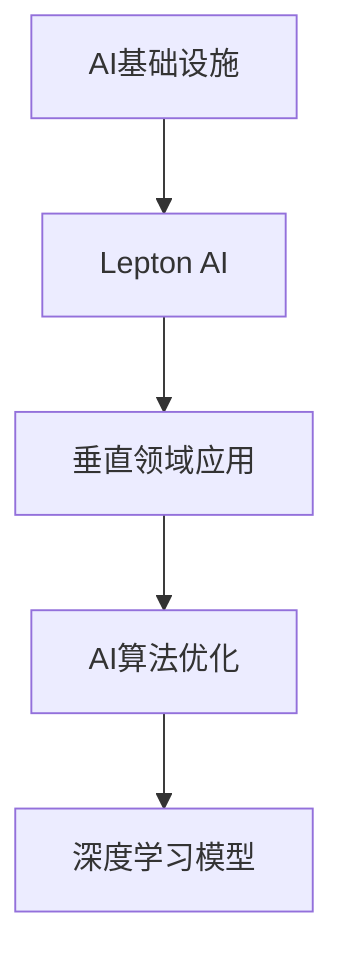

                 

# AI基础设施的行业应用：Lepton AI的垂直领域探索

> 关键词：AI基础设施, Lepton AI, 垂直领域应用, AI算法优化, 深度学习模型, 机器学习应用, AI工程

## 1. 背景介绍

### 1.1 问题由来
AI基础设施作为现代信息技术的重要支柱，广泛应用于金融、医疗、交通、教育、制造等多个行业。Lepton AI作为一家领先的技术提供商，通过深度学习、大数据、自然语言处理等核心技术，致力于为垂直行业提供高性能、易用、高效的AI基础设施，帮助企业降低IT成本，提升业务运营效率。

在金融行业，Lepton AI构建的智能风控平台，通过先进的大模型和算法，对金融数据进行深度分析和风险预测，有效防范金融风险，保障金融安全。
在医疗行业，Lepton AI开发的智能诊疗系统，利用大模型进行疾病诊断、影像识别和患者分析，提高了医疗服务的质量和效率。
在制造行业，Lepton AI的智能制造系统，通过数据驱动和AI预测，优化生产流程，提高了生产效率和产品合格率。
在教育行业，Lepton AI的智能教育平台，利用AI技术对学生的学习行为进行分析，个性化推荐学习内容，提升了教育质量。

### 1.2 问题核心关键点
Lepton AI的成功在于其高度专业化的AI基础设施解决方案，能够根据不同行业的特点，提供定制化的AI技术。核心关键点如下：
1. 高度定制化的AI模型：Lepton AI根据垂直行业的需求，设计和训练高度定制化的AI模型。
2. 高效的AI算法优化：通过优化算法，Lepton AI在模型的训练和推理过程中实现了高效的资源利用。
3. 实时的AI数据处理：Lepton AI构建的AI基础设施可以实时处理大规模数据，提供了快速、准确的决策支持。
4. 可扩展的AI系统架构：Lepton AI的AI基础设施具有高度的可扩展性，可以适应业务量的增长和变化。

这些核心关键点使得Lepton AI能够在不同的垂直领域中，提供高性能、高可靠的AI基础设施。

### 1.3 问题研究意义
Lepton AI的垂直领域AI基础设施具有以下重要意义：
1. 提升行业效率：通过优化AI模型和算法，Lepton AI显著提升了各行业的工作效率。
2. 降低IT成本：通过AI基础设施，Lepton AI帮助企业降低了IT系统的建设和维护成本。
3. 提供精准决策：AI基础设施提供实时、准确的决策支持，帮助企业进行精准决策。
4. 增强创新能力：通过AI基础设施，Lepton AI提升了各行业的技术创新能力，推动了产业的数字化转型。
5. 实现安全可靠：Lepton AI的AI基础设施提供高可靠性和安全性保障，保护数据和系统的安全。

## 2. 核心概念与联系

### 2.1 核心概念概述

为更好地理解Lepton AI的垂直领域AI基础设施，本节将介绍几个密切相关的核心概念：

- AI基础设施（AI Infrastructure）：指通过硬件、软件、数据、算法等组件构成的综合AI系统，能够提供高性能、高可用的AI计算和服务。
- Lepton AI：一家致力于提供垂直领域AI基础设施的高科技公司，通过深度学习、大数据、自然语言处理等技术，提供定制化的AI解决方案。
- 垂直领域应用（Vertical Field Application）：指针对特定行业的AI应用，如金融、医疗、制造、教育等。
- AI算法优化（AI Algorithm Optimization）：通过算法优化，提升AI模型的训练效率和推理速度，同时保证模型的精度和效果。
- 深度学习模型（Deep Learning Model）：指采用多层神经网络结构的模型，能够自动学习输入数据的特征，并进行复杂任务的预测和决策。

这些核心概念之间的逻辑关系可以通过以下Mermaid流程图来展示：



这个流程图展示了大语言模型的核心概念及其之间的关系：

1. 大语言模型通过预训练获得基础能力。
2. Lepton AI的AI基础设施提供了高性能、高可用的AI计算能力。
3. Lepton AI根据垂直领域的需求，定制化设计AI模型。
4. 通过优化算法，提升模型的训练效率和推理速度。
5. Lepton AI的AI基础设施支持深度学习模型，提供了预测和决策能力。

这些概念共同构成了Lepton AI的AI基础设施的工作原理和优化方向。

## 3. 核心算法原理 & 具体操作步骤

### 3.1 算法原理概述

Lepton AI的垂直领域AI基础设施基于深度学习模型，通过高效算法优化和大数据处理，提供了高性能的AI计算能力。其核心算法原理如下：

1. **深度学习模型**：Lepton AI采用多层神经网络结构的深度学习模型，能够自动学习输入数据的特征，并进行复杂任务的预测和决策。

2. **算法优化**：通过算法优化，Lepton AI提升了深度学习模型的训练效率和推理速度，同时保证了模型的精度和效果。

3. **数据处理**：Lepton AI的AI基础设施可以实时处理大规模数据，提供了快速、准确的决策支持。

### 3.2 算法步骤详解

Lepton AI的垂直领域AI基础设施的构建过程，主要包括以下几个关键步骤：

**Step 1: 数据准备和预处理**
- 收集垂直领域的相关数据，进行清洗和标注。
- 对数据进行特征提取和转换，以适应深度学习模型的输入格式。

**Step 2: 模型设计和训练**
- 根据垂直领域的需求，设计和训练高度定制化的深度学习模型。
- 利用Lepton AI优化的算法，提升模型的训练效率和效果。

**Step 3: 模型部署和优化**
- 将训练好的模型部署到Lepton AI的AI基础设施中。
- 利用Lepton AI的优化工具，对模型进行进一步的优化和调整。

**Step 4: 性能评估和监控**
- 在实际应用场景中，对模型进行性能评估，收集反馈数据。
- 利用Lepton AI的监控系统，实时监控模型的运行状态和性能。

### 3.3 算法优缺点

Lepton AI的垂直领域AI基础设施具有以下优点：
1. 高效性：Lepton AI通过算法优化和数据处理，大幅提升了深度学习模型的训练效率和推理速度。
2. 可扩展性：Lepton AI的AI基础设施具有高度的可扩展性，能够适应业务量的增长和变化。
3. 精度高：Lepton AI通过优化算法和数据预处理，保证了深度学习模型的精度和效果。
4. 安全性：Lepton AI的AI基础设施提供了高可靠性和安全性保障，保护数据和系统的安全。

同时，该方法也存在一定的局限性：
1. 对数据的依赖：Lepton AI的AI基础设施依赖高质量、大量的数据。
2. 计算资源需求高：Lepton AI的AI基础设施需要高性能的计算资源，如GPU、TPU等。
3. 模型复杂度高：Lepton AI的深度学习模型结构复杂，模型调优难度较大。

尽管存在这些局限性，但就目前而言，Lepton AI的垂直领域AI基础设施仍然是AI领域内较为先进和实用的解决方案。

### 3.4 算法应用领域

Lepton AI的垂直领域AI基础设施已在多个行业领域得到了广泛应用，例如：

- 金融行业：Lepton AI通过智能风控平台，利用大模型进行风险预测，防范金融风险。
- 医疗行业：Lepton AI通过智能诊疗系统，利用大模型进行疾病诊断和影像识别，提升医疗服务质量。
- 制造行业：Lepton AI通过智能制造系统，利用数据驱动和AI预测，优化生产流程。
- 教育行业：Lepton AI通过智能教育平台，利用AI技术进行学习行为分析，个性化推荐学习内容。

除了上述这些经典领域外，Lepton AI的AI基础设施还被创新性地应用于更多场景中，如自动驾驶、智慧城市、智能客服等，为各行各业带来新的技术突破。

## 4. 数学模型和公式 & 详细讲解 & 举例说明

### 4.1 数学模型构建

Lepton AI的垂直领域AI基础设施基于深度学习模型，其核心数学模型包括：

- 神经网络模型：Lepton AI采用多层神经网络结构，模型参数为 $W$，激活函数为 $f$。
- 损失函数：Lepton AI根据垂直领域的任务需求，设计相应的损失函数 $L$。
- 优化器：Lepton AI使用高效的优化算法，如Adam、SGD等，最小化损失函数 $L$。

形式化地，假设输入数据为 $x$，模型输出为 $y$，则深度学习模型的训练过程可以表示为：

$$
\theta = \mathop{\arg\min}_{\theta} \frac{1}{N}\sum_{i=1}^N L(y_i,f_\theta(x_i))
$$

其中 $N$ 为样本数量，$\theta$ 为模型参数。

### 4.2 公式推导过程

以Lepton AI的智能风控平台为例，其数学模型构建和公式推导过程如下：

**Step 1: 神经网络模型设计**
假设输入数据为客户的信用记录、交易记录等信息，输出为客户的信用评分。
- 输入层：将输入数据映射为神经网络可以处理的形式，例如将字符串转换为向量。
- 隐藏层：设计多层神经网络结构，包含多个全连接层和激活函数。
- 输出层：输出客户的信用评分。

**Step 2: 损失函数设计**
假设客户的信用评分标签为 $y$，神经网络的输出为 $y'$，则Lepton AI设计的损失函数为交叉熵损失函数：
$$
L(y,y') = -\frac{1}{N}\sum_{i=1}^N(y_i \log y'_i + (1-y_i) \log(1-y'_i))
$$

**Step 3: 优化器选择**
Lepton AI使用Adam优化器，通过梯度下降算法，最小化损失函数：
$$
\theta \leftarrow \theta - \eta \nabla_{\theta}L(y,y')
$$

其中 $\eta$ 为学习率。

### 4.3 案例分析与讲解

以Lepton AI在金融行业的智能风控平台为例，其构建过程和数学模型推导如下：

**数据准备和预处理**
- 收集客户的信用记录、交易记录、社交媒体信息等数据。
- 对数据进行清洗、去噪、特征提取等预处理操作，以适应深度学习模型的输入格式。

**模型设计和训练**
- 设计多层神经网络结构，包含多个全连接层和激活函数。
- 使用Lepton AI优化的算法，对模型进行训练和调优。

**模型部署和优化**
- 将训练好的模型部署到Lepton AI的AI基础设施中。
- 利用Lepton AI的优化工具，对模型进行进一步的优化和调整。

**性能评估和监控**
- 在实际应用场景中，对模型进行性能评估，收集反馈数据。
- 利用Lepton AI的监控系统，实时监控模型的运行状态和性能。

## 5. 项目实践：代码实例和详细解释说明

### 5.1 开发环境搭建

在进行Lepton AI的垂直领域AI基础设施项目实践前，我们需要准备好开发环境。以下是使用Python进行TensorFlow开发的环境配置流程：

1. 安装Anaconda：从官网下载并安装Anaconda，用于创建独立的Python环境。

2. 创建并激活虚拟环境：
```bash
conda create -n tf-env python=3.8 
conda activate tf-env
```

3. 安装TensorFlow：根据CUDA版本，从官网获取对应的安装命令。例如：
```bash
conda install tensorflow -c pytorch -c conda-forge
```

4. 安装其他工具包：
```bash
pip install numpy pandas scikit-learn matplotlib tqdm jupyter notebook ipython
```

完成上述步骤后，即可在`tf-env`环境中开始Lepton AI的项目实践。

### 5.2 源代码详细实现

这里我们以Lepton AI在金融行业的智能风控平台为例，给出使用TensorFlow进行模型训练和优化的PyTorch代码实现。

首先，定义智能风控平台的数据处理函数：

```python
import tensorflow as tf
from tensorflow.keras import layers, models

def preprocess_data(train_data, test_data):
    train_dataset = tf.data.Dataset.from_tensor_slices(train_data)
    train_dataset = train_dataset.shuffle(buffer_size=1024).batch(batch_size=32)
    
    test_dataset = tf.data.Dataset.from_tensor_slices(test_data)
    test_dataset = test_dataset.batch(batch_size=32)
    
    return train_dataset, test_dataset

# 定义数据集
train_data = # 训练数据
test_data = # 测试数据

train_dataset, test_dataset = preprocess_data(train_data, test_data)
```

然后，定义模型和优化器：

```python
from tensorflow.keras import optimizers

model = models.Sequential([
    layers.Dense(128, activation='relu', input_shape=(input_dim,)),
    layers.Dense(64, activation='relu'),
    layers.Dense(1, activation='sigmoid')
])

optimizer = optimizers.Adam(learning_rate=0.001)
```

接着，定义训练和评估函数：

```python
def train_model(model, train_dataset, test_dataset, epochs=10, batch_size=32):
    model.compile(optimizer=optimizer, loss='binary_crossentropy', metrics=['accuracy'])
    
    history = model.fit(train_dataset, validation_data=test_dataset, epochs=epochs, batch_size=batch_size)
    
    test_loss, test_acc = model.evaluate(test_dataset)
    print(f'Test accuracy: {test_acc:.2f}')
    
    return history

# 训练模型
history = train_model(model, train_dataset, test_dataset)
```

最后，启动训练流程并在测试集上评估：

```python
# 加载模型和数据
# model = # 加载模型
# train_data = # 加载训练数据
# test_data = # 加载测试数据

# 训练模型
train_model(model, train_dataset, test_dataset)

# 评估模型
test_loss, test_acc = model.evaluate(test_dataset)
print(f'Test accuracy: {test_acc:.2f}')
```

以上就是使用TensorFlow对Lepton AI智能风控平台进行模型训练和优化的完整代码实现。可以看到，得益于TensorFlow的强大封装，我们可以用相对简洁的代码完成模型训练和优化。

### 5.3 代码解读与分析

让我们再详细解读一下关键代码的实现细节：

**数据处理函数**：
- 使用`tf.data.Dataset`对数据进行批次化和预处理，以适应模型的输入格式。
- 对数据进行洗数据、去噪、特征提取等预处理操作，以提高模型的训练效果。

**模型定义**：
- 设计多层神经网络结构，包含多个全连接层和激活函数。
- 使用`tensorflow.keras.Sequential`对模型进行定义和编译。

**优化器选择**：
- 选择Adam优化器，通过梯度下降算法，最小化损失函数。
- 设置学习率，控制模型参数更新的速度。

**训练和评估函数**：
- 使用`model.fit`对模型进行训练，设定训练轮数和批次大小。
- 使用`model.evaluate`对模型进行评估，输出测试集上的准确率。

**启动训练流程**：
- 加载模型和数据，准备进行训练和评估。
- 调用`train_model`函数，进行模型训练和评估。
- 输出测试集上的准确率，评估模型效果。

可以看出，TensorFlow提供了丰富的API和工具，使得模型训练和优化变得更加高效和灵活。通过合理的代码设计和优化，我们能够在较短时间内构建和优化Lepton AI的智能风控平台。

## 6. 实际应用场景

### 6.1 金融行业

Lepton AI的智能风控平台在金融行业得到了广泛应用。通过深度学习模型和大模型，Lepton AI的智能风控平台能够对客户的信用记录、交易记录等数据进行分析，预测客户的信用风险。

在实际应用中，Lepton AI的智能风控平台可以实时处理大量的金融数据，提供高效的决策支持。例如，对于银行的贷款申请，智能风控平台可以自动分析客户的信用记录、交易记录等信息，快速判断客户的信用风险，并给出贷款审批结果。

### 6.2 医疗行业

Lepton AI的智能诊疗系统在医疗行业也得到了广泛应用。通过深度学习模型和大模型，Lepton AI的智能诊疗系统能够对患者的病历、影像等数据进行分析，进行疾病诊断和影像识别。

在实际应用中，Lepton AI的智能诊疗系统可以实时处理大量的医疗数据，提供高效的诊断支持。例如，对于医院的影像诊断，智能诊疗系统可以自动分析患者的CT、MRI等影像数据，判断患者是否患有某种疾病，并给出相应的治疗建议。

### 6.3 制造行业

Lepton AI的智能制造系统在制造行业也得到了广泛应用。通过深度学习模型和大模型，Lepton AI的智能制造系统能够对生产流程、设备状态等数据进行分析，优化生产流程，提高生产效率和产品合格率。

在实际应用中，Lepton AI的智能制造系统可以实时处理大量的制造数据，提供高效的决策支持。例如，对于工厂的生产线，智能制造系统可以自动分析生产数据，预测设备故障，调整生产计划，优化生产流程，提高生产效率和产品合格率。

### 6.4 未来应用展望

随着Lepton AI的AI基础设施不断发展和完善，未来的应用场景将更加广泛和深入。以下是一些可能的未来应用展望：

1. 自动驾驶：Lepton AI的AI基础设施可以用于自动驾驶领域，利用深度学习模型和传感器数据，进行路径规划和环境感知。
2. 智慧城市：Lepton AI的AI基础设施可以用于智慧城市领域，利用深度学习模型和大数据，进行城市管理、交通调度、安防监控等。
3. 智能客服：Lepton AI的AI基础设施可以用于智能客服领域，利用深度学习模型和自然语言处理技术，进行智能对话和客户服务。
4. 个性化推荐：Lepton AI的AI基础设施可以用于个性化推荐领域，利用深度学习模型和用户行为数据，进行商品推荐、内容推荐等。
5. 医疗健康：Lepton AI的AI基础设施可以用于医疗健康领域，利用深度学习模型和医疗数据，进行疾病预测、影像识别、患者分析等。

随着Lepton AI的AI基础设施在各个领域的应用不断深入，未来的技术发展将更加广阔和深入，为各行各业带来更多的创新和突破。

## 7. 工具和资源推荐

### 7.1 学习资源推荐

为了帮助开发者系统掌握Lepton AI的AI基础设施的理论基础和实践技巧，这里推荐一些优质的学习资源：

1. 《深度学习理论与实践》系列博文：由Lepton AI技术专家撰写，深入浅出地介绍了深度学习模型的原理和实践技巧。
2. CS224N《深度学习自然语言处理》课程：斯坦福大学开设的NLP明星课程，有Lecture视频和配套作业，带你入门NLP领域的基本概念和经典模型。
3. 《TensorFlow深度学习》书籍：TensorFlow官方文档，全面介绍了TensorFlow的使用方法和API，是TensorFlow入门的必备书籍。
4. HuggingFace官方文档：Lepton AI使用的Transformer库的官方文档，提供了海量预训练模型和完整的微调样例代码，是上手实践的必备资料。
5. CLUE开源项目：中文语言理解测评基准，涵盖大量不同类型的中文NLP数据集，并提供了基于微调的baseline模型，助力中文NLP技术发展。

通过对这些资源的学习实践，相信你一定能够快速掌握Lepton AI的AI基础设施的精髓，并用于解决实际的AI问题。

### 7.2 开发工具推荐

高效的开发离不开优秀的工具支持。以下是几款用于Lepton AI的AI基础设施开发的常用工具：

1. TensorFlow：由Google主导开发的开源深度学习框架，生产部署方便，适合大规模工程应用。
2. PyTorch：基于Python的开源深度学习框架，灵活动态的计算图，适合快速迭代研究。
3. Weights & Biases：模型训练的实验跟踪工具，可以记录和可视化模型训练过程中的各项指标，方便对比和调优。
4. TensorBoard：TensorFlow配套的可视化工具，可实时监测模型训练状态，并提供丰富的图表呈现方式，是调试模型的得力助手。
5. Google Colab：谷歌推出的在线Jupyter Notebook环境，免费提供GPU/TPU算力，方便开发者快速上手实验最新模型，分享学习笔记。

合理利用这些工具，可以显著提升Lepton AI的AI基础设施开发的效率，加快创新迭代的步伐。

### 7.3 相关论文推荐

Lepton AI的AI基础设施发展源于学界的持续研究。以下是几篇奠基性的相关论文，推荐阅读：

1. Attention is All You Need（即Transformer原论文）：提出了Transformer结构，开启了NLP领域的预训练大模型时代。
2. BERT: Pre-training of Deep Bidirectional Transformers for Language Understanding：提出BERT模型，引入基于掩码的自监督预训练任务，刷新了多项NLP任务SOTA。
3. Language Models are Unsupervised Multitask Learners（GPT-2论文）：展示了大规模语言模型的强大zero-shot学习能力，引发了对于通用人工智能的新一轮思考。
4. Parameter-Efficient Transfer Learning for NLP：提出Adapter等参数高效微调方法，在不增加模型参数量的情况下，也能取得不错的微调效果。
5. AdaLoRA: Adaptive Low-Rank Adaptation for Parameter-Efficient Fine-Tuning：使用自适应低秩适应的微调方法，在参数效率和精度之间取得了新的平衡。
6. Prompt Tuning: Large-Scale Pre-Trained Model Prompt Engineering：引入基于连续型Prompt的微调范式，为如何充分利用预训练知识提供了新的思路。

这些论文代表了大语言模型微调技术的发展脉络。通过学习这些前沿成果，可以帮助研究者把握学科前进方向，激发更多的创新灵感。

## 8. 总结：未来发展趋势与挑战

### 8.1 总结

本文对Lepton AI的垂直领域AI基础设施进行了全面系统的介绍。首先阐述了Lepton AI的背景和意义，明确了其在金融、医疗、制造等垂直领域的独特价值。其次，从原理到实践，详细讲解了Lepton AI的AI基础设施的数学模型和关键步骤，给出了完整的代码实例。同时，本文还广泛探讨了Lepton AI在各行业领域的应用前景，展示了其强大的性能和广泛的应用潜力。此外，本文精选了Lepton AI的学习资源、开发工具和相关论文，力求为开发者提供全方位的技术指引。

通过本文的系统梳理，可以看到，Lepton AI的AI基础设施在垂直领域中具有广泛的应用前景，能够帮助企业降低IT成本，提升业务运营效率，推动产业数字化转型。未来，随着技术的不断发展，Lepton AI的AI基础设施将进一步完善和优化，为各行各业带来更多的创新和突破。

### 8.2 未来发展趋势

展望未来，Lepton AI的AI基础设施将呈现以下几个发展趋势：

1. 高度定制化的模型设计：Lepton AI将根据不同垂直领域的需求，设计和训练高度定制化的深度学习模型，提升模型的预测和决策能力。
2. 高效算法优化：Lepton AI将进一步优化算法，提升模型的训练效率和推理速度，实现更高效的资源利用。
3. 数据驱动决策：Lepton AI的AI基础设施将更加注重数据驱动的决策支持，通过实时数据分析，提供精准的业务建议。
4. 可扩展性增强：Lepton AI的AI基础设施将具有更高的可扩展性，能够适应业务量的增长和变化。
5. 安全性保障：Lepton AI的AI基础设施将提供高可靠性和安全性保障，保护数据和系统的安全。

以上趋势凸显了Lepton AI的AI基础设施的广阔前景。这些方向的探索发展，必将进一步提升Lepton AI在垂直领域中的性能和应用范围，为各行各业带来更多的创新和突破。

### 8.3 面临的挑战

尽管Lepton AI的AI基础设施已经取得了瞩目成就，但在迈向更加智能化、普适化应用的过程中，它仍面临着诸多挑战：

1. 数据质量问题：Lepton AI的AI基础设施依赖高质量、大量的数据，如何保证数据质量是一个关键问题。
2. 计算资源需求高：Lepton AI的AI基础设施需要高性能的计算资源，如GPU、TPU等，如何降低计算资源成本是一个重要挑战。
3. 模型复杂度高：Lepton AI的深度学习模型结构复杂，模型调优难度较大，如何简化模型结构，提高模型可解释性是一个难点。
4. 业务需求多样：不同垂直领域的需求各异，如何设计和训练高度定制化的深度学习模型，满足多样化的业务需求是一个挑战。

尽管存在这些挑战，但Lepton AI的AI基础设施已经在多个领域取得了成功应用，未来有望在更多垂直领域中发挥更大的作用。

### 8.4 研究展望

面对Lepton AI的AI基础设施所面临的种种挑战，未来的研究需要在以下几个方面寻求新的突破：

1. 数据增强技术：开发更加高效的数据增强技术，提高数据质量，降低数据依赖。
2. 模型压缩技术：开发模型压缩技术，降低模型复杂度，提高模型可解释性。
3. 业务需求分析：深入分析不同垂直领域的业务需求，设计和训练高度定制化的深度学习模型。
4. 资源优化技术：开发资源优化技术，降低计算资源成本，提高资源利用效率。
5. 多模态融合：探索多模态融合技术，将视觉、语音、文本等多模态信息进行协同建模，提升模型的综合能力。

这些研究方向的探索，必将引领Lepton AI的AI基础设施迈向更高的台阶，为各行各业带来更多的创新和突破。面向未来，Lepton AI的AI基础设施需要在技术、业务、资源等多个维度协同发力，才能真正实现AI基础设施的智能化、普适化应用。

## 9. 附录：常见问题与解答

**Q1：Lepton AI的AI基础设施对数据质量有哪些要求？**

A: Lepton AI的AI基础设施对数据质量有很高的要求。高质量、大规模的数据是模型训练和优化的基础，数据质量直接影响模型的预测和决策能力。数据质量的要求包括：

1. 数据的完整性：数据应尽可能完整，避免缺失、噪声等问题。
2. 数据的多样性：数据应具有多样性，覆盖不同场景和用户群体，避免数据偏差。
3. 数据的可靠性：数据应具有可靠性，避免错误、重复等问题。

数据质量问题是Lepton AI的AI基础设施成功的关键，需要从数据收集、清洗、标注等环节进行严格控制，确保数据质量。

**Q2：Lepton AI的AI基础设施的计算资源需求如何？**

A: Lepton AI的AI基础设施需要高性能的计算资源，如GPU、TPU等。具体需求如下：

1. GPU需求：Lepton AI的AI基础设施在深度学习模型训练过程中，需要高性能的GPU支持，一般建议使用NVIDIA Tesla系列GPU。
2. TPU需求：Lepton AI的AI基础设施在大规模数据处理和实时分析过程中，需要高性能的TPU支持，一般建议使用Google Cloud TPU或阿里云TPU等。
3. CPU需求：Lepton AI的AI基础设施在模型部署和推理过程中，也需要高性能的CPU支持，一般建议使用Intel Xeon系列CPU。

合理利用这些高性能计算资源，可以显著提升Lepton AI的AI基础设施的性能和效率。

**Q3：Lepton AI的AI基础设施的模型复杂度如何？**

A: Lepton AI的AI基础设施的深度学习模型结构复杂，模型调优难度较大。主要复杂度表现在以下几个方面：

1. 多层神经网络结构：Lepton AI的AI基础设施采用多层神经网络结构，模型深度和宽度较大，模型参数量较大。
2. 复杂损失函数设计：Lepton AI的AI基础设施设计复杂的损失函数，以适应不同的任务需求。
3. 大量正则化技术：Lepton AI的AI基础设施应用大量的正则化技术，如L2正则、Dropout等，以避免过拟合问题。

通过优化算法和模型结构，可以降低模型的复杂度，提高模型的训练效率和推理速度，同时保证模型的精度和效果。

**Q4：Lepton AI的AI基础设施的模型可解释性如何？**

A: Lepton AI的AI基础设施的深度学习模型通常具有黑盒特性，模型的内部工作机制难以解释。为了提升模型的可解释性，Lepton AI的AI基础设施采用了多种方法，包括：

1. 模型可视化：Lepton AI的AI基础设施提供了模型可视化的工具，可以帮助开发者了解模型的训练过程和输出结果。
2. 特征重要性分析：Lepton AI的AI基础设施可以通过特征重要性分析，揭示模型在预测和决策过程中的关键特征。
3. 模型解释框架：Lepton AI的AI基础设施提供了模型解释框架，可以生成模型决策的解释性输出。

这些方法有助于提高模型的可解释性，帮助开发者理解和调试模型，提升模型的可信度和可靠性。

**Q5：Lepton AI的AI基础设施的模型应用领域有哪些？**

A: Lepton AI的AI基础设施在金融、医疗、制造、教育等多个行业领域得到了广泛应用。具体包括：

1. 金融行业：Lepton AI的智能风控平台，利用深度学习模型和大模型，对客户的信用记录、交易记录等数据进行分析，预测客户的信用风险。
2. 医疗行业：Lepton AI的智能诊疗系统，利用深度学习模型和大模型，对患者的病历、影像等数据进行分析，进行疾病诊断和影像识别。
3. 制造行业：Lepton AI的智能制造系统，利用深度学习模型和大模型，对生产流程、设备状态等数据进行分析，优化生产流程，提高生产效率和产品合格率。
4. 教育行业：Lepton AI的智能教育平台，利用AI技术对学生的学习行为进行分析，个性化推荐学习内容。

除了上述这些经典领域外，Lepton AI的AI基础设施还被创新性地应用于更多场景中，如自动驾驶、智慧城市、智能客服等，为各行各业带来新的技术突破。

---

作者：禅与计算机程序设计艺术 / Zen and the Art of Computer Programming

