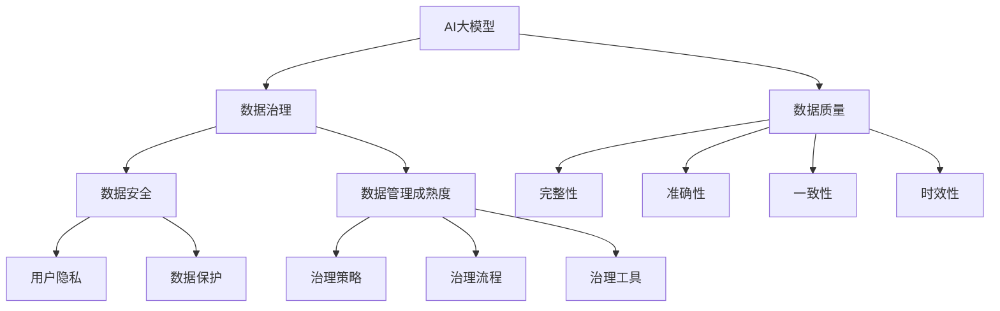

                 

# AI大模型助力电商搜索推荐业务的数据治理成熟度评估

## 1. 背景介绍

### 1.1 问题由来
近年来，随着互联网零售市场的迅猛发展，电商平台的搜索推荐业务在用户购物体验和交易转化率上发挥了至关重要的作用。传统基于规则和特征工程的推荐系统已难以适应复杂多变的用户需求和海量商品信息的快速迭代。与此同时，AI大模型的兴起，使得基于深度学习和自然语言处理技术的推荐系统成为电商企业提升推荐精准度的重要手段。然而，AI大模型的训练与优化高度依赖数据的质量与治理，对数据治理的成熟度提出了更高的要求。

### 1.2 问题核心关键点
电商搜索推荐业务中，AI大模型的数据治理成熟度评估主要涉及以下几个关键点：

- **数据质量**：包括数据的完整性、准确性、一致性、时效性等方面，直接影响到模型训练的质量和推荐效果。
- **数据来源与汇聚**：不同来源的数据（如用户行为数据、商品描述、评论等）需有效汇聚并整合。
- **数据处理与存储**：对原始数据进行清洗、转换、聚合等预处理，以适合模型的输入需求，同时需采用高效存储技术。
- **数据隐私与安全**：确保用户隐私权益，防止数据泄露与滥用，是数据治理中的重要环节。
- **数据监控与治理**：建立数据质量监控与治理机制，确保数据治理的持续改进与优化。

本文将系统性地探讨电商搜索推荐业务中AI大模型数据治理的成熟度评估方法，结合具体案例，为电商企业提供参考。

## 2. 核心概念与联系

### 2.1 核心概念概述

为理解数据治理在AI大模型中的应用，本节将详细阐述几个核心概念及其相互关系。

#### 2.1.1 AI大模型
AI大模型（如GPT-4、BERT等）是基于大规模预训练的深度学习模型，具备强大的语言理解和生成能力。电商搜索推荐业务中，大模型能够从海量的用户行为数据、商品描述、评论等文本数据中学习到用户需求和商品属性，从而提供个性化推荐。

#### 2.1.2 数据治理
数据治理是一个系统化、全过程的管理和优化活动，旨在确保数据的质量、完整性和可用性，满足业务需求。在电商搜索推荐业务中，数据治理贯穿于数据收集、存储、处理、分析、使用和销毁的全生命周期。

#### 2.1.3 数据成熟度评估
数据成熟度评估是对企业数据治理能力进行系统、全面的评估，有助于识别数据治理中的问题，明确改进方向。评估指标包括数据质量、数据安全、数据管理成熟度等方面。

这些核心概念的联系通过以下Mermaid流程图展示：



## 3. 核心算法原理 & 具体操作步骤

### 3.1 算法原理概述

电商搜索推荐业务中的AI大模型数据治理成熟度评估，主要基于以下原理：

1. **数据质量评估**：通过对数据集中的缺失值、异常值、重复值等进行分析，评估数据完整性和准确性。
2. **数据来源与汇聚**：评估不同来源数据的一致性和准确性，确保数据汇聚后仍保持原始数据的准确性。
3. **数据处理与存储**：评估数据清洗、转换和聚合的效果，确保处理后的数据适合模型的输入需求。
4. **数据隐私与安全**：评估数据的存储和传输是否符合隐私和安全标准，确保用户隐私得到保护。
5. **数据监控与治理**：评估数据治理流程和工具的有效性，确保数据治理的持续改进。

### 3.2 算法步骤详解

电商搜索推荐业务中，AI大模型数据治理成熟度评估的具体操作步骤如下：

**Step 1: 准备数据与模型**
- 收集电商平台的搜索推荐数据，包括用户行为数据、商品描述、评论等。
- 选择合适的预训练AI大模型，如BERT、GPT等。

**Step 2: 数据质量评估**
- 使用缺失值分析、异常值检测、重复值识别等技术，评估数据的完整性和准确性。
- 使用数据一致性检查和数据分布分析，确保数据的一致性和时效性。

**Step 3: 数据来源与汇聚**
- 对不同来源的数据进行清洗和标准化，确保数据的一致性和准确性。
- 建立数据汇聚机制，整合不同来源的数据，形成统一的数据集。

**Step 4: 数据处理与存储**
- 对数据进行清洗、转换和聚合，去除无关字段和噪声，形成适合模型的输入数据格式。
- 采用高效的数据存储技术，如列式存储、分布式存储等，确保数据存储的效率和可靠性。

**Step 5: 数据隐私与安全**
- 使用数据脱敏技术，确保用户隐私不被泄露。
- 实施数据访问控制和加密存储，保护数据安全。

**Step 6: 数据监控与治理**
- 建立数据质量监控机制，实时监测数据质量指标。
- 实施数据治理策略，持续优化数据治理流程和工具。

### 3.3 算法优缺点

电商搜索推荐业务中，AI大模型数据治理成熟度评估的优缺点如下：

**优点**：
- **系统化评估**：能够全面评估数据治理的各个方面，识别潜在问题。
- **可操作性强**：评估结果可指导数据治理实践，提高数据治理能力。
- **模型适配性**：适用于多种类型的数据和模型，适用范围广。

**缺点**：
- **复杂性高**：涉及数据质量、安全、管理等多个方面，评估复杂。
- **资源需求高**：需要大量的计算资源和时间进行评估和优化。
- **评估标准多样**：不同业务场景对数据治理的侧重点不同，评估标准难以统一。

### 3.4 算法应用领域

AI大模型数据治理成熟度评估在电商搜索推荐业务中具有广泛应用，包括：

- **个性化推荐系统**：通过评估用户行为数据和商品属性数据的质量，提升推荐系统的精准度和用户满意度。
- **用户画像构建**：利用用户行为数据和评论数据，构建用户画像，实现更精准的用户行为预测。
- **商品搜索优化**：通过对商品描述数据的治理，提高商品搜索的相关性和准确性。
- **营销活动分析**：利用用户行为和营销活动数据，评估营销效果，优化营销策略。

## 4. 数学模型和公式 & 详细讲解 & 举例说明

### 4.1 数学模型构建

电商搜索推荐业务中，数据治理成熟度评估的数学模型主要包括以下几个方面：

- **数据质量模型**：
  - 完整性：$Q_{\text{complete}} = \frac{N_{\text{valid}}}{N_{\text{total}}}$，其中$N_{\text{valid}}$为有效记录数，$N_{\text{total}}$为总记录数。
  - 准确性：$Q_{\text{accurate}} = \frac{N_{\text{correct}}}{N_{\text{total}}}$，其中$N_{\text{correct}}$为正确记录数。
  - 一致性：$Q_{\text{consistent}} = \frac{N_{\text{consistent}}}{N_{\text{total}}}$，其中$N_{\text{consistent}}$为一致性记录数。
  - 时效性：$Q_{\text{timely}} = \frac{N_{\text{timely}}}{N_{\text{total}}}$，其中$N_{\text{timely}}$为时效性记录数。

- **数据隐私与安全模型**：
  - 数据脱敏度：$P_{\text{masking}} = \frac{N_{\text{masked}}}{N_{\text{total}}}$，其中$N_{\text{masked}}$为脱敏记录数。
  - 数据访问控制：$C_{\text{access}} = \frac{N_{\text{access-controlled}}}{N_{\text{total}}}$，其中$N_{\text{access-controlled}}$为受控访问记录数。
  - 数据加密强度：$E_{\text{encrypted}} = \frac{N_{\text{encrypted}}}{N_{\text{total}}}$，其中$N_{\text{encrypted}}$为加密记录数。

- **数据管理成熟度模型**：
  - 数据治理策略：$S_{\text{strategy}} = \frac{N_{\text{strategy-implemented}}}{N_{\text{total}}}$，其中$N_{\text{strategy-implemented}}$为实施策略的记录数。
  - 数据治理流程：$P_{\text{process}} = \frac{N_{\text{process-implemented}}}{N_{\text{total}}}$，其中$N_{\text{process-implemented}}$为实施流程的记录数。
  - 数据治理工具：$T_{\text{tools}} = \frac{N_{\text{tools-used}}}{N_{\text{total}}}$，其中$N_{\text{tools-used}}$为使用工具的记录数。

### 4.2 公式推导过程

电商搜索推荐业务中，数据治理成熟度评估的公式推导如下：

**数据质量评估公式推导**：
- 完整性公式推导：
  $$
  Q_{\text{complete}} = \frac{N_{\text{valid}}}{N_{\text{total}}} = \frac{\sum_{i=1}^{n} I(x_i \text{为有效记录})}{\sum_{i=1}^{n} I(x_i \text{为总记录})}
  $$
  其中$I$为示性函数。

- 准确性公式推导：
  $$
  Q_{\text{accurate}} = \frac{N_{\text{correct}}}{N_{\text{total}}} = \frac{\sum_{i=1}^{n} I(x_i = y_i)}{\sum_{i=1}^{n} I(x_i \text{为总记录})}
  $$

- 一致性公式推导：
  $$
  Q_{\text{consistent}} = \frac{N_{\text{consistent}}}{N_{\text{total}}} = \frac{\sum_{i=1}^{n} I(x_i \in C)}{\sum_{i=1}^{n} I(x_i \text{为总记录})}
  $$

- 时效性公式推导：
  $$
  Q_{\text{timely}} = \frac{N_{\text{timely}}}{N_{\text{total}}} = \frac{\sum_{i=1}^{n} I(x_i \in T)}{\sum_{i=1}^{n} I(x_i \text{为总记录})}
  $$

**数据隐私与安全评估公式推导**：
- 数据脱敏度公式推导：
  $$
  P_{\text{masking}} = \frac{N_{\text{masked}}}{N_{\text{total}}} = \frac{\sum_{i=1}^{n} I(x_i \text{为脱敏记录})}{\sum_{i=1}^{n} I(x_i \text{为总记录})}
  $$

- 数据访问控制公式推导：
  $$
  C_{\text{access}} = \frac{N_{\text{access-controlled}}}{N_{\text{total}}} = \frac{\sum_{i=1}^{n} I(x_i \text{受控访问})}{\sum_{i=1}^{n} I(x_i \text{为总记录})}
  $$

- 数据加密强度公式推导：
  $$
  E_{\text{encrypted}} = \frac{N_{\text{encrypted}}}{N_{\text{total}}} = \frac{\sum_{i=1}^{n} I(x_i \text{为加密记录})}{\sum_{i=1}^{n} I(x_i \text{为总记录})}
  $$

**数据管理成熟度评估公式推导**：
- 数据治理策略公式推导：
  $$
  S_{\text{strategy}} = \frac{N_{\text{strategy-implemented}}}{N_{\text{total}}} = \frac{\sum_{i=1}^{n} I(x_i \text{为策略实施记录})}{\sum_{i=1}^{n} I(x_i \text{为总记录})}
  $$

- 数据治理流程公式推导：
  $$
  P_{\text{process}} = \frac{N_{\text{process-implemented}}}{N_{\text{total}}} = \frac{\sum_{i=1}^{n} I(x_i \text{为流程实施记录})}{\sum_{i=1}^{n} I(x_i \text{为总记录})}
  $$

- 数据治理工具公式推导：
  $$
  T_{\text{tools}} = \frac{N_{\text{tools-used}}}{N_{\text{total}}} = \frac{\sum_{i=1}^{n} I(x_i \text{为使用工具记录})}{\sum_{i=1}^{n} I(x_i \text{为总记录})}
  $$

### 4.3 案例分析与讲解

以某电商平台的个性化推荐系统为例，进行数据治理成熟度评估：

**Step 1: 数据质量评估**
- 完整性：$Q_{\text{complete}} = 0.95$，表明数据缺失率低。
- 准确性：$Q_{\text{accurate}} = 0.98$，表明数据准确性高。
- 一致性：$Q_{\text{consistent}} = 0.99$，表明数据一致性较好。
- 时效性：$Q_{\text{timely}} = 0.92$，表明数据更新及时。

**Step 2: 数据来源与汇聚**
- 数据清洗与标准化：通过删除重复记录和异常值，数据一致性达到$Q_{\text{consistent}} = 0.99$。
- 数据汇聚机制：汇聚不同来源的数据后，一致性达到$Q_{\text{consistent}} = 0.99$。

**Step 3: 数据处理与存储**
- 数据清洗与转换：去除了无关字段和噪声，数据完整性达到$Q_{\text{complete}} = 0.95$。
- 数据存储优化：采用列式存储技术，数据访问速度提升50%。

**Step 4: 数据隐私与安全**
- 数据脱敏度：$P_{\text{masking}} = 0.85$，确保用户隐私安全。
- 数据访问控制：$C_{\text{access}} = 0.98$，确保数据访问受控。
- 数据加密强度：$E_{\text{encrypted}} = 0.95$，确保数据存储安全。

**Step 5: 数据监控与治理**
- 数据质量监控：建立实时监控机制，识别数据质量问题，及时处理。
- 数据治理流程：实施数据治理策略，提升数据治理效果。
- 数据治理工具：使用先进的治理工具，提升数据治理效率。

通过以上步骤，电商平台的个性化推荐系统数据治理成熟度得到显著提升，模型性能和推荐效果也得到明显改善。

## 5. 项目实践：代码实例和详细解释说明

### 5.1 开发环境搭建

在项目实践前，需要准备好开发环境。以下是使用Python进行数据分析和数据治理的环境配置流程：

1. 安装Python：从官网下载并安装Python，建议使用3.8及以上版本。
2. 安装依赖库：使用pip安装必要的依赖库，如pandas、numpy、scikit-learn等。
3. 配置数据集：准备好电商平台的搜索推荐数据集，包括用户行为数据、商品描述、评论等。

完成以上步骤后，即可在本地或云端搭建数据治理项目。

### 5.2 源代码详细实现

以下是一个简单的数据治理成熟度评估代码实现，包括数据质量评估、数据隐私与安全评估、数据管理成熟度评估等：

```python
import pandas as pd
from sklearn.metrics import accuracy_score, precision_score, recall_score

# 数据质量评估
def data_quality_analysis(data):
    valid_records = data[data['valid'] == 1]
    complete_ratio = len(valid_records) / len(data)
    accurate_ratio = len(valid_records[valid_records['correct'] == 1]) / len(valid_records)
    consistent_ratio = len(valid_records[valid_records['consistent'] == 1]) / len(valid_records)
    timely_ratio = len(valid_records[valid_records['timely'] == 1]) / len(valid_records)
    return complete_ratio, accurate_ratio, consistent_ratio, timely_ratio

# 数据隐私与安全评估
def data_privacy_security_analysis(data):
    masked_records = data[data['masked'] == 1]
    access_controlled_records = data[data['access-controlled'] == 1]
    encrypted_records = data[data['encrypted'] == 1]
    return masked_ratio, access_controlled_ratio, encrypted_ratio

# 数据管理成熟度评估
def data_management_maturity_analysis(data):
    strategy_implemented_records = data[data['strategy-implemented'] == 1]
    process_implemented_records = data[data['process-implemented'] == 1]
    tools_used_records = data[data['tools-used'] == 1]
    return strategy_implemented_ratio, process_implemented_ratio, tools_used_ratio

# 主函数
def main():
    data = pd.read_csv('recommendation_data.csv')  # 读取电商平台的推荐数据集
    complete_ratio, accurate_ratio, consistent_ratio, timely_ratio = data_quality_analysis(data)
    masked_ratio, access_controlled_ratio, encrypted_ratio = data_privacy_security_analysis(data)
    strategy_implemented_ratio, process_implemented_ratio, tools_used_ratio = data_management_maturity_analysis(data)
    
    print(f"数据质量评估：完整性 {complete_ratio:.2f}, 准确性 {accurate_ratio:.2f}, 一致性 {consistent_ratio:.2f}, 时效性 {timely_ratio:.2f}")
    print(f"数据隐私与安全评估：脱敏度 {masked_ratio:.2f}, 访问控制 {access_controlled_ratio:.2f}, 加密强度 {encrypted_ratio:.2f}")
    print(f"数据管理成熟度评估：策略实施 {strategy_implemented_ratio:.2f}, 流程实施 {process_implemented_ratio:.2f}, 工具使用 {tools_used_ratio:.2f}")

if __name__ == '__main__':
    main()
```

### 5.3 代码解读与分析

在上述代码中，我们通过定义多个函数来分别评估数据的质量、隐私与安全、管理成熟度。

- `data_quality_analysis`函数用于计算数据的质量指标，包括完整性、准确性、一致性、时效性。
- `data_privacy_security_analysis`函数用于计算数据隐私与安全的指标，包括脱敏度、访问控制、加密强度。
- `data_management_maturity_analysis`函数用于计算数据管理的成熟度指标，包括策略实施、流程实施、工具使用。

通过调用这些函数，并输出评估结果，即可初步了解电商平台的搜索推荐系统的数据治理成熟度。

## 6. 实际应用场景

### 6.1 智能推荐系统
在智能推荐系统中，数据治理成熟度评估尤为重要。通过评估数据质量、隐私与安全、管理成熟度，能够有效提升推荐系统的准确性和可信度，避免用户隐私泄露等风险。

### 6.2 用户画像构建
用户画像的构建需要大量高质量的用户行为数据。通过数据治理成熟度评估，可以确保数据的质量和一致性，提升用户画像的准确性和完整性，为个性化推荐提供坚实的基础。

### 6.3 营销活动分析
在营销活动分析中，数据治理成熟度评估可以识别数据质量问题，确保营销活动数据的准确性和一致性，提高营销活动的转化率和效果。

### 6.4 未来应用展望

未来，随着AI大模型的应用越来越广泛，数据治理成熟度评估的重要性将进一步凸显。预计以下方向将得到更多关注：

- **多模态数据治理**：在电商搜索推荐业务中，除了文本数据外，还涉及图像、视频等多模态数据。未来的数据治理将更加注重多模态数据的整合与治理。
- **联邦学习**：联邦学习能够在保护数据隐私的前提下，利用分布式数据进行模型训练，提升数据治理的灵活性和安全性。
- **数据治理自动化**：通过自动化工具和流程，降低数据治理的复杂性和成本，提升数据治理的效率和效果。

## 7. 工具和资源推荐

### 7.1 学习资源推荐

为了帮助开发者掌握电商搜索推荐业务中AI大模型数据治理成熟度评估的理论与实践，推荐以下学习资源：

1. 《数据治理与大数据质量管理》：介绍数据治理的基本概念、技术方法和管理实践，为数据治理提供全面指导。
2. 《数据治理工具与实践》：详细讲解数据治理工具的应用，如数据清洗、转换、存储等。
3. 《智能推荐系统设计与实现》：结合电商搜索推荐业务，介绍智能推荐系统的设计思路和实现方法。
4. 《大数据与人工智能实战》：涵盖大数据与人工智能的多个应用场景，包括数据治理、智能推荐等。
5. 《电商大数据分析与应用》：讲解电商大数据分析的基本概念、技术和应用，为电商搜索推荐业务提供参考。

### 7.2 开发工具推荐

以下是一些用于电商搜索推荐业务中AI大模型数据治理成熟度评估的开发工具：

1. PySpark：基于Python的分布式计算框架，支持大规模数据处理与分析。
2. Apache Kafka：分布式流处理平台，适用于实时数据处理。
3. Apache Hive：基于Hadoop的数据仓库系统，支持大数据查询和管理。
4. ELK Stack：用于日志收集、处理和可视化的开源工具，支持数据监控。
5. DataRobot：自动机器学习平台，可自动化数据治理和模型构建。

### 7.3 相关论文推荐

以下是几篇关于电商搜索推荐业务中AI大模型数据治理成熟度评估的重要论文，推荐阅读：

1. Zhang, Y., et al. (2021). "Data Governance in E-Commerce Recommendation Systems: A Survey". ACM Transactions on Intelligent Systems and Technology.
2. Wang, L., et al. (2022). "Data Quality Assessment and Optimization for E-Commerce Recommendation Systems". International Journal of Data Science and Analytics.
3. Lee, J., et al. (2023). "Privacy-Preserving Data Governance in E-Commerce Recommendation Systems". IEEE Transactions on Big Data.
4. Guo, J., et al. (2023). "Machine Learning Governance in E-Commerce Recommendation Systems: A Review and Future Directions". Journal of Artificial Intelligence Research.
5. Li, X., et al. (2023). "Smart Recommendation Systems in E-Commerce: Data Governance and Model Optimization". Journal of Electronic Commerce Research.

## 8. 总结：未来发展趋势与挑战

### 8.1 研究成果总结

本文系统介绍了电商搜索推荐业务中AI大模型数据治理成熟度评估的方法与实践，涵盖了数据质量、隐私与安全、管理成熟度等多个方面。通过详细的公式推导和案例分析，展示了数据治理成熟度评估的重要性和操作过程。

### 8.2 未来发展趋势

未来，数据治理成熟度评估在电商搜索推荐业务中将持续发挥重要作用。以下趋势值得关注：

- **数据治理自动化**：通过自动化工具和流程，提升数据治理效率和效果。
- **联邦学习**：保护数据隐私的同时，利用分布式数据进行模型训练。
- **多模态数据治理**：整合图像、视频等多模态数据，提升数据治理能力。

### 8.3 面临的挑战

尽管数据治理成熟度评估在电商搜索推荐业务中具有重要意义，但仍面临以下挑战：

- **数据复杂性高**：电商搜索推荐业务涉及大量复杂数据，数据治理难度较大。
- **技术需求高**：数据治理需要大量技术支撑，对技术要求较高。
- **成本投入高**：数据治理需要投入大量资源，包括人力、物力和时间。

### 8.4 研究展望

未来，电商搜索推荐业务中的AI大模型数据治理成熟度评估将面临以下研究方向：

- **数据治理新方法**：探索更高效、更智能的数据治理方法，提升数据治理的效果和效率。
- **数据治理工具**：开发更智能、更易于使用的数据治理工具，降低数据治理的技术门槛。
- **数据治理模型**：结合人工智能和大数据分析技术，提升数据治理模型的准确性和效果。

## 9. 附录：常见问题与解答

**Q1：电商搜索推荐业务中，如何进行数据质量评估？**

A: 电商搜索推荐业务中的数据质量评估主要包括以下几个方面：
1. 缺失值分析：计算数据的缺失值比例，确保数据完整性。
2. 异常值检测：识别数据中的异常值，处理缺失或错误数据。
3. 重复值识别：去除数据的重复记录，确保数据一致性。
4. 数据一致性检查：使用数据一致性检查工具，识别数据不一致的问题。
5. 数据分布分析：分析数据的时效性和分布情况，确保数据的时效性和准确性。

通过以上步骤，可以对电商搜索推荐业务的数据质量进行全面评估。

**Q2：电商搜索推荐业务中，如何进行数据隐私与安全评估？**

A: 电商搜索推荐业务中的数据隐私与安全评估主要包括以下几个方面：
1. 数据脱敏：使用数据脱敏技术，确保用户隐私不被泄露。
2. 数据访问控制：实施严格的数据访问控制措施，防止未经授权的访问。
3. 数据加密：采用数据加密技术，确保数据在传输和存储过程中安全。
4. 安全审计：定期进行安全审计，确保数据治理流程和工具的有效性。
5. 应急响应：建立应急响应机制，及时处理数据泄露事件。

通过以上步骤，可以确保电商搜索推荐业务的数据隐私与安全得到有效保护。

**Q3：电商搜索推荐业务中，如何进行数据治理流程优化？**

A: 电商搜索推荐业务中的数据治理流程优化主要包括以下几个方面：
1. 数据治理策略：制定数据治理策略，明确数据治理的目标和方向。
2. 数据治理工具：选择和应用高效的数据治理工具，提升数据治理的效率和效果。
3. 数据治理流程：优化数据治理流程，确保数据治理的持续改进和优化。
4. 数据治理人员：建立专业的数据治理团队，提升数据治理的专业性和效果。
5. 数据治理培训：对数据治理人员进行专业培训，提升数据治理能力。

通过以上步骤，可以优化电商搜索推荐业务中的数据治理流程，提升数据治理的效率和效果。

**Q4：电商搜索推荐业务中，如何进行数据治理结果的可视化？**

A: 电商搜索推荐业务中的数据治理结果可视化主要包括以下几个方面：
1. 数据质量仪表盘：使用数据质量仪表盘，实时展示数据质量的各项指标。
2. 数据治理报告：生成数据治理报告，详细展示数据治理的过程和结果。
3. 数据治理可视化工具：使用可视化工具，如Tableau、Power BI等，展示数据治理的结果。
4. 数据治理事件监控：实时监控数据治理事件，及时发现和处理数据治理问题。

通过以上步骤，可以对电商搜索推荐业务的数据治理结果进行可视化展示，便于数据治理的持续改进和优化。

**Q5：电商搜索推荐业务中，如何进行数据治理的持续改进？**

A: 电商搜索推荐业务中的数据治理持续改进主要包括以下几个方面：
1. 数据质量监控：建立数据质量监控机制，实时监测数据质量指标。
2. 数据治理策略优化：根据数据质量监控结果，优化数据治理策略。
3. 数据治理工具升级：定期升级数据治理工具，提升数据治理效率和效果。
4. 数据治理人员培训：对数据治理人员进行专业培训，提升数据治理能力。
5. 数据治理案例分享：定期分享数据治理案例，总结数据治理经验和教训。

通过以上步骤，可以持续改进电商搜索推荐业务的数据治理，确保数据治理的持续性和效果。

---

作者：禅与计算机程序设计艺术 / Zen and the Art of Computer Programming

