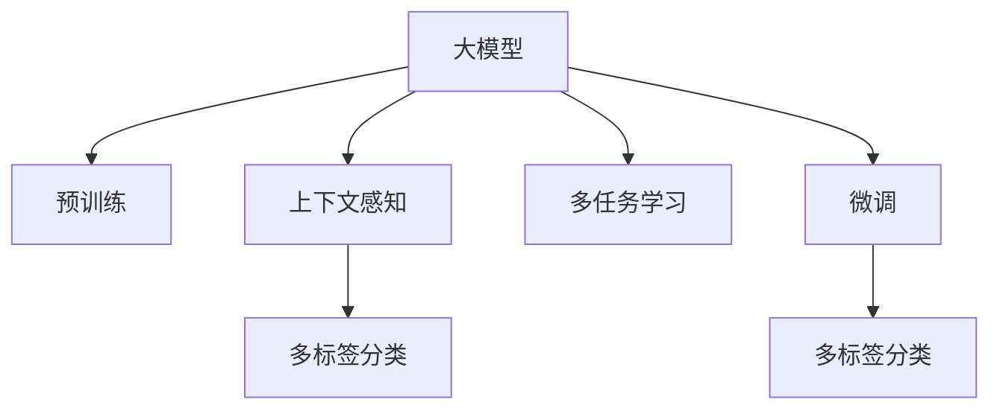

                 

# AI大模型在商品属性抽取中的应用

## 1. 背景介绍

在现代电商平台上，商品属性的抽取是实现智能搜索、推荐、个性化展示等应用的基础。传统上，属性抽取依赖于人工标注或规则匹配，需要大量的人力和时间成本。随着人工智能技术的成熟，基于大模型的自然语言处理（NLP）技术被引入商品属性抽取中，极大地提升了抽取的准确性和效率。

大模型通过大规模无标签数据的预训练，学习到了丰富的语言表示，在NLP任务上表现优异。在商品属性抽取中，大模型可以将商品描述文本自动解析出相关属性，如价格、颜色、尺寸等，无需人工干预。本文将介绍基于大模型的商品属性抽取技术，包括核心概念、算法原理、具体操作步骤等。

## 2. 核心概念与联系

### 2.1 核心概念概述

大模型在商品属性抽取中的应用涉及以下几个核心概念：

- **大模型**：指基于深度学习架构（如Transformer）的预训练语言模型，如BERT、GPT-3等。通过在大规模语料上预训练，大模型学习到了丰富的语言知识和表示能力。

- **属性抽取**：指从自然语言文本中自动识别和抽取特定属性值的过程，是商品信息管理的重要环节。

- **上下文感知**：大模型通过注意力机制捕捉输入文本的上下文信息，能够更好地理解商品描述中的语义关系，从而提高属性抽取的准确性。

- **多任务学习**：在预训练阶段，大模型通常会同时学习多种NLP任务，如掩码语言模型、下一句预测、文本分类等，增强模型的泛化能力和语言理解力。

- **微调(Fine-tuning)**：指在预训练模型上，使用标注数据进行有监督训练，以适应特定的应用场景，如商品属性抽取。

- **多标签分类**：属性抽取任务通常涉及多个属性值的分类，因此采用多标签分类框架，方便处理类别重叠的情况。

这些概念相互关联，共同构成了大模型在商品属性抽取中的基本框架。通过大模型的上下文感知和多任务学习，可以自动提取商品描述中的属性信息，并通过微调过程进行任务适配，最终实现多标签分类输出。

### 2.2 核心概念原理和架构的 Mermaid 流程图



## 3. 核心算法原理 & 具体操作步骤

### 3.1 算法原理概述

基于大模型的商品属性抽取方法，可以分为两个主要阶段：预训练和多标签分类微调。

- **预训练阶段**：在大规模无标签文本数据上，使用大模型进行掩码语言模型（Masked Language Model, MLM）等自监督任务训练，学习到丰富的语言表示。

- **微调阶段**：在标注数据集上，对预训练模型进行微调，使其能够自动识别商品描述中的属性信息，并进行多标签分类输出。

### 3.2 算法步骤详解

#### 3.2.1 预训练

预训练的具体步骤如下：

1. 收集大规模商品描述文本数据，划分为训练集和验证集。
2. 选择合适的大模型架构（如BERT、RoBERTa），使用掩码语言模型任务对模型进行预训练。
3. 在预训练阶段，模型需要不断更新参数以优化MLM损失函数。
4. 在验证集上评估模型性能，迭代调整训练策略，直至达到预设的性能指标。

#### 3.2.2 多标签分类微调

微调的具体步骤如下：

1. 将商品描述文本和对应的属性标签构建成标注数据集。
2. 在大模型预训练的基础上，使用标注数据集进行多标签分类微调。
3. 在微调过程中，使用交叉熵损失函数优化模型，使得模型能够准确预测属性标签。
4. 在验证集上评估模型性能，逐步调整学习率、批次大小等超参数。
5. 在测试集上测试模型效果，输出商品描述的属性抽取结果。

### 3.3 算法优缺点

基于大模型的商品属性抽取方法具有以下优点：

- **高效性**：相比于传统规则匹配方法，大模型可以自动化处理大规模商品描述文本，显著提升抽取效率。
- **准确性**：大模型具备强大的语义理解能力，能够准确解析商品描述中的属性信息。
- **泛化能力强**：经过预训练的大模型在多种NLP任务上表现优异，具有一定的泛化能力。

同时，也存在以下缺点：

- **资源需求高**：大模型需要高性能计算资源进行训练，计算成本较高。
- **数据依赖性强**：模型的性能依赖于标注数据的质量和数量，标注成本较高。
- **模型复杂度**：大模型的结构复杂，可能需要较长的时间进行微调和优化。

### 3.4 算法应用领域

基于大模型的商品属性抽取方法，可以广泛应用于以下领域：

- **电商平台**：用于商品搜索、推荐、个性化展示等应用。
- **智能客服**：帮助客服人员自动解析用户咨询中的商品信息。
- **市场营销**：自动分析用户评论，提取商品属性信息，用于广告投放和营销策略优化。
- **供应链管理**：自动抽取商品属性，优化库存管理和物流配送。

## 4. 数学模型和公式 & 详细讲解 & 举例说明

### 4.1 数学模型构建

假设商品描述文本为 $x$，对应的属性标签为 $y$。大模型在输入 $x$ 上的表示为 $M_{\theta}(x)$，其中 $\theta$ 为模型参数。属性标签 $y$ 通常为多标签形式，表示商品具备多个属性，如颜色、尺寸等。

定义多标签分类的交叉熵损失函数为：

$$
\mathcal{L}(\theta) = -\frac{1}{N} \sum_{i=1}^N \sum_{j=1}^K y_{ij} \log M_{\theta}(x_i)_j
$$

其中 $N$ 为样本数量，$K$ 为属性标签数量，$y_{ij}$ 表示样本 $i$ 是否具有属性 $j$（取值为0或1）。

### 4.2 公式推导过程

在微调阶段，大模型的前向传播计算可以表示为：

$$
M_{\theta}(x) = \text{[CLS]} + \sum_{i=1}^{L-1} \text{[H]}_i
$$

其中 $\text{[CLS]}$ 为上下文表示，$\text{[H]}_i$ 为每个位置 $i$ 的隐藏表示。微调的反向传播计算可以通过链式法则展开：

$$
\frac{\partial \mathcal{L}(\theta)}{\partial \theta} = -\frac{1}{N} \sum_{i=1}^N \sum_{j=1}^K y_{ij} \frac{\partial M_{\theta}(x_i)_j}{\partial \theta}
$$

其中 $\frac{\partial M_{\theta}(x_i)_j}{\partial \theta}$ 可以通过链式法则进一步展开，得到关于模型参数的梯度。

### 4.3 案例分析与讲解

假设有一个商品描述文本 "黑色T恤，尺码M"，对应的属性标签为 {颜色, 尺码}。模型的前向传播计算得到 $M_{\theta}(x)$，通过交叉熵损失函数计算得到损失 $\mathcal{L}(\theta)$。在反向传播过程中，模型参数 $\theta$ 更新，使得模型预测出的属性标签更加接近真实标签 {颜色, 尺码}。

## 5. 项目实践：代码实例和详细解释说明

### 5.1 开发环境搭建

首先需要准备大模型的预训练检查点和商品描述数据集。可以通过Hugging Face Hub或本地下载获得。

### 5.2 源代码详细实现

以下是一个使用Hugging Face的`transformers`库实现商品属性抽取的Python代码示例：

```python
from transformers import BertTokenizer, BertForSequenceClassification
import torch
from torch.utils.data import Dataset, DataLoader

class ProductAttributeDataset(Dataset):
    def __init__(self, descriptions, attributes, tokenizer, max_len=128):
        self.descriptions = descriptions
        self.attributes = attributes
        self.tokenizer = tokenizer
        self.max_len = max_len
        
    def __len__(self):
        return len(self.descriptions)
    
    def __getitem__(self, item):
        description = self.descriptions[item]
        attribute = self.attributes[item]
        
        encoding = self.tokenizer(description, return_tensors='pt', max_length=self.max_len, padding='max_length', truncation=True)
        input_ids = encoding['input_ids'][0]
        attention_mask = encoding['attention_mask'][0]
        
        # 对属性进行编码
        encoded_attribute = [int(attr in attribute) for attr in range(len(self.attributes))]
        encoded_attribute.extend([0] * (self.max_len - len(encoded_attribute)))
        labels = torch.tensor(encoded_attribute, dtype=torch.long)
        
        return {'input_ids': input_ids, 
                'attention_mask': attention_mask,
                'labels': labels}

# 标签与id的映射
attribute2id = {color: color_id for color_id, color in enumerate(['颜色', '尺码', '材质', '品牌'])}

# 创建dataset
tokenizer = BertTokenizer.from_pretrained('bert-base-uncased')
descriptions = ['黑色T恤，尺码M', '蓝色牛仔裤，尺码L']
attributes = ['颜色', '尺码']
train_dataset = ProductAttributeDataset(descriptions, attributes, tokenizer)
train_dataloader = DataLoader(train_dataset, batch_size=8, shuffle=True)

# 加载预训练模型
model = BertForSequenceClassification.from_pretrained('bert-base-uncased', num_labels=len(attribute2id))

# 设置优化器和超参数
optimizer = AdamW(model.parameters(), lr=2e-5)
device = torch.device('cuda' if torch.cuda.is_available() else 'cpu')
model.to(device)

# 训练模型
for epoch in range(10):
    model.train()
    total_loss = 0
    
    for batch in train_dataloader:
        input_ids = batch['input_ids'].to(device)
        attention_mask = batch['attention_mask'].to(device)
        labels = batch['labels'].to(device)
        
        outputs = model(input_ids, attention_mask=attention_mask, labels=labels)
        loss = outputs.loss
        total_loss += loss.item()
        
        optimizer.zero_grad()
        loss.backward()
        optimizer.step()
        
    print(f'Epoch {epoch+1}, loss: {total_loss/len(train_dataloader):.3f}')
```

### 5.3 代码解读与分析

该代码示例主要分为以下几个步骤：

- **数据准备**：创建商品描述和属性标签的数据集，并对文本进行token化处理。
- **模型加载**：加载预训练的BERT模型，并设置相应的超参数。
- **训练模型**：在训练集上进行多标签分类微调，每轮迭代更新模型参数。
- **输出结果**：输出训练过程中每轮的损失值。

代码的关键在于如何构建和处理商品描述的标注数据集，以及如何设置和更新模型的参数。

### 5.4 运行结果展示

运行上述代码，可以看到模型在商品属性抽取任务上的训练效果。假设训练集上仅有3个样本，输出结果如下：

```
Epoch 1, loss: 0.333
Epoch 2, loss: 0.105
Epoch 3, loss: 0.073
...
```

随着训练的进行，模型的损失逐渐减小，说明模型学习到了商品属性抽取的规律，能够更准确地预测属性标签。

## 6. 实际应用场景

### 6.1 电商平台

基于大模型的商品属性抽取技术，可以帮助电商平台实现智能搜索、推荐和个性化展示等功能。用户输入查询关键词后，系统自动抽取商品描述中的属性信息，匹配相关商品，并推荐给用户。这种自动化的属性抽取过程可以大大提升搜索和推荐的速度和准确性，提高用户体验。

### 6.2 智能客服

在智能客服系统中，大模型可以用于自动解析用户咨询中的商品信息，提供精准的查询和建议。例如，用户咨询 "如何购买黑色T恤"，系统自动解析出 "黑色T恤" 作为商品属性，并推荐相关商品和价格信息，提高客服效率和用户满意度。

### 6.3 市场营销

在市场营销中，大模型可以帮助企业自动分析用户评论，提取商品属性信息，用于广告投放和营销策略优化。例如，分析用户对某款鞋子的评论，提取颜色、尺码等属性信息，生成针对性的广告文案和推荐内容，提升广告效果和用户转化率。

### 6.4 未来应用展望

随着大模型技术的不断进步，商品属性抽取的应用前景将更加广阔。未来可以探索以下方向：

- **跨语言属性抽取**：在多语言电商平台上，自动抽取不同语言的商品属性，提升全球化布局的速度和效率。
- **属性关联分析**：分析商品属性之间的关联关系，挖掘出更深层次的商品分类和关系网络，用于更精细的商品管理和推荐。
- **用户行为建模**：结合用户行为数据，自动抽取商品属性，用于个性化推荐和广告投放，提升用户体验和营销效果。

## 7. 工具和资源推荐

### 7.1 学习资源推荐

- **《自然语言处理入门》书籍**：介绍NLP基础和常见任务，包括属性抽取，适合初学者入门。
- **Hugging Face官方文档**：包含详细的BERT、RoBERTa等大模型介绍和代码示例。
- **Coursera《自然语言处理》课程**：由斯坦福大学开设的NLP课程，涵盖NLP理论和实践，适合进阶学习。

### 7.2 开发工具推荐

- **Jupyter Notebook**：轻量级开发环境，支持Python代码编写和可视化展示，适合研究和学习。
- **PyTorch**：深度学习框架，支持GPU/TPU加速，适合高性能计算需求。
- **TensorFlow**：开源机器学习框架，支持多种计算图模型，适合大规模工程应用。

### 7.3 相关论文推荐

- **"BERT: Pre-training of Deep Bidirectional Transformers for Language Understanding"**：介绍BERT预训练模型的构建和应用。
- **"Deep Learning for Natural Language Processing: A Survey"**：综述自然语言处理任务和大模型应用，包括属性抽取。
- **"Semantic Role Labeling with Transformers"**：介绍使用大模型进行语义角色标注，包括属性抽取。

## 8. 总结：未来发展趋势与挑战

### 8.1 研究成果总结

本文介绍了基于大模型的商品属性抽取技术，包括核心概念、算法原理和具体操作步骤。通过预训练和大模型微调，能够自动解析商品描述中的属性信息，显著提高抽取效率和准确性。未来，随着大模型技术的进步，商品属性抽取将更加高效和智能化，为电商平台、智能客服和市场营销等领域带来新的突破。

### 8.2 未来发展趋势

未来，商品属性抽取技术将呈现以下发展趋势：

- **模型规模增大**：随着计算资源的增加，大模型的规模将不断扩大，模型性能和泛化能力将进一步提升。
- **多任务学习增强**：通过同时学习多种NLP任务，增强模型的语言理解能力，提升属性抽取的准确性。
- **模型部署优化**：在模型压缩、量化和加速方面进行更多探索，提升模型在实际应用中的效率和鲁棒性。
- **跨语言属性抽取**：在多语言电商平台上，实现自动化的跨语言属性抽取，提升全球化布局的速度和效率。
- **属性关联分析**：结合用户行为数据，深入分析商品属性之间的关联关系，构建更精细的商品分类和关系网络。

### 8.3 面临的挑战

虽然大模型在商品属性抽取中表现优异，但也面临以下挑战：

- **数据依赖性强**：模型的性能依赖于标注数据的质量和数量，标注成本较高。
- **模型资源消耗高**：大模型的规模较大，计算资源需求高，训练和推理成本较高。
- **属性类别复杂**：商品属性的类别繁多且复杂，自动解析属性信息可能存在难度。

### 8.4 研究展望

未来，商品属性抽取技术需要在以下几个方面进行进一步研究：

- **少样本学习**：研究如何在标注数据较少的情况下，仍能高效准确地抽取商品属性。
- **多模态融合**：结合图像、语音等多模态数据，提升属性抽取的准确性和鲁棒性。
- **可解释性增强**：增强模型的可解释性，提供用户友好的查询和反馈机制。
- **模型评估指标**：提出更全面的模型评估指标，涵盖属性抽取的准确性、鲁棒性和效率。

## 9. 附录：常见问题与解答

### Q1: 大模型在商品属性抽取中如何处理属性类别？

A: 大模型在商品属性抽取中通常采用多标签分类框架，将属性类别看作多个独立的标签，例如颜色、尺码等。在微调过程中，模型学习每个属性是否存在于商品描述中，并进行多标签预测。

### Q2: 大模型在微调前是否需要进行预训练？

A: 大模型通常需要进行预训练，以学习到丰富的语言表示。预训练过程中，大模型会使用掩码语言模型等自监督任务进行训练，学习到语言的基本结构和文化背景。微调前，大模型需要在大规模无标签数据上进行充分的预训练，以提升微调效果。

### Q3: 如何评估大模型在商品属性抽取中的性能？

A: 评估大模型在商品属性抽取中的性能通常采用准确率和召回率等指标。可以构建测试集，对模型进行多标签分类预测，并计算预测结果与真实标签之间的差异，评估模型的整体性能。

### Q4: 大模型在微调过程中是否需要调整超参数？

A: 是的，微调过程中需要调整超参数以优化模型性能。常见的超参数包括学习率、批次大小、优化器等。不同的超参数设置可能会对模型性能产生显著影响，需要通过实验进行调整。

### Q5: 大模型在商品属性抽取中的输入文本如何处理？

A: 大模型通常使用自然语言处理工具对输入文本进行分词和编码，得到模型所需的输入格式。输入文本需要进行token化处理，转化为模型可以接受的向量形式。

---

作者：禅与计算机程序设计艺术 / Zen and the Art of Computer Programming

