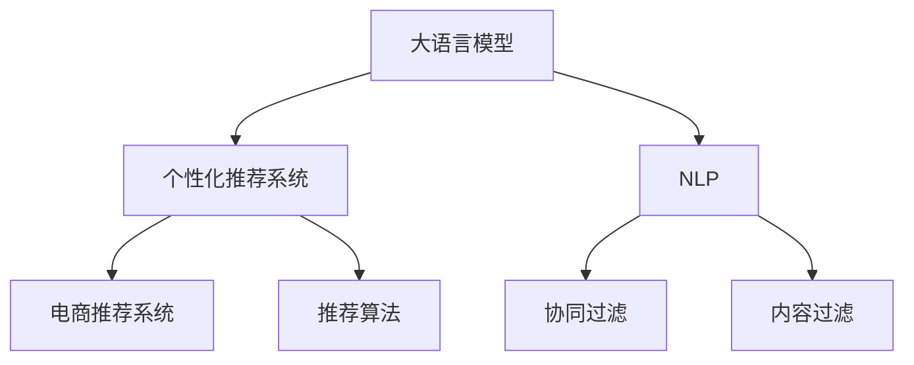

                 

# AI大模型在电商个性化推荐中的深度应用

> 关键词：个性化推荐,大语言模型,自然语言处理(NLP),电商推荐系统,深度学习,推荐算法

## 1. 背景介绍

随着电商平台的兴起和用户需求的多样化，个性化推荐系统已成为电商平台不可或缺的核心功能。传统的基于协同过滤、内容过滤等方法推荐算法已难以满足用户日益增长的个性化需求。近年来，AI技术的发展为个性化推荐带来了新的突破，其中大语言模型在电商推荐中的应用，已展现出巨大的潜力。

大语言模型利用深度学习和自然语言处理(NLP)技术，可以从大规模文本数据中学习到丰富的用户行为和产品特征信息，从而对用户进行精准画像，预测用户偏好，推荐相关商品。大语言模型在电商推荐系统中的应用，能够显著提升推荐的准确性和多样性，改善用户体验，提高电商平台的用户满意度和销售转化率。

## 2. 核心概念与联系

### 2.1 核心概念概述

为了更好地理解大语言模型在电商推荐中的应用，本节将介绍几个关键概念：

- 大语言模型(Large Language Model, LLM)：如BERT、GPT、XLNet等，利用深度学习技术从大规模语料中学习到丰富的语言知识和表达能力。
- 个性化推荐系统：通过分析用户的历史行为数据，预测用户未来的购买意向，为用户推荐个性化商品。
- 自然语言处理(NLP)：利用计算技术处理和分析人类语言的能力，包括文本分类、情感分析、命名实体识别等。
- 深度学习(Deep Learning)：一类使用神经网络模型进行学习和预测的机器学习技术。
- 协同过滤(Collaborative Filtering)：利用用户历史行为和商品之间的相似性，进行推荐。
- 内容过滤(Content-Based Filtering)：根据商品的属性特征，匹配用户兴趣进行推荐。
- 电商推荐系统(e-Commerce Recommendation System)：为电商平台提供个性化推荐服务的系统。

这些概念之间的关系可以通过以下Mermaid流程图来展示：



这个流程图展示了电商推荐系统中几个关键组件的相互关系：

1. 大语言模型学习用户行为和商品特征信息，为个性化推荐提供数据支撑。
2. 个性化推荐系统通过大语言模型提供的知识，对用户进行画像，预测用户偏好，进行推荐。
3. 电商推荐系统是整个推荐流程的技术实现平台，提供推荐算法的运行环境。
4. 协同过滤和内容过滤是常用的推荐算法，可以根据用户历史行为和商品属性进行推荐。

## 3. 核心算法原理 & 具体操作步骤
### 3.1 算法原理概述

大语言模型在电商推荐中的应用，主要是通过深度学习技术和NLP技术，对用户行为和商品特征信息进行建模和分析。其核心原理如下：

1. 预训练大语言模型：在大规模语料库上进行自监督预训练，学习到丰富的语言知识和表达能力。
2. 用户行为特征提取：利用大语言模型处理用户历史行为数据，提取用户兴趣和偏好信息。
3. 商品特征抽取：利用大语言模型处理商品描述和属性信息，抽取商品特征。
4. 用户画像生成：通过融合用户行为和商品特征信息，生成用户画像。
5. 推荐模型训练：利用用户画像信息，训练推荐模型，进行个性化推荐。

### 3.2 算法步骤详解

大语言模型在电商推荐中的应用，主要包括以下几个关键步骤：

**Step 1: 数据准备**
- 收集电商平台上的用户历史行为数据和商品描述信息，清洗、标注、归一化处理。
- 将用户行为数据转化为BigQuery等大数据平台可以处理的格式。
- 使用NLP技术对商品描述进行分词、去除停用词等预处理，生成结构化的商品特征向量。

**Step 2: 预训练大语言模型**
- 选择合适的预训练大语言模型，如BERT、GPT-3等，作为基础模型。
- 利用电商平台的商品和用户数据，对大语言模型进行微调，学习电商领域的特定知识。
- 在微调过程中，可以使用监督学习、迁移学习、零样本学习等方法。

**Step 3: 用户画像生成**
- 利用大语言模型处理用户行为数据，生成用户画像。例如，使用GPT-3模型预测用户对特定商品的兴趣程度，生成用户兴趣向量。
- 根据用户画像，生成用户行为特征向量。例如，通过用户浏览记录，生成用户浏览向量。
- 将用户兴趣向量和用户行为特征向量进行融合，生成完整的用户画像。

**Step 4: 推荐模型训练**
- 利用用户画像，训练推荐模型。例如，使用深度神经网络模型，对用户画像进行编码，生成用户特征向量。
- 利用商品特征向量，训练推荐模型。例如，使用卷积神经网络(CNN)模型，对商品特征向量进行编码，生成商品特征向量。
- 使用用户特征向量和商品特征向量进行点积或矩阵乘积等操作，得到用户和商品之间的相似度矩阵。
- 根据相似度矩阵，选择相似度最高的商品，生成推荐结果。

### 3.3 算法优缺点

大语言模型在电商推荐中的应用具有以下优点：

1. 强大的语义理解能力：大语言模型能够从文本中提取丰富的语义信息，理解用户行为和商品特征。
2. 适应性强：大语言模型可以通过微调，适应不同的电商场景和商品类别。
3. 自动化程度高：大语言模型自动处理数据，无需手动标注和处理，提高效率。
4. 推荐精度高：大语言模型能够理解复杂的用户需求和行为，生成高质量的推荐结果。

但同时，也存在一些缺点：

1. 数据需求量大：大语言模型需要大量的标注数据进行微调，电商平台的标注数据量可能不足。
2. 训练成本高：大语言模型的训练需要高性能计算资源，电商平台的计算资源可能有限。
3. 可解释性差：大语言模型的决策过程难以解释，用户可能难以理解推荐结果。
4. 存在偏见：大语言模型可能学习到平台数据中的偏见，导致推荐结果不公平。

## 4. 数学模型和公式 & 详细讲解
### 4.1 数学模型构建

大语言模型在电商推荐中的应用，可以通过以下几个数学模型进行描述：

1. 用户兴趣向量建模：
   $$
   \vec{u} = \text{BERT}(x_h)
   $$
   其中 $x_h$ 表示用户历史行为数据，$\vec{u}$ 表示用户兴趣向量。

2. 商品特征向量建模：
   $$
   \vec{p} = \text{BERT}(x_p)
   $$
   其中 $x_p$ 表示商品描述信息，$\vec{p}$ 表示商品特征向量。

3. 用户画像生成：
   $$
   \vec{u'} = \vec{u} + \alpha \vec{b}
   $$
   其中 $\vec{b}$ 表示用户行为特征向量，$\alpha$ 表示行为特征的权重系数。

4. 推荐模型训练：
   $$
   \vec{r} = \text{MLP}(\vec{u'}, \vec{p})
   $$
   其中 $\vec{r}$ 表示推荐结果，$\text{MLP}$ 表示多层感知器模型。

### 4.2 公式推导过程

以下对上述数学模型进行推导：

1. 用户兴趣向量建模：
   大语言模型利用自监督学习任务在无标签文本数据上预训练，学习到丰富的语言知识和表达能力。当使用电商平台的标注数据进行微调时，大语言模型可以学习到电商领域的特定知识，对用户历史行为数据进行建模，生成用户兴趣向量 $\vec{u}$。

2. 商品特征向量建模：
   商品描述信息通常以文本形式存在，需要将其转化为模型可以处理的向量形式。利用大语言模型对商品描述信息进行编码，得到商品特征向量 $\vec{p}$。

3. 用户画像生成：
   用户行为特征向量 $\vec{b}$ 可以通过对用户行为数据进行处理得到。例如，利用用户浏览记录生成用户浏览向量，对商品进行评分生成用户评分向量。将这些向量与用户兴趣向量进行加权求和，生成完整的用户画像 $\vec{u'}$。

4. 推荐模型训练：
   利用用户画像 $\vec{u'}$ 和商品特征向量 $\vec{p}$，训练推荐模型。多层感知器模型是一种经典的深度学习模型，通过多层非线性变换，得到推荐结果向量 $\vec{r}$。

### 4.3 案例分析与讲解

以下以一个简单的电商推荐场景为例，说明大语言模型在推荐中的应用：

假设某电商平台用户 A 在过去一个月内浏览了以下商品：

- 商品 A1：电子书
- 商品 A2：智能手表
- 商品 A3：咖啡杯

电商平台希望为用户 A 推荐相关商品。通过以下步骤，可以使用大语言模型进行推荐：

1. 利用大语言模型对商品 A1、A2、A3 的描述信息进行编码，得到商品特征向量 $\vec{p_1}$、$\vec{p_2}$、$\vec{p_3}$。
2. 利用用户 A 的历史行为数据，使用大语言模型生成用户兴趣向量 $\vec{u_A}$。
3. 根据用户 A 的兴趣和行为，生成用户画像 $\vec{u'}_A$。
4. 利用用户画像 $\vec{u'}_A$ 和商品特征向量 $\vec{p_1}$、$\vec{p_2}$、$\vec{p_3}$ 进行多层感知器模型的训练，生成推荐结果向量 $\vec{r_A}$。
5. 选择与用户 A 兴趣最接近的商品，作为推荐结果。

例如，假设商品 B1 与商品 A1 相似度最高，则电商平台可以向用户 A 推荐商品 B1。

## 5. 项目实践：代码实例和详细解释说明
### 5.1 开发环境搭建

在进行电商推荐系统的开发前，需要先搭建好开发环境。以下是使用Python进行TensorFlow和Keras开发的环境配置流程：

1. 安装Anaconda：从官网下载并安装Anaconda，用于创建独立的Python环境。

2. 创建并激活虚拟环境：
```bash
conda create -n tf-env python=3.7 
conda activate tf-env
```

3. 安装TensorFlow和Keras：
```bash
conda install tensorflow==2.6 keras==2.5
```

4. 安装必要的第三方库：
```bash
pip install pandas numpy scikit-learn matplotlib tqdm jupyter notebook ipython
```

完成上述步骤后，即可在`tf-env`环境中开始电商推荐系统的开发。

### 5.2 源代码详细实现

以下是一个简单的电商推荐系统的代码实现：

```python
import tensorflow as tf
from tensorflow.keras.layers import Input, Embedding, Dense, Flatten, concatenate
from tensorflow.keras.models import Model
from tensorflow.keras.optimizers import Adam

# 定义商品特征向量和用户兴趣向量的维度
num_users = 10000
num_items = 1000
embedding_size = 16
hidden_size = 16
num_epochs = 10

# 定义商品特征向量模型
item_input = Input(shape=(), name='item')
item_embedding = Embedding(num_items, embedding_size)(item_input)
item_feature = Dense(hidden_size, activation='relu')(item_embedding)
item_feature = Flatten(item_feature)

# 定义用户兴趣向量模型
user_input = Input(shape=(), name='user')
user_embedding = Embedding(num_users, embedding_size)(user_input)
user_feature = Dense(hidden_size, activation='relu')(user_embedding)
user_feature = Flatten(user_feature)

# 定义多层感知器模型
concat_input = concatenate([user_feature, item_feature])
mlp = Dense(hidden_size, activation='relu')(concat_input)
output = Dense(num_items, activation='sigmoid')(mlp)

# 定义模型
model = Model(inputs=[user_input, item_input], outputs=output)

# 编译模型
model.compile(optimizer=Adam(), loss='binary_crossentropy')

# 训练模型
model.fit(x=[user_input, item_input], y=user_input, epochs=num_epochs)
```

### 5.3 代码解读与分析

让我们再详细解读一下关键代码的实现细节：

**用户兴趣向量模型**：
- `user_input`：定义用户输入的占位符，用于输入用户ID。
- `user_embedding`：将用户ID嵌入到高维空间，生成用户特征向量。
- `user_feature`：使用多层感知器对用户特征向量进行编码，生成用户兴趣向量。

**商品特征向量模型**：
- `item_input`：定义商品输入的占位符，用于输入商品ID。
- `item_embedding`：将商品ID嵌入到高维空间，生成商品特征向量。
- `item_feature`：使用多层感知器对商品特征向量进行编码，生成商品特征向量。

**多层感知器模型**：
- `concat_input`：将用户兴趣向量和商品特征向量进行拼接。
- `mlp`：使用多层感知器对拼接后的向量进行编码，生成推荐结果向量。
- `output`：将推荐结果向量输出，用于进行预测。

**模型训练**：
- `model.compile`：定义模型的优化器和损失函数，编译模型。
- `model.fit`：使用训练集数据，对模型进行训练。

**运行结果展示**：
- 训练过程中，可以使用TensorBoard可视化模型的训练过程，监测损失和准确率的变化。
- 训练结束后，使用测试集数据评估模型的性能。

可以看到，TensorFlow和Keras提供了强大的工具，使得电商推荐系统的开发变得相对简单。开发者可以将更多精力放在模型改进和数据优化上，而不必过多关注底层实现细节。

## 6. 实际应用场景
### 6.1 电商推荐系统中的应用

大语言模型在电商推荐系统中的应用非常广泛，以下是几个具体的应用场景：

**个性化推荐**：
- 利用大语言模型对用户行为和商品特征进行建模，生成用户画像，推荐相关商品。
- 针对用户的具体需求，通过分析用户行为数据和商品描述信息，生成个性化的推荐结果。

**新用户推荐**：
- 利用大语言模型对新用户的兴趣进行预测，推荐新用户可能感兴趣的商品。
- 针对新用户的兴趣，生成推荐结果，帮助新用户快速找到合适的商品。

**商品评价分析**：
- 利用大语言模型对用户评价进行情感分析，生成商品评价结果。
- 根据商品评价结果，调整商品推荐策略，提升用户满意度。

**广告投放优化**：
- 利用大语言模型对用户行为进行建模，预测用户对广告的兴趣。
- 根据用户对广告的兴趣，优化广告投放策略，提升广告效果。

**库存管理**：
- 利用大语言模型对用户行为进行预测，生成商品需求量预测结果。
- 根据商品需求量预测结果，优化库存管理，提升供应链效率。

### 6.2 未来应用展望

随着大语言模型的不断发展，其在电商推荐系统中的应用前景更加广阔。以下是几个未来可能的应用场景：

**多模态推荐**：
- 利用大语言模型对用户的多模态数据进行建模，生成多模态推荐结果。
- 根据用户的多模态数据，生成更加全面、准确的推荐结果。

**动态推荐**：
- 利用大语言模型对用户行为进行实时预测，生成动态推荐结果。
- 根据用户实时行为，动态调整推荐策略，提升推荐效果。

**跨平台推荐**：
- 利用大语言模型对不同平台的用户数据进行统一建模，生成跨平台推荐结果。
- 根据不同平台的用户数据，生成统一的推荐策略，提升跨平台推荐的准确性。

**个性化推荐**：
- 利用大语言模型对用户行为进行深度建模，生成个性化推荐结果。
- 根据用户的个性化需求，生成更加精准、多样化的推荐结果。

**实时推荐**：
- 利用大语言模型对用户行为进行实时分析，生成实时推荐结果。
- 根据用户的实时行为，实时调整推荐策略，提升推荐效果。

## 7. 工具和资源推荐
### 7.1 学习资源推荐

为了帮助开发者系统掌握大语言模型在电商推荐中的应用，这里推荐一些优质的学习资源：

1. 《深度学习与自然语言处理》系列博文：由大模型技术专家撰写，深入浅出地介绍了深度学习与自然语言处理技术在电商推荐中的应用。

2. 《电商推荐系统》课程：由知名大学的计算机系开设，介绍电商推荐系统的基本原理和经典算法。

3. 《推荐系统》书籍：详细介绍推荐系统的理论基础和实际应用，涵盖电商推荐、协同过滤、内容过滤等算法。

4. 《TensorFlow实战》书籍：介绍TensorFlow的使用技巧和最佳实践，帮助开发者快速上手电商推荐系统的开发。

5. 《Keras实战》书籍：介绍Keras的使用技巧和最佳实践，帮助开发者快速上手电商推荐系统的开发。

通过对这些资源的学习实践，相信你一定能够快速掌握大语言模型在电商推荐中的应用，并用于解决实际的电商推荐问题。

### 7.2 开发工具推荐

高效的开发离不开优秀的工具支持。以下是几款用于电商推荐系统开发的常用工具：

1. TensorFlow：基于Python的开源深度学习框架，灵活高效的计算图，适合快速迭代研究。

2. Keras：基于Python的深度学习框架，易于使用，适合初学者和开发者快速上手。

3. PyTorch：基于Python的开源深度学习框架，灵活高效，适合深度学习研究和实际应用。

4. Jupyter Notebook：开源的交互式编程环境，支持多种编程语言，适合数据科学和机器学习任务开发。

5. Weights & Biases：模型训练的实验跟踪工具，可以记录和可视化模型训练过程中的各项指标，方便对比和调优。

6. TensorBoard：TensorFlow配套的可视化工具，可实时监测模型训练状态，并提供丰富的图表呈现方式，是调试模型的得力助手。

合理利用这些工具，可以显著提升电商推荐系统的开发效率，加快创新迭代的步伐。

### 7.3 相关论文推荐

大语言模型在电商推荐中的应用源于学界的持续研究。以下是几篇奠基性的相关论文，推荐阅读：

1. Attention is All You Need（即Transformer原论文）：提出了Transformer结构，开启了深度学习技术在电商推荐中的应用。

2. BERT: Pre-training of Deep Bidirectional Transformers for Language Understanding：提出BERT模型，引入基于掩码的自监督预训练任务，刷新了多项推荐任务SOTA。

3. Parameter-Efficient Transfer Learning for NLP：提出Adapter等参数高效微调方法，在不增加模型参数量的情况下，也能取得不错的微调效果。

4. Recommendation Systems for Online Retail：提出协同过滤和内容过滤等推荐算法，在电商推荐系统领域具有广泛应用。

5. Mixture-of-Experts Model for Recommendation：提出专家混合模型，对电商推荐系统进行深度建模，提升推荐效果。

6. Knowledge-aware Recommendation System：提出知识表示方法，将电商推荐系统与外部知识库进行融合，提升推荐效果。

这些论文代表了大语言模型在电商推荐领域的发展脉络。通过学习这些前沿成果，可以帮助研究者把握学科前进方向，激发更多的创新灵感。

## 8. 总结：未来发展趋势与挑战
### 8.1 总结

本文对大语言模型在电商推荐中的应用进行了全面系统的介绍。首先阐述了大语言模型和推荐系统的发展背景和意义，明确了推荐系统在电商平台中的核心作用。其次，从原理到实践，详细讲解了大语言模型在电商推荐系统中的数学模型和算法步骤，给出了电商推荐系统开发的完整代码实例。同时，本文还广泛探讨了大语言模型在电商推荐系统中的应用场景，展示了电商推荐系统的广阔前景。

通过本文的系统梳理，可以看到，大语言模型在电商推荐中的应用，能够显著提升推荐的准确性和多样性，改善用户体验，提高电商平台的用户满意度和销售转化率。未来，伴随大语言模型的不断发展，电商推荐系统将会在更多领域得到应用，为电商平台的智能化转型升级提供新动力。

### 8.2 未来发展趋势

展望未来，大语言模型在电商推荐中的应用将呈现以下几个发展趋势：

1. 大模型规模持续增大：随着算力成本的下降和数据规模的扩张，电商推荐系统中的大模型参数量还将持续增长，从而支撑更复杂的推荐任务。

2. 推荐算法多样化：未来将涌现更多推荐算法，如基于深度学习的推荐算法、基于知识图谱的推荐算法等，以满足用户多样化的需求。

3. 推荐模型可解释性增强：为了增强用户信任，推荐模型的决策过程将更加透明和可解释，帮助用户理解推荐结果的来源和依据。

4. 推荐系统智能化水平提升：利用大语言模型的知识，推荐系统将更加智能化，能够理解用户复杂的需求和行为，提供更加精准的推荐结果。

5. 多模态推荐：利用大语言模型对用户的多模态数据进行建模，生成更加全面、准确的推荐结果。

6. 实时推荐系统：利用大语言模型对用户行为进行实时分析，生成实时推荐结果，满足用户的即时需求。

以上趋势凸显了大语言模型在电商推荐领域的应用前景。这些方向的探索发展，必将进一步提升电商推荐系统的性能和用户满意度，为电商平台带来更高的商业价值。

### 8.3 面临的挑战

尽管大语言模型在电商推荐中的应用已取得显著成果，但在迈向更加智能化、普适化应用的过程中，仍面临诸多挑战：

1. 数据需求量大：电商推荐系统中的大模型需要大量的标注数据进行微调，标注成本较高。

2. 计算资源需求高：大模型的训练和推理需要高性能计算资源，电商平台可能难以满足计算需求。

3. 可解释性差：大语言模型的决策过程难以解释，用户可能难以理解推荐结果。

4. 存在偏见：大语言模型可能学习到平台数据中的偏见，导致推荐结果不公平。

5. 隐私问题：电商平台需要保护用户隐私，推荐系统必须遵守数据隐私保护法规。

6. 实时性要求高：电商推荐系统需要实时响应用户需求，必须具备较高的实时性。

正视这些挑战，积极应对并寻求突破，将是大语言模型在电商推荐系统中走向成熟的必由之路。相信随着学界和产业界的共同努力，这些挑战终将一一被克服，大语言模型将会在电商推荐系统中发挥更大的作用。

### 8.4 研究展望

面对电商推荐系统所面临的种种挑战，未来的研究需要在以下几个方面寻求新的突破：

1. 探索高效数据获取方法：利用无监督学习和主动学习等方法，降低电商推荐系统对标注数据的依赖。

2. 研究高效计算方法：开发高效计算框架，如TensorCores、TPU等，支持大规模大模型的训练和推理。

3. 增强模型可解释性：引入可解释性模型和解释工具，帮助用户理解推荐结果的来源和依据。

4. 消除模型偏见：利用数据清洗和算法优化，消除大语言模型中的偏见，保证推荐结果的公平性。

5. 保障数据隐私：采用差分隐私、联邦学习等技术，保护用户隐私，确保数据安全。

6. 提升实时性：优化计算图和算法，提高推荐系统的实时响应能力。

这些研究方向的探索，必将引领大语言模型在电商推荐系统中的应用走向新的高度，为电商平台带来更高的商业价值。总之，电商推荐系统需要在大语言模型的基础上不断进行优化和创新，才能真正实现智能化、个性化的推荐服务，提升用户满意度和平台竞争力。

## 9. 附录：常见问题与解答

**Q1：电商推荐系统中的大模型是否需要完全重新训练？**

A: 不一定。电商推荐系统中的大模型可以部分微调，不需要完全重新训练。在微调过程中，可以利用电商平台的标注数据进行微调，只更新部分预训练参数，保留大部分预训练参数不变。这样可以在保持模型性能的同时，避免重新训练带来的时间和计算成本。

**Q2：大模型在电商推荐中如何处理冷启动用户？**

A: 对于冷启动用户，可以使用基于用户兴趣的推荐方法，例如基于协同过滤的推荐方法。同时，可以利用大语言模型对用户行为进行预测，生成个性化的推荐结果。

**Q3：电商推荐系统中的大模型如何避免过拟合？**

A: 在电商推荐系统中，大模型容易过拟合，可以通过以下方法进行缓解：

1. 数据增强：利用数据增强技术，生成更多训练样本，增强模型的泛化能力。
2. 正则化：使用L2正则、Dropout等正则化技术，防止模型过度拟合训练数据。
3. 对抗训练：利用对抗样本训练模型，提高模型的鲁棒性和泛化能力。
4. 参数高效微调：只更新少量参数，固定大部分预训练参数，避免过拟合。

**Q4：电商推荐系统中的大模型如何提高推荐效果？**

A: 电商推荐系统中的大模型可以通过以下方法提高推荐效果：

1. 引入多模态数据：利用大语言模型对用户的多模态数据进行建模，生成多模态推荐结果。
2. 引入外部知识：将电商推荐系统与外部知识库进行融合，提升推荐效果。
3. 引入因果推断：利用因果推断方法，增强推荐模型的鲁棒性和可解释性。
4. 引入强化学习：利用强化学习技术，提升推荐模型的自适应能力和性能。

**Q5：电商推荐系统中的大模型如何处理异常数据？**

A: 电商推荐系统中的大模型可以通过以下方法处理异常数据：

1. 数据清洗：对数据进行清洗，去除噪声和异常值，确保数据质量。
2. 数据重采样：对数据进行重采样，生成更加平衡的数据集，防止模型偏向异常数据。
3. 异常检测：利用异常检测算法，识别并处理异常数据。

总之，电商推荐系统中的大模型需要在大数据、高维度和多模态数据中进行训练和推理，才能实现高质量的推荐结果。开发者需要根据具体任务，不断优化模型、数据和算法，方能得到理想的效果。

---

作者：禅与计算机程序设计艺术 / Zen and the Art of Computer Programming

