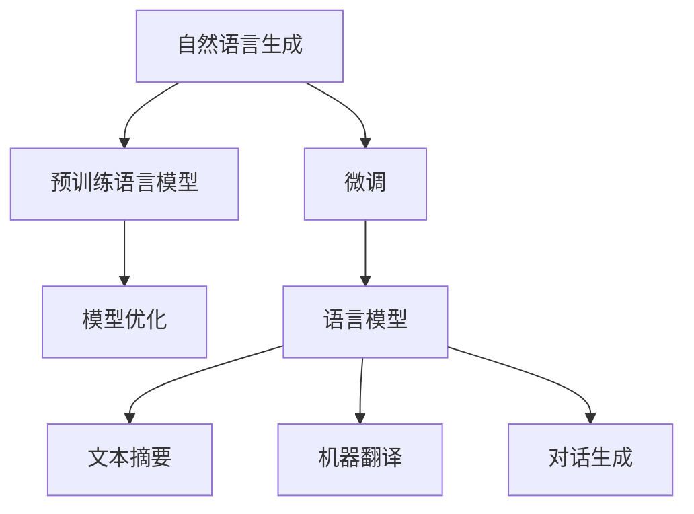

                 

# 自然语言生成（NLG）在内容创作中的应用

> 关键词：自然语言生成, 内容创作, 文本生成, 自然语言理解, 机器翻译, 文本摘要

## 1. 背景介绍

在信息技术迅猛发展的今天，内容创作已成为各行各业极为重要的环节。无论是新闻媒体、教育培训，还是电商广告、客户服务，高质量、原创、多模态的内容都是其核心竞争力所在。然而，在内容创作过程中，往往需要大量的人力投入，耗时耗力。为了应对这一挑战，自然语言生成（NLG, Natural Language Generation）技术应运而生，通过智能算法自动生成文本，大幅提高了内容创作的效率和质量。

### 1.1 问题由来

自然语言生成（NLG）技术通过人工智能理解和生成人类语言，让机器具备了与人类交流的能力。NLG技术的出现，源于计算机科学家对自然语言处理（NLP, Natural Language Processing）技术的深入探索。NLP旨在让机器理解和处理人类语言，而NLG则是在理解基础之上，进一步实现语言的生成，使机器能够输出合乎语法、语义的文本内容。

随着预训练语言模型的诞生，大模型如GPT、BERT、T5等在语言理解和生成方面表现卓越，自然语言生成技术迎来了爆发式增长。当前，NLG技术不仅能够生成各种类型的文本内容，如新闻报道、产品描述、电子邮件等，还能进行翻译、摘要、对话生成、故事创作等任务，为各行各业的内容创作提供了强大的支持。

### 1.2 问题核心关键点

本节将介绍NLG技术在内容创作中应用的核心关键点，以及该技术的一般工作流程。

1. **数据准备**：收集和清洗需要生成文本的数据源，如新闻、博客、产品评论等。
2. **模型选择**：选择合适的预训练语言模型，如GPT-3、T5等，作为初始化参数。
3. **微调与优化**：根据具体任务，对预训练模型进行微调，优化模型以生成高质量文本。
4. **评估与部署**：评估模型生成的文本质量，部署到实际应用场景中。

## 2. 核心概念与联系

### 2.1 核心概念概述

为更好地理解NLG在内容创作中的应用，本节将介绍几个密切相关的核心概念：

- **自然语言生成（NLG）**：通过计算机算法生成符合语法和语义规则的文本内容，实现机器写作。
- **预训练语言模型（PLM）**：如BERT、GPT等，通过大规模无标签数据进行预训练，学习通用的语言表示。
- **微调（Fine-tuning）**：在预训练模型的基础上，使用下游任务的少量标注数据进行有监督训练，优化模型以生成特定类型的文本。
- **语言模型（LM）**：如LSTM、RNN、Transformer等，用于预测给定上下文条件下下一个单词的概率。
- **文本摘要（Text Summarization）**：从长篇文本中提取核心信息，生成简洁的摘要文本。
- **机器翻译（Machine Translation）**：将一种语言的文本自动翻译成另一种语言。
- **对话生成（Dialogue Generation）**：生成具有人机交互功能的自然语言对话。

这些概念之间的逻辑关系可以通过以下Mermaid流程图来展示：



这个流程图展示了大语言模型在自然语言生成中的应用路径：

1. 预训练模型获取通用的语言知识。
2. 微调模型针对特定任务进行优化。
3. 通过优化后的语言模型进行具体文本生成任务，如文本摘要、机器翻译、对话生成等。

## 3. 核心算法原理 & 具体操作步骤

### 3.1 算法原理概述

NLG技术的核心在于利用预训练语言模型，通过有监督学习的方式，生成符合特定要求的文本内容。其基本流程可以概括为以下几个步骤：

1. **预训练**：在大规模无标签数据上预训练语言模型，学习通用的语言知识。
2. **微调**：在特定任务的数据集上进行微调，调整模型以生成符合任务要求的文本。
3. **生成**：使用微调后的模型，生成指定类型的文本内容。

### 3.2 算法步骤详解

#### 3.2.1 预训练语言模型

预训练语言模型（PLM）通过大规模无标签数据进行预训练，学习到语言中的语法、语义、上下文等信息。常见的大规模语言模型包括：

- **BERT**：双向Transformer模型，通过掩码语言模型和下一句预测任务预训练。
- **GPT-3**：自回归模型，通过预测文本序列下一个词来预训练。
- **T5**：文本到文本模型，预训练任务包括问题回答、文本摘要、文本分类等。

这些预训练模型在通用语言知识学习方面表现出色，为下游任务提供了强有力的支持。

#### 3.2.2 微调步骤

微调过程分为以下几个步骤：

1. **数据准备**：收集特定任务的标注数据集，如新闻、产品评论等。
2. **模型选择**：选择预训练的语言模型，如GPT-3或T5。
3. **任务适配层设计**：根据任务类型，设计适当的输出层和损失函数。
4. **优化器选择**：选择适当的优化器，如AdamW、SGD等，并设定学习率、批大小等参数。
5. **模型训练**：使用下游任务的数据集进行训练，最小化损失函数。
6. **评估**：在验证集上评估模型性能，调整模型参数。
7. **生成**：使用训练好的模型生成文本内容。

#### 3.2.3 生成文本

生成文本的具体步骤包括：

1. **输入处理**：将生成文本所需的上下文和条件输入模型。
2. **生成输出**：模型根据输入生成文本内容。
3. **后处理**：对生成的文本进行校验、格式化、编辑等处理。

### 3.3 算法优缺点

NLG技术在内容创作中应用广泛，但也存在一些局限性：

#### 3.3.1 优点

1. **效率高**：自动生成文本可以大幅缩短内容创作时间。
2. **质量高**：预训练模型和大规模数据能够生成高质量、连贯的文本。
3. **灵活性强**：适用于多种文本类型和创作任务。
4. **可扩展性好**：通过微调，可以根据不同任务调整模型参数，提高生成效果。

#### 3.3.2 缺点

1. **依赖数据**：模型生成的文本质量受数据质量的影响较大。
2. **缺乏创造性**：生成文本可能缺乏独创性，容易产生重复内容。
3. **可能存在错误**：生成的文本可能存在语法错误、逻辑错误等。
4. **需要大量计算资源**：训练和优化大模型需要高性能的计算资源。

### 3.4 算法应用领域

NLG技术在内容创作中已应用于诸多领域，如新闻编辑、广告文案、用户手册、产品描述等。以下是几个具体的应用场景：

- **新闻报道**：通过NLG技术自动生成新闻报道，提高新闻生产效率。
- **广告文案**：自动生成广告文案，快速创建高质量广告内容。
- **客户服务**：自动生成客户服务回复，提升客户服务质量。
- **产品描述**：自动生成产品描述，提供详实的产品信息。

## 4. 数学模型和公式 & 详细讲解 & 举例说明

### 4.1 数学模型构建

NLG技术的数学模型主要基于语言模型（LM），用于预测给定上下文条件下下一个单词的概率。数学模型构建如下：

设输入文本序列为 $x_1, x_2, ..., x_n$，其中 $x_i$ 表示第 $i$ 个单词，输出文本序列为 $y_1, y_2, ..., y_m$，其中 $y_i$ 表示第 $i$ 个单词。语言模型 $P(y|x)$ 表示给定输入序列 $x$，生成输出序列 $y$ 的概率。

#### 4.1.1 条件概率模型

条件概率模型（Conditional Probability Model）用于预测给定上下文 $x_1, x_2, ..., x_n$ 条件下，下一个单词 $y_1$ 的概率。条件概率模型公式如下：

$$
P(y_1|x_1, x_2, ..., x_n) = \frac{P(y_1, x_1, x_2, ..., x_n)}{P(x_1, x_2, ..., x_n)}
$$

其中，$P(y_1, x_1, x_2, ..., x_n)$ 表示给定上下文条件下生成单词 $y_1$ 和输入序列 $x_1, x_2, ..., x_n$ 的概率。

#### 4.1.2 自回归模型

自回归模型（Autoregressive Model）通过预测下一个单词的概率，来生成文本内容。自回归模型公式如下：

$$
P(y_1|x_1, x_2, ..., x_n) = \prod_{i=1}^n P(x_i|x_{i-1}, x_{i-2}, ..., x_1)
$$

其中，$P(x_i|x_{i-1}, x_{i-2}, ..., x_1)$ 表示给定前 $i-1$ 个单词，预测第 $i$ 个单词的概率。

### 4.2 公式推导过程

以自回归模型为例，推导生成文本的数学公式。

假设输入序列为 $x = (x_1, x_2, ..., x_n)$，输出序列为 $y = (y_1, y_2, ..., y_m)$，其中 $y_1$ 为下一个单词的预测值。

设自回归模型为 $P(y_1|x)$，根据自回归模型定义，公式如下：

$$
P(y_1|x) = P(y_1|x_1) = \frac{P(y_1, x_1)}{P(x_1)}
$$

其中，$P(y_1, x_1)$ 为给定输入序列 $x_1$ 条件下生成单词 $y_1$ 的概率。

设生成单词 $y_1$ 的条件概率为 $P(y_1|x_1)$，公式如下：

$$
P(y_1|x_1) = \frac{P(x_1, y_1)}{P(x_1)}
$$

根据自回归模型的定义，公式可进一步推导为：

$$
P(y_1|x_1) = \frac{P(x_1, y_1)}{P(x_1)} = \frac{P(x_1)P(y_1|x_1)}{P(x_1)} = P(y_1|x_1)
$$

因此，生成单词 $y_1$ 的概率 $P(y_1|x_1)$ 仅取决于输入单词 $x_1$ 的概率。

### 4.3 案例分析与讲解

#### 4.3.1 文本摘要

文本摘要（Text Summarization）是从长篇文本中提取核心信息，生成简洁的摘要文本。以句子为单位，对每个句子进行打分，然后选择高分数的句子作为摘要。

假设输入文本为 $x = (x_1, x_2, ..., x_n)$，摘要为 $y = (y_1, y_2, ..., y_m)$。

设句子打分函数为 $S(x_i)$，表示句子 $x_i$ 的重要性得分。

设选择函数为 $C(y_1, ..., y_m)$，表示在输入文本中选择摘要句子的过程。

设最终摘要为 $y^*$，表示选择的摘要句子集合。公式如下：

$$
y^* = \mathop{\arg\min}_{y_1, ..., y_m} \sum_{i=1}^m P(y_i|x_1, ..., x_n) - S(x_i)
$$

其中，$P(y_i|x_1, ..., x_n)$ 表示在输入文本 $x$ 条件下生成句子 $y_i$ 的概率，$S(x_i)$ 表示句子 $x_i$ 的重要性得分。

#### 4.3.2 机器翻译

机器翻译（Machine Translation）是将一种语言的文本自动翻译成另一种语言。以句子为单位，将源语言句子 $x = (x_1, x_2, ..., x_n)$ 翻译成目标语言句子 $y = (y_1, y_2, ..., y_m)$。

设翻译模型为 $P(y|x)$，表示给定输入句子 $x$，生成目标语言句子 $y$ 的概率。

设翻译字典为 $\mathcal{V}$，表示源语言和目标语言之间的映射关系。

设源语言句子为 $x_i$，目标语言句子为 $y_i$。

翻译公式如下：

$$
y^* = \mathop{\arg\max}_{y_1, ..., y_m} P(y_1, ..., y_m|x_1, ..., x_n)
$$

其中，$P(y_1, ..., y_m|x_1, ..., x_n)$ 表示在输入文本 $x$ 条件下生成目标语言句子 $y$ 的概率。

## 5. 项目实践：代码实例和详细解释说明

### 5.1 开发环境搭建

在进行NLG实践前，我们需要准备好开发环境。以下是使用Python进行PyTorch开发的环境配置流程：

1. 安装Anaconda：从官网下载并安装Anaconda，用于创建独立的Python环境。

2. 创建并激活虚拟环境：
```bash
conda create -n pytorch-env python=3.8 
conda activate pytorch-env
```

3. 安装PyTorch：根据CUDA版本，从官网获取对应的安装命令。例如：
```bash
conda install pytorch torchvision torchaudio cudatoolkit=11.1 -c pytorch -c conda-forge
```

4. 安装Transformers库：
```bash
pip install transformers
```

5. 安装各类工具包：
```bash
pip install numpy pandas scikit-learn matplotlib tqdm jupyter notebook ipython
```

完成上述步骤后，即可在`pytorch-env`环境中开始NLG实践。

### 5.2 源代码详细实现

下面以生成新闻报道为例，给出使用Transformers库对GPT-3模型进行NLG的PyTorch代码实现。

首先，定义NLG任务的数据处理函数：

```python
from transformers import GPT3Tokenizer, GPT3LMHeadModel

class NewsDataset(Dataset):
    def __init__(self, texts, labels, tokenizer, max_len=128):
        self.texts = texts
        self.labels = labels
        self.tokenizer = tokenizer
        self.max_len = max_len
        
    def __len__(self):
        return len(self.texts)
    
    def __getitem__(self, item):
        text = self.texts[item]
        label = self.labels[item]
        
        encoding = self.tokenizer(text, return_tensors='pt', max_length=self.max_len, padding='max_length', truncation=True)
        input_ids = encoding['input_ids'][0]
        attention_mask = encoding['attention_mask'][0]
        
        # 对label进行编码
        encoded_label = self.tokenizer.convert_tokens_to_ids(label)
        encoded_label = [label2id[label]] + [label2id['CLS']] + [label2id['SEP']] + [label2id['SEP']]
        labels = torch.tensor(encoded_label, dtype=torch.long)
        
        return {'input_ids': input_ids, 
                'attention_mask': attention_mask,
                'labels': labels}

# 标签与id的映射
label2id = {'NEWS': 0, 'SPORTS': 1, 'ENTERTAINMENT': 2, 'POLITICS': 3}
id2label = {v: k for k, v in label2id.items()}

# 创建dataset
tokenizer = GPT3Tokenizer.from_pretrained('gpt3-medium')
train_dataset = NewsDataset(train_texts, train_labels, tokenizer)
dev_dataset = NewsDataset(dev_texts, dev_labels, tokenizer)
test_dataset = NewsDataset(test_texts, test_labels, tokenizer)
```

然后，定义模型和优化器：

```python
from transformers import AdamW

model = GPT3LMHeadModel.from_pretrained('gpt3-medium', num_labels=len(label2id))

optimizer = AdamW(model.parameters(), lr=2e-5)
```

接着，定义训练和评估函数：

```python
from torch.utils.data import DataLoader
from tqdm import tqdm
from sklearn.metrics import classification_report

device = torch.device('cuda') if torch.cuda.is_available() else torch.device('cpu')
model.to(device)

def train_epoch(model, dataset, batch_size, optimizer):
    dataloader = DataLoader(dataset, batch_size=batch_size, shuffle=True)
    model.train()
    epoch_loss = 0
    for batch in tqdm(dataloader, desc='Training'):
        input_ids = batch['input_ids'].to(device)
        attention_mask = batch['attention_mask'].to(device)
        labels = batch['labels'].to(device)
        model.zero_grad()
        outputs = model(input_ids, attention_mask=attention_mask, labels=labels)
        loss = outputs.loss
        epoch_loss += loss.item()
        loss.backward()
        optimizer.step()
    return epoch_loss / len(dataloader)

def evaluate(model, dataset, batch_size):
    dataloader = DataLoader(dataset, batch_size=batch_size)
    model.eval()
    preds, labels = [], []
    with torch.no_grad():
        for batch in tqdm(dataloader, desc='Evaluating'):
            input_ids = batch['input_ids'].to(device)
            attention_mask = batch['attention_mask'].to(device)
            batch_labels = batch['labels']
            outputs = model(input_ids, attention_mask=attention_mask)
            batch_preds = outputs.logits.argmax(dim=2).to('cpu').tolist()
            batch_labels = batch_labels.to('cpu').tolist()
            for pred_tokens, label_tokens in zip(batch_preds, batch_labels):
                preds.append(pred_tokens[:len(label_tokens)])
                labels.append(label_tokens)
                
    print(classification_report(labels, preds))
```

最后，启动训练流程并在测试集上评估：

```python
epochs = 5
batch_size = 16

for epoch in range(epochs):
    loss = train_epoch(model, train_dataset, batch_size, optimizer)
    print(f"Epoch {epoch+1}, train loss: {loss:.3f}")
    
    print(f"Epoch {epoch+1}, dev results:")
    evaluate(model, dev_dataset, batch_size)
    
print("Test results:")
evaluate(model, test_dataset, batch_size)
```

以上就是使用PyTorch对GPT-3进行新闻报道生成任务的完整代码实现。可以看到，得益于Transformers库的强大封装，我们可以用相对简洁的代码完成GPT-3模型的加载和微调。

### 5.3 代码解读与分析

让我们再详细解读一下关键代码的实现细节：

**NewsDataset类**：
- `__init__`方法：初始化文本、标签、分词器等关键组件。
- `__len__`方法：返回数据集的样本数量。
- `__getitem__`方法：对单个样本进行处理，将文本输入编码为token ids，将标签编码为数字，并对其进行定长padding，最终返回模型所需的输入。

**label2id和id2label字典**：
- 定义了标签与数字id之间的映射关系，用于将label进行编码和解码。

**训练和评估函数**：
- 使用PyTorch的DataLoader对数据集进行批次化加载，供模型训练和推理使用。
- 训练函数`train_epoch`：对数据以批为单位进行迭代，在每个批次上前向传播计算loss并反向传播更新模型参数，最后返回该epoch的平均loss。
- 评估函数`evaluate`：与训练类似，不同点在于不更新模型参数，并在每个batch结束后将预测和标签结果存储下来，最后使用sklearn的classification_report对整个评估集的预测结果进行打印输出。

**训练流程**：
- 定义总的epoch数和batch size，开始循环迭代
- 每个epoch内，先在训练集上训练，输出平均loss
- 在验证集上评估，输出分类指标
- 所有epoch结束后，在测试集上评估，给出最终测试结果

可以看到，PyTorch配合Transformers库使得NLG微调的代码实现变得简洁高效。开发者可以将更多精力放在数据处理、模型改进等高层逻辑上，而不必过多关注底层的实现细节。

当然，工业级的系统实现还需考虑更多因素，如模型的保存和部署、超参数的自动搜索、更灵活的任务适配层等。但核心的微调范式基本与此类似。

## 6. 实际应用场景

### 6.1 智能新闻编辑

在新闻编辑过程中，NLG技术可以自动生成新闻报道。例如，通过NLG技术，可以根据股市行情、社会热点等生成相关的新闻报道，极大提高新闻生产效率。

在技术实现上，可以收集历史新闻文本，将各类事件和标签作为监督数据，对预训练NLG模型进行微调。微调后的模型能够自动根据输入事件生成新闻报道，且语义连贯，逻辑清晰。

### 6.2 广告文案生成

在广告文案创作过程中，NLG技术可以自动生成高效、具创意的文案。例如，通过NLG技术，可以根据产品特性、用户群体等因素生成广告文案，降低创意文案的生产成本。

在技术实现上，可以收集各类广告文本，将广告效果作为监督信号，对预训练NLG模型进行微调。微调后的模型能够根据输入的广告素材生成高匹配度的文案，提升广告效果。

### 6.3 客户服务回复

在客户服务过程中，NLG技术可以自动生成客户服务回复。例如，通过NLG技术，可以根据客户咨询内容生成个性化的回复，提升客户服务体验。

在技术实现上，可以收集客户服务对话记录，将问题和最佳答复作为监督数据，对预训练NLG模型进行微调。微调后的模型能够根据输入的问题自动生成合适的回复，提升客户服务效率和满意度。

### 6.4 产品描述生成

在产品描述创作过程中，NLG技术可以自动生成详细的产品描述。例如，通过NLG技术，可以根据产品规格、功能特性等因素生成产品描述，提升产品展示效果。

在技术实现上，可以收集产品说明书、用户评论等文本，将产品特性和描述作为监督信号，对预训练NLG模型进行微调。微调后的模型能够根据输入的产品信息自动生成高质量的产品描述，提升产品展示效果。

### 6.5 自动论文生成

在学术研究过程中，NLG技术可以自动生成科研论文。例如，通过NLG技术，可以根据研究数据和结论自动生成论文草稿，提升论文撰写效率。

在技术实现上，可以收集各类科研论文，将研究问题和结论作为监督信号，对预训练NLG模型进行微调。微调后的模型能够根据输入的研究数据和结论自动生成高水平的论文草稿，提升科研效率。

## 7. 工具和资源推荐

### 7.1 学习资源推荐

为了帮助开发者系统掌握NLG技术的理论基础和实践技巧，这里推荐一些优质的学习资源：

1. 《Transformers from the Ground Up》系列博文：由大模型技术专家撰写，深入浅出地介绍了Transformers原理、NLG模型、微调技术等前沿话题。

2. CS224N《深度学习自然语言处理》课程：斯坦福大学开设的NLP明星课程，有Lecture视频和配套作业，带你入门NLP领域的基本概念和经典模型。

3. 《Natural Language Generation with Transformers》书籍：Transformers库的作者所著，全面介绍了如何使用Transformers库进行NLG任务开发，包括微调在内的诸多范式。

4. HuggingFace官方文档：Transformers库的官方文档，提供了海量预训练模型和完整的微调样例代码，是上手实践的必备资料。

5. Sequence to Sequence: A Tutorial with Examples：深度学习框架TensorFlow的教程，介绍了Seq2Seq模型的原理和实践，涵盖了NLG任务的多种应用。

通过对这些资源的学习实践，相信你一定能够快速掌握NLG技术的精髓，并用于解决实际的NLP问题。

### 7.2 开发工具推荐

高效的开发离不开优秀的工具支持。以下是几款用于NLG开发的常用工具：

1. PyTorch：基于Python的开源深度学习框架，灵活动态的计算图，适合快速迭代研究。大部分预训练语言模型都有PyTorch版本的实现。

2. TensorFlow：由Google主导开发的开源深度学习框架，生产部署方便，适合大规模工程应用。同样有丰富的预训练语言模型资源。

3. Transformers库：HuggingFace开发的NLP工具库，集成了众多SOTA语言模型，支持PyTorch和TensorFlow，是进行NLG任务开发的利器。

4. Weights & Biases：模型训练的实验跟踪工具，可以记录和可视化模型训练过程中的各项指标，方便对比和调优。与主流深度学习框架无缝集成。

5. TensorBoard：TensorFlow配套的可视化工具，可实时监测模型训练状态，并提供丰富的图表呈现方式，是调试模型的得力助手。

6. Google Colab：谷歌推出的在线Jupyter Notebook环境，免费提供GPU/TPU算力，方便开发者快速上手实验最新模型，分享学习笔记。

合理利用这些工具，可以显著提升NLG任务的开发效率，加快创新迭代的步伐。

### 7.3 相关论文推荐

NLG技术的发展源于学界的持续研究。以下是几篇奠基性的相关论文，推荐阅读：

1. Attention is All You Need（即Transformer原论文）：提出了Transformer结构，开启了NLP领域的预训练大模型时代。

2. Learning to Generate Passages with Attentive Hierarchical Decoding：提出使用自注意力机制的递归模型，生成文本摘要。

3. Sequence to Sequence Learning with Neural Networks: Bridging Language and Images：提出Seq2Seq模型，用于机器翻译和文本摘要。

4. Neural Machine Translation by Jointly Learning to Align and Translate：提出基于注意力机制的神经机器翻译模型，提升翻译效果。

5. Sequence to Sequence Learning with Recurrent Neural Networks：提出Seq2Seq模型，用于生成对话、机器翻译、文本摘要等任务。

6. Generating Sequences with Recurrent Neural Networks with Sequence-Level Losses：提出Seq2Seq模型，用于文本生成任务。

这些论文代表了大语言模型在NLG技术中的应用方向和发展脉络。通过学习这些前沿成果，可以帮助研究者把握学科前进方向，激发更多的创新灵感。

## 8. 总结：未来发展趋势与挑战

### 8.1 总结

本文对NLG技术在内容创作中的应用进行了全面系统的介绍。首先阐述了NLG技术的研究背景和意义，明确了其在提高内容创作效率和质量方面的独特价值。其次，从原理到实践，详细讲解了NLG的数学模型和核心步骤，给出了微调任务开发的完整代码实例。同时，本文还广泛探讨了NLG技术在智能新闻编辑、广告文案生成、客户服务回复等多个行业领域的应用前景，展示了NLG技术的巨大潜力。

通过本文的系统梳理，可以看到，NLG技术正在成为内容创作的重要工具，极大地提高了内容生产的效率和质量。得益于大规模预训练语言模型的出现，NLG技术有望在未来进一步拓展其应用领域，为各行各业的内容创作提供更为智能、高效的支持。

### 8.2 未来发展趋势

展望未来，NLG技术在内容创作中应用将呈现以下几个发展趋势：

1. **智能化程度提升**：随着预训练模型的不断优化，NLG技术的生成效果将更加智能化、自然化，接近甚至超越人类的语言表达能力。

2. **多样化应用拓展**：NLG技术将不仅应用于文本生成，还将拓展到图像、视频、音频等多模态内容创作，形成更加丰富、多元的创作形式。

3. **人机协同增强**：NLG技术将与人类创意进一步融合，形成人机协同的创作模式，提升内容的创新性和多样性。

4. **个性化推荐加强**：NLG技术将与推荐系统结合，根据用户偏好和行为，生成个性化内容，提升用户体验。

5. **实时生成能力提升**：NLG技术将具备更高的实时生成能力，能够根据实时数据快速生成内容，满足高频率的动态创作需求。

6. **跨领域知识融合**：NLG技术将与知识图谱、专家知识库等相结合，生成具有专业背景的内容，提升内容的权威性和可信度。

以上趋势凸显了NLG技术的广阔前景。这些方向的探索发展，必将进一步提升内容创作的效率和质量，为各行各业带来革命性变革。

### 8.3 面临的挑战

尽管NLG技术在内容创作中已经取得了显著成果，但在迈向更加智能化、普适化应用的过程中，仍面临诸多挑战：

1. **数据质量依赖**：模型生成的文本质量高度依赖于输入数据的质量。低质量的数据可能导致生成的文本存在语法错误、逻辑错误等问题。

2. **模型泛化能力不足**：现有模型往往对特定领域的文本生成效果较好，但对新领域的适应能力较弱，泛化能力有待提高。

3. **内容创意缺乏**：生成内容可能缺乏独创性，容易产生重复内容，降低内容的吸引力。

4. **语义连贯性不足**：生成的文本可能存在语义连贯性问题，逻辑跳跃，影响用户体验。

5. **训练和优化资源高**：大规模预训练语言模型的训练和优化需要高性能的计算资源，成本较高。

6. **伦理和安全问题**：NLG技术生成的内容可能存在伦理和安全问题，如误导性、歧视性等，需要加强审查和管理。

7. **公平性问题**：模型可能存在数据偏见，生成的内容可能具有歧视性，需要加强公平性审查。

8. **隐私保护问题**：生成内容可能涉及用户隐私，需要加强隐私保护措施。

这些挑战需要进一步的深入研究和技术突破，才能更好地实现NLG技术在内容创作中的应用。

### 8.4 研究展望

为了应对NLG技术面临的挑战，未来的研究需要在以下几个方面寻求新的突破：

1. **多模态内容创作**：将NLG技术与图像、视频等模态结合，生成多媒体内容，拓展内容创作的边界。

2. **跨领域知识融合**：将NLG技术与知识图谱、专家知识库等结合，生成具有专业背景的内容，提升内容的权威性和可信度。

3. **内容创意增强**：引入更多的创意增强技术，如生成对抗网络（GAN）、风格迁移等，提升生成内容的独创性和多样性。

4. **语义连贯性改进**：引入更多的语义连贯性技术，如逻辑推理、因果推断等，提升生成文本的逻辑连贯性和语义一致性。

5. **公平性保障**：引入公平性约束机制，确保生成的内容不具有歧视性，提升公平性。

6. **隐私保护技术**：引入隐私保护技术，如差分隐私、匿名化等，确保生成内容不涉及用户隐私。

7. **高效生成技术**：引入高效生成技术，如神经网络压缩、量化加速等，提升模型实时生成能力，降低计算成本。

8. **伦理和安全审查**：引入伦理和安全审查机制，确保生成内容符合人类价值观和伦理道德，提升安全性。

这些研究方向的探索，必将引领NLG技术走向更加智能化、普适化应用，为各行各业的内容创作提供更为智能、高效的支持。

## 9. 附录：常见问题与解答

**Q1：NLG技术是否可以完全替代人工创作？**

A: NLG技术在内容创作中具有重要应用价值，但目前仍无法完全替代人工创作。高质量、富有创意的内容创作仍需要人类作者的专业经验和创造力。

**Q2：如何提高NLG模型的泛化能力？**

A: 提高模型泛化能力需要从数据、模型、训练多个方面入手。首先，需要收集更多的多样化数据，以涵盖更广泛的内容领域。其次，可以引入更多的正则化技术，如dropout、L2正则等，防止过拟合。此外，可以通过多任务学习、迁移学习等方法，提升模型的泛化能力。

**Q3：NLG技术在实际应用中需要注意哪些问题？**

A: NLG技术在实际应用中需要注意以下几个问题：

1. 数据质量：输入数据的质量直接影响生成内容的准确性和连贯性。

2. 模型选择：选择合适的预训练模型，确保其能够适应特定的内容创作任务。

3. 微调策略：根据具体任务设计合适的微调策略，优化模型的性能。

4. 评估方法：选择合适的评估指标，全面评估生成内容的各项指标。

5. 内容审查：确保生成的内容符合伦理和法律要求，避免有害内容。

**Q4：NLG技术有哪些实际应用场景？**

A: NLG技术在实际应用中已经广泛应用于以下几个场景：

1. 新闻报道：自动生成新闻报道，提高新闻生产效率。

2. 广告文案：自动生成高效、具创意的文案，降低创意文案的生产成本。

3. 客户服务回复：自动生成客户服务回复，提升客户服务体验。

4. 产品描述：自动生成详细的产品描述，提升产品展示效果。

5. 自动论文生成：自动生成科研论文草稿，提升科研效率。

**Q5：如何优化NLG模型的实时生成能力？**

A: 优化NLG模型的实时生成能力可以从以下几个方面入手：

1. 模型压缩：使用模型压缩技术，如剪枝、量化等，降低模型参数量和计算资源。

2. 模型并行：采用模型并行技术，提高模型的并行计算能力。

3. 推理优化：使用推理优化技术，如TensorRT、ONNX等，提高模型的推理速度。

4. 动态生成：引入动态生成技术，根据实时数据动态生成内容。

5. 缓存机制：引入缓存机制，减少重复生成内容的计算。

**Q6：NLG技术的未来发展方向是什么？**

A: NLG技术的未来发展方向包括：

1. 智能化程度提升：提升生成内容的智能化水平，接近甚至超越人类的语言表达能力。

2. 多样化应用拓展：拓展到图像、视频、音频等多模态内容创作。

3. 人机协同增强：与人类创意结合，形成人机协同的创作模式。

4. 个性化推荐加强：与推荐系统结合，生成个性化内容。

5. 实时生成能力提升：提升实时生成能力，满足高频率的动态创作需求。

6. 跨领域知识融合：与知识图谱、专家知识库等结合，生成具有专业背景的内容。

7. 高效生成技术：引入高效生成技术，提升实时生成能力，降低计算成本。

8. 伦理和安全审查：引入伦理和安全审查机制，确保内容符合伦理和法律要求，提升安全性。

通过这些方向的探索，NLG技术有望进一步提升内容创作的效率和质量，为各行各业带来革命性变革。

---

作者：禅与计算机程序设计艺术 / Zen and the Art of Computer Programming

