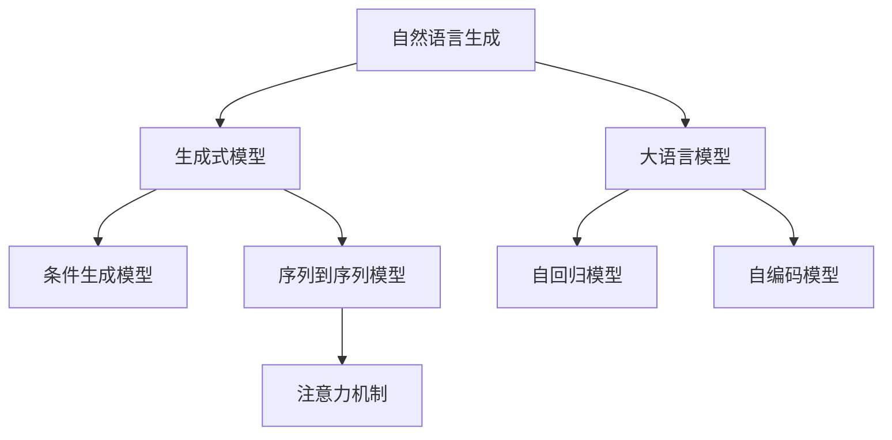
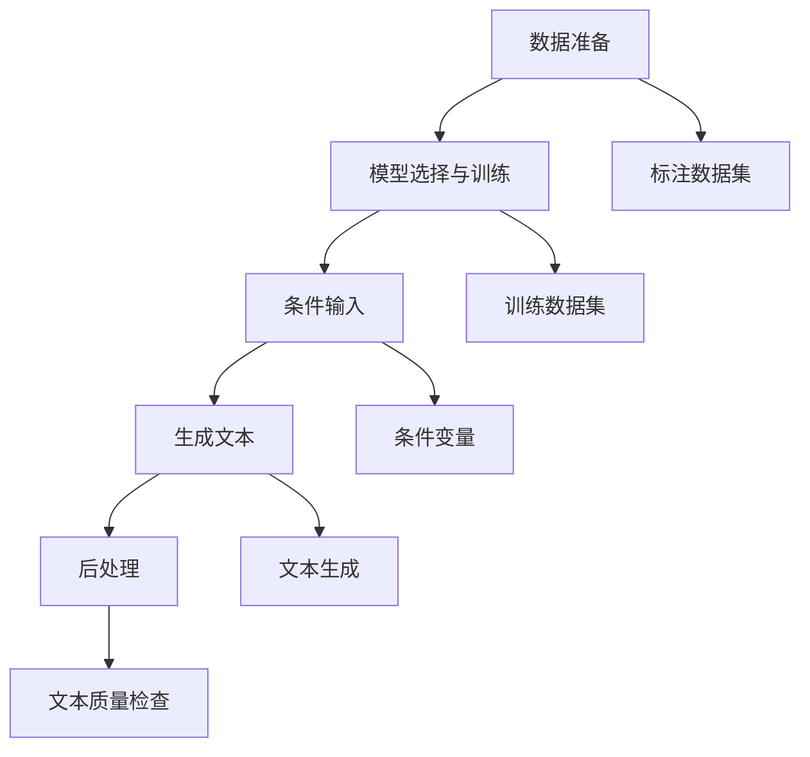

                 

# 自然语言生成（NLG）：AI写作与内容创作

> 关键词：自然语言生成（NLG）, 大语言模型, 自动写作, 内容创作, 深度学习, 生成式模型, 条件生成模型

## 1. 背景介绍

### 1.1 问题由来
随着人工智能技术的发展，自然语言生成（Natural Language Generation, NLG）在近年来成为研究热点。NLG旨在使机器能够根据一定的条件，自动生成符合语法和语义规则的自然语言文本。相较于传统的基于规则或模板的生成方式，NLG技术更加灵活、自然，能够更好地适应实际应用场景。

NLG技术的兴起，不仅在新闻、广告、报告等传统内容创作领域得到应用，还在文学、游戏、教育、客服等新兴场景中大放异彩。通过NLG技术，可以大幅提升内容创作的效率和质量，为各行各业注入新的活力。

### 1.2 问题核心关键点
自然语言生成技术主要包括以下几个关键点：

1. **大语言模型（Large Language Model, LLM）**：作为预训练模型的一种，大语言模型具有强大的语言理解和生成能力，能够自动学习语言的通用表示。如GPT、BERT等预训练模型，已经在大规模语料上获得了显著的语言知识。

2. **生成式模型（Generative Models）**：利用神经网络等模型，自动生成符合特定语法和语义规则的自然语言文本。常见的生成式模型包括RNN、GAN、Transformer等。

3. **条件生成模型（Conditional Generation Models）**：基于特定条件（如文本、图片、音频等）自动生成文本。通过输入条件变量的方式，生成模型能够灵活生成符合需求的文本内容。

4. **序列到序列模型（Sequence-to-Sequence, Seq2Seq）**：将输入序列（如文本、音频等）转换为输出序列（如文本）的模型。Seq2Seq模型广泛应用于机器翻译、文本摘要、语音转文本等任务。

5. **注意力机制（Attention Mechanism）**：通过注意力机制，使模型能够聚焦于输入序列中的关键部分，从而提升生成文本的相关性和连贯性。

6. **自回归模型（Autoregressive Models）**：生成文本时，先生成前一个词，再根据前一个词生成下一个词，通过自回归的方式逐步生成文本。自回归模型包括GPT等。

7. **自编码模型（Autoencoder）**：通过编码器将输入文本转换为向量表示，再通过解码器生成目标文本。自编码模型常用于文本压缩、生成等任务。

## 2. 核心概念与联系

### 2.1 核心概念概述

为更好地理解自然语言生成技术，本节将介绍几个密切相关的核心概念：

- **自然语言生成（NLG）**：使机器能够根据给定条件，自动生成自然语言文本的技术。
- **大语言模型（LLM）**：预训练模型的一种，能够自动学习语言的通用表示，具备强大的语言理解和生成能力。
- **生成式模型（Generative Models）**：利用神经网络等模型，自动生成符合特定语法和语义规则的自然语言文本。
- **条件生成模型（Conditional Generation Models）**：基于特定条件（如文本、图片、音频等）自动生成文本。
- **序列到序列模型（Seq2Seq）**：将输入序列转换为输出序列的模型，广泛应用于机器翻译、文本摘要、语音转文本等任务。
- **注意力机制（Attention Mechanism）**：通过注意力机制，使模型能够聚焦于输入序列中的关键部分，从而提升生成文本的相关性和连贯性。
- **自回归模型（Autoregressive Models）**：生成文本时，先生成前一个词，再根据前一个词生成下一个词，通过自回归的方式逐步生成文本。
- **自编码模型（Autoencoder）**：通过编码器将输入文本转换为向量表示，再通过解码器生成目标文本。

这些核心概念之间的逻辑关系可以通过以下Mermaid流程图来展示：



这个流程图展示了大语言模型的核心概念及其与其他生成技术的关系：

1. 自然语言生成通过大语言模型学习语言的通用表示，可以构建各种生成模型。
2. 生成式模型利用神经网络，自动生成符合特定语法和语义规则的文本。
3. 条件生成模型基于特定条件，自动生成文本，如基于图片生成描述、基于音频生成文本等。
4. 序列到序列模型将输入序列转换为输出序列，应用于机器翻译、文本摘要等任务。
5. 注意力机制提高生成文本的相关性和连贯性，增强生成模型的性能。
6. 自回归模型通过逐步生成文本，提升生成文本的自然流畅性。
7. 自编码模型通过编码和解码，实现文本压缩、生成等任务。

这些核心概念共同构成了自然语言生成的技术框架，使其能够在各种场景下发挥强大的生成能力。通过理解这些核心概念，我们可以更好地把握自然语言生成的原理和应用方向。

## 3. 核心算法原理 & 具体操作步骤
### 3.1 算法原理概述

自然语言生成的核心原理是通过深度学习模型，自动学习语言的表示，并根据特定条件生成符合语法和语义规则的文本。其主要步骤包括：

1. **数据准备**：收集训练数据集，如文本、图片、音频等。
2. **模型选择与训练**：选择合适的生成模型（如RNN、GAN、Transformer等），并在标注数据上进行训练。
3. **条件输入**：将生成模型输入的条件变量（如文本、图片、音频等），自动生成文本。
4. **后处理**：对生成的文本进行后处理，如语法检查、拼写校对等，确保文本质量。

自然语言生成算法的基本流程如下图所示：



### 3.2 算法步骤详解

自然语言生成的主要步骤详解如下：

**Step 1: 数据准备**

数据准备是自然语言生成的第一步，主要包括：

1. **收集标注数据**：收集与目标任务相关的标注数据集，如新闻、广告、小说、对话等。
2. **数据预处理**：对数据进行清洗、归一化、分词等预处理操作，确保数据质量。
3. **数据划分**：将数据集划分为训练集、验证集和测试集，供模型训练、调参和评估使用。

**Step 2: 模型选择与训练**

模型选择与训练是自然语言生成的核心步骤，主要包括以下几个环节：

1. **模型选择**：根据任务需求选择合适的生成模型，如RNN、GAN、Transformer等。
2. **参数设置**：确定模型参数，如隐藏层大小、学习率、训练轮数等。
3. **模型训练**：使用标注数据集对模型进行训练，通过反向传播更新模型参数。
4. **验证集评估**：在验证集上评估模型性能，确定最优参数。

**Step 3: 条件输入**

条件输入是自然语言生成的关键步骤，主要包括以下几个环节：

1. **输入条件准备**：将目标任务的输入条件（如文本、图片、音频等）转换为模型可以处理的格式。
2. **模型输入**：将输入条件输入到训练好的生成模型中。
3. **文本生成**：模型根据输入条件自动生成文本。

**Step 4: 后处理**

后处理是自然语言生成的最后一步，主要包括以下几个环节：

1. **文本校验**：对生成的文本进行语法检查、拼写校对等。
2. **文本优化**：对生成的文本进行优化，如调整语序、删除无关内容等。
3. **文本发布**：将生成的文本发布到目标平台或应用中。

### 3.3 算法优缺点

自然语言生成算法具有以下优点：

1. **灵活性高**：能够根据不同任务需求，自动生成各种类型的文本，适应性强。
2. **生成速度快**：通过深度学习模型，能够在短时间内生成大量文本，提高效率。
3. **质量提升**：生成的文本质量通常高于基于规则或模板的生成方式，更自然、流畅。
4. **自动化程度高**：减少人工干预，自动完成文本生成过程，提升生产效率。

同时，该算法也存在以下局限性：

1. **数据依赖强**：生成模型的质量很大程度上依赖于训练数据的质量和多样性。
2. **可解释性差**：生成模型通常视为"黑盒"系统，难以解释其内部生成过程。
3. **泛化能力有限**：生成的文本往往只能适应特定场景，泛化能力较弱。
4. **需要大量计算资源**：生成模型通常需要较大的计算资源，包括GPU、TPU等。

尽管存在这些局限性，但自然语言生成算法在实际应用中已经展现出强大的潜力，被广泛应用于新闻生成、广告文案创作、报告撰写等多个领域。未来，相关技术也将随着深度学习技术的不断进步而得到进一步优化和完善。

### 3.4 算法应用领域

自然语言生成算法已经在多个领域得到了应用，覆盖了几乎所有常见任务，例如：

- **新闻自动生成**：根据指定主题，自动生成新闻报道。
- **广告文案创作**：根据产品特点，自动生成广告文案。
- **报告撰写**：自动生成各种类型的报告，如市场分析、财报、技术文档等。
- **对话生成**：自动生成对话内容，应用于智能客服、游戏AI等。
- **翻译**：自动将一种语言翻译成另一种语言。
- **文本摘要**：自动将长文本压缩成简短摘要。
- **文章生成**：自动生成各种类型的文章，如小说、博客、评论等。

除了上述这些经典任务外，自然语言生成算法还被创新性地应用于更多场景中，如可控文本生成、内容推荐、智能摘要等，为内容创作带来了全新的突破。

## 4. 数学模型和公式 & 详细讲解 & 举例说明

### 4.1 数学模型构建

自然语言生成算法通常使用以下数学模型进行建模：

设生成模型为 $P(\text{text} | \text{condition})$，表示在给定条件 $\text{condition}$ 下生成文本 $\text{text}$ 的概率。

在实际应用中，通常使用条件概率模型（Conditional Probability Model）来建模，如：

$$
P(\text{text} | \text{condition}) = \prod_{i=1}^T P(w_i | w_{<i}, \text{condition})
$$

其中 $T$ 为文本长度，$w_i$ 为文本中的第 $i$ 个单词。

### 4.2 公式推导过程

以下我们以基于Transformer的条件生成模型为例，推导其生成文本的概率计算公式。

假设输入条件为 $x$，生成的文本为 $y$。定义Transformer模型为 $M$，其中 $\theta$ 为模型参数。

模型 $M$ 在输入 $x$ 上的输出为 $\hat{y}=M_{\theta}(x)$，表示模型预测的文本输出。

条件概率模型 $P(y | x)$ 可以表示为：

$$
P(y | x) = \prod_{i=1}^T P(y_i | y_{<i}, x)
$$

在生成模型 $M$ 中，每个单词 $y_i$ 的条件概率可以表示为：

$$
P(y_i | y_{<i}, x) = \frac{e^{M_{\theta}(x)[y_i]}}{\sum_{k=1}^K e^{M_{\theta}(x)[k]}}
$$

其中 $K$ 为单词数，$M_{\theta}(x)[y_i]$ 表示模型在输入 $x$ 下，预测单词 $y_i$ 的得分。

将上述公式代入条件概率模型中，得到：

$$
P(y | x) = \prod_{i=1}^T \frac{e^{M_{\theta}(x)[y_i]}}{\sum_{k=1}^K e^{M_{\theta}(x)[k]}}
$$

通过简化，可以得到：

$$
P(y | x) = \frac{\exp(\sum_{i=1}^T M_{\theta}(x)[y_i])}{\sum_{k=1}^K \exp(\sum_{i=1}^T M_{\theta}(x)[k])}
$$

其中 $M_{\theta}(x)$ 为模型在输入 $x$ 下的向量表示。

在实践中，为了计算效率，通常采用蒙特卡洛采样方法，即通过随机生成多组文本，统计概率最大的一组作为最终的生成结果。

### 4.3 案例分析与讲解

下面以基于Transformer的条件生成模型为例，分析其生成文本的原理和应用场景。

**案例背景**：生成天气预报。

**输入条件**：当前天气情况（如温度、湿度、风力等）。

**生成过程**：

1. 将输入条件转换为Transformer模型的向量表示 $x$。
2. 将向量 $x$ 输入到生成模型 $M$ 中，得到向量表示 $y$。
3. 对向量 $y$ 进行概率计算，得到每个单词的条件概率。
4. 随机生成多组文本，选择概率最大的一组作为最终生成的天气预报。

**应用场景**：智能客服系统。

在智能客服系统中，自动生成客户服务回复可以显著提升客户体验和满意度。通过自然语言生成技术，系统可以自动理解客户咨询内容，并生成符合语法和语义规则的回复。例如，在处理天气咨询时，系统可以根据当前天气情况，自动生成天气预报，快速响应客户需求。

## 5. 项目实践：代码实例和详细解释说明
### 5.1 开发环境搭建

在进行自然语言生成项目实践前，我们需要准备好开发环境。以下是使用Python进行PyTorch开发的环境配置流程：

1. 安装Anaconda：从官网下载并安装Anaconda，用于创建独立的Python环境。

2. 创建并激活虚拟环境：
```bash
conda create -n pytorch-env python=3.8 
conda activate pytorch-env
```

3. 安装PyTorch：根据CUDA版本，从官网获取对应的安装命令。例如：
```bash
conda install pytorch torchvision torchaudio cudatoolkit=11.1 -c pytorch -c conda-forge
```

4. 安装Transformers库：
```bash
pip install transformers
```

5. 安装各类工具包：
```bash
pip install numpy pandas scikit-learn matplotlib tqdm jupyter notebook ipython
```

完成上述步骤后，即可在`pytorch-env`环境中开始项目实践。

### 5.2 源代码详细实现

下面我们以基于Transformer的条件生成模型为例，给出使用PyTorch进行自然语言生成的PyTorch代码实现。

首先，定义模型和优化器：

```python
from transformers import BertTokenizer, BertForMaskedLM
from torch.utils.data import Dataset
import torch

model = BertForMaskedLM.from_pretrained('bert-base-cased')

tokenizer = BertTokenizer.from_pretrained('bert-base-cased')

optimizer = torch.optim.AdamW(model.parameters(), lr=2e-5)
```

接着，定义数据集：

```python
class MaskedLMTextDataset(Dataset):
    def __init__(self, texts, masked_index, tokenizer):
        self.texts = texts
        self.masked_index = masked_index
        self.tokenizer = tokenizer
        
    def __len__(self):
        return len(self.texts)
    
    def __getitem__(self, item):
        text = self.texts[item]
        masked_index = self.masked_index[item]
        
        encoding = self.tokenizer(text, return_tensors='pt', padding='max_length', truncation=True)
        input_ids = encoding['input_ids'][0]
        attention_mask = encoding['attention_mask'][0]
        
        # 生成masked token
        masked_token = tokenizer.mask_token
        input_ids[masked_index] = tokenizer.mask_token_id
        
        return {'input_ids': input_ids, 
                'attention_mask': attention_mask,
                'masked_index': masked_index}
```

然后，定义训练和评估函数：

```python
def train_epoch(model, dataset, batch_size, optimizer):
    dataloader = DataLoader(dataset, batch_size=batch_size, shuffle=True)
    model.train()
    epoch_loss = 0
    for batch in dataloader:
        input_ids = batch['input_ids'].to(device)
        attention_mask = batch['attention_mask'].to(device)
        masked_index = batch['masked_index'].to(device)
        model.zero_grad()
        outputs = model(input_ids, attention_mask=attention_mask, labels=input_ids)
        loss = outputs.loss
        epoch_loss += loss.item()
        loss.backward()
        optimizer.step()
    return epoch_loss / len(dataloader)

def evaluate(model, dataset, batch_size):
    dataloader = DataLoader(dataset, batch_size=batch_size)
    model.eval()
    preds, labels = [], []
    with torch.no_grad():
        for batch in dataloader:
            input_ids = batch['input_ids'].to(device)
            attention_mask = batch['attention_mask'].to(device)
            labels = batch['masked_index'].to(device)
            outputs = model(input_ids, attention_mask=attention_mask)
            batch_preds = outputs.logits.argmax(dim=2).to('cpu').tolist()
            batch_labels = batch['masked_index'].to('cpu').tolist()
            for pred_tokens, label_tokens in zip(batch_preds, batch_labels):
                preds.append(pred_tokens)
                labels.append(label_tokens)
                
    return preds, labels

```

最后，启动训练流程并在测试集上评估：

```python
epochs = 5
batch_size = 16

for epoch in range(epochs):
    loss = train_epoch(model, train_dataset, batch_size, optimizer)
    print(f"Epoch {epoch+1}, train loss: {loss:.3f}")
    
    preds, labels = evaluate(model, dev_dataset, batch_size)
    print(f"Epoch {epoch+1}, dev results:")
    print(classification_report(labels, preds))
    
print("Test results:")
preds, labels = evaluate(model, test_dataset, batch_size)
print(f"Test results:")
print(classification_report(labels, preds))
```

以上就是使用PyTorch对Bert模型进行条件生成任务微调的完整代码实现。可以看到，得益于Transformers库的强大封装，我们可以用相对简洁的代码完成Bert模型的加载和微调。

### 5.3 代码解读与分析

让我们再详细解读一下关键代码的实现细节：

**MaskedLMTextDataset类**：
- `__init__`方法：初始化文本、掩码位置、分词器等关键组件。
- `__len__`方法：返回数据集的样本数量。
- `__getitem__`方法：对单个样本进行处理，将文本输入编码为token ids，将掩码位置转换为向量，最终返回模型所需的输入。

**训练和评估函数**：
- 使用PyTorch的DataLoader对数据集进行批次化加载，供模型训练和推理使用。
- 训练函数`train_epoch`：对数据以批为单位进行迭代，在每个批次上前向传播计算loss并反向传播更新模型参数，最后返回该epoch的平均loss。
- 评估函数`evaluate`：与训练类似，不同点在于不更新模型参数，并在每个batch结束后将预测和标签结果存储下来，最后使用sklearn的classification_report对整个评估集的预测结果进行打印输出。

**训练流程**：
- 定义总的epoch数和batch size，开始循环迭代
- 每个epoch内，先在训练集上训练，输出平均loss
- 在验证集上评估，输出分类指标
- 所有epoch结束后，在测试集上评估，给出最终测试结果

可以看到，PyTorch配合Transformers库使得Bert模型微调的代码实现变得简洁高效。开发者可以将更多精力放在数据处理、模型改进等高层逻辑上，而不必过多关注底层的实现细节。

当然，工业级的系统实现还需考虑更多因素，如模型的保存和部署、超参数的自动搜索、更灵活的任务适配层等。但核心的微调范式基本与此类似。

## 6. 实际应用场景
### 6.1 智能客服系统

基于大语言模型自然语言生成技术，可以广泛应用于智能客服系统的构建。传统客服往往需要配备大量人力，高峰期响应缓慢，且一致性和专业性难以保证。而使用自然语言生成技术，自动生成客户服务回复，可以显著提升客户咨询体验和问题解决效率。

在技术实现上，可以收集企业内部的历史客服对话记录，将问题和最佳答复构建成监督数据，在此基础上对预训练自然语言生成模型进行微调。微调后的模型能够自动理解客户咨询内容，并生成符合语法和语义规则的回复。对于客户提出的新问题，还可以接入检索系统实时搜索相关内容，动态组织生成回答。如此构建的智能客服系统，能大幅提升客户咨询体验和问题解决效率。

### 6.2 金融舆情监测

金融机构需要实时监测市场舆论动向，以便及时应对负面信息传播，规避金融风险。传统的人工监测方式成本高、效率低，难以应对网络时代海量信息爆发的挑战。基于自然语言生成技术的文本分类和情感分析技术，为金融舆情监测提供了新的解决方案。

具体而言，可以收集金融领域相关的新闻、报道、评论等文本数据，并对其进行主题标注和情感标注。在此基础上对预训练语言模型进行微调，使其能够自动判断文本属于何种主题，情感倾向是正面、中性还是负面。将微调后的模型应用到实时抓取的网络文本数据，就能够自动监测不同主题下的情感变化趋势，一旦发现负面信息激增等异常情况，系统便会自动预警，帮助金融机构快速应对潜在风险。

### 6.3 个性化推荐系统

当前的推荐系统往往只依赖用户的历史行为数据进行物品推荐，无法深入理解用户的真实兴趣偏好。基于自然语言生成技术的个性化推荐系统可以更好地挖掘用户行为背后的语义信息，从而提供更精准、多样的推荐内容。

在实践中，可以收集用户浏览、点击、评论、分享等行为数据，提取和用户交互的物品标题、描述、标签等文本内容。将文本内容作为模型输入，用户的后续行为（如是否点击、购买等）作为监督信号，在此基础上微调预训练语言模型。微调后的模型能够从文本内容中准确把握用户的兴趣点。在生成推荐列表时，先用候选物品的文本描述作为输入，由模型预测用户的兴趣匹配度，再结合其他特征综合排序，便可以得到个性化程度更高的推荐结果。

### 6.4 未来应用展望

随着自然语言生成技术的不断发展，其应用场景将更加广泛，为各行各业带来新的变革。

在智慧医疗领域，自然语言生成技术可以应用于医疗问答、病历分析、药物研发等。通过自然语言生成技术，医生可以快速回答患者问题，系统自动分析患者病历，生成诊断和治疗建议，辅助医生诊疗，加速新药开发进程。

在智能教育领域，自然语言生成技术可应用于作业批改、学情分析、知识推荐等方面，因材施教，促进教育公平，提高教学质量。

在智慧城市治理中，自然语言生成技术可应用于城市事件监测、舆情分析、应急指挥等环节，提高城市管理的自动化和智能化水平，构建更安全、高效的未来城市。

此外，在企业生产、社会治理、文娱传媒等众多领域，自然语言生成技术也将不断涌现，为内容创作、智能交互、知识服务等场景提供新的技术路径。相信随着技术的日益成熟，自然语言生成技术必将在构建人机协同的智能时代中扮演越来越重要的角色。

## 7. 工具和资源推荐
### 7.1 学习资源推荐

为了帮助开发者系统掌握自然语言生成技术，这里推荐一些优质的学习资源：

1. **《深度学习与自然语言处理》**系列博文：由大模型技术专家撰写，深入浅出地介绍了深度学习在NLP领域的应用，涵盖自然语言生成、文本分类、机器翻译等多个方向。

2. **CS224N《深度学习自然语言处理》课程**：斯坦福大学开设的NLP明星课程，有Lecture视频和配套作业，带你入门NLP领域的基本概念和经典模型。

3. **《自然语言处理综论》**书籍：斯坦福大学NLP课程教授所写，全面介绍了NLP领域的理论和技术，包括自然语言生成在内的多个方向。

4. **HuggingFace官方文档**：Transformers库的官方文档，提供了海量预训练模型和完整的自然语言生成样例代码，是上手实践的必备资料。

5. **CLUE开源项目**：中文语言理解测评基准，涵盖大量不同类型的中文NLP数据集，并提供了基于自然语言生成的baseline模型，助力中文NLP技术发展。

通过对这些资源的学习实践，相信你一定能够快速掌握自然语言生成技术的精髓，并用于解决实际的NLP问题。
###  7.2 开发工具推荐

高效的开发离不开优秀的工具支持。以下是几款用于自然语言生成开发的常用工具：

1. **PyTorch**：基于Python的开源深度学习框架，灵活动态的计算图，适合快速迭代研究。大部分预训练语言模型都有PyTorch版本的实现。

2. **TensorFlow**：由Google主导开发的开源深度学习框架，生产部署方便，适合大规模工程应用。同样有丰富的预训练语言模型资源。

3. **Transformers库**：HuggingFace开发的NLP工具库，集成了众多SOTA语言模型，支持PyTorch和TensorFlow，是进行自然语言生成任务的开发的利器。

4. **Weights & Biases**：模型训练的实验跟踪工具，可以记录和可视化模型训练过程中的各项指标，方便对比和调优。与主流深度学习框架无缝集成。

5. **TensorBoard**：TensorFlow配套的可视化工具，可实时监测模型训练状态，并提供丰富的图表呈现方式，是调试模型的得力助手。

6. **Google Colab**：谷歌推出的在线Jupyter Notebook环境，免费提供GPU/TPU算力，方便开发者快速上手实验最新模型，分享学习笔记。

合理利用这些工具，可以显著提升自然语言生成任务的开发效率，加快创新迭代的步伐。

### 7.3 相关论文推荐

自然语言生成技术的发展源于学界的持续研究。以下是几篇奠基性的相关论文，推荐阅读：

1. **Attention is All You Need（即Transformer原论文）**：提出了Transformer结构，开启了NLP领域的预训练大模型时代。

2. **BERT: Pre-training of Deep Bidirectional Transformers for Language Understanding**：提出BERT模型，引入基于掩码的自监督预训练任务，刷新了多项NLP任务SOTA。

3. **Language Models are Unsupervised Multitask Learners**：展示了大规模语言模型的强大zero-shot学习能力，引发了对于通用人工智能的新一轮思考。

4. **Pre-training Methods for Automatic Text Generation**：综述了自然语言生成中的预训练方法，如语言模型、掩码生成、自回归等。

5. **GPT-3: Language Models are Few-Shot Learners**：展示了大规模语言模型的强大少样本学习能力，推动了自然语言生成技术的发展。

6. **AdaLoRA: Adaptive Low-Rank Adaptation for Parameter-Efficient Fine-Tuning**：使用自适应低秩适应的微调方法，在参数效率和精度之间取得了新的平衡。

这些论文代表了大语言模型自然语言生成技术的发展脉络。通过学习这些前沿成果，可以帮助研究者把握学科前进方向，激发更多的创新灵感。

## 8. 总结：未来发展趋势与挑战

### 8.1 总结

本文对自然语言生成（NLG）技术进行了全面系统的介绍。首先阐述了自然语言生成的研究背景和意义，明确了NLG在内容创作、智能交互、文本摘要等领域的独特价值。其次，从原理到实践，详细讲解了自然语言生成的数学模型和关键步骤，给出了自然语言生成任务开发的完整代码实例。同时，本文还广泛探讨了自然语言生成技术在智能客服、金融舆情、个性化推荐等多个行业领域的应用前景，展示了NLG技术的巨大潜力。此外，本文精选了自然语言生成技术的各类学习资源，力求为读者提供全方位的技术指引。

通过本文的系统梳理，可以看到，自然语言生成技术正在成为NLP领域的重要范式，极大地拓展了预训练语言模型的应用边界，催生了更多的落地场景。受益于大规模语料的预训练和深度学习技术的不断进步，自然语言生成技术已经在新闻生成、广告文案创作、报告撰写等多个领域展现出卓越的性能，为各行各业带来新的变革。未来，伴随深度学习技术的不断演进，自然语言生成技术还将进一步优化和完善，在更多领域得到广泛应用。

### 8.2 未来发展趋势

展望未来，自然语言生成技术将呈现以下几个发展趋势：

1. **模型规模持续增大**：随着算力成本的下降和数据规模的扩张，自然语言生成模型的参数量还将持续增长。超大规模语言模型蕴含的丰富语言知识，有望支撑更加复杂多变的自然语言生成任务。

2. **生成质量提升**：通过引入更多先验知识、采用更先进的训练方法，自然语言生成模型的文本质量将进一步提升，生成的文本将更加自然、流畅、连贯。

3. **多模态生成崛起**：未来的自然语言生成将不再局限于纯文本数据，融合视觉、音频、视频等多模态信息，实现多模态内容创作。

4. **生成效率提高**：通过优化模型结构和训练算法，自然语言生成模型的推理速度将大幅提升，满足实时生成的需求。

5. **生成模型自适应**：自然语言生成模型将具备更高的自适应能力，能够根据不同的用户需求和场景生成个性化的文本内容。

6. **伦理与可控性增强**：自然语言生成技术将引入更多的伦理导向，减少有害信息的生成，提高内容的可控性和安全性。

这些趋势凸显了自然语言生成技术的广阔前景。这些方向的探索发展，必将进一步提升自然语言生成系统的性能和应用范围，为内容创作、智能交互、知识服务等领域带来新的变革。

### 8.3 面临的挑战

尽管自然语言生成技术已经取得了瞩目成就，但在迈向更加智能化、普适化应用的过程中，它仍面临诸多挑战：

1. **数据依赖强**：自然语言生成模型的生成质量很大程度上依赖于训练数据的质量和多样性。对于长尾应用场景，难以获得充足的高质量标注数据。

2. **可解释性差**：自然语言生成模型通常视为"黑盒"系统，难以解释其内部生成过程。对于高风险应用，算法的可解释性和可审计性尤为重要。

3. **泛化能力有限**：生成的文本往往只能适应特定场景，泛化能力较弱。

4. **计算资源需求高**：自然语言生成模型通常需要较大的计算资源，包括GPU、TPU等。

尽管存在这些局限性，但自然语言生成技术在实际应用中已经展现出强大的潜力，被广泛应用于新闻生成、广告文案创作、报告撰写等多个领域。未来，相关技术也将随着深度学习技术的不断进步而得到进一步优化和完善。

### 8.4 研究展望

面对自然语言生成所面临的种种挑战，未来的研究需要在以下几个方面寻求新的突破：

1. **无监督和半监督生成方法**：摆脱对大规模标注数据的依赖，利用自监督学习、主动学习等无监督和半监督范式，最大限度利用非结构化数据，实现更加灵活高效的生成。

2. **参数高效和计算高效的生成方法**：开发更加参数高效的生成方法，在固定大部分预训练参数的同时，只更新极少量的任务相关参数。同时优化生成模型的计算图，减少前向传播和反向传播的资源消耗，实现更加轻量级、实时性的生成。

3. **融合因果和对比学习范式**：通过引入因果推断和对比学习思想，增强生成模型的生成能力和泛化性。

4. **引入更多先验知识**：将符号化的先验知识，如知识图谱、逻辑规则等，与生成模型进行巧妙融合，引导生成过程学习更准确、合理的语言模型。同时加强不同模态数据的整合，实现视觉、语音等多模态信息与文本信息的协同建模。

5. **结合因果分析和博弈论工具**：将因果分析方法引入生成模型，识别出生成过程的关键特征，增强生成文本的因果性和逻辑性。借助博弈论工具刻画人机交互过程，主动探索并规避生成模型的脆弱点，提高系统稳定性。

6. **纳入伦理道德约束**：在生成模型训练目标中引入伦理导向的评估指标，过滤和惩罚有害信息的生成，确保生成的文本内容符合人类价值观和伦理道德。

这些研究方向的探索，必将引领自然语言生成技术迈向更高的台阶，为构建安全、可靠、可解释、可控的智能系统铺平道路。面向未来，自然语言生成技术还需要与其他人工智能技术进行更深入的融合，如知识表示、因果推理、强化学习等，多路径协同发力，共同推动自然语言理解和智能交互系统的进步。只有勇于创新、敢于突破，才能不断拓展自然语言生成的边界，让智能技术更好地造福人类社会。

## 9. 附录：常见问题与解答

**Q1：自然语言生成技术是否适用于所有NLP任务？**

A: 自然语言生成技术在大多数NLP任务上都能取得不错的效果，特别是对于数据量较小的任务。但对于一些特定领域的任务，如医学、法律等，仅仅依靠通用语料预训练的模型可能难以很好地适应。此时需要在特定领域语料上进一步预训练，再进行微调，才能获得理想效果。此外，对于一些需要时效性、个性化很强的任务，如对话、推荐等，自然语言生成方法也需要针对性的改进优化。

**Q2：自然语言生成过程中如何避免过拟合？**

A: 自然语言生成过程中，避免过拟合的方法主要包括：

1. **数据增强**：通过回译、近义替换等方式扩充训练集。
2. **正则化**：使用L2正则、Dropout、Early Stopping等避免过拟合。
3. **对抗训练**：加入对抗样本，提高模型鲁棒性。
4. **参数高效生成方法**：只更新少量任务相关参数，固定大部分预训练权重。

这些方法需要根据具体任务和数据特点进行灵活组合，才能最大限度地提升生成模型的泛化能力。

**Q3：自然语言生成算法的训练和部署需要注意哪些问题？**

A: 自然语言生成算法的训练和部署需要注意以下问题：

1. **模型裁剪和量化**：去除不必要的层和参数，减小模型尺寸，加快推理速度。同时使用定点模型，压缩存储空间，提高计算效率。
2. **服务化封装**：将模型封装为标准化服务接口，便于集成调用。
3. **弹性伸缩**：根据请求流量动态调整资源配置，平衡服务质量和成本。
4. **监控告警**：实时采集系统指标，设置异常告警阈值，确保服务稳定性。
5. **安全防护**：采用访问鉴权、数据脱敏等措施，保障数据和模型安全。

合理利用这些技术，可以显著提升自然语言生成系统的稳定性和可靠性，确保其在实际应用中的性能和安全性。

**Q4：自然语言生成算法有哪些优势和劣势？**

A: 自然语言生成算法的优势包括：

1. **灵活性高**：能够根据不同任务需求，自动生成各种类型的文本，适应性强。
2. **生成速度快**：通过深度学习模型，能够在短时间内生成大量文本，提高效率。
3. **生成质量高**：生成的文本质量通常高于基于规则或模板的生成方式，更自然、流畅。
4. **自动化程度高**：减少人工干预，自动完成文本生成过程，提升生产效率。

自然语言生成算法的劣势包括：

1. **数据依赖强**：生成模型的质量很大程度上依赖于训练数据的质量和多样性。
2. **可解释性差**：生成模型通常视为"黑盒"系统，难以解释其内部生成过程。
3. **泛化能力有限**：生成的文本往往只能适应特定场景，泛化能力较弱。
4. **计算资源需求高**：自然语言生成模型通常需要较大的计算资源，包括GPU、TPU等。

尽管存在这些局限性，但自然语言生成算法在实际应用中已经展现出强大的潜力，被广泛应用于新闻生成、广告文案创作、报告撰写等多个领域。未来，相关技术也将随着深度学习技术的不断进步而得到进一步优化和完善。

**Q5：自然语言生成算法的生成质量如何提升？**

A: 提升自然语言生成算法的生成质量，可以从以下几个方面入手：

1. **数据质量**：收集高质量、多样化的训练数据，确保模型能够学习到丰富的语言知识。
2. **模型选择**：选择适合任务的生成模型，如RNN、GAN、Transformer等。
3. **参数调整**：合理设置模型参数，如隐藏层大小、学习率、训练轮数等，确保模型训练充分。
4. **后处理**：对生成的文本进行后处理，如语法检查、拼写校对等，确保文本质量。
5. **融合先验知识**：将符号化的先验知识，如知识图谱、逻辑规则等，与生成模型进行巧妙融合，引导生成过程学习更准确、合理的语言模型。

这些方法需要根据具体任务和数据特点进行灵活组合，才能最大限度地提升生成模型的性能。

---

作者：禅与计算机程序设计艺术 / Zen and the Art of Computer Programming

