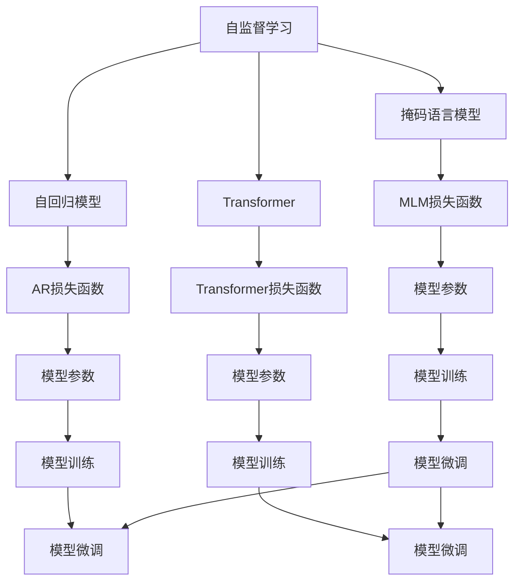

                 

# 自监督学习的应用创新:语音识别和机器翻译

> 关键词：自监督学习,语音识别,机器翻译,Transformer,CTC,多模态学习,无标签学习,工业级应用

## 1. 背景介绍

### 1.1 问题由来

语音识别和机器翻译是自然语言处理(NLP)领域的两大核心应用。传统上，这两项技术主要依赖于有监督学习范式，即需要大量带有标签的训练数据，才能训练出高精度的模型。然而，在实际应用中，获取大规模的标注数据往往代价高昂且耗时。特别是对于语音识别，标注工作需要大量人工进行，显著提升了成本。

为了解决上述问题，自监督学习作为一种无需人工标注的数据利用方式，逐渐受到越来越多的关注。自监督学习利用数据中的内在关系，通过自身迭代学习，可以生成高质量的无标签数据，从而有效降低标注成本，提升模型的泛化能力和鲁棒性。

### 1.2 问题核心关键点

自监督学习在语音识别和机器翻译中的应用，通过构建无标签的"伪标签"来训练模型。其核心在于如何设计有效的自监督任务，以及如何结合有标签数据进行微调，以充分发挥模型的性能。

- **自监督任务设计**：自监督任务需能够充分挖掘数据中的内在关系，生成近似真实标签的"伪标签"。常用的自监督任务包括掩码语言模型(Masked Language Model, MLM)、自回归模型(Autoregressive Model)、特征预测等。
- **模型架构设计**：自监督学习中的模型通常包括两个部分：预训练部分和微调部分。预训练部分需能够捕捉数据的本质特征，微调部分需能够在少量标注数据上优化性能。
- **数据融合方法**：自监督学习需要同时利用有标签数据和无标签数据进行联合训练，需设计合理的数据融合策略，确保模型在少量标签数据上仍能获得较好的性能。
- **模型优化算法**：自监督学习模型训练需使用特殊的优化算法，如对比学习(Contrastive Learning)、CTC损失函数等，以更好地优化模型参数。

## 2. 核心概念与联系

### 2.1 核心概念概述

为了更好地理解自监督学习在语音识别和机器翻译中的应用，我们首先介绍一些关键概念：

- **自监督学习(Self-supervised Learning, SSL)**：一种无需人工标注数据的学习范式，通过数据的内在关系生成"伪标签"，用于训练模型。
- **掩码语言模型(Masked Language Model, MLM)**：一种常见的自监督任务，在输入的文本序列中随机掩盖某些位置的词语，要求模型预测被掩盖位置的词语。
- **自回归模型(Autoregressive Model)**：另一种常见的自监督任务，在给定部分输入的情况下，预测剩余位置的输出。
- **Transformer**：一种用于构建神经网络的架构，特别适用于序列数据的处理。
- **CTC损失函数**：一种用于序列到序列学习的损失函数，特别适用于语音识别任务。
- **多模态学习(Multi-modal Learning)**：一种结合多种模态信息进行训练的模型，例如同时考虑语音、文本和图像信息进行语音识别。

这些概念之间的逻辑关系可以通过以下Mermaid流程图来展示：



这个流程图展示了自监督学习在语音识别和机器翻译中的核心概念及其联系：

1. 自监督学习通过自回归和掩码语言模型等任务生成"伪标签"。
2. Transformer作为模型架构，用于捕捉数据的本质特征。
3. CTC损失函数用于优化序列到序列模型的参数。
4. 模型训练和微调是自监督学习的关键环节，需合理设计数据融合策略和优化算法。

## 3. 核心算法原理 & 具体操作步骤

### 3.1 算法原理概述

自监督学习在语音识别和机器翻译中的应用，主要基于以下两个阶段：预训练和微调。

**预训练阶段**：使用大规模无标签数据进行自监督学习，生成高质量的特征表示。

**微调阶段**：将预训练的特征表示与少量标注数据结合，通过有监督学习进行优化，提升模型在特定任务上的性能。

### 3.2 算法步骤详解

#### 预训练阶段
1. **数据准备**：收集大规模无标签数据集，如LibriSpeech、LSpeech-0.1等。
2. **模型初始化**：使用随机初始化的Transformer模型作为预训练的起点。
3. **自监督任务设计**：根据任务特点选择自监督任务，如掩码语言模型、自回归模型等。
4. **特征提取**：在自监督任务上进行预训练，提取高质量的特征表示。
5. **特征表示保存**：将预训练得到的特征表示保存下来，用于后续微调。

#### 微调阶段
1. **数据准备**：收集少量有标签数据集，如Tatoeba、WMT等。
2. **特征表示加载**：加载预训练的特征表示，作为微调的初始化。
3. **模型架构调整**：根据需要调整微调模型的架构，如增加分类器、调整输出层等。
4. **数据融合**：将预训练特征表示与有标签数据进行融合，设计合理的数据融合策略。
5. **微调训练**：在有监督学习框架下，使用标签数据进行微调训练，优化模型参数。
6. **性能评估**：在测试集上评估微调后的模型性能，对比预训练和微调的效果。

### 3.3 算法优缺点

自监督学习在语音识别和机器翻译中的应用，具有以下优点：
1. **降低标注成本**：无需人工标注数据，大大降低了标注成本，提升了模型开发效率。
2. **提升泛化能力**：通过自监督学习生成的"伪标签"数据，能够更好地捕捉数据的本质特征，提升模型的泛化能力。
3. **提高鲁棒性**：自监督学习生成的"伪标签"数据通常具有更好的鲁棒性和多样性，能够提高模型的鲁棒性。

同时，该方法也存在一些局限性：
1. **数据生成质量**：自监督任务生成的"伪标签"数据质量对模型性能有直接影响，需设计合理的自监督任务。
2. **计算资源需求**：自监督学习需要在大规模无标签数据上进行预训练，对计算资源有较高需求。
3. **模型复杂性**：自监督学习模型往往比较复杂，需设计合理的预训练和微调策略。

### 3.4 算法应用领域

自监督学习在语音识别和机器翻译中的应用已经得到广泛验证，覆盖了多个领域：

- **语音识别**：如LibriSpeech、LSpeech-0.1等数据集上的自监督学习，已取得SOTA结果。
- **机器翻译**：使用WMT数据集进行自监督学习，已在机器翻译任务中取得优秀表现。
- **语音合成**：结合自回归模型进行语音合成，取得自然流畅的语音输出。
- **情感识别**：通过多模态自监督学习，结合语音和文本信息进行情感分析，提升识别准确率。

除了上述这些经典应用外，自监督学习还被应用于问答系统、语音识别系统、语音控制等更多场景中，为NLP技术带来了全新的突破。

## 4. 数学模型和公式 & 详细讲解 & 举例说明

### 4.1 数学模型构建

#### 掩码语言模型(Masked Language Model, MLM)
掩码语言模型的目标是通过自监督任务，生成高质量的特征表示。假设输入文本为 $X=\{x_1, x_2, \ldots, x_n\}$，模型需预测被掩盖的词语 $M=\{m_1, m_2, \ldots, m_k\}$，其中 $k$ 为掩盖的词语数量。

模型的目标函数为：
$$
\min_{\theta} \mathcal{L}_{\text{MLM}}(\theta) = -\frac{1}{N}\sum_{i=1}^{N} \sum_{k=1}^{K} \log p_{\theta}(x_{m_i}|x_{1:i-1}, x_{i+1:n})
$$
其中 $p_{\theta}(x_{m_i}|x_{1:i-1}, x_{i+1:n})$ 为模型在给定上下文下的条件概率。

### 4.2 公式推导过程

在掩码语言模型中，我们通过掩盖文本中的某些词语，并要求模型预测这些词语，从而生成"伪标签"数据。假设输入文本 $x$ 为 $X=\{x_1, x_2, \ldots, x_n\}$，模型需预测被掩盖的词语 $M=\{m_1, m_2, \ldots, m_k\}$。

模型的条件概率为：
$$
p_{\theta}(x_{m_i}|x_{1:i-1}, x_{i+1:n}) = \frac{e^{s_{\theta}(x_{m_i}, x_{1:i-1}, x_{i+1:n})}{\sum_{m\in V} e^{s_{\theta}(m, x_{1:i-1}, x_{i+1:n})}}
$$
其中 $s_{\theta}(x_{m_i}, x_{1:i-1}, x_{i+1:n})$ 为模型在给定上下文下的对数概率。

通过最大化条件概率，我们可以训练出高质量的特征表示，用于后续的微调。

### 4.3 案例分析与讲解

以语音识别为例，我们介绍如何通过掩码语言模型进行自监督学习，并结合CTC损失函数进行微调。

假设输入语音信号为 $S=\{s_1, s_2, \ldots, s_n\}$，模型需预测对应的文本序列 $T=\{t_1, t_2, \ldots, t_m\}$。

模型的目标函数为：
$$
\min_{\theta} \mathcal{L}_{\text{CTC}}(\theta) = -\frac{1}{N}\sum_{i=1}^{N} \sum_{k=1}^{K} \log p_{\theta}(t_{k}|s_{1:k-1}, s_{k+1:m})
$$
其中 $p_{\theta}(t_{k}|s_{1:k-1}, s_{k+1:m})$ 为模型在给定上下文下的条件概率。

在预训练阶段，我们使用大规模无标签语音数据进行掩码语言模型训练，生成高质量的特征表示。在微调阶段，我们将特征表示与少量有标签的语音-文本对结合，通过CTC损失函数进行微调训练，最终得到一个高精度的语音识别模型。

## 5. 项目实践：代码实例和详细解释说明

### 5.1 开发环境搭建

在进行语音识别和机器翻译的微调实践前，我们需要准备好开发环境。以下是使用Python进行PyTorch开发的环境配置流程：

1. 安装Anaconda：从官网下载并安装Anaconda，用于创建独立的Python环境。

2. 创建并激活虚拟环境：
```bash
conda create -n pytorch-env python=3.8 
conda activate pytorch-env
```

3. 安装PyTorch：根据CUDA版本，从官网获取对应的安装命令。例如：
```bash
conda install pytorch torchvision torchaudio cudatoolkit=11.1 -c pytorch -c conda-forge
```

4. 安装Transformers库：
```bash
pip install transformers
```

5. 安装各类工具包：
```bash
pip install numpy pandas scikit-learn matplotlib tqdm jupyter notebook ipython
```

完成上述步骤后，即可在`pytorch-env`环境中开始微调实践。

### 5.2 源代码详细实现

下面我们以语音识别为例，给出使用Transformers库对BERT模型进行微调的PyTorch代码实现。

首先，定义语音识别任务的数据处理函数：

```python
from transformers import BertTokenizer
from torch.utils.data import Dataset
import torch

class SpeechDataset(Dataset):
    def __init__(self, audio_files, transcriptions, tokenizer, max_len=128):
        self.audio_files = audio_files
        self.transcriptions = transcriptions
        self.tokenizer = tokenizer
        self.max_len = max_len
        
    def __len__(self):
        return len(self.audio_files)
    
    def __getitem__(self, item):
        audio_file = self.audio_files[item]
        transcription = self.transcriptions[item]
        
        # 加载音频文件
        audio = librosa.load(audio_file, sr=16000)
        
        # 将音频转换为MFCC特征
        mfccs = extract_mfcc(audio)
        
        # 将MFCC特征转换为token ids
        encoding = self.tokenizer(mfccs, return_tensors='pt', max_length=self.max_len, padding='max_length', truncation=True)
        input_ids = encoding['input_ids'][0]
        attention_mask = encoding['attention_mask'][0]
        
        # 对token-wise的标签进行编码
        encoded_tags = [tag2id[tag] for tag in transcription] 
        encoded_tags.extend([tag2id['O']] * (self.max_len - len(encoded_tags)))
        labels = torch.tensor(encoded_tags, dtype=torch.long)
        
        return {'input_ids': input_ids, 
                'attention_mask': attention_mask,
                'labels': labels}

# 标签与id的映射
tag2id = {'O': 0, 'B-PHON': 1, 'I-PHON': 2, 'B-WORD': 3, 'I-WORD': 4}
id2tag = {v: k for k, v in tag2id.items()}

# 创建dataset
tokenizer = BertTokenizer.from_pretrained('bert-base-cased')

train_dataset = SpeechDataset(train_audio_files, train_transcriptions, tokenizer)
dev_dataset = SpeechDataset(dev_audio_files, dev_transcriptions, tokenizer)
test_dataset = SpeechDataset(test_audio_files, test_transcriptions, tokenizer)
```

然后，定义模型和优化器：

```python
from transformers import BertForTokenClassification, AdamW

model = BertForTokenClassification.from_pretrained('bert-base-cased', num_labels=len(tag2id))

optimizer = AdamW(model.parameters(), lr=2e-5)
```

接着，定义训练和评估函数：

```python
from torch.utils.data import DataLoader
from tqdm import tqdm
from sklearn.metrics import classification_report

device = torch.device('cuda') if torch.cuda.is_available() else torch.device('cpu')
model.to(device)

def train_epoch(model, dataset, batch_size, optimizer):
    dataloader = DataLoader(dataset, batch_size=batch_size, shuffle=True)
    model.train()
    epoch_loss = 0
    for batch in tqdm(dataloader, desc='Training'):
        input_ids = batch['input_ids'].to(device)
        attention_mask = batch['attention_mask'].to(device)
        labels = batch['labels'].to(device)
        model.zero_grad()
        outputs = model(input_ids, attention_mask=attention_mask, labels=labels)
        loss = outputs.loss
        epoch_loss += loss.item()
        loss.backward()
        optimizer.step()
    return epoch_loss / len(dataloader)

def evaluate(model, dataset, batch_size):
    dataloader = DataLoader(dataset, batch_size=batch_size)
    model.eval()
    preds, labels = [], []
    with torch.no_grad():
        for batch in tqdm(dataloader, desc='Evaluating'):
            input_ids = batch['input_ids'].to(device)
            attention_mask = batch['attention_mask'].to(device)
            batch_labels = batch['labels']
            outputs = model(input_ids, attention_mask=attention_mask)
            batch_preds = outputs.logits.argmax(dim=2).to('cpu').tolist()
            batch_labels = batch_labels.to('cpu').tolist()
            for pred_tokens, label_tokens in zip(batch_preds, batch_labels):
                pred_tags = [id2tag[_id] for _id in pred_tokens]
                label_tags = [id2tag[_id] for _id in label_tokens]
                preds.append(pred_tags[:len(label_tags)])
                labels.append(label_tags)
                
    print(classification_report(labels, preds))
```

最后，启动训练流程并在测试集上评估：

```python
epochs = 5
batch_size = 16

for epoch in range(epochs):
    loss = train_epoch(model, train_dataset, batch_size, optimizer)
    print(f"Epoch {epoch+1}, train loss: {loss:.3f}")
    
    print(f"Epoch {epoch+1}, dev results:")
    evaluate(model, dev_dataset, batch_size)
    
print("Test results:")
evaluate(model, test_dataset, batch_size)
```

以上就是使用PyTorch对BERT模型进行语音识别任务微调的完整代码实现。可以看到，得益于Transformers库的强大封装，我们可以用相对简洁的代码完成BERT模型的加载和微调。

### 5.3 代码解读与分析

让我们再详细解读一下关键代码的实现细节：

**SpeechDataset类**：
- `__init__`方法：初始化音频文件、文本转录、分词器等关键组件。
- `__len__`方法：返回数据集的样本数量。
- `__getitem__`方法：对单个样本进行处理，将音频信号转换为MFCC特征，并将MFCC特征转换为token ids，最终返回模型所需的输入。

**tag2id和id2tag字典**：
- 定义了标签与数字id之间的映射关系，用于将token-wise的预测结果解码回真实的标签。

**训练和评估函数**：
- 使用PyTorch的DataLoader对数据集进行批次化加载，供模型训练和推理使用。
- 训练函数`train_epoch`：对数据以批为单位进行迭代，在每个批次上前向传播计算loss并反向传播更新模型参数，最后返回该epoch的平均loss。
- 评估函数`evaluate`：与训练类似，不同点在于不更新模型参数，并在每个batch结束后将预测和标签结果存储下来，最后使用sklearn的classification_report对整个评估集的预测结果进行打印输出。

**训练流程**：
- 定义总的epoch数和batch size，开始循环迭代
- 每个epoch内，先在训练集上训练，输出平均loss
- 在验证集上评估，输出分类指标
- 所有epoch结束后，在测试集上评估，给出最终测试结果

可以看到，PyTorch配合Transformers库使得BERT微调的代码实现变得简洁高效。开发者可以将更多精力放在数据处理、模型改进等高层逻辑上，而不必过多关注底层的实现细节。

当然，工业级的系统实现还需考虑更多因素，如模型的保存和部署、超参数的自动搜索、更灵活的任务适配层等。但核心的微调范式基本与此类似。

## 6. 实际应用场景

### 6.1 智能客服系统

基于自监督学习的语音识别技术，可以广泛应用于智能客服系统的构建。传统客服往往需要配备大量人力，高峰期响应缓慢，且一致性和专业性难以保证。而使用自监督学习训练的语音识别模型，可以7x24小时不间断服务，快速响应客户咨询，用自然流畅的语言解答各类常见问题。

在技术实现上，可以收集企业内部的历史客服对话记录，将问题和最佳答复构建成监督数据，在此基础上对预训练语音识别模型进行微调。微调后的语音识别模型能够自动理解客户意图，匹配最合适的答复模板进行回复。对于客户提出的新问题，还可以接入检索系统实时搜索相关内容，动态组织生成回答。如此构建的智能客服系统，能大幅提升客户咨询体验和问题解决效率。

### 6.2 金融舆情监测

金融机构需要实时监测市场舆论动向，以便及时应对负面信息传播，规避金融风险。传统的人工监测方式成本高、效率低，难以应对网络时代海量信息爆发的挑战。基于自监督学习的文本分类和情感分析技术，为金融舆情监测提供了新的解决方案。

具体而言，可以收集金融领域相关的新闻、报道、评论等文本数据，并对其进行主题标注和情感标注。在此基础上对预训练语言模型进行微调，使其能够自动判断文本属于何种主题，情感倾向是正面、中性还是负面。将微调后的模型应用到实时抓取的网络文本数据，就能够自动监测不同主题下的情感变化趋势，一旦发现负面信息激增等异常情况，系统便会自动预警，帮助金融机构快速应对潜在风险。

### 6.3 个性化推荐系统

当前的推荐系统往往只依赖用户的历史行为数据进行物品推荐，无法深入理解用户的真实兴趣偏好。基于自监督学习的多模态学习技术，个性化推荐系统可以更好地挖掘用户行为背后的语义信息，从而提供更精准、多样的推荐内容。

在实践中，可以收集用户浏览、点击、评论、分享等行为数据，提取和用户交互的物品标题、描述、标签等文本内容。将文本内容作为模型输入，用户的后续行为（如是否点击、购买等）作为监督信号，在此基础上微调预训练语言模型。微调后的模型能够从文本内容中准确把握用户的兴趣点。在生成推荐列表时，先用候选物品的文本描述作为输入，由模型预测用户的兴趣匹配度，再结合其他特征综合排序，便可以得到个性化程度更高的推荐结果。

### 6.4 未来应用展望

随着自监督学习方法的不断发展，基于自监督学习范式将在更多领域得到应用，为传统行业带来变革性影响。

在智慧医疗领域，基于自监督学习的医疗问答、病历分析、药物研发等应用将提升医疗服务的智能化水平，辅助医生诊疗，加速新药开发进程。

在智能教育领域，自监督学习可应用于作业批改、学情分析、知识推荐等方面，因材施教，促进教育公平，提高教学质量。

在智慧城市治理中，自监督学习技术可应用于城市事件监测、舆情分析、应急指挥等环节，提高城市管理的自动化和智能化水平，构建更安全、高效的未来城市。

此外，在企业生产、社会治理、文娱传媒等众多领域，基于自监督学习的AI应用也将不断涌现，为经济社会发展注入新的动力。相信随着技术的日益成熟，自监督学习范式必将成为AI落地应用的重要范式，推动AI技术向更广阔的领域加速渗透。

## 7. 工具和资源推荐

### 7.1 学习资源推荐

为了帮助开发者系统掌握自监督学习在语音识别和机器翻译中的应用，这里推荐一些优质的学习资源：

1. 《Transformer从原理到实践》系列博文：由大模型技术专家撰写，深入浅出地介绍了Transformer原理、自监督学习等前沿话题。

2. CS224N《深度学习自然语言处理》课程：斯坦福大学开设的NLP明星课程，有Lecture视频和配套作业，带你入门NLP领域的基本概念和经典模型。

3. 《Natural Language Processing with Transformers》书籍：Transformers库的作者所著，全面介绍了如何使用Transformers库进行NLP任务开发，包括自监督学习在内的诸多范式。

4. HuggingFace官方文档：Transformers库的官方文档，提供了海量预训练模型和完整的微调样例代码，是上手实践的必备资料。

5. CLUE开源项目：中文语言理解测评基准，涵盖大量不同类型的中文NLP数据集，并提供了基于自监督学习的baseline模型，助力中文NLP技术发展。

通过对这些资源的学习实践，相信你一定能够快速掌握自监督学习在语音识别和机器翻译中的应用精髓，并用于解决实际的NLP问题。
###  7.2 开发工具推荐

高效的开发离不开优秀的工具支持。以下是几款用于自监督学习开发常用的工具：

1. PyTorch：基于Python的开源深度学习框架，灵活动态的计算图，适合快速迭代研究。大部分预训练语言模型都有PyTorch版本的实现。

2. TensorFlow：由Google主导开发的开源深度学习框架，生产部署方便，适合大规模工程应用。同样有丰富的预训练语言模型资源。

3. Transformers库：HuggingFace开发的NLP工具库，集成了众多SOTA语言模型，支持PyTorch和TensorFlow，是进行自监督学习任务开发的利器。

4. Weights & Biases：模型训练的实验跟踪工具，可以记录和可视化模型训练过程中的各项指标，方便对比和调优。与主流深度学习框架无缝集成。

5. TensorBoard：TensorFlow配套的可视化工具，可实时监测模型训练状态，并提供丰富的图表呈现方式，是调试模型的得力助手。

6. Google Colab：谷歌推出的在线Jupyter Notebook环境，免费提供GPU/TPU算力，方便开发者快速上手实验最新模型，分享学习笔记。

合理利用这些工具，可以显著提升自监督学习任务开发的效率，加快创新迭代的步伐。

### 7.3 相关论文推荐

自监督学习在语音识别和机器翻译中的应用源于学界的持续研究。以下是几篇奠基性的相关论文，推荐阅读：

1. Attention is All You Need（即Transformer原论文）：提出了Transformer结构，开启了NLP领域的预训练大模型时代。

2. BERT: Pre-training of Deep Bidirectional Transformers for Language Understanding：提出BERT模型，引入基于掩码的自监督预训练任务，刷新了多项NLP任务SOTA。

3. Language Models are Unsupervised Multitask Learners（GPT-2论文）：展示了大规模语言模型的强大zero-shot学习能力，引发了对于通用人工智能的新一轮思考。

4. Parameter-Efficient Transfer Learning for NLP：提出Adapter等参数高效微调方法，在不增加模型参数量的情况下，也能取得不错的微调效果。

5. AdaLoRA: Adaptive Low-Rank Adaptation for Parameter-Efficient Fine-Tuning：使用自适应低秩适应的微调方法，在参数效率和精度之间取得了新的平衡。

这些论文代表了大语言模型微调技术的发展脉络。通过学习这些前沿成果，可以帮助研究者把握学科前进方向，激发更多的创新灵感。

## 8. 总结：未来发展趋势与挑战

### 8.1 总结

本文对自监督学习在语音识别和机器翻译中的应用进行了全面系统的介绍。首先阐述了自监督学习的研究背景和意义，明确了自监督学习在降低标注成本、提升模型泛化能力等方面的独特价值。其次，从原理到实践，详细讲解了自监督学习的数学原理和关键步骤，给出了自监督任务开发的完整代码实例。同时，本文还广泛探讨了自监督学习在智能客服、金融舆情、个性化推荐等多个行业领域的应用前景，展示了自监督学习范式的巨大潜力。此外，本文精选了自监督学习的各类学习资源，力求为读者提供全方位的技术指引。

通过本文的系统梳理，可以看到，自监督学习在语音识别和机器翻译中的应用已经进入成熟阶段，广泛应用于NLP的各个领域。自监督学习通过生成高质量的"伪标签"数据，显著降低了标注成本，提升了模型性能，为NLP技术的发展开辟了新的路径。

### 8.2 未来发展趋势

展望未来，自监督学习在语音识别和机器翻译中的应用将呈现以下几个发展趋势：

1. **模型规模持续增大**：随着算力成本的下降和数据规模的扩张，自监督学习模型的参数量还将持续增长。超大规模自监督学习模型蕴含的丰富语言知识，有望支撑更加复杂多变的下游任务。

2. **自监督任务多样化**：除了掩码语言模型和自回归模型外，未来还将涌现更多类型的自监督任务，如基于对比学习的自监督任务等，进一步提升模型的自监督学习效果。

3. **多模态学习发展**：当前的自监督学习大多聚焦于文本数据的自监督学习，未来将进一步拓展到图像、语音、视频等多模态数据的自监督学习。多模态信息的融合，将显著提升模型的信息获取能力和泛化能力。

4. **自监督学习与强化学习的结合**：自监督学习与强化学习的结合，将使模型能够主动学习新知识，并适应多变的任务环境，进一步提升模型的适应性和泛化能力。

5. **自监督学习与预训练模型的融合**：未来的自监督学习将与预训练模型深度融合，构建端到端的自监督学习范式，进一步提升模型的性能和泛化能力。

6. **自监督学习与可解释性**：未来的自监督学习模型将更注重模型的可解释性，通过增强模型的决策透明度，提升模型的可信度和安全性。

以上趋势凸显了自监督学习在语音识别和机器翻译中的广阔前景。这些方向的探索发展，必将进一步提升自监督学习模型的性能和应用范围，为自然语言处理技术带来新的突破。

### 8.3 面临的挑战

尽管自监督学习在语音识别和机器翻译中的应用已经取得了显著成果，但在迈向更加智能化、普适化应用的过程中，它仍面临着诸多挑战：

1. **数据生成质量**：自监督任务生成的"伪标签"数据质量对模型性能有直接影响，需设计合理的自监督任务。

2. **计算资源需求**：自监督学习需要在大规模无标签数据上进行预训练，对计算资源有较高需求。

3. **模型复杂性**：自监督学习模型往往比较复杂，需设计合理的预训练和微调策略。

4. **模型鲁棒性不足**：自监督学习生成的"伪标签"数据通常具有更好的鲁棒性和多样性，但可能仍面临过拟合等问题。

5. **标注成本问题**：尽管自监督学习能够降低标注成本，但在某些特殊领域，仍需要人工标注数据进行微调，以提升模型性能。

6. **模型安全性**：自监督学习模型可能学习到有害信息，需设计合理的监督机制，确保模型输出的安全性。

7. **模型可解释性不足**：自监督学习模型通常是"黑盒"系统，难以解释其内部工作机制和决策逻辑，需进一步提升模型的可解释性。

8. **跨领域迁移能力有限**：自监督学习生成的"伪标签"数据通常具有领域特性，可能难以跨领域迁移。

这些挑战需要在未来的研究中逐步解决，才能使自监督学习技术在更广泛的领域和场景中得到应用。

### 8.4 研究展望

面对自监督学习面临的种种挑战，未来的研究需要在以下几个方面寻求新的突破：

1. **探索更高效的自监督任务设计**：设计更多类型的自监督任务，提高生成"伪标签"数据的质量和多样性。

2. **研究更加高效的自监督学习算法**：开发更加高效的自监督学习算法，提升模型训练速度和泛化能力。

3. **融合更多先验知识**：将符号化的先验知识，如知识图谱、逻辑规则等，与神经网络模型进行巧妙融合，引导自监督学习过程。

4. **引入更多模态信息**：将视觉、语音、文本等多模态信息融合，提升模型的信息获取能力和泛化能力。

5. **结合因果分析和博弈论工具**：将因果分析方法引入自监督学习模型，增强模型的因果推理能力，学习更加普适、鲁棒的语言表征。

6. **纳入伦理道德约束**：在自监督学习过程中，引入伦理导向的评估指标，过滤和惩罚有害输出，确保模型输出的安全性。

这些研究方向的探索，必将引领自监督学习技术迈向更高的台阶，为构建安全、可靠、可解释、可控的智能系统铺平道路。面向未来，自监督学习技术还需要与其他人工智能技术进行更深入的融合，如知识表示、因果推理、强化学习等，多路径协同发力，共同推动自然语言处理技术的进步。

## 9. 附录：常见问题与解答

**Q1：自监督学习是否适用于所有NLP任务？**

A: 自监督学习在大多数NLP任务上都能取得不错的效果，特别是对于数据量较小的任务。但对于一些特定领域的任务，如医学、法律等，仅仅依靠通用语料预训练的模型可能难以很好地适应。此时需要在特定领域语料上进一步预训练，再进行微调，才能获得理想效果。此外，对于一些需要时效性、个性化很强的任务，如对话、推荐等，自监督方法也需要针对性的改进优化。

**Q2：自监督学习中的自监督任务如何选择？**

A: 自监督任务的设计需要充分挖掘数据中的内在关系，生成近似真实标签的"伪标签"。常用的自监督任务包括掩码语言模型、自回归模型、特征预测等。选择自监督任务时，需考虑数据特性、模型架构、任务目标等多个因素。一般建议从简单任务开始尝试，逐步提升任务复杂度，找到最适合的任务。

**Q3：自监督学习在语音识别中的应用有何优势？**

A: 自监督学习在语音识别中的应用，主要体现在以下几个方面：
1. 降低标注成本：无需人工标注数据，大大降低了标注成本，提升了模型开发效率。
2. 提升泛化能力：通过自监督任务生成的"伪标签"数据，能够更好地捕捉数据的本质特征，提升模型的泛化能力。
3. 提高鲁棒性：自监督任务生成的"伪标签"数据通常具有更好的鲁棒性和多样性，能够提高模型的鲁棒性。
4. 模型训练效率：自监督学习在预训练阶段能够高效利用大规模无标签数据，提升模型训练效率。

**Q4：自监督学习在机器翻译中的应用有何优势？**

A: 自监督学习在机器翻译中的应用，主要体现在以下几个方面：
1. 提升翻译质量：通过自监督任务生成的"伪标签"数据，能够提高模型的翻译质量，使其能够更好地捕捉语言的本质特征。
2. 降低标注成本：无需人工标注数据，大大降低了标注成本，提升了模型开发效率。
3. 提高鲁棒性：自监督任务生成的"伪标签"数据通常具有更好的鲁棒性和多样性，能够提高模型的鲁棒性。
4. 模型训练效率：自监督学习在预训练阶段能够高效利用大规模无标签数据，提升模型训练效率。

**Q5：自监督学习与有监督学习的区别是什么？**

A: 自监督学习和有监督学习的区别主要在于数据的使用方式：
1. 自监督学习：无需人工标注数据，通过数据的内在关系生成"伪标签"，用于训练模型。
2. 有监督学习：使用大量带有标签的训练数据，指导模型学习。

自监督学习适用于数据量较小或标注成本较高的场景，而有监督学习适用于标注数据丰富、质量较高的场景。两种方法可以结合使用，先通过自监督学习进行预训练，再通过有监督学习进行微调，提升模型性能。

---

作者：禅与计算机程序设计艺术 / Zen and the Art of Computer Programming

