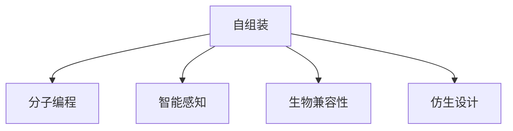

                 

# 自组装纳米机器人：精准医疗的新工具

> 关键词：自组装纳米机器人,精准医疗,微电机械系统(MEMS),生物医学工程,仿生设计,工程生物学

## 1. 背景介绍

### 1.1 问题由来
随着生物技术的迅猛发展和人类对健康需求的日益增长，精准医疗已成为现代医学研究的重要方向。精准医疗旨在通过个性化治疗，提升治疗效果，减少副作用。为了实现这一目标，需要在微米级尺度上，对生物组织和细胞进行操控，实现复杂药物递送、疾病监测和诊断等任务。然而，传统机械和电子技术在微米尺度下性能受限，难以满足精准医疗的需求。因此，科学家们开始探索在纳米尺度上进行自组装与操控的新技术。

自组装纳米机器人（Self-Assembled Nanorobotics）便是其中的重要方向。自组装纳米机器人利用自然界的分子相互作用，通过编程指导的化学反应，在纳米尺度上自我构建、组合和操作。这一技术具有尺寸小、反应快、响应灵敏等优点，能够在精准医疗领域发挥巨大潜力。

### 1.2 问题核心关键点
自组装纳米机器人的研究涉及到化学、机械、电子、生物等多个学科领域，其核心关键点如下：

1. **分子自组装机制**：利用分子间的相互作用，如范德华力、氢键、离子键等，在纳米尺度上实现分子的自组织。
2. **编程控制**：通过外部电磁场、光场、温度场等手段，实现对分子自组装过程的编程控制。
3. **智能感知与反馈**：结合微电机械系统（MEMS）和生物传感器，实现纳米机器人的智能感知和反馈功能。
4. **多功能融合**：集成了传感器、执行器和通信模块，具备感知、执行、通信等多种功能。
5. **生物兼容性**：在生物体内具有良好的兼容性和生物降解性，不产生毒副作用。

通过这些关键技术，自组装纳米机器人能够实现复杂的生物医学功能，为精准医疗提供新工具。

## 2. 核心概念与联系

### 2.1 核心概念概述

为更好地理解自组装纳米机器人的原理和应用，本节将介绍几个密切相关的核心概念：

- **自组装**：指分子或纳米材料通过非共价键相互作用，自发组织成有序结构的物理过程。
- **分子编程**：通过设计特定的化学功能基团，利用外部场驱动，实现分子自组装过程的可编程控制。
- **智能感知**：利用分子传感器、电子传感器等，实现纳米机器人对环境参数的智能感知。
- **生物兼容性**：指纳米机器人与生物体具有良好的生物相容性，不引起生物体内的毒副作用。
- **仿生设计**：模仿自然界中的生物结构和功能，设计出高效的纳米机器人。

这些核心概念之间的逻辑关系可以通过以下Mermaid流程图来展示：



这个流程图展示了几类关键技术的关联关系：

1. 自组装技术是其他技术的基础，通过分子间的相互作用，实现纳米结构的有序组织。
2. 分子编程技术通过编程控制自组装过程，赋予纳米机器人智能和功能。
3. 智能感知技术使纳米机器人能够感知外部环境，实现自主导航和任务执行。
4. 生物兼容性技术确保纳米机器人在生物体内长期工作，不产生毒副作用。
5. 仿生设计技术借鉴自然界中的结构与功能，提升纳米机器人的效率和可靠性。

这些核心概念共同构成了自组装纳米机器人的设计基础和应用框架，使其能够在生物体内高效运作，为精准医疗提供新工具。

## 3. 核心算法原理 & 具体操作步骤
### 3.1 算法原理概述

自组装纳米机器人的核心算法原理包括以下几个方面：

1. **分子自组装机制**：利用分子间的相互作用力，如范德华力、氢键、离子键等，在纳米尺度上实现分子的自组织。
2. **分子编程控制**：通过外部电磁场、光场、温度场等手段，实现对分子自组装过程的编程控制。
3. **智能感知与反馈**：结合微电机械系统（MEMS）和生物传感器，实现纳米机器人的智能感知和反馈功能。
4. **多功能融合**：集成了传感器、执行器和通信模块，具备感知、执行、通信等多种功能。

这些原理共同构成了自组装纳米机器人工作的基础。

### 3.2 算法步骤详解

自组装纳米机器人的开发流程一般包括以下几个关键步骤：

**Step 1: 分子设计**
- 选择合适的分子材料，设计分子的化学结构和功能基团。
- 通过计算模拟和实验验证，确定分子间的相互作用机制。

**Step 2: 分子合成**
- 利用化学合成方法，制备目标分子。
- 通过光学、电学等手段，对合成的分子进行表征和优化。

**Step 3: 分子自组装**
- 在预设条件下，实现分子的自组织和自组装。
- 通过编程控制，调整自组装过程中的反应条件，实现自组装的可控性。

**Step 4: 集成与封装**
- 将自组装成的纳米结构集成到微电机械系统中。
- 封装纳米机器人，使其具备智能感知和通信功能。

**Step 5: 测试与优化**
- 在体外模拟环境下，测试纳米机器人的性能。
- 根据测试结果，优化纳米机器人的设计和自组装过程。

### 3.3 算法优缺点

自组装纳米机器人的开发和应用，具有以下优点：

1. **尺寸小、反应快**：在纳米尺度上进行操控，反应速度更快，更高效。
2. **生物兼容性**：与生物组织具有良好的兼容性，不易引起毒副作用。
3. **多功能集成**：集成了传感器、执行器和通信模块，具备多种功能。
4. **可编程控制**：可以通过编程控制，实现自组装过程的可控性。

同时，该技术也存在一定的局限性：

1. **合成复杂**：分子设计的复杂性较大，合成难度较高。
2. **控制精度**：在纳米尺度上，精确控制分子的自组装和组装过程存在挑战。
3. **稳定性**：在复杂的生物环境中，纳米机器人的稳定性需要进一步验证。
4. **成本高**：目前自组装纳米机器人的研发成本较高，推广应用难度较大。

尽管存在这些局限性，但自组装纳米机器人具有巨大的应用潜力，正在逐步走向成熟。

### 3.4 算法应用领域

自组装纳米机器人在生物医学工程领域有广泛的应用前景，包括但不限于以下几个方面：

1. **药物递送**：利用纳米机器人进行靶向药物递送，提升药物的生物利用度，减少副作用。
2. **疾病监测**：设计可植入纳米机器人，监测人体内生物标志物的变化，实现早期诊断。
3. **生物传感器**：利用纳米机器人进行生物传感器设计，检测病原体、细胞信号等生物信息。
4. **组织工程**：利用纳米机器人进行细胞培养和组织构建，加速组织修复和再生。
5. **个性化医疗**：根据患者的具体情况，设计定制化的纳米机器人，提供个性化治疗方案。

此外，自组装纳米机器人也在环境监测、材料科学等领域展现出广阔的应用前景。

## 4. 数学模型和公式 & 详细讲解  
### 4.1 数学模型构建

自组装纳米机器人的开发涉及大量化学和物理过程，其数学模型构建需要结合分子动态模拟、化学反应动力学、电磁场理论等知识。下面以分子自组装和编程控制为例，构建数学模型。

**分子自组装模型**：
设分子 $A$ 和 $B$ 通过氢键相互作用，其自组装过程的自由能变化 $\Delta G$ 可以表示为：

$$
\Delta G = k_B T \ln \left(\frac{\alpha_A \alpha_B \left[\frac{c_A}{\Delta G_A} + \frac{c_B}{\Delta G_B}\right] + \frac{c_A c_B}{\Delta G_A \Delta G_B} \exp\left(-\frac{U}{k_B T}\right)}{\alpha_A \alpha_B \left[\frac{c_A}{\Delta G_A} + \frac{c_B}{\Delta G_B}\right]}\right)
$$

其中，$k_B$ 是玻尔兹曼常数，$T$ 是温度，$\alpha_A$ 和 $\alpha_B$ 是分子 $A$ 和 $B$ 的活度系数，$c_A$ 和 $c_B$ 是分子 $A$ 和 $B$ 的浓度，$\Delta G_A$ 和 $\Delta G_B$ 是分子 $A$ 和 $B$ 的自由能变化，$U$ 是相互作用势能。

**分子编程模型**：
设外部场 $E$ 与分子 $A$ 和 $B$ 的相互作用势能 $U$ 可以表示为：

$$
U = \begin{cases}
U_0 & \text{if } \vec{r}_A \cdot \vec{E} > 0 \text{ and } \vec{r}_B \cdot \vec{E} > 0 \\
0 & \text{otherwise}
\end{cases}
$$

其中，$\vec{r}_A$ 和 $\vec{r}_B$ 是分子 $A$ 和 $B$ 的位置向量，$U_0$ 是预设的相互作用势能。

### 4.2 公式推导过程

分子自组装和编程控制的数学模型推导过程如下：

**分子自组装**：

1. **自由能变化模型**：根据吉布斯自由能公式，分子的自组装过程的自由能变化 $\Delta G$ 可以表示为：

$$
\Delta G = -RT \ln K
$$

其中，$R$ 是气体常数，$K$ 是自组装反应的平衡常数。

2. **活度系数模型**：分子的活度系数 $\alpha$ 可以表示为：

$$
\alpha = \frac{\gamma}{RT}
$$

其中，$\gamma$ 是分子的表面张力系数。

3. **相互作用势能模型**：分子间的相互作用势能 $U$ 可以表示为：

$$
U = \frac{1}{4\pi\epsilon_0} \frac{q_A q_B}{r}
$$

其中，$\epsilon_0$ 是真空介电常数，$q_A$ 和 $q_B$ 是分子 $A$ 和 $B$ 的电荷。

**分子编程**：

1. **外部场模型**：外部场 $E$ 与分子 $A$ 和 $B$ 的相互作用势能 $U$ 可以表示为：

$$
U = \begin{cases}
U_0 & \text{if } \vec{r}_A \cdot \vec{E} > 0 \text{ and } \vec{r}_B \cdot \vec{E} > 0 \\
0 & \text{otherwise}
\end{cases}
$$

2. **编程控制模型**：通过控制外部场 $E$ 的强度和方向，实现对分子自组装过程的编程控制。

### 4.3 案例分析与讲解

以一种常见的自组装纳米机器人为例，进行详细讲解。

**案例**：基于DNA链的自组装纳米机器人

**材料**：DNA链

**自组装机制**：利用DNA链间的互补配对，实现分子自组装。

**分子设计**：
- 设计DNA链 $A$ 和 $B$，使其能够通过氢键和碱基配对，形成稳定的双链结构。
- 引入特定的功能基团，如荧光标记、抗体结合位点等。

**分子合成**：
- 通过化学合成方法，制备目标DNA链。
- 通过紫外光谱、荧光光谱等手段，对合成的DNA链进行表征和优化。

**分子自组装**：
- 在预设条件下，将DNA链 $A$ 和 $B$ 混合，通过氢键和碱基配对，自组装成稳定的双链结构。
- 通过编程控制外部磁场，实现分子自组装过程的可控性。

**集成与封装**：
- 将自组装成的双链DNA封装到微电机械系统中，如金纳米粒子。
- 引入电子传感器和执行器模块，实现纳米机器人的智能感知和执行功能。

**测试与优化**：
- 在体外模拟环境下，测试纳米机器人的性能。
- 根据测试结果，优化DNA链的设计和自组装过程。

## 5. 项目实践：代码实例和详细解释说明
### 5.1 开发环境搭建

在进行自组装纳米机器人的开发前，我们需要准备好开发环境。以下是使用Python进行分子动力学模拟和电磁场计算的环境配置流程：

1. 安装Python：从官网下载并安装Python，推荐使用Anaconda环境。

2. 安装必要的库：
- 安装分子动力学模拟库`LAMMPS`和`GROMACS`。
- 安装电磁场计算库`COMSOL Multiphysics`。

3. 配置环境：
- 设置环境变量，确保所有依赖库能够正常工作。
- 安装必要的图形界面工具，如`PyCharm`、`VSCode`等。

完成上述步骤后，即可在Anaconda环境中开始分子动力学模拟和电磁场计算。

### 5.2 源代码详细实现

这里我们以基于DNA链的自组装纳米机器人为例，给出分子动力学模拟和电磁场计算的Python代码实现。

**分子动力学模拟**：
```python
import lammps

# 创建分子动力学模拟对象
sim = lammps.lammps('mbox', units='nm')
# 加载分子模型
sim.read('dna_chain.lammps')
# 设置计算步数
sim.run(1000)
# 保存模拟结果
sim.write('dna_chain_traj.ltrj')
```

**电磁场计算**：
```python
from comsol.multiphysics import Model
from comsol import GUI, Geometry

# 创建COMSOL Multiphysics模型
model = Model()
# 定义几何形状
geometries = Geometry.create(model)
# 定义电磁场方程
field = GUI.add physics('electromagnetics')
# 进行电磁场计算
result = GUI.calculate()
# 保存计算结果
GUI.save(model)
```

### 5.3 代码解读与分析

这里我们解读一下关键代码的实现细节：

**分子动力学模拟**：
- 使用`LAMMPS`库进行分子动力学模拟，通过`read`方法加载分子模型。
- 设置模拟步数，通过`run`方法进行分子动力学模拟。
- 使用`write`方法保存模拟结果。

**电磁场计算**：
- 使用`COMSOL Multiphysics`进行电磁场计算，通过`GUI`对象进行模型创建和方程定义。
- 通过`calculate`方法进行计算，使用`save`方法保存计算结果。

这些代码实现了分子动力学模拟和电磁场计算的基本功能，为自组装纳米机器人的设计和仿真提供了有力支持。

## 6. 实际应用场景
### 6.1 药物递送

自组装纳米机器人在药物递送中的应用，通过精准定位和智能控制，实现高效、安全的药物递送。以下是一个具体的应用案例：

**案例**：靶向药物递送纳米机器人

**应用**：癌症治疗

**工作原理**：
- 纳米机器人通过自组装形成稳定的双链结构，表面带有抗体结合位点。
- 纳米机器人携带抗癌药物，通过血液循环到达肿瘤部位。
- 纳米机器人在肿瘤部位通过抗体结合，释放抗癌药物。

**效果**：
- 通过智能感知和编程控制，实现精准靶向递药，减少药物副作用。
- 提高药物在肿瘤部位的富集效果，提升治疗效果。

### 6.2 疾病监测

自组装纳米机器人在疾病监测中的应用，通过实时监测生物标志物的变化，实现早期诊断和预警。以下是一个具体的应用案例：

**案例**：心血管疾病监测

**应用**：心血管疾病早期预警

**工作原理**：
- 纳米机器人携带生物传感器，通过血液循环到达心脏和血管。
- 纳米机器人实时监测心脏和血管中的生物标志物，如血红蛋白、胆固醇等。
- 通过智能感知和编程控制，实现实时数据传输和预警。

**效果**：
- 通过早期预警，及时发现心血管疾病的风险因素，提供个性化的治疗方案。
- 通过实时监测，及时调整治疗方案，提升治疗效果。

### 6.3 生物传感器

自组装纳米机器人在生物传感器中的应用，通过集成多种传感器功能，实现高效、灵敏的生物信息检测。以下是一个具体的应用案例：

**案例**：病原体检测

**应用**：食品安全检测

**工作原理**：
- 纳米机器人携带多种生物传感器，如蛋白酶、核酸酶等。
- 纳米机器人对食品样本进行处理，提取病原体DNA或蛋白。
- 纳米机器人通过智能感知，检测病原体的存在，实现实时监测和预警。

**效果**：
- 通过高效、灵敏的检测方法，实现食品安全的实时监测。
- 通过智能感知和编程控制，及时发现食品中的病原体，提升食品安全保障。

## 7. 工具和资源推荐
### 7.1 学习资源推荐

为了帮助开发者系统掌握自组装纳米机器人的原理和实践技巧，这里推荐一些优质的学习资源：

1. 《纳米机器人的原理与设计》系列书籍：详细介绍纳米机器人的设计原理、制备方法和应用场景，是纳米机器人领域的经典之作。
2. 《分子模拟与动力学》课程：斯坦福大学开设的分子模拟课程，全面讲解分子模拟的基本原理和计算方法。
3. 《纳米技术与工程》课程：麻省理工学院开设的纳米技术课程，涵盖纳米材料的制备、表征和应用。
4. 《自组装与纳米机器人》研究论文：回顾自组装纳米机器人领域的最新研究进展，提供丰富的理论支撑和实际案例。
5. 《分子编程与智能控制》研究论文：介绍分子编程和智能控制技术的最新发展，为自组装纳米机器人提供技术支持。

通过对这些资源的学习实践，相信你一定能够快速掌握自组装纳米机器人的精髓，并用于解决实际的生物医学问题。

### 7.2 开发工具推荐

高效的开发离不开优秀的工具支持。以下是几款用于自组装纳米机器人开发的常用工具：

1. LAMMPS：用于分子动力学模拟的开源工具，支持多种分子模型和计算方法。
2. COMSOL Multiphysics：用于电磁场和热力学计算的商业软件，功能强大，易于使用。
3. PyCharm：功能强大的Python集成开发环境，提供代码高亮、调试等功能。
4. VSCode：轻量级、高效的Python开发环境，支持多种扩展插件。
5. GitHub：全球最大的代码托管平台，方便代码版本控制和协作开发。

合理利用这些工具，可以显著提升自组装纳米机器人开发的效率，加快创新迭代的步伐。

### 7.3 相关论文推荐

自组装纳米机器人的研究源于学界的持续研究。以下是几篇奠基性的相关论文，推荐阅读：

1. Self-Assembled Nanorobots for Drug Delivery（自组装纳米机器人药物递送）：探讨了自组装纳米机器人在药物递送中的应用，提出了一种新型的靶向递药方案。
2. Nanorobotics: Design, Fabrication, and Applications（纳米机器人设计与应用）：综述了纳米机器人的设计原理、制备方法和应用场景，为纳米机器人研究提供理论支撑。
3. Smart Biomolecular Nanoconstructs for Diagnostics and Therapy（智能生物分子纳米构造）：介绍了一种新型的智能生物分子纳米构造，用于疾病监测和治疗。
4. Bio-Inspired Nanorobotics: From Natural to Artificial（仿生纳米机器人）：介绍了仿生纳米机器人的设计与应用，为纳米机器人研究提供仿生学原理。
5. Programmable Self-Assembled DNA Origami for Smart Drug Delivery（可编程自组装DNA origami）：提出了一种基于DNA origami的自组装纳米机器人，用于可编程药物递送。

这些论文代表了大规模自组装纳米机器人的发展脉络。通过学习这些前沿成果，可以帮助研究者把握学科前进方向，激发更多的创新灵感。

## 8. 总结：未来发展趋势与挑战
### 8.1 研究成果总结

自组装纳米机器人的研究已取得重要进展，其在药物递送、疾病监测、生物传感器等领域展现出了巨大的应用潜力。主要研究成果包括：

1. 分子自组装机制的深入研究：通过计算模拟和实验验证，揭示分子自组装的基本原理和反应条件。
2. 分子编程技术的开发：通过外部场驱动，实现分子自组装过程的可编程控制。
3. 智能感知与反馈系统的集成：通过微电机械系统和生物传感器，实现纳米机器人的智能感知和反馈功能。
4. 多功能融合技术的应用：将传感器、执行器和通信模块集成到纳米机器人中，实现复杂功能。

### 8.2 未来发展趋势

展望未来，自组装纳米机器人的研究将呈现以下几个发展趋势：

1. **多功能融合**：集成的传感器、执行器和通信模块将更加丰富，实现更多复杂的生物医学功能。
2. **自组装机制的优化**：通过优化分子设计，提高自组装过程的可控性和稳定性。
3. **编程控制的智能化**：结合人工智能技术，实现自组装过程的智能控制。
4. **智能感知与反馈的提升**：通过引入更先进的传感器技术，提高纳米机器人的感知能力和响应速度。
5. **生物兼容性的增强**：通过材料选择和表面修饰，提高纳米机器人的生物兼容性和生物降解性。

### 8.3 面临的挑战

尽管自组装纳米机器人技术已取得重要进展，但在实现大规模应用的过程中，仍面临诸多挑战：

1. **合成复杂性**：分子设计的复杂性较大，合成难度较高，需要更多的实验验证和优化。
2. **控制精度**：在纳米尺度上，精确控制分子的自组装和组装过程存在挑战，需要进一步提升技术水平。
3. **稳定性**：在复杂的生物环境中，纳米机器人的稳定性需要进一步验证，需要更多的生物学实验支持。
4. **成本高**：目前自组装纳米机器人的研发成本较高，推广应用难度较大。

### 8.4 研究展望

为了应对这些挑战，未来的研究需要在以下几个方面寻求新的突破：

1. **分子设计的简化**：通过优化分子结构，降低分子设计的复杂性，简化合成过程。
2. **自组装过程的可控性**：通过改进外部场驱动方法，提高自组装过程的可控性和稳定性。
3. **智能感知与反馈的优化**：通过引入更先进的传感器技术，提高纳米机器人的感知能力和响应速度。
4. **生物兼容性的提升**：通过材料选择和表面修饰，提高纳米机器人的生物兼容性和生物降解性。
5. **成本的降低**：通过规模化生产和技术创新，降低自组装纳米机器人的研发和生产成本，推动其大规模应用。

通过这些研究方向的研究，相信自组装纳米机器人技术将迎来新的发展高峰，为精准医疗领域带来新的突破。

## 9. 附录：常见问题与解答
### 9.1 问题一：自组装纳米机器人如何实现生物兼容性？

A: 自组装纳米机器人实现生物兼容性，主要通过以下几个方面：

1. **材料选择**：选择生物兼容性好的材料，如生物相容性高的聚合物、纳米材料等。
2. **表面修饰**：对纳米机器人表面进行化学修饰，引入生物兼容性分子，如聚乙二醇（PEG）、聚乳酸（PLA）等。
3. **生物降解性**：通过材料设计和表面修饰，使纳米机器人能够在生物体内实现生物降解，减少毒副作用。

### 9.2 问题二：自组装纳米机器人的控制精度如何提升？

A: 提升自组装纳米机器人的控制精度，主要通过以下几个方面：

1. **优化分子设计**：通过分子自组装机制的深入研究，优化分子设计，提高自组装过程的可控性。
2. **精确控制外部场**：通过精确控制外部场（如电磁场、光场等）的强度和方向，实现自组装过程的精确控制。
3. **自组装环境的优化**：优化自组装环境的条件（如温度、压力等），提高自组装过程的稳定性和可控性。

### 9.3 问题三：自组装纳米机器人在实际应用中面临哪些挑战？

A: 自组装纳米机器人在实际应用中面临的挑战主要包括：

1. **合成复杂性**：分子设计的复杂性较大，合成难度较高，需要更多的实验验证和优化。
2. **控制精度**：在纳米尺度上，精确控制分子的自组装和组装过程存在挑战，需要进一步提升技术水平。
3. **稳定性**：在复杂的生物环境中，纳米机器人的稳定性需要进一步验证，需要更多的生物学实验支持。
4. **成本高**：目前自组装纳米机器人的研发成本较高，推广应用难度较大。

### 9.4 问题四：自组装纳米机器人如何在药物递送中实现精准靶向？

A: 自组装纳米机器人在药物递送中实现精准靶向，主要通过以下几个方面：

1. **抗体结合位点**：在纳米机器人表面引入特异性抗体结合位点，通过抗体与靶细胞表面受体结合，实现精准靶向。
2. **智能感知**：利用生物传感器，实时监测纳米机器人周围环境，调整药物释放策略，实现精准递药。
3. **编程控制**：通过编程控制外部场（如电磁场、光场等）的强度和方向，实现自组装过程的智能控制，进一步提高药物递送效率。

### 9.5 问题五：自组装纳米机器人在疾病监测中的应用前景如何？

A: 自组装纳米机器人在疾病监测中的应用前景广阔，主要体现在以下几个方面：

1. **早期诊断**：通过实时监测生物标志物的变化，实现早期诊断和预警，提升疾病治疗效果。
2. **个性化治疗**：通过实时监测患者的生理参数，实现个性化治疗方案的调整，提升治疗效果。
3. **可穿戴设备**：将自组装纳米机器人集成到可穿戴设备中，实现实时监测和预警，提高患者的生活质量。

---

作者：禅与计算机程序设计艺术 / Zen and the Art of Computer Programming

