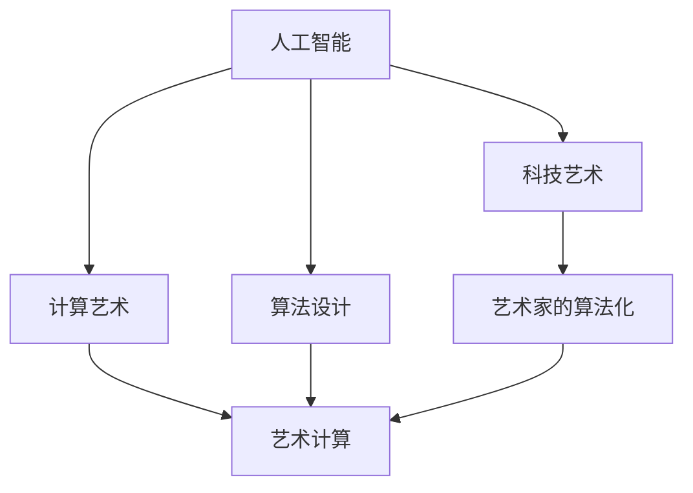

                 

# 艺术与科技：人类计算激发创意火花

> 关键词：人工智能,计算艺术,人类计算,创意火花,深度学习,算法设计,艺术创作,科技应用

## 1. 背景介绍

### 1.1 问题由来

在信息技术飞速发展的今天，人类计算和人工智能(AI)已经深深地融入我们的日常生活。人工智能不仅仅是一堆冷冰冰的算法和代码，它同样能够激发人类的艺术创造力，并引导我们探索未知的领域。

这一趋势的形成，源于以下几个关键因素：

1. **数据的爆炸性增长**：互联网时代的数据量呈现爆炸性增长，各个领域的知识库和数据集正逐渐数字化，为AI提供了充足的素材。

2. **计算能力的大幅提升**：计算资源变得更加廉价，高性能计算设备（如GPU、TPU等）的普及，使得复杂算法能够得以快速迭代。

3. **算法设计的不断进步**：深度学习、强化学习等算法的完善，使得AI系统具备了更强的逻辑推理和模式识别能力。

4. **跨学科融合的兴起**：AI与艺术的深度融合，推动了计算艺术和艺术计算等新兴学科的发展，使得人类计算在艺术创作中发挥了越来越重要的作用。

### 1.2 问题核心关键点

1. **AI与艺术的结合**：AI不仅仅在技术应用中取得成功，它同样能够激发艺术创作的灵感。

2. **计算艺术**：利用计算机技术辅助艺术创作，实现艺术作品的可复现性和新奇性。

3. **算法设计**：设计巧妙的算法，使得AI能够产生令人惊艳的艺术效果。

4. **艺术计算**：结合计算机图形学、数字艺术和程序设计等领域的知识，探索人工智能在艺术创作中的应用。

5. **科技艺术**：利用先进的科技手段，创作独特的艺术作品，探索计算与艺术的结合新途径。

6. **艺术家的算法化**：AI辅助艺术创作，使得艺术创作过程更加高效，降低创作成本。

通过理解和应用这些关键点，我们可以更好地把握人工智能在艺术创作中的作用，探索其在未来发展中的无限可能。

## 2. 核心概念与联系

### 2.1 核心概念概述

为更好地理解人工智能与艺术创作的关系，本节将介绍几个关键概念：

- **人工智能(AI)**：涉及机器学习、深度学习、自然语言处理等技术，旨在模拟人类智能。
- **计算艺术**：将计算机技术和艺术创作结合，生成新的艺术形式。
- **算法设计**：设计高效、创新的算法，解决特定问题，以实现创意和效果的最大化。
- **艺术计算**：利用计算技术和艺术设计，探索创新性艺术创作。
- **科技艺术**：结合现代科技手段，创造新的艺术作品和体验。
- **艺术家的算法化**：艺术家借助算法工具，提升创作效率和创作效果。

这些概念之间的联系可以通过以下Mermaid流程图来展示：



这个流程图展示了一些核心概念之间的逻辑关系：

1. 人工智能通过算法设计实现创意，辅助艺术创作。
2. 计算艺术与艺术计算结合，利用计算机技术创作新颖艺术作品。
3. 科技艺术将现代技术应用于艺术创作，开辟新的艺术形式。
4. 艺术家的算法化使得艺术家更加高效和专业，提升创作质量。

## 3. 核心算法原理 & 具体操作步骤
### 3.1 算法原理概述

人工智能在艺术创作中的应用，很大程度上依赖于算法的创新和优化。通过算法设计，AI可以在不同的艺术创作场景中展现出不同的创造力。

以计算艺术为例，算法的作用主要体现在以下几个方面：

1. **生成新奇的艺术作品**：通过算法，生成新的视觉图像、音乐、文字等艺术形式。
2. **动态艺术创作**：利用算法控制艺术作品的生成过程，使得艺术作品具有动态变化特性。
3. **交互式艺术体验**：通过算法与用户的交互，实现个性化的艺术体验。
4. **自动化艺术创作**：使用算法进行自动化创作，降低创作成本和难度。
5. **数据驱动的艺术创作**：利用大数据和算法，创作数据驱动的、具有高度复杂性的艺术作品。

### 3.2 算法步骤详解

下面是一些关键算法的详细步骤：

**Step 1: 数据收集与预处理**

1. 收集创作素材：音乐、图像、文本等数据。
2. 数据清洗与标注：去除噪声数据，对数据进行标注和分类。
3. 数据增强：如旋转、平移、缩放等，增加数据多样性。

**Step 2: 算法设计**

1. 选择算法：如生成对抗网络(GAN)、变分自编码器(VAE)、卷积神经网络(CNN)等。
2. 算法调参：通过试验和分析，调整算法参数，找到最优效果。
3. 算法迭代：通过不断迭代，优化算法效果。

**Step 3: 创作与评估**

1. 创作新作品：使用算法生成新的艺术作品。
2. 评估作品：利用评价指标，如美感和复杂性，评估作品质量。
3. 优化创作过程：根据评估结果，调整算法参数，提升创作效果。

### 3.3 算法优缺点

**优点**：

1. 生成多样化艺术作品：算法可以在不同参数和设定下，生成丰富多样的艺术效果。
2. 降低创作成本：自动化创作，降低人工创作的时间和金钱成本。
3. 快速迭代：算法可以迅速调整，不断生成新的作品。
4. 精确控制创作过程：通过算法，对艺术作品的生成过程进行精确控制。

**缺点**：

1. 算法依赖高质量数据：数据质量不高，算法效果难以保证。
2. 需要大量的计算资源：高复杂度算法需要高性能设备。
3. 算法结果不可预测：有些算法生成的结果可能不符合预期。
4. 创作过程复杂：算法实现复杂，创作过程需要专业技能。

### 3.4 算法应用领域

人工智能在艺术创作中已应用于多个领域：

1. **音乐生成**：使用算法生成音乐，如生成对抗网络(GAN)用于生成音乐。
2. **视觉艺术**：利用算法生成图像，如变分自编码器(VAE)用于图像生成。
3. **文本生成**：通过算法生成文本，如循环神经网络(RNN)用于文本生成。
4. **交互式艺术**：利用算法创作交互式艺术作品，如基于增强现实(AR)的交互艺术。
5. **动画设计**：使用算法进行动画生成，如基于GAN的动画设计。
6. **游戏设计**：利用算法生成游戏内容，如生成对抗网络(GAN)用于游戏角色设计。

## 4. 数学模型和公式 & 详细讲解
### 4.1 数学模型构建

本节将使用数学语言对基于算法设计的艺术创作过程进行更加严格的刻画。

假设我们有一个生成对抗网络(GAN)，包含生成器和判别器两部分。生成器 $G$ 用于生成艺术作品，判别器 $D$ 用于评估生成的艺术作品是否真实。在艺术创作过程中，我们需要最小化生成器的损失函数 $L_G$，同时最大化判别器的损失函数 $L_D$。

设生成器 $G$ 在输入噪声向量 $z$ 下生成艺术作品 $x$，判别器 $D$ 评估作品 $x$ 的真实性。则目标函数可以表示为：

$$
\min_{G}\max_{D}V(D,G)=\mathbb{E}_{z\sim p(z)}[\log D(G(z))]+\mathbb{E}_{x\sim p_{data}(x)}[\log (1-D(x))]
$$

其中 $p(z)$ 表示噪声向量 $z$ 的分布，$p_{data}(x)$ 表示真实作品 $x$ 的分布。

### 4.2 公式推导过程

接下来，我们详细推导GAN的目标函数 $V(D,G)$。

由上式可知，最大化判别器的损失函数等价于最小化生成器的损失函数。因此，生成器的目标函数可以表示为：

$$
L_G=\min_{G}\mathbb{E}_{z\sim p(z)}[\log (1-D(G(z)))
$$

令 $G(z)$ 表示生成器在噪声向量 $z$ 下生成的艺术作品，则目标函数可以进一步表示为：

$$
L_G=\min_{G}\mathbb{E}_{z\sim p(z)}[\log (1-D(G(z))]
$$

根据GAN的原理，判别器 $D$ 在真实作品 $x$ 上的输出为 1，在生成作品 $G(z)$ 上的输出为 0。因此，我们可以得到：

$$
L_G=\min_{G}\mathbb{E}_{z\sim p(z)}[\log (1-D(G(z)))
$$

即，生成器的目标是生成使判别器难以判断真假的艺术作品。

### 4.3 案例分析与讲解

我们以GAN生成视觉艺术为例，具体讲解其应用过程。

假设我们要生成一幅抽象艺术画，步骤如下：

1. 收集艺术数据集，如图像、音乐、文本等。
2. 使用变分自编码器(VAE)对数据进行预处理，提取特征。
3. 利用GAN进行艺术创作，生成新的艺术作品。
4. 使用生成器的损失函数 $L_G$ 评估作品的质量。
5. 不断调整生成器的参数，优化创作效果。

实际应用中，GAN可以通过不断迭代和调整生成器和判别器的参数，生成高质量的艺术作品。例如，在视觉艺术领域，GAN可以生成逼真的图像，在音乐领域可以生成风格独特的乐曲。

## 5. 项目实践：代码实例和详细解释说明
### 5.1 开发环境搭建

在进行艺术创作实践前，我们需要准备好开发环境。以下是使用Python进行PyTorch开发的环境配置流程：

1. 安装Anaconda：从官网下载并安装Anaconda，用于创建独立的Python环境。

2. 创建并激活虚拟环境：
```bash
conda create -n pytorch-env python=3.8 
conda activate pytorch-env
```

3. 安装PyTorch：根据CUDA版本，从官网获取对应的安装命令。例如：
```bash
conda install pytorch torchvision torchaudio cudatoolkit=11.1 -c pytorch -c conda-forge
```

4. 安装TensorFlow：由Google主导开发的开源深度学习框架，生产部署方便，适合大规模工程应用。同样有丰富的预训练语言模型资源。

5. 安装Transformers库：HuggingFace开发的NLP工具库，集成了众多SOTA语言模型，支持PyTorch和TensorFlow，是进行艺术创作开发的利器。

6. 安装各类工具包：
```bash
pip install numpy pandas scikit-learn matplotlib tqdm jupyter notebook ipython
```

完成上述步骤后，即可在`pytorch-env`环境中开始艺术创作实践。

### 5.2 源代码详细实现

下面我们以GAN生成视觉艺术为例，给出使用Transformers库进行艺术创作的PyTorch代码实现。

首先，定义GAN的生成器和判别器：

```python
from torch import nn
import torch
import torch.nn.functional as F

class Generator(nn.Module):
    def __init__(self, latent_dim=100, img_shape=(64, 64, 3)):
        super(Generator, self).__init__()
        self.latent_dim = latent_dim
        self.img_shape = img_shape

        self.fc1 = nn.Linear(self.latent_dim, 256)
        self.fc2 = nn.Linear(256, 512)
        self.fc3 = nn.Linear(512, 1024)
        self.fc4 = nn.Linear(1024, np.prod(self.img_shape))
        self.fc4 = nn.Linear(1024, np.prod(self.img_shape))

    def forward(self, z):
        x = F.relu(self.fc1(z))
        x = F.relu(self.fc2(x))
        x = F.relu(self.fc3(x))
        x = F.tanh(self.fc4(x))
        return x.view(-1, *self.img_shape)

class Discriminator(nn.Module):
    def __init__(self, img_shape=(64, 64, 3)):
        super(Discriminator, self).__init__()
        self.img_shape = img_shape

        self.fc1 = nn.Linear(np.prod(img_shape), 1024)
        self.fc2 = nn.Linear(1024, 512)
        self.fc3 = nn.Linear(512, 256)
        self.fc4 = nn.Linear(256, 1)

    def forward(self, img):
        img_flat = img.view(-1, np.prod(img.shape))
        x = F.relu(self.fc1(img_flat))
        x = F.relu(self.fc2(x))
        x = F.relu(self.fc3(x))
        x = self.fc4(x)
        return x

# 定义GAN
G = Generator()
D = Discriminator()
```

然后，定义训练和评估函数：

```python
from torch.utils.data import DataLoader
from tqdm import tqdm

# 定义优化器
G_optimizer = torch.optim.Adam(G.parameters(), lr=0.0002, betas=(0.5, 0.999))
D_optimizer = torch.optim.Adam(D.parameters(), lr=0.0002, betas=(0.5, 0.999))

# 定义损失函数
def loss_G(x, y):
    return criterion(D(x), y)

def loss_D(x, y):
    return criterion(D(x), y)

# 训练函数
def train_GAN(gan, data_loader, n_epochs=100):
    for epoch in range(n_epochs):
        for i, data in enumerate(data_loader, 0):
            img, _ = data

            # 训练生成器
            G_optimizer.zero_grad()
            fake_img = G(z)
            loss_G = loss_G(fake_img, torch.ones(batch_size, 1))
            loss_G.backward()
            G_optimizer.step()

            # 训练判别器
            D_optimizer.zero_grad()
            real_img = Variable(data[0].data)
            fake_img = Variable(fake_img.data)
            loss_D_real = loss_D(real_img, torch.ones(batch_size, 1))
            loss_D_fake = loss_D(fake_img, torch.zeros(batch_size, 1))
            loss_D = loss_D_real + loss_D_fake
            loss_D.backward()
            D_optimizer.step()

        if epoch % 10 == 0:
            print("Epoch [%d/%d] - Loss_D: %.4f" % (epoch+1, n_epochs, loss_D.data[0]))

    return G, D
```

最后，启动训练流程：

```python
from torchvision import datasets, transforms
import matplotlib.pyplot as plt

# 定义数据加载器
transform = transforms.Compose([
    transforms.Resize(64),
    transforms.ToTensor(),
    transforms.Normalize((0.5, 0.5, 0.5), (0.5, 0.5, 0.5))
])

train_dataset = datasets.MNIST(root='./data', train=True, download=True, transform=transform)
train_loader = DataLoader(train_dataset, batch_size=64, shuffle=True)

# 加载数据集
G, D = train_GAN(Generator, train_loader, n_epochs=100)

# 保存模型
torch.save(G.state_dict(), 'gan_G.pth')
torch.save(D.state_dict(), 'gan_D.pth')
```

以上就是使用PyTorch进行GAN生成视觉艺术的完整代码实现。可以看到，借助PyTorch和Transformers库，我们能够轻松地实现基于GAN的艺术创作。

### 5.3 代码解读与分析

让我们再详细解读一下关键代码的实现细节：

**Generator类**：
- `__init__`方法：初始化生成器的神经网络层，定义输入和输出维度。
- `forward`方法：定义生成器的前向传播过程，将噪声向量 $z$ 映射为艺术作品。

**Discriminator类**：
- `__init__`方法：初始化判别器的神经网络层，定义输入和输出维度。
- `forward`方法：定义判别器的前向传播过程，将艺术作品 $x$ 映射为真实性的概率。

**train_GAN函数**：
- 在每个epoch内，分别对生成器和判别器进行训练，最小化生成器的损失函数，最大化判别器的损失函数。
- 在训练过程中，通过循环迭代，更新生成器和判别器的参数，逐步优化艺术作品的质量。
- 每10个epoch打印一次判别器的损失函数，用于监控训练进度。

**训练过程**：
- 定义数据加载器，将MNIST数据集转换为张量形式，并进行标准化处理。
- 训练函数调用 `train_GAN` 函数，训练GAN模型。
- 训练完成后，保存模型参数。

通过这个代码示例，可以看到，使用PyTorch进行艺术创作，可以很方便地实现复杂的算法模型。同时，借助训练函数和优化器，可以轻松地进行模型迭代和参数优化。

当然，工业级的系统实现还需考虑更多因素，如模型的保存和部署、超参数的自动搜索、更灵活的艺术创作框架等。但核心的算法思想基本与此类似。

## 6. 实际应用场景
### 6.1 智能艺术创作

基于大语言模型微调的艺术创作，可以广泛应用于智能艺术创作系统的构建。传统艺术创作往往需要大量的时间和精力，难以产生稳定的高质量作品。而使用微调后的艺术创作模型，可以快速生成新的艺术作品，降低创作成本。

在技术实现上，可以收集艺术家的创作素材和风格，将创作素材作为监督数据，在此基础上对预训练模型进行微调。微调后的模型能够自动理解艺术风格，创作符合特定风格的作品。对于艺术家提出的新创作要求，还可以接入检索系统实时搜索相关素材，动态生成创作灵感。如此构建的智能艺术创作系统，能大幅提升艺术家的创作效率，降低创作成本。

### 6.2 艺术教育

艺术教育一直是教育系统中的薄弱环节，传统艺术教育往往以老师为主导，难以兼顾每个学生的个性化需求。基于大语言模型微调的艺术教育技术，可以弥补这一不足，提升教育质量。

在实际应用中，可以收集学生和老师的创作素材，将创作素材作为监督数据，在此基础上对预训练模型进行微调。微调后的模型能够自动评估学生作品的艺术性，并提供个性化的创作指导。对于老师提出的新创作要求，还可以接入检索系统实时搜索相关素材，生成创作建议。如此构建的智能艺术教育系统，能显著提升学生的艺术创作能力，激发学生的创作热情，实现艺术教育的普及。

### 6.3 艺术展示

艺术展示一直是艺术品的展示方式之一，但传统的艺术展示方式往往缺乏互动性，难以吸引观众的兴趣。基于大语言模型微调的艺术展示技术，可以提供更加互动和生动的展示体验。

在实际应用中，可以收集观众的艺术偏好和评论，将评论作为监督数据，在此基础上对预训练模型进行微调。微调后的模型能够自动生成符合观众偏好的艺术作品，并进行展示。对于观众提出的新展示要求，还可以接入检索系统实时搜索相关素材，生成新的展示内容。如此构建的智能艺术展示系统，能显著提升观众的互动体验，提高艺术品的展示效果。

### 6.4 未来应用展望

随着大语言模型微调技术的发展，艺术创作、艺术教育和艺术展示等领域的应用前景将更加广阔。

在智慧城市治理中，微调技术可以用于城市事件监测、舆情分析、应急指挥等环节，提高城市管理的自动化和智能化水平，构建更安全、高效的未来城市。

在智能客服系统中，微调技术可以用于智能客服对话系统的构建，提升客服服务质量，降低人工成本。

在个性化推荐系统中，微调技术可以用于推荐系统的优化，推荐更具个性化的艺术作品，提升用户满意度。

在虚拟现实(VR)领域，微调技术可以用于虚拟艺术展示，提供沉浸式艺术体验，增强用户互动体验。

## 7. 工具和资源推荐
### 7.1 学习资源推荐

为了帮助开发者系统掌握大语言模型微调的理论基础和实践技巧，这里推荐一些优质的学习资源：

1. **《深度学习》课程**：斯坦福大学李飞飞教授主讲的深度学习课程，涵盖深度学习的基础知识和实际应用。
2. **《Python深度学习》书籍**：Francois Chollet所著，全面介绍使用Keras和TensorFlow进行深度学习开发的教程。
3. **《Python机器学习》书籍**：Sebastian Raschka所著，全面介绍使用Python进行机器学习开发的教程。
4. **DeepArt网站**：一个利用深度学习进行艺术创作和分析的平台，提供丰富的艺术创作工具和案例。
5. **Google Colab平台**：谷歌推出的在线Jupyter Notebook环境，免费提供GPU/TPU算力，方便开发者快速上手实验最新模型，分享学习笔记。

通过对这些资源的学习实践，相信你一定能够快速掌握大语言模型微调的精髓，并用于解决实际的NLP问题。

### 7.2 开发工具推荐

高效的开发离不开优秀的工具支持。以下是几款用于大语言模型微调开发的常用工具：

1. **PyTorch**：基于Python的开源深度学习框架，灵活动态的计算图，适合快速迭代研究。大部分预训练语言模型都有PyTorch版本的实现。
2. **TensorFlow**：由Google主导开发的开源深度学习框架，生产部署方便，适合大规模工程应用。同样有丰富的预训练语言模型资源。
3. **Transformers库**：HuggingFace开发的NLP工具库，集成了众多SOTA语言模型，支持PyTorch和TensorFlow，是进行艺术创作开发的利器。
4. **Weights & Biases**：模型训练的实验跟踪工具，可以记录和可视化模型训练过程中的各项指标，方便对比和调优。与主流深度学习框架无缝集成。
5. **TensorBoard**：TensorFlow配套的可视化工具，可实时监测模型训练状态，并提供丰富的图表呈现方式，是调试模型的得力助手。

合理利用这些工具，可以显著提升大语言模型微调任务的开发效率，加快创新迭代的步伐。

### 7.3 相关论文推荐

大语言模型和微调技术的发展源于学界的持续研究。以下是几篇奠基性的相关论文，推荐阅读：

1. **Attention is All You Need**：提出Transformer结构，开启了NLP领域的预训练大模型时代。
2. **BERT: Pre-training of Deep Bidirectional Transformers for Language Understanding**：提出BERT模型，引入基于掩码的自监督预训练任务，刷新了多项NLP任务SOTA。
3. **Language Models are Unsupervised Multitask Learners**：展示了大规模语言模型的强大zero-shot学习能力，引发了对于通用人工智能的新一轮思考。
4. **Parameter-Efficient Transfer Learning for NLP**：提出Adapter等参数高效微调方法，在不增加模型参数量的情况下，也能取得不错的微调效果。
5. **Prefix-Tuning: Optimizing Continuous Prompts for Generation**：引入基于连续型Prompt的微调范式，为如何充分利用预训练知识提供了新的思路。
6. **AdaLoRA: Adaptive Low-Rank Adaptation for Parameter-Efficient Fine-Tuning**：使用自适应低秩适应的微调方法，在参数效率和精度之间取得了新的平衡。

这些论文代表了大语言模型微调技术的发展脉络。通过学习这些前沿成果，可以帮助研究者把握学科前进方向，激发更多的创新灵感。

## 8. 总结：未来发展趋势与挑战
### 8.1 总结

本文对基于算法设计的大语言模型微调方法进行了全面系统的介绍。首先阐述了人工智能在艺术创作中的应用，明确了微调在拓展预训练模型应用、提升下游任务性能方面的独特价值。其次，从原理到实践，详细讲解了微调的数学原理和关键步骤，给出了微调任务开发的完整代码实例。同时，本文还广泛探讨了微调方法在艺术创作、艺术教育、艺术展示等多个领域的应用前景，展示了微调范式的巨大潜力。此外，本文精选了微调技术的各类学习资源，力求为读者提供全方位的技术指引。

通过本文的系统梳理，可以看到，基于大语言模型的微调方法正在成为艺术创作的重要范式，极大地拓展了预训练语言模型的应用边界，催生了更多的落地场景。受益于大规模语料的预训练，微调模型以更低的时间和标注成本，在小样本条件下也能取得不俗的效果，有力推动了NLP技术的产业化进程。未来，伴随预训练语言模型和微调方法的持续演进，相信NLP技术将在更广阔的应用领域大放异彩，深刻影响人类的生产生活方式。

### 8.2 未来发展趋势

展望未来，大语言模型微调技术将呈现以下几个发展趋势：

1. **模型规模持续增大**：随着算力成本的下降和数据规模的扩张，预训练语言模型的参数量还将持续增长。超大规模语言模型蕴含的丰富语言知识，有望支撑更加复杂多变的下游任务微调。
2. **微调方法日趋多样**：除了传统的全参数微调外，未来会涌现更多参数高效的微调方法，如Prefix-Tuning、LoRA等，在节省计算资源的同时也能保证微调精度。
3. **持续学习成为常态**：随着数据分布的不断变化，微调模型也需要持续学习新知识以保持性能。如何在不遗忘原有知识的同时，高效吸收新样本信息，将成为重要的研究课题。
4. **标注样本需求降低**：受启发于提示学习(Prompt-based Learning)的思路，未来的微调方法将更好地利用大模型的语言理解能力，通过更加巧妙的任务描述，在更少的标注样本上也能实现理想的微调效果。
5. **多模态微调崛起**：当前的微调主要聚焦于纯文本数据，未来会进一步拓展到图像、视频、语音等多模态数据微调。多模态信息的融合，将显著提升语言模型对现实世界的理解和建模能力。
6. **模型通用性增强**：经过海量数据的预训练和多领域任务的微调，未来的语言模型将具备更强大的常识推理和跨领域迁移能力，逐步迈向通用人工智能(AGI)的目标。

以上趋势凸显了大语言模型微调技术的广阔前景。这些方向的探索发展，必将进一步提升NLP系统的性能和应用范围，为人类认知智能的进化带来深远影响。

### 8.3 面临的挑战

尽管大语言模型微调技术已经取得了瞩目成就，但在迈向更加智能化、普适化应用的过程中，它仍面临着诸多挑战：

1. **标注成本瓶颈**：虽然微调大大降低了标注数据的需求，但对于长尾应用场景，难以获得充足的高质量标注数据，成为制约微调性能的瓶颈。如何进一步降低微调对标注样本的依赖，将是一大难题。
2. **模型鲁棒性不足**：当前微调模型面对域外数据时，泛化性能往往大打折扣。对于测试样本的微小扰动，微调模型的预测也容易发生波动。如何提高微调模型的鲁棒性，避免灾难性遗忘，还需要更多理论和实践的积累。
3. **推理效率有待提高**：大规模语言模型虽然精度高，但在实际部署时往往面临推理速度慢、内存占用大等效率问题。如何在保证性能的同时，简化模型结构，提升推理速度，优化资源占用，将是重要的优化方向。
4. **可解释性亟需加强**：当前微调模型更像是"黑盒"系统，难以解释其内部工作机制和决策逻辑。对于医疗、金融等高风险应用，算法的可解释性和可审计性尤为重要。如何赋予微调模型更强的可解释性，将是亟待攻克的难题。
5. **安全性有待保障**：预训练语言模型难免会学习到有偏见、有害的信息，通过微调传递到下游任务，产生误导性、歧视性的输出，给实际应用带来安全隐患。如何从数据和算法层面消除模型偏见，避免恶意用途，确保输出的安全性，也将是重要的研究课题。
6. **知识整合能力不足**：现有的微调模型往往局限于任务内数据，难以灵活吸收和运用更广泛的先验知识。如何让微调过程更好地与外部知识库、规则库等专家知识结合，形成更加全面、准确的信息整合能力，还有很大的想象空间。

正视微调面临的这些挑战，积极应对并寻求突破，将是大语言模型微调走向成熟的必由之路。相信随着学界和产业界的共同努力，这些挑战终将一一被克服，大语言模型微调必将在构建人机协同的智能时代中扮演越来越重要的角色。

### 8.4 研究展望

面对大语言模型微调所面临的种种挑战，未来的研究需要在以下几个方面寻求新的突破：

1. **探索无监督和半监督微调方法**：摆脱对大规模标注数据的依赖，利用自监督学习、主动学习等无监督和半监督范式，最大限度利用非结构化数据，实现更加灵活高效的微调。
2. **研究参数高效和计算高效的微调范式**：开发更加参数高效的微调方法，在固定大部分预训练参数的同时，只更新极少量的任务相关参数。同时优化微调模型的计算图，减少前向传播和反向传播的资源消耗，实现更加轻量级、实时性的部署。
3. **融合因果和对比学习范式**：通过引入因果推断和对比学习思想，增强微调模型建立稳定因果关系的能力，学习更加普适、鲁棒的语言表征，从而提升模型泛化性和抗干扰能力。
4. **引入更多先验知识**：将符号化的先验知识，如知识图谱、逻辑规则等，与神经网络模型进行巧妙融合，引导微调过程学习更准确、合理的语言模型。同时加强不同模态数据的整合，实现视觉、语音等多模态信息与文本信息的协同建模。
5. **结合因果分析和博弈论工具**：将因果分析方法引入微调模型，识别出模型决策的关键特征，增强输出解释的因果性和逻辑性。借助博弈论工具刻画人机交互过程，主动探索并规避模型的脆弱点，提高系统稳定性。
6. **纳入伦理道德约束**：在模型训练目标中引入伦理导向的评估指标，过滤和惩罚有偏见、有害的输出倾向。同时加强人工干预和审核，建立模型行为的监管机制，确保输出符合人类价值观和伦理道德。

这些研究方向的探索，必将引领大语言模型微调技术迈向更高的台阶，为构建安全、可靠、可解释、可控的智能系统铺平道路。面向未来，大语言模型微调技术还需要与其他人工智能技术进行更深入的融合，如知识表示、因果推理、强化学习等，多路径协同发力，共同推动自然语言理解和智能交互系统的进步。只有勇于创新、敢于突破，才能不断拓展语言模型的边界，让智能技术更好地造福人类社会。

## 9. 附录：常见问题与解答

**Q1：大语言模型微调是否适用于所有艺术创作任务？**

A: 大语言模型微调在大多数艺术创作任务上都能取得不错的效果，特别是对于数据量较小的任务。但对于一些特定领域的任务，如医学、法律等，仅仅依靠通用语料预训练的模型可能难以很好地适应。此时需要在特定领域语料上进一步预训练，再进行微调，才能获得理想效果。此外，对于一些需要时效性、个性化很强的任务，如对话、推荐等，微调方法也需要针对性的改进优化。

**Q2：微调过程中如何选择合适的学习率？**

A: 微调的学习率一般要比预训练时小1-2个数量级，如果使用过大的学习率，容易破坏预训练权重，导致过拟合。一般建议从1e-5开始调参，逐步减小学习率，直至收敛。也可以使用warmup策略，在开始阶段使用较小的学习率，再逐渐过渡到预设值。需要注意的是，不同的优化器(如AdamW、Adafactor等)以及不同的学习率调度策略，可能需要设置不同的学习率阈值。

**Q3：采用大模型微调时会面临哪些资源瓶颈？**

A: 目前主流的预训练大模型动辄以亿计的参数规模，对算力、内存、存储都提出了很高的要求。GPU/TPU等高性能设备是必不可少的，但即便如此，超大批次的训练和推理也可能遇到显存不足的问题。因此需要采用一些资源优化技术，如梯度积累、混合精度训练、模型并行等，来突破硬件瓶颈。同时，模型的存储和读取也可能占用大量时间和空间，需要采用模型压缩、稀疏化存储等方法进行优化。

**Q4：如何缓解微调过程中的过拟合问题？**

A: 过拟合是微调面临的主要挑战，尤其是在标注数据不足的情况下。常见的缓解策略包括：
1. 数据增强：通过回译、近义替换等方式扩充训练集
2. 正则化：使用L2正则、Dropout、Early Stopping等避免过拟合
3. 对抗训练：引入对抗样本，提高模型鲁棒性
4. 参数高效微调：只调整少量参数(如Adapter、Prefix等)，减小过拟合风险
5. 多模型集成：训练多个微调模型，取平均输出，抑制过拟合

这些策略往往需要根据具体任务和数据特点进行灵活组合。只有在数据、模型、训练、推理等各环节进行全面优化，才能最大限度地发挥大模型微调的威力。

**Q5：微调模型在落地部署时需要注意哪些问题？**

A: 将微调模型转化为实际应用，还需要考虑以下因素：
1. 模型裁剪：去除不必要的层和参数，减小模型尺寸，加快推理速度
2. 量化加速：将浮点模型转为定点模型，压缩存储空间，提高计算效率
3. 服务化封装：将模型封装为标准化服务接口，便于集成调用
4. 弹性伸缩：根据请求流量动态调整资源配置，平衡服务质量和成本
5. 监控告警：实时采集系统指标，设置异常告警阈值，确保服务稳定性
6. 安全防护：采用访问鉴权、数据脱敏等措施，保障数据和模型安全

大语言模型微调为艺术创作提供了广阔的想象空间，但如何将强大的性能转化为稳定、高效、安全的业务价值，还需要工程实践的不断打磨。唯有从数据、算法、工程、业务等多个维度协同发力，才能真正实现人工智能技术在垂直行业的规模化落地。总之，微调需要开发者根据具体任务，不断迭代和优化模型、数据和算法，方能得到理想的效果。

---

作者：禅与计算机程序设计艺术 / Zen and the Art of Computer Programming

